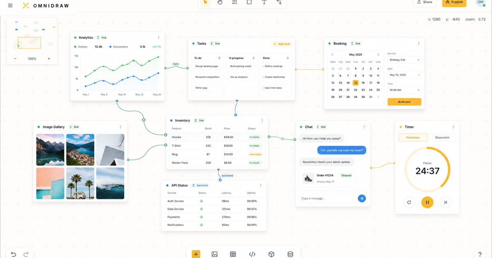

# Omnidraw

Run your agents in an infinite drawing canvas.

Runs completly local. Reuses your llm subscriptions.



The project is organized as a monorepo and follows a **Functional Core / Imperative Shell** architecture.

## Features

- Infinite canvas UI for drawing, selecting, transforming, and grouping elements
- Canvas CLI for list/query/add/patch/move/group/ungroup/delete/reorder flows
- Agents can edit canvases too by calling the same CLI commands
- Server-authoritative real-time canvas collaboration with atomic revisions
- Unified WebSocket API endpoint for canvas events and app RPC (`/api`)
- Native binary distribution for macOS, Linux, and Windows
- Auto-update checks in the CLI/server runtime

## Quick Start

### Install globally

```bash
# bun
bun add -g omnidraw

# npm
npm i -g omnidraw

# pnpm
pnpm add -g omnidraw

# yarn
yarn global add omnidraw
```

Then run:

```bash
omnidraw
```

Open [http://localhost:7496](http://localhost:7496) to use the app.

You can edit the canvas from the UI, or from the CLI. Agents can use the same canvas CLI surface for scripted canvas changes.

The Omnidraw skill for agents lives here:
- https://github.com/omnidraw/skills

For common setup/runtime questions, see the FAQ:

- https://omnidraw.dev/docs/faq

### Upgrade omnidraw

Omnidraw includes a built-in upgrade command from the server CLI (`apps/server/src/main.ts`).

```bash
# check for updates and install
omnidraw upgrade

# check only (no install)
omnidraw upgrade --check
```

Useful related commands:

```bash
omnidraw --version
omnidraw --help
omnidraw canvas --help
```

### Uninstall

```bash
# bun
bun remove -g omnidraw

# npm
npm uninstall -g omnidraw

# pnpm
pnpm remove -g omnidraw

# yarn
yarn global remove omnidraw
```

To remove the curl-installed binary and local Omnidraw config/data/state/cache:

```bash
omnidraw uninstall --dry-run
omnidraw uninstall --yes
```

Also remove any PATH line you added for `~/.omnidraw/bin` in your shell profile (`~/.zshrc`, `~/.bashrc`, `~/.profile`, or fish config).

## Database

- Omnidraw keeps one home at `~/.omnidraw`; its primary Turso database is `~/.omnidraw/main.db`.
- `--data-dir <path>` selects another home and takes precedence over `OMNIDRAW_HOME`.
- Relative overrides resolve once against the process working directory; `~` is not expanded in overrides.
- Legacy `OMNIDRAW_CONFIG`, `OMNIDRAW_DB`, and `XDG_*` variables no longer select application storage.
- Actor-era and unknown non-empty homes or databases are refused without mutation. Select a fresh home and archive old data manually.
- The strict baseline schema is `packages/service-db/src/migrations/000-initial.sql`.

## Debugging the live app

The canvas runtime includes a built-in debug logger that can be enabled per plugin or per service from the browser devtools console.

Debug keys use this format:

```txt
omnidraw:debug:<plugin|service>:<name>
```

Levels:
- `0`, `false`, `off`, or empty = disabled
- `1` = important lifecycle logs
- `2` = more detailed state/layout logs
- `3` = very noisy per-frame/per-event logs

Examples:

```js
// hosted component plugin logs
localStorage.setItem("omnidraw:debug:plugin:hosted-component", "3")

// camera service logs
localStorage.setItem("omnidraw:debug:service:camera", "1")
```

Then reload the page and inspect the browser console.

To turn a target back off:

```js
localStorage.setItem("omnidraw:debug:plugin:hosted-component", "0")
```

Current log output includes prefixes like:

```txt
[omnidraw][plugin:hosted-component][L2] ...
```

This is especially useful for debugging live layout, overlay, hydration, transform, and mount issues inside the running app.

## Contributing

Contributions are welcome.

**By submitting a pull request, you agree to transfer ownership of your contribution to the project maintainer.** This allows the project to be re-licensed or otherwise managed without needing to contact every individual contributor.

Recommended workflow:
1. Create a branch from `main`.
2. Make focused changes with tests.
3. Run relevant checks (`bun test`, package-specific tests, and build checks if needed).
4. Open a pull request with a clear summary.

For implementation conventions and deeper subsystem docs, read:
- `CLAUDE.md`
- `apps/spa/CLAUDE.md`
- `apps/spa/src/features/canvas-crdt/CLAUDE.md`
- `apps/spa/src/features/canvas-crdt/canvas/CLAUDE.md`
- `apps/spa/src/features/canvas-crdt/input-commands/CLAUDE.md`
- `apps/spa/src/features/canvas-crdt/managers/CLAUDE.md`
- `apps/spa/src/features/canvas-crdt/renderables/CLAUDE.md`

## License

MIT. See `LICENSE`.
