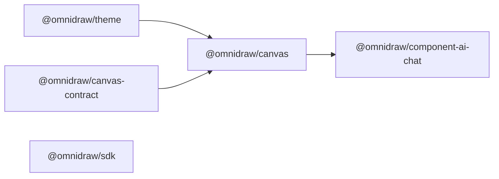
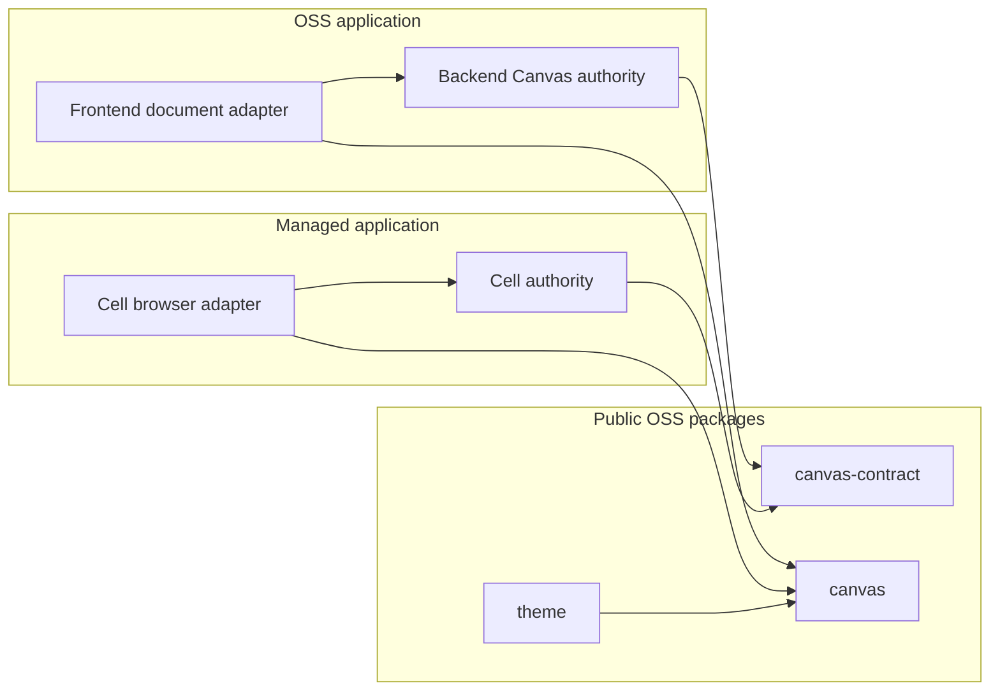
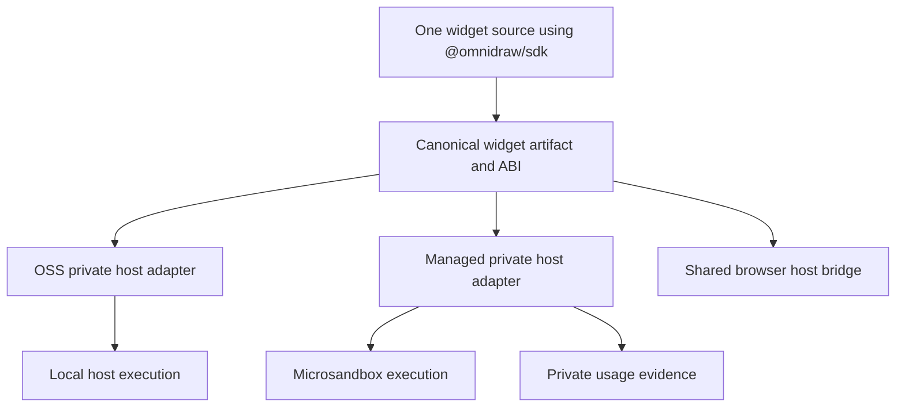
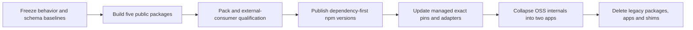

# Omnidraw OSS Monorepo and Managed Integration Redesign

## Status

- **Document type:** Product requirements document
- **Scope:** Omnidraw OSS repository and its public integration boundary with the private managed repository
- **Database impact:** None. The existing OSS database schema must remain unchanged.
- **Primary outcome:** Reduce the OSS workspace to two applications and five public packages while preserving existing product behavior and enabling the managed service to consume Canvas without importing OSS implementation details.

## 1. Context

Omnidraw OSS currently exposes more applications, packages, runtime abstractions, and test shells than are needed by either the OSS product or the managed service. Canvas is already usable through injected host dependencies, but its surrounding package surface remains too broad. Several packages mix portable contracts, application implementation, runtime orchestration, transport, and product UI.

The managed product is not a hosted deployment of the OSS application. It is a separate implementation that reuses selected public OSS packages. In particular:

- The managed Cell renders `@omnidraw/canvas` and injects its own document transport and host capabilities.
- Managed backend code must be able to depend on the Canvas contract without acquiring Solid, browser, storage, or OSS server implementation dependencies.
- Widget code and artifacts must remain portable between OSS and managed.
- OSS runs local widget server and function code on the host.
- Managed runs untrusted builds, functions, and coding commands through Microsandbox and records usage evidence privately.
- The two repositories are works in progress and must be able to coevolve through explicit, versioned public contracts.

This redesign adopts Effect v4 for private application orchestration and transport, an imperative shell around a functional core, and backend deterministic simulation testing. It does not move Effect into the public package API.

Two external runtimes sit behind the public Omnidraw APIs:

- `@omnidraw/cangine` is the rendering engine used by `@omnidraw/canvas`. It is an implementation dependency and must not define the public persisted Canvas format.
- `@omnidraw/capsule` is the browser widget isolation and guest-channel runtime used behind `@omnidraw/sdk`. Widget authors use Omnidraw SDK entrypoints rather than importing Capsule directly.

## 2. Goals

1. Reduce the final OSS workspace to exactly two applications and five publishable packages.
2. Give the managed Cell the smallest practical, implementation-free Canvas integration boundary.
3. Keep the same widget source and artifact ABI usable in OSS and managed.
4. Move private behavior to the application that owns it instead of publishing internal services as workspace packages.
5. Replace the custom runtime, Tapable orchestration, and oRPC with Effect v4 services, Layers, and private transport.
6. Separate backend business rules from drivers and mutable infrastructure through `core`, `shell`, and `sim` boundaries.
7. Add deterministic backend simulation and shared live/sim conformance scenarios.
8. Preserve all current OSS product behavior except compiled-binary distribution.
9. Preserve the OSS database schema, migration identity, data layout, indexes, constraints, and recovery behavior exactly.
10. Establish a contract-first release train so managed can migrate to new public package versions before legacy OSS boundaries are deleted.
11. Make the persisted Canvas payload format an Omnidraw-owned, versioned contract rather than an implicit Cangine type graph.

## 3. Non-goals

- Hosting the OSS application as the managed product.
- Sharing private backend implementations between OSS and managed.
- Unifying the OSS and managed database schemas.
- Adding managed authentication, tenancy, billing, or usage-meter policy to OSS packages.
- Running browser UI code inside Microsandbox. Microsandbox covers managed untrusted builds, functions, and coding commands; browser widget UI continues through the browser host bridge.
- Re-proving Capsule's React, Three, or other framework compatibility in this repository. Capsule owns that evidence in its own repository; Omnidraw verifies only its SDK and host ABI against Capsule.
- Redesigning existing screens or product workflows.
- Maintaining permanent compatibility packages or aliases for retired package names.
- Exposing Cangine, Capsule, Solid, Effect, or transport-owned types through Omnidraw contract APIs unless a dependency policy below explicitly permits it.
- Preserving compiled-binary production, embedded binary assets, native-addon packaging, or binary updater behavior.
- Placing Effect types, Layers, transports, or services in public package interfaces.

## 4. Users and Consumers

### OSS user and operator

Runs the Solid frontend and Bun backend from source or a normal deployment. Existing Canvas, AI, resource, widget, Preview inspection, server, and CLI behavior must continue to work.

### Widget author

Imports `@omnidraw/sdk`, authors a widget once, and expects the same manifest, artifact, browser ABI, server APIs, and function-client APIs to work in OSS and managed.

### Managed Cell engineer

Imports Canvas and its public UI dependencies, supplies managed document and host adapters, and does not depend on OSS application code.

### Managed backend engineer

Imports `@omnidraw/canvas-contract` to implement managed Canvas authority and transport behavior without importing Solid, browser code, reducers, storage implementations, or OSS runtime code.

### Managed Frontdoor engineer

Imports the shared public theme package without acquiring Canvas, Effect, or an OSS application runtime.

## 5. Final Workspace Surface

```text
apps/
  backend/             # Bun server, source-run CLI, authorities, storage, execution
  frontend/            # Solid SPA, product UI, browser clients and adapters

packages/
  canvas-contract/     # @omnidraw/canvas-contract
  canvas/              # @omnidraw/canvas
  sdk/                 # @omnidraw/sdk
  component-ai-chat/   # @omnidraw/component-ai-chat
  theme/               # @omnidraw/theme
```

The final workspace must contain no other top-level applications or packages. Private code is colocated beneath `apps/backend` or `apps/frontend`. Only the five public packages have package-level versions and participate in npm release tooling. Both applications remain private and unversioned.

Root `scripts/` and `tests/` directories remain repository tooling, not product workspaces. The root workspace patterns are limited to `apps/*` and `packages/*`; packed-consumer projects and lint tooling must not appear as additional workspace packages.

The following applications are removed:

- `apps/capsule-browser-acceptance`
- `apps/widget-debug-tools`
- `apps/preview-inspection-shell`

`apps/cli` becomes `apps/backend`. The backend continues to expose source-run CLI commands in addition to running the server.

## 6. Public Package Requirements

### 6.1 `@omnidraw/canvas-contract`

This is the complete protocol-neutral contract required to integrate Canvas with an authority.

It owns:

- The complete serialized Canvas node and document model, including JSON value, vector, geometry, scene-node, command, query, snapshot, event, and extension types.
- Stable constants required to interpret those values.
- Strict schemas, validators, and codecs.
- Canonical serialization needed for boundary and golden tests.
- `CANVAS_DOCUMENT_FORMAT_VERSION`, the authority for the persisted JSON payload format.
- Canvas-specific semantic style token codes stored in authored nodes.
- The document transport interface implemented by OSS and managed hosts.
- Host-facing lifecycle and contribution contracts that are semantically part of Canvas integration.

It must not contain:

- Command reducers or document mutation decisions.
- Authority, authorization, persistence, or conflict-resolution implementations.
- Cangine or Theme implementation types, including type-only imports from those packages.
- Storage, HTTP, RPC, WebSocket, Effect, Solid, or browser implementations.
- Mutable runtime state or service registries.
- OSS- or managed-specific behavior.

Schemas and codecs are allowed because validation and wire interpretation are contract responsibilities. Reducers are excluded because they are authority implementation. Cangine appears only behind `@omnidraw/canvas`, which maps the Omnidraw document contract to renderer objects. Existing unversioned persisted rows are interpreted as document format `1.0.0`; adding a database column or rewriting existing rows is not permitted.

### 6.2 `@omnidraw/theme`

This package replaces `@omnidraw/theme-contract` and `@omnidraw/service-theme`.

It owns:

- Theme types and semantic color codes.
- Built-in themes.
- Pure validation and resolution.
- Isolated theme state suitable for each mounted application or Canvas.
- DOM projection and shared theme CSS support.

It must not depend on the custom runtime, Effect, application state, backend services, or transport. It is consumed by Canvas, the OSS frontend, managed Cell, and managed Frontdoor.

CSS delivery is explicit and scoped:

- `@omnidraw/theme/default.css` exports application defaults and `@omnidraw/theme/canvas.css` exports Canvas-scoped defaults.
- Importing JavaScript from the package never injects global styles or modifies the document root.
- Consumers import the stylesheet they need and apply theme variables to a caller-owned host element marked with an Omnidraw theme-scope attribute.
- CSS variables and classes use the `--omnidraw-*` and `.omnidraw-*` namespaces.
- Each Canvas root receives its own resolved variables, so two Canvases with different themes can coexist on one page.

### 6.3 `@omnidraw/canvas`

This package renders one Omnidraw Canvas.

It owns:

- The Solid Canvas renderer.
- The optimistic document client.
- Canvas-local tools, toolbar composition, extensions, and lifecycle.
- Adaptation of the public Canvas contract into Cangine rendering behavior without exposing Cangine values through public APIs.

Its host supplies:

- Canvas identity and host scope.
- A document transport for commands, queries, snapshots, and events.
- Theme access.
- Image handling.
- Notifications.
- ID generation.
- Cancellation-aware waits.
- Optional diagnostics, extensions, and toolbar contributions.
- Lifecycle retirement.

Canvas must not import an OSS backend client, database, authentication logic, managed adapter, or application store. Its injected ports use Effect-free types such as promises, async iterables, callbacks, and disposers.

`@omnidraw/cangine` is an exact direct dependency of Canvas. The initial redesign baseline is `0.6.1`. A Cangine update requires contract-adapter tests against persisted payload golden fixtures; a Cangine major does not change the public Canvas document format automatically.

The adapter is exhaustive over every authored node discriminant in `canvas-contract`. Cangine runtime-only nodes remain private and are never serialized. Adding a new authored node kind is a Canvas Contract change with its own SemVer impact; adding a renderer-only primitive is not.

### 6.4 `@omnidraw/sdk`

This package is the portable widget and function authoring surface.

It owns:

- Widget manifest and artifact schemas.
- Browser widget authoring and mount APIs.
- Widget server authoring APIs.
- Function-client authoring APIs.
- Guest channels and messages.
- Host-bridge contracts and portable helpers.
- Portable resource and capability contracts required by authored code.
- Widget build and validation commands that operate on the public artifact format.
- The Omnidraw-owned types wrapping all Capsule guest, protocol, schema, host-bridge, and build interactions used by widgets.
- Test-only conformance vectors exported from `@omnidraw/sdk/conformance`.

The same SDK-authored widget must be accepted by both products without conditional imports or separate source trees.

The SDK must not implement:

- The OSS child-process or host executor.
- The managed Microsandbox executor.
- Managed usage metering or billing policy.
- OSS database, server, or product UI behavior.
- Public API signatures that expose Capsule-owned types or require widget projects to import Capsule directly.

OSS and managed each implement private execution adapters behind the same host bridge. Managed usage collection wraps its adapter and remains invisible to widget code.

`@omnidraw/capsule` is an exact direct implementation dependency of the SDK. The initial redesign baseline is `0.14.0`. New widget scaffolds depend on and import `@omnidraw/sdk` only. A Capsule major requires SDK ABI conformance and artifact-compatibility review before the SDK dependency is updated.

The SDK does not depend on Zod or expose Zod-owned types. Its manifest, artifact, and guest-boundary validators are Omnidraw-owned deterministic functions. `defineServerFunction` accepts the structural runtime-schema capability it needs, such as `parse(unknown)`, so widget authors may independently choose Zod, Valibot, TypeBox, or a custom validator without making that library part of the Omnidraw ABI. Generated widget scaffolds do not install a schema library unless the selected example explicitly uses one.

### 6.5 `@omnidraw/component-ai-chat`

This package replaces the public portion of `@omnidraw/ui-ai-chat`.

It owns:

- The Solid AI Chat component.
- An Effect-free injected action and streaming contract.
- A small adapter that contributes AI Chat to Canvas as an extension.
- Component-level styles and portable view state.
- Package-owned request, action, stream-event, completion, cancellation, and error DTOs used by its injected port.

It excludes:

- The application sidebar.
- Widget catalog and detail pages.
- Navigation and application stores.
- Widget runtime hosting and placement authority.
- Concrete browser transport clients.
- Backend agent services.

The AI Chat DTOs are defined by `@omnidraw/component-ai-chat`; they are not generated from Effect transport, oRPC, database models, or frontend application types. Frontend shell adapters translate between private transport messages and these DTOs.

### 6.6 Package dependency rules

The public dependency graph must be acyclic:



`canvas-contract` does not depend on Cangine, Theme, Canvas, or an application. It owns the semantic token codes that appear in serialized Canvas nodes; Theme maps those codes to resolved values.

Dependency and singleton policy:

| Consumer package | Dependency | Policy |
|---|---|---|
| `canvas` | `solid-js` | Peer `^1.9.14`; development dependency at the same baseline |
| `component-ai-chat` | `solid-js` | Peer `^1.9.14`; development dependency at the same baseline |
| `canvas` | `@omnidraw/cangine` | Exact direct dependency, initially `0.6.1` |
| `sdk` | `@omnidraw/capsule` | Exact direct dependency, initially `0.14.0`; no Capsule types escape |
| Public Omnidraw package to public Omnidraw package | Named package | Exact version in staged manifests |

External-consumer qualification must prove that Canvas and AI Chat resolve the host's single Solid runtime. Cangine and Capsule are not blanket peer dependencies: each remains encapsulated by its owning package unless a future public API proposal demonstrates a required shared-instance boundary.

The five packages use independent SemVer. Only a package whose own public/runtime `src` changed is bumped. A tracked root `public-package-set.json` records one qualified exact set of the five Omnidraw package versions plus the Cangine, Capsule, and Solid versions used for qualification. Managed pins the five packages and Solid exactly according to a qualified set.

The publication order is `theme`, `canvas-contract`, and `sdk` first; `canvas` after its Theme and Contract versions exist; and `component-ai-chat` after its Canvas version exists. `public-package-set.json` is committed in OSS and attached to the corresponding release so managed can reproduce the qualified set without a workspace link.

All published `dist/package.json` files must resolve internal dependencies to exact published versions and catalog dependencies to public registry ranges. Public packages are published only from their staged `dist` directories.

## 7. Canvas Integration Boundary



Rules:

1. Managed backend code imports `@omnidraw/canvas-contract` only.
2. Managed Cell browser code imports `@omnidraw/canvas`, `@omnidraw/theme`, and optional public components.
3. Canvas is an optimistic document client; the host remains the durable authority.
4. OSS and managed may implement different transports and storage models as long as both satisfy the same contract.
5. Neither repository copies Canvas source or imports the other repository's private modules.
6. Public Canvas packages contain no authentication, tenancy, metering, persistence, or deployment policy.
7. Cangine values never cross the transport or persistence boundary; Canvas converts between Cangine and `canvas-contract` values internally.
8. `@omnidraw/canvas-contract/conformance` exports deterministic contract vectors and expected results for OSS and managed tests without exporting an authority implementation.

## 8. Widget Portability and Execution



Requirements:

- One fixture must build to one canonical artifact digest and pass in both products.
- Browser channels, manifest validation, function invocation, cancellation, and error shapes must be portable.
- OSS local execution and managed Microsandbox execution may have different operational policies but must expose the same guest-visible ABI.
- Managed metering is out-of-band from the widget contract. Widget code cannot read, modify, or depend on billing evidence.
- Managed-specific resource, tenant, authentication, and sandbox controls remain private adapters.
- Canonical widget conformance fixtures and expected guest-visible transcripts ship through `@omnidraw/sdk/conformance`; they are test-only exports and do not add a sixth package.
- Omnidraw fixtures exercise the SDK/host contract with a minimal framework-neutral widget. React, React DOM, Three, and their type packages are not repository dependencies or Omnidraw conformance-fixture dependencies.

### OSS local-execution trust model

OSS deliberately executes locally built widget server and function code on the operator's machine. This is not equivalent to the managed Microsandbox security boundary. OSS documentation, CLI output, and execution surfaces must describe this as trusted local execution and must not claim sandbox isolation. The operator is responsible for reviewing and trusting code before execution. Adding a local sandbox is outside this redesign.

### Existing widget projects

- New scaffolds import only `@omnidraw/sdk`; direct `@omnidraw/capsule` and retired Omnidraw package imports are removed from emitted projects.
- Widget validation detects imports of retired `@omnidraw/widget-contract`, `@omnidraw/resource-runtime`, `@omnidraw/function-runtime`, and `@omnidraw/runtime` entrypoints and fails with a precise migration message.
- `omnidraw-widget migrate` provides an explicit migration: it reports planned dependency and import changes by default and writes them only with `--write`. Builds never silently rewrite user projects.
- Published retired package names are marked deprecated on npm with a link to the retirement and migration guide; widget, function, and resource contract users are directed to SDK entrypoints. They are not republished as compatibility shims.

## 9. Backend Architecture

### 9.1 Directory and responsibility split

```text
apps/backend/src/
  core/           # business rules, Effect programs, semantic ports and errors
  shell/          # drivers, transport, database, processes, server and runtime
  sim/            # controlled Layers, faults, virtual services and records
  conformance/    # scenarios shared by live and simulated implementations
```

Domain folders may exist inside each layer. Feature-local logic remains beside its orchestrator using `fn.*`, `fx.*`, and `tx.*` files. A shared `/core` folder is used only when logic is genuinely shared.

### 9.2 Functional core

- `fn` functions are deterministic, state-free, and do not access runtime globals.
- `fx` functions represent impure reads as lazy Effect values.
- `tx` functions represent impure writes as lazy Effect values.
- `fx` and `tx` take zero or one serializable payload argument and acquire semantic services through Effect context.
- Semantic ports are declared with `Context.Service` and use typed domain errors.
- Core code does not call `Effect.runPromise`, construct live Layers, import framework handlers or drivers, or access the external world directly.
- Authority decisions, including Canvas command reduction, remain core implementation and do not move into public contracts.

### 9.3 Imperative shell

The shell owns:

- Turso/libSQL access and migrations.
- Effect HTTP, RPC, and Socket transport implementations.
- Bun server composition and shutdown.
- Filesystem and process execution.
- Pi agent integration.
- Local widget builds and execution.
- Preview inspection hosting and Playwright drivers.
- Source-run CLI parsing and output.
- Environment and configuration loading.
- The application's single composed `ManagedRuntime`.

Runtime globals and provider SDKs are allowed only at this edge or behind injected test portals where required by repository file rules.

### 9.4 Simulation and deterministic simulation testing

Backend simulation must run the same semantic programs as the live application with controlled Layers for:

- Clock and scheduling.
- Identifier generation.
- Storage and transaction outcomes.
- Network delivery, disconnects, duplication, delay, and loss.
- Process execution and cancellation.
- Function and resource provider outcomes.
- Explicit fault injection.

Simulation produces canonical records that can be replayed. Initial distributed scenarios cover:

1. Canvas command idempotency, reconnect, resubscribe, and resynchronization.
2. Widget publication and runtime-load races.
3. Function or resource cancellation around a commit with a lost acknowledgement.

Conformance scenarios execute against both live and simulated Layers. DST applies only to the backend; browser behavior remains covered by unit, component, and Playwright tests.

## 10. Frontend Architecture

The frontend uses a functional core and browser shell without a DST layer.

- Pure state transitions, formatting, policy, and view-model logic are extracted into deterministic functions.
- The browser shell owns Effect clients, routing, DOM/browser APIs, application composition, notifications, and adapters to public package ports.
- Sidebar, catalog, widget details, resource pages, navigation, and product-specific state remain private frontend features.
- Canvas, Theme, SDK browser helpers, and AI Chat are consumed only through published entrypoints.
- No public package imports the frontend application.

Preview inspection becomes a private secondary frontend entry or feature hosted by the backend. It must not remain a standalone workspace application.

## 11. Effect v4 and Transport

Effect v4 is used inside the applications, not in public package APIs.

The OSS transport replaces oRPC with exact-pinned Effect v4 modules and two explicit transport classes:

- HTTP API for request/response endpoints, files, and binary media.
- WebSocket-backed RPC for bidirectional typed procedures and streams such as Canvas events, commands, agent output, cancellation, approvals, notifications, and widget-state traffic.

WebSocket is the canonical browser streaming transport. SSE is not used. A split HTTP-command/SSE-event design is excluded because Omnidraw needs bidirectional cancellation and commands, multiplexed streams, connection-scoped lifecycle, and binary-capable framing.

### 11.1 WebSocket implementation and reconnect ownership

- The frontend shell uses the native browser `WebSocket` through Effect Socket's global WebSocket constructor and `Socket.makeWebSocket`.
- The backend shell exposes Effect RPC through Effect's WebSocket upgrade protocol on a dedicated route.
- Effect RPC is the only physical reconnect owner. It reacquires the native WebSocket with its socket retry policy, ping timeout, and connection hooks.
- The reconnect schedule uses the exact-pinned Effect v4 default: exponential delay beginning at 500 milliseconds and capped at a 5-second interval, retrying while the application is running.
- `partysocket` is removed. Layering PartySocket's reconnect loop below Effect RPC is forbidden.
- The `ws` npm package is not a direct repository dependency. Bun supplies the server implementation and the browser supplies the client implementation; browser transport tests run through Playwright instead of installing a second WebSocket runtime.

Effect reconnects the physical transport only. It does not restore server-side subscriptions, replay original RPC requests, or decide whether a mutation is safe to repeat.

### 11.2 Semantic recovery after reconnect

The frontend shell maintains a monotonically increasing connection generation using Effect RPC connection hooks. Disconnect fails or retires all generation-scoped calls; reconnect clears the transport error and starts a new generation. Domain adapters recover explicitly:

- Canvas fetches an authoritative snapshot, records its revision, then subscribes from that revision before publishing the connection as ready.
- Agent and chat clients query operation/session status and reopen output from the last acknowledged cursor.
- Notifications, catalog events, database events, and widget-state streams resubscribe using their last acknowledged event identity or revision.
- Commands and other mutations use stable idempotency keys. A caller may repeat a mutation after a lost acknowledgement only when its contract declares that key and the authority deduplicates it.
- Non-idempotent or non-resumable calls fail visibly on disconnect and are never replayed automatically.
- Cancellation and status operations use durable operation identifiers so they can be issued again after reconnect.
- Events from an older connection generation are ignored after the new generation begins.

Effect RPC transient retry must not leave an apparently live stream whose server subscription was lost. Generation-scoped subscription supervisors own cancellation and resubscription; physical connection retry remains inside Effect RPC.

Requirements:

- Domain programs use semantic ports and never import protocol-specific modules.
- Unstable Effect modules are confined to the shell.
- The frontend shell owns the typed browser client and adapts it to Promise and `AsyncIterable` public ports.
- The Canvas CLI uses the same private transport contract rather than accessing the database directly.
- Streaming behavior defines cancellation, physical reconnection, semantic recovery, ordering, cursors, validation, backpressure, and terminal error semantics.
- One browser connection multiplexes typed RPC calls and streams; files, media, health checks, and intentionally bounded HTTP endpoints remain on HTTP.
- Each exact Effect version upgrade includes an inventory and qualification of every imported unstable module.
- The implementation follows the official Effect v4 migration guidance and source APIs for HTTP API, RPC, and Socket.

## 12. Private Code Relocation

| Current boundary | Final owner |
|---|---|
| `apps/cli` | `apps/backend` server and source-run CLI |
| `packages/api`, `packages/orpc-client` | Backend Effect transport contracts and frontend shell client |
| `packages/service-canvas` | Backend Canvas core and storage shell |
| `packages/service-db` | Backend database shell |
| `packages/service-agent` | Backend agent core and Pi/filesystem shell |
| `packages/service-widget-state` | Backend widget-state domain |
| `packages/service-event-publisher` | Backend transport/event shell |
| `packages/service-kv` | Private backend key-value persistence domain |
| `packages/runtime`, `packages/tapable` | Removed; replaced by explicit Effect services, Layers, and composition |
| `packages/ui-ai-chat` | Public AI Chat component plus private frontend product UI |
| `packages/theme-contract`, `packages/service-theme` | Public `@omnidraw/theme` |
| `packages/widget-contract`, `packages/function-runtime`, `packages/resource-runtime`, portable `packages/capsule-omnidraw` code | Public `@omnidraw/sdk` |
| Concrete widget executors and resource providers | Backend shell |
| `packages/shared-functions` | Nearest owning app; public packages receive only logic required by their public behavior |

Private application code must not retain package-level versions or be included in public release selection.

Small, generic pure helpers may be duplicated between frontend and backend when they have no natural public owner. This duplication is preferred over creating a sixth package or leaking private application policy into a public package. Substantial duplicated domain logic must be assigned to one application rather than copied.

### 12.1 Repository tooling ownership

Root tooling survives only when it operates across the repository:

- Keep release staging, package verification, npm/local-registry support, repository dev orchestration, file indexing, architecture boundaries, database verification, and CI entrypoints under `scripts/`.
- Move backend-specific commands and Preview inspection drivers under `apps/backend`.
- Move frontend browser harnesses under `apps/frontend` or root integration tests.
- Move packed consumers to `tests/fixtures/external-composition` and `tests/fixtures/canvas-consumer`; they remain isolated projects and are not root workspaces.
- Fold `scripts/eslint-tooling` into root lint configuration and remove its workspace-package identity.
- Replace the root test command's legacy package filter list with gates for the two apps, five packages, functional-core lint, architecture boundaries, schema invariance, packed consumers, backend live/sim conformance, and browser integration.

## 13. Removed Applications and Preserved Coverage

### Capsule browser acceptance

Remove the application but move its deterministic fixture generation and Playwright acceptance coverage into repository-level fixtures and frontend browser tests.

### Preview inspection shell

Remove the standalone application. Preserve Preview inspection through a private frontend entry and backend inspection service. Move its browser, action, image, and validation coverage into frontend, backend, or integration tests.

Delete the compiled-release chain implemented by `stage-preview-inspection-runtime.ts`, `package-preview-inspection-runtime.ts`, `smoke-preview-inspection-runtime.ts`, `test-preview-inspection-packaged.ts`, and their compiled/package-only tests and root commands. Preserve their product-level assertions as source-mode Playwright and backend integration tests where those assertions remain relevant.

### Widget debug tools

Remove the application. Convert its scenarios into backend integration, conformance, simulation, or source CLI tests.

### Compiled binary

Remove:

- Compiled-binary build flags and branches.
- Embedded frontend and inspection assets used only by the binary.
- Native-addon packaging for the binary.
- Unsafe updater and binary-only qualification paths.
- Packaged-binary smoke tests.
- Preview inspection runtime staging and packaging used only by the compiled release.

Preserve:

- Bun server execution from source.
- Source-run CLI commands.
- Static SPA serving in deployed server environments.
- Preview inspection in source and normal deployed environments.

## 14. Database Invariance

No database schema change is justified by this redesign.

The current migration defines 14 tables and must remain unchanged:

- `canvas_items`
- `canvases`
- `chats`
- `db_resource_apply_runs`
- `db_resource_backups`
- `db_resource_draft_changes`
- `db_resource_drafts`
- `key_values`
- `media_files`
- `resource_catalog`
- `resource_encryption_keys`
- `resource_placements`
- `schema_migrations`
- `widget_instance_states`

Requirements:

- Preserve the initial migration's bytes, identity, statement ordering, indexes, constraints, and recovery behavior.
- Preserve one JSONB `canvas_items` row per authored Canvas node. Format `1.0.0` remains structurally compatible with the existing persisted Cangine-shaped payloads so no row rewrite is needed.
- Do not add a migration for package moves, renames, Effect adoption, or transport replacement.
- Do not introduce dual writes, compatibility tables, shadow schemas, or managed schema alignment.
- Existing databases must open without a new migration and without data rewriting.
- Add an automated schema fingerprint and migration-identity gate.
- Managed may retain a different storage model and translate through `canvas-contract`.

Database schema invariance and Canvas payload compatibility are separate gates:

- The repository verification baseline records `CANVAS_DOCUMENT_FORMAT_VERSION` beside the migration and schema fingerprints; it does not add a database column.
- Existing authored-node JSON fixtures are golden inputs to `canvas-contract` validation and Canvas's Cangine adapter.
- Existing rows without an embedded payload version are read as format `1.0.0`.
- Snapshot and transport envelopes expose the current document format version so new consumers reject unsupported future formats explicitly.
- A Cangine version change must pass the existing-payload adapter suite and include a recorded format review. It cannot change the document format implicitly.
- Changing `CANVAS_DOCUMENT_FORMAT_VERSION` or requiring a persisted-row rewrite needs a separate compatibility proposal. It does not imply that the SQL schema may change.

Any future proposal to change this schema requires a separate PRD with evidence that the public contract or required product behavior cannot be supported through adapters.

## 15. Migration and Release Strategy



This order is intentional. Managed Cell already consumes exact-pinned Canvas packages while both repositories are evolving. The five final public boundaries are extracted and adopted before OSS deletes the legacy boundaries. Temporary adapters are private migration code, not interim public APIs, and their removal is a final acceptance gate.

### Phase 1: Baseline freeze

- Record the current database fingerprint and migration identity.
- Inventory current user-visible behavior, CLI commands, streams, package exports, and managed import points.
- Capture key screen states and the shared widget compatibility fixture.
- Establish `public-package-set.json` with the public package dependency graph and exact external qualification versions.
- Record Canvas document-format golden fixtures in addition to the SQL schema baseline.

### Phase 2: Public contract extraction

- Create the five final packages alongside temporary internal adapters.
- Move only portable types, schemas, components, and helpers into them.
- Establish import-boundary, pack/install, and fake external-consumer tests.
- Publish Canvas and SDK conformance vectors through their test-only package subpaths.
- Do not delete old packages while managed still depends on the old package set.

### Phase 3: Public release and managed adoption

- Query npm immediately before release and select the next unused SemVer for each affected package.
- Publish from staged `dist` directories in dependency order.
- Update and qualify the exact `public-package-set.json` release set.
- Pin the complete compatible package set exactly in managed.
- Update managed Cell, Frontdoor, and execution adapters.
- Require cross-repository Canvas and widget conformance before advancing.

An incomplete or defective release is corrected with new package versions. Published versions are immutable and are never overwritten or republished.

### Phase 4: OSS application migration

- Introduce the backend `core`, `shell`, `sim`, and `conformance` structure.
- Replace oRPC and custom runtime orchestration incrementally behind adapters.
- Move authorities, storage, execution, and product UI to their owning applications.
- Rename `apps/cli` to `apps/backend` while preserving source-run commands.
- Move helper-app evidence before deleting each helper app.
- Remove compiled-binary production.

### Phase 5: Surface collapse

- Delete legacy packages, applications, custom runtime, Tapable orchestration, oRPC, and temporary compatibility adapters.
- Remove old package names from release tooling and mark them retired.
- Deprecate previously published retired names with SDK migration guidance.
- Do not publish alias packages or leave final compatibility shims.
- Update architecture, package, contributor, and operations documentation to the final topology.

## 16. Acceptance Criteria

### Repository surface

- The root workspace patterns are exactly `apps/*` and `packages/*`, resolving to `apps/backend`, `apps/frontend`, and the five named public packages.
- Only the five public packages have package-level versions.
- Removed application and legacy package directories are absent.
- Public dependency graph is acyclic.
- Root scripts and test fixtures have no workspace-package identity.
- Root test and build commands contain no filters or paths for retired packages and applications.

### Public boundaries

- Boundary checks reject imports from public packages into application, database, authentication, managed-only, Effect, or private transport code.
- `canvas-contract` contains no Cangine, Theme, reducer, persistence, authority, or runtime implementation dependency, including type-only imports.
- Canvas-specific semantic style tokens and the complete persisted node schema are owned by `canvas-contract`.
- Managed external-consumer fixtures resolve only published entrypoints and do not use workspace source links.
- Managed backend Canvas code requires no Solid or browser dependency closure.
- AI Chat public DTO declarations contain no transport-derived or database-derived types.

### Packaging

- Every public package builds a standalone staged `dist` package.
- Generated manifests contain exact internal versions and public registry ranges.
- Pack/install tests pass under Bun, supported Node environments, and browser bundling where applicable.
- No retired or private package is selected by release tooling.
- Canvas and AI Chat resolve exactly one host-provided Solid runtime in packed browser consumers.
- Packed Canvas contains exact Cangine and packed SDK contains exact Capsule, without exposing either package's types through the Omnidraw contract APIs.
- `public-package-set.json` names independently versioned package releases and the exact external versions qualified together.
- Public package declarations and manifests contain no Zod dependency or Zod-owned public type.

### Widget portability

- One SDK widget fixture builds once to one canonical artifact digest.
- The fixture renders and invokes functions through both the OSS local adapter and managed adapter.
- Guest-visible messages, cancellation, validation, results, and errors conform in both products.
- Managed usage evidence is produced without changing the widget ABI.
- New generated widgets import only SDK entrypoints and have no direct Capsule or retired Omnidraw dependencies.
- Default generated widgets have no mandatory schema-library dependency; author-selected examples may add one privately.
- Legacy widget imports fail with actionable migration output, and the explicit migration command passes preview and `--write` tests.
- Canvas and SDK conformance subpaths install and run in OSS and managed test environments without a sixth published package.
- Omnidraw conformance fixtures contain no React, React DOM, Three, or corresponding type-package dependency; Capsule owns framework compatibility evidence.

### Canvas and transport

- Contract golden tests cover valid values, malformed values, version handling, and canonical serialization.
- Persisted format `1.0.0` golden rows validate and map to Cangine without loss; unsupported future format versions fail explicitly.
- The Canvas adapter handles every authored contract node kind exhaustively and rejects serialization of Cangine runtime-only nodes.
- Canvas tests cover commands, queries, snapshots, event ordering, optimistic updates, resynchronization, cancellation, and lifecycle retirement.
- Transport tests cover native-WebSocket connection, Effect-owned physical retry, connection generations, explicit resubscription, snapshot/cursor recovery, duplicate delivery, stale-generation rejection, lost acknowledgements, idempotent mutation retry, non-idempotent failure, cancellation recovery, backpressure, binary media, validation errors, and terminal stream errors.
- Dependency and boundary checks reject `partysocket` and the `ws` npm package from every final manifest, and reject SSE/EventSource imports from production code.
- A browser acceptance test proves that a forced WebSocket disconnect creates a new Effect RPC connection and restores each resumable domain stream without duplicate application.
- Cell consumes Canvas through injected dependencies with no OSS application imports.

### Core, shell, sim, and DST

- Core code has no direct world access, framework handlers, live Layer construction, or `Effect.runPromise` calls.
- The same conformance scenarios execute against live and simulated Layers.
- DST runs are deterministic and replayable from canonical records.
- Simulation detects accidental host-world access.
- Canvas idempotency, widget publication/load races, and function/resource cancellation scenarios pass.

### Database

- The migration fingerprint and schema fingerprint remain identical to the baseline.
- The baseline records the Canvas document format version, and its persisted-payload fixtures remain readable independently of the SQL fingerprint.
- Existing databases open without a new migration or rewrite.
- Backup, restore, and recovery tests retain current behavior.
- No dual-write or compatibility schema is introduced.

### Product behavior

- Current server, Canvas command CLI, AI, resources, widgets, Preview inspection, and browser workflows remain functional.
- Key screen states remain visually equivalent except where binary-only presentation is removed.
- Former helper-app acceptance scenarios pass from their new test locations.
- No compiled-binary production, updater, embedded-binary asset, or binary-only smoke path remains.
- No compiled Preview inspection staging, packaging, smoke script, or root command remains; source-mode Preview inspection tests pass.
- OSS documentation and execution surfaces accurately describe widget server and function execution as trusted local code rather than sandboxed code.

## 17. Success Measures

The redesign is complete when:

1. The OSS workspace has two apps and five public packages, with no legacy workspace surface.
2. Managed imports only the intended public packages and exact versions.
3. Managed backend code uses `canvas-contract` without Canvas implementation dependencies.
4. Managed Cell renders the public Canvas through private injected adapters.
5. One widget artifact works in OSS and managed without environment-specific source changes.
6. OSS retains current product behavior except compiled-binary distribution.
7. The database migration and schema fingerprints are unchanged.
8. Backend domain programs pass the same live and simulated conformance scenarios.
9. Public packages contain no Effect or private application dependencies.
10. Old package names, helper apps, oRPC, the custom runtime, and permanent migration shims are absent.
11. `canvas-contract` owns the persisted document format and neither imports nor installs Cangine or Theme.
12. One qualified exact package-set manifest drives OSS release verification and managed pins while the five packages retain independent SemVer.

## 18. Risks and Controls

| Risk | Control |
|---|---|
| Public packages accidentally retain private dependency closures | Automated import-boundary and staged-package install tests |
| Contract extraction moves authority logic into `canvas-contract` | Explicit contract/implementation rule plus source inspection gate |
| Cangine silently changes persisted Canvas payload meaning | Omnidraw-owned document format version, golden persisted rows, and adapter review on every Cangine change |
| Solid is installed twice across Canvas or AI Chat | Solid peer policy plus duplicate-instance packed-browser tests |
| Capsule or Cangine types leak through Omnidraw APIs | Declaration inspection and external type-consumer tests |
| Two socket libraries compete to reconnect | Effect RPC is the sole reconnect owner; PartySocket is forbidden by dependency and import boundaries |
| Physical reconnect leaves dead server subscriptions | Connection generations and explicit snapshot/cursor resubscription in each domain adapter |
| Lost acknowledgements duplicate mutations | Stable idempotency keys and authority-side deduplication; non-idempotent calls never auto-replay |
| Managed adopts an incomplete package set | Exact pins, dependency-first release matrix, and cross-repository qualification |
| Effect unstable APIs change | Exact pinning, shell-only imports, explicit upgrade inventory and qualification |
| Transport replacement changes stream semantics | Golden protocol scenarios and live reconnect/cancellation tests |
| Helper app removal loses evidence | Move and pass each scenario before deleting its app |
| Widget behavior diverges between host and Microsandbox | One canonical artifact fixture and shared conformance suite |
| Operators assume OSS host execution is sandboxed | Explicit trusted-local-execution documentation and product messaging |
| Package moves alter persistence unintentionally | Byte-identical migration and schema fingerprint gates |
| Large-bang migration blocks coevolution | Contract-first phased release with temporary internal adapters |
| Temporary adapters become permanent | Final acceptance requires their deletion and forbids alias packages |

## 19. Fixed Decisions

- Final OSS surface: two applications and five public packages.
- `canvas-contract` remains a separate published package.
- `canvas-contract` owns the complete serialized Canvas document format, its semantic style tokens, and its format version; it has no Cangine or Theme dependency.
- Contract schemas and codecs are allowed; authority and reducer implementation are not.
- SDK owns the portable guest ABI and host bridge.
- SDK and Canvas Contract validation is library-neutral; Zod is not an Omnidraw dependency or public type.
- Cangine is an exact direct dependency of Canvas only; Capsule is an exact direct dependency encapsulated by SDK.
- Solid is a peer dependency of Canvas and AI Chat, and packed consumers must prove a single runtime instance.
- The five public packages use independent SemVer and publish qualified exact sets through `public-package-set.json`.
- Public packages are Effect-free and transport-neutral.
- Backend adopts Effect v4 core, shell, sim, and conformance boundaries.
- DST is backend-only.
- oRPC is replaced by private Effect transport.
- Native WebSocket is the canonical bidirectional stream transport; SSE is excluded.
- Effect RPC solely owns physical WebSocket retry, while domain adapters own generation-scoped resubscription, snapshot/cursor recovery, and idempotent replay decisions.
- PartySocket and the `ws` npm package are absent from all final manifests.
- AI Chat ships as a component, injected contract, and small Canvas extension only.
- Theme contract and implementation merge into `@omnidraw/theme` without a runtime dependency.
- Existing OSS product behavior is preserved except compiled-binary distribution.
- Managed is a reimplementation based on public packages, not a hosted OSS deployment.
- Managed Microsandbox execution and usage metering remain private.
- OSS host execution is an explicitly accepted trusted-local-execution model, not a sandbox guarantee.
- Managed and OSS storage schemas remain independent.
- The OSS database schema does not change.
- Database schema fingerprints and Canvas payload-format compatibility are separate mandatory gates.
- Conformance fixtures ship through test-only Canvas Contract and SDK subpaths, not a sixth package.
- Capsule owns React, React DOM, Three, and other framework compatibility evidence; those libraries are not Omnidraw fixture dependencies.
- Repository tooling may remain under root `scripts/` and `tests/`, but only the two apps and five packages are workspaces.
- Migration uses a contract-first release train with no permanent compatibility shims.
