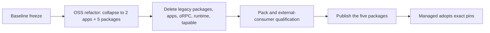

# PRD Review — OSS Monorepo and Managed Integration Redesign

Review of [`PRD.md`](./PRD.md), checked against the workspace as it exists today.

## Verdict

The contract/implementation split, the database invariance section, and the
"managed is a reimplementation, not a hosted deployment" framing are the right
calls. The document is executable.

Two things must change before execution: the `canvas-contract` boundary does not
exist in the code the way the PRD assumes, and the phase order in section 15 is
backwards. Everything after that is missing detail, not wrong direction.

---

## 1. Blocking: `canvas-contract` is not implementation-free today

Section 6.1 says the contract must contain no browser implementations, and
section 16 requires that "managed backend Canvas code requires no Solid or
browser dependency closure."

The package contradicts both right now:

| Location | Import |
|---|---|
| `packages/canvas-contract/src/types.ts:5` | `@omnidraw/cangine` |
| `packages/canvas-contract/src/validation.ts:6` | `@omnidraw/cangine` |
| `packages/canvas-contract/src/validation.ts:7` | `@omnidraw/cangine/testing` |
| `packages/canvas-contract/src/fn.canvas-legacy-widget.ts:3` | `@omnidraw/cangine` (type-only) |

`@omnidraw/cangine` is a runtime dependency in `packages/canvas-contract/package.json`,
not a dev or peer dependency. A managed backend that imports `canvas-contract`
installs the rendering engine.

This is one decision, and the PRD has to make it explicitly:

- **Option A — contract owns its types.** `canvas-contract` declares its own
  node, scene, and snapshot types plus its own validation, and Cangine appears
  only inside `@omnidraw/canvas`. Highest cost, real boundary.
- **Option B — Cangine is part of the contract.** The PRD states that the Canvas
  document format *is* the Cangine scene format, pins Cangine as a peer
  dependency of `canvas-contract`, and drops the "no browser dependency closure"
  acceptance criterion in favour of "no Solid dependency closure."

Option B is the honest description of the current design. Either way, the
`@omnidraw/cangine/testing` import must leave `validation.ts` — a test
entrypoint has no place in a published contract's runtime path.

### Related unresolved conditional

Section 6.6 says `canvas-contract` "may depend on public theme types only if
those types remain part of the Canvas document format." It already does, at
`types.ts:9` and `validation.ts:11`. Resolve the conditional now: either theme
tokens are part of the document format (then say so and keep the dependency) or
they are not (then remove it before extraction).

---

## 2. Wrong: phase order in section 15

Section 15 sequences public release and managed adoption (phase 3) *before* the
OSS application migration (phase 4) and surface collapse (phase 5). That is
backwards.

The OSS refactor comes first. The managed repository is waiting on it. There is
no managed consumer to coordinate with mid-flight, so there is no reason to
publish an intermediate package set shaped by the pre-refactor internals, and no
reason to gate deletion of legacy OSS surface on another repository.

Corrected order:

Consequences for the PRD text:

- Phase 3 (public release and managed adoption) moves to the end.
- The "contract-first release train" framing in goal 10 and section 19 is
  dropped. It exists to let two repositories coevolve; only one is moving.
- Temporary internal adapters and compatibility shims described in phase 2 are
  unnecessary. Delete the old boundary in the same change that creates the new
  one.
- The release gate becomes the packed-tarball fixtures that already exist —
  `scripts/fixtures/external-composition` and `scripts/fixtures/canvas-kernel-consumer` —
  not managed's adoption.

---

## 3. Missing: Cangine and Capsule are never mentioned

The PRD does not name either external dependency, yet the whole design rests on
them. `@omnidraw/cangine@0.6.1` is a dependency of `canvas`, `canvas-contract`,
and `ui-ai-chat`. `@omnidraw/capsule@0.14.0` is a dependency of `sdk` (via
`capsule-omnidraw`) and `ui-ai-chat`.

Add a section covering:

- **Which public package pins which external version, and as what kind of
  dependency.** Capsule folding into `@omnidraw/sdk` means the portable widget
  authoring surface carries the browser sandbox runtime in its closure. Decide
  dependency vs peer dependency and write it down.
- **A version-compat matrix.** Managed pins exact OSS package sets; those sets
  imply exact Cangine and Capsule versions. State the rule for who bumps first
  and what a Cangine or Capsule major means for the five packages.

### The schema fingerprint gate is weaker than section 14 implies

`canvas_items` stores one JSONB row per authored Cangine node. The payload
*format* is owned by a third-party package version, not by the migration. A
Cangine scene format change breaks stored data with a byte-identical migration
and an identical schema fingerprint.

Section 14 needs a payload-format version recorded alongside the schema
fingerprint, and a gate that fails when the Cangine version changes without an
explicit format review.

---

## 4. Missing: peer dependency and singleton policy

`@omnidraw/canvas` correctly declares `solid-js` as a peer dependency.
`@omnidraw/ui-ai-chat` declares it as a direct dependency. If
`@omnidraw/component-ai-chat` inherits that shape, a managed Cell can load two
Solid copies in one page and reactivity silently dies across the boundary.

The PRD needs an explicit rule:

- `solid-js`, `@omnidraw/cangine`, and `@omnidraw/capsule` are peer dependencies
  of every public package that touches them, with stated ranges.
- Add a duplicate-instance check to the external-consumer fixtures. It is cheap
  and it catches a failure mode that produces no error message.

---

## 5. Missing: the `ui-ai-chat` split line is not drawn

Section 6.5 lists what `@omnidraw/component-ai-chat` excludes, but the source it
is carved from reaches straight into private surfaces today:

- `packages/ui-ai-chat/src/ports.ts:1` — `@omnidraw/orpc-client`
- `packages/ui-ai-chat/src/sidebar/ports.ts:2` — `@omnidraw/service-db/model`
- widget catalog, mention catalog, and detail pages all typed against
  `@omnidraw/orpc-client`

The public component and the private frontend feature are currently one graph
sharing transport-derived types. The PRD should state where the injected
action/streaming contract's types come from once `orpc-client` no longer exists —
they cannot be derived from the private transport if the package is meant to be
transport-neutral.

---

## 6. Missing: `scripts/` has no owner in the final surface

Section 5 defines the final workspace as two apps and five packages. It does not
account for `scripts/`, which currently holds ~40 files: release staging
(`prepare-package-dist.ts`, `verify-package-dists.ts`), boundary tests
(`architecture-boundaries.test.ts`, `*-boundary.test.ts`), the local registry,
dev launchers, packed-consumer fixtures, and the preview-inspection packaging
chain.

Decide and record:

- Which scripts survive, which move into an app, which are deleted.
- Where the boundary-enforcement tests live and that they are extended to the
  new rules.
- The redefined root test gate. The current `test` script enumerates 22
  workspace filters by name and will not survive the collapse.

### Preview inspection packaging

Section 13 removes packaged-binary smoke tests but does not mention the
preview-inspection runtime packaging chain built around them —
`stage-preview-inspection-runtime.ts`, `package-preview-inspection-runtime.ts`,
`smoke-preview-inspection-runtime.ts`, `test-preview-inspection-packaged.ts`,
and the `test:preview-inspection-package` gate. With the compiled binary gone,
state explicitly which of these are deleted and which become source-mode tests.

---

## 7. Missing: conformance evidence has no distribution channel

Section 15 and 16 require cross-repository Canvas and widget conformance, and
section 8 requires one canonical widget fixture that passes in both products.
Those scenarios and fixtures live in this repository and are not one of the five
publishable packages.

Since managed follows the OSS refactor rather than running alongside it, this is
not urgent — but it still has to exist at the point managed adopts. Decide
whether the conformance kit ships as a sixth published package, as a tarball
attached to a release, or as a documented fixture path managed copies once.

---

## 8. Missing: retired package names break generated widget projects

`@omnidraw/runtime`, `@omnidraw/widget-contract`, `@omnidraw/resource-runtime`,
and `@omnidraw/function-runtime` are published and are referenced by the widget
scaffold — 27 `@omnidraw/widget-contract` references and 5
`@omnidraw/resource-runtime` references under `packages/service-agent/src`.

No compatibility shim is wanted, and none is needed. But the PRD should say:

- The scaffold templates are rewritten to `@omnidraw/sdk` as part of the
  refactor.
- Widget projects already on disk import names that will stop resolving, and
  what happens to them (rewrite on next build, fail with a clear error, or
  accepted breakage).
- The retired npm names are marked deprecated, pointing at `@omnidraw/sdk`.

---

## 9. Missing: theme CSS delivery contract

Section 6.2 gives `@omnidraw/theme` DOM projection and shared theme CSS, consumed
by Canvas, the OSS frontend, the managed Cell, and the managed Frontdoor. The
PRD specifies isolated theme *state* per mounted application but says nothing
about the CSS side:

- Which entrypoint exports the stylesheet, and whether consumers import it or
  the package injects it.
- Variable and class namespacing, so the managed Frontdoor's own styles cannot
  collide with theme output.
- What happens when two Canvases with different themes mount on one page.

---

## 10. Missing: OSS host-execution risk is unstated

Section 1 says OSS runs widget server and function code on the host while
managed runs it through Microsandbox. That is a deliberate asymmetry: OSS
executes AI-generated code directly on the operator's machine.

One paragraph of explicitly accepted risk. Without it, readers reasonably assume
parity between the two products.

---

## 11. Smaller corrections

- **Versioning scheme is not fixed.** Lockstep or independent versions for the
  five packages? The workspace is currently mixed — `runtime`, `service-theme`,
  and `theme-contract` at `0.5.0`, everything else at `0.6.0`. Managed pins
  exact sets, so lockstep is cheaper to reason about. Put the decision in
  section 19.
- **`service-kv` contradiction.** Section 12 says "backend persistence domain or
  removal if unused"; section 14 requires the `key_values` table to remain. Pick
  one.
- **`shared-functions` will duplicate.** Section 12 sends its ~1.6k LOC to the
  "nearest owning app," which means the same helpers land in both apps. State
  that the duplication is accepted, or name one owner.
- **Workspace discovery criterion is already false.** Section 16 requires
  discovery to report exactly two apps and five packages, but the root
  `workspaces` array also includes `scripts/fixtures/external-composition` and
  `scripts/eslint-tooling`. Exclude them from the check or reword it.
- **Section 14 table is accurate.** Verified against
  `packages/service-db/src/migrations/000-initial.sql`: 14 tables, single
  migration file. No change needed.

---

## 12. Explicitly out of scope

Recorded so these are not re-raised:

- **Effect v4 including unstable modules is accepted.** No spike gate, no
  fallback plan, no TypeScript 7 compatibility qualification required.
- **No effort estimate, ownership split, or rollback plan.** This is one
  dedicated refactor.
- **No incremental migration path.** The old boundary is deleted in the same
  work that creates the new one.
- **No performance or bundle-size budget.**
