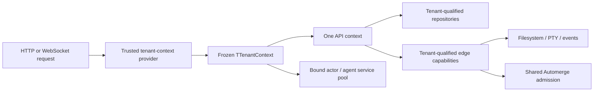

# M3 tenant-backend evidence

Captured on 2026-07-21 for the clean managed-service rewrite.

## Authority model

- `TTenantContext` carries organization, account, cell, placement epoch, roles,
  capabilities, request ID, and optional canvas/invocation scope. Its authority
  collections are copied and frozen.
- The OSS boundary accepts only the exact trusted session object. Caller payloads
  do not contain authoritative organization fields.
- Repository and edge-service public methods require the tenant context. Legacy
  actor and agent services receive tenant-bound database and event capabilities
  from a bounded service pool.
- Customer-facing maps, subscriptions, sessions, caches, storage keys, and
  Automerge peers include the relevant organization/account/cell/epoch scope.
- Agent chat, approval, widget-edit, and event entry points forward the trusted
  account and request identity rather than reconstructing authorization from
  caller data.

## Isolation evidence

The durable `bun run test:isolation` command maps the required matrix to these
collision and foreign-ID suites:

| Surface | Durable evidence |
| --- | --- |
| Canvas and media | `repository-isolation.test.ts`, `tenant-isolation.test.ts`, `server.http.test.ts` |
| Collaboration | `AutomergeService.test.ts`, `turso.adapter.test.ts`, `websocket.adapter.test.ts` |
| Filesystem | `FilesystemServiceNode.test.ts`, `api.files-filesystem.test.ts` |
| PTY and upload | `PtyServiceBunPty.test.ts`, `api.upload-image.test.ts`, `pty-plugin.test.ts` |
| Tools, notifications, events | repository, API, and `EventPublisherService.test.ts` suites |
| Resources | repository draft/apply/binding/key collisions plus tenant-bound resource services |
| Agent | bounded per-organization/account service composition and tenant-qualified workspaces |
| Legacy actor | repository definition/instance/snapshot collisions and tenant-bound actor services |
| Browser persistence | scope-key, handle-race, same-ID remount, atomic client-state, stale-response, and deployment-origin switching suites |

Known-foreign and unknown identifiers have identical results at repository, API,
Automerge admission, media HTTP, filesystem, PTY, tool, resource, and legacy actor
boundaries. Identical IDs can coexist in two organizations where the schema permits
them.

## Collaboration, replay, and browser switching

- One shared Automerge service authorizes every find, delete, admission, release,
  and registration callback against account-visible canvas membership. A primed
  same-organization cache does not weaken the check.
- Document directories, chunks, peer IDs, handle records, denial/eviction metrics,
  and pending writes are tenant-qualified and bounded. Known-foreign and unknown
  document URLs have one unavailable response.
- Shutdown performs an authoritative final repository flush, seals late adapter
  writes, drains accepted storage work, unloads cached handles, and only then
  disposes storage. The deterministic throttle-boundary regression reloads the
  final pre-stop edit and captures zero unhandled rejections; the independent
  mixed stress suite passed 10/10 repetitions.
- Database and notification event streams authorize before subscription and
  expose monotonic cursors with atomic reconnect replay.
- Browser tenant switching is serialized. It disconnects subscriptions, tears
  down Automerge handles and runtimes, atomically publishes the next tenant/store
  pair, reconnects to the selected deployment origin, and bootstraps that tenant's
  canvases.
- Solid remounts the Canvas boundary even when two organizations use the same
  canvas ID. Generation fencing drops late unary responses, including an
  A-to-B-to-A switch, and Automerge plus ORPC both route to the active cell.

## Immutable system-scope allowlist

No mutable customer datum may use a deployment-global default key. The durable
authority audit limits the immutable local-OSS bootstrap identifiers to:

| Path | Reason |
| --- | --- |
| `apps/cli/src/plugins/auth/CONSTANTS.ts` | Frozen single-owner OSS session and placement |
| `packages/canvas/src/CONSTANTS.ts` | Frozen local browser composition default |
| `packages/service-db/src/CONSTANTS.ts` | Canonical local bootstrap IDs |
| `packages/service-db/src/DbServiceTurso/DbServiceTurso.ts` | Verifies the seeded local deployment |
| `packages/service-db/src/DbServiceTurso/tx.account.ts` | Creates the immutable initial organization/account/membership |
| `packages/shared-functions/src/vibecanvas-config/CONSTANTS.ts` | Default local organization directory name |
| `packages/shared-functions/src/vibecanvas-config/fn.resolve-vibecanvas-home.ts` | Pure local-home default selection |

Any new occurrence fails `scripts/tenant-authority-boundary.test.ts`. Public API
contract source is also checked to reject `orgId`/`organizationId` authority fields.

## Verification

| Check | Result |
| --- | --- |
| Durable authority gate | `bun run test:isolation` passed all 9 suites |
| Database constraints | 9 tests passed, 50 assertions |
| Automerge lifecycle | 18 tests passed; final-write regression and independent mixed stress 10/10 |
| Browser switching | 6 Canvas lifecycle tests, 32 frontend Bun tests, and 3 browser-conditioned Solid tests passed |
| Repository gate | `git diff --check`, functional-core lint, and the complete root test suite passed |
| Preserved high-risk suites | 124 agent, 168 actor, 206 canvas, 184 AI-chat UI, and 16 legacy actor-UI tests passed |
| Release build | SPA assets and all 4 executable targets built successfully |
| Independent re-audit | No remaining M3 authorization, shutdown, or browser-scope blocker |

The long Preview snapshot integration case has an explicit 30-second timeout;
under the parallel repository gate it completed in 16.3 seconds. The Automerge
throttle postinstall patch remains installed and the build retains the existing
portability warnings for embedded upstream runner markers.
