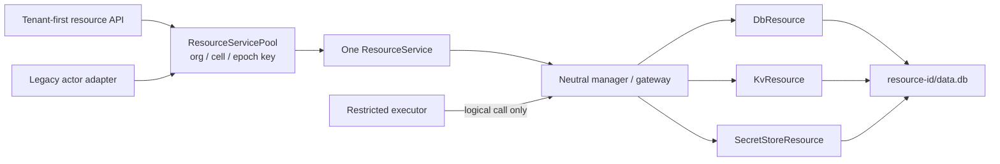

# M4 actor-independent resource-runtime evidence

Captured on 2026-07-21 for the clean managed-service rewrite.

> Historical snapshot: this file preserves the M4 acceptance state. S107 later
> removed `service-actor` and its compatibility paths. Actor references below
> do not describe the current package graph.

## Runtime authority and composition

- `@omnidraw/resource-runtime` is a browser-safe contract surface. Concrete
  local providers, lifecycle coordination, and gateway/store
  implementations are available only from its explicit `/local` subpath.
- The CLI owns one `ResourceService` per organization, cell, and placement
  epoch. Account-specific actor and agent services consume that shared service;
  they do not construct a second production provider set.
- The canonical runtime path is `ResourceManagerGateway` to
  `IResourceGateway` to `ResourceStoreService`; physical data, lifecycle,
  draft/apply, backup/restore, and deletion work crosses the Store boundary.
  Catalog and placement lookups remain control-plane reads.
- CLI composition runs exactly one server and one `ResourceService` for a data
  home. The Resource Store does not create filesystem markers, claim databases,
  or PID-based locks for unsupported multi-server access.
- The Store verifies the request organization and resource identity together
  with the active cell and placement epoch before provider dispatch. Unplaced
  adoption and deletion are denied unless an explicit reconciliation authority
  grants the specific operation, and deletion keeps its placement fence until
  the catalog cascade completes.
- Existing actor routes remain compatibility aliases, while all bundled
  resource clients call the top-level neutral resource API.

## Contracts and extracted implementations

| Concern | M4 boundary |
| --- | --- |
| Logical calls | `IResourceGateway`, resolved store calls, requirements, bindings, effects, write-capability claims, receipts |
| Physical runtime | `IResourceStore`, `ResourceStoreService`, placement/epoch checks, per-resource write lanes |
| Catalog/control state | tenant-aware `IResourceControlStore` and Turso implementation |
| Active use | `IResourceUseCoordinator` inspect/drain/release lease rather than direct actor stop/restart coupling |
| Providers | local DB, KV, and encrypted secret-store providers with injected database/key custody |
| Management | tenant-first resource API capability and dedicated human secret-reveal boundary |
| Compatibility | thin `service-actor` wrappers and legacy route aliases; no physical implementation remains there |

The resource-runtime source imports neither the actor runtime nor the API. The
neutral resource API imports no actor or database implementation. API responses
never include a host path, native database handle/configuration, or encryption
key.

## Runtime boundary, concurrency, and recovery evidence

- A Node permission-restricted executor is given the exact resource path and is
  denied with `ERR_ACCESS_DENIED`; descriptor inspection simultaneously proves
  that it has no `data.db` open while the owner does. Its usable channel contains
  only logical consumer, definition, invocation, slot, operation, and input
  fields.
- DB, KV, and secret-store writes serialize per resource. DB and KV/secret
  providers count opening, active, closing, and failed-close handles against the
  configured cap, evict least-recently-used idle handles, and proactively close
  expired handles without another call.
- A child process commits WAL frames, begins a second uncommitted transaction,
  and is killed with `SIGKILL`. A fresh local DB provider reconciles with an
  integrity check, preserves the committed row, and discards the uncommitted
  row. The provider uses WAL plus `synchronous=FULL` and enables Turso's
  experimental `multiprocess_wal` coordinator for compatible external
  processes on the same local filesystem.
- DB draft/apply/backup restore, encrypted secret conversion checkpoints,
  wrong-key refusal, failed-provision cleanup, interrupted delete completion,
  and transitional catalog reconciliation are permanent tests.
- Shutdown rejects new logical calls, drains accepted lifecycle work and
  physical writes, and closes providers. Failed provider or child-service
  cleanup remains process-local lifecycle state and can be retried.

### Production file-descriptor proof

The boundary test starts a real on-disk `DbServiceTurso` at `main.db`, constructs
`ResourceControlStoreTurso`, and starts the production CLI `ResourceService`.
It creates and writes a named-operation DB resource at
`resources/<resource-id>/data.db`, then inspects `/proc/<pid>/fd` or `lsof` and
proves the server process has the canonical resource database open.

The same test starts a Node child with experimental permissions granting read
access only to the logical-executor fixture and passes the exact canonical
`data.db` path as its physical-open probe. The open fails with
`ERR_ACCESS_DENIED`; descriptor inspection proves that the child has neither
that resource database nor any other `data.db` open. The fixture then emits only
a logical named-resource call, the server executes it through the canonical
gateway, and the child receives `[{ "value": "dark" }]`. Finally, stopping the
Resource Service removes all descriptors for the resource database and sidecars
while the control `DbServiceTurso` remains running, proving that resource-file
handles are released independently of `main.db`.

## API and secret boundary

The consolidated API exposes six neutral resource groups with 39 procedures.
Legacy actor resource routes delegate to the same handlers during the
compatibility window. Frontend resource pages and AI-chat resource mentions use
only the neutral route.

Secret values remain absent from list, mutation, conflict, event, and error
payloads. Plaintext reveal is a separate procedure requiring both a recognized
human role and `resource:secret:reveal` (or the trusted OSS `*` capability);
service-principal and capability-free contexts are rejected before the service
is called. Runtime composition registers distinct frozen capabilities for the
general resource API and human secret reveal; the general capability exposes
neither `revealSecret` nor a tenant-service escape hatch.

## Verification

| Check | Result |
| --- | --- |
| Durable resource gate | `bun run test:resource-runtime` passed 189 tests across 7 suites: boundary, runtime core, control store, DB/actor compatibility, KV/secrets, API, and production composition |
| Database constraints | `bun run db:constraints:test` passed 9 tests / 50 assertions |
| Provider recovery | SIGKILL WAL recovery, DB apply/restore, secret conversion recovery, and close-failure regressions passed |
| Static boundary | no resource-runtime actor/API imports, no neutral-API actor import, no local `multiprocess_wal`, and no bundled actor-owned resource route calls |
| Common repository gate | `git diff --check`, `bun run lint:functional-core`, and the full `bun run test` passed |
| Release build | `bun run build` passed all 4 release targets: `darwin-arm64`, `linux-arm64`, `linux-x64`, and `linux-x64-baseline` |
| Independent audits | Final security and architecture audits passed with no remaining P0, P1, or P2 blocker |

The Automerge throttle postinstall patch remains installed and unchanged.
