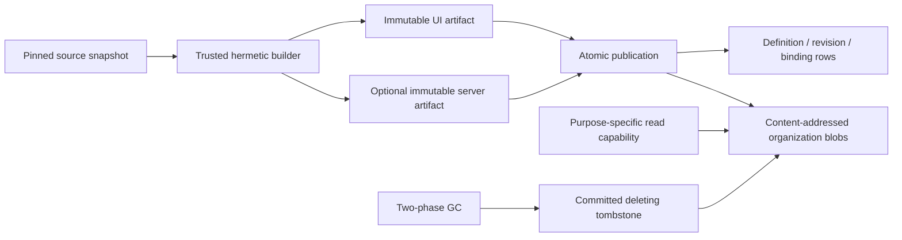

# M5 immutable widget-artifact evidence

Captured on 2026-07-21 for the clean managed-service rewrite.

## Actor-free widget ownership

- `@omnidraw/widget-contract` owns strict manifest schema v2. A UI entry is
  required, a server entry is optional, resources are logical requirements,
  and actor/v1 fields are rejected rather than retained as a union branch.
- The browser-safe package root exports contracts, schemas, and pure
  canonicalization only. Source capture, Bun building, local blob storage,
  publication, read authority, and collection require the explicit `/local`
  entry point.
- The CLI owns one `WidgetService` per organization, cell, and placement epoch.
  Accounts in that placement share the owner. The public widget capability has
  no owner resolver, path, control store, deletion, GC, or server-execution
  issuer.
- A browser-only publication creates definition, revision, and artifact rows
  and one immutable blob while creating zero legacy actor rows, files, or
  processes.

## Build, contract, and read integrity

- Source capture rejects symlinks and non-files, bounds file count, per-file
  bytes, and total bytes, pins directory and file identities, opens files with
  no-follow semantics, and performs bounded handle reads with before/after
  identity and EOF checks.
- UI and optional server artifacts are built from one content-addressed
  snapshot with a pinned builder identity. Imports resolve only to snapshot
  files or an exact empty-by-default package allowlist. Build-time loaders,
  absolute/scheme/ambient/traversal imports, transitive server leakage, and
  emitted loader escapes are rejected.
- Artifact and build-temp roots are canonical, identity-pinned directory
  hierarchies. Symlink replacement of a root or descendant is rejected before
  write, read, rename, sync, enumeration, or deletion.
- The canonical revision contract commits the normalized manifest, UI digest,
  optional server digest, and runtime ABI. Publication recomputes it
  independently before writing bytes; the Turso store verifies it at commit and
  every revision read, so stored manifest/artifact/digest tampering fails closed.
- HMAC read claims bind organization, definition, revision, artifact, kind,
  digest, purpose, derived audience, expiry, and service-generated nonce.
  Browser, server execution, UI preview, and server preview use distinct fixed
  issuer methods and audiences; callers cannot select a stronger trust domain.

## Atomic publication, revision sequence, and recovery

- Publication writes UI and optional server blobs and commits the definition,
  immutable revision, resource bindings, artifact references, and active
  pointer behind one organization mutation fence. CAS, build, binding, scope,
  or integrity failure leaves no partially published revision.
- Immutable `001-widget-revision-sequence.sql` adds the durable per-definition
  `next_revision_number`. A valid v0 database is inspected read-only, upgraded
  under an immediate writer lock, and backfilled to `MAX(revision_number) + 1`.
  Pruning and restart cannot reuse a revision number.
- The ordered migration runner verifies the immutable checksum of every applied
  row, refuses gaps, unknown/newer versions, and tampering, rechecks after the
  writer lock, rejects migration-authored transaction control before any
  database mutation, and validates the exact resulting schema, ledger, PRAGMAs,
  and integrity inside the immediate transaction before commit. Corrupt pending
  data and executable-but-drifted migration bytes leave the prior version
  unchanged. The runner preserves the byte-identical M1 `000-initial.sql` SHA-256
  `862dfebc6fbc1e21d52ac71130279f73c6214439d74107785ed1b671f4a60e2b`.
- Rollback changes only the active pointer by CAS. Retention grace begins at the
  latest pointer transition. Instances, invocations, idempotency records, and
  active previews pin revisions; a UI preview pin retains its paired server
  artifact.
- GC first commits an unreferenced artifact's `deleting` tombstone. Metadata
  finalization and unlink/directory-fsync then run in a second fenced
  transaction. A sync failure, commit failure, or SIGKILL after unlink can
  restore only the tombstone, never a live reference to missing bytes; restart
  completes deletion idempotently. Expired queued/building/ready previews are
  retired before revision pruning, so one collector pass can prune their
  inactive revision and begin grace while unexpired previews remain pinned.
  Publication and preview activation reject a tombstone and retry after
  finalization.

## Verification

| Check | Result |
| --- | --- |
| Durable widget gate | `bun run test:widget-artifacts` passed 68 tests / 404 assertions across strict contracts, build/path security, capability, publication, Turso retention, crash recovery, CLI composition, and static boundary suites |
| Database constraints | `bun run db:constraints:test` passed 10 tests / 52 assertions, including the durable revision sequence and all existing strict-schema constraints |
| Schema verification | `bun run db:schema:verify` passed 7 tests / 541 assertions against the exact 000+001 schema |
| Migration/recovery | `bun run db:recovery:test` passed 48 tests / 199 assertions across fresh 000+001 bootstrap, v0-to-v1 backfill, precommit schema verification, corrupt-prefix and transaction-control refusal, rollback/retry, concurrent starters, all-row checksum tampering, gaps, newer versions, and read-only preflight |
| Common repository gate | `git diff --check`, functional-core lint, affected package typechecks, and the complete root test suite passed |
| Release build | Browser assets and all four executable targets built successfully |
| Independent audits | Final correctness and release reviews found no remaining P0, P1, or P2 M5 blocker |

The Automerge throttle postinstall patch remains installed and unchanged.
