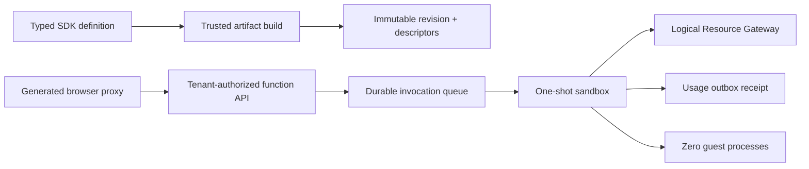

# M6 scale-to-zero function-runtime evidence

Captured on 2026-07-21 for the clean managed-service rewrite.

## Typed immutable function boundary

- `@vibecanvas/sdk/server` defines strict `fn`, `fx`, and `tx` functions with
  bounded JSON input/output schemas, declared logical resource effects, retry
  policy, and execution limits. Durable wait, schedule, continuation, ambient
  authority, runtime re-export, and undeclared-resource surfaces fail closed.
- The trusted builder discovers direct named exports across multiple server
  modules, records each exact `modulePath`, canonicalizes the full descriptor
  set, and commits its digest into the immutable widget revision. Browser code
  receives a generated typed proxy; it never receives server bytes, physical
  resource identities, or a caller-selected revision.
- The function API accepts only bounded invoke/get/cancel inputs. The server
  derives the organization, account, canvas membership, widget instance,
  definition, revision, and artifact authority before dispatch.

## Durable delivery, fencing, and recovery

- Migration `002-function-runtime.sql` adds immutable function registrations,
  invocation snapshots, idempotency records, attempts, leases, resource-write
  permits, and invoice-grade usage rows to the exact managed schema.
- Creation and replay use a canonical full-request fingerprint. Sparse arrays,
  accessors, cycles, non-JSON values, and a reused idempotency key with different
  input, instance, revision, contract, policy, priority, or deadline are rejected.
- Claims, durable start, guest entry, heartbeats, completions, cancellations,
  resource commits, and recovery are fenced by organization, cell, placement
  epoch, worker, attempt, and lease epoch. An organization placement transition
  drains and stops the old dispatcher before a higher epoch can start; stale and
  conflicting epochs cannot reclaim work.
- Recovery runs during trusted placement bootstrap and periodically thereafter.
  Exact-deadline queued work terminalizes without a claim. The durable attempt
  is recorded before guest evaluation, and `guestCodeEnteredAtMs` separates
  host-owned startup failure from possible user-code execution. Retry-none work
  receives at most three platform-owned pre-guest attempts and is never
  implicitly replayed after the guest marker.
- Dispatcher shutdown waits for an in-flight scheduler pull and every admitted
  execution. A pull resolving during shutdown cannot launch new work.

## Replaceable sandbox and atomic resource effects

- The OSS driver is a replaceable, local Bun child adapter for development and
  tests, not a claim of production microsandbox isolation. It uses a restricted
  VM, no ambient environment, a private cage, detached process-group teardown,
  host-measured CPU/RSS accounting, memory enforcement during startup and module
  evaluation, exact absolute deadlines, bounded output/logs/resource calls, and
  a fixed zero warm TTL.
- Startup metrics flow into durable heartbeats while module evaluation is still
  pending. Cancellation, deadline, crash, child/descendant survival, and late
  resource replies are lifecycle-fenced; teardown reports surviving process
  groups and leaves no hidden warm guest.
- The Resource Gateway exposes logical slots only. `fx` is read-only and `tx`
  writes require a signed, expiring, lease-bound permit. Operation fingerprints
  include the complete canonical call. KV, secret, and database providers commit
  their mutation and provider-local receipt atomically, so crash recovery can
  reconcile without repeating a side effect.

## Usage and retention

- Every terminal attempt produces at most one durable outbox record containing
  organization/account, invocation, function, definition revision, sandbox
  driver, memory tier, queue/start/finish times, cold-start flag, outcome,
  failure owner, billable policy, resource permit identity, and cumulative
  host-accounted wall, CPU, memory-time, RSS, disk, and network dimensions.
- Receipt import/reconciliation and terminal-history compaction are
  idempotency- and CAS-fenced. Revision pins and idempotency evidence outlive the
  mutable result body for their configured retention windows.

## Verification

| Check | Result |
| --- | --- |
| Durable function gate | `bun run test:function-runtime` passed all 7 suites: 46 runtime tests, 34 durable-store tests, 3 atomic provider-receipt tests, 65 SDK/artifact/API/composition tests, generated-proxy type checks, and 4 static boundary tests |
| Resource compatibility | `bun run test:resource-runtime` passed all 7 ownership, recovery, provider, API, and production-composition suites |
| Database constraints | `bun run db:constraints:test` passed 10 tests / 52 assertions, including strict invocation lifecycle, stale lease rejection, nonnegative usage, and receipt uniqueness |
| Schema verification | `bun run db:schema:verify` passed 7 tests / 541 assertions against the exact 000+001+002 schema |
| Migration/recovery | `bun run db:recovery:test` passed 48 tests / 202 assertions across fresh bootstrap, ordered prefix upgrades, checksum/schema drift refusal, crash recovery, backup/restore, and read-only preflight |
| Tenant isolation | `bun run test:isolation` passed every tenant derivation, repository, collaboration, filesystem, PTY, event, agent, actor, and API isolation suite |
| Common repository gate | Functional-core lint, `git diff --check`, and the complete root test suite passed |
| Release build | Browser assets and all four executable targets built successfully |
| Independent audits | Final lifecycle, fencing, accounting, security, and release reviews found no remaining P0, P1, or P2 M6 blocker |

The Automerge throttle postinstall patch remains installed and unchanged.
