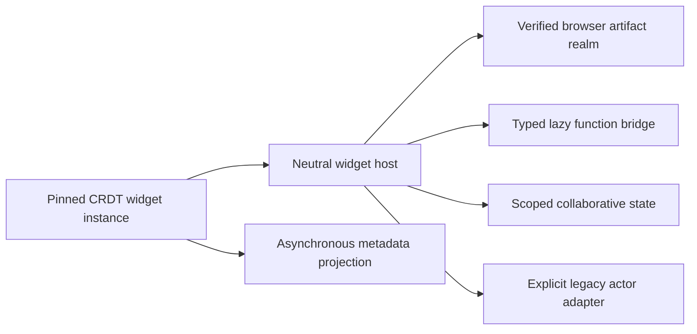

# M7 neutral widget-host evidence

Captured on 2026-07-21 for the clean managed-service rewrite.

## Neutral renderer boundary

- New canvas elements persist only definition, revision, instance, optional
  state-document, and frame metadata. Actor definition, instance, process, and
  transport identities are rejected by the strict Automerge schema.
- Creation, cloning, rendering, resize, fullscreen, portal visibility, and
  removal use one normalized widget-host shape. The existing Konva renderer and
  frame behavior remain in place; legacy actor traffic is isolated behind the
  explicit adapter.
- UI-only placement commits immediately to CRDT. Published-v2 references and
  bounds are validated and snapshotted from the bounded catalog, then committed
  without awaiting or calling a backend placement resolver; legacy and draft
  placement retain their explicit compatibility resolution. The v2 path does
  not synchronously create a database instance, actor, or function sandbox. A coalesced,
  idempotent projection indexes exact persisted Automerge heads on the shared
  serialized `main.db` mutation lane; rendering never waits for it.

## Pinned browser runtime and sandbox

- The public runtime load request contains only the exact canvas element,
  widget instance, definition, and revision identity. The server derives
  organization/account authority, verifies membership and the persisted CRDT
  pin, and returns an authority-free identity plus a content-addressed browser
  envelope. Active/latest substitution and infrastructure detail leakage fail
  closed.
- The browser reconstructs organization identity only from its trusted tenant
  activation. Artifact cache and in-flight verification keys include
  organization, definition, revision, and digest. Tenant activation is checked
  after transport, after artifact verification, before state open/mount, and by
  every live function/state bridge, closing same-ID activation races.
- Server artifact loads admit at most 64 operations globally and 32 per
  organization with a 30-second lifetime. Cancellation and deadline reject the
  caller promptly, but the capacity lease remains held until the underlying
  operation actually settles. Browser rendering admits 32 active lifetimes and
  512 queued hosts; excess visible hosts are deferred and retry only through a
  fresh mount. Uncancellable WebCrypto verification keeps the same active lease,
  so unique-target teardown churn cannot grow an untracked verification set.
- A committed host that first sees projection lag, transport loss, timeout, or
  load-capacity pressure remains recoverable without a new CRDT identity event.
  At most the first 32-host cohort starts outside recovery pacing. The first
  recoverable failure flips runtime-wide outage mode before releasing its slot;
  every later start, including never-attempted queued hosts, then passes one RPC
  at a time through a shared 100 ms FIFO gate (at most ten starts per second per
  browser) until a successful load clears outage mode. Recovery waiters remain
  inside the same 32 + 512 cap.
- The pinned Arrow sandbox patch is version-checked and idempotent. It enforces
  bounded QuickJS execution, timers, fetches, host-bridge calls, CSS and DOM
  output; rejects dangerous CSS and active form behavior; and destroys the
  realm after evaluation, render, dispatch, or callback failure. Normal CSS,
  forms, pointer/keyboard interaction, cleanup, and the legacy compatibility
  mount remain covered.
- Sandbox boot has one absolute 10-second deadline across WASM load, bootstrap,
  artifact evaluation, and top-level await. Fetch bodies are streamed and
  cancelled beyond 1,000,000 bytes. Guest events are serialized, capped at 16
  queued/active dispatches, coalesce pointer movement, and have a one-second
  dispatch deadline so event floods cannot retain unbounded promises or realms.
- The generated function proxy is available only through a fixed guest-global
  bridge. Invocation binds the loaded descriptor and exact instance/revision,
  permits at most eight in-flight calls, bounds projection retries and status
  polling, watchdogs a stalled transport, and creates no sandbox until guest
  code actually invokes a function.

## Collaborative state and projection authority

- State documents carry an exact immutable widget identity and one strict JSON
  value. Admission derives organization and membership from the server,
  canonicalizes the URL before policy lookup, validates malformed CBOR before
  allocation, and rejects identity, schema, depth, node-count, visible-size,
  and mutation-rate violations.
- Visible JSON is capped at 64 KiB. Automerge changes and incremental chunks
  are independently capped at 256 KiB, while total durable encoded history is
  capped at 4 MiB, so transient write/delete changes cannot hide unbounded data
  in shared storage. Compaction is rate-free but remains within the durable
  byte quota.
- A widget may submit at most 20 state changes per second. Bundled changes are
  charged individually; retained rate ledgers are bounded and survive document
  release. Same-organization nonmembers cannot read, release, delete, or infer a
  known document.
- Remote state frames are decoded and applied to bounded live/durable clones
  before the Automerge Repo sees them. Per-connection and per-document queued
  frame/byte limits are reserved before awaited admission; stale connection
  generations, hidden transient history, and a 21-change bundled frame are
  rejected before Repo mutation, rebroadcast, or persistence. A real server and
  two-peer regression proves that later legal state still converges and persists.
- Projection rejects stateful repins until the old state document is detached,
  quarantines only the affected canvas on invalid persisted data, and recovers
  from a later valid head without blocking unrelated canvases.
- Widget state authorization and function create/replay require the projection
  head to equal the durable canvas `content_version`; delayed or quarantined
  projection therefore fails closed. True eviction/delete releases projection
  state before dropping the document, refuses to forget quarantines, and retains
  bounded LRU bookkeeping. Lifecycle timer ticks are single-flight even while a
  flush or projection release is stalled.
- Widget-instance projection is asynchronous and an offline canvas can reveal a
  revision pin after rollback. Until placements have a durable reservation/ack
  protocol, inactive revision pruning is intentionally conservative: any
  durable canvas in an organization blocks revision pruning, while zero-canvas
  organizations remain collectible. Deleting the last canvas resumes pruning.

## Scale proof

- The deterministic CRDT fixture creates 10,000 neutral elements in a 632,956
  byte document. Projection replay/undo remains idempotent, records 10,000
  widget-instance rows, and records zero actor rows, function invocations, or
  sandbox starts.
- The production manager, DOM portal, Arrow runtime, and QuickJS path traverses
  all 10,000 committed widgets with 32 active UI realms, 512 queued visible
  renders, 2,420 deferred visible renders, and 7,036 offscreen widgets that never
  mount. A representative final run loaded 32 artifacts and grew RSS by about
  1.2 GB while producing zero actor or function transport calls.

## Verification

| Check | Result |
| --- | --- |
| Canvas regression | `bun run test:canvas-regression` passed 212 canvas tests, 205 UI/frame/fullscreen/runtime tests, 41 Automerge/reconnect tests, and 29 legacy actor compatibility tests |
| Durable widget-host gate | `bun run test:widget-host` passed all 12 patch, schema, projection, state-authority, function-authority, artifact, SDK, sandbox, renderer, and 10,000-widget suites |
| Tenant isolation | `bun run test:isolation` passed all nine tenant derivation, repository, collaboration, filesystem, PTY, event, agent, actor, and API suites |
| Backend compatibility | Resource, widget-artifact, function-runtime, schema, constraint, and recovery durable gates all passed |
| Common repository gate | `git diff --check`, functional-core lint, affected package typechecks, and the bounded sequential complete root test suite passed |
| Release build and binary | Browser assets and all four executable targets built; the compiled binary passed native-addon, strict-home, actor IPC, HTTP, WebSocket, and managed-schema scenarios |
| Independent audits | Final authority, lifecycle, sandbox, storage-bound, and release reviews found no remaining P0, P1, or P2 M7 blocker |

The Automerge throttle postinstall patch remains installed. Its generated
negative-delay clamp is still verified by the postinstall check.
