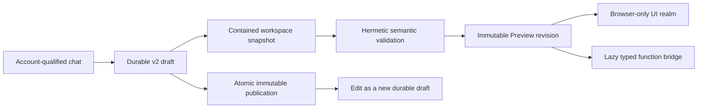

# M8 neutral authoring evidence

Captured on 2026-07-21 for the clean managed-service rewrite.

## Durable authoring boundary

- The primary agent path now uses opaque, account-qualified draft identities,
  immutable Preview owners, neutral function invocation, and the v2 widget
  publication service. Actor-era `draftActor.*`, draft-manifest, preview-source,
  and chat-publish API procedures are no longer part of the normal authoring
  contract.
- Draft creation, lookup, rename, discard, Preview ownership, publication seed,
  and garbage collection are durable in `main.db`. Names are presentation and
  lookup keys only; mutations and publish requests retain the exact opaque draft
  identity and expected revision.
- The authoring resource capability is actor-independent. Prompts and scaffolds
  produce UI-only widgets by default and add server function/state/resource
  files only when the requested behavior needs them.

## Workspace and validation authority

- Workspace paths remain backend-owned and contained. A materialization marker
  records the exact draft definition, revision, and source digest before source
  promotion. Pending materializations are hidden from catalog, detail, file,
  mount, and reconciliation reads until the matching database seed commits.
- Restart recovery verifies the exact source snapshot, completes a source-present
  row-absent commit, removes only a mismatched pending source, and never deletes
  an already tracked same-name source owned by another definition.
- Validation runs in one bounded, terminable TypeScript worker. The virtual
  compiler host accepts only the captured source, embedded TypeScript standard
  libraries, and checked-in public SDK declarations; it cannot read arbitrary
  host paths or depend on a prebuilt SDK directory.
- Source size, diagnostics, concurrency, deadline, and worker RSS are bounded.
  Deadline or memory failure kills and reaps the subprocess, and diagnostics
  prove no validator process remains active. A compiled binary validates after
  its build source is removed from an otherwise empty directory.

## Preview, placement, and publication

- A Preview pins one exact draft revision and one opaque owner. Browser UI starts
  without an actor, collaborative state is ephemeral and scoped, and server
  functions are lazy through the neutral Preview function API.
- Lost Preview build responses reconcile only through an exact owner read. The
  client adopts the exact committed result or closes the exact unexpected
  revision; mismatch and failure do not leak a durable Preview.
- Draft placement pre-resolves the exact durable draft, sends its opaque identity
  through the resolver, rechecks the same identity immediately before build, and
  closes the exact Preview on response loss, placement failure, forged ownership,
  or a same-name owner race.
- Publishing remains a direct user confirmation. The dialog binds its displayed
  detail and its immediate pre-submit refresh to the exact draft ID, name, and
  revision. Stale or substituted identities fail closed.
- Publication validates and atomically promotes immutable artifacts. Existing
  canvas mounts remain pinned to their stored revision until explicit remount or
  runtime policy. Edit-as-draft creates or revives a durable draft from the exact
  published source without mutating the published revision.
- Preview close uses bounded exact-owner reconciliation, so a lost successful
  close is accepted but a different live owner/revision is never claimed closed.

## Verification

| Check | Result |
| --- | --- |
| Agent authoring | `@vibecanvas/service-agent` passed 145 tests / 751 assertions; restart materialization and exact Preview-close regressions passed 35 tests |
| Browser authoring | `@vibecanvas/ui-ai-chat` passed 53 files / 336 tests, including response-loss placement and exact publication identity |
| Neutral API | `@vibecanvas/api` passed 62 tests / 333 assertions, including strict authoring and Preview contracts |
| Durable stores | `@vibecanvas/service-db` passed 167 tests / 1,461 assertions, including account-qualified authoring lifecycle and publication seeding |
| Semantic validator | Validator and `WidgetService` suites passed 18 tests / 142 assertions, including bounded termination, declaration drift, and compiled-binary isolation |
| Permanent gates | `bun run test:widget-artifacts`, `bun run test:function-runtime`, and `bun run test:isolation` passed every suite |
| Common repository gate | Complete sequential root tests, affected typechecks, functional-core lint, and `git diff --check` passed |
| Release build | Browser assets and all four executable targets built from the settled tree |
| Independent review | Final authority, lifecycle, response-loss, workspace-recovery, semantic-validator, and release audits found no remaining P0, P1, or P2 M8 blocker |

The Automerge throttle postinstall patch remains installed. Its negative-delay
clamp is still required until the pinned upstream dependency is deliberately
verified fixed.
