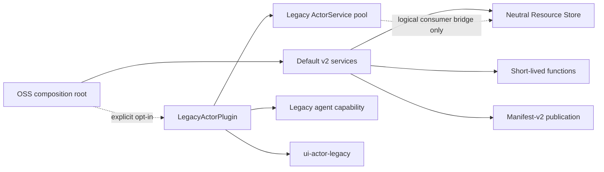

# M9 managed-ready OSS evidence

Captured on 2026-07-22 for the clean managed-service rewrite.

## Optional legacy boundary

- Legacy actors are disabled by default. The composition root reads the strict
  `VIBECANVAS_LEGACY_ACTOR_ENABLED` boolean, dynamically imports the backend
  plugin only for an exact enabled value, and otherwise does not register an
  actor service.
- `LegacyActorPlugin` is the only CLI composition module that imports and
  constructs `ActorService`. It owns legacy canvas create/delete callbacks, the
  organization-placement service pool, the injected agent compatibility
  capability, and the actor side of the neutral resource-use bridge.
- Default service setup depends only on an optional legacy composition
  capability. `AgentService` contains no runtime actor construction; actor
  draft preview and compatibility reads are provided by the injected legacy
  capability. Legacy chat publication fails closed and directs callers to the
  manifest-v2 draft publication API.
- Runtime plugin application now precedes the service-registration snapshot,
  so an enabled plugin can register its service before ordered startup. Failed
  boot rolls back the exact attempted service registrations in reverse order.
- `/health` reports the configured `legacy_actor_enabled` value and the exact
  aggregate `active_legacy_process_count`. Focused lifecycle coverage exercises
  disabled zero cost, enabled idle zero cost, draft/instance process creation,
  process return to zero, and shutdown cleanup. Actor teardown retains the
  process handle and diagnostic ownership until `proc.exited` settles, uses a
  bounded SIGTERM-to-SIGKILL escalation, and proves delayed and stubborn
  children are reaped before service shutdown resolves.

## Legacy package and API isolation

- `service-actor` is a compatibility runtime, not a resource or publication
  owner. The actor resource manager, providers, persistence adapters, database
  coordinator, secret-key provider, and actor-owned resource type layer are
  retired. The remaining `legacy/resource-protocol` is a narrow logical call
  and start-admission protocol implemented by the actor-independent Resource
  Service.
- The service package has an explicit seven-entry export map and no wildcard
  export. Shared frame bounds, placement keys, and tool-icon contracts are
  owned by `widget-contract`; non-legacy consumers import that neutral package.
- `@vibecanvas/api/actor` contains only compatibility definition, event, and
  instance routes. Resource contracts and handlers expose neutral `ZResource*`
  schemas and `ResourceError` mapping, with no actor resource route aliases.
- V2 resource ownership remains in the Resource Store, v2 publication remains
  in the immutable widget service/draft controller, and v2 function execution
  remains in the function runtime. The optional actor runtime can consume a
  logical resource bridge but cannot reclaim those ownership boundaries.

## UI and v2-first product behavior

- Legacy actor transport, event normalization, Arrow compatibility sandbox,
  actor widget adapter, definition registration, and state-machine view live in
  `ui-actor-legacy`. `ui-ai-chat` accepts only an optional typed legacy UI
  capability and has no dependency on the legacy UI package.
- Frontend startup requests `/health` before installing the canvas/sidebar
  composition. It dynamically imports `ui-actor-legacy` only when the response
  succeeds and `legacy_actor_enabled` is exactly `true`; malformed, disabled,
  failed-health, failed-import, and failed-construction paths leave the module,
  factory, and actor transport unused.
- The widget inspector separates the compatibility and v2 mental models.
  Legacy widgets expose Overview, Config, Messages, States, and Files. V2
  widgets expose Overview, Config, Functions, Collaborative State, Runs, Logs,
  Resources, and Files, including revision, invocation-limit, function schema,
  resource requirement, and placement data.
- Published v2 detail returns browser-safe function descriptors. Host source
  module paths are removed before API validation, while execution retains the
  full revision-pinned descriptor internally.

## External managed-style composition

- `scripts/fixtures/external-composition` is outside `apps/cli`. Its independent
  package manifest pins `function-runtime`, `resource-runtime`, `runtime`,
  `tenant-core`, and `widget-contract` to the exact shared release version
  `0.1.0` and imports only their documented root exports.
- The fixture registers fake managed identity, placement, artifact,
  dispatcher, executor, resource, collaboration, and usage
  implementations through the public service registry. It does not import the
  OSS CLI, API package, concrete `service-*` implementations, package `src`
  paths, or copied/patched source.
- Public packages are versioned, non-private, export their supported root, and
  exact-pin public-to-public dependencies. The collaboration interface lives
  in the public runtime contract rather than a local service package.
- The OSS-side API conformance harness adapts the fixture dispatcher to the
  public function API capability, then invokes the existing function router.
  The fixture remains API-agnostic, and architecture assertions reject fixture
  branches or imports in production API source.
- [`managed-service-package-consumption.md`](../managed-service-package-consumption.md)
  documents atomic exact-version consumption for the private monorepo, package
  ownership, forbidden source/vendor shortcuts, and the pre-release conformance
  commands.

## Verification

| Check | Result |
| --- | --- |
| Frozen dependency graph | `bun install --frozen-lockfile` checked 875 installs across 1,020 packages with no changes; both required postinstall patches remained applied |
| External composition | `bun run test:external-composition` passed 2 tests / 14 assertions against the independent exact-version fixture |
| Architecture boundary | `bun run test:architecture` passed 16 tests / 199 assertions, including API invariance, package direction, explicit actor exports, plugin isolation, org-placement reuse/rehome, and disabled zero cost |
| Resource and function ownership | `bun run test:resource-runtime` passed all five ownership/recovery suites; `bun run test:function-runtime` passed all seven bounded execution suites |
| Legacy lifecycle | `service-actor` passed 99 tests / 528 assertions and `service-agent` passed 145 tests / 760 assertions, including delayed exit, SIGKILL escalation, retryable fail-closed cleanup, exact PID/count, and zero post-shutdown children |
| Two-mode product matrix | `bun run test:legacy-matrix` passed the complete product suite first with legacy disabled and then enabled; the matrix also passed the 10,000 UI-only widget zero-actor cost fixture in both modes |
| Common repository gate | `git diff --check` and `bun run lint:functional-core` passed; the complete sequential root suite passed twice inside the final two-mode matrix |
| Release build | `bun run build` bundled the SPA and produced `vibecanvas-darwin-arm64`, `vibecanvas-linux-arm64`, `vibecanvas-linux-x64`, `vibecanvas-linux-x64-baseline`, the release manifest, and wrapper package |
| Compiled binary | `bun run test:binary` passed disabled and enabled fresh-home health diagnostics, embedded assets, API/Automerge WebSockets, actor IPC, pinned native addon, managed schema, path precedence, preflight refusal, and port fallback |
| Independent review | Final requirement-by-requirement audit found no P0, P1, or P2 M9 implementation blocker across plugin/UI optionality, exact teardown diagnostics, organization placement, actor/resource/API ownership, v2 publication, and external composition |

The Automerge throttle postinstall patch remains installed. Its negative-delay
clamp is still required until the pinned upstream dependency is deliberately
verified fixed.
