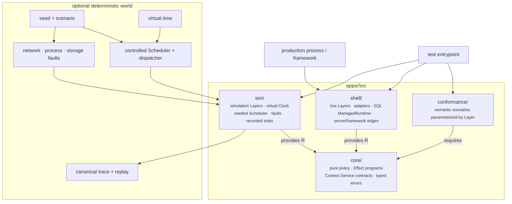

# Application architecture: Effect v4 programs, semantic services, and deterministic runs

**Status:** authoritative repository implementation standard.

**Scope:** every application under `apps/` and every public package whose
implementation owns non-trivial side effects, asynchronous orchestration,
concurrency, streaming, retries, or resource lifetime. Pure contract and simple
synchronous packages do not need an Effect runtime, but they preserve the same
dependency direction and explicit-boundary discipline.

**Effect authority:** exact `effect@4.0.0-rc.108` throughout the repository.
Effect v3, alternate Effect v4 versions, and v3/v4 compatibility layers are
forbidden. `effect/unstable/*` is allowed only through the reviewed inventory
and qualification policy defined below.

**Replacement policy:** this refactor has zero migration or compatibility
support. Existing databases, persisted Canvas rows, replay records, retired
package entrypoints, and old runtime compositions are not inputs to the new
system. Development and deployment replace the database and start from the new
schema. Do not add dual reads, dual writes, legacy decoders, data converters,
compatibility aliases, or temporary production runtimes.

`CANVAS_SCENE_SCHEMA_VERSION` remains `"1.0.0"` for the redesigned clean-install
schema. The unchanged literal is not a compatibility promise: pre-refactor and
unversioned Canvas rows are unsupported because the database is replaced.

## Intent

An application should execute the same business programs in production,
conformance tests, and deterministic simulation. The architecture therefore
needs more than injected functions: it needs lazy effects, typed requirements
and failures, scoped resource safety, structured concurrency, controlled time,
and a scheduler whose behavior can be qualified.

Effect v4 supplies the node-local execution substrate. The application supplies
its domain, persistence semantics, adapters, and any distributed simulation
world.

- **Core decides** through pure functions and lazy `Effect<A, E, R>` programs.
- **Shell translates** semantic services to engines, providers, protocols,
  frameworks, and process resources through production Layers.
- **Simulation controls** the same semantic requirements through alternate
  Layers, virtual time, seeded choices, scripted transports, and fault points.
- **Conformance specifies** what every implementation of a semantic service
  must do.
- **Runtime edges execute** programs through explicitly owned runtimes and
  dispose every acquired resource.

## High-level shape



Read this as one sentence: **core describes decisions, Layers satisfy their
requirements, runtime edges execute them, and simulation controls the world
around the same programs.**

## Placement rule

Placement is decided by meaning and survival, not merely by whether a dependency
was passed as a parameter.

> **Semantic test:** does the file express a decision in domain vocabulary,
> independent of an engine, provider, protocol, framework, or deployment?
> **Yes → core.**
>
> **Survival test:** replace the engine, provider, protocol, or framework. Does
> the file survive unchanged? **Survives → core. Dies → shell.**

Injection is necessary but insufficient. A payment adapter that receives
`fetch` is still shell code. A pure SQLite migration-fingerprint helper may also
remain shell-local because it disappears with the SQLite adapter.

### Dependency direction

```text
core  <-  shell
core  <-  sim
core  <-  conformance
```

- Core never imports shell, sim, or conformance, including type-only imports.
- Shell and sim import core freely.
- Conformance imports core and stable Effect APIs only; shell/sim test
  entrypoints provide implementation Layers.
- Shell never imports sim.
- Sim may reuse parameterized adapter mechanics when running the exact engine is
  intentional. It must not import a live Layer, production runtime, process
  config, server, or ambient world handle.

## Why Effect v4

Effect v4 retains the execution model this architecture depends on while
simplifying and consolidating its APIs:

- `Effect<A, E, R>` remains an immutable, lazy workflow description;
- `Context.Service` is the single semantic service-key model;
- `Context.Reference` represents overridable runtime configuration such as
  Clock and Scheduler values with safe defaults;
- `Layer<ROut, E, RIn>` constructs and composes dependencies;
- `Scope`, finalizers, and `ManagedRuntime` own resource lifetime;
- fibers, interruption, queues, deferred values, semaphores, and supervision
  provide structured concurrency;
- typed expected failures plus flattened `Cause` and `Exit` distinguish domain
  failures, defects, and interruption;
- the rewritten runtime reduces overhead and supports stronger tree-shaking;
- one ecosystem version aligns core and separately published integration
  packages.

Effect is not the business domain, persistence contract, distributed simulator,
authorization system, or replay format. Adopting v4 does not move those
responsibilities into Effect.

## Stable and unstable API policy

Stable top-level Effect modules are the default everywhere. An import from
`effect/unstable/*` is permitted only when all of the following are true:

1. The import appears in the repository's reviewed unstable-module inventory.
2. The inventory names one owning capability and the concrete code it replaces
   or materially improves.
3. Its allowed placement is explicit. Unstable provider, protocol, SQL, HTTP,
   process, workflow, or observability mechanisms normally remain in shell or
   simulation, not domain core.
4. Focused conformance or qualification covers the behavior that would be at
   risk during an Effect update.
5. Every exact Effect RC update reruns that qualification before the version is
   accepted.

Do not adopt unstable SQL merely to replace a sound statement registry, unstable
RPC merely to replace a stable public protocol, or unstable workflow/cluster
features merely because they exist. Adoption must delete real complexity or
provide a required capability.

## Public packages

A public package is not exempt from the architecture because it is published.
Placement is decided by behavior:

- A package containing only contracts, schemas, codecs, constants, pure
  validation, or small synchronous projection helpers remains ordinary
  TypeScript and must not depend on Effect merely for uniformity.
- A package that owns non-trivial side effects, asynchronous state machines,
  concurrent work, streams, retries, cancellation, scoped resources, or
  lifecycle orchestration must use exact `effect@4.0.0-rc.108` internally.
- Such a package separates pure decisions and lazy programs from browser,
  provider, engine, and host adapters using the same core/shell meaning as an
  application. Its folder layout may be package-specific when a full
  `core/`/`shell/` tree would add ceremony.
- Public APIs remain implementation-neutral. Do not expose Effect types,
  Context services, Layers, Scopes, runtimes, or unstable modules through a
  public declaration. Adapt public Promise, `AsyncIterable`, callback, and
  disposer ports at the package shell.
- A stateful public package owns an explicitly scoped runtime per mounted or
  created instance and disposes it with that instance. It never creates a
  module-global runtime or asks the host to coordinate a hidden second
  lifecycle system.

The requirement is conjunctive: complexity plus side effects requires Effect.
Pure complexity stays pure, and a tiny synchronous side-effect adapter may stay
an imperative shell function.

### Portable widget server boundary

`@omnidraw/sdk` owns one fixed, host-neutral Omnidraw server-module ABI,
canonical module/artifact and descriptor contracts, invocation/resource wire
contracts, validators, codecs, and cross-host conformance vectors. It owns no
executor, provider, deployment adapter, authentication, tenancy, metering, or
billing policy. Public APIs remain Effect-free and transport-neutral.

Host mechanics remain shell code. The OSS backend loads the exact canonical
module bytes in a disposable local Bun child and adapts the portable resource
contract to IPC and the local Resource Store. This is trusted local execution,
not a hostile-code sandbox. There is no OSS cloud executor, remote Turso
fallback, per-user/monthly quota, billing-plan limit, cost-model workload
bound, or managed sandbox-minute allowance.

The private managed shell may generate a small Workers for Platforms wrapper
around those exact module bytes. The wrapper has its own deployment digest and
must not rewrite or rebuild the canonical module or change its artifact digest.
It shares the untrusted user-Worker realm with the canonical module, holds no
credential or provider authority, and reaches a separately trusted resource
broker only through a host binding. Public egress is denied by outbound policy
and proven live. Managed KV semantics require the same strong revision/CAS
consistency as the database broker; Cloudflare KV is not a valid substitute.
Managed widget code runs only as a WFP user Worker, never in Cloudflare
Sandbox, a Container, a Durable Object, or the managed chat/build sandbox.
Dispatch namespaces, uploads, outbound policy, Cloudflare bindings, resource
brokerage, Turso credentials, identity, metering, billing, plans, and usage
evidence remain private. Capsule is exclusively the browser UI sandbox.

OSS qualification proves the portable contract and local adapter. A package
set is not managed-qualified until the private repository consumes the exact
SDK version in `public-package-set.json`, deploys the wrapper through a real
WFP dispatch namespace, runs the same conformance against Turso, checks the
canonical module digest, and proves widget code has no outbound or host-OS
authority.

The portable runtime promises neither a fresh module evaluation nor native
prototype identity for context values. Functions cannot make module-scope
mutation observable. The SDK exposes one 128 MiB memory class, an 8 MiB
canonical-module ceiling, and a structural cancellation subset. Managed
qualification separately proves compressed upload size, startup execution,
wall-clock timeout mapping, and platform-kill failure mapping.

## Core

Core owns domain values, policies, expected failures, semantic service
contracts, Effect programs, and executable invariants. It knows no provider,
dialect, driver, framework, process, or production Layer.

### The Effect type is the orchestration contract

```text
Effect<Success, ExpectedError, Requirements>
```

- `Success` is the typed outcome.
- `ExpectedError` is the anticipated domain or operational failure contract.
- `Requirements` is the union of semantic services needed to run the program.

Programs remain inert until an approved shell, conformance, or simulation edge
executes them. Core never calls `Effect.run*`, constructs a `ManagedRuntime`, or
provides a production Layer.

### File forms

#### `fn.*.ts` — pure policy

An exported `fn` function:

- starts with `fn`;
- is deterministic and state-free;
- has no Effect runtime import, service, Layer, Scope, Promise, clock, entropy,
  direct world access, or observable mutable state;
- receives all inputs explicitly.

Do not wrap a pure calculation in `Effect.sync`. Call it normally from an Effect
program and lift only when composition genuinely requires an Effect boundary.

#### `fx.*.ts` — lazy reads

An exported `fx` function:

- starts with `fx`;
- takes zero arguments when naturally input-free, otherwise exactly one required
  domain argument named `args` and typed `TArgs*`;
- is not `async`;
- explicitly returns `Effect.Effect<A, E, R>`;
- reads through core semantic services in `R`;
- never constructs a Promise, executes an Effect, or contacts the world.

#### `tx.*.ts` — lazy writes

An exported `tx` function has the same shape as `fx`, but may invoke semantic
write services and compose other `fn`/`fx`/`tx` programs. Atomicity,
idempotency, fencing, and acknowledgement semantics belong to the service
contract, not hidden adapter details.

### Semantic services

Core declares a service shape and stable identity with `Context.Service`. It
does not attach construction, a live implementation, or a Layer.

```ts
// core/orders/service.order-store.ts
import { Context, type Effect } from "effect";

export interface IOrderStore {
  readonly readById: (
    args: TReadOrderArgs,
  ) => Effect.Effect<TOrder | undefined, OrderStoreError>;

  readonly place: (
    args: TPlaceOrderArgs,
  ) => Effect.Effect<TPlacedOrder, OrderStoreError>;
}

export class OrderStore extends Context.Service<
  OrderStore,
  IOrderStore
>()("example/OrderStore") {}
```

Service rules:

1. Names use domain vocabulary, not provider, transport, or SQL vocabulary.
2. Arguments and results are typed domain values.
3. Service operations have `R = never`; construction dependencies belong in
   the Layer that creates the implementation.
4. The contract is implementable without reading a production adapter.
5. Identifiers are stable and application/domain-qualified.
6. Core service classes declare identity and shape only. They do not use the
   v4 `make` option or define a default/live Layer.
7. Required services are not optional and never have ambient fallbacks.

A program consumes the service explicitly:

```ts
// core/orders/tx.place-order.ts
import { Effect } from "effect";

export function txPlaceOrder(
  args: TArgsPlaceOrder,
): Effect.Effect<TPlacedOrder, PlaceOrderError, OrderStore> {
  return Effect.gen(function* () {
    const store = yield* OrderStore;
    return yield* store.place(args);
  });
}
```

Prefer `yield* Service` in orchestration-heavy programs. `Service.use` is valid
for a small expression, but it must not obscure which requirements a program
has or leak service-bound values outside the callback.

### Error model

Expected errors live in `E`: not found, conflict, stale authority, rejected
input, provider rejection, unavailable dependency, or bounded decode failure
when the caller has defined recovery or response behavior.

Unexpected invariant violations and programmer errors remain defects. Do not
widen every program to `Error` or `unknown`; doing so erases the control-flow
contract. Shell adapters translate driver/provider failures into the smallest
expected taxonomy promised by their semantic service.

V4 `Cause` is flattened. Code that inspects causes must use public v4 predicates
and reason accessors; it must not recreate the v3 sequential/parallel cause tree
or depend on rendered error text.

### Runtime-provided determinism surface

Effect requirements expose semantic services, while some runtime values have
defaults through `Context.Reference`. Their use is an audited closed list:

- **Clock:** core may use Effect Clock, sleep, timeout, retry, and Schedule.
  Production inherits live time; tests and simulation explicitly provide a
  `Clock.Clock` implementation or `TestClock.layer()` from `effect/testing`.
- **Scheduler:** core may express structured concurrency. Production uses the
  qualified default scheduler; simulation explicitly provides
  `Scheduler.Scheduler` and owns its dispatcher behavior.
- **Entropy and identifiers:** authority credentials, IDs, tokens, and business
  choices use application-defined semantic services, not default random state.
- **Configuration:** environment reads happen in shell. Parsed values enter
  Layer factories or operation arguments.
- **Logging, tracing, and metrics:** core may emit sanitized Effect telemetry.
  Canonical replay uses a separate application-owned record and never depends
  on wall timestamps, rendered Cause text, or runtime fiber IDs.

This list plus explicit `R` requirements is the program's nondeterminism budget.

### Invariants

Core owns executable domain truths. Production may run them as readiness or
diagnostic Effects. Deterministic simulation runs them at defined observable
steps and records the seed and replay prefix on failure. Engine-specific
diagnostic SQL may remain useful evidence, but it is not the only expression of
a domain invariant.

## Shell

Shell owns every mechanism that dies with a world choice:

- database connections, SQL, migrations, row decoding, locks, and backups;
- provider HTTP, JSON parsing, signatures, timeouts, and cancellation adapters;
- filesystem, signals, process config, OS entropy, and credential generation;
- framework Request/Response translation and executable entrypoints;
- live Layer composition and `ManagedRuntime` construction/disposal.

Shell may be large. Thin means little business authority, not few lines.

### Layers are construction, not policy

A Layer constructs a service and resolves implementation dependencies.

- Static implementations use `Layer.succeed`.
- Effectful and scoped construction use `Layer.effect`; v4 supplies and removes
  the layer Scope for acquired resources.
- Multi-service context construction uses `Layer.effectContext` when needed.
- Dependencies compose through `Layer.provide`, `Layer.merge`, and related
  Layer operations, not startup-order numbers.
- Production constructs one fully resolved Layer graph per application
  instance.
- Layer acquisition failures are typed and already-acquired resources finalize.

Do not put policy into Layer constructors or attach a primary live Layer to a
core service class.

### Raw async belongs at adapter edges

Shell adapters may wrap Promise or callback APIs with `Effect.tryPromise`,
`Effect.callback`, or another reviewed v4 integration. They map rejection,
cancellation, and cleanup deliberately. Core does not construct native Promises
or use them for concurrency.

Simulation adapters additionally gate host completion through the deterministic
world before exposing it to an application fiber; otherwise the host event loop
chooses observable order.

### World handles never default

```ts
// forbidden: omission reaches ambient fetch
export function createPaymentLayer(
  config: PaymentConfig,
  fetcher = fetch,
) { /* ... */ }

// required: a shell composition root supplies the world handle
export function createPaymentLayer(
  config: PaymentConfig,
  effects: PaymentProviderEffects,
): Layer.Layer<PaymentProvider> { /* ... */ }
```

Real handles are created only in audited live Layer/runtime/server files.
Omission is a compile error.

### Composition root

The production root:

1. reads and parses concrete configuration at the process/framework edge;
2. constructs and fully resolves the live Layer graph from explicit handles;
3. creates one disposable `ManagedRuntime` per application instance;
4. exposes bounded runners such as boot, handle, drain, and dispose.

The root does not decide authorization, health, billing, placement, or domain
failure policy. Those remain core programs and pure policies.

Framework-owned entrypoints integrate the runtime with framework lifecycle.
They do not recreate it per request or hide it in mutable module state. Two
instances with different Layers must coexist in one process and dispose
independently.

## Simulation shell

`sim/` provides controlled Layers for the same core services and an explicitly
configured runtime. It never toggles production code with `if (test)` and never
patches module imports.

| Concern | Production | Simulation |
|---|---|---|
| Time | live `Clock.Clock` reference | `TestClock.layer()` or world Clock |
| Fiber scheduling | qualified default Scheduler | seeded Scheduler + dispatcher |
| Credential entropy | OS CSPRNG semantic service | seeded/scripted semantic service |
| Network/provider | live adapters | delayed/dropped/duplicated scripted transport |
| Process lifecycle | OS process | logical node start/crash/restart |
| Storage | persistent database | same engine in memory behind gated adapter |
| Output | provider/log sink | recorded sanitized sink |
| Runtime | production ManagedRuntime | isolated simulation ManagedRuntime |

### V4 Scheduler boundary

V4 separates scheduling into:

- `Scheduler.Scheduler.shouldYield(fiber)`, which decides when a running fiber
  must yield; and
- a per-fiber `SchedulerDispatcher`, created by `makeDispatcher()`, which queues
  `scheduleTask(task, priority)` and can `flush()` pending work.

A deterministic scheduler must associate each dispatcher with the fiber for
which it was created using public Scheduler/Fiber behavior. It must not recover
the removed v3 `scheduleTask(..., fiber)` shape through private runtime imports.
Qualification must prove:

- exact continuation ownership;
- unrelated fibers on one logical node cannot release each other's gates;
- priority ordering and seeded selection among peers;
- fork, explicit yield, callback/Promise continuation, and virtual-time behavior;
- interruption, finalization, runtime isolation, and disposal.

The Scheduler interface is a local execution seam, not a complete distributed
schedule explorer.

### Storage fidelity

The primary database simulation should run the same engine, migrations, SQL,
row decoders, and transaction mechanics when production fidelity matters. Sim
may import parameterized adapter mechanics, but supplies its own driver/world
Layer and never imports the live database Layer or production composition root.

An in-memory engine does not simulate filesystem, pager, or storage-device
failure. Inject semantic operation and transaction faults in simulation;
qualify real durability and recovery separately against the production engine.

## Conformance

Conformance is the executable semantic contract. A suite contains Effect
scenarios parameterized by the Layer that provides a core service.

```ts
export function runOrderStoreConformance(
  name: string,
  createLayer: () => Layer.Layer<OrderStore, OrderStoreLayerError>,
): void {
  // The same scenarios run against live and simulation implementations.
}
```

Rules:

- suites import core and stable Effect APIs only;
- implementation entrypoints live beside shell/sim adapters;
- each scenario owns a fresh, explicitly disposed runtime/scope;
- production and simulation run the same scenarios;
- suites cover expected failures, interruption, transaction outcome, ambiguous
  acknowledgement, and disposal—not only happy-path calls;
- a capability is called swappable only after both implementations pass;
- unstable APIs remain behind the implementation being qualified unless the
  semantic contract itself explicitly requires one.

Public cross-host conformance kits follow the same semantic discipline even
when their adapter ports are ordinary Effect-free TypeScript: expected values
contain stable domain codes and canonical data, each scenario owns fresh state
and explicit disposal, and transport frames, provider messages, wall-clock
timestamps, process metrics, and deployment metadata stay out of transcripts.
An in-memory or fake adapter may exercise the kit but does not qualify a real
OSS or managed implementation.

## Deterministic simulation testing

The minimum deterministic architecture is explicit simulation Layers, a
controlled Clock/Scheduler/runtime, canonical versioned records, scoped cleanup,
and unchanged semantic programs executed against production and simulation
implementations.

Determinism means the same scenario, root seed, application revision, exact
Effect version, and step bound produce the same canonical choices,
observations, invariant outcomes, and final observable state.

### What Effect controls

- local lazy execution;
- fibers, structured concurrency, and interruption;
- local scopes and finalizers;
- sleeps, retries, and timeouts under the active Clock;
- local runnable scheduling under the active Scheduler/dispatcher;
- typed `Exit` and flattened `Cause`;
- service and runtime-reference substitution.

### What the application world controls

- logical nodes and runtime instances;
- shared virtual time;
- runnable world/fiber choice policy;
- network delivery, loss, duplication, delay, reorder, and partition;
- provider and durable-operation faults;
- crash, restart, and retained/discarded state;
- scenario generation, invariants, trace capture, and replay.

### No-escape rule

A simulation path may not let any of these choose observable order:

- native Promise/microtask completion;
- real timers or wall clock;
- OS entropy;
- live network/provider callbacks;
- module-global mutable runtime state;
- uncontrolled driver completion;
- the default Effect runtime or Scheduler.

Host-backed work must register a stable operation identity and publish its
completion through a controlled world action before the application fiber can
observe it.

### Reproducibility record

A failing record includes at least:

- record schema/version;
- exact application and Effect versions;
- scenario and root seed;
- independent random stream states or recorded draws;
- logical nodes and initial configuration;
- schedule choices and virtual-time advances;
- injected faults and delivery choices;
- canonical observations and invariant failure;
- final state digest and step bound.

Replay consumes recorded choices rather than drawing new ones. Wall timestamps,
rendered Cause strings, and runtime fiber IDs are excluded. An Effect-version
change invalidates old records. This repository does not migrate replay records
or run dual runtimes for replay.

## Runtime ownership

Effect v4 is the single local execution and lifecycle substrate for each
application and each qualifying public package:

- core defines services and programs and never runs them;
- shell/sim constructs Layer graphs;
- one `ManagedRuntime` owns each application or stateful package instance's
  scoped resources;
- production/framework, conformance, and simulation edges run programs;
- no second general runtime owns the same registry or lifecycle;
- app-specific factories may expose small bounded runner interfaces without
  hiding requirements in a service locator.

## Persistence example: migrations and statement registry

Persistence demonstrates the semantic/mechanical boundary clearly:

- core owns typed operation semantics, transaction outcomes, expected errors,
  and invariants;
- shell owns the database engine, dialect, migrations, SQL text, row decoding,
  locks, backup, and recovery mechanics;
- sim provides a controlled engine/driver Layer while preserving the same
  semantic service contract.

For this refactor, the database is replaced and initialized from the new schema.
The statement and migration layout below describes the new system and future
changes to it; it is not a migration path from the pre-refactor database.

### Required layout

```text
apps/<app>/src/
  core/
    orders/
      service.order-store.ts
      tx.place-order.ts
      fx.read-order.ts
      errors.ts
      interface.ts
  shell/
    database/
      migrations/
        0001-initial.sql
        0002-order-status.sql
      stmts/
        read-order.sql
        place-order.sql
        update-order-status.sql
      CONSTANTS.ts
      adapter.order-store.ts
      layer.order-store.live.ts
```

Immutable schema changes live in `migrations/`. Every other production SQL
operation owns exactly one `stmts/<operation>.sql` file. The registry imports
each file statically as text and is exhaustive over the operation-name type:

```ts
// shell/database/CONSTANTS.ts
import readOrderSql from "./stmts/read-order.sql" with { type: "text" };
import placeOrderSql from "./stmts/place-order.sql" with { type: "text" };
import updateOrderStatusSql from "./stmts/update-order-status.sql" with { type: "text" };

export type TOrderStatement =
  | "readOrder"
  | "placeOrder"
  | "updateOrderStatus";

export const ORDER_STATEMENTS = {
  readOrder: readOrderSql,
  placeOrder: placeOrderSql,
  updateOrderStatus: updateOrderStatusSql,
} satisfies Record<TOrderStatement, string>;
```

Do not inline production SQL in TypeScript, combine multiple named operations
in one SQL file, or expose statement names, positional parameter arrays, raw
columns, rows, or driver handles through a core service.

Transactions are semantic resources. Core may require an atomic operation or
compose a transaction-level service, but it does not receive a SQL transaction
handle. The adapter specifies rollback, interruption, conflict,
commit-then-lost-acknowledgement, and disposal semantics; conformance proves
them.

## General application layout

```text
apps/<app>/src/
  core/
    <domain>/
      service.<capability>.ts
      errors.ts
      fn.*.ts
      fx.*.ts
      tx.*.ts
      invariants.ts
      interface.ts
      CONSTANTS.ts
  shell/
    <capability>/
      adapter.ts
      layer.live.ts
      *.conformance.test.ts
    database/
      migrations/
      stmts/
      CONSTANTS.ts
    runtime/
      application-layer.live.ts
      application-runtime.ts
    server/ or framework/
  sim/
    <capability>/
      layer.sim.ts
      *.conformance.test.ts
    runtime.ts
    clock.ts
    scheduler.ts
    faults.ts
  conformance/
    <capability>.suite.ts
  index.ts
```

The root `src/index.ts` is an explicit named-export facade. It contains no
implementation, side effect, executable startup, or export-all declaration.

## Decision table

| Question | Placement |
|---|---|
| Pure deterministic policy? | core `fn` |
| Semantic read/write workflow? | core `fx`/`tx` |
| Domain capability or expected failure? | core service/error |
| Provider, protocol, SQL, driver, or framework mechanics? | shell |
| Real world handles or ManagedRuntime construction? | shell runtime edge |
| Controlled time, scheduling, faults, delivery, or nodes? | sim/world |
| Behavior every implementation must satisfy? | conformance |
| Direct Effect execution? | approved shell/conformance/sim edge only |
| Default live implementation in core? | never |

## Enforcement requirements

Repository lint must enforce:

1. Core imports no shell/sim/conformance or world-contact modules.
2. `fn` files are pure and do not import Effect runtime values.
3. `fx`/`tx` exports follow the zero-or-one-`args`, non-async, explicit Effect
   return shape.
4. Core programs import only allowed Effect modules, sibling programs, semantic
   services, errors, interfaces, and constants.
5. Core cannot execute Effects, construct ManagedRuntime, build live Layers, or
   create native Promises.
6. Core services use `Context.Service` without `make`, a default implementation,
   or a core-owned Layer.
7. Shell world handles never default to ambient globals.
8. Runtime/framework integration has no mutable module-level runtime state.
9. Shell cannot import sim; sim cannot import live Layers/runtimes/servers.
10. Direct Effect execution is limited to configured edge paths.
11. Every production/simulation pair is registered with shared conformance.
12. `effect/unstable/*` imports match the reviewed capability inventory.
13. Root facades and the one-operation-per-SQL-file registry retain their
    structural guarantees.
14. Every package with non-trivial side-effect orchestration uses exact
    `effect@4.0.0-rc.108`, while pure packages do not acquire an unnecessary
    runtime dependency.
15. Public declarations contain no Effect-owned type even when package
    implementation uses Effect internally.
16. Public package imports and OSS widget function/local-resource adapters
    reject Cloudflare, Wrangler, workerd, remote Turso, tenant, billing,
    metering, authentication, and managed-policy implementation dependencies.
    The embedded `@tursodatabase/database` provider remains the OSS local
    database adapter and is not part of this ban.

## Anti-patterns

- **Service locator:** hiding all requirements behind one broad context service.
- **Constructed core service:** using `Context.Service(..., { make })` or a
  static live Layer in core.
- **Running Effects in core:** collapsing the production/simulation boundary.
- **`async` `fx`/`tx`:** escaping fibers, interruption, Clock, and Scheduler.
- **Effect-wrapped pure policy:** obscuring deterministic business logic.
- **Service operations with `R`:** leaking implementation construction into the
  semantic contract.
- **Ambient fallback:** silently using global fetch, time, entropy, config, or a
  singleton runtime.
- **Module-level ManagedRuntime:** leaking state and resources across instances.
- **Two lifecycle owners:** nesting a second permanent runtime around Effect.
- **Default simulation runtime:** assuming Clock/Scheduler control is installed.
- **Native Promise concurrency in core/sim:** letting host microtasks choose
  order.
- **Runtime IDs in replay:** coupling canonical evidence to implementation
  details.
- **Private Effect imports:** rebuilding removed v3 behavior through internals.
- **Unowned unstable import:** accepting update churn without a capability owner
  and qualification.
- **SQL in core:** confusing a dialect implementation with persistence
  semantics.
- **Unqualified alternate store:** calling two implementations equivalent
  without shared conformance.

## Authoritative Effect v4 references

- [Effect v4 API](https://effect.website/docs/v4/api)
- [Effect v3-to-v4 migration guide](https://github.com/Effect-TS/effect/blob/main/MIGRATION.md)
- [V3-to-v4 API rename map](https://github.com/Effect-TS/effect/blob/main/migration/v3-to-v4.md)
- [Services: Context.Service](https://github.com/Effect-TS/effect/blob/main/migration/services.md)
- [Runtime migration](https://github.com/Effect-TS/effect/blob/main/migration/runtime.md)
- [Layer memoization](https://github.com/Effect-TS/effect/blob/main/migration/layer-memoization.md)
- [Scope migration](https://github.com/Effect-TS/effect/blob/main/migration/scope.md)
- [Fiber keep-alive](https://github.com/Effect-TS/effect/blob/main/migration/fiber-keep-alive.md)
- [Effect 4 RC announcement](https://www.effect.website/blog/releases/effect/40-rc)
