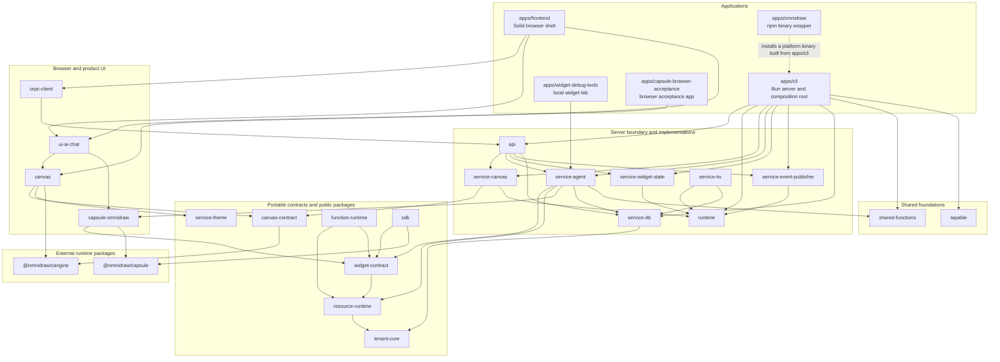

# Omnidraw architecture

**Status:** Current after the S132 canvas-kernel split

Omnidraw is a Bun monorepo with a Solid browser application, a Bun server/CLI,
and a set of capability contracts and service implementations. The browser
projects durable server state into Cangine; it is not the source of durable
truth. Public contracts keep product-neutral capabilities separate from the
OSS implementations that provide them.

## Dependency map

Arrows mean “imports or calls.” This graph shows the load-bearing relationships,
not every type-only or utility dependency in each manifest.

## Applications

| App | Role |
| --- | --- |
| `apps/frontend` | Solid SPA and browser composition root. Owns routing, tenant switching, the oRPC canvas adapter, AI/sidebar contributions, and concrete canvas dependencies. |
| `apps/cli` | Production Bun server and executable entry point. Builds the runtime registry, concrete services, API handlers, persistence, configuration, and static frontend delivery. |
| `apps/omnidraw` | Small npm wrapper that installs and launches the correct prebuilt platform executable. |
| `apps/widget-debug-tools` | Terminal-oriented local lab for exercising widget, file, resource, and agent flows without the full browser app. |
| `apps/capsule-browser-acceptance` | Test application for real-browser Capsule, SDK, widget, and UI integration. It is not production composition. |

## Packages

### Public boundaries and portable runtime

| Package | Role |
| --- | --- |
| `tenant-core` | Tenant identity, placement, immutable tenant context, and scoped-key contracts. |
| `resource-runtime` | Resource capabilities, providers, gateways, and effect boundaries. |
| `widget-contract` | Widget manifests, artifacts, immutable revisions, runtime descriptors, and publication contracts. |
| `function-runtime` | Short-lived function dispatch, execution, scheduling, storage, sandbox, and usage interfaces. |
| `canvas-contract` | Portable Cangine item, command, snapshot, event, query, descriptor, and document-transport contracts. |
| `service-theme` | Isolated theme capability, built-in themes, tokens, and DOM projection helpers. |
| `canvas` | Public Solid canvas host, Cangine runtime projection, optimistic document client, extension seams, and scoped assets/styles. |
| `runtime` | Plugin lifecycle, service registry, dependency ordering, and runtime startup/shutdown. |
| `sdk` | Published widget/server/function-client authoring entry points built over Capsule and public widget contracts. |

### Product and protocol adapters

| Package | Role |
| --- | --- |
| `orpc-client` | Typed browser WebSocket client that aggregates the consolidated oRPC API. |
| `ui-ai-chat` | AI chat, sidebar, widget UI, canvas extensions, preview/runtime hosting, and browser product behavior. |
| `capsule-omnidraw` | Omnidraw policy bridge for Capsule: capabilities, budgets, signing, schemas, host imports, and error mapping. Capsule itself remains product-neutral. |

### Server services

| Package | Role |
| --- | --- |
| `api` | Consolidated oRPC contracts and tenant-authorized handlers. It is a transport boundary, not a persistence authority. |
| `service-canvas` | Durable canvas commands, snapshots, queries, revisions, and events. `CanvasService` is the only durable canvas authority. |
| `service-agent` | Agent sessions, approvals, draft workspaces, widget generation, preview, publication, and function orchestration. |
| `service-widget-state` | Centralized, versioned JSON state for widget instances. `WidgetStateService` is the only widget-instance state authority. |
| `service-event-publisher` | Publishes runtime service events into API subscription streams. |
| `service-db` | Turso-backed models, stores, migrations, and recovery/constraint verification used by concrete OSS services. |
| `service-kv` | Reserved persistent key-value service; currently a placeholder for planned functionality. |

### Shared foundations

| Package | Role |
| --- | --- |
| `shared-functions` | Small shared functional helpers and Omnidraw configuration utilities. |
| `tapable` | Synchronous and asynchronous lifecycle hook primitives used by older/internal orchestration. |

## Essential complexity

1. **Durable canvas versus browser projection.** Canvas persistence is one
   `canvas_items` JSONB row per authored Cangine node. `CanvasService` owns
   durable ordering and revisions. The browser `CanvasDocumentService` owns
   only the current optimistic session and communicates through the injected
   `TCanvasDocumentTransport`.
2. **Widget lifecycle versus widget-instance state.** `service-agent` owns
   mutable drafts and preview/publish orchestration; `widget-contract` defines
   immutable artifacts and revisions; `ui-ai-chat` mounts them in the browser;
   `WidgetStateService` alone owns each placed instance's versioned JSON state.
3. **Tenant scope is an authority boundary.** The server derives tenant
   context before calling services. The frontend must retire old canvas
   runtimes before switching its transport and caches to a new tenant scope.
4. **Transport is not business logic.** `api` and `orpc-client` move typed
   requests and events. Durable decisions stay in services and portable rules
   stay in contract/runtime packages.
5. **The canvas kernel is independently consumable.** After S132,
   `canvas-contract`, `service-theme`, and `canvas` build and pack without the
   OSS API, database, AI UI, or server. A host injects its transport, theme,
   IDs, waits, diagnostics, notifications, images, and optional extensions.

When adding code, put portable data and interfaces in contract/runtime
packages, durable behavior in the owning service, and protocol or product UI
composition at an app boundary. Prefer pure `fn.*` logic, injected `fx.*`
reads, and injected `tx.*` writes around thin orchestration edges.

## Deeper references

- [Widget lifecycle and Capsule model](./llm.widget-system.md)
- [Canvas runtime and document ownership](../../packages/canvas/ARCHITECTURE.md)
- [Managed/public package consumption](./managed-service-package-consumption.md)
- [Current UI surfaces](./screens/SCREENS.md)
