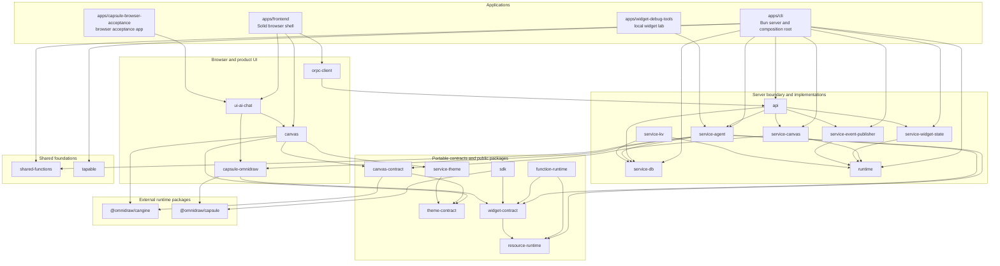

# Omnidraw architecture

**Status:** Current after the filesystem-first single-user hard cut (D6)

Omnidraw is a Bun monorepo with a Solid browser application, a Bun server/CLI,
and a set of capability contracts and service implementations. The browser
projects durable server state into Cangine; it is not the source of durable
truth. Public contracts keep product-neutral capabilities separate from the
OSS implementations that provide them.

## Dependency map

Arrows mean “imports or calls.” This graph shows the load-bearing relationships,
not every type-only or utility dependency in each manifest.

## Applications

| App | Role |
| --- | --- |
| `apps/frontend` | Solid SPA and browser composition root. Owns routing, the singleton oRPC connection, AI/sidebar contributions, and concrete canvas dependencies. |
| `apps/cli` | Production Bun server and executable entry point. Builds the runtime registry, concrete services, API handlers, persistence, configuration, and static frontend delivery. |
| `apps/widget-debug-tools` | Terminal-oriented local lab for exercising widget, file, resource, and agent flows without the full browser app. |
| `apps/capsule-browser-acceptance` | Test application for real-browser Capsule, SDK, widget, and UI integration. It is not production composition. |

## Packages

### Public boundaries and portable runtime

| Package | Role |
| --- | --- |
| `resource-runtime` | Resource capabilities, providers, gateways, effect boundaries, and the bounded optional manifest resource identifier. |
| `widget-contract` | Widget manifest v1, resource-ID-free executable projections, portable build receipts, release descriptors, and runtime descriptors. |
| `function-runtime` | Direct, history-free descriptor-driven function invocation and sandbox drivers. |
| `canvas-contract` | Portable Cangine item, command, snapshot, event, query, descriptor, and document-transport contracts. |
| `theme-contract` | State-free detailed theme and six-code semantic canvas-color types, constants, and validation. |
| `service-theme` | Atomic theme registry/selection authority, built-in themes, semantic lookup, immutable snapshots, and generated DOM projection. |
| `canvas` | Public Solid canvas host, Cangine runtime projection, optimistic document client, extension seams, and scoped assets/styles. |
| `runtime` | Plugin lifecycle, service registry, dependency ordering, and runtime startup/shutdown. |
| `sdk` | Published widget/server/function-client authoring entry points plus the host-independent `omnidraw-widget check/build` CLI built over Capsule and public widget contracts. |

### Product and protocol adapters

| Package | Role |
| --- | --- |
| `orpc-client` | Typed browser WebSocket client that aggregates the consolidated oRPC API. |
| `ui-ai-chat` | AI chat, sidebar, widget UI, canvas extensions, preview/runtime hosting, and browser product behavior. |
| `capsule-omnidraw` | Omnidraw policy bridge for Capsule: capabilities, budgets, signing, schemas, host imports, and error mapping. Capsule itself remains product-neutral. |

### Server services

| Package | Role |
| --- | --- |
| `api` | Consolidated oRPC contracts and handlers. It is a transport boundary, not a persistence authority. |
| `service-canvas` | Durable canvas commands, snapshots, queries, revisions, and events. `CanvasService` is the only durable canvas authority. |
| `service-agent` | Agent sessions, approvals, exact widget-reference resolution, the filesystem widget root, catalog scans, atomic publication, ephemeral Preview, and widget generation/inspection. |
| `service-widget-state` | Centralized, versioned JSON state for widget instances. `WidgetStateService` is the only widget-instance state authority. |
| `service-event-publisher` | Publishes runtime service events into API subscription streams. |
| `service-db` | Turso-backed models, stores, migrations, and recovery/constraint verification used by concrete OSS services. |
| `service-kv` | Reserved persistent key-value service; currently a placeholder for planned functionality. |

### Shared foundations

| Package | Role |
| --- | --- |
| `shared-functions` | Small shared functional helpers and Omnidraw configuration utilities. |
| `tapable` | Synchronous and asynchronous lifecycle hook primitives used by older/internal orchestration. |

## Essential complexity

1. **Durable canvas versus browser projection.** Canvas persistence is one
   `canvas_items` JSONB row per authored Cangine node. `CanvasService` owns
   durable ordering and revisions. The browser `CanvasDocumentService` owns
   only the current optimistic session and communicates through the injected
   `TCanvasDocumentTransport`.
2. **Widget authority is the filesystem.** Drafts, immutable published
   folders, and ephemeral Preview live under one pinned widget root.
   `service-agent` scans bounded catalog generations and publishes
   atomically; `ui-ai-chat` mounts exact signed bytes in the browser;
   `WidgetStateService` alone owns each placed instance's versioned JSON
   state. The database stores no widget catalog, artifacts, Preview records,
   or function history.
3. **Build output is the presentation handoff.** A repository-local public SDK
   command stages and atomically emits `dist/` plus a strict receipt without
   host or database access. The CLI observes receipts with filesystem hints and
   bounded polling, independently constructs and validates a generation, and
   exposes only accepted generations to Preview and publication. Editors are
   never falsely serialized by a host lock.
4. **The manifest owns concrete resources.** A logical resource declaration
   may contain one bounded local `resourceId`; that ID is excluded from
   executable identity but included in source/build freshness. Preview and
   FunctionService resolve only the exact accepted/current manifest, while
   placement and canvas contracts carry no binding map or picker input.
5. **The application is single-user.** There is one singleton composition:
   one database, resource store, canvas service, agent service, and oRPC
   context. No tenant, organization, account, or membership scope exists;
   plaintext secret reveal is exposed only on the trusted local human API.
6. **Transport is not business logic.** `api` and `orpc-client` move typed
   requests and events. Durable decisions stay in services and portable rules
   stay in contract/runtime packages.
7. **The canvas kernel is independently consumable.** After S132,
   `theme-contract`, `canvas-contract`, `service-theme`, and `canvas` build and pack without the
   OSS API, database, AI UI, or server. A host injects its transport, theme,
   IDs, waits, diagnostics, notifications, images, and optional extensions.
8. **Agent context and Preview evidence are scoped authorities.** Chat carries
   a verified canvas ID and server-resolved widget refs; mutable drafts are
   mounted without making published folders writable. Offline check cannot
   claim runtime success. Host-only Preview inspection fences the exact active
   chat/widget target and accepted generation, separates isolated artifact
   fidelity from real manifest-bound Preview policy, and redacts internal
   identities. Its process-owned diagnostic clone can reproduce an absent or
   failed visible frame without creating canvas layout; exact mounting,
   retired, ambiguous, and generation-mismatched states remain structured and
   cannot fall back to another frame or generation.

When adding code, put portable data and interfaces in contract/runtime
packages, durable behavior in the owning service, and protocol or product UI
composition at an app boundary. Prefer pure `fn.*` logic, injected `fx.*`
reads, and injected `tx.*` writes around thin orchestration edges.

## Deeper references

- [Widget lifecycle and Capsule model](./llm.widget-system.md)
- [Filesystem-first widget design report](./widget-filesystem-design.md)
- [Canvas runtime and document ownership](../../packages/canvas/ARCHITECTURE.md)
- [Managed/public package consumption](./managed-service-package-consumption.md)
- [Current UI surfaces](./screens/SCREENS.md)
