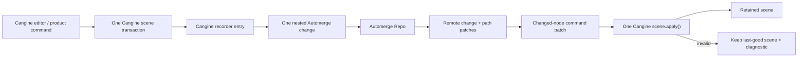

# Canvas document architecture: Automerge-normalized Cangine scene

Status: accepted exploration outcome for E39; implementation is split into
follow-up tasks and has not changed the production document schema.

## Decision

Vibecanvas should remove `TCanvasDoc` as a second canvas geometry model.

- Cangine owns the durable scene vocabulary: node kinds, transforms,
  hierarchy, order, geometry, paint, text, connector endpoints, widget frames,
  metadata, extensions, scene commands, and scene validation.
- Automerge owns the authoritative collaborative state, causal merge, conflict
  representation, replication, and document history.
- Vibecanvas owns a small versioned document envelope, asset references,
  namespaced widget/authoring extensions, authorization projections, product
  history policy, migrations, and runtime resources/portals.

Cangine must not own the Automerge repository. Automerge must not acquire a
Vibecanvas geometry union. The target has one persisted scene vocabulary and
one synchronization bridge.

The decision is based on an executable two-peer prototype in
[`cangine-automerge-document.test.ts`](../../packages/canvas/tests/exploration/cangine-automerge-document.test.ts).
It is not permission for a flag-day production rewrite.

## Why

The current `elements`/`groups` model and the Cangine retained scene both
describe the same free-form canvas:

- rect, ellipse, diamond, text, image, pen, line, arrow, groups, inline text,
  widgets, transform, hierarchy, and order are translated into equivalent
  Cangine nodes;
- product and engine IDs are mapped through a persistent projection index;
- styles, degrees, positions, bindings, and group structure are converted into
  Cangine paints, radians, transforms, endpoints, and hierarchy;
- product changes are cloned, hashed, summarized, projected, signed, diffed,
  indexed, and finally emitted as the scene commands Cangine already accepts.

The narrow CRDT/projection path contains about 7,229 production lines:

| Current area | Lines | Target |
| --- | ---: | --- |
| `engine/projection` | 4,404 | migration-only, then delete |
| `engine/projection-runtime` | 987 | keep only resource/portal effects |
| `services/projection` | 155 | replace with the bridge |
| `services/crdt` | 1,683 | replace custom diff/history ops with Automerge patches |

Seventy-four canvas source files currently import the legacy document types;
only forty-one import Cangine. The extra representation is therefore not a
contained persistence adapter: it is the product-wide canvas vocabulary.

The schema also has observable drift:

- `zCanvasDoc` requires `name`, while canvas creation writes no document name
  and the database already owns it;
- the full schema is not the production load-time validator;
- `zDrawingStyle` is an unused duplicate;
- base `bindings` do not drive connector behavior;
- `originalText` and link are projected into metadata but have no product
  behavior;
- image natural dimensions are persisted but not used by projection;
- element timestamps are written much more often than they are consumed;
- there is no document schema version.

Cangine 0.2.2 already supplies a serializable `TSceneSnapshot`,
`TSceneNode`, atomic scene transactions, commands, recorder entries, editor
commands, and namespaced JSON extensions. Its explicit boundary says that
Automerge, persistence, collaboration, product history, authorization, widget
business logic, portal content, and runtime resources remain application-owned.
That is the boundary adopted here.

## Target document

The shared contract should live in a small dependency-light package,
`@vibecanvas/canvas-document`, rather than in `service-automerge` or the UI
canvas package.

```ts
type TCollaborativeCanvasDocumentV2 = {
  schemaVersion: 2;
  cangineSceneVersion: TSceneSnapshot["schemaVersion"]; // "1.0.0"
  rootLayerIds: TLayerId[];
  nodes: Record<TNodeId, TSceneNode>;
  assets: Record<TResourceId, TCanvasAssetReference>;
};
```

Important constraints:

- `nodes` is a map, not the snapshot's node array. Node lookup and independent
  field mutation are stable Automerge targets.
- The map key must equal `node.id`.
- `rootLayerIds` and `nodes` contain authored durable layers, normally the
  content layer. Background, overlay, debug, selection, transient preview, and
  other UI layers are runtime scaffolding materialized by the bridge.
- Canvas ID, name, creation time, and the active Automerge URL live in the
  database. They are not duplicated in the Automerge document.
- The Cangine package is pinned exactly. `schemaVersion: 2` is bound to
  Cangine scene schema `"1.0.0"`. A Cangine scene-schema change requires a
  canvas-document migration before the dependency may advance.
- Runtime handles, decoded bytes, DOM nodes, callbacks, portal hosts, services,
  backend values, and renderer objects are forbidden in the document.

A pure materializer sorts the normalized nodes into a
`TSceneSnapshot.nodes` array, adds runtime-owned layers, and validates the
snapshot for initial `scene.replace()`.

## Ownership

| Concern | Authority | Decision |
| --- | --- | --- |
| Canvas ID/name/created time | database | Remove duplicates from the document. |
| Automerge URL and migrated version | database | The row points to the active document and is the atomic cutover point. |
| Scene node vocabulary | Cangine | Persist `TSceneNode` directly; no parallel element union. |
| Collaboration and merge | Automerge | Nested map fields are independently mergeable. |
| Authored hierarchy and order | Cangine nodes in Automerge | Persist `parentId`, `orderKey`, and authored root layer IDs. |
| System layers and transients | Cangine runtime bridge | Never persist selection, previews, overlay, or debug nodes. |
| Selection/focus/hit IDs | Cangine/editor | Use scene node IDs directly. |
| Product bundles | Cangine group subtrees | A shape with inline text is one atomic group-subtree transaction. |
| Locking | `vibecanvas:authoring` extension | Keep because selection and editing policy consume it. |
| Element timestamps | nowhere by default | Remove. Add an audit log separately if audit becomes a requirement. |
| Original text/link | nowhere until a behavior exists | Current metadata-only fields are not a durable requirement. |
| Rotation | Cangine transform | Persist radians; remove degree conversion. |
| Connector attachment | Cangine endpoints | Replace base bindings and line/arrow bindings. |
| Existing theme tokens | migration compiler | Resolve once to concrete Cangine values. New nodes store concrete paints/sizes. |
| Images/fonts | asset descriptors plus runtime resource service | Persist references, not runtime resource values. |
| Widget identity | versioned widget-frame extension | Server parses the narrow extension independently. |
| Portal content/callbacks | runtime widget/portal service | Derived from widget frames and never persisted. |
| Validation | layered | Contract validates envelope/extensions; Cangine validates scenes; server enforces quotas/authz. |
| Product undo/redo | canvas bridge | Collaborative compensating Automerge changes, not Cangine's local linear history. |
| Migration | Vibecanvas canvas-document package/tooling | Cangine does not migrate application documents. |

## Identity and composite nodes

There is one global Cangine node ID namespace per document.

- A simple legacy element keeps its element ID when it does not collide.
- A legacy group keeps its group ID when it does not collide.
- Migration detects element/group collisions and deterministically prefixes the
  conflicting legacy ID. A persisted remap is emitted in the migration report.
- New IDs are UUIDs generated at the application edge.
- A composite object is a persisted group subtree. The root group is the
  selection/clone/delete identity; child IDs are persisted and stable.
- Inline text, widget chrome, and other bundle children are committed in the
  same Cangine transaction and Automerge change.

This removes the product-to-engine ID namespace and `ProjectionIndex`.

## Product extensions

Extensions must be versioned, namespaced JSON and must not duplicate geometry.

```ts
type TWidgetExtensionV1 =
  | {
      schemaVersion: 1;
      type: "ui-widget";
      kind: string;
      payload?: TJsonValue;
      uiProps?: TJsonValue;
    }
  | {
      schemaVersion: 1;
      type: "widget-instance";
      definitionId: string;
      revisionId: string;
      instanceId: string;
      stateDocumentId?: string;
      uiProps?: TJsonValue;
    };

type TAuthoringExtensionV1 = {
  schemaVersion: 1;
  locked?: boolean;
  penSource?: {
    points: TVec2[];
    pressures: number[];
    simulatePressure: boolean;
  };
};
```

Use `extensions["vibecanvas:widget"]` only on a `widget-frame`. The server
extractor accepts only the documented discriminator and fields, validates
lowercase UUIDs, rejects duplicate instance IDs, and ignores unrelated node
extensions. Widget state authorization continues to use its persisted,
sequence-gated projection.

Freehand source samples remain temporarily because current pen editing and
restyling reconstructs authored samples. The rendered Cangine polygon/path is
the scene representation; `penSource` is the one justified authoring-source
exception. A later subtraction can remove it after proving no supported edit
uses it.

Do not persist theme tokens. Resolving tokens once makes a canvas visually
stable across theme changes and removes theme-driven full projection. Canvas
UI background/grid still follows the runtime theme.

## Assets and runtime effects

The same Automerge document contains small descriptors keyed by the Cangine
`resourceId`:

```ts
type TCanvasAssetReference =
  | {
      schemaVersion: 1;
      kind: "image";
      source: { kind: "media-file"; mediaFileId: string };
    }
  | {
      schemaVersion: 1;
      kind: "external-image";
      source: { kind: "url"; value: string };
    };
```

Only trusted/import paths may create external URLs. Encoded bytes stay in media
storage. Resource registration, decoding, readiness, retry, and disposal stay
in the canvas runtime.

Deleting a node does not synchronously hard-delete its asset. Undo and remote
references would make that unsafe. Asset records are retained while referenced
or within a recovery window; a separate database garbage collector removes
unreferenced media after the existing retention policy. Clone copies the
descriptor/reference, not the bytes.

Widget portal descriptors are derived from the `widget-frame` plus its
extension. Portal callbacks and guest DOM are runtime-only. Existing
generation-based staging and rollback remain because asynchronous resources
and portals can fail independently of a valid scene transaction.

## Synchronization bridge



Local path:

1. The standard Cangine editor handles ordinary mechanics. Product plugins
   remain for policy, assets, widgets, tool defaults, and application commands.
2. One user action optimistically commits one atomic Cangine transaction.
   Automerge remains authoritative.
3. The recorder produces canonical upsert/remove commands plus before-images.
4. One `Automerge.change()` recursively reconciles those commands into the
   node map. Existing nested objects are mutated by field; a whole node is not
   overwritten merely because the recorder emits a whole-node upsert.
5. The local Cangine scene is already current. The bridge does not replay its
   own Automerge change.

The bridge is the exclusive local writer for scene-node paths. It tracks the
local change heads/source and consumes the corresponding handle event without
reapplying it. `patchInfo.source` identifies handle-local changes; Cangine
transaction source identifies remote scene applications. This replaces custom
write-depth and pending-event counters.

Cangine recorder listener failures are deliberately contained by Cangine and
do not roll back an already valid scene commit. The production listener must
therefore catch and publish an Automerge write failure itself, gate further
editing, omit the failed history item, and reconcile/recreate the scene from
the authoritative Automerge document after the transaction returns. Throwing
from a recorder subscriber is not a durability mechanism.

Remote path:

1. Automerge Repo supplies the merged document and path patches.
2. Paths under `nodes/<id>/...` become a deduplicated changed-ID set.
3. Deleted roots become remove commands; surviving nodes become topologically
   ordered upserts. Root/schema changes use one validated replacement.
4. All commands caused by one remote Automerge change are passed to one
   `scene.apply()`, preserving atomic visibility.
5. Recorder entries whose source begins with `bridge:remote` are ignored by the
   writer.

Automerge expands a newly assigned object into multiple nested patches. The
bridge therefore deduplicates by the first `nodes/<id>` path segments; it must
never assume one patch per node.

## Conflict and invalid-state policy

- Disjoint nested edits to the same node merge independently.
- Same-leaf concurrent writes use Automerge's deterministic visible winner;
  `Automerge.getConflicts()` retains all concurrent values for diagnostics or
  a future resolver.
- Node deletion concurrent with a nested node update is delete-wins.
- Arrays such as points/path commands are atomic authored geometry values in
  v2. Add list-granular editing only if a measured collaborative use case needs
  it.
- A merged CRDT state can violate scene hierarchy or reference invariants.
  Automerge remains the durable authority; the client does not write an
  automatic “repair” that could fight other peers.
- The bridge attempts the remote batch atomically. On validation failure it
  retains the last-good Cangine scene, records a document-level diagnostic,
  disables edits that depend on the invalid nodes, and retries when a later
  change repairs the state.
- Admission validation and quotas prevent knowingly invalid snapshots from
  being created or imported. A local-only placeholder is allowed for UX, but
  it is never written into the collaborative scene.

## Collaborative history

Cangine's bounded local linear history is not the product history because it
cannot account for remote Automerge changes.

The bridge records a history item from the recorder before-images:

- added and removed persisted subtrees;
- leaf-level before/after mutations for updated nodes;
- one coalescing/grouping key per product action.

Undo and redo create new Cangine commands and therefore new Automerge changes.
For each leaf, undo applies only when the current value still equals the
original action's `after` value. It then restores the `before` value. Unrelated
remote fields are preserved. A remotely changed same leaf is skipped and
reported as a history conflict rather than clobbered. Subtree restore/remove
uses the same guarded policy and new IDs are never silently substituted.

The development recorder should display both the Cangine action/commands and
the resulting Automerge heads/change hash. Automerge changes are persistence
evidence; normalized input may remain optional diagnostics.

## Executable evidence

The E39 prototype uses two real Automerge documents, two public Cangine engines
with the test backend, Cangine recorder entries, and only public scene/editor
APIs. Seven tests prove:

1. local transform plus creation is one Cangine revision and one Automerge
   change; a disjoint remote opacity edit converges without echo;
2. hierarchy, reparent, and order changes arrive as one remote Cangine
   transaction;
3. same-field conflicts remain inspectable and delete versus nested update is
   delete-wins;
4. invalid hierarchy keeps the last-good scene and a later repair applies;
5. compensating undo/redo preserves an unrelated remote field and standard
   editor delete flows through the bridge;
6. every legacy element discriminator, groups, nested groups, inline text,
   connector bindings, image asset, pen source, UI widget, and widget instance
   migrates into a valid scene and Automerge round-trip;
7. in a 2,000-node document, one nested field edit yields one relevant patch,
   one changed node ID, and one Cangine upsert rather than a document scan.

The focused suite passes in under one second of test execution on the
development machine. That is proof of behavior and work proportionality, not a
production latency benchmark.

## Validation and performance gates

Before cutover:

- envelope validation checks exact schema versions, map-key/node-ID equality,
  asset shapes, extension versions, JSON depth/entry limits, string limits,
  UUIDs, and supported external URL policy;
- Cangine validates the materialized snapshot and every command batch;
- Automerge/server admission enforces document byte size, maximum node and
  asset counts, maximum changes per request, and per-tenant authorization;
- widget projection independently validates its security-sensitive fields and
  preserves sequence, quarantine, uniqueness, and authorization semantics;
- malformed nodes/extensions/assets have fuzz and quota tests.

The new bridge must run the existing compatibility, collaboration, widget,
CLI, lifecycle, browser, and performance suites. Add real two-browser
Automerge cases for same-node edits, active gestures, reconnect/offline replay,
and version rejection.

Performance acceptance:

- one changed node must cause no whole-document clone, JSON hash, signature
  scan, or collection scan;
- patch work and Cangine commands are proportional to changed nodes plus their
  affected hierarchy;
- at 5k/50k/100k nodes, isolated single-node p95 must be no slower than 110% of
  a same-machine current-path baseline and should beat the recorded 5k
  projection p95 of 2.434 ms;
- boot/first-render may not regress more than 10% at 5k nodes;
- allocations and retained bytes must not increase at 5k nodes;
- a long two-peer edit/reconnect soak must converge with bounded recorder,
  history, and resource retention.

Deletion is blocked if those gates require retaining the old projector or
adding a third permanent model.

## Migration and rollout

Persisted canvases exist, so migration uses a new Automerge document URL. It
does not mutate `elements`/`groups` in place.

1. Ship the v2 contract, server widget extractor, generic Automerge lifecycle
   event, and strict version rejection. Existing clients remain on v1.
2. Ship the v2 bridge/editor/history behind a read-version gate. New writes
   still target only one schema.
3. Create a migration compiler that invokes the current projector once,
   converts its valid snapshot to the normalized map, attaches minimal
   extensions/assets, resolves theme tokens, and emits a deterministic report.
4. For each canvas, copy v1 into a new v2 Automerge document, validate it,
   compare semantic/node/widget/asset inventories, and run server widget
   projection.
5. Quiesce writes for the short cutover window, replay any final v1 changes,
   validate again, then atomically update the database's Automerge URL and
   document-version marker.
6. New clients open v2. Old clients receive an explicit upgrade-required
   response and can never join a v2 document.
7. Retain the old URL and migration report as the rollback point for a bounded
   recovery window. Rollback atomically restores the old URL while v1-capable
   code is still deployed.
8. After the observation window and backups, disable v1 creation/migration,
   remove compatibility code, then delete old documents under retention policy.

There is no steady-state dual write. The existing projection is migration-only
after cutover and has a scheduled deletion task.

## Current subsystem disposition

| Current subsystem | Disposition | Replacement/remaining responsibility |
| --- | --- | --- |
| `service-automerge/types/canvas-doc.*` | migrate-only, then delete | v2 contract in `canvas-document` |
| `AutomergeService` canvas generics and element callbacks | simplify | generic document/version events and quotas |
| `WidgetInstanceMetadataProjector` | keep and adapt | consume the narrow v2 widget extractor |
| `engine/projection/*` and projectors | migration-only, then delete | direct Cangine nodes |
| `ProjectionIndex` and derived ID helpers | delete | persisted scene IDs |
| `ProjectionCoordinator` | replace | Automerge/Cangine bridge |
| `CrdtProjectionService` | replace | bridge remote patch batch |
| `CrdtService` snapshot/hash/change-summary machinery | replace | Automerge patches/heads and a thin handle facade |
| `fxBuilder` and `tx.apply-ops` | replace | nested document mutation plus collaborative history adapter |
| `projection-runtime` command/diff staging | delete | direct serialized scene commands |
| `PortalContentBridge` and viewport logic | keep/simplify | runtime-only portal projection |
| `CanvasEngineAdapter` | keep/simplify | Cangine lifecycle and bridge composition |
| `CanvasEditorBridge` | keep/simplify | standard editor plus product command/history adapter |
| `product-runtime` geometry/ID conversion | delete | Cangine geometry and IDs |
| `product-runtime` active gesture policy | keep/simplify | cancel/rebase policy against changed scene node IDs |
| `HistoryService` | replace | guarded Automerge-aware compensating history |
| `SceneService`, selection, group, order, clone, shape/text/path plugins | rewrite incrementally | operate on scene nodes/editor commands |
| image service/plugin | keep/simplify | asset lifecycle plus image-node commands |
| `CanvasPortalService` and widget host | keep/simplify | derive runtime portals from widget-frame extensions |
| `ThemeService` | keep | runtime UI theme; no authored-node reprojection |
| canvas CLI/API element schema and commands | replace | query/mutate Cangine nodes and product extensions |
| old schema/projection/CLI fixtures | migrate-only, then delete | v2 fixtures and migration golden files |

## Rejected alternatives

1. **Keep `TCanvasDoc` as-is.** Rejected because current product semantics do
   not justify a second geometry vocabulary and its translation machinery.
2. **Store `TSceneSnapshot.nodes` as an Automerge array.** Rejected because
   array positions are poor independent mutation/lookup targets.
3. **Let Cangine own Automerge/persistence.** Rejected because Cangine
   deliberately does not own application collaboration, authz, assets, or
   migrations.
4. **Make `service-automerge` own the canvas schema.** Rejected because it
   prevents the persistence service from being generic and couples server
   infrastructure to UI/product geometry.
5. **Keep permanent dual writes or a permanent v1 projector.** Rejected because
   that creates a third architecture and cannot satisfy the simplification
   goal.
6. **Use Cangine local linear history as product history.** Rejected because it
   can overwrite or ignore remote collaborative changes.
7. **Migrate in place.** Rejected because old/offline clients could corrupt the
   schema and rollback would be ambiguous.

## Simplification exit condition

The migration counts as complete only when:

- production stores one Cangine node vocabulary;
- all writes cross one Automerge/Cangine bridge;
- server widget authorization reads the v2 extension contract;
- clients and CLI reject unsupported document versions;
- the old projector is used only by an offline migration tool and is then
  deleted;
- `TElement`, `TGroup`, product/derived ID maps, whole-document hashing,
  projection signatures, and dual geometry tests are removed;
- no permanent compatibility path or dual write remains.
