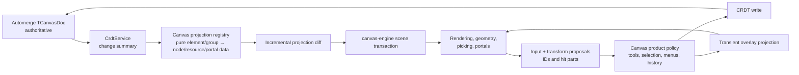

# Canvas-engine compatibility report

Status: complete compatibility re-audit  
Vibecanvas branch: `codex/canvas-engine-compatibility`  
Inspected engine: `/Users/omarezzat/Workspace/vibecanvas/canvas-engine`  
Original engine commit: `c7be5910cc54ab373cd6e7025c1d27e7a8827970`  
Previous re-evaluation: `cd308f686468acd6171fcc975f0dfe478124ae9d`  
Current re-evaluation: `58009176fd4622c661e50ddf0c7d3216633c76c0`  
Audit date: 2026-07-24

## Executive decision

**Begin the replacement pilot. The updated canvas-engine has no remaining
public API blocker for Vibecanvas. Do not remove Konva until the adapter exists
and the three product-integration validation gates pass.**

The engine is already compatible with the hard rendering mechanisms
Vibecanvas uses: retained scene transactions, layers, groups, rectangles,
ellipses, diamonds, paths, pressure-derived pen outlines, text, images,
connectors, widget frames, DOM portals, ordering, camera transforms, geometry,
indexed picking, marquee queries, box transforms, SVG export, accessibility,
and lifecycle management.

It is intentionally not a Konva-compatible object model. This is desirable:
Vibecanvas should replace live `Konva.Node` references with stable product IDs
and pure element-to-scene projections. It also means the migration is a
`packages/canvas` architecture change, not an import rename.

The current go/no-go result is:

| Decision area | Result |
|---|---|
| Rendering and geometry capability | Go |
| Camera, selection affordance, standard transform capability | Go |
| Widget frame and DOM portal mechanism | Go, pending product-host browser validation |
| Automerge/history ownership boundary | Go through a canvas-owned adapter |
| Line vertex editing | Go through hit-tested screen transients and canvas-owned point-edit policy |
| Alt-drag clone preview | Go through world transients and atomic durable-ID handoff |
| External sidebar widget-placement ghost | Go through a portal-free transient widget frame |
| CI/release consumption | Filesystem tarball works through Bun, native Node ESM, default Vitest externalization, TypeScript, Vite, and Chromium |
| Immediate Konva deletion | No-go |
| Integration pilot | Go |

The previously proposed service now exists as `engine.transients`. It closes
all four former engine-gap rows with owner-scoped, bounded world/screen
forests, optional indexed picking, and atomic handoff when a durable commit
introduces a transient ID. A separate Konva adapter is neither needed nor
recommended.

### Re-evaluation delta

| Finding | At `cd308f6` | At `5800917` |
|---|---|---|
| Application transient projection | Resolved by public `engine.transients` | Unchanged and verified |
| Line point handles | Canvas adapter using hit-tested `screen-overlay` nodes | Unchanged |
| Clone preview | Canvas adapter using a `world-overlay` owner and same-ID durable commit | Transform-only previews now preserve immutable path geometry and retained GPU buffers |
| Sidebar ghost | Canvas adapter using a portal-free transient `widget-frame` | Unchanged |
| Compiled artifact | Deterministic tarball existed | Still deterministic; current SHA-256 is `7069d90a20253b69f7c805d369961f09e737c133bb3594684e71ca9fb0c73240` |
| Native Node/default Vitest | Failed on extensionless emitted imports | Resolved; all public entrypoints pass native Node and default Vitest externalization |
| Captured transform moves | Still performed avoidable rollback/hit work | Engine-owned captured gestures avoid rollback clones and implicit hit tests without changing public capture behavior |
| Large path transform | Public mechanism existed; integrated cost was a risk | 100,000-command transform chain measured 1.63 ms after initial compilation in upstream evidence |

The updated CAPSULE/library package therefore closes the prior distribution
defect and materially reduces the large-path gesture risk. It does not change
the ownership conclusion: the remaining work is a Vibecanvas projection and
product-integration migration, not another engine feature request.

## Scope and evidence

This audit compares behavior actually used by
[`packages/canvas`](../../packages/canvas), not the full Konva API.

Evidence added in this worktree:

- [`compatibility.test.ts`](../../packages/canvas/tests/canvas-engine/compatibility.test.ts)
  executes the engine through public package exports.
- [`compatibility.matrix.ts`](../../packages/canvas/tests/canvas-engine/compatibility.matrix.ts)
  is the complete requirement ledger.
- [`poc.project-canvas-doc.ts`](../../packages/canvas/tests/canvas-engine/poc.project-canvas-doc.ts)
  is a test-local vertical slice that projects a representative real
  `TCanvasDoc` into engine nodes and resources without Konva objects.
- [`packages/canvas/package.json`](../../packages/canvas/package.json) consumes
  the compiled `@vibecanvas/canvas-engine` tarball through the requested local
  filesystem dependency.
- [`packages/canvas/vitest.config.ts`](../../packages/canvas/vitest.config.ts)
  keeps the browser-targeted package inside Vite's transform pipeline.

Executed evidence:

| Check | Result |
|---|---:|
| New Vibecanvas compatibility suite | 1 file / 9 tests passed |
| Complete `@vibecanvas/canvas` suite | 51 files / 223 tests passed |
| `packages/canvas` TypeScript check | passed |
| Engine current-commit upstream quick gate | 110 files / 1031 tests passed |
| Engine current-commit Chromium gate | 33 / 33 passed |
| Engine packed-consumer verification re-run | passed; SHA-256 matched |
| Packed artifact native Node ESM imports | passed for all five public entrypoints |
| Packed artifact default Vitest externalization | passed without consumer overrides |
| Current filesystem artifact | `vibecanvas-canvas-engine-0.1.0.tgz`, SHA-256 `7069d90…3240` |

The engine's own final report also records cross-browser, visual, performance,
coverage, context-loss, and lifecycle evidence. This audit did not rerun those
browser suites. More importantly, no such engine-only suite proves behavior
with Vibecanvas's Automerge adapter, Solid overlays, and real hosted widgets;
those remain explicit validation gates below.

## Current Konva coupling

The current package contains 200 TypeScript/TSX source files. Of those:

| Coupling measure | Count |
|---|---:|
| Source files referencing Konva | 97 / 200 (48.5%) |
| Source files with runtime `import Konva` | 19 |
| Explicit direct constructor expressions | 32 |
| Source files with type-only Konva imports | 80 |
| Source files importing `konva/lib/*` types | 14 |
| Konva-related matching source lines | 818 |
| Konva-related matching test lines | 309 |
| Test files referencing Konva | 38 / 58 |

The 17 constructor sites understate the coupling. Most of the package passes
live nodes through services and plugin hooks, calls mutable node methods, tests
with `instanceof`, derives persistence from renderer state, and stores
selection as `Konva.Node[]`.

The coupling crosses every stable feature:

| Current area | Konva responsibility today | Engine replacement |
|---|---|---|
| `SceneService` | Stage, three layers, resize, preview node | One `IInfiniteCanvasEngine`, layer nodes, lifecycle |
| `CameraService` | Mutate layer position/scale | `engine.camera` |
| `ElementService` | `TElement` ↔ mutable node registry | Pure product-element projection registry |
| `SelectionService` | Live node arrays | Stable product/engine IDs |
| `Transform.plugin` | `Konva.Transformer`, proxy nodes, node mutation | Transform selection, proposals, preview |
| `Grid.plugin` | Custom `Konva.Shape` draw callback | Background grid node |
| `shape2d` | Rect/Line/Ellipse construction | Rect/ellipse/polygon nodes |
| `shape1d` | Custom shape renderer and circle handles | Connector/path nodes plus application transient handles |
| `pen` | Perfect-freehand SVG path in `Konva.Path` | Perfect-freehand outline to polygon/path |
| `text` | `Konva.Text` plus textarea projection | Text node/service plus editing session |
| `image` | `HTMLImageElement` in `Konva.Image` | Resource manager plus image node |
| `group` | Mutable `Konva.Group` hierarchy/boundaries | Scene hierarchy and geometry |
| `render-order` | Node z-index mutation | Order-key transactions |
| `widget-host` | Group of frame shapes plus synced DOM | Widget-frame node plus portal registration |
| `scene-hydrator` | Create/update/destroy live nodes | Project Automerge changes to engine commands |
| recorder/debug | Monkey-patch `Konva.Node.fire` | Input subscription, scene journal, CRDT recorder |

This is why a compatibility wrapper that imitates `Konva.Node` would preserve
the complexity the new engine is meant to remove.

## Compatibility summary

The executable matrix contains 36 used requirements:

| Status | Count | Meaning |
|---|---:|---|
| Compatible | 19 | Engine public API directly supplies the mechanism |
| Canvas adapter | 13 | Intentionally application-owned behavior must be projected/wired |
| Engine gap | 0 | No missing public mechanism blocks a clean parity implementation |
| Release gap | 1 | The requested absolute PoC filepath is intentionally machine-specific |
| Validation gap | 3 | API exists, but real product integration evidence is absent |

These counts are not a percentage-readiness score. The updated engine clears
the API blockers, but the three product validation gaps still gate the final
cutover because they cover real widgets, collaboration during gestures, and
integrated performance.

### Scene, rendering, and geometry

| Requirement | Status | Finding |
|---|---|---|
| Background/content/overlay layers | Compatible | Layer roles plus world/screen coordinate spaces cover the current three-layer model. |
| Atomic scene updates | Compatible | Upsert/update/remove/reparent/reorder/replace and deterministic change sets are stronger than mutable node updates. |
| Rect/ellipse/diamond | Compatible | Rect, ellipse, and polygon nodes map directly. |
| Line/arrow | Compatible | Connector nodes support straight, quadratic, Bézier, orthogonal, and manual paths plus markers. |
| Curved multi-point lines | Compatible through projection | The PoC converts the current Catmull-Rom point model into cubic path commands. |
| Pen | Compatible through projection | `perfect-freehand` outline points become a filled engine polygon. Pressure stays product data. |
| Text | Compatible | Shared layout/render/hit/caret/selection geometry and DOM edit projection exist. |
| Shape inline text | Adapter | Project one product element to one semantic group with shape and derived text children. |
| Images | Compatible | URL/Blob/ArrayBuffer/ImageBitmap resources, fit, crop, decoding, and error isolation exist. |
| Groups | Compatible | Nested transforms, clips, bounds, ordering, and subtree operations exist. |
| Grid | Compatible | Engine grid backgrounds are zoom-aware and world-anchored. |
| Z-order | Compatible | Order-key helpers and transaction moves replace mutable z-index operations. |
| SVG export | Compatible/new capability | Not required for current parity, but already available. |
| Animation/3D | Compatible/new capability | Useful future surface; not a cutover dependency. |

The PoC deliberately uses a product element group:

```text
product element ID, kind=group
  ├─ element-id::render
  └─ element-id::inline-text (only when needed)
```

This gives the application one stable semantic selection ID while letting the
engine render multiple derived nodes. `ancestorsOf()` maps a child hit back to
the product element and its product group path.

### Input, selection, and transforms

| Requirement | Status | Finding |
|---|---|---|
| Pointer/wheel/key/touch/pen input | Compatible | Normalized named coordinate spaces and pointer capture exist. |
| Click/double-click semantics | Adapter | Engine emits low-level pointer input; its whiteboard consumer derives double-click from the host DOM. |
| Painted hit testing | Compatible | Indexed world/viewport hit tests replace node event bubbling. |
| Thin-line selection tolerance | Compatible through policy | Canvas can request viewport hit tolerance instead of a Konva `hitFunc`. |
| Marquee/lasso | Compatible | Indexed rectangle and polygon queries plus a marquee interaction session exist. |
| Nested semantic selection | Adapter | Engine supplies hit paths/ancestors and ID affordance; canvas retains selection policy. |
| Move/resize/rotate | Compatible | Proposals, multi-selection, snapping adjusters, and ephemeral previews exist. |
| Application transient projection | Compatible | Owner-scoped world/screen forests render and optionally participate in geometry and indexed picking without durable scene/journal mutation. |
| Line vertex/midpoint editing | Adapter | Project semantic handle IDs through a hit-tested `screen-overlay`; update the world path through canvas policy. |
| Alt-drag clone preview | Adapter | Project new clone IDs through a `world-overlay`; a same-ID durable commit clears the complete colliding owner atomically. |
| External widget placement ghost | Adapter | The sidebar DOM gesture drives a portal-free transient `widget-frame`, including async committing appearance. |

The built-in box-transform handle union remains closed, but it is no longer a
blocker. Custom line handles are ordinary application transients and their hit
results include both `nodeId` and `transientOwnerId`.

### Widgets and portals

| Requirement | Status | Finding |
|---|---|---|
| Standard widget chrome | Compatible | `widget-frame` includes title bar, content area, controls, collapse/active state, resize parts, and stable hit-part IDs. |
| DOM placement | Compatible | Portal registration is runtime-only; scene data remains serializable. |
| Camera/group projection | Compatible | Portal geometry inherits world transforms, clipping, opacity, and visibility. |
| Input gating and capture | Compatible at engine boundary | Engine claims capture across canvas and portal surfaces. |
| Widget business logic | Canvas-owned | Mount callbacks, actor/function clients, menu commands, delete policy, fullscreen, and theme remain outside the engine. |
| Actual Vibecanvas hosted widget | **Validation gap** | No real widget host has yet been mounted, focused, dragged, resized, minimized, or fullscreened on the new engine. |

This boundary matches the managed-service architecture: placing a widget still
creates CRDT state and browser UI without provisioning resident backend
compute. The engine does not import tenants, actors, functions, resources,
Automerge, or backend APIs.

### Collaboration, history, and extensions

| Requirement | Status | Finding |
|---|---|---|
| Automerge authority | Canvas adapter | Automerge remains authoritative; the engine is a retained render projection. |
| Incremental remote updates | Canvas adapter | Convert a CRDT change summary to coherent engine commands. |
| Local history | Canvas adapter | Keep current command/CRDT history policy or rebuild it above CRDT. |
| Engine scene journal | Compatible mechanism | Useful for diagnostics/replay, but must not become a second collaboration authority. |
| Remote change during local gesture | **Validation gap** | Define cancel/rebase policy and test it adversarially. |
| Late element definitions | Canvas adapter | Replace `createNode/toElement/updateElement` callbacks with projection definitions. |
| Product context/style menus | Canvas-owned | Feed current services with engine IDs, parts, persisted elements, and resolved theme values. |
| Product recorder | Canvas adapter | Subscribe to normalized input and CRDT writes; do not monkey-patch a renderer prototype. |

## What remains

### Resolved — Public application transient projection

Engine commit `cd308f6` implemented the needed mechanism, and current commit
`5800917` preserves it:

```ts
const owner = engine.transients.createOwner("sidebar-widget-drop");
owner.replace({
  band: "world-overlay",
  hitTest: "none",
  nodes: [/* built-in transient scene nodes */],
});
owner.clear();
owner.destroy();
```

The executable compatibility suite now proves the relevant public contract:

- transient IDs do not enter `engine.scene`, its revision, snapshot, or
  recorder;
- world and screen bands are available;
- screen handle hits report `transientOwnerId`;
- geometry sees active transient nodes;
- same-ID durable clone commit clears the colliding projection without a
  clear-before-commit gap;
- owner cleanup returns transient metrics to baseline.

The API intentionally keeps one coordinate band per owner. Line editing should
therefore use separate stable owners for a world-space path preview and
constant-size screen-space handles. Transients exclude portals, metadata,
extensions, accessibility, SVG export, 3D, and durable parenting. Those are
good safety boundaries for the three Vibecanvas workflows; semantic handle
meaning should live in deterministic IDs or a canvas-owned registry.

### Consumer release integration

The audit dependency is intentionally:

```json
"@vibecanvas/canvas-engine":
  "file:/Users/omarezzat/Workspace/vibecanvas/canvas-engine/artifacts/vibecanvas-canvas-engine-0.1.0.tgz"
```

It remains machine-specific and mutable. However, the upstream release
mechanism is now materially ready:

- deterministic compiled ESM/declaration tarball
  `vibecanvas-canvas-engine-0.1.0.tgz`;
- SHA-256
  `7069d90a20253b69f7c805d369961f09e737c133bb3594684e71ca9fb0c73240`;
- packed manifest with `private: false`, public `dist` exports, explicit files,
  repository, Bun and Node engine policies, dependencies, and
  `sideEffects: false`;
- frozen install, emitted-module resolution, Bun and native Node public
  entrypoints, default Vitest externalization, strict and NodeNext TypeScript
  checks, Vite 8 production build, Chromium render/destroy, source-isolation,
  and deleted-staging-source consumer checks.

Registry publication is still intentionally absent, and the artifact is
version `0.1.0` with an `UNLICENSED` package marker. The current PoC must keep
the user-requested absolute `file:` dependency. Do not vendor, publish, or
convert it to a workspace dependency during the planned migration. Because the
same version and filename may be rebuilt in place, record the artifact SHA and
invalidate Bun's filepath-package cache whenever bytes change; a hash- or
version-suffixed artifact filename is safer for human test branches.

The former `ssr.noExternal: ["@vibecanvas/canvas-engine"]` workaround is no
longer required by the engine package and should be removed as an explicit
migration verification step. Native Node `>=20.19.0` and default Vitest
externalization are now part of the upstream packed-consumer gate.

This row remains a release gap only because an absolute developer-machine
filepath is intentionally required for this PoC. It is not an engine defect
and does not block the local migration.

### P1 — Product-host browser qualification

Run the real widget host against the engine, not a synthetic portal:

- focus and keyboard input in ordinary DOM and iframe/shadow-root cases;
- select from header versus interact with body;
- drag, resize, pointer crossing, pointer capture/loss, and release;
- minimize, restore, fullscreen, and return;
- nested group transforms and zoom;
- offscreen suspension and remount;
- theme changes;
- host failure isolation and teardown.

### P1 — Collaboration/gesture conflict contract

The adapter needs a written policy for remote changes that touch:

- a selected node;
- a node with an active transform preview;
- a text edit session;
- a line point-edit session;
- a group whose descendant is being edited;
- a node removed remotely during local pointer capture.

Recommended default:

1. Automerge remains authoritative.
2. Local transient state never writes the engine durable scene directly as a
   second source of truth.
3. A remote deletion cancels the gesture.
4. A remote transform/style update rebases only when the product operation is
   commutative and tested; otherwise cancel and reproject.
5. Selection is pruned after every projection transaction.

### P1 — Product-integrated performance qualification

Re-run representative measurements with:

- 5,000 visible projected product elements;
- 50,000 total elements with 5,000 visible;
- nested product groups and inline text children;
- 20/100/500 mounted widget portals;
- Automerge change bursts;
- Solid toolbar, style menu, context menu, and AI sidebar mounted;
- transient vertex/clone/drop overlays;
- DPR 1 and 2;
- Chromium, Firefox, and WebKit.

Measure projection/diff time separately from engine transaction and render
time. An engine benchmark cannot expose an O(n) application projector.

## Recommended target architecture



The main rules:

1. `TCanvasDoc` remains the durable/collaborative authority.
2. The engine scene is a deterministic projection, never a second product
   database.
3. Product services hold IDs and elements, never backend objects.
4. Pure projection functions resolve theme tokens and produce engine data.
5. Resources and portal registrations are runtime side tables with explicit
   ownership.
6. Tool/selection/history/context-menu policy stays in `packages/canvas`.
7. Renderer math, transforms, bounds, picking, overlays, portal placement, and
   frame scheduling stay in `canvas-engine`.

### Replace `ElementService` with a projection registry

A future definition should resemble:

```ts
type TElementProjection = {
  nodes: TSceneNode[];
  resources: TProjectedResource[];
  portals: TProjectedPortal[];
};

type TElementProjectionDefinition = {
  id: string;
  priority?: number;
  matches(element: TElement): boolean;
  project(element: TElement, context: TProjectionContext): TElementProjection;
};
```

This preserves late feature/extension registration while removing
renderer-native lifecycle hooks. `afterCreateNode`, `attachListeners`,
`matchesNode`, `toElement`, and `updateElement` disappear. Input routes by
element metadata and ancestor IDs; persistence is changed only through product
commands.

### Use a stable semantic root for every product element

The PoC makes each `TElement.id` an engine group and places one or more derived
render nodes below it. Benefits:

- semantic selection stays one ID per product element;
- inline text and widget subparts share transforms;
- hit paths resolve back to the product root;
- extension elements can project to multiple built-in primitives;
- the engine remains closed over safe built-in node kinds;
- renderer-specific runtime values never enter persistence.

The cost is more retained nodes. Measure it in the integrated 50k/5k-visible
test before committing to this topology universally. Single-node elements may
use direct IDs if a measured hybrid projection retains a stable semantic map.

### Preserve the current document contract at the adapter edge

The PoC found a real contract mismatch:

- current Vibecanvas/Konva rotations are stored in **degrees**;
- canvas-engine rotations are **clockwise radians**.

The migration requirement now explicitly preserves `TCanvasDoc`. Convert
degrees to radians only while projecting into engine nodes and convert
proposals back to degrees before CRDT writes. Preserve the current `zIndex`
field and its `z########` allocator. The engine accepts deterministic string
order keys, so project `zIndex` directly to `orderKey`; keep all reorder policy
and persistence in `RenderOrderService`.

Do not reuse the complete engine scene snapshot as the product document.
Widget identity, collaboration metadata, bindings, product ordering, and
product policy remain in `TCanvasDoc`.

## Migration plan

### Phase 0 — Pin the PoC engine bytes and adopt the closed blocker contract

- Keep the requested absolute filepath tarball dependency and record its
  SHA-256 in test output.
- Run this compatibility suite against that packed artifact.
- Remove the obsolete Vitest `ssr.noExternal` rule and prove default
  externalization works from Vibecanvas.
- Avoid same-version Bun cache ambiguity by changing the local artifact
  filename or explicitly invalidating the cached filepath package when its SHA
  changes.
- Keep the transient workflow test as the consumer regression contract.
- Decide internal/external licensing and registry publication independently.

Exit: the exact filesystem artifact passes the Vibecanvas typecheck and
compatibility suite without consumer module-resolution overrides.

### Phase 1 — Add the canvas adapter beside Konva

- Introduce an engine-owning scene service behind the existing runtime service
  boundary.
- Add the pure projection registry and deterministic IDs.
- Project current groups and every element family.
- Resolve theme tokens before scene publication.
- Register image/font resources and widget portals with ownership cleanup.
- Add full snapshot and incremental diff equivalence tests.

Exit: a representative `TCanvasDoc` produces the same semantic bounds/order
and survives JSON round-trip with no Konva object.

### Phase 2 — Cut over camera, grid, input, selection, and transforms

- Replace layer mutation with `engine.camera`.
- Replace stage event hooks with normalized input subscriptions.
- Store selection IDs.
- Route hit child IDs to semantic product roots.
- Persist transform proposals through CRDT/history.
- Implement vertex editing, clone drag, and widget ghost through transient
  projection.

Exit: tool, selection, marquee, nested selection, transform, undo/redo, and
gesture-conflict suites pass.

### Phase 3 — Cut over product renderers

- Shape2d and inline text.
- Shape1d and binding/routing projection.
- Pen outline projection.
- Text editing.
- Images and resource lifecycle.
- Groups and render order.

Exit: product screenshot/behavior fixtures and style-menu mutations pass for
every element family.

### Phase 4 — Cut over widgets and extensions

- Replace the Konva widget group with engine widget-frame projection.
- Mount the current widget DOM through portal registration.
- Rework frame control actions around hit parts.
- Convert runtime extension element definitions to projection definitions.
- Run the real widget browser matrix and product performance suite.

Exit: widget focus/drag/resize/window/fullscreen behavior and cleanup pass in
all supported browsers.

### Phase 5 — Delete Konva

- Remove Konva imports, `konva/lib/*` types, node guards, mutable-node helpers,
  transformer/proxy implementations, and Konva test setup.
- Remove the native `canvas` dev dependency if no unrelated test needs it.
- Remove or close the CI issue represented by BASED B16.
- Run the complete monorepo, build, browser, binary, and release gates.

Exit:

```sh
rg -n "from ['\"]konva|konva/lib|Konva\\." packages/canvas
```

returns no production or test matches, and the production bundle contains no
Konva.

## Risks and mitigations

| Risk | Impact | Mitigation |
|---|---|---|
| Two scene authorities | Divergent local/remote state and broken history | Automerge authoritative; engine is projection only |
| Full-document reprojection | Collaboration and drag latency | Change-summary-driven projection diff with measured ceilings |
| Theme tokens leak into engine | Invalid paints or renderer coupling | Resolve through `ThemeService` at projection edge |
| Degree/radian mismatch | Rotated nodes jump | Convert only at the projection/commit edge; contract-test ±90° and nested transforms |
| Derived child hit IDs | Wrong selection/context menu | Stable metadata plus bounded ancestor resolution |
| Transient changes enter history | Noisy undo/CRDT logs | Dedicated non-durable overlay service |
| Portal behavior differs with real widgets | Focus/drag regressions | Mandatory product-host browser matrix |
| Absolute artifact dependency is machine-specific | CI cannot install it | Accept for PoC; record the SHA and defer release packaging |
| Same-version filepath artifact is cached | Tests execute stale engine bytes | Use a hash/version-suffixed filename or clear the exact Bun filepath cache |
| Engine benchmark hides projector cost | UI stalls despite fast renderer | Measure projection, transaction, and render separately |
| Engine source API changes during migration | Rework across many files | Pin version/commit and maintain this contract suite |

## Final compatibility verdict

`@vibecanvas/canvas-engine` is **the right replacement architecture and, at
commit `5800917`, exposes every public rendering/interaction mechanism
Vibecanvas needs**. The previous transient blocker is resolved and the upstream
repository now produces a reproducible, standards-compliant compiled package
artifact.

The engine is ready for an integration pilot. The product is **not yet ready
for final Konva deletion** because:

1. this PoC must pin and report the exact bytes behind its intentionally
   absolute filepath dependency and remove the now-obsolete Vitest workaround;
2. the canvas-owned Automerge projection, semantic selection, point-edit,
   clone, drop, history, and remote-conflict policies still need implementation;
3. real widget-host, collaboration-conflict, and integrated-performance gates
   have not run.

Start the adapter migration now, validate feature-by-feature behind the current
runtime service boundary, then delete Konva in one final subtraction. Do not
implement a legacy document migration or a Konva compatibility layer.
