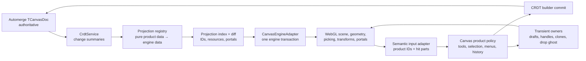

# Konva to canvas-engine migration contract

Status: **implementation cutover complete; strict qualification incomplete**

Scope owner: `packages/canvas`

Contract date: 2026-07-24

Engine repository: `/Users/omarezzat/Workspace/vibecanvas/canvas-engine`

Engine commit audited: `07fef171dc110a8ae1aa54820ee1a13b5c2f29a1`

Package source:
`/Users/omarezzat/Workspace/vibecanvas/canvas-engine/artifacts/omnidraw-cangine-0.2.0.tgz`
(absolute local artifact path)

Artifact SHA-256: `65c2155bb02cb78b0ea812d660c54b49835421e97dbe5eb665821259d3b48b1c`

## 1. Decision and current status

Replace Konva in `packages/canvas` with `@omnidraw/cangine`.

The hard implementation cutover described by this contract is now present in
the working tree. The engine-backed runtime is the sole canvas renderer,
renderer-neutral consumers have been migrated, and Konva source/dependency
usage has been removed without a compatibility layer. Phases 0–10 are complete
at the implementation level; Phase 11 remains open.

This status does not weaken the Definition of Done in Section 24. The migration
is not fully qualified until the three-browser/DPR/input matrix, real
two-client Automerge matrix, full performance statistics and budgets,
leak/soak checks, human screen-atlas acceptance, repository/release gates, and
portable artifact provenance all pass. Detailed evidence and gaps live in
[`CANVAS-MIGRATION-PROGRESS.md`](../../CANVAS-MIGRATION-PROGRESS.md).

The updated canvas-engine does **not** need another public feature before this
migration can begin. It now provides every rendering and interaction mechanism
used by Vibecanvas:

- retained, transactional scene data;
- background, content, world-overlay, and screen-overlay rendering;
- groups, shapes, paths, connectors, text, images, and widget frames;
- camera transforms and named coordinate conversion;
- indexed picking, marquee queries, and transform proposals;
- owner-scoped application transients;
- DOM portals and resource ownership;
- text editing projection;
- deterministic lifecycle, metrics, diagnostics, and cleanup.

The application architecture work is implemented: Vibecanvas no longer treats
mutable renderer nodes as product state and now has a deterministic
`TCanvasDoc` to engine projection boundary.

This is not an import rename and must not become a Konva compatibility layer.
The target is a smaller renderer-neutral canvas package in which:

1. Automerge remains authoritative.
2. Existing `TCanvasDoc` data remains unchanged.
3. Product services hold stable IDs and product data, not renderer objects.
4. canvas-engine owns drawing, geometry, hit testing, transforms, portals, and
   frame scheduling.
5. Canvas plugins own product policy, CRDT writes, history, tools, widgets, and
   menus.

## 2. Updated CAPSULE re-evaluation

The prior compatibility report was correct about the architecture, but three
findings have materially improved in the updated library.

| Prior concern | Current evidence | Migration consequence |
|---|---|---|
| Packed ESM required a Vite/Vitest `noExternal` workaround | All emitted relative specifiers are Node-resolvable `.js` paths; native Node and default Vitest externalization pass | Remove the workaround during Phase 0 and test the package normally |
| Large pen/path transforms risked work proportional to path size | Transform-only projection preserves immutable path geometry and reuses retained GPU buffers | Pen-heavy selections can use standard engine transform previews |
| Captured pointer moves still cloned rollback state and performed implicit hit tests | Engine-owned captures now derive shallow rollback state and skip implicit captured-move hits | Standard transforms no longer need an application workaround |

Upstream evidence at the audited commit includes:

- 100,000-command path: 0.83 ms projection and 0.44 ms retained backend
  transform update after initial compilation;
- complete 100,000-command transform chain: 1.63 ms;
- engine quick gate: 110 files / 1,031 tests;
- Chromium browser gate: 33 / 33;
- packed-consumer verification covering frozen install, exact emitted module
  resolution, Bun, native Node, default Vitest, strict TypeScript, NodeNext,
  Vite, Chromium render/destroy, source isolation, and stage deletion.

The packed-consumer verifier was re-run from this audit and produced the exact
SHA recorded above.

### 2.1 Current qualification gaps

There are no canvas-engine feature gaps for the existing Vibecanvas feature
set.

WebGPU, active render-worker execution, and live SVG rendering remain
capability-reported but unavailable production paths. Vibecanvas does not use
them today, so they are not migration blockers.

The implementation now includes real widget portals, dependency-aware
active-session conflict policy, and a product performance harness. The
remaining gaps are qualification depth:

- only a partial Chromium widget/product smoke exists; the required
  Chromium/Firefox/WebKit matrix at DPR 1/2 and across mouse/touch/pen is
  missing;
- focused conflict-policy tests exist, but the required real two-client
  Automerge/browser matrix has not run;
- single-run product timings exist, but full p50/p95/p99 5k/50k/100k
  statistics, budget compliance, and leak/soak evidence are missing.

These remain product qualification tasks, not engine feature requests.

### 2.2 Visual placeholder implementation

The Section 14 placeholder protocol is implemented for missing/throwing
projectors, element-specific capability gaps, and resource/portal ownership
failures. It preserves the original CRDT element, emits a selectable derived
placeholder, and deduplicates diagnostics/user notifications by active failure
generation. Core engine-profile mismatches that prevent any scene from
starting remain canvas-fatal by design. Forced placeholder/recovery tests
exist; the final human failure matrix remains part of Phase 11.

## 3. Non-negotiable boundaries

### 3.1 In scope

- `packages/canvas/src/**`
- `packages/canvas/tests/**`
- `packages/canvas/package.json`
- `packages/canvas/vitest.config.ts`
- package-local architecture and performance documentation
- the current exact filesystem tarball dependency used for local qualification

### 3.2 Out of scope

- backend services;
- API contracts and handlers;
- Automerge wire format, repository, websocket, or persistence behavior;
- widget definition, revision, actor, function, or resource services;
- `TCanvasDoc`, `TElement`, `TGroup`, or widget persisted schema changes;
- registry publication or production packaging of canvas-engine;
- WebGPU, render workers, 3D, or live SVG product features;
- a legacy document migration;
- a Konva-shaped adapter over canvas-engine.

### 3.3 Persisted data invariants

The following remain exactly as they are:

- `Canvas = { id, name, elements, groups }`;
- every current element discriminator and payload;
- `x`, `y`, `rotation`, `scaleX`, `scaleY`, `zIndex`, `parentGroupId`;
- bindings, locked state, timestamps, and style token strings;
- group shape and hierarchy;
- `ui-widget` and `widget-instance` identity and frame fields;
- image URL/base64/crop fields;
- line and pen point arrays;
- inline shape text.

In particular:

- persisted rotation stays in degrees;
- engine rotation is clockwise radians;
- the projection edge converts `degrees × π / 180`;
- transform commits convert radians back to degrees;
- persisted `zIndex` stays a string allocated by the current
  `fnCreateOrderedZIndex`;
- engine `orderKey` receives that string unchanged;
- engine order helpers may support previews but must not replace product
  ordering or rewrite the schema.

### 3.4 Authority invariants

| Concern | Authoritative owner after migration |
|---|---|
| Canvas document | Automerge `TCanvasDoc` |
| Local and remote writes | `CrdtService` and its builder |
| Undo/redo product steps | `HistoryService` plus CRDT operation results |
| Rendered retained scene | canvas-engine projection of current CRDT state |
| Temporary gesture visuals | canvas-engine transients/transform preview |
| Selected/focused product targets | `SelectionService` IDs |
| Camera product state and local persistence | `CameraService` |
| Widget content and runtime clients | existing widget host/extension |
| Image upload/clone/delete | current `IRuntimeConfig.image` API port |
| Theme tokens and UI policy | `ThemeService` and canvas plugins |
| Portal placement, clipping, and input gating | canvas-engine |
| Portal DOM and accessibility | application widget host |

The engine recorder is diagnostic machinery only. It must not become the
Automerge source, product history source, or collaboration log.

## 4. Historical pre-cutover baseline

At planning time, `packages/canvas` contained 200 TypeScript/TSX source files.

| Coupling measure | Historical count |
|---|---:|
| Source files referencing Konva | 97 / 200 |
| Source files with runtime `import Konva` | 19 |
| Source files with type-only Konva imports | 80 |
| Source files importing `konva/lib/*` | 14 |
| Direct constructor expressions | 32 |
| Konva-related source lines | 818 |
| Test files referencing Konva | 38 / 58 |
| Konva-related test lines | 309 |

The removed coupling was deeper than constructors:

- `SceneService` exposes a stage and three live layers;
- `SelectionService` stores `Konva.Node[]`;
- `ElementService` serializes renderer nodes back into product data;
- plugin hooks carry `KonvaEventObject`;
- tools store a mutable preview node;
- transforms use a `Konva.Transformer` and proxy nodes;
- render order walks and mutates node children;
- groups derive persistence from runtime hierarchy;
- widget-host exports construct and mutate Konva groups;
- tests assert `instanceof` and inspect node internals.

### 4.1 Existing runtime order to preserve

Services and extension installations start before scene hydration. Built-in
plugin ordering is intentional:

1. event bridge;
2. confirmation, grid, toolbar, style menu, context menu, history;
3. selection;
4. transforms;
5. shape1d, shape2d, pen, text, image;
6. extension plugins;
7. scene hydration;
8. visual debug;
9. camera controls.

The migration may rename or split internals, but it must preserve the lifecycle
facts behind this order:

- projectors and extension definitions exist before initial hydration;
- input subscribers exist before human interaction;
- widget portal callbacks are registered before widget placements render;
- every subscription and registration is disposed before engine destruction.

### 4.2 Existing backend and widget behavior to preserve

The browser canvas still receives one Automerge document handle and existing
API ports from `IRuntimeConfig`. The migration must not add backend knowledge
to canvas-engine or to the projection layer.

Widget placement remains:

1. the UI chooses a published, draft, or preview reference;
2. the canvas computes world bounds;
3. existing product code builds/pins the widget as appropriate;
4. a `ui-widget` or `widget-instance` element is written to Automerge;
5. the canvas projects its frame;
6. the current widget runtime mounts DOM content;
7. server functions and collaborative widget state continue through their
   existing bridges.

## 5. Repository-wide Konva deletion result

The coordinated consumer cutover is implemented. `packages/ui-ai-chat` now
uses renderer-neutral element/widget definitions and engine portal hit parts;
the old canvas widget-host node factories and direct renderer values were
deleted. The current source/manifests/lockfile scan has no Konva matches in
`packages/canvas`, `packages/ui-ai-chat`, or `apps/frontend`, and no `konva`
package entry.

This satisfies the subtraction requirement without a temporary compatibility
API. The final local release build passed for all four platform targets, and a
scan of the generated `dist` tree also has no Konva match. Portable,
reproducible engine artifact provenance remains a Phase 11 release gate.

## 6. Target architecture



### 6.1 Key simplification

Today, a local gesture often mutates Konva nodes, writes CRDT, and asks the
scene hydrator to ignore the matching local Automerge event.

After migration:

1. the gesture shows an engine-owned preview or canvas transient;
2. product code computes a `TElement`/`TGroup` patch;
3. the patch is committed through the existing CRDT builder;
4. the same projection path handles the resulting local or remote change;
5. the durable engine scene is updated from authoritative data;
6. the preview is cleared only after the durable projection succeeds.

There is one durable update path for local and remote changes. No renderer
object is serialized back into product data.

### 6.2 Engine containment rule

Runtime imports from `@omnidraw/cangine` should be limited to a new
`src/engine/**` boundary and the smallest necessary composition point.

Feature plugins should consume canvas-owned semantic services and DTOs:

- product target IDs;
- input coordinates and modifiers;
- hit parts;
- transform proposals;
- geometry results;
- draft/session callbacks.

They should not receive `TSceneNode`, engine service objects, WebGL resources,
or backend handles directly.

Projection definitions are the exception: their job is to produce serializable
engine node/resource/portal descriptions. Even there, engine runtime objects
must not be retained.

### 6.3 Proposed internal layout

The exact filenames may evolve, but the responsibility split should be:

```text
packages/canvas/src/engine/
  CanvasEngineAdapter.ts
  interface.ts
  typed.ts
  CONSTANTS.ts
  projection/
    ProjectionRegistry.ts
    ProjectionIndex.ts
    fn.ids.ts
    fn.units.ts
    fn.diff.ts
    fn.project-document.ts
    fn.project-group.ts
    fn.placeholder.ts
    tx.apply-projection.ts
    typed.ts
    projectors/
      fn.shape2d.ts
      fn.shape1d.ts
      fn.pen.ts
      fn.text.ts
      fn.image.ts
      fn.widget.ts
  input/
    fn.semantic-hit.ts
    tx.subscribe-input.ts
  transients/
    CanvasTransientService.ts
    fn.placeholder.ts
  portals/
    PortalOwnership.ts
```

This follows the repository's functional-core rules:

- pure mapping and math in `fn.*.ts`;
- impure reads in two-argument `fx.*.ts`;
- writes and registrations in two-argument `tx.*.ts`;
- stateful ownership only in small services;
- local types in `typed.ts` or the orchestrating file;
- shared local constants in `CONSTANTS.ts`;
- no renderer logic hidden in UI components.

## 7. Stable identity and projection model

### 7.1 Engine IDs

Use deterministic, namespaced engine IDs and keep a projection index:

| Product object | Engine ID example |
|---|---|
| Background layer | `vc:layer:background` |
| Content layer | `vc:layer:content` |
| Debug layer | `vc:layer:debug` |
| Product group | `vc:group:<encoded-group-id>` |
| Element semantic root | `vc:element:<encoded-element-id>` |
| Element render child | `vc:element:<encoded-element-id>:render` |
| Inline text child | `vc:element:<encoded-element-id>:inline-text` |
| Widget portal | `vc:portal:<encoded-element-id>` |
| Image resource | `vc:image:<stable-url-or-element-key>` |
| Transient owner | `vc:transient:<feature>:<session-id>` |

IDs must be produced by one pure encoder. Do not concatenate unescaped
arbitrary IDs in scattered plugins.

`ProjectionIndex` maps:

- product element ID to all derived engine node IDs;
- product group ID to engine group ID;
- engine hit node ID to semantic product target;
- element ID to resource ownership;
- element ID to portal ownership;
- active projection signature and last applied revision.

The index is runtime-only and can always be rebuilt from `TCanvasDoc`.

### 7.2 Semantic root policy

Initial implementation should project every product element as a semantic
engine group with one or more derived children.

Benefits:

- one stable selection target per `TElement`;
- inline text shares its host transform;
- widget frame and portal share one semantic identity;
- multi-node extension elements remain selectable as one object;
- child hit results resolve without leaking renderer details;
- element hierarchy is explicit.

Cost:

- additional retained nodes.

Measure this topology at 5,000 and 50,000 product elements. A later hybrid
single-node optimization is acceptable only if it preserves the semantic index
and does not leak engine child IDs into product services.

### 7.3 Group policy

`TGroup` has hierarchy/order/lock metadata but no persisted transform. Project
it as an identity engine group:

- parent from `parentGroupId`;
- order from `zIndex`;
- identity transform;
- no synthesized durable position.

Element `x`/`y` remain in the current parent-local coordinate convention.
Grouping, ungrouping, and moving a group must continue to write the appropriate
descendant product coordinates through existing CRDT/history semantics.

### 7.4 Projection output

A definition should return data, not perform rendering:

```ts
type TCanvasElementProjection = {
  nodes: readonly TSceneNode[];
  resources: readonly TCanvasProjectedResource[];
  portals: readonly TCanvasProjectedPortal[];
  semanticTarget: TCanvasTarget;
  signature: string;
};
```

The concrete type may alias engine serializable types inside `src/engine`, but
the registry contract must forbid:

- DOM nodes;
- canvas contexts;
- engine service instances;
- callbacks inside scene snapshots;
- backend resource handles;
- Automerge proxy values;
- mutation after return.

### 7.5 Element registry replacement

Replace the current renderer-native `ElementService` lifecycle:

- `matchesNode`;
- `toElement`;
- `createNode`;
- `afterCreateNode`;
- `attachListeners`;
- `updateElement`;
- node-based transform hooks.

With product-oriented definitions:

- `id` and `priority`;
- `matchesElement`;
- `project`;
- selection-style schema;
- transform policy;
- optional clone/delete/restore product side effects;
- optional semantic hit policy;
- optional portal/resource registration description.

All persistence starts from current product data plus an explicit interaction
proposal. Renderer state is never serialized into `TElement`.

## 8. Data projection table

| Persisted data | Engine projection | Reverse/commit rule |
|---|---|---|
| `x`, `y` | `transform.position` in parent-local units | Copy proposal position back unchanged |
| `rotation` degrees | `transform.rotation` radians | `radians × 180 / π`, normalized to current convention |
| `scaleX`, `scaleY` | `transform.scale` | Preserve optional/default semantics in patch |
| `zIndex` | `orderKey` unchanged | Product reorder service writes `z########` values |
| `parentGroupId` | semantic root `parentId` | Product group command writes parent ID |
| `locked` | transform/selection policy | Never infer persistence from pointer state |
| style tokens | resolved engine paint/stroke/text style | Menus continue to write original tokens |
| `opacity` | node opacity | Commit only through style patch |
| timestamps | projection metadata/index only if needed | CRDT builder remains writer |
| bindings | connector/product policy | Keep exact binding payload |

### 8.1 Element families

| Product discriminator | Projection |
|---|---|
| `rect` | semantic group + `rect`; optional inline `text` |
| `ellipse` | semantic group + `ellipse`; optional inline `text` |
| `diamond` | semantic group + four-point closed `polygon`; optional inline `text` |
| `line` | semantic group + path/connector geometry from current point and line-type rules |
| `arrow` | semantic group + connector/path with current start/end cap semantics |
| `pen` | semantic group + filled polygon/path generated by current perfect-freehand policy |
| `text` | semantic group + `text` |
| `image` | semantic group + registered image resource + `image` |
| `ui-widget` | semantic group + `widget-frame` + portal registration |
| `widget-instance` | semantic group + `widget-frame` + portal registration |

Curved line projection must retain the current Catmull-Rom visual contract by
converting it deterministically to cubic path commands. It must not rewrite
the persisted points.

### 8.2 Theme projection

Projection resolves current theme/style tokens to explicit engine values.

On theme change:

1. determine which definitions depend on theme values;
2. reproject only affected nodes;
3. keep persisted style tokens unchanged;
4. update selection/widget transient appearances;
5. perform one coalesced engine transaction/frame.

No engine node may contain an unresolved `@token`.

## 9. Scene and CRDT synchronization

### 9.1 Initial hydration

Initial hydration must:

1. snapshot the current `TCanvasDoc`;
2. validate product entities without mutating them;
3. topologically order groups;
4. project groups and elements;
5. replace the engine descriptor-registration owner and register portals;
6. atomically replace the engine scene or transact one coherent initial tree;
7. publish the projection index;
8. restore selection by product ID;
9. await one render with required resources;
10. surface projection diagnostics without deleting CRDT data.

The current behavior that deletes an element merely because `data` cannot be
rendered must not be copied into the new projector. Rendering failure is not
authority to delete collaborative data.

### 9.2 Incremental changes

Every `TCrdtChangeSummary`—local or remote—uses the same path.

For ordinary element changes:

- deleted: dispose portal/resource owners and remove derived nodes;
- added: project and upsert the complete derived subtree;
- updated: compare projection signature and update only changed data;
- reparented: update semantic root parent and order coherently;
- unknown/failed: replace the derived subtree with a visual placeholder.

For group changes:

- topologically recalculate affected group ancestry;
- reparent affected group and element semantic roots in one transaction;
- fall back to a complete projection only for invalid/cyclic structural state;
- record the fallback reason and duration.

After every projection:

- prune deleted selection/focus IDs;
- cancel incompatible active interactions;
- synchronize transform overlay selection;
- synchronize portal interactivity;
- rely on engine transaction rollback for invalid operations;
- destroy and recreate a terminal `status: "failed"` engine from the
  authoritative application document;
- never write back to CRDT from the projector.

### 9.3 Local commit handoff

Local previews require an explicit handoff:

1. begin engine transform/interaction/transient;
2. capture the before-product snapshot for history;
3. on commit, calculate product patches;
4. commit CRDT once for the logical action, except where existing collaborative
   drag streaming intentionally requires bounded intermediate writes;
5. wait for the synchronous/local projection revision;
6. clear the preview owner;
7. record history using CRDT operations/product snapshots.

For same-ID transient clone handoff, let the engine's durable-wins collision
behavior clear the transient atomically.

## 10. Input, selection, and transform contracts

### 10.1 Input event type

Replace Konva event aliases in `src/types.ts` with a canvas-owned event:

```ts
type TCanvasPointerEvent = {
  type: "pointer-down" | "pointer-move" | "pointer-up" | "pointer-cancel";
  pointerId: number;
  button: number;
  buttons: number;
  pointerType: string;
  client: TPoint;
  viewport: TPoint;
  world: TPoint;
  pressure: number;
  modifiers: TModifierState;
  hit: TCanvasSemanticHit | null;
  nativeEvent: PointerEvent;
};
```

The exact fields should follow actual feature needs. Product code may inspect
the native event at the edge, but it must not receive an engine backend object.

`EventListener.plugin` becomes the bridge from `engine.input.subscribe()` and
host keyboard events to the existing runtime hooks.

### 10.2 Semantic hits

A hit includes:

- product target kind and ID;
- engine hit part when meaningful;
- product group ancestry;
- optional transient owner/semantic handle;
- world and viewport hit positions.

Child render IDs are resolved through `ProjectionIndex` or bounded engine
ancestor queries. Context menus, selection, and widgets never scan the whole
scene to recover meaning.

### 10.3 Selection

`SelectionService` changes from `Konva.Node[]` to:

```ts
type TCanvasTarget =
  | { kind: "element"; id: string }
  | { kind: "group"; id: string };
```

It retains:

- mode;
- ordered selection;
- focused target/ID;
- selection suppression policy;
- change hook.

It gains product-data resolvers rather than node helpers. Engine selection
affordances are synchronized from IDs and definition transform policies.

### 10.4 Marquee and nested selection

- use `engine.interactions.beginMarquee`;
- use indexed query results, never a top-level node scan;
- map hits to unique semantic product targets;
- preserve current group drill-down and selection-order behavior;
- let marquee defer to the engine transform overlay;
- filter locked, invisible, and definition-specific targets through canvas
  policy.

### 10.5 Standard transforms

- configure `engine.transforms` from current selection style/policy;
- use engine preview mode for move, resize, and rotate;
- do not mutate CRDT during preview unless collaborative streaming policy
  explicitly asks for bounded move updates;
- convert committed proposals to `TElement` patches;
- preserve special sizing rules for ellipses, text, images, widgets, and
  inline-text hosts;
- preserve multi-selection and group semantics;
- record one product history action;
- cancel on remote deletion.

### 10.6 Line point editing

Use two transient owners:

- a world-overlay owner for the line/path preview;
- a hit-tested screen-overlay owner for constant-size vertex and midpoint
  handles.

Handle IDs encode semantic point/segment meaning. The canvas owns insertion,
movement, binding, snapping, commit, and history policy. The engine supplies
projection, picking, capture, and geometry.

### 10.7 Clone dragging

- clone product data first with new product IDs;
- show cloned geometry through a world transient owner;
- keep source elements durable and unchanged;
- preserve image/widget backend clone side effects through existing ports;
- on drop, commit the new elements/groups and reuse the same derived IDs for
  atomic transient-to-durable handoff;
- on cancel/failure, clear transients and compensate any already-created
  backend asset according to current policy.

## 11. Camera, grid, and overlays

### 11.1 Camera

Keep the public `CameraService` state shape `{ x, y, zoom }` so current toolbar,
localStorage, and widget-placement code do not change meaning.

Internally:

- translate the current top-left screen translation model to engine camera
  state with pure conversion functions;
- use engine coordinate conversion for every client/viewport/world mapping;
- subscribe once to engine camera changes;
- emit the current `CameraService.hooks.change`;
- preserve zoom limits 0.1–6 unless product requirements change;
- avoid a second requestAnimationFrame loop.

Contract-test round trips at:

- origin;
- large positive/negative pan;
- min/max zoom;
- non-zero host client offset;
- DPR 1 and 2.

### 11.2 Grid

Replace the custom `Konva.Shape` draw callback with one engine `background`
grid node:

- world anchored;
- current theme minor/major colors;
- current visibility toggle;
- engine quantized zoom behavior;
- no canvas-owned redraw loop.

### 11.3 Product overlays

| Current overlay | Replacement |
|---|---|
| Selection rectangle | engine marquee preview |
| `Konva.Transformer` | engine transform overlay |
| Group boundary | world/screen transient derived from engine geometry |
| Line points/midpoints | hit-tested screen transients |
| Draw-create preview | engine interaction preview or world transient |
| Pen preview | engine stroke session |
| Clone preview | world transient |
| Widget drop ghost | transient portal-free `widget-frame` |
| Visual debug text | Solid DOM or debug layer/transient |

Every owner must clear on commit, cancel, tool change, remote invalidation,
unmount, and engine destruction.

## 12. Feature-specific migration

### 12.1 Shape2d and inline text

Shape2d projectors must preserve:

- rect, ellipse, and diamond geometry;
- current top-left/center coordinate conventions;
- fill, stroke, opacity, dash, and corner radius;
- shape-specific resize behavior;
- inline text content, bounds, alignment, and style;
- current selection-style menu fields;
- clone, delete, history, and group behavior.

Inline text remains part of the same persisted element. It is a derived text
child, not a new `TElement`.

Creation uses `engine.interactions.beginCreation`. Its committed bounds become
one product element, are written through CRDT, and then appear through normal
projection.

### 12.2 Shape1d

Preserve:

- line and arrow discriminators;
- straight and curved geometry;
- all persisted points;
- start/end cap semantics;
- bindings;
- thin-line hit tolerance;
- point/midpoint edit mode;
- clone and history behavior.

Use a path where exact current manual geometry is the product contract. Use a
connector when binding/routing semantics benefit from engine connector
geometry, but do not let engine routing rewrite persisted point/binding data
without an explicit product command.

### 12.3 Pen

Preserve the current persisted:

- points;
- pressures;
- `simulatePressure`;
- style tokens.

Use the existing perfect-freehand product policy to generate a deterministic
closed outline, then project it as polygon/path data.

Use `engine.interactions.beginStroke` for bounded sample capture and preview.
Do not persist the engine preview samples directly until current thinning and
product rules have produced the existing `TElement` payload.

### 12.4 Text

Preserve:

- current text payload;
- original text;
- auto-resize behavior;
- font family;
- alignment and style tokens;
- click-create and double-click edit behavior;
- inline and standalone text distinctions.

Project committed text through the engine text service. Use
`createTextEditingSession` to position the application-owned textarea. Keep
editor value, styling, commit, cancel, IME behavior, and CRDT writes in canvas.

The updated engine's DPR/zoom/affine text-raster policy is already qualified
upstream, but Vibecanvas must still visually compare committed text with the
DOM editor at DPR 1/2 and zoom boundaries.

### 12.5 Images

Keep `IRuntimeConfig.image` exactly as the backend port:

- upload bytes;
- clone URL;
- delete URL.

Canvas-engine only receives render resources:

- stable resource ID;
- URL/base64/blob source;
- image sizing/crop/fit;
- preload/ready/error state.

Resource ownership must be reference counted by projected element and cleaned
up after element deletion/replacement. Browser CORS/CSP failure must produce a
visible per-element placeholder and must not delete the CRDT element or call
the backend delete API.

### 12.6 Groups

Rewrite `GroupService` around product targets and engine geometry:

- selection validation by IDs;
- union bounds through `engine.geometry`;
- group/ungroup product patches;
- parent changes;
- descendant movement;
- clone subtrees;
- group boundary transients;
- history from CRDT operations.

Do not serialize engine group nodes. Group commands compute product patches
before committing.

### 12.7 Render order

Rewrite `RenderOrderService` to operate on:

- parent product ID or root;
- ordered product child descriptors;
- selected product IDs;
- element/group CRDT records.

It keeps the existing `z########` allocator and writes `zIndex` patches through
the CRDT builder. Projection copies the result to engine `orderKey`.

Do not use engine `moveToFront` as the durable authority and then serialize its
order back. Engine reorder helpers may be used only inside a coherent
projection/preview transaction.

### 12.8 Context menu and style menu

Context-menu product policy remains application-owned, while Cangine's shared
menu and context-menu controllers own presentation, keyboard navigation,
focus restoration, collision, dismissal, and teardown. The style menu remains
product UI.

- providers receive semantic targets and persisted elements/groups;
- anchor placement uses engine world/client conversion or hit part bounds;
- style menu definitions come from product element definitions;
- style mutations write current tokenized `TElement.style`;
- opening/closing menus does not alter engine scene data;
- context actions execute CRDT-backed product commands rather than mutating
  the projected engine scene.

### 12.9 Recorder and visual debug

Replace prototype/event monkey-patching with:

- normalized input subscription;
- canvas product command/CRDT write records;
- optional engine scene journal for derived-scene diagnostics;
- engine metrics snapshots;
- projection timing/fallback diagnostics.

A replay that changes product state still replays product/CRDT operations. The
engine journal may verify projection equivalence but is not sufficient on its
own.

## 13. Widgets and runtime extensions

Widget parity is a hard cutover gate, not a follow-up polish task.

### 13.1 Widget projection

Both widget data variants project to:

1. one semantic element root;
2. one engine `widget-frame`;
3. one runtime portal registration referenced by that frame.

Map current fields:

| Product behavior/data | Engine/application mapping |
|---|---|
| `w`, `h` | frame size |
| title/label | frame title |
| expanded | frame `collapsed` inverse |
| canvas maximize | local `WidgetInteractionController` presentation; never durable |
| traffic-light/menu actions | typed `WidgetInteractionController` activations |
| active widget body | controller content mode synchronized to semantic focus |
| body content | application-owned portal DOM |
| resize | Cangine frame acquisition and proposal → product patch |
| drag header | Cangine title-bar handling → product transform |
| clone/delete | existing widget product/backend policy |
| title-bar theme | bounded `titleBarColor`; all fixed chrome styling is Cangine-owned |

The widget content DOM stays application-owned. Cangine's atomic frame shell
controls:

- portal transform;
- clipping;
- visibility;
- offscreen suspension;
- input gating;
- portal host lifecycle.

The projected fixed frame contains only supported size, title,
`titleBarColor`, bounded `headerItems`, portal, collapsed, resizable, and
constraint fields. Deprecated caller-owned chrome, controls, subtitle, active
outline, and style fields are not projected.

### 13.2 Focus and input policy

Preserve the current distinction:

- frame/title/control click selects the canvas element;
- content interaction clears ordinary canvas selection and focuses the widget;
- keyboard events originating inside `[data-hosted-widget-root="true"]` do not
  trigger canvas shortcuts;
- canvas-maximized widget DOM remains interactive;
- restoring from canvas maximize reveals the unchanged durable world placement;
- portal cleanup cannot leak mounted widget roots or callbacks.

Use engine hit parts instead of child Konva IDs and listeners.

### 13.3 Widget placement ghost

`WidgetDropPlacementService` keeps its DOM pointer-session and existing commit
callback contract.

Replace the Konva ghost with one transient owner:

- `world-overlay`;
- ordinary portal-free supported transient nodes;
- published blue, draft purple, preview green;
- dashed frame while positioning;
- solid/stronger frame and “Adding…”/“Building Preview…” label while awaiting
  the existing async commit;
- pointer events disabled;
- never persisted or recorded.

Use engine camera conversion and visible world bounds for clamping.

### 13.4 Renderer-neutral extension contract

`ICanvasRuntimeExtension` may continue to install services/plugins, but element
extensions must register product projectors, not renderer callbacks.

The new public contract should provide:

- projection registry;
- semantic selection and input hooks;
- product geometry queries;
- transient owner creation;
- portal/resource registration descriptions;
- tool registration;
- current CRDT/history/product service access already considered public.

It must not expose:

- the raw canvas-engine instance;
- WebGL/backend objects;
- a mutable scene node;
- Konva-compatible factory methods;
- engine scene mutation that bypasses CRDT projection.

### 13.5 External consumer gate

Before canvas changes its public widget-host exports, coordinate a matching
`packages/ui-ai-chat` consumer change. Since external code is outside this
plan's implementation scope, the gate is:

1. canvas publishes the new type contract in a reviewable commit;
2. the consumer owner implements against that contract;
3. both land atomically or in a branch where the monorepo remains buildable;
4. the old Konva widget-host exports are deleted, not deprecated;
5. real widget browser qualification runs before merge.

The project is not deployed, so no runtime legacy compatibility is required.

## 14. Missing-feature visual placeholder protocol

Although no engine feature is currently missing, implementation can reveal an
unmodeled product case. Silent omission is forbidden.

### 14.1 Appearance

Render a derived semantic placeholder with:

- high-contrast magenta/red diagonal or dashed border;
- translucent warning fill;
- visible title `UNSUPPORTED CANVAS FEATURE`;
- second line containing the product discriminator or error code;
- minimum 180 × 96 world-unit bounds when source bounds are unavailable;
- stable selection/hit target for the original product element;
- accessibility label with the same error;
- debug metadata identifying projector and engine capability;
- no portal, backend call, or CRDT write.

Example human-visible text:

```text
UNSUPPORTED CANVAS FEATURE
widget-instance · ENGINE_CAPABILITY_MISSING
```

### 14.2 Activation

Use the placeholder for:

- no matching product projector;
- projector exception or invalid derived node;
- a required engine capability reports false;
- unrecoverable image/font resource failure;
- portal registration failure;
- unknown product discriminator;
- a projection invariant violation that does not invalidate the whole scene.

Use a canvas-level fatal overlay only when the engine itself cannot initialize
or restore a render context.

### 14.3 Behavior

- the original `TElement` remains unchanged;
- selection, delete, context menu, and inspect actions continue by original ID;
- transform handles are disabled unless the product operation is safe;
- one structured diagnostic and one notification are emitted per error
  generation;
- the placeholder disappears automatically when projection succeeds;
- placeholders are excluded from CRDT/history;
- tests assert they are visible and not persisted.

### 14.4 Escalation rule

If a placeholder is triggered because canvas-engine truly lacks a required
mechanism:

1. stop that feature's migration slice;
2. capture a minimal reproducible engine test/use case;
3. file an engine feature request with ownership and acceptance criteria;
4. keep the placeholder in the human-test build;
5. continue independent migration phases;
6. do not imitate the missing engine feature with ad hoc DOM/canvas drawing
   unless explicitly approved.

## 15. Remote-change and active-gesture policy

Automerge is authoritative even during local gestures.

| Remote event during local work | Required behavior |
|---|---|
| Selected item deleted | Cancel gesture/edit, clear preview, prune selection |
| Active item reparented | Cancel and reproject unless a proven rebase exists |
| Active item geometry changed | Cancel by default; explicit tested rebase may be added later |
| Active item style changed | Keep gesture only if geometry/transform basis is unchanged |
| Text changed during local text edit | Cancel with visible notice by default; do not overwrite remote text |
| Line points/bindings changed during point edit | Cancel and reproject |
| Ancestor group deleted/reparented | Cancel descendant gesture and reproject |
| Unrelated item changed | Apply incrementally without disturbing gesture |
| Remote order change | Apply unless it changes the active item's parent/semantic basis |

Implementation requirements:

- active sessions declare the product IDs and fields they depend on;
- projection checks change summaries against those dependencies;
- cancellation is idempotent;
- pointer capture is released;
- no stale commit runs after cancellation;
- history does not record a cancelled/no-op gesture;
- two-client adversarial tests cover every row.

## 16. Service migration map

| Current service | Target action |
|---|---|
| `SceneService` | Rewrite to own `CanvasEngineAdapter`, lifecycle, projection, transients, resource/portal ownership; remove stage/layers/preview node |
| `CameraService` | Keep public state/hooks; bridge to engine camera and conversions |
| `CrdtService` | Keep schema/API; make scene projection consume both local and remote changes |
| `ElementService` | Rewrite as product projection/style/transform-policy registry |
| `SelectionService` | Store ordered semantic product targets/IDs |
| `ToolService` | Keep registry; replace mutable preview nodes with engine interaction sessions and product draft commits |
| `GroupService` | Rewrite around product IDs, CRDT patches, and engine geometry |
| `RenderOrderService` | Rewrite around product child lists and persisted `zIndex` |
| `HistoryService` | Keep as product history owner; remove renderer snapshots |
| `ContextMenuService` | Keep policy/UI; switch selection payload to semantic targets |
| `WidgetDropPlacementService` | Keep external contract; replace math/ghost with engine camera/transient |
| `LoggingService` | Extend projection/engine metrics; remove Konva-specific metrics |
| `SessionService` | Preserve unless renderer-native state is found during implementation |
| `ConfirmDialogService` | Preserve |
| `ThemeService` | Preserve; projection consumes resolved values |

## 17. Plugin and folder migration map

| Area | Implemented cutover contract |
|---|---|
| `plugins/event-listener` | Engine input → canvas semantic hooks; keep host key filtering |
| `plugins/grid` | Project one engine background node |
| `plugins/camera-control` | Use canvas camera facade; remove stage/layer assumptions |
| `plugins/select` | Engine marquee + semantic IDs |
| `plugins/transform` | Engine selection overlay/proposals; delete transformer/proxy implementation |
| `plugins/shape2d` | Pure projector + creation/product command |
| `plugins/shape1d` | Pure projector + connector/point-edit sessions |
| `plugins/pen` | Pure outline projector + stroke session |
| `plugins/text` | Text projector + engine-aligned DOM editing session |
| `plugins/image` | Resource projector; preserve API effects |
| `plugins/scene-hydrator` | CRDT-to-projection orchestrator; no node create/update/destroy |
| `plugins/context-menu` | Semantic hits/targets; remove scene scans |
| `plugins/selection-style-menu` | Resolve persisted elements by ID |
| `plugins/recorder` | Normalized input + CRDT/product records |
| `plugins/visual-debug` | Engine metrics/DOM debug; no Konva text node |
| `services/group` | Product hierarchy commands and transient boundary |
| `widget-host` | Engine-neutral widget element/projector/portal helpers |
| `core/GUARDS.ts` | Delete Konva guards; replace only with product/DTO guards actually needed |
| node-space/world-position helpers | Replace with engine camera/geometry or pure matrix conversions |
| test setup | Delete native canvas/Konva setup after last test moves |

## 18. Ordered implementation phases

Each phase is independently reviewable, but this is a breaking internal
migration. Do not carry two production renderers or add a user-visible
engine-selection feature flag.

The work lists below remain the acceptance contract. Current status:

| Phase | Implementation status | Qualification note |
|---|---|---|
| 0 — Invariants and exact bytes | Complete | Portable provenance remains a release gate |
| 1 — Semantic contracts | Complete | Focused contract coverage recorded |
| 2 — Engine boundary | Complete | Focused lifecycle/ownership coverage recorded |
| 3 — Static projection | Complete | Forced human failure matrix remains |
| 4 — Incremental hydration | Complete | Element-only updates are incremental; group changes use bounded fallback |
| 5 — Camera/input/selection/menus | Complete | Full browser/DPR/input matrix remains |
| 6 — Creation tools | Complete | Human atlas acceptance remains |
| 7 — Transforms/groups/order/clone | Complete | Real two-client and performance qualification remain |
| 8 — Text/images | Complete | Cross-browser IME/image failure matrix remains |
| 9 — Widgets/extensions | Complete | Partial Chromium smoke only |
| 10 — Composition/Konva deletion | Complete | Final local build and generated `dist` scan pass |
| 11 — Qualification/handoff | In progress | All Section 24 gates must pass |

### Phase 0 — Freeze invariants and exact engine bytes

Work:

- keep the absolute `file:` tarball dependency;
- record commit and artifact SHA in compatibility test output;
- ensure rebuilt local artifacts use a new filename/hash or invalidate Bun's
  exact filepath cache;
- remove the now-obsolete `vitest.ssr.noExternal` override;
- rerun packed-consumer and `packages/canvas` compatibility tests;
- capture baseline behavior/screens for all canvas states in `SCREENS.md`;
- record current perf results for empty, 100, 1k, and 5k scenes;
- add schema snapshot tests proving no `TCanvasDoc` changes.

Exit:

- exact bytes are unambiguous;
- native/default package consumption works;
- behavior and performance baseline is stored;
- no production renderer code changed.

### Phase 1 — Introduce semantic product contracts

Work:

- add `TCanvasTarget`, neutral input/hit/proposal types;
- convert selection/context/style service-facing types away from Konva;
- define projector, projection output, resource, portal, and transient
  contracts;
- define deterministic engine ID helpers;
- define degrees/radians and coordinate conversion functions;
- add package-boundary tests for allowed engine imports;
- write pure tests before changing the live scene.

Exit:

- product contracts compile without Konva types;
- mapping functions round-trip current data;
- no schema/API/backend changes.

### Phase 2 — Build the engine runtime boundary

Work:

- implement `CanvasEngineAdapter`;
- initialize profile `{ vector2D: "webgl2", threeD: "disabled", portals: "dom" }`;
- assert actual capabilities;
- create stable background/content/debug layers;
- implement resize/suspend/resume/render/destroy;
- implement metrics/error subscription;
- implement portal/resource/transient ownership;
- trust engine rollback for invalid pre-commit operations, and surface the
  fatal fallback without restoring a snapshot into the failed engine;
- keep it test-only until projection is ready.

Exit:

- lifecycle tests cover repeated start/stop, resize, context loss/restore, and
  teardown;
- no leaked canvas, portal host, observer, callback, resource, or transient
  owner.

### Phase 3 — Projection registry and complete static rendering

Work:

- implement `ProjectionRegistry` and `ProjectionIndex`;
- implement groups and all built-in element projectors;
- implement theme resolution;
- implement full document projection;
- implement placeholder projection;
- implement image resource descriptions without backend ownership;
- implement widget frame/portal descriptions with synthetic portal content;
- add semantic snapshot/bounds/order tests.

Exit:

- representative real `TCanvasDoc` renders every discriminator;
- nested group order and rotations match;
- no renderer object enters snapshots;
- projector failure is visibly represented, not omitted.

### Phase 4 — Authoritative incremental hydration

Work:

- replace scene-hydrator internals;
- project all local and remote summaries;
- remove local-change skip from the render path;
- implement atomic element add/update/delete/reparent;
- implement structural group handling and bounded full fallback;
- prune selection/focus after projection;
- synchronize resources/portals;
- add failure rollback and queued reload behavior.

Exit:

- one-element remote changes do not rebuild the full scene;
- local and remote commits produce equivalent engine snapshots;
- projection never writes CRDT;
- no collaborative data is deleted because rendering failed.

### Phase 5 — Camera, grid, input, selection, menus

Work:

- bridge `CameraService`;
- replace grid;
- replace event listener hook payloads;
- implement semantic hit mapping;
- implement marquee and nested selection;
- convert context menu and style menu to semantic targets;
- convert selection persistence across projection updates;
- preserve key filtering for widget/editor DOM.

Exit:

- pan/zoom/resize/grid pass;
- click, shift-click, drill-down, marquee, focus, delete, menus, and style edits
  pass with no scene scans on pointer move;
- current toolbar and Solid overlays remain unchanged visually.

### Phase 6 — Tools and element creation

Work:

- rewrite `ToolService` around sessions/drafts;
- migrate shape2d creation;
- migrate shape1d/connector creation;
- migrate pen stroke creation;
- migrate click-create text;
- keep product style defaults and CRDT/history behavior;
- add cancel/tool-switch/escape cleanup.

Exit:

- every tool previews without durable writes;
- commit creates the existing element payload;
- cancellation creates no CRDT/history residue;
- newly committed elements appear only through authoritative projection.

### Phase 7 — Selection transforms, groups, order, clone

Work:

- configure engine transform overlay;
- map proposals to product patches;
- migrate special resize policies;
- migrate multi-selection;
- migrate group/ungroup/group move;
- migrate order operations;
- migrate line point edit transients;
- migrate alt-drag clone transients and side effects;
- implement active-gesture remote conflict policy.

Exit:

- move/resize/rotate/point edit/group/order/clone all pass undo/redo;
- 100k-command pen transform stays within performance budget;
- remote deletion or conflicting edit cancels safely;
- no renderer snapshots remain in history.

### Phase 8 — Text and image runtime behavior

Work:

- migrate text edit session and auto-size;
- verify IME, blur, Enter, Escape, camera sync, and cleanup;
- migrate image resource lifecycle;
- preserve upload/clone/delete callbacks;
- implement load/error placeholders;
- verify image source generations remain stable while registration or scene
  usage retains them.

Exit:

- text is visually crisp and positionally stable across DPR/zoom;
- image API calls are byte-for-byte/argument equivalent;
- resource failure cannot corrupt or delete product data.

### Phase 9 — Real widgets and external extensions

Work inside canvas:

- replace widget-host node factories with projector/portal descriptions;
- route typed frame activations to existing product actions;
- migrate focus, drag, resize, minimize, restore, and local canvas maximize;
- migrate placement ghost;
- finalize renderer-neutral extension contract.

Coordinated gate outside this plan:

- `packages/ui-ai-chat` adopts the new contract;
- its direct Konva usage is removed;
- real published/draft/preview widgets run through portals.

Exit:

- all canvas widget states from `SCREENS.md` pass;
- portal DOM, collaborative widget state, server functions, resource calls,
  and API behavior are unchanged;
- portal mounts/unmounts have zero leaks.

### Phase 10 — Cut over composition and delete Konva from canvas

Work:

- make engine-backed `SceneService` the only runtime;
- delete stage/layer/preview-node APIs;
- delete `Konva.Transformer`, proxy, guards, listeners, node serializers;
- delete Konva widget-host exports;
- remove `konva` from `packages/canvas/package.json`;
- remove package test setup/dependencies used only by Konva;
- update `ARCHITECTURE.md` and `PERFORMANCE.md`;
- keep the exact absolute canvas-engine artifact for local qualification while
  preserving its explicit release/provenance gap.

Exit:

```sh
rg -n "from ['\"]konva|konva/lib|Konva\\." packages/canvas
```

returns no source or test match, and the canvas bundle contains no Konva.

### Phase 11 — Qualification and repository handoff

Work:

- full package tests/typecheck/build;
- full monorepo tests/typecheck/build;
- Chromium, Firefox, and WebKit human/browser matrix;
- two-client collaboration matrix;
- performance matrix;
- context loss and resource failure;
- memory/leak soak;
- package artifact checksum verification;
- external widget consumer completion;
- remove root/frontend/ui-ai-chat Konva dependencies only after their owners
  have zero source use.

Exit:

- all Definition of Done gates in Section 24 pass;
- no feature is represented by a placeholder except intentionally forced
  placeholder tests;
- the previous renderer can be removed without rollback code.

## 19. Test plan

### 19.1 Pure contract tests

Add pure tests for:

- ID encoding and collision resistance;
- degrees ↔ radians, including negative and multiple-turn values;
- parent-local coordinate projection;
- element/group sort order and `zIndex` preservation;
- theme token resolution;
- every element discriminator;
- inline text child derivation;
- Catmull-Rom to cubic path conversion;
- pen outline determinism;
- semantic hit resolution;
- product transform proposal conversion;
- projection signature stability;
- projection diff add/update/delete/reparent;
- placeholder creation;
- widget frame data mapping;
- remote-change/session dependency intersection.

Property tests should cover finite transforms, nested ancestry, reorder lists,
and project/diff/reproject equivalence.

### 19.2 Engine adapter contract tests

Keep and expand `packages/canvas/tests/canvas-engine` to verify only public
engine exports:

- exact installed artifact identity;
- lifecycle;
- layer order and coordinate spaces;
- scene transactions and rollback;
- geometry and picking;
- camera conversion;
- transform proposals;
- marquee, creation, stroke, connector, and text-edit sessions;
- transient world/screen owners;
- same-ID handoff;
- widget-frame hit parts;
- real portal registration/cleanup;
- image/font resource lifecycle;
- context loss/restore;
- metrics and diagnostics;
- no default Vitest externalization override.

Do not deep-import engine internals to make these tests pass.

### 19.3 Projection integration tests

Use real `CrdtService`, `HistoryService`, projection registry, and a public
engine backend seam.

Scenarios:

- initial empty and populated hydration;
- add/update/delete each element family;
- group add/delete/reparent;
- reorder;
- local and remote equivalent changes;
- queued changes during async resource work;
- projector exception/placeholder/recovery;
- resource replacement;
- late extension registration/invalidation;
- selection preservation and pruning;
- no projector write-back;
- no Automerge proxy retained in engine state.

### 19.4 Product behavior tests

Rewrite existing package tests around product results rather than Konva
internals.

Assert:

- resulting CRDT data;
- selection/focus IDs;
- history actions;
- semantic engine snapshot/bounds;
- portal/resource ownership;
- hook and API calls;
- visible placeholder/error state;
- cleanup.

Avoid asserting private engine draw calls except in explicit performance or
adapter tests.

### 19.5 Browser matrix

Run in Chromium, Firefox, and WebKit where supported:

- real WebGL rendering;
- pointer mouse/touch/pen normalization;
- pointer capture across canvas and portals;
- camera and DPR;
- text editing/IME;
- image decode/failure;
- widget portal focus and keyboard;
- canvas maximize and restore;
- context loss/restore;
- resize observer;
- destruction/remount.

### 19.6 Collaboration matrix

Run two actual Automerge clients:

1. A creates while B watches.
2. A drags while B changes unrelated style.
3. A transforms while B deletes the target.
4. A edits text while B edits the same text.
5. A point-edits while B changes bindings.
6. A groups while B reorders.
7. A clones an image/widget while a backend effect fails.
8. Both reorder siblings concurrently.
9. Late joiner hydrates the final document.
10. Disconnect/reconnect applies a burst without full-scene corruption.

For every scenario verify converged `TCanvasDoc`, equivalent engine projection,
selection cleanup, no stale preview, and bounded history.

## 20. Performance qualification

Keep the package's existing primary target: interaction p95 below one 16.7 ms
frame at 60 Hz.

### 20.1 Workloads

- empty canvas boot/pan/zoom/draw;
- 100 / 1,000 / 5,000 visible mixed elements;
- 50,000 total with 5,000 visible;
- nested groups with 10 / 100 / 1,000 descendants;
- pen paths at 1k / 10k / 100k commands;
- marquee over 100 / 1k / 5k elements;
- 20 / 100 / 500 portal frames, with a separately justified practical mounted
  DOM ceiling;
- image-heavy documents;
- remote bursts of 1 / 10 / 100 changed elements per second;
- clone/drop/point-edit transients;
- DPR 1 and 2.

### 20.2 Timings to separate

Measure independently:

- Automerge change/summary time;
- product projection time;
- projection diff time;
- engine transaction time;
- resource/portal synchronization;
- engine render time;
- input-to-preview latency;
- input-to-authoritative-projection latency;
- full hydration;
- incremental remote apply;
- fallback full projection count/duration.

An upstream engine benchmark does not prove a fast application projector.

### 20.3 Budgets

| Metric | Initial acceptance |
|---|---:|
| Pointer/transform event p95 | < 16.7 ms |
| Pointer-to-preview p95 | < 16.7 ms |
| Ordinary one-element projection p95 at 5k scene | < 8 ms |
| Engine transaction for ordinary one-element diff p95 | < 4 ms |
| No-op CRDT projection | no engine scene transaction |
| 100k pen transform preview | no path-proportional clone/compile after initial load |
| Long tasks | none > 50 ms during ordinary interaction |
| Remote ordinary element update | no full document projection |
| Portal/resource owners after teardown | 0 |
| Transient owners after gesture/teardown | 0 |

These are starting gates, not permission to regress current measured behavior.
Record p50/p95/p99 with scene dimensions and browser.

### 20.4 Memory and leak checks

Track:

- engine node count by kind;
- projection index entries;
- resource owners and loaded bytes;
- portal registrations and mounted hosts;
- transient owners/nodes;
- selected IDs;
- history retained weight;
- engine recorder retained weight when enabled;
- detached DOM nodes after canvas remount;
- WebGL resources after context restore/destroy.

Run a repeated open/close canvas soak and a 30-minute mixed interaction soak.

## 21. Human test script

Human testing must use the active canvas states in
`docs/internal/screens/SCREENS.md`.

### 21.1 Canvas fundamentals

- open an empty canvas;
- resize the window;
- pan with hand/gesture;
- zoom at pointer and verify world anchoring;
- toggle grid and theme;
- reload and verify camera persistence;
- inspect console/diagnostics.

### 21.2 Elements

For rect, ellipse, diamond, line, arrow, pen, text, and image:

- create;
- select;
- multi-select;
- move;
- resize;
- rotate;
- edit styles;
- clone with Alt-drag;
- group and ungroup;
- reorder;
- undo and redo;
- delete;
- reload;
- verify from a second client.

For line/arrow additionally edit vertices/midpoints and bindings. For text,
compare edit and committed positions at multiple zooms. For image, test upload,
clone, load failure, and delete.

### 21.3 Widgets

Reproduce:

- populated hosted widget;
- selected widget frame;
- fixed-frame header and shared menu actions;
- minimize/restore;
- contained/canvas-maximized/return;
- focus and keyboard interaction inside widget;
- frame drag and resize;
- group/nested transform;
- theme change;
- offscreen suspend/return;
- delete instance and existing widget delete action;
- AI chat and settings;
- AI draft Preview;
- direct published placement;
- direct draft placement;
- keyboard-add placement;
- failed async placement.

Verify collaborative widget state, API calls, and server functions still work.

### 21.4 Placeholder visibility

In a test-only build, force:

- missing projector;
- image failure;
- portal registration failure;
- required capability false.

Verify a large, obvious placeholder appears, can be selected/deleted, emits one
diagnostic, never enters CRDT/history, and recovers when the fault is removed.

## 22. Risk register

| Risk | Failure mode | Prevention/gate |
|---|---|---|
| Two durable authorities | Engine scene and Automerge diverge | CRDT-only product commits; engine projection never writes product state |
| Local event suppression retained | Local durable scene relies on preview mutation | Project every local and remote CRDT change |
| Degree/radian mismatch | Rotated elements jump | Pure edge converters and golden ±90° tests |
| Parent coordinate mismatch | Grouped children move on reload | Parent-local contract fixtures and group round trips |
| Product `zIndex` replaced | Schema/order divergence | Direct `zIndex` → `orderKey`; product reorder owns writes |
| Derived child IDs leak | Selection/menu targets wrong object | One semantic index and boundary tests |
| Full scene work on hot path | Input/remote latency cliffs | Incremental diff, indexed engine queries, perf counters |
| Remote conflict overwrites data | Stale local commit wins unexpectedly | Declared session dependencies and cancel-first policy |
| Preview enters history/CRDT | Noisy collaboration/undo | Transient/engine preview only |
| Resource leak | Images/fonts retained after delete | Explicit per-element ownership and teardown tests |
| Portal leak/focus bug | Detached widget DOM or broken keyboard | Real widget cross-browser/soak gate |
| Widget contract breaks externally | Monorepo fails or loses widget UI | Coordinated `ui-ai-chat` contract adoption |
| Filepath package cache is stale | Tests run older engine bytes | Report SHA; hash/version filename or exact cache invalidation |
| Context loss | Blank or corrupt canvas | Engine restore tests and fatal placeholder |
| Placeholder hides product data | Accidental delete or persistence | Derived-only projection, never write-back |
| Permanent dual renderer | Complexity doubles and neither path finishes | No production engine flag; delete Konva at cutover |
| Engine API drift | Rework during migration | Pin commit/artifact SHA and public contract tests |
| Semantic-root node overhead | Memory/culling regression | 5k/50k benchmark before universal commitment |
| History still stores renderer state | Undo breaks after reload | Product/CRDT snapshots only |

## 23. Review and landing strategy

Recommended review slices:

1. contracts and pure projection helpers;
2. engine adapter/lifecycle;
3. static projection;
4. CRDT incremental hydrator;
5. camera/input/selection;
6. creation tools;
7. transforms/groups/order/clone;
8. text/images;
9. widgets/extensions;
10. Konva deletion and qualification.

Every slice must:

- preserve unrelated user work;
- state changed ownership boundaries;
- add/replace tests before deleting old coverage;
- report artifact SHA;
- include before/after performance when touching a hot path;
- contain no backend/schema/API changes;
- leave no knowingly silent unsupported feature.

Because no production deployment exists, prefer decisive breaking internal
changes over deprecation layers. The branch may be temporarily non-deployable
between coordinated commits, but review checkpoints should compile whenever
practical.

### 23.1 Stop conditions

Stop a phase and escalate when:

- a current product behavior cannot be represented by a public engine API;
- preserving widget behavior requires a backend/API/schema change;
- a projection requires mutating `TCanvasDoc`;
- product data would need to be inferred from renderer state;
- ordinary interaction p95 exceeds the budget with no bounded fix;
- real portal focus/capture cannot be made correct;
- an external consumer cannot coordinate the breaking extension contract.

Do not work around these by reintroducing raw canvas drawing or mutable
renderer objects.

## 24. Definition of Done

The canvas migration is finished only when every gate below is true.

### Architecture

- `TCanvasDoc`, Automerge, APIs, backend services, and widget persisted data are
  unchanged.
- Automerge is the only durable product authority.
- canvas-engine is a deterministic render/geometry/input projection.
- product services store IDs/data, not renderer objects.
- there is no Konva compatibility layer.
- canvas-engine runtime imports are contained at the engine boundary.

### Feature parity

- every existing element family renders and edits;
- camera/grid/selection/marquee/menus work;
- move/resize/rotate/group/order/clone/history work;
- line point editing works;
- text editing and image lifecycle work;
- all widget states and placement flows work;
- late runtime extensions work through renderer-neutral definitions;
- local and remote changes converge.

### Human visibility

- no element silently disappears on projection failure;
- forced failures show the specified placeholder;
- no placeholder appears in normal qualification.

### Quality

- all pure, package, browser, collaboration, and monorepo tests pass;
- performance and memory gates pass;
- context loss, resource failure, and teardown pass;
- current screen atlas states are visually accepted.

### Dependency removal

Within package scope:

```sh
rg -n "from ['\"]konva|konva/lib|Konva\\." packages/canvas
```

returns no match, `packages/canvas/package.json` has no `konva`, and the package
bundle contains no Konva.

For repository-wide completion, the coordinated `packages/ui-ai-chat` change
must also remove its direct usage before `apps/frontend` and root lockfile
entries are deleted.

### Documentation

- `packages/canvas/ARCHITECTURE.md` describes the projection architecture;
- `packages/canvas/PERFORMANCE.md` describes engine/projector metrics rather
  than Konva layers;
- this plan is updated with any approved deviations;
- the compatibility report points at the final artifact and results.

## 25. Current next action

Keep the implemented hard cutover and finish Phase 11:

1. run the clean Chromium/Firefox/WebKit × DPR 1/2 × mouse/touch/pen product
   matrix and accept the current screen atlas;
2. run the real two-client Automerge conflict matrix;
3. collect full p50/p95/p99 performance results, meet the stated budgets, and
   complete leak/soak checks;
4. make the exact engine artifact portable and reproducibly attributable to
   committed upstream source.

Do not mark this migration complete, change task `S111` from in-progress, or
weaken Section 24 until every gate is evidenced.
