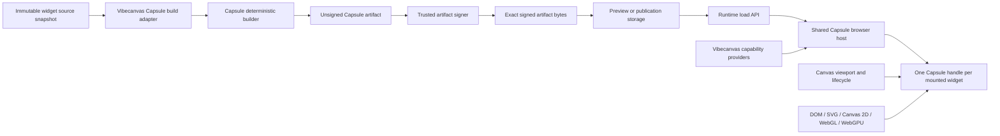

# Vibecanvas Capsule migration plan

Status: implementation plan  
Scope: replace the Arrow browser widget sandbox with Capsule  
Capsule source: `/Users/omarezzat/Workspace/vibecanvas/capsule`  
Capsule guide: `docs/library-guide.md` in that repository  
Capsule package: `@omnidraw/capsule@0.9.2`

## 1. Purpose

This plan describes the complete move from Arrow to Capsule for widget build,
preview, publication, browser execution, capabilities, SDKs, lifecycle, and
tests.

This is a clean replacement:

- there is no deployed widget format to preserve;
- there is no Arrow compatibility mode;
- there is no dual runtime;
- there are no data migration scripts;
- there are no old manifest aliases;
- there is no conversion tool for old artifacts;
- local development data may be reset when the contract changes.

The implementation may break the repository between milestones. Each milestone
must end with a coherent, verified state.

This plan is intentionally not tracked in `tasks/`. Implementation progress is
tracked in the root file `CAPSULE-MIGRATION-PROGRESS.md`, as defined below.

## 2. Rule for changing this plan

The implementation agent is allowed to diverge from this plan when code,
Capsule behavior, or test evidence shows that the plan is wrong.

The agent must not keep a bad design merely to follow this document.

Every divergence must be recorded in `CAPSULE-MIGRATION-PROGRESS.md` before or
with the related change. Record:

- date and milestone;
- what this plan expected;
- what was found;
- the replacement decision;
- files or contracts affected;
- tests or source evidence supporting the decision;
- effects on later milestones.

Small implementation details may diverge without stopping for approval. A
change that expands product authority, exposes new guest access, changes
durable state ownership, or adds an external service still needs an explicit
product decision.

## 3. Required progress file

The first implementation change must create:

```text
CAPSULE-MIGRATION-PROGRESS.md
```

The file is not a task list. It is the durable handoff record for this
migration.

It must contain:

```markdown
# Capsule migration progress

Current milestone:
Current status:
Last verified commit:
Capsule package name:
Capsule source revision:
Capsule package/pack digest:

## Completed

## In progress

## Verification evidence

## Decisions

## Deviations from llm.capsule-migration.md

## Known problems

## Next exact action
```

Update it:

- before starting a milestone;
- after every material contract decision;
- after a verification run;
- when a test is skipped or fails;
- before handing work to another agent;
- when a deviation changes later milestones.

Do not report a milestone complete unless its verification commands and exit
criteria are recorded there.

## 4. Current system that will be replaced

### 4.1 Build and artifact

`packages/widget-contract` currently:

- defines `TWidgetManifestV2`;
- accepts only `ui.entry` for the browser target;
- builds a custom `vibecanvas.widget-artifact.v1` JSON envelope;
- stores bundled JS, CSS, JSON, WASM, and files as base64 outputs;
- uses `WidgetArtifactBuilderBun`;
- includes the custom UI envelope digest in the widget contract digest;
- exposes a browser decoder for that envelope.

This custom UI envelope must disappear. Capsule's exact signed artifact bytes
become the UI artifact.

### 4.2 Browser host

`packages/ui-ai-chat/src/widget-runtime` currently:

- downloads and verifies the Vibecanvas envelope;
- creates host bridges for server functions and collaborative state;
- injects those bridges through Arrow host modules and guest globals;
- mounts through `@arrow-js/sandbox`;
- manages its own active and queued render counts;
- returns a synchronous cleanup function.

Capsule must own the VM, DOM membrane, guest bridge, resource budgets,
scheduling state, and terminal cleanup. Vibecanvas keeps artifact selection,
tenant authority, application capabilities, canvas inputs, and user-facing
errors.

### 4.3 Guest SDK

`@vibecanvas/sdk/widget` currently exposes server-function and collaborative
state clients that depend on injected globals.

The new widget SDK must use `@omnidraw/capsule/guest`. Widget source should
normally import only `@vibecanvas/sdk/widget`; the SDK hides Capsule's generic
bridge.

### 4.4 Authoring

The CLI and agent prompts currently:

- teach Arrow;
- scaffold `@arrow-js/core`;
- provide Arrow declarations;
- allow Arrow as a trusted build dependency.

All Arrow-specific authoring input must be removed. Guest authors may choose a
UI library when its closed module graph and browser usage fit the granted
Capsule profiles.

## 5. Target architecture



Ownership is:

| Owner | Responsibilities |
| --- | --- |
| Capsule | Artifact format, builder, signature verification, VM, DOM, profiles, budgets, generic capabilities, channels, lifecycle, scheduling, testkit, diagnostics |
| `packages/capsule-vibecanvas` | Capsule policy, build-request mapping, signing port, schema resources, app descriptors, host creation, provider bindings, error mapping |
| `packages/widget-contract` | Vibecanvas manifest, revision, artifact metadata, build/publication interfaces, contract digest |
| `packages/sdk` | Framework-neutral guest API over `@omnidraw/capsule/guest` |
| `packages/ui-ai-chat` | Runtime loading, browser integration, preview, instance ownership, user-facing state |
| `@omnidraw/cangine` | Fixed widget frame, local canvas-maximized presentation, and atomic portal-shell presentation |
| `packages/canvas` | Portal content, size, scale, distance, visibility, occlusion, focus, durable collapse, local canvas-maximized, removal |
| `packages/service-agent` | Source capture, validation, preview/publish orchestration, authoring prompts |
| `packages/api` | Tenant-authorized runtime artifact delivery and function transport |
| Server services | Functions, Automerge collaboration, resources, tenant authorization |

Capsule must not import Vibecanvas packages. Vibecanvas may import only
Capsule's supported public package entries.

## 6. Fixed design decisions

### 6.1 Package boundary

Use the current public package entries only:

- `@omnidraw/capsule`;
- `@omnidraw/capsule/build`;
- `@omnidraw/capsule/build-runner` if the OCI boundary is adopted;
- `@omnidraw/capsule/guest`;
- `@omnidraw/capsule/protocol`;
- `@omnidraw/capsule/schema`;
- `@omnidraw/capsule/sign`;
- `@omnidraw/capsule/testkit`;
- `@omnidraw/capsule/webgl`;
- `@omnidraw/capsule/webgpu`.

During this migration, import Capsule through:

```json
"@omnidraw/capsule": "file:/Users/omarezzat/Workspace/vibecanvas/capsule"
```

Do not deep-import Capsule workspace packages or copy Capsule source into this
repository.

Before implementation starts, record both the Capsule Git revision and a
package/pack digest. A Git revision alone is not enough when the Capsule working
tree contains changes.

### 6.2 New adapter package

Create `packages/capsule-vibecanvas`.

Use separate public subpaths so browser code cannot accidentally import build
or signing tools:

```text
@vibecanvas/capsule-vibecanvas/contract
@vibecanvas/capsule-vibecanvas/build
@vibecanvas/capsule-vibecanvas/host
@vibecanvas/capsule-vibecanvas/capabilities
@vibecanvas/capsule-vibecanvas/testkit
```

The browser entry must not export `/build`, `/build-runner`, or `/sign`
implementations.

Follow the functional-core rules:

- pure manifest, target, budget, descriptor, and error mappings go in `fn.*.ts`;
- impure reads go in `fx.*.ts`;
- signing, registration, mount, and cleanup writes go in `tx.*.ts`;
- stateful host coordination stays in a small orchestration file;
- use `/core` only for logic shared by more than one adapter feature.

### 6.3 One shared browser host

Create one Capsule host for the frontend application runtime, not one host per
widget.

The shared host owns:

- release VM policy;
- artifact cache;
- trusted public signing keys;
- profile ceiling;
- capability policy ceiling;
- schema and descriptor registrations;
- scheduler/population policy;
- error and metric subscriptions.

Each mounted widget gets:

- one container;
- one signed artifact;
- one exact grant set;
- instance-bound capability bindings;
- channel schemas and initial values;
- one `CapsuleHandle`;
- one idempotent owner cleanup.

Destroy the host when the frontend runtime stops or tenant authority changes.

### 6.4 Exact signed bytes

The UI artifact stored by Vibecanvas is the exact signed Capsule byte array.

Keep two identities:

- `digestSha256`: digest of the exact stored signed bytes, used by Vibecanvas
  blob storage and read capabilities;
- `capsuleArtifactHash`: Capsule's validated artifact identity, used by Capsule
  diagnostics and artifact compatibility.

Do not treat these values as interchangeable.

### 6.5 Trusted signing

Build and signing happen in trusted tooling.

- Build produces deterministic unsigned Capsule bytes.
- The trusted release step signs those exact bytes with
  `@omnidraw/capsule/sign`.
- Publication stores the signed bytes.
- Browser host policy requires the expected key IDs.
- Private keys never enter browser bundles, guest source snapshots, databases,
  logs, previews, or API responses.
- Preview may use a separate development signing key, but it must still use the
  same signed-artifact mount path.

### 6.6 No direct guest service access

Guests never receive:

- ORPC clients;
- tenant context;
- actor or state document selectors;
- resource IDs or providers;
- database clients;
- Automerge handles;
- signing material;
- filesystem paths;
- raw host objects.

Providers capture trusted instance identity at mount.

### 6.7 State ownership

- Automerge owns shared canvas and collaborative widget state.
- Server functions and resource services own durable server effects.
- Capsule local store owns only bounded guest-local state.
- Capsule props and theme channels carry host observations.
- Capsule outputs carry typed guest events.

Freezing or parking a UI does not delete or pause its durable backend state.

## 7. `packages/widget-contract` redesign

This package change is required and should happen early. Do not preserve the v2
names or values.

### 7.1 Manifest

Remove:

- `TWidgetManifestV2`;
- `ZWidgetManifestV2`;
- v2 normalization and canonicalization;
- the old `TWidgetUiManifest` containing only `entry`.

Add `TWidgetManifestV3` and `ZWidgetManifestV3`. Do not add a v2 union or alias.

The UI section should express Vibecanvas product intent, not raw host authority:

```ts
type TWidgetUiManifest = Readonly<{
  runtime: 'capsule';
  entry: string;
  target: Readonly<{
    runtimeAbi: string;
    domProfile: string;
    featureProfiles: readonly string[];
    resourceProfile: string;
  }>;
  budgets?: Partial<TWidgetCapsuleBudgets>;
  state?: Readonly<{
    collaborative: boolean;
    localStore: 'none' | 'ephemeral' | 'snapshot';
  }>;
  parkability?: Readonly<{
    enabled: boolean;
    schemaVersion?: string;
  }>;
}>;
```

The final shape may differ if Capsule's public types require it. Any difference
must be documented in the progress file.

`TWidgetCapsuleBudgets` must cover Capsule's current budget dimensions:

- CPU milliseconds;
- VM memory bytes;
- DOM nodes;
- handles;
- message bytes;
- stream bytes;
- asset bytes;
- network bytes;
- GPU bytes;
- lifecycle bytes.

Rules:

- zero is valid and means denied;
- manifests request limits but do not grant them;
- normalization sorts profile lists and rejects duplicates;
- validation rejects unknown keys;
- runtime ABI and profile strings use strict bounded patterns;
- target/profile combinations are checked by the Capsule adapter policy;
- authors do not enter capability contract hashes or signature key IDs;
- the server section and resource requirements remain product contracts.

Use `schemaVersion: 3`.

### 7.2 Capsule runtime metadata

Add a serializable published runtime descriptor:

```ts
type TWidgetCapsuleRuntimeDescriptor = Readonly<{
  format: 'vibecanvas.capsule-runtime.v1';
  capsuleArtifactHash: string;
  target: TWidgetCapsuleTarget;
  budgets: TWidgetCapsuleBudgets;
  capabilityRequests: readonly TWidgetCapsuleCapabilityRequest[];
  channels: TWidgetCapsuleChannelContract;
  parkability: TWidgetCapsuleParkability;
  signatureKeyIds: readonly string[];
}>;
```

This is trusted build output. It must not be copied blindly from the submitted
manifest.

Persist it on the UI artifact/revision record and return it through preview and
runtime-load APIs.

### 7.3 Artifact types

Replace the generic UI/server artifact result shape with a discriminated shape:

- UI artifacts contain exact signed Capsule bytes plus the Capsule runtime
  descriptor;
- server artifacts retain their server runtime ABI metadata;
- source and source-map artifacts remain non-executable storage artifacts.

The UI result must include:

- exact-byte digest;
- exact signed bytes;
- Capsule artifact hash;
- validated target;
- requested/effective publication budgets;
- capability requests;
- channel schema references or canonical schema inputs;
- parkability contract;
- signature key IDs;
- builder identity and Capsule package identity.

Keep private signing details out of every public type.

### 7.4 Build request and result

Update `TWidgetBuildRequest` to carry:

- immutable source snapshot;
- manifest v3;
- canonical manifest JSON;
- Vibecanvas builder identity;
- pinned Capsule package/build identity;
- trusted build policy identifier.

Update `TWidgetBuildResult` to return:

- the Capsule UI artifact result;
- the existing optional server artifact;
- function descriptors;
- function descriptor digest;
- normalized app capability contract digest;
- widget contract digest;
- build diagnostics safe for the authoring UI.

Preview and publication must consume the same builder interface and produce the
same unsigned Capsule bytes for the same source, manifest, dependency graph,
and build policy. Signing may differ only by the explicitly selected preview
or release key.

### 7.5 Contract digest

Replace `vibecanvas.widget-contract.v2` with
`vibecanvas.widget-contract.v3`.

The canonical payload must bind:

- canonical manifest v3 JSON;
- exact signed UI blob digest;
- Capsule artifact hash;
- Capsule target and resource profile;
- capability contract digest;
- channel contract digest;
- signature key IDs;
- server artifact digest and runtime ABI;
- function descriptor digest;
- source digest;
- builder and Capsule build identities.

Canonicalization must use stable field order and normalized arrays. Add
independent tests that one changed profile, budget, schema, capability,
signature key, or byte digest changes the contract digest.

### 7.6 Browser package surface

Delete:

- `src/browser/fn.ui-artifact-envelope.ts`;
- old browser envelope types;
- `fnDecodeWidgetUiArtifactEnvelope`;
- all `vibecanvas.widget-artifact.v1` handling.

Do not create another decoder for Capsule bytes. Capsule validates its own
artifact.

The browser subpath may expose a strict decoder for the Vibecanvas runtime
descriptor returned by the API, but it must treat artifact bytes as opaque.

### 7.7 Interfaces

Replace or narrow `IWidgetArtifactBuilder` so its UI build contract is clearly
Capsule-specific. Keep publication and storage generic where possible.

Add narrow ports for:

- Capsule UI building;
- exact-byte signing;
- Capsule artifact inspection/validation;
- runtime descriptor creation.

The publication service may compose those ports. It must not know Capsule VM or
DOM internals.

### 7.8 Local implementations

Replace the UI half of `WidgetArtifactBuilderBun` with a Capsule builder
orchestrator.

Keep the server-function build separate. Do not run server code through the
browser Capsule builder.

Suggested local split:

```text
local/
  WidgetArtifactBuilderCapsule.ts
  fn.capsule-build-request.ts
  fn.capsule-runtime-descriptor.ts
  fn.capsule-contract.ts
  tx.build-capsule-artifact.ts
  tx.sign-capsule-artifact.ts
```

Use `@omnidraw/capsule/build` only in tooling code and
`@omnidraw/capsule/sign` only at the signing edge.

### 7.9 Widget-contract verification

At the end of the contract milestone:

```bash
bun --filter @vibecanvas/widget-contract typecheck
bun --filter @vibecanvas/widget-contract test
bun run test:widget-artifacts
bun run test:architecture
```

Also verify:

```bash
rg "TWidgetManifestV2|ZWidgetManifestV2|vibecanvas\\.widget-artifact\\.v1|fnDecodeWidgetUiArtifactEnvelope" packages apps scripts
```

The search must return no live implementation references.

## 8. Capability and channel design

### 8.1 Server functions

Convert the ordered browser-safe function descriptors into one Capsule
capability descriptor for the widget revision.

Recommended model:

- stable capability id such as `vibecanvas.widget.functions`;
- exact semantic version;
- contract hash derived from the canonical browser function descriptors;
- one Capsule call operation per exported function;
- each operation references its exact input and output Capsule schemas;
- mount grant includes only those operations;
- provider binding captures definition, revision, instance, tenant, and
  idempotency context.

The guest never sends a definition or instance selector. The operation name is
the only function selector and is limited by the descriptor.

Keep the current server effect, resource, retry, timeout, output, and log limits
on the server side. Capsule call limits are an additional browser boundary, not
a replacement.

### 8.2 Collaborative state

Replace the injected polling bridge with one instance-bound Capsule capability.

It should provide bounded operations for:

- atomic initial snapshot;
- change;
- subscription stream or cursor-based next;
- cancellation/resync.

The binding captures the trusted `stateDocumentId`. Guest input must not choose
it.

Define exact structured-value schemas and limits. On overflow, close or
resynchronize by an explicit rule; do not silently drop durable state changes.

Freeze:

- stop guest work and delivery;
- keep backend state alive;
- coalesce state updates where safe.

Resume:

- obtain a current snapshot/cursor before declaring the SDK subscription ready;
- avoid a fetch-then-subscribe race.

Destroy:

- cancel waits and streams;
- release the Automerge session;
- do not delete the state document.

### 8.3 Props and theme

Use Capsule guest channels.

Define fixed Vibecanvas schemas for:

- widget props intentionally stored on the canvas element;
- theme tokens safe for guest use;
- host presentation facts that are not viewport scheduler inputs.

Call `handle.setProps` and `handle.setTheme` only with values matching the
registered schemas. Do not send services, functions, DOM nodes, or full theme
service objects.

### 8.4 Outputs

Use the Capsule output channel for typed, bounded guest events.

The host:

- validates output schema;
- maps allowed events to Vibecanvas UI actions;
- limits payload size and rate;
- unsubscribes on destroy.

Do not use output events as durable storage.

### 8.5 Local store and snapshots

Start with ephemeral local guest state.

Enable Capsule snapshot parking only after:

- the SDK exposes stable snapshot hooks;
- the widget manifest declares parkability;
- snapshot schema/version is in the contract digest;
- restore and incompatible-version behavior are tested.

A non-parkable widget may still freeze or be destroyed and remounted.

### 8.6 Schema registration ownership

The shared host needs a reference-counted registry keyed by canonical schema
reference and capability descriptor identity.

Rules:

- register before mount;
- reuse exact registrations;
- keep registrations while pending, active, frozen, or parked mounts depend on
  them;
- destroy dependent mounts before unregistering;
- treat failed unregister as a lifecycle bug unless a known dependent remains;
- host destroy clears terminal registrations.

## 9. Browser runtime design

### 9.1 Runtime load response

Update the widget runtime-load API to return:

- pinned widget identity;
- manifest v3 summary;
- exact signed UI artifact bytes;
- exact-byte digest;
- Capsule runtime descriptor;
- browser-safe function descriptors;
- data needed to build instance-bound grants, but no private authority.

The server must recheck the canvas element and pinned revision after reading the
artifact, as it does now.

### 9.2 Artifact cache

Cache exact signed bytes by:

- tenant authority scope;
- revision;
- exact-byte digest;
- Capsule artifact hash.

Capsule also has its own artifact cache. The Vibecanvas cache avoids repeated
transport and base64 decoding; Capsule's cache avoids repeated host artifact
work. Keep ownership clear and bound both caches.

### 9.3 Mount port

Replace the synchronous mount port with an asynchronous handle-shaped port.

It should support:

- `ready`;
- `setProps`;
- `setTheme`;
- `setViewport`;
- `focus`;
- `freeze`;
- `resume`;
- optional `snapshot` and `park`;
- `diagnostics`;
- idempotent `destroy`.

Do not return only a cleanup callback.

### 9.4 Runtime owner

`WidgetUiRuntime` remains the product owner for:

- tenant and canvas identity checks;
- artifact loading and retry;
- provider creation;
- user-facing status;
- mount cancellation;
- current-target fencing.

Delegate these to Capsule:

- VM admission;
- guest module loading;
- DOM and event handling;
- budgets;
- instance scheduler state;
- capability bridge;
- channel bridge;
- terminal counters.

Remove Arrow bootstrap source, host modules, injected globals, custom sandbox
CSS injection, and Arrow cleanup.

### 9.5 Preview

Preview must use the same Capsule host adapter and signed artifact path.

Preview differences are explicit mount bindings:

- separate preview signing key if required;
- no real server-function authority unless the product later allows it;
- structured `PREVIEW_FUNCTIONS_UNAVAILABLE` provider response;
- ephemeral collaborative-state provider;
- preview-specific identity;
- same target/profile, schema, signature verification, and cleanup logic.

Do not add a simplified unsandboxed preview.

### 9.6 Canvas lifecycle

The DOM portal must forward:

- CSS width and height;
- device/canvas scale;
- visible or hidden state;
- distance from viewport;
- priority;
- occlusion;
- focus;
- collapse;
- local canvas-maximized presentation;
- removal.

Suggested mapping:

| Canvas state | Capsule action |
| --- | --- |
| Visible and interactive | active viewport, high priority |
| Visible but low priority | active or throttled viewport |
| Near offscreen | hidden/offscreen viewport, then freeze by policy |
| Far offscreen | destroy or park when eligible |
| Collapsed | hidden viewport and freeze |
| Canvas-maximized | visible viewport, updated size, highest local priority |
| Selected/focused | `focus()` plus higher priority |
| Definition/revision changed | destroy old handle, then mount exact new artifact |
| Element removed | destroy handle and all bindings |
| Tenant/canvas authority changed | destroy affected handles and shared host |

Do not duplicate Capsule's scheduler with a second independent render-count
policy. Keep only a bounded transport/load queue before Capsule admission.

## 10. Authoring and SDK changes

### 10.1 Widget SDK

Rewrite `@vibecanvas/sdk/widget` over `@omnidraw/capsule/guest`.

Public features:

- typed server-function proxies;
- collaborative state get/change/subscribe;
- props read/subscribe;
- theme read/subscribe;
- output emission;
- optional guest-local snapshot hooks.

Remove:

- Arrow imports;
- transport global keys;
- `__set*Transport` public APIs;
- assumptions about injected host modules;
- runtime exports of manifest v2.

The SDK build must bundle or correctly provide the guest entry according to
Capsule's closed build graph. It must never import Capsule host code.

### 10.2 UI libraries

Do not make Arrow the required UI library.

The agent may scaffold:

- plain DOM;
- React;
- Vue;
- another library proven compatible with the selected Capsule profiles.

Dependencies must be pinned in the source snapshot/build input. Dynamic
runtime package installation is not allowed.

### 10.3 Agent prompts and scaffold

Replace the Arrow prompt with a Capsule widget prompt that explains:

- normal UI-library choice;
- supported browser profiles;
- budgets;
- use of `@vibecanvas/sdk/widget`;
- no direct host/network/resource access;
- preview limitations;
- collaborative-state and server-function patterns.

Update scaffold output:

- remove `@arrow-js/core`;
- add the selected UI dependencies;
- emit manifest v3;
- emit Capsule-compatible source;
- keep server functions separate.

### 10.4 CLI declarations

Remove Arrow declaration files and import maps.

Provide:

- manifest v3 declarations;
- new widget SDK declarations;
- allowed UI-library declarations or normal package resolution;
- Capsule guest types only when required internally by the SDK build.

The ordinary widget author should not need to import
`@omnidraw/capsule/guest`.

## 11. Database and API changes

### 11.1 Database

Update the current base schema/models in place. Do not add upgrade migrations
for old widget rows.

Revision persistence must include the Capsule runtime descriptor, either as
strict columns or canonical JSON plus independently indexed identities needed
for lookup.

At minimum preserve:

- exact signed UI blob descriptor;
- Capsule artifact hash;
- target/profile contract;
- capability/channel contract digests;
- signature key IDs;
- builder/Capsule identity;
- overall widget contract digest.

Tests should create only manifest v3 records.

### 11.2 API contracts

Update:

- agent preview response;
- publication response;
- runtime-load response;
- any widget management response exposing the manifest;
- external composition types and fixtures.

All Zod schemas must be strict and agree with the TypeScript types.

No endpoint returns:

- unsigned UI bytes;
- private signing keys;
- raw schema registry objects;
- host provider objects;
- state document selectors that guest code can choose.

### 11.3 Public composition

Update CLI, server, and packed external-composition wiring to provide:

- Capsule builder;
- signer;
- signing/public-key configuration;
- shared browser host configuration where applicable;
- capability provider factories.

Keep existing narrow service interfaces. Do not make API handlers construct
Capsule hosts or builders directly.

## 12. Arrow removal inventory

Remove after the Capsule path is complete:

- `@arrow-js/core` dependencies;
- `@arrow-js/sandbox` dependencies;
- frontend Vite Arrow special handling;
- `scripts/patch-arrow-sandbox-security.mjs`;
- Arrow patch files;
- Arrow postinstall hook;
- Arrow SDK externals;
- Arrow declarations and setup maps;
- Arrow authoring prompt;
- Arrow scaffold source;
- `mount-widget-ui-artifact.ts` Arrow implementation;
- sandbox host module constants and injected globals;
- Arrow-specific fixtures and tests;
- public documentation saying widgets use Arrow.

Do not remove canvas drawing concepts named “arrow”; those are unrelated line
and arrow shapes.

Final source searches must distinguish package/runtime Arrow references from
normal keyboard keys, icons, drawing tools, and Apache Arrow data.

## 13. Milestones

### Milestone 0 — Record the implementation baseline

Goal: make the work reproducible before code changes.

Actions:

- create `CAPSULE-MIGRATION-PROGRESS.md`;
- record Vibecanvas commit and dirty state;
- record Capsule commit, dirty state, package name, version, and pack digest;
- confirm current supported exports against the library guide and package
  export map;
- record current focused test counts;
- list every live Arrow package/runtime reference;
- decide development and release signing key IDs;
- confirm whether the first release supports parking or only active/frozen
  lifecycle.

Verification:

- progress file contains every baseline item;
- Capsule can be packed and imported only through supported paths;
- no implementation change has started before the baseline is recorded.

Exit criteria:

- future agents can reproduce the dependency and know which Capsule source was
  tested.

### Milestone 1 — Add the Capsule adapter package and dependency boundary

Goal: establish package ownership without changing runtime behavior.

Actions:

- add `packages/capsule-vibecanvas`;
- add the Capsule file dependency there;
- define browser-safe and tooling-only export subpaths;
- add package-boundary tests that reject private Capsule imports;
- add pure target, budget, and error mapping modules;
- add placeholder public interfaces only where needed for the next milestone.

Verification:

```bash
bun install
bun --filter @vibecanvas/capsule-vibecanvas typecheck
bun --filter @vibecanvas/capsule-vibecanvas test
bun run test:architecture
```

Exit criteria:

- supported Capsule entries resolve from a packed/file install;
- browser imports cannot pull build/sign tools;
- Capsule has no Vibecanvas dependency.

### Milestone 2 — Replace `widget-contract` v2 with the Capsule contract

Goal: make manifest, artifact, build, revision, and publication types
Capsule-native.

Actions:

- implement the full section 7 redesign;
- update all TypeScript and Zod consumers to manifest v3;
- update canonical contract hashing;
- update local test fixtures;
- remove the old UI envelope decoder and types;
- update database model types and base schema in place;
- do not add compatibility aliases or migration scripts.

Verification:

```bash
bun --filter @vibecanvas/widget-contract typecheck
bun --filter @vibecanvas/widget-contract test
bun --filter @vibecanvas/service-db test
bun run test:widget-artifacts
bun run test:architecture
```

Exit criteria:

- manifest v2 and the Vibecanvas UI envelope no longer compile;
- revision records can represent all required Capsule runtime metadata;
- contract hashes change for every authority or runtime change.

### Milestone 3 — Rewrite the widget SDK and authoring contract

Goal: make guest code Capsule-native and framework-neutral.

Actions:

- rewrite `@vibecanvas/sdk/widget` over Capsule guest APIs;
- define typed function, state, props, theme, and output APIs;
- remove global transport setters;
- remove Arrow from SDK dependencies and build externals;
- update SDK type tests;
- update manifest declarations used by CLI tooling;
- create a dependency-free DOM fixture and one UI-library fixture.

Verification:

```bash
bun --filter @vibecanvas/sdk build
bun --filter @vibecanvas/sdk typecheck
bun --filter @vibecanvas/sdk test
bun --filter @vibecanvas/widget-contract test
```

Exit criteria:

- guest fixture source imports the Vibecanvas widget SDK and normal UI
  dependencies only;
- built guest modules contain no Arrow or injected global bridge;
- SDK tests prove call, subscription, cancellation, and disposal behavior.

### Milestone 4 — Build, validate, sign, and store Capsule artifacts

Goal: replace the custom UI bundler output with exact signed Capsule bytes.

Actions:

- map source snapshots and manifest v3 to Capsule build requests;
- include SDK and pinned dependency graph;
- build through `@omnidraw/capsule/build`;
- validate output and runtime descriptor;
- sign through `@omnidraw/capsule/sign`;
- compute exact stored-byte digest separately from Capsule artifact hash;
- update preview and publication services;
- preserve the existing separate server-function build;
- store exact signed bytes;
- update retention and integrity checks.

Verification:

```bash
bun --filter @vibecanvas/widget-contract test
bun --filter @vibecanvas/service-agent test
bun run test:widget-artifacts
bun run test:architecture
```

Required tests:

- deterministic unsigned build;
- deterministic signing for fixed bytes/key;
- changed source/dependency/profile/budget changes the correct identity;
- duplicate or invalid signatures fail;
- unsigned release artifacts fail;
- exact-byte digest mismatch fails;
- preview and publish share build semantics;
- server and UI contract mismatch fails;
- private key never appears in serialized output.

Exit criteria:

- no UI artifact is produced by the old Bun envelope builder;
- publication stores only signed Capsule UI bytes.

### Milestone 5 — Move draft preview to Capsule

Goal: make the first real product surface use Capsule.

Actions:

- create a shared preview Capsule host;
- register preview schemas and descriptors;
- mount signed preview artifacts;
- bind unavailable server functions and ephemeral collaborative state;
- use props, theme, and outputs;
- expose loading, ready, error, and destroy states;
- use Capsule testkit for closed-root tests;
- verify terminal cleanup after refresh/reset/close.

Verification:

```bash
bun --filter @vibecanvas/ui-ai-chat typecheck
bun --filter @vibecanvas/ui-ai-chat test
bun --filter @vibecanvas/service-agent test
```

Browser checks:

- plain DOM widget renders;
- SVG and Canvas 2D fixtures render;
- selected UI-library fixture renders;
- preview refresh replaces the old handle;
- server function call returns the preview-unavailable error;
- ephemeral state updates;
- theme and props update;
- destroy reaches terminal-zero diagnostics.

Exit criteria:

- preview contains no Arrow mount path;
- all preview cleanup is handle-based and idempotent.

### Milestone 6 — Implement published runtime capabilities and mount

Goal: run published widgets through the shared production Capsule host.

Actions:

- update runtime-load API response;
- decode exact artifact bytes without parsing a Vibecanvas envelope;
- create shared production host policy and trusted key set;
- implement schema/descriptor registration ownership;
- implement server-function provider binding;
- implement collaborative-state provider binding;
- implement props/theme/output channels;
- replace the Arrow mount port with the async Capsule handle port;
- keep tenant, element, revision, and authority fencing.

Verification:

```bash
bun --filter @vibecanvas/api test
bun --filter @vibecanvas/ui-ai-chat typecheck
bun --filter @vibecanvas/ui-ai-chat test
bun run test:widget-host
bun run test:architecture
```

Required integration cases:

- correct signed artifact mounts;
- unsigned, wrong-key, wrong-hash, wrong-target artifacts fail;
- capability request, host policy, grant, descriptor, and binding must all
  match;
- function input/output schema failures are rejected;
- guest cannot select another widget or function contract;
- collaborative state initial snapshot has no subscribe race;
- destroy cancels calls, waits, and streams;
- registration reference counts reach zero.

Exit criteria:

- published widgets no longer use Arrow;
- server functions and collaborative state work only through Capsule
  capabilities.

### Milestone 7 — Connect canvas lifecycle and scheduling

Goal: make Capsule lifecycle follow real canvas behavior.

Actions:

- forward viewport size, scale, visibility, distance, priority, and occlusion;
- connect focus, collapse, local canvas-maximized presentation, and removal;
- remove the duplicate active-render scheduler;
- keep only bounded transport/loading admission;
- implement freeze/resume;
- add park/restore only if milestone 0 enabled it and snapshot tests pass;
- surface stable Capsule error codes and bounded messages;
- add runtime diagnostics suitable for development.

Verification:

```bash
bun --filter @vibecanvas/canvas test
bun --filter @vibecanvas/ui-ai-chat test
bun run test:canvas-regression
bun run test:widget-host
```

Browser scenarios:

- pan widget offscreen and back;
- collapse and restore;
- maximize and restore inside the canvas;
- focus and keyboard input;
- resize and zoom;
- delete during load;
- delete during capability call;
- change revision during load;
- change tenant/canvas authority;
- create more widgets than live admission permits;
- verify no stale handle can update a new mount.

Exit criteria:

- every portal owns exactly one current handle or none;
- terminal diagnostics are zero after removal;
- canvas does not manipulate Capsule internals.

### Milestone 8 — Cut authoring, CLI, and public docs to Capsule

Goal: make all new generated widgets Capsule-native.

Actions:

- replace Arrow prompts;
- replace scaffolds;
- remove Arrow declarations/import maps;
- update validation and lint messages;
- update examples and public docs;
- add explicit guidance for UI-library compatibility and profile requests;
- update packed CLI and external composition fixtures.

Verification:

```bash
bun --filter @vibecanvas/cli test
bun --filter @vibecanvas/service-agent typecheck
bun --filter @vibecanvas/service-agent test
bun run test:external-composition
bun run test:packed-public-composition
```

Exit criteria:

- generated source contains no Arrow;
- a fresh generated widget previews, publishes, and mounts through Capsule;
- documentation describes only Capsule.

### Milestone 9 — Delete Arrow and obsolete code

Goal: leave one widget runtime.

Actions:

- remove the complete Arrow inventory in section 12;
- remove obsolete envelope code, bridge modules, fixtures, and tests;
- remove Arrow patches and postinstall hook;
- update lockfile and package indexes;
- remove temporary migration-only adapters;
- keep unrelated canvas arrow shapes and Apache Arrow references.

Verification:

```bash
rg "@arrow-js/core|@arrow-js/sandbox|prompt\\.arrow-js|patch-arrow-sandbox|vibecanvas\\.widget-artifact\\.v1|WidgetUiArtifactEnvelope" .
bun install
bun run lint:functional-core
bun run test
bun run build
```

The search must return no live sandbox/runtime references.

Exit criteria:

- Arrow is absent from dependencies, source, build config, patches, and widget
  docs;
- Capsule is the only browser widget runtime.

### Milestone 10 — Final end-to-end acceptance

Goal: prove the complete author-to-runtime flow.

Run:

```bash
bun run test
bun run test:widget-artifacts
bun run test:widget-host
bun run test:canvas-regression
bun run test:external-composition
bun run test:packed-public-composition
bun run test:final-acceptance
bun run build
bun run generate:files
git diff --check
```

End-to-end scenarios:

1. Agent creates a plain DOM widget.
2. Agent creates a widget using a supported UI library.
3. Widget uses collaborative state.
4. Widget invokes read and write server functions.
5. Widget uses SVG and Canvas 2D.
6. A selected fixture uses WebGL or WebGPU with explicit profile and budget.
7. Preview uses signed Capsule bytes.
8. Publication stores the same contract and a release-signed artifact.
9. Runtime loads the pinned revision and exact artifact.
10. Props and theme update.
11. Guest output reaches the allowed host action.
12. Offscreen/collapse/canvas-maximized/focus transitions behave correctly.
13. Destroy leaves terminal-zero instance counters.
14. Wrong signatures, contracts, grants, schemas, and identities fail closed.

Final exit criteria:

- all flows use manifest v3 and signed Capsule artifacts;
- no Arrow runtime or artifact code remains;
- no legacy compatibility or data migration code exists;
- preview and publication share one build contract;
- guest authority is the intersection of artifact request, policy, grant, and
  live binding;
- every handle and provider has tested cleanup;
- `CAPSULE-MIGRATION-PROGRESS.md` contains final evidence and no unexplained
  skipped checks.

## 14. Stop conditions

Do not continue to the next milestone when:

- Capsule package exports differ from the guide and the difference is not
  documented;
- the browser bundle imports tooling-only build or signing code;
- a private signing key can reach a browser or persisted public record;
- widget-contract types and Zod schemas disagree;
- preview and publication produce different build semantics;
- guest input can select tenant, instance, state document, resource, or
  provider authority;
- a destroyed mount retains calls, streams, timers, registrations, listeners,
  DOM resources, or VM work;
- an Arrow path remains as an undeclared fallback;
- a failing check is skipped without a progress-file entry and reason.

When blocked by a wrong assumption in this plan, use the divergence rule:
document the evidence, choose the safer coherent design, update affected
milestones, and continue.
