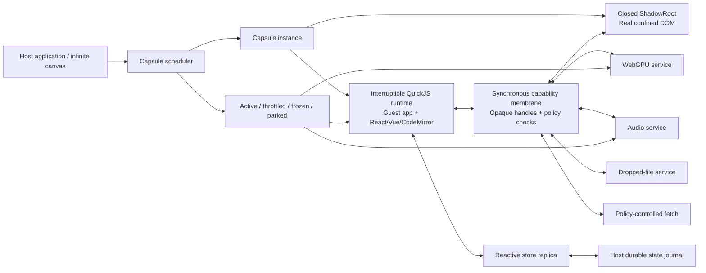

Capsule: iframe-free sandboxed UI runtime

**Status:** Project-seeding specification

**Intended audience:** Runtime, browser-platform, security, framework-compatibility, and test-infrastructure engineers

**Normative terms:** **MUST**, **SHOULD**, and **MAY** describe required, recommended, and optional behavior.

**Initial compatibility gates:** Vue, React, WebGPU, and unmodified CodeMirror 6

## 1. Executive decision

Capsule is an embeddable UI platform in which all guest JavaScript—including React, Vue, CodeMirror, and application dependencies—runs inside an interruptible JavaScript VM. The browser DOM, GPU, audio system, files, network, and storage remain owned by the trusted host and are exposed only through explicit capability membranes.

Capsule is **iframe-free**. An iframe is neither required nor desired for isolation. Each guest gets:

- its own QuickJS runtime and heap;
- a closed ShadowRoot for rendering and style containment;
- a synchronous, host-backed DOM facade scoped to that root;
- resource and execution budgets;
- an allowlisted set of host capabilities;
- lifecycle states that allow offscreen instances to be throttled, frozen, parked, resumed, or destroyed.

CodeMirror is a release requirement, not an optional integration. It MUST run from its normal npm packages without a Capsule-specific fork, adapter, patched build, or changed consumer API.

The foundational architecture is:

> Untrusted guest logic runs in a VM; trusted browser objects remain in the host; guest-visible browser objects are identity-preserving handles whose operations are synchronously checked and executed by the host.

This architecture deliberately spends performance to preserve browser behavior. Correct event cancellation, selection, contenteditable, IME, layout, and observer behavior take priority over raw throughput.

## 2. Product definition

Capsule is both:

1. a secure, embeddable runtime for third-party or generated browser UI; and
2. a small optional reactive UI layer for applications that do not bring React or Vue.

The sandbox is the product boundary. The optional Capsule UI layer is not the isolation boundary and is not required for foreign-framework applications.

### 2.1 Primary use case

A host application displays many independent square applications inside an infinite canvas. A square may contain a form, a React or Vue application, a WebGPU scene, an editor, audio feedback, or file-drop behavior. The host can have hundreds or thousands of mounted or parked squares but only a small visible working set.

The host must remain in control of:

- what guest code can access;
- where the guest can render;
- how much CPU, memory, DOM, GPU, audio, and network capacity it can consume;
- when it is active;
- how it communicates with the host;
- how it is suspended and restored.

### 2.2 Hard requirements

Capsule MUST provide all of the following:

- No iframe dependency.
- All guest JavaScript runs in a sandbox VM, never in the host JavaScript realm.
- Host-owned, root-confined DOM rendering.
- A sufficiently complete DOM facade for unmodified Vue, React, and CodeMirror.
- Synchronous DOM calls, browser event handling, and event cancellation.
- Canvas and WebGPU support.
- File drag-and-drop support.
- Sound-effect-oriented audio support.
- A reactive datastore available without React or Vue.
- Explicit capability grants and resource budgets.
- Visibility-aware throttling and freezing; parking is optional per application.
- Deterministic teardown and recovery after guest failure.
- A conformance and benchmark ladder that grows from a static node to full CodeMirror.
- Differential automatic testing against the same application running natively.

### 2.3 Compatibility means unchanged consumer behavior

For Vue, React, and CodeMirror, compatibility means:

- the same package imports are used inside and outside Capsule;
- the application does not import a Capsule-specific React, Vue, or CodeMirror fork;
- normal mounting APIs continue to work;
- normal DOM-facing library APIs continue to work;
- application code is not rewritten to use asynchronous DOM calls;
- application code is not required to understand node identifiers or transport messages;
- the framework or editor package is not patched after installation.

Capsule's build tool MAY bundle, transpile, resolve modules, and inject runtime bootstrap code. It MUST NOT change the public behavior of the consumer library to make a test pass.

Capsule-specific features such as durable state, host output, lifecycle hooks, or privileged capabilities MAY use an optional `@capsule/runtime` API. Standard browser behaviors must not require it.

### 2.4 Non-goals for the first production release

- Reproducing every browser API.
- Running arbitrary browser extensions or custom elements registered by the host page.
- Allowing navigation, popups, downloads, or arbitrary network access by default.
- Perfect timing side-channel resistance.
- Hard preemption of GPU commands already accepted by the browser GPU process.
- Parking arbitrary framework component trees without an application-provided durable-state contract.
- Supporting legacy Internet Explorer behavior.
- Making a Worker-only UI runtime pass as DOM-compatible when it cannot preserve event semantics.

## 3. What Capsule takes from Arrow

Arrow is a useful starting point because its sandbox already demonstrates the important iframe-free separation:

- source compilation is separate from execution;
- UI logic runs in QuickJS/WASM;
- the guest emits a serialized tree and patches;
- the trusted host owns actual DOM nodes and event listeners;
- node identity crosses the boundary as identifiers rather than raw browser objects;
- canvas code runs behind a separate capability boundary;
- memory and stack limits are set per VM.

Arrow's normal UI renderer also demonstrates a valuable default rendering model: compiled template structure plus fine-grained reactive expression updates, with no general virtual-DOM reconciliation requirement.

Capsule SHOULD preserve these architectural separations and package boundaries. It SHOULD NOT copy Arrow's implementation as its compatibility model.

Arrow's serialized template protocol is intentionally much smaller than a DOM. It is excellent for Arrow-authored templates, but insufficient for general framework compatibility. In particular, CodeMirror constructs and inspects nodes, reads layout synchronously, manipulates selection and ranges, observes native contenteditable mutations, responds to composition, and sometimes decides synchronously whether a native event's default behavior should continue.

Capsule therefore extends the Arrow lesson from “the host owns the DOM” to:

> The host owns the DOM and exposes an allowlisted, synchronous, identity-preserving DOM capability to the guest.

Capsule also adds capabilities not present in Arrow's current UI sandbox contract:

- CPU deadlines and interrupt handling on every guest entry;
- pause, freeze, resume, and park lifecycle states;
- a full event propagation and cancellation contract;
- selection, range, layout, CSSOM, and observer bridges;
- host-to-guest reconciliation for browser-authored DOM mutations;
- WebGPU rather than only WebGL2;
- capability quotas and a generated compatibility ledger.

## 4. Architecture decisions

### 4.1 ADR-1: no iframe

Capsule MUST NOT use an iframe as its sandbox or rendering surface.

Isolation comes from the VM, opaque browser-object handles, capability validation, a root-confined renderer, and resource budgets. A closed ShadowRoot provides style and DOM containment but MUST NOT be described as the security sandbox.

### 4.2 ADR-2: the DOM facade is host-backed, not a speculative mirror

Each guest-visible `Node`, `Element`, `Range`, `Selection`, event, observer, stylesheet, or related browser object is a facade around an opaque host handle. The underlying browser object exists only in the trusted host realm.

This avoids the hardest failure mode of a separate fake tree: eventually having to guess the browser's layout, focus, selection, contenteditable, and IME results. Capsule asks the browser for those results on the real, confined nodes.

### 4.3 ADR-3: the DOM VM executes on the main browser thread

The guest JavaScript heap remains inside QuickJS/WASM, but the UI VM is entered synchronously from the main thread.

This is required because browser event cancellation is synchronous. A main-thread event listener cannot send an event to a Worker, wait asynchronously, and then retroactively apply `preventDefault()` before the browser performs the default action. A Worker can block on shared memory, but the main browser agent cannot safely block waiting for the Worker. Host-side emulation of all default editing behavior would become a second, fragile editor implementation.

With an embedded main-thread VM:

- the host receives the real browser event;
- it immediately invokes the guest listener inside QuickJS;
- the guest sees a facade event;
- `preventDefault`, propagation controls, selection reads, and DOM writes affect the real event and nodes before the host listener returns;
- the host aborts guest execution if it exceeds its deadline.

This is the most important decision in the specification. A future Worker backend MAY exist for canvases or non-interactive renderers, but it is not the CodeMirror-compatible UI backend.

### 4.4 ADR-4: one VM runtime per Capsule

Each mounted Capsule MUST have a separate QuickJS runtime, not only a separate context in a shared heap. This enables independent memory limits, interrupt policy, failure containment, disposal, and lifecycle control.

The WebAssembly module code MAY be shared by the host implementation where the VM library safely allows it. Guest heaps and runtime state may not be shared.

### 4.5 ADR-5: standard APIs first, Capsule APIs second

When a required behavior has an established browser API, Capsule SHOULD expose that API shape. Examples include DOM, events, file objects, WebGPU, timers, and basic Web Audio.

Capsule-specific APIs are appropriate for host state, lifecycle, explicit outputs, telemetry, and capabilities for which no safe standard mapping exists.

### 4.6 ADR-6: correctness gates before performance gates

Conformance failures block progression. Performance results are collected from the beginning, but relative performance does not block the early compatibility milestones unless the host becomes unresponsive, input is lost, or a resource budget can be bypassed.

After full CodeMirror passes, benchmark baselines become regression gates.

## 5. System topology

### 5.1 Trust zones

| Zone | Trusted? | Responsibilities |
| --- | --- | --- |
| Host application | Yes | Chooses artifacts, mount points, capabilities, budgets, and visibility |
| Capsule host runtime | Yes | VM scheduling, membrane validation, DOM ownership, capability services, teardown |
| Guest VM | No | Application code, dependencies, framework, editor, guest state |
| Closed ShadowRoot | No content; trusted owner | Contains visible nodes and styles; does not itself enforce code isolation |
| Build artifact | No | May contain malicious or malformed code and assets even when compilation succeeded |
| Dropped files | No | User-authorized input, still subject to size/type/read budgets |
| GPU commands and shaders | No | Validated by Capsule policy and the browser's WebGPU implementation |

### 5.2 Main components

1. **Artifact builder** resolves and bundles guest modules, emits a manifest, source maps, integrity metadata, and a compatibility target.
2. **Capsule host** mounts instances and exposes the host API.
3. **Scheduler** determines which VM may run and enforces CPU/lifecycle policy.
4. **VM adapter** creates a runtime, installs globals, loads modules, drains jobs, interrupts long tasks, and disposes the heap.
5. **DOM membrane** maps guest facades to real, confined browser objects.
6. **Capability services** provide files, network, WebGPU, audio, clipboard, storage, and host communication.
7. **Reactive store** synchronizes durable structured state.
8. **Lifecycle manager** throttles, freezes, parks, restores, and destroys instances.
9. **Trace recorder** captures guest entries and membrane operations for replay and minimization.
10. **Conformance laboratory** runs native-versus-Capsule differential fixtures.

## 6. VM execution and scheduling

### 6.1 Runtime contract

The VM MUST support:

- modern ECMAScript needed by current Vue, React, and CodeMirror bundles;
- ESM-like module loading supplied by the artifact builder;
- guest promises and microtasks under explicit host control;
- synchronous host functions;
- per-runtime heap and stack limits;
- an interrupt handler with a monotonic deadline;
- deterministic disposal of guest and host handles;
- source names and source maps suitable for debugging.

The initial implementation SHOULD use the synchronous QuickJS/WASM variant. Asyncify is not needed for ordinary browser APIs because asynchronous host operations are represented as guest promises and resolved on later scheduler entries. Avoiding Asyncify also avoids its reentrancy constraints in the exact path where DOM callbacks may be nested.

### 6.2 Every entry is budgeted

A “guest entry” is any transition from trusted host code into the VM, including:

- initial module evaluation;
- browser event listeners;
- timer callbacks;
- animation frame callbacks;
- observer callbacks;
- promise job draining;
- capability completion callbacks;
- lifecycle hooks;
- host messages.

Before every entry, the scheduler MUST install a deadline and operation counters. On deadline or quota exhaustion, the runtime MUST be interrupted. Policy chooses whether that single task fails, the Capsule enters an error state, or the entire runtime is terminated. Security-sensitive violations terminate the runtime.

The first implementation SHOULD use conservative separate budgets for boot, user input, animation, background timers, and lifecycle hooks. Budgets are host policy, not guest-controlled values.

### 6.3 Reentrancy rules

- A host DOM call may synchronously return to the currently running guest entry.
- A browser event may trigger nested browser behavior, but Capsule MUST cap entry depth.
- The host MUST NOT start a second independent job drain while the runtime is already executing.
- Promise reactions created during an entry are drained at specified microtask checkpoints, not recursively without limit.
- Observer delivery follows browser ordering as closely as possible and is traceable.
- A disposed or expired ephemeral event handle MUST throw when reused.

### 6.4 Error containment

An uncaught guest error is reported with capsule identifier, artifact version, guest stack, current entry type, and the last bounded trace window. It MUST NOT escape into the host application's event loop as an uncaught host exception.

Teardown MUST remove:

- all real event listeners;
- all real observers;
- pending timers and animation frames;
- host object handles;
- GPU and audio resources;
- file and network operations;
- the ShadowRoot contents;
- the VM runtime.

## 7. DOM compatibility membrane

### 7.1 Meaning of “fake DOM”

The DOM is fake only from the guest's perspective. Guest objects are JavaScript facade objects created inside QuickJS. Their stateful browser behavior is backed by real DOM objects in the host.

The host maintains:

- a table from integer handle to browser object plus capability type;
- a reverse weak map from browser object to handle;
- a guest-side identity cache so repeated access to the same object returns the same facade object;
- ownership metadata tying every node to exactly one Capsule;
- lifetime metadata for permanent, detachable, observer, and ephemeral handles.

No guest operation may accept a handle owned by another Capsule.

Facade branding is part of compatibility. Supported objects MUST have coherent guest-side prototype chains, constructors, property descriptors, constants, `instanceof` behavior, and `Object.prototype.toString` tags. Supported failures use the browser's expected TypeError or a correctly named DOMException facade rather than an arbitrary bridge error.

### 7.2 Virtual document topology

Each Capsule sees a coherent virtual browser environment:

- `window`, `self`, `globalThis`, `document`, and `navigator` refer to Capsule facades;
- `document.body` maps to the guest's content mount inside the closed ShadowRoot;
- `document.head` maps to a scoped style/resource mount inside the same root;
- `document.documentElement` is a virtual containing element;
- `ownerDocument` returns the guest document facade;
- `defaultView` returns the guest window facade;
- parent traversal stops at the Capsule root;
- selectors cannot see host or sibling Capsule nodes;
- focus and selection are reported only when they involve the Capsule;
- frame, parent, top, opener, cookie, host storage, and host history are absent or safe facades.

The facade MUST expose a coherent feature profile. It must not claim a constructor or property is supported and then return incompatible behavior. Optional browser features may be hidden so that libraries use their established fallback paths.

### 7.3 Node operations

The first complete DOM profile MUST cover the operations used by current Vue, React, and CodeMirror, including:

- creation of HTML, SVG, text, comment, fragment, and range objects;
- append, prepend, insert, replace, remove, clone, normalize, and containment;
- sibling, parent, child, and root traversal;
- text, HTML, attribute, class, dataset, and style manipulation;
- namespaced attributes and SVG creation;
- selector matching and scoped queries;
- form control value, checked state, selection, validity, and focus behavior;
- event listener registration and removal;
- focus, blur, pointer capture, and scroll operations;
- `getBoundingClientRect`, `getClientRects`, and relevant offset/client/scroll dimensions;
- `getComputedStyle` and a scoped CSSOM;
- selection and range APIs;
- MutationObserver, ResizeObserver, and IntersectionObserver;
- requestAnimationFrame, timers, performance time, and media-query observation;
- `document.fonts`, visual viewport data, and the actual browser-engine feature profile where required;
- clipboard, data transfer, files, and drag-and-drop under policy.

The exact support ledger MUST be generated and versioned. “DOM supported” is not an acceptable undifferentiated status.

### 7.4 Synchronous calls

All ordinary DOM reads and writes exposed to the guest are synchronous, including layout reads. The call path is an in-process QuickJS host function, not `postMessage`.

Each operation is represented internally as a versioned membrane opcode even if the initial implementation uses direct function calls. This provides:

- policy checking;
- tracing and replay;
- generated bindings;
- consistent error behavior;
- the option to batch safe write-only operations later without changing guest semantics.

Write batching MAY be added only when a following read, event return, observer checkpoint, animation phase, or explicit flush produces behavior equivalent to a real DOM.

### 7.5 Event pipeline

For a real browser event targeting a Capsule node:

1. The host determines the confined composed path.
2. It creates an ephemeral guest event facade linked to the real event.
3. It invokes guest capture and bubble listeners in browser order inside the same host event stack.
4. Event getters read allowlisted real-event data.
5. `preventDefault`, `stopPropagation`, `stopImmediatePropagation`, and pointer-capture calls affect the real event synchronously.
6. On listener return, the host applies the browser's normal default-action decision.
7. The event facade expires after the event dispatch and required queued work.

React's delegated event system and Vue's event modifiers must operate through this same mechanism. Capsule MUST not special-case their public APIs.

Listener options—capture, once, passive, and abort signals—must behave coherently. A passive listener calling `preventDefault` must behave as it does natively.

Trusted browser events expose coherent `isTrusted`, timestamp, target, related-target, composed-path, phase, and default-prevented values. Events created and dispatched by guest code are untrusted. Targets and paths are always remapped to guest facades and clipped at the Capsule root.

### 7.6 Browser-authored DOM changes

The browser may modify the real DOM without a guest DOM write, especially for:

- contenteditable input;
- IME composition;
- autofill;
- form control state;
- selection and focus changes;
- drag-and-drop;
- native editing commands.

Because guest facades point to the real nodes, no tree resynchronization is needed for subsequent reads. Real host MutationObservers capture the changes and deliver mapped MutationRecord facades to the registered guest callbacks at the appropriate checkpoint.

Mutation records MUST preserve target identity, added and removed node identity, sibling references, attribute names, old values when requested, and ordering. Capsule MUST not replace a native contenteditable mutation with a guessed text patch before CodeMirror sees it.

### 7.7 Selection, ranges, focus, and layout

Selection and layout are not cached approximations in the exact DOM profile. Reads are performed against the real nodes.

The membrane MUST support:

- anchor and focus node identity and offsets;
- collapsed and directional selections;
- range boundaries, client rectangles, and mutations;
- `activeElement` within the virtual root;
- focus with `preventScroll`;
- coordinate-to-position and position-to-coordinate APIs required by the compatibility ledger;
- scrolling of confined elements and allowed ancestor viewport coordination;
- layout reads after preceding guest writes in the same task;
- scale and transform-aware rectangles, important inside an infinite canvas.

The host MUST define coordinate semantics. Guest DOM coordinates SHOULD use browser viewport CSS pixels, matching native DOM APIs. An optional Capsule runtime API may expose local infinite-canvas coordinates separately.

### 7.8 CSS and style containment

CodeMirror and framework ecosystems insert style elements and manipulate inline styles. Capsule MUST support this without allowing CSS to escape or load arbitrary resources.

Rules:

- Guest styles are mounted only inside the Capsule ShadowRoot.
- Selectors cannot target the host or sibling roots.
- `@import` is blocked unless a host capability explicitly resolves and sanitizes it.
- Resource-bearing CSS such as `url()` is denied by default or resolved through a URL capability.
- CSS text is parsed and filtered; string matching alone is insufficient.
- Style properties known to trigger navigation or resource access are policy-controlled.
- CSSOM objects are handle-backed and root-confined.
- Host theme inputs are provided through declared custom properties or props, not by exposing host stylesheets.
- CodeMirror's `style-mod` behavior is an explicit conformance fixture.

Shadow DOM is used for containment and predictable style scope. Security still depends on the membrane and resource policy.

### 7.9 Dangerous elements and properties

The default policy MUST block or inert elements and behaviors that execute host-realm code, navigate, embed documents, or fetch uncontrolled resources. This includes scripts, iframes, objects, embeds, portals, base URLs, uncontrolled links, automatic form navigation, and host custom-element constructors.

`innerHTML`, SVG markup, URL attributes, and CSS text MUST pass the same policy as equivalent imperative operations.

Custom elements are not part of the first CodeMirror profile. A later guest-only custom-elements facade may be designed, but `document.createElement` must never invoke an unrelated custom element registered by the host page.

### 7.10 Missing API behavior

An unsupported member MUST produce a structured compatibility error in development and test modes. The error includes facade type, member, operation, guest stack, framework version, and current fixture.

Capsule must not silently return `undefined` when the real target profile would expose a member. Unknown-access telemetry feeds the construction loop and generated support ledger.

## 8. Framework compatibility

### 8.1 Shared requirements

Foreign frameworks run wholly inside the guest VM. The builder bundles their runtime code and dependencies into the Capsule artifact. The host does not run framework plugins.

The DOM profile must support common environment detection, scheduler APIs, microtasks, module semantics, and development diagnostics. Production and development builds are separate compatibility lanes.

### 8.2 Vue gate

The Vue gate uses the official, unmodified Vue runtime packages. It must pass fixtures for:

- `createApp(...).mount(...)` using a selector and an element;
- text and attribute updates;
- keyed list insertion, removal, and reordering;
- event modifiers and component events;
- controlled inputs, checkbox, radio, select, and textarea;
- computed values, watchers, and next-tick ordering;
- component mount, update, unmount, and cleanup;
- fragments, transitions without animation timing guarantees, and Teleport confined to an allowed guest target;
- runtime-compiled templates if the chosen artifact profile includes the compiler;
- style insertion and scoped CSS fixtures;
- error boundaries and unmount cleanup.

No `@capsule/vue` package is needed to mount. An optional adapter may expose the Capsule store through idiomatic Vue reactivity, but it is not a compatibility dependency.

### 8.3 React gate

The React gate uses official, unmodified React and React DOM packages. It must pass fixtures for:

- `createRoot` mounting and unmounting;
- text, attributes, styles, and `dangerouslySetInnerHTML` under policy;
- keyed list reconciliation;
- synthetic capture and bubble events;
- controlled and uncontrolled form elements;
- refs and imperative DOM reads;
- effects, layout effects, cleanup, and Strict Mode development behavior;
- context, suspense fallback, error boundaries, and transitions;
- portals confined to an allowed guest node;
- hydration only after Capsule defines a serialized-root contract;
- accessibility attributes;
- scheduler behavior under throttling and resume.

An optional adapter may expose the Capsule store through `useSyncExternalStore`. It must not be required for ordinary React applications.

## 9. CodeMirror compatibility contract

### 9.1 Release definition

“CodeMirror works” means an unmodified CodeMirror 6 application can construct `EditorView`, edit text using real keyboard and pointer input, compose text with OS input methods, measure and virtualize long documents, render extensions, use clipboard and drag/drop under granted capabilities, survive pause/resume, and cleanly destroy itself.

The initial pinned reference is `@codemirror/view` 6.41.0, the current source inspected while drafting this specification. CI also tracks the latest compatible 6.x release weekly. The pinned version changes only through a reviewed compatibility update.

The minimum package set includes:

- `@codemirror/state`;
- `@codemirror/view`;
- `@codemirror/commands`;
- `@codemirror/language`;
- `@codemirror/search`;
- `@codemirror/autocomplete`;
- `@codemirror/lint`;
- at least one language package;
- `style-mod` through the normal dependency graph.

### 9.2 Why CodeMirror is the highest gate

The inspected view layer uses real DOM behavior across all of these categories:

- synchronous element, text, fragment, and range creation;
- node identity and traversal;
- contenteditable and native editing mutations;
- MutationObserver with old values and ordered records;
- ResizeObserver and IntersectionObserver;
- selection, focus, active element, and shadow-root behavior;
- composition, beforeinput, keyboard, pointer, drag/drop, clipboard, focus, and scroll events;
- cancellable handlers and browser default actions;
- animation-frame-separated write and measure phases;
- computed styles, CSS injection, and media queries;
- bounding boxes, client rectangles, offsets, client sizes, scroll sizes, and coordinate mapping;
- browser-specific fallbacks and timing workarounds.

A fake tree that only renders patches can satisfy none of these as a general contract. A Worker mirror can satisfy some but cannot synchronously decide default actions. The host-backed main-thread membrane is designed around this evidence.

### 9.3 Required CodeMirror scenarios

The full release suite MUST cover:

1. construction with a parent element and with later manual insertion;
2. initial document, update, replacement, and destruction;
3. ASCII typing, deletion, Enter, Tab policy, undo, and redo;
4. arrow, word, line, page, home/end, and document navigation;
5. single, multiple, mouse-drag, shift, rectangular, and programmatic selections;
6. copy, cut, paste, and paste filtering;
7. drag text within an editor and files/text into an editor;
8. composition start/update/end with at least Japanese, Chinese, Korean, dead-key accents, and Android composition;
9. autocorrect and mobile virtual-keyboard behavior on supported targets;
10. scrolling, scroll-into-view, transformed/scaled container behavior, and long-line horizontal scrolling;
11. a document large enough to exercise viewport virtualization and gap elements;
12. line wrapping, bidi text, tabs, widgets, decorations, gutters, fold ranges, layers, and draw-selection;
13. search panel, dialogs, lint tooltips, completion list and info tooltip, hover tooltip, and panels;
14. theme and style-module mounting;
15. focus transfer between two editors and between editor and another guest control;
16. resize, zoom/scale, hidden-to-visible transition, freeze/resume, and host page visibility change;
17. screen-reader announcements and keyboard-only operation;
18. multiple create/destroy cycles with no host handles, observers, or listeners leaked;
19. direct CodeMirror use inside a React guest and inside a Vue guest through ordinary community integration patterns;
20. guest errors in extensions without corrupting the host or another Capsule.

### 9.4 EditContext policy

The first release MAY omit the emerging EditContext API and expose a coherent environment in which it is absent, causing CodeMirror to use its contenteditable path. Capsule must not expose a partial EditContext implementation.

EditContext becomes a separate later conformance profile. CodeMirror success cannot depend on it because contenteditable remains necessary across the browser matrix.

CodeMirror's Safari shadow-selection fallback currently uses `Document.execCommand("indent")` to provoke a cancellable beforeinput event. The editing profile MUST either provide the modern composed-selection path used by that browser or support this exact, focus-confined command behavior. Capsule must not expose unrestricted `execCommand` as a side effect of satisfying the fallback.

### 9.5 Accessibility requirement

Visual correctness is insufficient. The real DOM must remain present in the browser accessibility tree. Release testing includes keyboard-only use and at least VoiceOver and NVDA. Live-region announcements, focus indication, contenteditable semantics, and editor labels must be observable.

## 10. Canvas and WebGPU

### 10.1 Guest API

The target compatibility profile exposes standard `navigator.gpu` and `canvas.getContext('webgpu')` shapes inside the guest. Guest code sees facade objects; actual adapters, devices, queues, buffers, textures, encoders, pipelines, passes, bind groups, and canvas contexts remain host objects.

The first milestone supports the subset required by the benchmark. The complete support ledger then grows by interface and member. Unsupported features fail explicitly.

### 10.2 Execution model

WebGPU calls cross the synchronous VM membrane as typed opcodes. WebGPU promises settle into guest promises on later scheduler entries. Object identity and destruction are tracked by opaque handles.

Typed data crosses by bounded copy:

- `writeBuffer` and `writeTexture` copy from guest memory;
- shader and descriptor strings are size-limited;
- read mapping copies host data into guest memory after completion;
- write mapping tracks guest ranges and copies them back before unmap;
- buffer detachment and invalid reuse have explicit conformance tests.

This will be slower than direct native calls. It preserves the guest API and containment, which is the chosen tradeoff. Once correct, the host MAY add descriptor encoding and command batching without changing semantics.

### 10.3 Policy and lifecycle

The host controls:

- whether WebGPU is granted;
- adapter feature and limit exposure;
- per-Capsule device strategy;
- maximum buffers, textures, dimensions, mapped bytes, shader bytes, and submissions;
- animation-frame frequency;
- device-loss and error reporting;
- termination and device destruction.

On freeze, Capsule stops animation callbacks and rejects or queues new submissions according to policy. Already submitted work cannot be synchronously preempted. On park or destroy, owned GPU objects and devices are destroyed where supported.

### 10.4 WebGPU acceptance fixture

The increasing-complexity gate is one Capsule containing:

- a React control panel;
- a real canvas rendered with WebGPU;
- shader compilation;
- uniform updates from React state;
- pointer input and resize;
- a continuous animation;
- device-loss recovery;
- freeze with zero new frames or submissions;
- resume without reloading application state.

A native-worker GPU backend MAY be explored later for throughput. It must not replace the exact DOM VM or require consumer API changes.

## 11. File drop, clipboard, audio, network, and storage

### 11.1 File drop

The host receives the native drag event, invokes guest handlers synchronously, and exposes DataTransfer, DataTransferItemList, FileList, Blob, and File facades for files explicitly dropped over the Capsule.

Policy MUST limit file count, individual size, aggregate bytes, MIME types, read rate, and handle lifetime. Host filesystem paths are never exposed. File `text`, `arrayBuffer`, `stream`, and `slice` behavior is implemented through bounded host reads and guest promises.

Directory traversal and file pickers are separate opt-in capabilities.

### 11.2 Clipboard

Clipboard events expose only event-scoped data allowed by policy. Async clipboard APIs require an explicit capability and browser permission. Guest user activation is tracked so a Capsule cannot reuse a stale activation token.

### 11.3 Audio

The sound-effect profile exposes a host-backed subset of Web Audio with normal `AudioContext`-style objects. It initially covers:

- context creation or resumption after a user gesture;
- decoded audio buffers;
- buffer sources;
- gain and basic stereo panning;
- connect, disconnect, start, stop, and scheduled times;
- ended events;
- master per-Capsule volume and voice limits.

The host may use one shared native AudioContext with a private gain subgraph per Capsule. Guest nodes are opaque handles. AudioWorklet, microphone input, and arbitrary media capture are not in the sound-effect profile.

Freeze behavior is declared per Capsule: stop, fade, suspend scheduling, or continue as a background-audio capability. Default offscreen behavior is a short fade and suspension.

### 11.4 Network

`fetch` is denied unless declared. A grant defines origins, methods, headers, credentials policy, redirect policy, response-byte limits, concurrency, and timeout. Host cookies, authorization headers, referrer, service-worker state, and ambient credentials are not inherited.

### 11.5 Storage

Host `localStorage`, IndexedDB, Cache Storage, and cookies are unavailable by default. Capsule durable state uses the Capsule store. A namespaced storage capability may be added later with quotas and explicit migration semantics.

## 12. Reactive data and the default Capsule UI

### 12.1 Reactive store

Capsule includes a framework-independent store so a guest does not need React or Vue.

The store MUST provide:

- structured-cloneable state;
- fine-grained property/path subscriptions;
- derived values;
- effects with deterministic cleanup;
- batched writes and transaction boundaries;
- a monotonically increasing revision;
- host-to-guest and guest-to-host updates;
- schema/version metadata and migrations;
- snapshots suitable for restore;
- explicit treatment of transient, non-durable values.

The host owns the durable journal. The guest keeps a reactive replica while active. Guest writes are validated against size, schema, and rate policy, assigned a revision, and acknowledged. Conflicts use an explicit strategy chosen by the host; last-write-wins must not be an undocumented default for collaborative data.

Framework component-local state remains framework-owned. It is preserved during freeze because the VM remains alive, but not automatically during park.

### 12.2 Default UI layer

`@capsule/ui` SHOULD be a small fine-grained renderer inspired by Arrow:

- templates compile to stable structure and expression descriptors;
- reactive dependencies update only their bound parts;
- component ownership controls cleanup;
- list identity is explicit;
- the renderer uses the same DOM facade as foreign frameworks;
- no virtual DOM is required.

The default renderer is the simplest benchmark client. It must not receive privileged host DOM access unavailable to React or Vue.

## 13. Lifecycle and offscreen resource control

### 13.1 Visibility input

IntersectionObserver alone is not sufficient for an infinite canvas because the host may know about transforms, zoom level, occlusion, distance, and virtualization before the DOM does. The scheduler combines:

- host-provided visibility and distance;
- actual intersection state;
- page visibility;
- focus and pointer capture;
- active composition or drag;
- audio/background grants;
- recent user interaction;
- host priority.

The host remains authoritative. Capsule's own observers continue to report a browser-coherent `inView` state to guest libraries.

### 13.2 Lifecycle states

| State | VM | DOM | Timers/RAF | GPU | Audio | Intended use |
| --- | --- | --- | --- | --- | --- | --- |
| Active | Runnable | Live | Normal | Normal | Policy | Visible/interactive |
| Throttled | Runnable on reduced budget | Live | Coalesced; reduced RAF | Reduced submissions | Usually reduced | Near viewport or low priority |
| Frozen | Retained, never entered | Retained | Suspended | No new submissions | Suspended unless granted | Offscreen, fast resume |
| Parked | Disposed | Removed or placeholder | None | Disposed | Disposed | Far away, memory recovery |
| Destroyed | Disposed | Removed | None | Disposed | Disposed | Permanent teardown |

### 13.3 Freeze rules

Freeze MUST NOT begin while the Capsule owns focus, pointer capture, an active drag, or IME composition unless the host first performs a defined cancellation/blur sequence.

While frozen:

- no guest callback is entered;
- timer deadlines are retained relative to a virtual clock;
- animation frames do not fire;
- observer notifications and async completions are queued with bounds and coalescing rules;
- input is not accepted except an activation event used to resume;
- GPU submission count remains unchanged;
- the real DOM may remain visible as its last frame.

On resume:

1. visibility, size, scale, and clock state are updated;
2. stale layout caches are invalidated;
3. bounded capability completions are delivered;
4. resize/intersection/visibility notifications are delivered in defined order;
5. overdue timers follow the selected coalescing rule rather than all firing at once;
6. one animation frame is scheduled;
7. normal input resumes.

### 13.4 Parking

Parking is opt-in because arbitrary JavaScript heaps are not serializable.

A Capsule is parkable only when its manifest declares a restore contract. The default contract persists:

- Capsule store snapshot and revision;
- host props;
- application-defined serializable snapshot;
- optional focus and scroll restoration metadata;
- artifact and schema versions.

For CodeMirror, the application snapshot SHOULD include document content, editor selection, and configuration identifiers. History and plugin state require explicit application support. Freeze, not park, is the default for an active editor likely to return soon.

### 13.5 Scaling target

The reference infinite-canvas scenario is:

- 1,000 logical Capsules;
- at most 12 active;
- at most 40 throttled or frozen with live DOM/VM state, configurable by memory pressure;
- the remainder parked;
- no background CPU from frozen or parked guests;
- deterministic activation as the viewport moves.

The exact counts are benchmark configuration, not universal product limits.

## 14. Host integration contract

### 14.1 Host-facing concepts

The public host API consists conceptually of:

- `createCapsuleHost(policy)` — creates a scheduler, capability registry, artifact verifier, and shared services;
- `mountCapsule(element, artifact, options)` — mounts one artifact into a host-selected element;
- a `CapsuleHandle` — controls props, durable state, visibility, priority, pause/resume, snapshot, destroy, and diagnostics;
- host events — ready, output, state change, lifecycle change, error, security violation, and metrics;
- capability registration — audited host functions associated with manifest permissions.

Names may change during API design; responsibilities may not.

### 14.2 Mount inputs

A mount specifies:

- artifact URL or verified artifact object;
- mount element;
- initial structured props;
- initial store state or state key;
- granted capabilities, intersected with host policy and artifact declaration;
- resource budget profile;
- visibility and lifecycle policy;
- theme custom properties;
- output and error callbacks;
- optional restore snapshot.

The mount call returns before or after readiness according to an explicit async contract. It never exposes the guest VM or real guest nodes as mutable host API.

### 14.3 Infinite-canvas integration

The host SHOULD send visibility updates containing at least visible state, distance band, priority, CSS size, effective scale, and occlusion estimate. Capsule may also observe its mount, but host hints win.

The host may ask Capsule to freeze or park. Capsule reports whether a temporary interaction guard prevents the transition. The host can force destruction but must not force an unsafe park snapshot.

### 14.4 Host/guest messages

Messages are structured-cloneable values checked against byte and depth limits. Function references, DOM handles, errors with arbitrary prototypes, and host objects do not cross this channel.

The host may register named capability modules. Guest imports are resolved only if both artifact manifest and host grant permit them. Capability calls return primitives, structured data, or guest promises.

## 15. Guest authoring contract

### 15.1 Zero-knowledge path

A normal Vue, React, or CodeMirror guest should need to know only:

- its usual framework entry point;
- that it is bundled as a Capsule artifact;
- which external capabilities it declares.

The guest may use normal `window`, `document`, DOM constructors, timers, events, `navigator.gpu`, and supported audio/file APIs. The builder provides the Capsule bootstrap and virtual environment.

Examples of unchanged application patterns include React mounting with `createRoot`, Vue mounting with `createApp`, and CodeMirror constructing `EditorView` with a parent element.

### 15.2 Optional Capsule runtime

Guests use `@capsule/runtime` only when they need:

- the durable reactive store;
- host props and prop-change subscription;
- structured output events;
- lifecycle hooks;
- declared host capability modules;
- local/infinite-canvas coordinate metadata;
- diagnostics.

The runtime API must be small, framework-neutral, and mockable outside Capsule.

### 15.3 Builder behavior

The builder MUST:

- resolve npm dependencies into a self-contained artifact;
- support TypeScript and ordinary modern JavaScript;
- support JSX and Vue single-file component compilation through explicit plugins;
- preserve framework and CodeMirror packages unmodified;
- emit ESM-compatible modules for the VM loader;
- generate source maps and stable virtual filenames;
- calculate integrity hashes;
- emit manifest capability declarations and compatibility profile;
- reject unresolved native Node dependencies;
- report dynamic imports it cannot package;
- record exact dependency versions for conformance reproduction.

The builder MUST NOT execute guest modules merely to discover metadata. Dependency installation scripts are disabled in the standard build path. Compiler plugins are trusted build infrastructure, not guest capabilities; a service that accepts hostile source must also isolate the build process itself.

Development mode MAY support hot reload by replacing the entire VM or through an explicit state-preserving protocol. Host-realm evaluation is never a development shortcut.

### 15.4 Artifact manifest

The manifest schema includes:

- artifact name, version, entry, build identifier, and integrity;
- Capsule protocol and DOM profile versions;
- framework metadata for diagnostics only;
- requested capabilities;
- default budget profile;
- parkability and snapshot schema;
- required WebGPU features and limits;
- audio policy request;
- allowed network origin patterns;
- asset hashes;
- dependency lock summary.

Host policy always reduces or denies requests; a manifest never grants itself authority.

## 16. Internal protocol and ABI

### 16.1 Protocol families

The internal versioned protocol contains:

- runtime bootstrap and module loading;
- synchronous DOM operations;
- event callback registration and dispatch;
- observer registration and delivery;
- timer, animation, and microtask scheduling;
- asynchronous capability calls and settlements;
- WebGPU object and command operations;
- file and audio handles;
- store snapshots and patches;
- lifecycle transitions;
- tracing, metrics, and errors.

### 16.2 Value model

Boundary values are limited to:

- null, booleans, finite numbers plus explicitly encoded special numbers, strings, and bounded big integers where required;
- bounded arrays and plain records;
- copied ArrayBuffers and typed arrays;
- opaque handles carrying type, owner, generation, and lifetime;
- callback identifiers;
- promise settlement identifiers;
- normalized DOMException and Error records.

Guest prototypes never cross into the host. Host prototypes never cross into the guest.

### 16.3 Handle safety

Every operation validates:

- capsule owner;
- handle generation;
- expected interface type;
- lifetime and disposed state;
- root containment for nodes;
- capability grant;
- operation and byte quotas.

Use-after-free, cross-Capsule handles, type confusion, forged handles, and expired event handles are security test categories.

### 16.4 Binding generation

DOM and WebGPU facade bindings SHOULD be generated from pinned Web IDL plus reviewed policy metadata. Handwritten adapters remain necessary for overloaded calls, event semantics, exotic objects, CSS, selection, mapped GPU memory, and security-sensitive members.

Generated code does not imply automatic exposure. Every member is denied until assigned to a reviewed compatibility profile.

## 17. Security model

### 17.1 Protected assets

Capsule protects:

- host DOM outside the Capsule root;
- host JavaScript objects and closures;
- cookies, tokens, credentials, storage, and service workers;
- sibling Capsules;
- host network authority;
- host files and local paths;
- host GPU/audio objects;
- host responsiveness and bounded resources.

### 17.2 Attacker model

Guest source, transitive dependencies, generated shaders, HTML, SVG, CSS, URLs, serialized state, and files may all be malicious. The attacker may attempt infinite loops, memory exhaustion, handle forgery, reentrancy, prototype pollution, DOM escape, CSS exfiltration, network smuggling, audio abuse, GPU exhaustion, event confusion, and lifecycle race conditions.

### 17.3 Required controls

- QuickJS heap, stack, and CPU interrupt limits.
- DOM node, listener, observer, timer, string, and operation quotas.
- Root-containment checks after every topology-changing operation.
- Explicit tag, attribute, property, URL, CSS, and namespace policy.
- No host-realm `eval`, script execution, or custom-element invocation.
- Network credentials omitted and headers sanitized.
- Capability-specific byte, rate, concurrency, and lifetime budgets.
- Bounded trace/log serialization.
- Guest-prototype stripping on all structured inputs.
- Runtime termination on invariant violation.
- Dependency pinning, fuzzing, and an independent security review before production use with hostile code.

### 17.4 Responsiveness guarantee

Main-thread VM execution is acceptable only if the interrupt handler is active on every entry and its worst-case polling delay is measured. A test that executes an infinite loop from boot, an event callback, a microtask, a timer, an observer, and a capability completion MUST show bounded recovery.

Host bridge functions must also be bounded; an interrupt cannot preempt a host function that itself performs unbounded work.

### 17.5 Honest limitations

Capsule reduces authority and contains code; it is not a process boundary. VM and WebAssembly vulnerabilities, browser DOM/GPU bugs, timing channels, and GPU-process behavior remain in the trusted computing base. The security documentation must state this directly.

## 18. Increasing-complexity conformance and benchmark ladder

Every level has two outputs:

1. **conformance:** whether native and Capsule behavior agree; and
2. **benchmark:** time, memory, operation counts, responsiveness, and lifecycle cost.

A level cannot pass on screenshots alone.

### Level 0 — isolation bootstrap

Fixture: a module that exports output, schedules a promise, throws an error, allocates memory, and attempts known escapes.

Pass criteria:

- modules load and source maps resolve;
- outputs are structured and bounded;
- heap, stack, and CPU limits work;
- guest cannot reach host globals;
- teardown leaves no jobs or handles.

### Level 1 — static DOM

Fixture: nested HTML and SVG, attributes, text, styles, and queries.

Pass criteria:

- normalized tree equals native;
- selectors and traversal agree;
- blocked elements and URLs stay inert;
- root escape attempts fail;
- mount and destroy are leak-free.

### Level 2 — interactive Capsule UI and store

Fixture: counter, derived value, keyed list, form controls, conditional region, timer, and host-synchronized store.

Pass criteria:

- fine-grained updates are correct;
- event order and form values match native;
- batching and cleanup are deterministic;
- snapshot/restore round-trip succeeds.

### Level 3 — Vue

Fixture: a production Vue application containing components, keyed lists, forms, watchers, styles, and confined teleport.

Pass criteria:

- all Vue gate scenarios pass with official packages;
- no unknown DOM member is accessed;
- native and Capsule action traces produce equivalent state and DOM;
- unmount releases all resources.

### Level 4 — React

Fixture: a production and development React application containing controlled forms, refs, effects, layout effects, suspense, errors, portals, and Strict Mode.

Pass criteria mirror the Vue gate and include synthetic event ordering and layout-effect reads.

### Level 5 — React plus WebGPU

Fixture: the React control panel and WebGPU scene defined in section 10.4.

Pass criteria:

- standard guest WebGPU calls work for the declared subset;
- visual output matches a reference within tolerance;
- input, state, resize, and GPU frames remain ordered;
- device loss is recoverable;
- freeze and resume satisfy lifecycle invariants.

### Level 6 — file drop and audio

Fixture: drop bounded files, decode a permitted sound, play it through a gain node, and reflect metadata in the UI.

Pass criteria:

- standard event and file API behavior matches native within policy;
- denied access is explicit;
- autoplay/user-activation behavior is coherent;
- quotas and freeze policy work.

### Level 7 — exact DOM editing primitives

Fixture: contenteditable, selection, ranges, clipboard, composition event traces, observer delivery, layout measurement, scroll, style modules, and transformed containers.

Pass criteria:

- state and event ordering match native for the supported browser profile;
- browser-authored mutations reach guest observers unchanged in meaning;
- cancellable event decisions occur before default action;
- no layout API returns a synthetic approximation.

### Level 8 — CodeMirror core

Fixture: minimal EditorView plus commands and one language.

Pass criteria:

- construction, ASCII editing, selection, scrolling, undo/redo, theme, and destroy work;
- large-document virtualization works;
- no compatibility errors occur;
- native and Capsule editor state agree after each action.

### Level 9 — full CodeMirror release gate

Fixture: the complete scenario set in section 9.3 across the browser and device matrix.

Pass criteria:

- every required scenario passes;
- true IME and accessibility checks pass on release platforms;
- current pinned packages are unmodified and checksum-verified;
- no fixture-specific production shim exists;
- resource and lifecycle tests pass.

### Level 10 — infinite-canvas scale

Fixture: 1,000 mixed Capsules using the lifecycle distribution in section 13.5, including several CodeMirror and WebGPU instances.

Pass criteria:

- only the configured working set executes;
- frozen and parked guests consume zero guest callback CPU;
- activation and viewport movement remain responsive;
- memory follows configured live-instance limits;
- focus, selection, file drag, audio, and GPU state do not leak between instances.

## 19. Measurements and performance policy

Every benchmark records at least:

- artifact fetch, VM creation, module evaluation, first DOM, and ready time;
- guest CPU per entry type;
- membrane call count and time by opcode;
- DOM writes, layout reads, forced layout count, and observer deliveries;
- input-to-state and input-to-paint latency at p50, p95, and p99;
- animation frame time and missed frames;
- guest heap, host handle count, real DOM nodes, listeners, observers, and timers;
- GPU resources, mapped bytes, submissions, and frame time;
- audio voices and buffers;
- freeze, resume, park, and restore latency;
- idle CPU for active, throttled, frozen, and parked sets;
- teardown time and leaked resources.

Each fixture runs natively and in Capsule on the same browser build and machine. Results show both absolute values and ratios.

Correctness is always a hard gate. Initial performance hard gates are limited to:

- no lost or reordered user input;
- no unbounded main-thread stall;
- CPU abuse is interrupted within the configured deadline plus measured interrupt-poll delay;
- frozen Capsules execute no guest callbacks or GPU submissions;
- teardown returns resource counters to baseline;
- full CodeMirror input-to-paint p95 remains below 100 ms on the reference desktop profile;
- the visible WebGPU fixture maintains at least 30 frames per second on the reference GPU profile.

After Level 9 first passes, accepted results are frozen as versioned baselines. A sustained regression greater than the project-defined tolerance—initially 10% for latency/CPU and 5% for retained resources—requires review or an explicit baseline update.

## 20. Automatic test and construction loops

### 20.1 Differential DOM loop

The laboratory generates bounded DOM operation traces and runs each trace twice:

1. against a native closed-ShadowRoot harness; and
2. against the Capsule DOM facade.

It compares return values, exceptions, object identity relationships, normalized DOM, selection, focus, computed styles selected by the fixture, mutation records, and event order.

On failure, a reducer removes operations and data until it produces the smallest reproducing trace. Artifacts include the seed, minimized trace, native result, Capsule result, membrane log, and guest stack.

### 20.2 Framework differential loop

The same Vue or React fixture is built in native and Capsule modes from the same locked source. Playwright performs real keyboard, pointer, focus, scroll, and file actions. After every step the harness compares:

- application-observable state;
- normalized DOM and form values;
- focus and selection;
- emitted outputs;
- accessibility snapshot where stable;
- screenshot regions for visual regressions;
- console errors and unknown API accesses.

Framework package checksums are recorded so a compatibility pass cannot come from a patched dependency.

### 20.3 CodeMirror differential loop

Each action is applied to native and Capsule editors. The oracle compares:

- editor document text;
- EditorState selection ranges;
- undo/redo result;
- composing and focus state where observable;
- viewport and visible ranges within layout tolerance;
- scroll positions;
- normalized editor DOM;
- completion, tooltip, panel, gutter, and decoration presence;
- final screenshot and accessibility results.

The test harness records browser events and membrane calls around any divergence. Synthetic composition-event tests run on every pull request; true OS IME tests run in the release/device lane.

### 20.4 WebGPU differential loop

The native and Capsule fixtures use identical shaders, buffers, and actions. The harness compares:

- validation and error behavior;
- buffer readback for deterministic compute fixtures;
- rendered pixel hashes with an explicit tolerance;
- device-loss propagation;
- resource counters;
- frame and submission behavior across lifecycle changes.

### 20.5 Security and abuse loop

Generated and curated cases attempt:

- VM escape and prototype pollution;
- forged, cross-Capsule, expired, and type-confused handles;
- root escape through every topology operation;
- script/custom-element execution;
- CSS and URL exfiltration;
- credentialed or oversized network requests;
- event reentrancy and stale event use;
- infinite loops from every guest entry type;
- heap, DOM, listener, timer, observer, file, audio, and GPU exhaustion;
- freeze/resume races and teardown during callbacks.

A security invariant failure terminates the test Capsule and fails CI.

### 20.6 Compatibility discovery loop

Development and CI builds instrument facade access. Every missing or unsupported API access becomes a machine-readable gap containing:

- interface and member;
- get, set, construct, or call operation;
- normalized arguments;
- guest callsite and dependency package;
- fixture and browser;
- frequency;
- whether it blocked execution or was feature detection.

The loop groups and ranks gaps, links them to Web IDL, and generates a compatibility backlog. Feature-detection reads are distinguished from required runtime operations.

### 20.7 Test-driven construction algorithm

For each milestone, work follows this fixed loop:

1. Run the smallest not-yet-passing fixture in native and Capsule modes.
2. Reduce the first divergence to a deterministic trace.
3. Classify it as missing surface, wrong value, identity error, ordering error, policy conflict, scheduler error, or browser variance.
4. Add or correct the narrowest reviewed membrane behavior.
5. Add the reduced trace as a permanent unit or conformance test.
6. Run root-containment, handle-lifetime, quota, and reentrancy tests for the changed capability.
7. Run the current benchmark level and all lower levels.
8. Update the generated support ledger and compatibility report.
9. Advance only when the level has no unexplained divergence.

Fixture-specific production branches, package patches, swallowed exceptions, and fabricated layout values are forbidden ways to close a gap.

### 20.8 CI lanes

| Lane | Trigger | Contents |
| --- | --- | --- |
| Fast | Every change | Unit tests, protocol tests, reduced traces, one Chromium fixture per completed level |
| Browser | Every pull request | Chromium, Firefox, and WebKit conformance through the current level |
| Fuzz | Nightly | DOM traces, handle abuse, event ordering, lifecycle races, shader/resource cases |
| Framework update | Weekly | Latest allowed Vue, React, and CodeMirror versions against pinned baselines |
| Scale | Nightly | Infinite-canvas lifecycle and memory benchmark |
| Device/IME | Nightly or scheduled lab | Android and desktop IMEs, touch, virtual keyboard, real clipboard |
| Accessibility | Scheduled and release | Automated accessibility checks plus VoiceOver and NVDA scripts |
| Release | Candidate builds | All gates, checksum verification, performance regression review, leak soak |

Flaky tests are quarantined only with an owner, issue, captured trace, and expiration date. CodeMirror IME failures are not classified as harmless flakiness.

## 21. Incremental build plan

### Phase 0 — architecture falsification

Before building a broad DOM, prove the riskiest chain:

- QuickJS event callback invoked synchronously from a real browser event;
- guest `preventDefault` affects that event;
- host-backed node identity survives round trips;
- contenteditable native mutation reaches a guest MutationObserver;
- selection and range rectangles are readable;
- infinite loops are interrupted from all entry types.

Also perform a deliberately incomplete CodeMirror walking-skeleton spike: construct an editor, render a document, and type one ASCII character. This spike does not replace the benchmark order; it exists to falsify the architecture early.

Exit gate: no fundamental event, observer, VM-interrupt, or object-identity blocker.

### Phase 1 — runtime, protocol, and security kernel

Build artifact loading, one-runtime-per-Capsule isolation, budgets, scheduler entries, handles, structured values, tracing, errors, and deterministic teardown.

Exit gate: Level 0.

### Phase 2 — DOM core and Capsule UI

Build the root, node facade, core events, styles, forms, reactive store, and default fine-grained renderer.

Exit gate: Levels 1 and 2 plus root-containment fuzzing.

### Phase 3 — Vue profile

Use gap telemetry and differential traces to complete the DOM/scheduler surface needed by Vue.

Exit gate: Level 3 in production and development modes.

### Phase 4 — React profile

Complete synthetic events, form semantics, layout effects, scheduler behavior, portals, and development diagnostics.

Exit gate: Level 4.

### Phase 5 — WebGPU profile

Build the handle-backed WebGPU subset, typed-memory transfers, canvas presentation, quotas, loss handling, and lifecycle integration.

Exit gate: Level 5.

### Phase 6 — file and sound capabilities

Complete drag/drop file facades, clipboard policy, and the sound-effect Web Audio profile.

Exit gate: Level 6.

### Phase 7 — editing DOM profile

Finish selection, ranges, native mutation delivery, contenteditable, composition, layout, scrolling, CSSOM, observers, and cross-browser behavior.

Exit gate: Level 7. Repeat the CodeMirror walking skeleton on every supported browser.

### Phase 8 — CodeMirror

Close CodeMirror gaps using upstream packages and differential tests. Do not fork or adapt the editor.

Exit gates: Levels 8 and 9, device IME, accessibility, lifecycle, and leak soak.

### Phase 9 — infinite-canvas operations

Tune scheduling, freeze/resume, parking, memory-pressure policy, GPU/audio suspension, artifact caching, and active-set transitions.

Exit gate: Level 10 and sustained scale soak.

### Phase 10 — production hardening

Independent security review, compatibility documentation, semver policy, browser support policy, incident telemetry, package signing/integrity, and disaster-recovery tests.

## 22. Proposed repository shape

The new project SHOULD start as a monorepo with these conceptual packages and applications:

| Path | Purpose |
| --- | --- |
| `packages/protocol` | Versioned values, opcodes, handles, traces, errors |
| `packages/vm` | QuickJS adapter, module loader, jobs, interrupts, limits |
| `packages/dom-guest` | Guest facade constructors and prototypes |
| `packages/dom-host` | Real-object tables, policies, events, observers, CSS, selection |
| `packages/host` | Public mounting API, scheduler, lifecycle, instance management |
| `packages/runtime` | Optional guest props, store, lifecycle, outputs, capabilities |
| `packages/ui` | Default fine-grained reactive renderer |
| `packages/store` | Host journal and guest reactive replica |
| `packages/webgpu` | WebGPU membrane and quotas |
| `packages/audio` | Web Audio sound-effect facade and mixer |
| `packages/files` | File, blob, drag/drop, and clipboard capabilities |
| `packages/build` | Artifact builder and manifest generation |
| `packages/vite-plugin` | Vite integration for guest artifacts and host apps |
| `packages/testkit` | Native/Capsule dual harness, trace recorder, reducers |
| `apps/lab` | Interactive compatibility explorer and trace viewer |
| `fixtures/levels` | Locked fixtures for Levels 0–10 |
| `fixtures/upstream` | Vue, React, CodeMirror, and WebGPU versioned fixtures |
| `benchmarks` | Measurement runners, reference profiles, stored baselines |
| `security` | Abuse corpus, invariants, audit notes, threat model |
| `docs` | Host guide, guest guide, support ledger, capability policies |

The protocol, VM, DOM host, and DOM guest packages must not form accidental dependency cycles. Capability packages depend on the protocol and host abstractions, not on framework packages.

## 23. Versioning and compatibility policy

Capsule versions these independently:

- host public API;
- artifact manifest;
- VM bootstrap ABI;
- DOM profile;
- WebGPU profile;
- capability modules;
- snapshot schema.

An artifact states the minimum and maximum compatible protocol/profile versions. The host rejects incompatible artifacts before evaluation.

The public compatibility ledger names exact browser and package versions. Claims use labels such as:

- supported and release-gated;
- supported with a documented host policy restriction;
- experimental;
- intentionally unavailable;
- not yet implemented.

“Mostly supported” is not a release status.

## 24. Primary risks and stop conditions

| Risk | Consequence | Required response |
| --- | --- | --- |
| QuickJS cannot run current framework/editor bundles reliably | Core approach invalid | Stop before broad API work; evaluate another interruptible embedded VM with the same membrane contract |
| Interrupt polling cannot bound main-thread stalls | Host responsiveness unsafe | Stop production use; do not hide behind average benchmarks |
| Synchronous event facade cannot preserve native cancellation/order | CodeMirror and forms unreliable | Treat as architecture failure, not a shim bug |
| DOM surface grows without policy generation | Security and maintenance failure | Require profile ledger and reviewed binding metadata |
| CSS can fetch or escape scope | Data exfiltration | Block style path until parsed filtering is correct |
| CodeMirror works only with package patches | Compatibility requirement failed | Reject the milestone |
| WebGPU facade overhead is unusable | Canvas goal degraded | Measure batching or optional GPU backend while preserving guest API |
| Park/restore corrupts editor state | User data loss | Keep editors frozen; park only with explicit verified snapshot contract |
| Browser-specific IME behavior cannot be reproduced | CodeMirror release incomplete | Narrow documented browser support or continue work; do not claim full support |

## 25. Definition of done for Capsule 1.0

Capsule 1.0 is ready only when:

- Levels 0 through 10 pass on the declared browser matrix;
- unmodified pinned Vue, React, and CodeMirror packages are checksum-verified in CI;
- the CodeMirror scenarios, real IME lane, and accessibility lane pass;
- WebGPU, file drop, and sound-effect profiles pass their fixtures;
- frozen instances execute no guest callbacks or GPU submissions;
- the 1,000-instance reference scenario meets its active-set and responsiveness invariants;
- all guest entry points have tested CPU interruption;
- resource counters return to baseline after repeated create/destroy soak;
- the generated support ledger contains no unknown accesses in release fixtures;
- capability and snapshot schemas are versioned;
- the threat model and an independent security review are published;
- host and guest quick-start guides require no framework-specific sandbox knowledge;
- unsupported behaviors fail explicitly rather than silently degrading.

## 26. References and evidence base

The architecture was derived from direct inspection of the Arrow monorepo and current upstream documentation/source, especially:

- Arrow sandbox compiler, protocol, QuickJS runner, host renderer, VM runtime, and canvas worker under `packages/sandbox/src` in the Arrow repository.
- Arrow reactivity, template rendering, and component ownership under `packages/core/src`.
- [CodeMirror reference manual](https://codemirror.net/docs/ref/), including EditorView, `requestMeasure`, DOM events, composition, and view APIs.
- [CodeMirror system guide](https://codemirror.net/docs/guide/), especially its write/measure update cycle.
- Current `@codemirror/view` source, including `domobserver.ts`, `input.ts`, `dom.ts`, `editorview.ts`, `docview.ts`, `viewstate.ts`, `tile.ts`, and tooltip/panel/style integration.
- [quickjs-emscripten](https://github.com/justjake/quickjs-emscripten), including per-runtime memory/stack limits, interrupt handlers, synchronous host functions, and explicit pending-job execution.
- [WebGPU specification and explainer](https://gpuweb.github.io/gpuweb/).
- [HTML Living Standard](https://html.spec.whatwg.org/), including workers, events, default actions, editing, and event loops.

The central evidence-based conclusion is simple: the blocker is not drawing DOM nodes without an iframe. The blocker is preserving synchronous browser semantics while untrusted code is isolated. Capsule resolves that by keeping code in an interruptible VM on the main thread and keeping browser objects behind a synchronous, root-confined capability membrane.