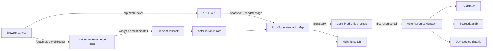
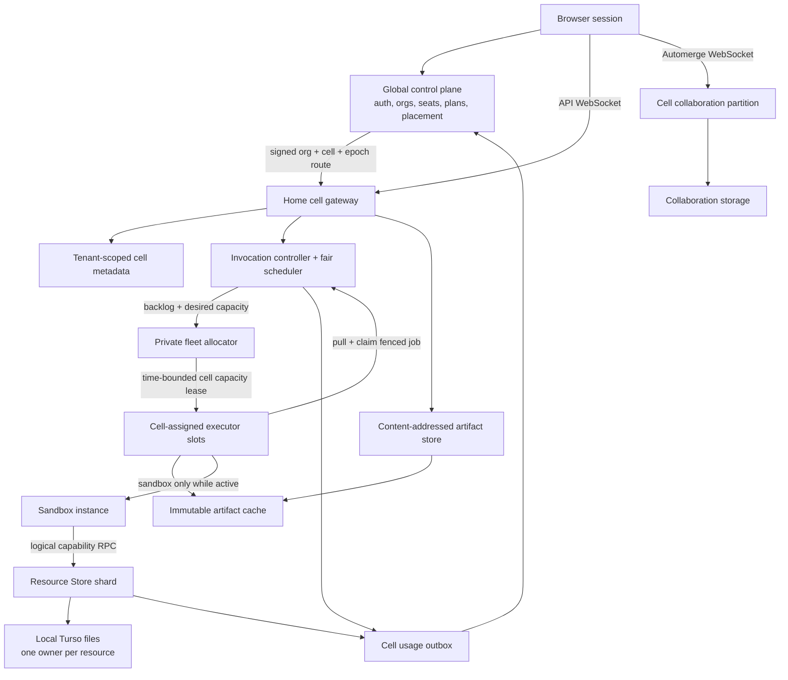
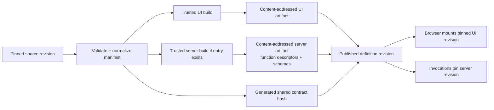
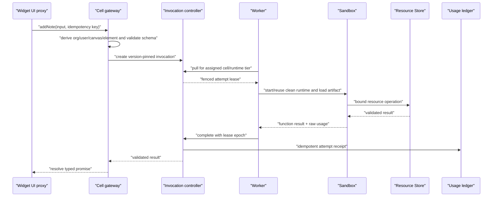
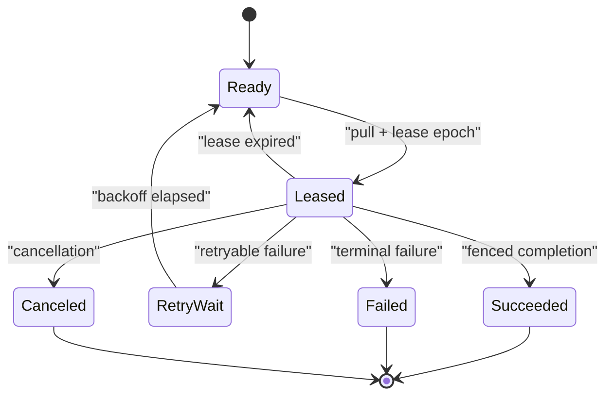
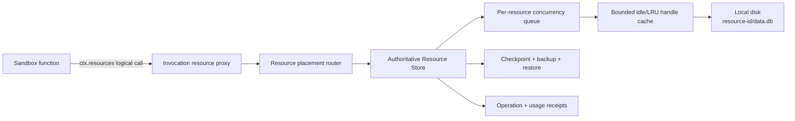
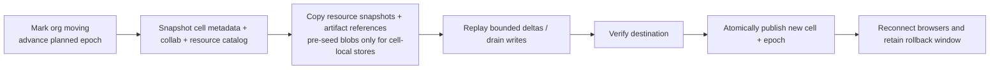
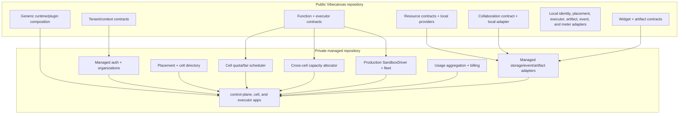

# Managed multi-tenant Vibecanvas architecture

**Status:** proposed goal architecture

**Date:** 2026-07-21

**Scope:** a self-hosted managed Vibecanvas service with organizations, seat billing, low idle cost, browser-only widgets, metered server functions, file-backed resources, and a clean open-source/private boundary

## Executive recommendation

Do not scale the current actor topology. Replace the default `one widget instance -> one long-lived actor -> one Bun child process` path with two explicit widget tiers:

1. **Browser-only:** UI code and optional collaborative CRDT state. It has no server artifact and zero incremental idle compute.
2. **Server function:** short, typed, on-demand work. Cell-assigned executor capacity starts or leases a sandbox only for an invocation, then destroys or safely recycles it.

All members of an organization should resolve to the same **home cell**, but they do not need to share one process and server functions do not need tenant affinity. A cell is a logical data-locality and failure boundary. Initially, one cell can be deployed as one VPS containing its gateway, Automerge authority, cell metadata store, scheduler, and resource store. Later, those services can split without changing the public contracts.

The central control plane should hold only identity, organizations, memberships, subscriptions, quotas, cell placement, runtime/build policy, and billing rollups. Customer canvases, widget definitions and artifact references, collaboration data, resource catalogs, invocation records, and file resources belong to the organization's cell. Every customer-owned row, event topic, filesystem root, cache key, and in-memory map must be scoped by `org_id`.

File-backed Turso resources should remain on local storage under a single authoritative Resource Store process. Sandboxes receive logical resource capabilities and call that store through a private protocol hidden by `ctx.resources`. Do not mount live database files into sandboxes, do not use NFS to simulate locality, and do not make experimental multi-process WAL the distributed-storage design.

The open-source repository should own stable contracts and local adapters. A private managed repository should compose those contracts with organization auth, placement, quota scheduling, billing, fleet control, and the production sandbox driver. Avoid scattered `if (managed)` branches.

This target is implemented as a **clean OSS rewrite**, not as an in-place upgrade of the actor-era database. A rewritten installation starts with a new data root and a fresh, tenant-strict `main.db`; existing local database compatibility and actor-era data import are not requirements. Schema migration infrastructure still begins at `000-initial.sql` and remains mandatory for every schema change after that baseline.

### The one-sentence architecture

> Route each organization to a tenant-scoped cell, keep collaboration and file ownership in that cell, and execute immutable server-function bundles only while work is active in a shared, fairly scheduled sandbox fleet.

## Decisions at a glance

| Question | Decision |
| --- | --- |
| What is the billing boundary? | Organization membership is the seat boundary; organization usage is the compute/storage boundary. |
| What is the placement boundary? | The organization has one home cell and a placement epoch. |
| Must all org users be on one server? | They must resolve to one logical cell. They do not need one OS process, and compute workers may be elsewhere. |
| Is organization count a capacity unit? | No. Place by dominant measured load with headroom, not by a fixed 100/1,000-org count. |
| Does every widget have a backend? | No. `ui` is required; `server` and collaborative state are optional. |
| What replaces actor messages? | Build-generated, typed server-function imports. Transport exists internally but is not authored by widget code. |
| What replaces actor in-memory context? | Local browser state, optional per-instance Automerge state, or transactional resources, depending on semantics. |
| What stays resident? | Shared cell services, connected WebSockets, active collaboration documents, a bounded resource-handle cache, worker daemons, and an optional small warm sandbox pool. |
| What scales to zero? | UI-only widgets, inactive function definitions, and ordinary inactive widget instances. |
| Where do Turso files live? | On local disk owned by one Resource Store shard. Workers never select or open physical paths. |
| How are writes coordinated? | Per-resource owner queue first; MVCC only for measured hot resources with bounded conflict retries. |
| What remains open source? | Widget/function/artifact/tenant/resource/executor contracts and usable local adapters. |
| What remains private? | Managed auth, organizations/billing, placement, fair scheduling policy, metering aggregation, fleet management, and production infrastructure composition. |
| What happens to old local databases? | They are not upgraded. The rewrite starts from an empty `~/.vibecanvas/` data root and a new `main.db`. |
| How are public APIs packaged? | One `@vibecanvas/api` package with domain subpaths; services remain separate capabilities. |
| Is the canvas renderer rewritten? | No. The new widget host is placed behind the existing canvas rendering boundary. |
| Should Trigger.dev or Resonate be embedded now? | No. Borrow queue, lease, versioning, and metering patterns for short functions. Durable workflows are outside the initial system; a future private managed extension may evaluate a Resonate adapter. |
| Should Microsandbox be adopted directly? | Prototype it behind a replaceable `SandboxDriver`; it is promising but beta and requires KVM-capable hosts. |

## Goals and non-goals

### Goals

- Preserve the visual canvas, direct widget placement, fullscreen/window behavior, collaborative editing, AI authoring, revision-pinned Preview, publishing, and resource workspaces documented in the [screen atlas](./screens/SCREENS.md).
- Support organizations with multiple users and organization-qualified ownership everywhere.
- Make the idle backend cost of a UI-only widget and an unused server-function definition effectively zero.
- Bound memory independently of total widget/resource count.
- Give widget authors a single source tree and ordinary typed function calls, without actor-message or HTTP-handler authoring.
- Meter compute at the invocation boundary and enforce plan, organization, function, and resource concurrency limits.
- Keep file-backed databases cheap while permitting compute and storage to run on different hosts.
- Retain a functional local OSS product and keep managed-only behavior outside the public repository.
- Start the rewritten OSS storage model from one strict Turso baseline rather than preserving actor-era database data.
- Preserve the canvas renderer and interaction behavior while replacing the widget/backend boundary behind it.

### Non-goals

- A complete hostile-code threat model. The topology retains explicit sandbox and capability boundaries, but sandbox-hardening details are a separate task.
- Active-active mutation of the same local Turso file across hosts.
- Exactly-once execution of arbitrary external effects. The platform supplies idempotency tools and fenced ownership, not an impossible guarantee.
- A mobile architecture. The current screen atlas is desktop-oriented.
- A fixed organizations-per-VPS promise before representative load tests exist.
- Compatibility migration, backfill, or automatic import of the actor-era OSS database and XDG directory layout.
- A rewrite of Konva geometry, camera, selection, movement, resizing, stacking, grouping, fullscreen, DOM portals, or collaborative visual behavior.

## Current baseline and cost diagnosis

### Current end-to-end flow



The browser-side sandbox is not the main managed-service cost. The expensive coupling is on the server:

- A placed widget with an actor definition is observed by the Automerge callback, which creates an actor immediately and patches its ID back into the CRDT ([setup-services.ts](../../apps/cli/src/setup-services.ts#L60-L96)).
- `ActorSupervisor.createInstance` inserts the instance and immediately loads it ([ActorSupervisor.ts](../../packages/service-actor/src/ActorSupervisor.ts#L549-L572)).
- Loading constructs an `Actor`, retains it in `actorMap`, calls `start`, and waits for readiness ([ActorSupervisor.ts](../../packages/service-actor/src/ActorSupervisor.ts#L340-L369)).
- `Actor.start()` calls `Bun.spawn`, so every running actor owns a long-lived child process ([Actor.ts](../../packages/service-actor/src/Actor.ts#L188-L223)).
- Startup enumerates persisted instances and reloads every eligible actor, making restart and steady-state memory grow with total running widgets ([ActorSupervisor.ts](../../packages/service-actor/src/ActorSupervisor.ts#L213-L220)).
- Draft Preview constructs another ephemeral actor process, so authoring adds the same kind of memory pressure.

The resulting first-order memory model is:

```text
current server memory ~= shared services + running widget instances * child-process memory
```

That is the wrong scaling axis for a product in which many widgets are inactive most of the time.

### Tenancy is absent below the proxy layer

Adding an organization router in front of the current server is insufficient. The present process is effectively the tenant boundary:

| Surface | Current state | Managed consequence |
| --- | --- | --- |
| Request context | Optional account identity, no mandatory `orgId`, `cellId`, or placement epoch | A caller or proxy cannot safely scope lower-level lookups. |
| Canvas | Global IDs/names and a direct canvas-member relation | Ownership and uniqueness are not organization-qualified. |
| Widget definitions | Global definition name and slug | Customers collide in catalogs and publication. |
| Actor lookup | Instance or element ID without organization scope | Cross-tenant ambiguity becomes possible. |
| Resources/bindings | Global resource catalog and definition-slot binding | Names and bindings collide across organizations. |
| Automerge storage | One key-only `automerge_repo_data` keyspace | Documents have no stored tenant namespace. |
| Event streams | Process-global actor/agent topics | Every subscriber can receive work that must then be filtered. |
| Agent workspace | One process-global draft/workspace tree | Names, mounts, sessions, approvals, and previews are not org-rooted. |
| Browser persistence | One local persisted-document key | Switching organizations can mix local document references. |

The current model types show canvases, actor instances, definitions, resources, and bindings without `org_id` ([model.ts](../../packages/service-db/src/model.ts#L98-L186)). The replacement schema and services must redesign every customer-owned entity and lookup, not merely the top-level authentication table.

### Costs that should remain shared and bounded

| Cost | Required? | Target behavior |
| --- | --- | --- |
| Cell gateway and WebSocket server | Yes | Shared by many organizations; one or two browser-session sockets, never one per widget. |
| Automerge authority | Yes | Shared per collaboration partition, tenant-scoped, lazy, and bounded by active documents rather than all documents. |
| Durable collaboration storage | Yes | Separate write workload from widget execution; compact/checkpoint and back up. |
| Cell metadata store | Yes | One multi-tenant store per cell initially; all rows require `org_id`. |
| Artifact bytes | Yes | Content-addressed on disk/object storage; no resident VM required. |
| Resource database files | Yes | File bytes are cheap; open handles are bounded and idle handles evicted. |
| Worker supervisor | Yes | Small shared daemon; no customer code resident by default. |
| Sandbox | Only while active or deliberately warm | Pooled by runtime/bundle revision, not by widget or organization. |

### Existing seams worth keeping

- [`packages/runtime`](../../packages/runtime) already separates generic services, plugins, lifecycle, and composition. This is the correct public/private injection seam.
- The canvas extension system and widget host can keep geometry, selection, window/fullscreen behavior, and sandbox mounting while receiving a different backend bridge.
- `IActorResourceProvider` already separates logical capability calls from physical provider implementations. Extract and generalize it rather than discarding it.
- KV and secret stores already use bounded handle caching; the database provider needs the same policy.
- Resource bindings already prevent guest code from choosing physical database paths or resource IDs. Preserve that property for functions.
- Automerge is already a shared service rather than one CRDT process per widget. Its tenant, lifecycle, and storage boundaries need work, but the product model is sound.
- Immutable artifact and UI-runtime experiments remain useful implementation evidence, but this architecture fixes the product contract independently: required `ui`, optional `server`, and no required actor half.

### Implementation precedence

The new manifest has required `ui`, optional `server`, and no required `actor`. Actors are an optional source/runtime compatibility adapter while the rewrite is built; they are not a second shape of the new manifest and the new database has no obligation to import actor-era rows.

The source snapshot, artifact envelope, revision model, optional server artifact, and local function path are independent of the browser UI engine. Capsule or any other UI runtime must remain behind an adapter and pass browser-semantics, interruption, and teardown tests before becoming the sole production path. Rejecting a UI engine changes the adapter, not the manifest or server-function architecture.

## Product invariants through the rewrite

The backend model may change radically without changing the canvas feel:

| Current user experience | Rewrite invariant |
| --- | --- |
| Drag or keyboard-add a published/draft widget onto the canvas | Placement still creates a CRDT element immediately. It must not synchronously provision a resident backend. |
| Collaborators see element placement and movement | The canvas Automerge document remains authoritative for layout and instance metadata. |
| Widget UI runs inside the canvas and can enter fullscreen | The browser widget host/portal remains stable and runtime-neutral. |
| AI Chat creates, validates, previews, and publishes a widget | The authoring flow builds immutable UI and optional server artifacts from one pinned source revision. |
| Preview is revision-pinned and independently owned | Preview pins artifacts and temporary bindings, but only invokes server compute when used. |
| Resource overview/schema/data/SQL workspaces exist | Resource UX remains; calls route to the resource owner. |
| Widget inspector shows files/config/runtime information | Replace default Messages/States tabs with Functions, Collaborative State, Runs, Logs, and Resources; show Messages/States only for legacy actors. |
| Actor errors appear in-frame | Function, build, state-sync, and resource errors use the same in-frame host error surface. |

## Target architecture

### Design principles

1. **Separate data locality from compute locality.** An organization has a home cell; a function uses any compatible worker unless a resource-affinity optimization applies.
2. **No resident object per inactive widget.** Definition metadata and CRDT references are durable data, not running processes.
3. **One owner per mutable file.** Virtualize the resource API, not a distributed POSIX filesystem.
4. **Typed source-level simplicity, explicit runtime envelopes.** Authors call a function; the platform still records identity, version, limits, idempotency, and usage.
5. **Immutable revisions everywhere.** UI mounts, function invocations, and retries pin artifact revisions.
6. **At-least-once is explicit.** Leases, fencing, and idempotency replace assumptions about a live actor process.
7. **Bound every cache and queue.** WebSockets, active documents, open databases, output bytes, logs, warm sandboxes, and retries all have ceilings.
8. **Keep local and managed as adapter sets.** The same public contracts compose into one-process OSS and multi-service managed deployments.
9. **Use simple functions for policy.** Routing, admission, quota, placement scoring, retry decisions, and billing classification should be pure functions; database, network, sandbox, and clock effects stay at adapters.

### Overall topology



The diagram shows logical boundaries. An inexpensive first deployment can colocate `CG`, `CO`, `CM`, `IC`, `RS`, and one worker daemon on the same VPS. The contracts must still be remote-capable so hot services can move independently later.

### What a cell is—and is not

A **cell is a logical deployment, data-locality, capacity, and failure boundary for a group of organizations**. It is not a database table and it is not inherently a VM.

- The control-plane Turso database has a `cells` table describing deployed cells: `cell_id`, endpoints, health/capacity class, and lifecycle state.
- `organization_placements` maps each organization to one `cell_id` plus a fencing epoch.
- The cell itself is the running service composition identified by that row: gateway, collaboration authority, invocation controller, and access to its Resource Store.
- The cell owns one multi-tenant `main.db` Turso database containing its organizations' cell metadata. That database belongs to the cell; it is not the definition of the cell.
- For the first managed release, map one cell to one VPS/VM. This gives a simple operational rule: one cell process group, one local `main.db`, one local collaboration authority, and one local Resource Store owner.
- Later, a hot cell may span multiple processes or machines—such as separate gateway, collaboration partitions, and storage hosts—while retaining the same `cell_id`, placement epoch, and ownership rules.

Consequently, “all users in an organization use the same cell” means they share one logical data/collaboration home. It does not mean they share one OS process, one function worker, or permanently reserved compute.

### How the supplied sketch changes

| Sketch element | Keep/change | Target interpretation |
| --- | --- | --- |
| Central control plane and DB | Keep | Global identity, organizations, seats, plans, placement, and usage rollups only. |
| “Multi-tenant server” | Rename/refine | A home cell: the organization's data/collaboration boundary, not a box that owns permanent widget workers. |
| One application database per server | Keep, rename, and rebuild | A tenant-aware single-owner Turso `main.db` with mandatory `org_id`; split collaboration I/O only when measured. |
| “100 orgs” label | Remove as an invariant | Use measured dominant-resource placement and headroom. A cohort count is only an operational rollout limit. |
| Worker boxes under each server | Decouple | Pull-based shared executor hosts whose slots are time-bound to one cell scheduler. Workers may be colocated initially but are never pinned to an org or widget. |
| Resource DBs beside workers | Move ownership | Files belong to a Resource Store shard on local disk; workers receive logical RPC capabilities. |
| Browser socket directly to a shard | Add route token | Control plane resolves the org's cell; the browser then keeps shared API/Automerge connections to that cell. |

The key correction is to shard persistent authority while pooling ephemeral compute.

### Plane responsibilities

| Plane | Owns | Must not own |
| --- | --- | --- |
| Global control plane | Users, organizations, memberships, seat counts, subscriptions, plan policy, cell directory, placement epochs, runtime/build policy, usage rollups, invoices | Canvas/CRDT payloads, customer artifact references, open resource files, live sandboxes, per-call synchronous data paths |
| Cell gateway | Authenticated tenant context, API routing, WebSocket sessions, canvas/widget/resource catalog APIs | Physical resource paths, sandbox lifecycle details, billing calculation policy |
| Collaboration | Document routing, Automerge protocol, active handles, persistence, compaction, presence | Widget server execution and resource writes triggered merely by element presence |
| Invocation controller | Validation, durable job state, organization-fair admission inside one cell, leases, retries, cancellation, version pinning, result retention | Executing guest code, allocating capacity between cells, or opening customer database files |
| Fleet allocator | Coarse assignment of executor slots/memory tiers to cells from backlog, reservations, and host headroom | Per-organization queue order, invocation state, guest execution, or the synchronous result path |
| Compute executor | Pull jobs only from its currently assigned cell, artifact fetch/cache, sandbox lifecycle, resource proxy, limits, output capture, raw usage measurement | Tenant placement policy, permanent function state, authoritative resource storage |
| Resource Store | Resource placement, bounded handle cache, per-resource concurrency, schemas, backups, file lifecycle, operation receipts | Browser authorization policy, widget source, arbitrary worker-selected paths |
| Artifact store | Immutable UI/server blob bytes, integrity verification, physical deduplication, retention marks, and bounded delivery | Customer authorization by a bare hash, mutable drafts, live sessions, runtime state |
| Usage pipeline | Idempotent receipts, aggregation, reconciliation, plan enforcement inputs | High-cardinality billing truth derived only from telemetry samples |

### Concrete self-hosted VPS layouts

| Stage | Deployment | Why |
| --- | --- | --- |
| Private beta | One VPS runs control plane, one cell, Resource Store, and worker daemon; external/off-host backups | Lowest fixed cost while the logical interfaces and separate data directories preserve future split points. |
| Early production | Small control-plane VPS with `control-plane.turso` plus one or more cell VPSs with local `main.db`; executors colocated with cells when capacity permits | A cell failure does not take down login/billing for every customer, and organizations can be placed by load. |
| Growth | Redundant control plane, many cells/collaboration partitions, shared executor hosts, resource owners on storage-optimized VPSs | Compute and storage scale independently; idle organizations still consume only their share of cell base cost. |
| Higher availability | Active-passive or replicated service adapters, remote artifact/backup storage, automated cell restore/move | Added only when revenue/SLOs justify the fixed memory and operational cost. |

Do not introduce Kubernetes solely to run the first cells. Systemd or a small container supervisor on fixed VPSs is adequate while placement is coarse. The service contracts, health reporting, leases, and immutable artifacts should be Kubernetes-compatible later without requiring it now.

All primary managed metadata databases use Turso with one authoritative owner:

| Database | Location and owner | Contents |
| --- | --- | --- |
| `control-plane.turso` | Local disk on the control-plane VPS; opened by the control-plane database service | Accounts, organizations, memberships, plans, cell directory, placements, usage rollups, and billing state |
| `main.db` | One local Turso file per OSS installation or managed cell, opened by that cell's database service | Canvases, ACLs, widget revisions, collaboration directory/chunks initially, resource catalog, invocation state, events, and usage outbox for organizations assigned to the cell |
| `data.db` per resource | Local disk on the authoritative Resource Store shard | Customer KV/DB/secret-backed resource data |

Do not open any of these writable files from several hosts or place them on a network filesystem. Availability comes from backups, restore/move tooling, fencing, and later Turso-compatible replication experiments—not by swapping database engines.

### OSS data root

The rewritten OSS application removes XDG-path branching and owns one explicit root:

```text
~/.vibecanvas/
  main.db
  config.json
  organizations/
    <org-id>/
      agent/
      artifacts/
      resources/
        <resource-id>/
          data.db
      temp/
      pty/
  cache/
  logs/
```

The runtime resolves the user home directory; application code never expands `~` itself. Tests, containers, and managed services pass an explicit root through `--data-dir <path>` or `VIBECANVAS_HOME=<path>`. Managed processes must always use explicit mounted volume paths and must not depend on a service account's home directory.

### Organization and cell placement

The organization is the unit of policy, billing, migration, backup selection, and default data locality. A user may belong to multiple organizations; a canvas belongs to exactly one organization.

The placement directory should store at least:

```text
org_id
cell_id
placement_epoch
status: provisioning | active | moving | suspended
read_endpoint
write_endpoint
updated_at
```

The browser obtains a signed session containing the organization, account, home cell, policy version, and placement epoch. The cell derives tenant context from that session; API inputs never supply authoritative `org_id`. During a move, the epoch fences stale sessions and resource routes.

All organization members use the same home cell for collaboration and cell-owned metadata. The cell may contain several processes. Physical executor hosts can serve several cells, but each executor slot is leased to exactly one cell scheduling domain at a time and pulls only that cell's jobs. This keeps organization fairness and invocation ownership authoritative in the cell while letting the private fleet allocator move idle capacity between cells without a global per-invocation broker.

### Why fixed organization counts are the wrong shard rule

Ten inactive one-person organizations can cost less than one organization with hundreds of live sockets, hot CRDT documents, and database writes. Use a dominant-resource load score:

```text
L_cell = max(
  connected_sessions / session_capacity,
  active_documents / document_capacity,
  collaboration_ops_per_second / collaboration_capacity,
  metadata_iops / metadata_capacity,
  open_resource_handles / handle_capacity,
  resource_iops / resource_capacity,
  stored_bytes / disk_capacity
)
```

Place an organization only when its projected data/collaboration load keeps the cell below a measured soft threshold and enough failure/rebalance headroom remains. A large organization can receive a dedicated cell without changing its programming model. “100 organizations” may be a rollout cohort size; it is not an architectural capacity guarantee.

Compute has a separate pool score because it is movable capacity rather than organization placement state:

```text
L_executor_pool = max(
  assigned_memory / host_memory_capacity,
  active_memory / assigned_memory,
  runnable_queue_age / queue_age_slo,
  cold_start_rate / image_cache_capacity
)
```

The cell scheduler provides fair ordering among its organizations. The fleet allocator changes a cell's slot/memory reservation at coarse intervals and enforces host headroom; it does not choose which organization's invocation runs next. In the one-VPS deployment the assignment is static and local. At growth stage, the same worker host can hold capacity leases for multiple cells without merging their queues or authority.

## Widget programming model

### Two tiers, one source tree

| Tier | Authored surface | Durable state | Idle server memory | Use for |
| --- | --- | --- | --- | --- |
| Browser-only | `ui/` | Browser-local state and/or Automerge state | None per widget | Calculators, visualizations, collaborative notes, controls, read-only views |
| Server function | `ui/` + `server/` | Bound KV/DB/secret resources | None per definition or instance | Queries, mutations, secret-backed APIs, bounded CPU work |

These tiers are capabilities, not separate products. A widget can begin browser-only and add one server function later without becoming a permanently running actor. Server functions are deliberately short and bounded; timers, sleeps, human waits, schedules, and durable multi-step orchestration are unsupported in the initial system.

### AI authoring is a separate active workload

AI Chat, draft validation, and builds must be organization-scoped, but they should not determine published widget runtime cost. Move process-global chat/preview/approval maps and the shared workspace tree behind tenant-aware session, workspace, preview, and artifact stores. An AI session or build may use its own metered worker/sandbox class and can be evicted when inactive. Publishing produces immutable UI/server artifacts; it never leaves an authoring process attached to the widget.

### Source layout and convention

Use one widget package but retain a hard build boundary so secrets and server dependencies cannot enter the browser bundle:

```text
vibecanvas.json
package.json
lockfile
ui/
  main.tsx
  styles.css
server/                    # optional
  index.ts                 # explicit server build entry
  notes.server.ts
shared/                    # schema/types safe for both targets
  notes.schema.ts
```

Recommended convention:

- `ui.entry` is required.
- `server.entry` is optional. If absent, the build emits no server artifact and the runtime creates no backend instance.
- Server modules use `*.server.ts`; only exports reachable from the explicit server entry are deployable.
- The trusted builder replaces UI imports of server-function exports with typed client proxies.
- Shared files must be side-effect-free and safe in both targets.
- Resource slots are logical names. Publication binds them to organization-owned resources.
- Function effects and limits are declared in metadata generated from the server export.

This architecture fixes the manifest direction: `ui` remains required, `actor` is not part of the new shape, and `server` is optional. The current actor manifest is understood only by the isolated legacy compatibility runtime while the new source/runtime path is implemented; the clean database baseline does not import old actor definitions.

### Author experience

The intended API below is illustrative; exact names should be finalized with the manifest task.

```ts
// server/notes.server.ts
import { defineServerFunction } from "@vibecanvas/sdk/server"
import { z } from "zod"

const AddNoteInput = z.object({
  text: z.string().min(1).max(10_000),
})

const Note = z.object({
  id: z.string(),
  text: z.string(),
})

export const addNote = defineServerFunction({
  input: AddNoteInput,
  output: Note,
  resources: { notes: "write" },
  limits: { timeoutMs: 2_000, memoryMiB: 128 },
  retry: "idempotent",
}, async (ctx, input) => {
  const note = { id: ctx.invocationId, text: input.text }
  await ctx.resources.db("notes").execute(
    "INSERT INTO notes (id, text) VALUES (:id, :text)",
    note,
  )
  return note
})
```

```ts
// ui/main.tsx
import { addNote } from "../server/notes.server"

const note = await addNote({ text: "Hello" })
```

Widget code authors do not create an HTTP route, construct an actor message, select a worker, or name a physical resource. The client proxy still uses a real transport internally; remote execution cannot avoid one. The product simplification is that transport, identity, validation, versioning, retry, and resource-routing mechanics are generated and host-controlled.

For manifest v1, contract discovery is deliberately constrained:

1. Server functions are direct named exports from modules reachable from the explicit `server.entry`; the build rejects computed export names, function re-exports, unresolved/dynamic imports, and guest-selected build plugins.
2. A trusted transform bundles the server target, then loads it only inside the no-network, resource-limited build sandbox with a registration-only SDK to emit serializable function descriptors and runtime schemas. Untrusted top-level module code is never evaluated in the control-plane or cell process. Top-level side effects are unsupported and rejected where statically detectable; the sandbox contains the remaining evaluation risk.
3. The builder signs/hashes the descriptor list, schemas, export-to-entry mapping, runtime ABI, and implementation artifact as one contract. Publication validates that descriptor and artifact hashes agree.
4. During the UI build, an import such as `../server/notes.server` is resolved to a generated virtual client module containing only typed proxies for the discovered exports. Any attempt to import a non-function value from a server module fails the build, so server code and dependencies cannot enter the UI artifact.

Runtime input/output validation uses the emitted schemas. Generated TypeScript types improve authoring, but types alone are never treated as runtime schemas.

The injected server context is the bounded runtime facade:

| Context surface | Purpose |
| --- | --- |
| `ctx.identity` | Derived organization/account/role snapshot; never caller-authored authority |
| `ctx.invocationId`, revision, attempt, deadline, signal | Idempotency, logging, cancellation, and deterministic diagnostics |
| `ctx.canvas` / widget instance reference | Read-only scoped identity and approved canvas operations |
| `ctx.resources` | Only the logical slots/effects declared by the function and bound at publication |
| `ctx.events` | Invocation/canvas/org-scoped progress or invalidation, with output limits |
| `ctx.log` / `ctx.metrics` | Structured, attributed output through bounded host sinks |

Do not inject the raw service registry, physical database objects, unrestricted filesystem, or billing internals. A narrow facade keeps local and managed adapters interchangeable and makes limits/metering observable at one boundary.

### Build and publication boundary



A published revision should record:

```text
definition_revision
normalized_manifest_hash
ui_artifact_hash
server_artifact_hash?          # absent for browser-only
function_contract_hash?
builder/toolchain_identity
runtime_abi
resource_requirements
activation_status
rollback_metadata
```

Publication never mutates an artifact. Existing UI mounts and in-flight invocations remain pinned until an explicit remount/new call policy advances them. Retries use the original server revision. Artifact retention cannot delete a revision while any invocation, preview, or rollback pointer references it.

### Artifact ownership, authorization, and garbage collection

Separate logical ownership from physical bytes:

| Layer | Owner and rule |
| --- | --- |
| Definition revision and artifact reference | Organization-owned cell metadata. It records purpose, hash, contract, publication state, and retention pins. |
| Immutable blob bytes | A shared content-addressed Artifact Store may physically deduplicate identical bytes across organizations. The digest is an integrity/address key, never an authorization credential. |
| Read authority | The cell issues a short-lived, purpose-bound capability containing organization, definition revision, artifact hash, artifact kind, audience, expiry, and nonce. Browser CDN URLs and executor fetches derive from that capability. |
| Worker/browser cache | Non-authoritative, hash-verified, size-bounded LRU. Cache presence never proves tenant access. |
| Retention | A revision is live while referenced by publication, a mounted/pinned instance, invocation, preview, rollback window, or explicit legal/backup hold. |

Garbage collection is mark-and-sweep from tenant-scoped references into the physical blob catalog, followed by a tombstone/grace period and a second reference check before deletion. Cross-tenant deduplication means deleting org A's last reference does not delete bytes still referenced by org B, while neither organization can discover or fetch the other's reference by presenting the hash. The managed blob service owns physical reference reconciliation; the global control plane does not become the customer artifact catalog.

An organization move always copies the definition/revision/reference rows. If source and destination cells use the same shared Artifact Store, no blob copy is required. If an OSS or regional deployment uses cell-local blob stores, the move pre-seeds only the referenced hashes through authorized service credentials, verifies them, and then switches the placement epoch.

### State ownership after actors

Actor context currently mixes several state categories. Split them by semantics:

| State | Owner | Server compute required? | Notes |
| --- | --- | --- | --- |
| Canvas geometry, grouping, widget identity, revision pin | Canvas Automerge document | No | Preserve current canvas authority. |
| Ephemeral UI state | Browser sandbox memory | No | Hover, selection inside widget, open panels, transient input. |
| Device-local preferences/cache | IndexedDB/local storage through a bounded host capability | No | Namespaced by org, widget definition, and instance. |
| Collaborative widget state | Separate per-instance Automerge document | No | Optional, schema/size/rate limited, referenced by the canvas element. |
| Transactional application data | Bound KV or database resource | Only when called | Accessed through server functions; no in-memory function state. |
| Secrets and external credentials | Bound secret resource | Only when called | Never delivered to the UI artifact. |
| Legacy state-machine context | Legacy actor adapter | Yes under old runtime | Migrate or keep as a billed compatibility tier. |

A separate collaborative-state document is preferable to putting arbitrary widget data inside the canvas document. It keeps layout changes small, permits independent lifecycle/quotas, and allows a hot widget state to be partitioned separately. The canvas element stores only a stable state-document reference.

## Collaboration and browser connections

### Keep the shared CRDT service, remove backend provisioning side effects

The current Automerge service is already shared, but it couples element creation to actor creation. In the target architecture:

```text
widget element created in CRDT
  -> persist element and artifact/state references
  -> render immediately in every browser
  -> do not create a process
  -> invoke compute only if UI later calls a server function
```

Legacy actor elements may enqueue one idempotent compatibility-provisioning job. New widgets have no provisioning job.

### Connection model

- One API WebSocket and one Automerge WebSocket per browser session are acceptable. They terminate on the same cell gateway/route and are shared across every widget on that page.
- Do not introduce a WebSocket per widget or per server function.
- Protocol multiplexing can be evaluated later, but it does not address the principal memory cost and should not block the rewrite.
- The Automerge upgrade authenticates the organization and resolves each document through a tenant-aware document directory. Possession of an Automerge URL alone is not routing authority.
- Browser IndexedDB and persisted document-reference keys must include the organization and deployment origin.
- Event topics are scoped by organization plus canvas/session/invocation; there is no process-global actor stream.

### Collaboration partitions

Do **not** run one Automerge server per organization. The first deployment runs one multi-tenant Automerge service per cell, serving every organization placed in that cell. Every document, connection, storage key, cache entry, and callback carries `org_id`, but the process and WebSocket listener are shared.

When one collaboration process reaches its measured active-document, peer, memory, or change-rate limit, a cell can add collaboration partitions. A partition owns a bounded subset of documents and WebSocket peers, with a stable `(org_id, document_id) -> partition_id` directory. Partition by measured active load, not by creating an idle process for each organization. Persist Automerge chunks outside the cell's high-contention metadata tables—or in a separate cell-local Turso file later—so collaboration writes cannot starve API/invocation state.

The target lifecycle is:

1. Load a document on first connection or API access.
2. Keep it active while peers, unflushed changes, or lifecycle hooks exist.
3. Flush/checkpoint on a bounded cadence.
4. Detach callbacks and evict after an idle period.
5. Reload from durable storage on demand.

The current service scans known handles every second and retains watched document IDs ([AutomergeService.ts](../../packages/service-automerge/src/AutomergeService.ts#L71-L121)). Before setting capacity claims, prove that the chosen `automerge-repo` integration can detach and evict handles without losing unflushed work. If it cannot, partition process size and controlled restart become the temporary bound.

### Offline and failure behavior

Automerge's client-side IndexedDB keeps optimistic changes through transient cell failures. On reconnect, the browser reauthenticates, resolves the current placement epoch, and syncs to the current collaboration owner. A cell crash must not require any widget actor recovery; only shared document/storage services recover.

## Server-function execution plane

### Invocation sequence



Fast interactive calls can remain connected to the promise while the job is leased immediately. The durable invocation row remains the source of truth for cancellation, retry classification, result recovery, and billing. Disconnection does not imply cancellation unless the function contract says so.

### Invocation envelope

Every accepted call should derive or store:

```text
invocation_id
org_id
account_id
canvas_id?
widget_instance_id?
function_id
definition_revision
server_artifact_hash
input_hash and validated input
idempotency_key
queue_class and priority
resource_affinity hints
memory/cpu/time/output limits
retry policy and attempt limit
created_at and deadline
```

The worker receives opaque, invocation-scoped resource capabilities. It never receives authority to choose an organization, resource ID, provider, physical path, or billing identity.

### Job state and leases



Claiming work atomically assigns `worker_id`, increments `lease_epoch`, and sets `lease_expires_at`. Batched heartbeats renew the current epoch. Completion and terminal usage state reject stale epochs.

Fencing a completion is not enough to fence a data mutation. Every write-capable resource call must carry an invocation capability containing `attempt_id`, `lease_epoch`, expiry, organization/resource scope, allowed operation, and an integrity-protected nonce. Immediately before a side effect, the Resource Store validates the epoch and expiry against the cell's authoritative `InvocationLeaseAuthority`. For a transaction, it obtains a short write permit: the controller cannot advance the attempt to a new epoch while that permit is live, and expiry/cancellation aborts the transaction before commit. The permit is released with an operation receipt. A worker using an old epoch after reassignment is rejected before reaching the database.

This fencing rule and idempotency solve different problems: the lease gate stops a stale owner from starting a new platform resource mutation; an operation receipt deduplicates a valid attempt replay. Neither can provide exactly-once semantics for an external API that is outside the Resource Store, so those calls still need the provider's idempotency key or compensation.

### Fair scheduling and admission

Use a pull-based scheduler with hierarchical limits:

1. The cell's currently assigned executor-memory, slot, and CPU reservation.
2. Organization plan, budget, and weighted fair share.
3. Function/deployment concurrency and rate limit.
4. Resource concurrency key, especially the single writer lane for a file database.
5. User/session burst limits where product policy needs them.

A single FIFO is unacceptable because one organization can fill every worker. Use deficit round-robin or another auditable weighted-fair policy within priority classes. Queue age can improve priority without bypassing hard limits.

Worker pulls can include runtime ABI, memory tier, artifact revision, and resource-locality hints. A worker presents its cell-capacity lease, so it cannot claim from an unassigned cell. Warm reuse is keyed by a clean runtime image or immutable bundle revision, never by widget instance or organization. Cross-cell capacity is rebalanced by the fleet allocator; it is not implemented as several independent schedulers racing for the same anonymous slots.

### Delivery, retries, and idempotency

The platform should document **at-least-once invocation delivery**. Exactly-once external effects are not promised.

- Assign the invocation ID before execution and expose it to resource operations.
- Store one idempotency record under `(org_id, function_id, idempotency_key)` with its original `input_hash`, definition revision, contract hash, invocation ID, status, and eventual result/error reference. An exact repeat returns or follows that invocation. Reusing the key with a different input hash, revision, or contract returns deterministic `IDEMPOTENCY_CONFLICT` and does not enqueue work.
- Default automatic retries to failures known to occur before user code starts.
- Retry a post-start failure only when the function opts into an idempotent policy or an explicit retry policy.
- Bound attempts, elapsed retry time, backoff, and jitter. Never inherit an effectively infinite retry default.
- Resource writes can use `(resource_id, invocation_id, operation_id)` receipts to deduplicate known operations.
- External APIs still require an external idempotency key or compensating logic.
- Platform-caused retry attempts can be marked non-billable; user-code retries consume the plan allowance.

Idempotency records need a declared TTL and a compact tombstone retained at least through the maximum client retry and invocation-result windows. A key becomes reusable only after that policy expires; expiry is never inferred merely because the full result body was compacted.

### Initial function boundary and future managed extension

Initial server functions are short, simple, and stateless. They cannot sleep, schedule themselves, pause for human input, checkpoint, or remain active beyond their configured deadline. A use case requiring those semantics stays on the legacy actor compatibility path or is deferred.

Durable workflows are a future **managed-only** feature and are not represented in the initial widget manifest, SDK, cell tables, scheduler states, billing model, or OSS adapters. To avoid blocking that future, keep artifact kinds and managed API/plugin registration versioned rather than hard-coded to a closed enum. A future private `ManagedWorkflowProvider` can add its own API, storage, worker group, and metering adapter without changing ordinary function semantics. Resonate is the preferred first prototype because its task leasing and replay model aligns with zero-resident-memory waits, but adoption requires a separate design and load/operations evaluation.

### Sandbox lifecycle

The executor owns a replaceable `SandboxDriver` with operations equivalent to:

```text
prepare(runtime_image, artifact)
start(limits, invocation_capabilities)
execute(entry, input)
measure()
cancel(grace_period)
destroy_or_reset()
```

Microsandbox is a strong prototype candidate: it embeds local microVMs, supports CPU/memory/lifecycle controls, and claims average guest boot under 100 ms on an M1 ([repository](https://github.com/superradcompany/microsandbox)). Treat that as project-reported guest boot evidence, not an end-to-end VPS SLA. Its first run may pull an OCI image, it is beta, and Linux hosts require usable KVM ([Linux requirements](https://docs.microsandbox.dev/troubleshooting/linux)).

Operational rules:

- Pre-pull and verify runtime images.
- After an authorized fetch, cache immutable artifacts by verified hash outside the sandbox.
- Keep zero warm sandboxes at low load; introduce a small, measured pool by runtime/bundle only if cold latency harms UX.
- Enforce memory, vCPU, wall time, output bytes, process count, open files, and maximum lifetime.
- Destroy or prove a complete reset before cross-tenant reuse.
- Attribute host/sandbox crashes separately from user-code failures.
- Keep a non-Microsandbox development/test driver so the OSS runtime and non-KVM environments remain usable.

Microsandbox supplies a local sandbox runtime, not a distributed queue, scheduler, tenant model, lease system, or billing ledger. Those remain Vibecanvas services.

## Resource plane and Turso files

### Single-owner Resource Store



This generalizes the existing resource-provider seam. The server function sees a local-looking capability, but the resource store can be in the same process, reached over a Unix socket, reached through `host.microsandbox.internal`, or reached over the private network. The transport is an adapter detail.

### Must compute and the Resource Store share a server?

No. The **Resource Store process and its writable Turso files must share the same local-storage authority**, but the sandbox executing a widget server function does not have to run on that server.

- Initial low-cost deployment: colocate the cell, Resource Store, and executor daemon on one VPS. Calls use an in-process adapter, Unix socket, or host-local private address.
- Scaled deployment: keep resource files on a storage-oriented VPS and let cell-assigned executors run elsewhere. `ctx.resources` makes a private RPC to the authoritative shard.
- Optional optimization: the scheduler may prefer an executor near the resource owner for hot/data-heavy functions, but this is latency affinity, not ownership.
- Never solve remote compute by mounting the resource file into the sandbox or copying it per invocation. The function receives logical capabilities, not a path.

Thus co-location is a deployment optimization. Single ownership of each writable database file is the invariant.

### Why not expose the database file

Turso's official multi-process access remains experimental. It uses a memory-mapped `.tshm` coordinator, permits only one writer at a time, and requires a local filesystem with correct POSIX locks and mmap semantics. NFS, CIFS/SMB, CephFS, 9p, Lustre, and several other distributed filesystems are explicitly rejected ([multi-process access](https://docs.turso.tech/sql-reference/multiprocess-access)).

Therefore:

- Do not bind-mount a live writable file into several sandboxes.
- Do not place live files on NFS to make remote workers look local.
- Do not rely on every worker process opening the same file with `multiprocess_wal`.
- Keep one resource owner and send operations to it.
- Co-locate a worker with the resource owner only as an optimization, not an authority change.

If a use case truly requires a raw file, grant an exclusive lease, close the authoritative handle, expose a copy or exclusively mounted file, and reconcile it through a controlled import. This is a compatibility exception, not the server-function resource API.

### Concurrency model

The existing `DbResource` already serializes writes per resource with a promise tail, but its open-handle map has no maximum ([DbResource.ts](../../packages/service-actor/src/resources/DbResource.ts#L509-L525), [write serialization](../../packages/service-actor/src/resources/DbResource.ts#L2006-L2012)). The KV/secret store's bounded LRU is the better density pattern.

For the first managed version:

- Keep WAL, `busy_timeout`, and durable synchronization.
- Permit concurrent bounded reads through the owner.
- Validate every invocation mutation through the authoritative attempt epoch/write-permit gate; administrative schema/restore operations use a separate fenced resource-lifecycle epoch.
- Serialize writes per resource after that gate and record an idempotent operation receipt.
- Add maximum open DB handles, idle expiry, safe drain, and LRU eviction to every provider.
- Put a per-resource queue-depth/latency ceiling in admission control.
- Keep schema apply/restore as a lifecycle operation that blocks new calls, drains inflight work, checkpoints, backs up, applies, verifies, and resumes.

Turso documents default single-writer behavior. MVCC plus `BEGIN CONCURRENT` permits concurrent connections to write non-conflicting rows, with application retries on conflict ([concurrent writes](https://docs.turso.tech/tursodb/concurrent-writes)). Evaluate MVCC only for demonstrated hot resources inside one owner process. Multi-process WAL and MVCC cannot be combined, so they are not additive escape hatches.

### Placement and movement

Resource placement is independent of organization-cell and compute placement, although the default is to colocate an organization's resources with its home cell. Store `resource_home`, `resource_epoch`, and lifecycle status in the catalog.

A move follows:

1. Mark the resource moving and reject/newly queue writes.
2. Drain inflight operations and close handles.
3. Checkpoint WAL and create a verified snapshot.
4. Copy database, required sidecars, metadata, and encryption-key linkage through a controlled channel.
5. Open and verify at the destination.
6. Atomically advance `resource_home` and `resource_epoch`.
7. Resume calls and retain a rollback snapshot for a bounded window.

Stale routes fail on epoch rather than silently writing the old copy.

## Metering, quotas, and billing

### Bill at the invocation boundary

Microsandbox metrics and Prometheus/OTLP telemetry are useful for operations but are not sufficient invoice truth. Sampling can drop, counters can reset, and high-cardinality labels are unsuitable. Persist one idempotent attempt receipt before or with terminal state:

```text
attempt_id                      # unique billing id
invocation_id
org_id
account_id
function_id
definition_revision
sandbox_driver and memory_tier
queued_at, started_at, finished_at
active_wall_ms
cpu_ns or host-accounted cpu_ms
allocated_memory_byte_ms
peak_rss_bytes
disk_read_bytes, disk_write_bytes
network_rx_bytes, network_tx_bytes
cold_start flag
outcome and failure_owner: user | platform | canceled
billable flag and policy_version
```

Write receipts to a cell-local outbox first. A private managed aggregator imports them idempotently, produces organization/day rollups, and reconciles terminal invocations against receipts. Telemetry can be eventually consistent; quota counters need a bounded-lag reservation model.

### Crash-safe attempt accounting

Usage ownership stays outside guest code and does not depend on a successful worker completion message:

1. After claiming a lease but before entering guest code, the trusted host agent sends `attempt_started(attempt_id, lease_epoch, memory_tier, host_started_at)`; the cell durably records it. If this acknowledgement fails, the guest does not start.
2. Lease heartbeats include host/cgroup-accounted cumulative CPU, active duration, memory tier, and byte counters. The controller periodically persists monotonic high-water marks. Sandbox-provided metrics are diagnostic only.
3. Normal completion atomically fences the epoch, closes the attempt, and inserts its one outbox receipt under a unique `attempt_id`.
4. If the worker or host disappears, lease expiry closes the attempt from the durable start and last heartbeat high-water marks and emits a synthetic `failure_owner=platform` receipt. The failed attempt is non-billable under the recommended policy; a retry receives a new attempt ID/epoch.
5. A reconciler finds terminal attempts without receipts and started attempts without a live lease. Its insert is idempotent, so a late worker and the recovery path cannot create two billable records.

This produces exactly one accounting record even for a crash. It does not claim precision after the last durable heartbeat; any uncertain tail is classified as platform loss rather than charged to the customer.

### Retention and compaction bounds

The first managed policy should be explicit and configurable rather than retaining every run forever. Starting defaults to validate economically are:

| Data | Starting bound | Compaction/deletion rule |
| --- | --- | --- |
| Invocation validated input and result bodies | 30 days, shorter for large payloads | Retain hashes, revision, outcome, and billing linkage after body deletion |
| Attempt state and raw usage receipts | 13 months or accounting requirement | Roll up immutable daily totals; retain adjustment/audit linkage |
| Logs and ephemeral progress | 7 days standard, 30 days paid debugging | Enforce bytes per invocation before time retention; preserve terminal error summary |
| Cell usage outbox | Until acknowledged plus 30-day safety window | Compact only after global import cursor and checksum agree |
| Idempotency records | Maximum client retry/result horizon | Compact body to conflict-detecting tombstone with input/revision/contract hashes |
| Preview artifacts and temporary bindings | Inactivity TTL plus short recovery grace | Delete only when no active preview/session pin remains |
| Published/rollback artifacts | Reference-driven, not age-only | Mark/sweep tenant references; then blob grace period and second reference check |
| Backups | Plan-specific generations and age | Verify restore before expiring the last known-good generation |

Hard byte ceilings apply before time-based retention so one invocation or organization cannot turn a nominal 30-day policy into unbounded storage.

### Recommended commercial model

The product can remain seat-priced while acknowledging that backend cost varies:

- Each paid organization membership is a seat.
- Each plan includes a monthly pool of invocation count, memory-duration, storage, egress, and collaboration allowance.
- The organization chooses hard stop, throttling, or paid overage where appropriate.
- Queue time consumes no compute allowance.
- Platform-failure retries are non-billable.
- User-code retries consume allowance.
- File storage, backups, and network egress can be separate measured dimensions.

Pure seat pricing without an allowance/cap lets one seat create unbounded function and resource cost. An included pool keeps the UI simple while protecting gross margin.

### Primary cost equation

Because memory is the stated constraint, begin with a simple, auditable measure:

```text
billable_compute = sum(active_wall_ms * allocated_memory_mib)
```

Retain CPU time and peak RSS for abuse control and later pricing changes. Do not bill only on peak RSS samples; allocation-duration is predictable and enforceable. If reliable cgroup CPU accounting is available, it can become a second billable dimension after reconciliation is proven.

### Resident-memory equations

```text
M_cell_data = M_base
            + connected_sessions * m_session
            + active_collab_docs * m_doc
            + open_resource_handles * m_handle

M_executor_pool = M_worker_daemons
                + warm_sandboxes * m_warm
                + sum(active_sandbox_memory_limits)
```

On a one-VPS deployment, physical RSS is approximately their sum; when executors split out, they are capacity-accounted separately. Inactive widget definitions and inactive server-capable widget instances do not appear in either equation. That is the architectural cost win.

## Data model and tenancy rewrite

### Storage choices

| Store | Recommended managed implementation | Reason |
| --- | --- | --- |
| Global control plane | Single-owner `control-plane.turso` | Keeps organizations, memberships, subscriptions, placement epochs, usage rollups, and billing local to the control-plane service. |
| OSS local control/cell store | New single-owner `~/.vibecanvas/main.db` | Keeps the installable product simple and starts tenant-correct rather than importing actor-era rows. |
| Managed cell metadata | One single-owner `main.db` per cell | Uses the same strict baseline, scopes every customer row by `org_id`, and lets a cell operate during a control-plane outage. |
| Collaboration chunks | Tables in the cell's `main.db` initially; optional separate cell-local Turso file after measurement | Start with fewer processes/files, then isolate CRDT write/compaction pressure without changing document routing. |
| Resource data | One local Turso file per resource, owned by a Resource Store shard | Cheap isolation, backup/move unit, and clear concurrency owner. |
| Artifact references | Organization-owned cell rows | Authorization, retention, publication, and rollback remain tenant-scoped. |
| Artifact blobs | Shared content-addressed object/disk store plus worker/browser caches | Immutable and physically deduplicable, but reads require a scoped capability; a hash is not authority. |
| Usage | Cell outbox in `main.db` plus aggregation/rollups in `control-plane.turso` | Data plane remains available during control/billing outages and receipts reconcile idempotently. |

The public interfaces remain storage-adapter boundaries, but both initial managed adapters use Turso. Each writable database has one process owner; no service assumes active-active writers or a network-mounted database file.

### Fresh schema baseline

The OSS rewrite deliberately does not migrate the existing local database. `packages/service-db/src/migrations/000-initial.sql` creates the entire first supported schema in an empty `main.db`. The migration runner remains permanent for `001-*` and later changes; an existing actor-era database is refused with a clear diagnostic instead of being silently altered, deleted, or partially imported.

The baseline must be strict at both schema and connection level:

- Every ordinary table is declared `STRICT` and uses stable base storage types (`TEXT`, `INTEGER`, `REAL`, `BLOB`); avoid `ANY`, experimental custom types, generated columns, and experimental `WITHOUT ROWID` in the baseline.
- IDs use one canonical application-generated text format with database `CHECK` validation. Booleans use `INTEGER NOT NULL CHECK (value IN (0, 1))`; timestamps use non-negative integer Unix milliseconds; JSON uses `TEXT` plus `CHECK (json_valid(value))` and, where relevant, `json_type(value) = 'object'` or `array`.
- Statuses, roles, kinds, effects, and lifecycle states use explicit `CHECK (... IN (...))` constraints. Counts, sequence numbers, epochs, revisions, byte sizes, and durations have non-negative or positive range checks.
- Every customer-owned table has `org_id TEXT NOT NULL`. Parent keys expose `(org_id, id)` and every child relationship carries a composite foreign key containing `org_id`. This makes a cross-organization relationship invalid even if application authorization is wrong.
- Tenant-qualified names/slugs use composite `UNIQUE` constraints. Nullable unique values are avoided when multiple `NULL`s would weaken an invariant.
- Mutually dependent fields use table-level checks: terminal timestamps require terminal status, attempt finish cannot precede start, exactly one owner/target shape is populated, and read/write capability combinations are valid.
- Built-in/global definitions live in separate immutable tables or code-owned catalogs; customer tables never use nullable `org_id` as an ambiguous global scope.
- Foreign keys use intentional delete actions. Durable/audit/billing evidence normally uses `RESTRICT`; dependent caches and child metadata may use `CASCADE`; tenant keys are never silently `SET NULL`.
- The migration does not use `IF NOT EXISTS` to hide schema drift. The migration ledger records version, immutable checksum, and application version, and a checksum mismatch is fatal.

Turso foreign-key enforcement is off by default, so every writable and read-only connection must set and assert `PRAGMA foreign_keys = ON`. The database service must also assert `PRAGMA ignore_check_constraints = 0`, `PRAGMA synchronous = FULL`, the expected `application_id`, the expected migration version, and the selected WAL journal mode before serving. Start with the default single-writer WAL model; enable MVCC only after a measured contention case and bounded conflict-retry tests. Turso documents `STRICT` tables and composite constraints in [CREATE TABLE](https://docs.turso.tech/sql-reference/statements/create-table), connection enforcement and integrity checks in [PRAGMA statements](https://docs.turso.tech/sql-reference/pragmas), and explicit conflict retries for [concurrent writes](https://docs.turso.tech/tursodb/concurrent-writes).

The detailed table blueprint, negative constraint tests, and milestone gates live in [`llm.oss-managed-service-migration-plan.md`](./llm.oss-managed-service-migration-plan.md).

### Required global control tables

```text
accounts
organizations
organization_memberships       # role, billable-seat status
subscriptions                  # plan and billing customer
plan_policies                  # immutable policy version
cells                          # health, endpoints, capacity class
organization_placements        # cell, epoch, state
usage_import_cursors
usage_rollups
invoice_adjustments
```

### Required cell-owned tables

```text
canvases                       # org_id required
canvas_members                 # optional within-org ACL, org_id required
collaboration_documents        # org_id, canvas/instance owner, partition
widget_definitions
widget_definition_revisions
widget_instances               # metadata only, not a process
artifact_references            # org/revision authorization and retention pins
resource_catalog
resource_bindings
resource_placements
function_invocations
function_attempts
invocation_leases              # worker/epoch/expiry; authoritative fence
resource_write_permits         # short attempt-epoch transaction fences
idempotency_records            # input/revision/contract conflict detection
usage_outbox
media_files                    # org/canvas ownership, blob reference
file_systems                   # org root/capability, never an ambient host path
tool_groups                    # org-owned or explicit system-owned scope
pty_session_metadata           # short retention; live process remains ephemeral
legacy_actor_*                 # compatibility only
agent_chats, drafts, previews, approvals
```

Organization membership and canvas access are distinct. `organization_memberships` is the necessary outer boundary and seat record. Keep `canvas_members` as an optional, narrower ACL for restricted canvases: a canvas policy is either `org-wide` or `restricted`, and every restricted member must already belong to the owning organization. Use a tenant-qualified key such as `(org_id, canvas_id, account_id)` and reject invitations/lookups across organizations. This preserves private-team canvases without reviving direct cross-org sharing; explicit external sharing can be designed later as a separate capability.

### Mandatory tenant context

Every data-plane service method should receive an immutable context shaped conceptually as:

```text
orgId
accountId
cellId
placementEpoch
roles/capabilities
requestId
canvasId? / invocationId?
```

The context is derived once at the authenticated boundary and passed through APIs, stores, resource calls, events, and logs. It is never reconstructed from an arbitrary object ID and never optional in managed code.

Schema rules:

- Define `org_id NOT NULL` in every customer-owned table from `000-initial.sql`; there is no actor-era backfill.
- Make uniqueness organization-qualified, for example `(org_id, slug)` and `(org_id, canvas_id, element_id)`.
- Include `org_id` in every customer parent/child foreign key and supporting index so an incorrect join cannot create a cross-scope relationship.
- Reserve an explicit system/global owner scope for built-in widgets instead of using ambiguous nullable `org_id` values.
- Prefix filesystem roots with an opaque organization ID, but never use paths as authorization.
- Scope in-memory maps, cache keys, browser storage, queues, event topics, and idempotency keys the same way as database rows.
- A new OSS installation seeds one deterministic local organization and owner membership in the fresh database.

### Tenant isolation surface inventory

The rewrite must cover every authority-bearing surface, not only actor and canvas rows:

| Surface | Required managed change | Minimum two-organization denial test |
| --- | --- | --- |
| `canvas`, `canvas_members`, Automerge documents and presence | Add organization-qualified ownership, ACLs, document admission, keys, and topics | Same canvas/document IDs cannot be opened, joined, or observed across orgs |
| `media_files` and `@vibecanvas/api/media` | Store org/canvas ownership separately from content hash; authorize clone/get/remove/put through tenant context | Knowing a hash or file ID in org A grants no read/clone/delete in org B |
| `file_systems`, `@vibecanvas/api/filesystem`, `packages/service-filesystem` | Register org-scoped virtual roots/capabilities; scope paths, watchers, watch IDs, events, and temp files | Filesystem ID, path, or watch ID from org A is rejected in org B |
| `@vibecanvas/api/pty`, `packages/service-pty` | Scope session maps, attachments, working directories, uploads, process limits, and teardown by org/account/session | A PTY/session ID or uploaded temp path cannot be attached/read/removed cross-org |
| `tool_groups` and `@vibecanvas/api/tool` | Make groups org-owned or explicit immutable system built-ins; qualify names and mutations | Identical group names coexist; mutation cannot address another org's group |
| `@vibecanvas/api/notification` and event publisher | Replace global streams with org/account/canvas/invocation topics and admission | A subscriber in org B receives no org A payload or existence signal |
| `@vibecanvas/api/resource`, resource providers, resource files | Scope catalogs, schemas, operation names, placements, queues, backups, and receipts | Resource/operation IDs collide safely and every cross-org read/write/restore fails |
| Agent chats, drafts, previews, approvals, mounts and build workspaces | Persist or key by org; put every filesystem root below opaque org/session roots | Same chat/draft/name across orgs never shares files, approval, logs, or preview |
| Legacy actor definitions/instances/connections/events | Add org scope before compatibility mode is exposed in managed service | Element/instance/definition IDs from another org cannot snapshot, message, bind, or subscribe |
| `packages/service-kv` and internal caches/maps | Namespace customer-visible keys; label truly platform-global keys explicitly | Identical logical keys return only the caller organization's value |
| Browser IndexedDB/local storage and caches | Namespace by deployment, org, account where needed, canvas, revision, and instance | Switching organizations cannot hydrate the prior org's document or widget state |
| `packages/api` context and app composition roots | Make derived tenant context mandatory; remove caller-selected/optional ownership | Contract tests omit/spoof org fields and prove the boundary derives or rejects them |

For each row, test both identical-ID collisions and a known foreign ID. Also test list, search, subscription, error text, and timing-sensitive existence checks—not only direct `get` methods. Filesystem and PTY operations additionally need path traversal, stale session, watcher cleanup, and process teardown tests.

### Organization movement

A cell is the migration unit. An organization move should be rare and operationally explicit:



Do not attempt transparent live migration in the MVP. Start with a short maintenance/drain window and automate verification before optimizing delta replay.

## Events and widget-to-widget interaction

Retire actor connections for new widgets. Use the narrowest state/communication primitive:

| Need | Primitive |
| --- | --- |
| Two widgets observe shared collaborative data | Shared or referenced Automerge document |
| UI requests a calculation/mutation | Typed server function return value |
| Durable transactional coordination | One server function and one resource transaction/outbox |
| Ephemeral progress/streaming | Invocation-scoped stream on the API WebSocket, billed while compute is active |
| Scheduled or multi-step coordination | Unsupported initially; defer to a future private managed extension |
| Broadcast invalidation | Org/canvas-scoped host event with no arbitrary target actor ID |

Service-owned ephemeral event channels remain useful infrastructure. They should not recreate a graph of permanently running actors; dropped events can be followed by a state refresh.

## Open-source and private managed boundary

### Repository count: one new repository

Use **two code repositories in total**:

1. The existing public Vibecanvas monorepo keeps product UI, canvas, SDK/contracts, runtime interfaces, and fully usable local Turso/Automerge/function/resource adapters.
2. Add one private managed monorepo for the control-plane, cell, and executor apps plus managed identity, placement, quotas, billing, fleet operation, and production infrastructure composition.

Do not create one repository per service or plane. `apps/control-plane`, `apps/cell`, `apps/executor`, and their private packages belong together in the single managed monorepo so contracts and deployments can change atomically. A third infrastructure-only repository is unnecessary initially; deployment manifests and VPS automation can live in the managed repo. Split one out only if independent operations/permissions later create a concrete need.

### Composition model



The private repository consumes versioned public packages. For local development it may use workspace/file overrides, but releases should pin exact public package versions and artifact ABIs. Public packages never import private packages.

### Public service interfaces

| Interface | Public responsibility | OSS adapter | Managed adapter |
| --- | --- | --- | --- |
| `IdentityProvider` | Resolve immutable account/org context | Default local owner + default org | SSO/OAuth, memberships, role snapshot |
| `PlacementDirectory` | Resolve org/collab/resource homes and epochs | One local cell | Multi-cell directory and moves |
| `ArtifactStore` | Put immutable blobs; get only with a scoped artifact-read capability; mark/sweep retention | Local filesystem plus local reference catalog | Private object storage/CDN plus physical blob catalog |
| `FunctionRegistry` | Resolve organization-owned function descriptors/revisions | Local catalog | Cell definition/revision catalog; shared blob service remains separate |
| `InvocationStore` | Durable invocation/attempt state | Local Turso | Managed cell store |
| `InvocationLeaseAuthority` | Claim/renew/fence attempts and issue short resource-write permits | Local transactional store | Managed cell lease service/store |
| `Scheduler` | Admission, organization fairness, claim, lease, cancellation inside one cell | In-process pull queue | Fair, quota-aware cell scheduler |
| `ExecutorCapacityAllocator` | Assign executor slots to scheduling domains without ordering tenant jobs | Static local assignment | Private cross-cell fleet allocator |
| `SandboxDriver` | Prepare/start/execute/measure/destroy | Bun child/test driver | Microsandbox or later driver |
| `ResourceProvider/Gateway` | Logical calls and lifecycle | Direct local providers | Routed Resource Store fleet |
| `CollaborationService` | Tenant-aware document sessions | One local Automerge service | Partitioned cell service |
| `UsageSink` | Idempotent raw receipts | Local log/no-op | Durable outbox and billing ingest |

Managed plan algorithms can remain private while envelope types, deterministic policy inputs, and conformance tests remain public. This lets third parties implement their own scheduler or sandbox without exposing WipeCanvas billing strategy.

### Avoid these boundary leaks

- `if (managed)` branches in canvas, SDK, resource providers, or function code.
- A public control-plane package containing dormant proprietary billing logic.
- Managed services reaching into concrete `DbResource` paths or actor maps.
- Private auth types embedded in public function/artifact schemas.
- A private fork of the widget manifest that local OSS cannot validate.
- Unversioned internal RPC objects shared by source copying.

## Repository package rewrite map

| Current package | Action | Target responsibility |
| --- | --- | --- |
| `packages/runtime` | Keep | Generic service registry, plugin ordering, lifecycle, and public composition seams. |
| `packages/tapable` | Keep | Hook primitives only. |
| `packages/canvas` | Preserve renderer; replace only widget-host boundary | Konva geometry, camera, selection, movement/resizing, stacking/grouping, fullscreen, portals, CRDT visual updates, and runtime-neutral widget hosting. |
| `packages/ai-chat` | Rename to `packages/ui-ai-chat` and audit | Keep UI/sidebar/chat concerns; extract reusable widget-host/runtime logic that is not AI-chat UI. |
| `packages/actor-ui` | Rename to `packages/ui-actor-legacy` | Optional actor compatibility and diagnostics UI only. |
| `packages/sdk` | Expand | Isomorphic schemas/types, server-function definition API, generated client proxy, resource capability types. |
| `packages/service-automerge` | Refactor | Tenant-aware collaboration interface, bounded lifecycle, partition adapter; no direct actor creation. |
| `packages/service-db` | Replace actor-era schema with strict baseline | `~/.vibecanvas/main.db`, `000-initial.sql`, migration ledger, local cell/control store implementation, and pure tenant-aware repository helpers. |
| `packages/service-actor` | Retire from default path | Extract resources; keep supervisor/Actor only in a legacy compatibility plugin. |
| `packages/service-event-publisher` | Keep local | Service-owned ephemeral DB, actor, agent, filesystem, and notification channels. |
| `packages/service-agent` | Make stores injectable/org-scoped | Authoring, validation, build, preview, publication orchestration; no process-global tenant state. |
| `packages/orpc-client` | Keep | Aggregate typed API and generated function transport. |
| Existing `packages/api-*` | Collapse into `packages/api` | One `@vibecanvas/api` package with `actor` (legacy), `agent`, `canvas`, `collaboration`, `filesystem`, `function`, `media`, `notification`, `pty`, `resource`, and `tool` domain folders plus one contract/context/router. |
| `packages/service-filesystem` | Capability-scope and bound | Organization-rooted virtual filesystems, scoped watcher maps/events, path and byte limits; no ambient host roots. |
| `packages/service-pty` | Isolate active sessions | Organization/account/session-scoped process maps, working directories, uploads, attachment limits, idle expiry, and teardown. PTY is active metered work, not a widget backend. |
| `packages/service-kv` | Audit and namespace | Separate platform-global configuration from organization-qualified customer keys. |
| `packages/service-theme` | Keep mostly client-side | Built-in definitions remain global immutable data; remembered/user styles are scoped in their owning canvas/account store. |
| Actor resource classes | Extract and keep | Local resource providers behind a location-transparent gateway. |

Suggested new public packages, kept deliberately small:

```text
packages/tenant-core           # tenant context, scoped IDs/keys, placement types
packages/widget-contract       # manifest, revision, UI/server artifact descriptors
packages/function-runtime      # definitions, envelopes, scheduler/executor/SandboxDriver SPIs
packages/resource-runtime      # extracted capability and provider/gateway contracts
```

The consolidated API layout is:

```text
packages/api/src/
  actor/                 # legacy compatibility only
  agent/
  canvas/
  collaboration/
  filesystem/
  function/
  media/
  notification/
  pty/
  resource/
  tool/
  contract.ts
  context.ts
  handlers.ts
  router.ts
  index.ts
```

API consolidation changes packaging, not service ownership. Handlers still depend on narrow public capabilities and never on `ActorService`, `DbServiceTurso`, or a private managed implementation.

Prefer growing an existing coherent package to creating a package for every interface. Pure placement, admission, retry, receipt classification, and scoped-key logic belongs in `/core`; effectful stores/drivers remain orchestration edges under the repository's `fn`/`fx`/`tx` rules.

Suggested private composition:

```text
apps/control-plane
apps/cell
apps/executor
packages/managed-identity
packages/managed-placement
packages/managed-scheduler
packages/managed-fleet
packages/managed-billing
packages/managed-infrastructure
```

## Lessons from the reference systems

The following facts are project-documented; the Vibecanvas choices are architectural inferences, not independent benchmarks.

| System | Verified useful pattern | Apply to Vibecanvas | Do not copy blindly |
| --- | --- | --- | --- |
| Trigger.dev | Its Run Engine separates coordination from execution, uses pull-based work, multi-queue fairness/concurrency, deployment-version affinity, leases/heartbeats, and active-compute usage ([Run Engine](https://trigger.dev/launchweek/2/run-engine-2-alpha), [queues](https://trigger.dev/docs/queue-concurrency), [usage](https://trigger.dev/docs/run-usage)). | Pull workers, version-pinned jobs, warm reuse by revision, hierarchical concurrency, active-only compute accounting. | Cloud checkpointing uses process snapshots; current self-hosting does not include checkpoints ([self-hosting](https://trigger.dev/docs/self-hosting/overview)). Do not depend on CRIU for the MVP or adopt a heavier multi-service topology just for short calls. |
| Resonate | Workers are stateless/interchangeable, poll groups, renew leased tasks, and recover durable async/await by replaying recorded step results ([scaling](https://docs.resonatehq.io/deploy/scaling), [durable execution](https://www.resonatehq.io/durable-execution), [constraints](https://docs.resonatehq.io/develop/constraints)). | No initial runtime dependency. Retain it as the preferred future managed-only prototype for durable execution. | Do not add replay, history, determinism, or waiting states to ordinary functions. Its documented coordination and metrics limits still leave tenancy, fairness, and billing to Vibecanvas ([availability](https://docs.resonatehq.io/deploy/availability), [metrics](https://docs.resonatehq.io/deploy/metrics)). |
| Microsandbox | Embeddable local microVMs, OCI images, resource/lifecycle limits, host service access, and per-sandbox metrics ([repository](https://github.com/superradcompany/microsandbox), [tuning](https://docs.microsandbox.dev/sandboxes/tuning), [metrics](https://docs.microsandbox.dev/sandboxes/metrics)). | Candidate sandbox driver, pre-pulled images, hard memory/time limits, raw telemetry. | It is beta and host-local, not a scheduler or billing system. Project metrics are not an append-only invoice ledger. KVM availability must be verified. |
| Turso | Default writes serialize; MVCC permits conflict-retried concurrent writers. Experimental multi-process WAL remains local-filesystem coordination and rejects common network filesystems ([concurrent writes](https://docs.turso.tech/tursodb/concurrent-writes), [multi-process access](https://docs.turso.tech/sql-reference/multiprocess-access)). | Single-owner file resources, bounded handles, serialized first version, optional measured MVCC hot path. | Do not make network-mounted files, cross-VM locking, embedded replica per invocation, or multi-process WAL the storage plane. |

### Build versus buy

- **Trigger.dev:** use as a design reference, not the default embedded platform. Its product surface and infrastructure are broader than short widget functions.
- **Resonate:** no dependency or workflow API in the initial system. Prototype it later inside the private managed repository, after ordinary functions, tenancy, and metering work; validate replay/history and coordinator limits before defining a managed workflow contract.
- **Microsandbox:** prototype now behind `SandboxDriver`, alongside a Bun child driver. Benchmark on the actual VPS class before committing.
- **Turso:** keep for local/cell/resource storage where there is one owner. The provider boundary, not direct file access, is the long-term abstraction.

## Failure and availability model

| Failure | Expected behavior | Data/billing rule |
| --- | --- | --- |
| Browser disconnect | Invocation continues unless contract requests cancel-on-disconnect; result can be queried/replayed to the session | Active compute remains billable; duplicate client retry uses idempotency key |
| Worker/sandbox crash | Lease expires; retry only according to policy; stale epoch cannot complete | Platform retry marked non-billable; partial external effects remain the function's idempotency concern |
| Resource Store process crash | WAL recovery on restart; calls fail/retry; no second writer starts without ownership fencing | Operation receipts and invocation status reconcile after recovery |
| Collaboration process crash | Browser keeps local CRDT changes and reconnects to the partition after restart | No widget actor recovery required |
| Cell gateway crash | Reconnect to another process in the same cell if deployed; otherwise cell restart | Org remains on the same placement epoch |
| Entire cell/VPS loss | Organization is temporarily unavailable in the first single-node version; restore cell snapshot/volume | Recovery point/objectives must be declared per plan |
| Global control-plane outage | Existing signed cell sessions continue for a bounded TTL; new logins, membership changes, placement, and billing UI pause | Usage stays in cell outbox and imports later |
| Artifact store outage | Cached/pinned artifacts continue; uncached starts wait/fail safely | Never substitute a different revision |
| Billing importer outage | Data plane continues until local outbox quota; enforcement uses reserved/last-known allowance | Receipts import idempotently later |

The inexpensive first managed release can accept one active process per cell with backups and restart recovery. Later HA should use active-passive ownership or a storage adapter designed for replication. Do not run active-active writers against the same local Turso file over shared storage.

## Migration plan

The OSS repository rewrite is backend-first and starts from empty storage. It does not preserve or backfill the actor-era database. Each milestone is a hard stop: implementation pauses, the specified test suite runs, evidence is recorded, and work continues only when the gate passes.

| Milestone | Architecture reached | Hard-stop proof |
| --- | --- | --- |
| M0 — Baseline | Current canvas behavior and cost are characterized before replacement | Canvas interaction regression suite and actor/resource/Automerge memory baseline are repeatable. |
| M1 — New home and strict data foundation | XDG removed; `~/.vibecanvas/main.db` is created only from `000-initial.sql` | Fresh/partial/legacy-file bootstrap tests, schema introspection, constraint rejection tests, `PRAGMA integrity_check`, and restart determinism pass. |
| M2 — Public package boundary | One `@vibecanvas/api`, renamed `ui-*` packages, and narrow service capabilities compile | Old API packages have no consumers; services import no API package; fake external composition boots. |
| M3 — Tenant-safe backend | Every backend authority surface and Automerge admission is organization-scoped | Two-organization collision/foreign-ID suite passes for DB, APIs, events, paths, sessions, and documents. |
| M4 — Independent resources | Resource catalog/providers/gateway no longer depend on actors | Resource files are opened only by one Resource Store; concurrency, recovery, encryption, and handle-bound tests pass. |
| M5 — Immutable widget model | Manifest v2, definitions, revisions, artifacts, bindings, and publication work without actors | UI-only and server-backed revisions publish atomically; rollback and artifact-integrity tests pass. |
| M6 — Scale-to-zero functions | Typed local functions invoke resources through a sandbox/gateway | Idempotency, crash, timeout, limits, receipt, and zero-idle-process tests pass. |
| M7 — Neutral widget host | Existing canvas renderer is connected to UI/function/legacy adapters | Golden interaction, portal, fullscreen, collaboration, and 10,000 UI-only widget tests pass with zero actor processes. |
| M8 — Authoring cutover | AI authoring, validation, preview, and publish use manifest v2 | Security/redaction/approval/path/publish rollback tests pass; v2 previews create no actor. |
| M9 — Managed-ready OSS | Legacy actors are optional and private implementations compose through public interfaces | Legacy-disabled full suite, external composition fixture, build, and binary tests pass. |
| M10 — Goal architecture accepted | OSS is stable enough for the private control-plane/cell/executor implementation | Full quality, database, isolation, load, backup/restore, and architecture acceptance suites pass from a clean checkout and empty data root. |

The executable ordering, exact schema blueprint, negative database tests, stop/go protocol, commands, and recovery rules are specified in [`llm.oss-managed-service-migration-plan.md`](./llm.oss-managed-service-migration-plan.md). That file is the operational source for a single long-running migration agent; this document remains the target architecture.

## Capacity and validation plan

### Metrics needed before choosing cell size

| Dimension | Measure |
| --- | --- |
| WebSockets | RSS/connection, messages/s, reconnect burst, send backlog |
| Collaboration | RSS/active doc by size, change throughput, load/flush/evict latency, compaction I/O |
| Cell metadata | reads/writes per action, queue state I/O, backup time |
| Resource store | RSS/open handle, cold-open latency, read/write throughput, queue depth, checkpoint/backup time |
| Sandbox | worker daemon RSS, guest cold/warm latency, image/artifact load, peak RSS, teardown/reset proof |
| Scheduler | claims/s, heartbeat batch size, fairness under skew, lease-recovery latency |
| Usage | receipt write overhead, outbox growth during outage, reconciliation throughput |
| Artifact store | cache hit rate, fetch time, retained revision bytes |

### Required test scenarios

1. Many organizations with thousands of inactive browser-only and server-capable widgets.
2. A small active subset with realistic UI calls and collaboration changes.
3. One noisy organization at its plan limit while small organizations make interactive calls.
4. Concurrent reads and writes to one resource plus writes to many independent resources.
5. Worker killed before start, during user code, after resource commit, and before completion receipt.
6. Resource owner restart with WAL recovery and stale route attempts.
7. Cell/control/billing/artifact outages and reconnects.
8. Publication while old invocations and previews remain pinned.
9. Organization move and rollback.
10. Long-running or waiting code is rejected at build/admission/runtime boundaries rather than retaining a sandbox.
11. Same idempotency key repeated with the same payload, then with a different input, revision, and contract.
12. Identical and known-foreign IDs across two orgs for canvas ACLs, media, filesystems/watchers, PTYs, notifications, tools, resources, agent workspaces, events, and legacy actors.
13. Two cells sharing one executor host while capacity is reassigned under skewed backlog; neither cell queue or lease authority is bypassed.
14. A stale worker attempts a resource write before, during, and after lease reassignment, including a transaction that reaches its write-permit deadline.
15. Artifact fetch by bare/foreign hash, retention while any org remains pinned, final-reference GC, cell move with shared blobs, and move with cell-local blobs.

### Architecture acceptance criteria

- New browser-only and server-function widget placement creates zero long-lived guest processes.
- Idle function definitions consume no sandbox memory, and short functions cannot enter a durable waiting state.
- Resource handle count never exceeds configured bounds and idle databases close.
- Every customer-owned operation carries mandatory tenant context and the complete tenant inventory has collision, known-foreign-ID, list, and subscription denial tests.
- All worker completion paths validate a lease epoch; every Resource Store mutation validates the current attempt epoch and holds a bounded write permit through commit.
- A single organization cannot starve another organization that is within plan.
- Executor slots pull only from their assigned cell, and coarse capacity reassignment cannot merge or bypass cell fairness.
- Every terminal or lease-expired attempt has exactly one reconciled usage receipt from host-owned accounting; platform/user failure ownership is explicit.
- Idempotency-key reuse with different input/revision/contract fails deterministically without enqueueing work.
- Browser/server artifacts and retries remain revision-pinned through publication and rollback.
- Artifact reads require organization/revision capabilities; a bare hash grants no access and GC preserves every live cross-tenant reference.
- Network/distributed filesystems are not used for live writable Turso files.
- Local OSS works with default adapters and contains no private managed dependency.

## Rejected alternatives

| Alternative | Why rejected |
| --- | --- |
| One dedicated server per organization | Simple isolation but poor utilization and high fixed memory/operations cost. |
| Exactly 100 or 1,000 orgs per server | Organization count does not predict sessions, documents, I/O, compute, or storage. |
| One process/actor per widget | This is the current linear memory problem. |
| Keep actors but charge for them | Does not meet the cost goal and makes UI-only widgets unnecessarily stateful. |
| Start an actor only when the canvas opens | Better than current startup, but still holds one process per open widget and retains message/state-machine complexity. Useful only as a temporary legacy optimization. |
| Put server code in the same browser bundle | Risks secret/dependency leakage and prevents independent artifact/runtime controls. One source tree should still have two build targets. |
| Let authors write HTTP handlers | Exposes transport and routing complexity the requested programming model is trying to remove. |
| Pretend no protocol exists | Remote compute/storage always uses a protocol. Hide it behind generated proxies and capability portals. |
| Mount resource DBs into every sandbox | Cross-VM locking is unproven, multi-process WAL is experimental, and it couples compute placement to file authority. |
| NFS/shared volume for Turso resources | Official multi-process requirements reject common network filesystem semantics. |
| Embedded replica or Turso Sync per invocation | Adds file bootstrap/sync/conflict state to ephemeral compute and is not a simple authoritative write path. |
| Make every call a durable replayed workflow | Adds determinism, history, and replay overhead to ordinary interactive mutations. |
| CRIU/process snapshots as MVP durability | Operationally heavy and unnecessary for bounded short functions; Trigger.dev documents this as cloud behavior and not current self-hosting. |
| One global Automerge repo for every future cell | Creates a global memory/failure boundary and defeats organization placement. |
| Put private managed logic behind public feature flags | Leaks proprietary implementation and couples OSS releases to managed operations. |

## Risks and open decisions

| Risk/open decision | Default recommendation | Validation/mitigation |
| --- | --- | --- |
| Microsandbox maturity and KVM availability | Keep behind `SandboxDriver`; do not make it the only local driver | Benchmark actual VPS vendors; chaos test cancellation, leaks, and teardown |
| Selected browser UI runtime may fail behavior/teardown tests | Keep UI runtime behind the artifact adapter; do not make one engine a prerequisite for server functions | Preserve the backend-neutral manifest/artifact envelope and replace only the UI adapter |
| Cold-start UX | Zero warm pool by default; add small revision/runtime pools only from data | Measure end-to-end P50/P95 including artifact and resource access |
| Automerge handle eviction | Treat as a release gate | Prototype unload/flush; partition process size if library cannot evict safely |
| Collaborative-state document granularity | Per widget instance by default | Load test doc count, size, and change rate; allow shared document explicitly |
| Ordinary function time limit | Keep short and plan-tiered | Reject or defer waits/long jobs; stream only while active |
| Retry default | No post-start automatic retry unless declared idempotent | Provide templates/idempotency receipts and explicit policy |
| Resource write-permit latency/availability | Keep lease authority cell-local and batch only reads, never unvalidated writes | Benchmark mutation admission; fail closed and bound permit duration during controller outages |
| Cross-cell executor allocation | Coarse cell capacity leases; cell scheduler retains organization ordering | Stress skew, host loss, reassignment, reservation floors, and cell starvation independently |
| Artifact deduplication and GC correctness | Tenant references authorize; shared hashes only address bytes | Reconcile mark sets, use deletion grace/second check, and test cross-org last-reference races |
| Managed cell metadata engine | Single-owner Turso `main.db` per cell | Add Turso-compatible backup/restore, ownership fencing, and measured replication only when required |
| Future managed durable execution | No implementation, tables, SDK, or scheduler states in the initial system | Preserve versioned plugin/artifact seams; evaluate Resonate later in a separate managed-only design |
| Organization cell move downtime | Permit short drain window initially | Automate snapshot/verify/rollback before live delta migration |
| Seat-only pricing expectations | Include a generous usage pool plus cap/overage | Show organization usage/budget clearly; avoid surprise invoices |
| Legacy actor duration | Compatibility tier with a removal horizon | Track definitions/instances and provide migration tooling |

## Final architecture recommendation

Build the rewrite around five stable facts:

1. **Organization affinity is for data and collaboration, not for widget processes.** Route an org to a home cell and make that route movable/fenced.
2. **Most widgets should have no backend process.** Use browser state and per-instance Automerge state for the canvas feel; use resources only when transactional or secret-backed work is needed.
3. **Backend code is an immutable function artifact, not an actor instance.** Generated imports preserve a Next.js-like author experience while a pull scheduler and sandbox fleet handle the real protocol.
4. **File resources have one owner.** Keep Turso files local, bound handles bounded, writes serialized first, and remote access API-level.
5. **Public contracts and local adapters belong in OSS; managed policy and fleet operations belong in a private composition repo.** The current runtime/plugin layer is the seam to use.

This topology removes total widget count from the dominant memory equation. Cost becomes proportional to connected collaboration activity, bounded caches, and active metered work—the dimensions the managed service can observe, limit, schedule fairly, and price.

## Primary sources

### Repository evidence

- [Current widget and AI Chat system](./llm.widget-system.md)
- [Current screen atlas](./screens/SCREENS.md)
- [Actor service composition root](../../packages/service-actor/src/ActorService.ts)
- [Actor runtime and Bun child process](../../packages/service-actor/src/Actor.ts)
- [Actor supervisor and instance lifecycle](../../packages/service-actor/src/ActorSupervisor.ts)
- [Current Automerge service](../../packages/service-automerge/src/AutomergeService.ts)
- [Current Turso Automerge adapter](../../packages/service-automerge/src/adapters/turso.adapter.ts)
- [Current data model](../../packages/service-db/src/model.ts)
- [Current database resource provider](../../packages/service-actor/src/resources/DbResource.ts)
- [Widget/browser actor SDK bridge](../../packages/sdk/src/widget.ts)
- [Detailed OSS migration plan](./llm.oss-managed-service-migration-plan.md)
- [Turso documentation index](../external/llm.turso.md)

### External systems and documentation

- [Trigger.dev repository](https://github.com/triggerdotdev/trigger.dev)
- [Trigger.dev Run Engine 2](https://trigger.dev/launchweek/2/run-engine-2-alpha)
- [Trigger.dev queues and concurrency](https://trigger.dev/docs/queue-concurrency)
- [Trigger.dev run usage](https://trigger.dev/docs/run-usage)
- [Trigger.dev self-hosting overview](https://trigger.dev/docs/self-hosting/overview)
- [Resonate repository](https://github.com/resonatehq/resonate)
- [Resonate durable execution](https://www.resonatehq.io/durable-execution)
- [Resonate scaling](https://docs.resonatehq.io/deploy/scaling)
- [Resonate serverless workers](https://docs.resonatehq.io/deploy/serverless-workers)
- [Resonate constraints](https://docs.resonatehq.io/develop/constraints)
- [Microsandbox repository](https://github.com/superradcompany/microsandbox)
- [Microsandbox introduction](https://docs.microsandbox.dev/getting-started/introduction)
- [Microsandbox tuning](https://docs.microsandbox.dev/sandboxes/tuning)
- [Microsandbox lifecycle](https://docs.microsandbox.dev/sandboxes/lifecycle)
- [Microsandbox metrics](https://docs.microsandbox.dev/sandboxes/metrics)
- [Turso multi-process access](https://docs.turso.tech/sql-reference/multiprocess-access)
- [Turso concurrent writes](https://docs.turso.tech/tursodb/concurrent-writes)
- [Turso `CREATE TABLE` and `STRICT` constraints](https://docs.turso.tech/sql-reference/statements/create-table)
- [Turso data types](https://docs.turso.tech/sql-reference/data-types)
- [Turso PRAGMA configuration and integrity checks](https://docs.turso.tech/sql-reference/pragmas)
- [Turso transactions](https://docs.turso.tech/sql-reference/statements/transactions)
- [Turso embedded replicas](https://docs.turso.tech/features/embedded-replicas/introduction)
