# Vibecanvas OSS rewrite and migration execution plan

- **Status:** complete; all M0–M10 milestones passed and D1 archived
- **Audience:** one long-running implementation agent and its reviewers
- **Scope:** the public Vibecanvas monorepo
- **Goal architecture:** [`llm.managed-service-architecture.md`](./llm.managed-service-architecture.md)
- **Turso index:** [`llm.turso.md`](../external/llm.turso.md)
- **Current widget system:** [`llm.widget-system.md`](./llm.widget-system.md)

This is a standalone engineering plan, not a `tasks/BASED.md` task tree. The implementation agent may update the milestone ledger in this file, but must not create task-management entries for this rewrite unless separately requested.

## 1. Rewrite mandate

This is not an in-place migration of the actor-era database. It is a clean rewrite of the OSS architecture so that the same public capabilities can support the future managed service.

The implementation may require an empty data directory. It must not attempt to backfill, import, or preserve the old local database, XDG directories, actor rows, published definitions, resources, agent sessions, or browser storage. It must never silently delete an old data directory: detect it, refuse to start, and print explicit instructions for the operator to move it aside or choose a new `--data-dir`.

The canvas renderer is not being rewritten. Konva geometry, camera behavior, selection, movement, resizing, stacking, grouping, fullscreen/window behavior, DOM portals, widget placement, and collaborative visual updates are protected behavior. The architectural replacement sits behind the widget-host boundary.

The completed OSS system must have:

- `~/.vibecanvas/main.db`, created from a strict Turso `000-initial.sql`;
- one deterministic local organization and owner membership;
- organization-qualified ownership across storage, APIs, events, caches, paths, documents, and live sessions;
- one consolidated `@vibecanvas/api` package;
- `packages/ui-ai-chat` and `packages/ui-actor-legacy` names;
- required UI and optional server widget artifacts;
- browser-only widgets with no actor row and no backend process;
- typed short-lived server functions that scale to zero;
- Resource Store ownership of every resource database file;
- one shared tenant-aware Automerge service, not one service per organization;
- optional legacy actor support behind an adapter;
- public service interfaces that private managed apps can implement without patching OSS source;
- no PostgreSQL, durable workflow, scheduling, suspended-function, or Resonate dependency.

## 2. Fixed implementation decisions

| Area | Decision |
| --- | --- |
| Database compatibility | None. Start from an empty new data root and fresh schema. |
| Migration system | Keep it. `000-initial.sql` is the baseline; later changes are immutable numbered migrations. |
| OSS home | `~/.vibecanvas/`, resolved by the runtime. Override with `--data-dir` or `VIBECANVAS_HOME`. |
| Main database | Turso file named `main.db`. The initial managed cell metadata database uses the same name/schema family. |
| Resource database | `organizations/<org-id>/resources/<resource-id>/data.db`, opened only by Resource Store. |
| API packaging | Collapse all `packages/api-*` into `packages/api` (`@vibecanvas/api`) with domain folders/subpath exports. |
| UI packages | Rename `actor-ui` to `ui-actor-legacy`; rename `ai-chat` to `ui-ai-chat`; extract non-UI runtime logic found during audit. |
| Canvas | Preserve rendering and interaction; replace the widget backend bridge behind a neutral widget-host interface. |
| Widget manifest | Schema v2 has required `ui`, optional `server`, optional resource requirements; never `actor | server`. |
| Functions | Short, typed, revision-pinned, bounded, metered, and non-durable. |
| Collaboration | One Automerge service per local server/cell, tenant-aware and bounded. |
| Resources | One owner process per writable Turso file; sandboxes receive logical capabilities only. |
| Managed/private code | Registered through public interfaces at build time from one private monorepo. No private source copying or dynamic discovery in OSS. |

## 3. Rules for the long-running implementation agent

### 3.1 One continuous run with hard stops

The agent should execute M0 through M10 in one continuous run. A **hard stop** means:

1. stop adding features;
2. update the milestone status to `VERIFYING`;
3. run the milestone’s focused tests;
4. run the common repository gate;
5. inspect the working tree and test output;
6. fix failures inside the current milestone;
7. record evidence and mark `PASSED` only when every required check is green;
8. continue automatically to the next milestone.

The agent does not need user confirmation between passing milestones. It must stop and ask only when it needs new authority, encounters an unrecoverable product decision not resolved here, or cannot make a required gate pass after exhausting safe in-scope fixes.

Do not continue with a red test, skipped required assertion, unexplained process leak, schema drift, or “temporary” cross-tenant bypass.

### 3.2 Milestone ledger

The implementation agent updates this table as the run progresses. `Evidence` should contain the checkpoint commit SHA when commits are authorized, or the command log/artifact path otherwise.

| Milestone | Status | Reached when | Evidence |
| --- | --- | --- | --- |
| M0 — Baseline | `PASSED` | Current canvas behavior and cost baselines are reproducible | commit `649a155b`; [`m0-managed-architecture-baseline.md`](./baselines/m0-managed-architecture-baseline.md) |
| M1 — Data foundation | `PASSED` | New home/config and strict `main.db` baseline pass all corruption guards | commit `710438b4`; [`m1-managed-data-foundation.md`](./baselines/m1-managed-data-foundation.md) |
| M2 — Package/API boundary | `PASSED` | One API package, renamed UI packages, and clean dependency direction compile | commit `be57323f`; [`m2-package-api-boundary.md`](./baselines/m2-package-api-boundary.md) |
| M3 — Tenant backend | `PASSED` | All backend authority surfaces and Automerge admission pass two-org isolation | commit `967bd7ff`; [`m3-tenant-backend.md`](./baselines/m3-tenant-backend.md) |
| M4 — Resource runtime | `PASSED` | Resources are actor-independent and files have one enforced owner | commit `4a0cc383`; [`m4-resource-runtime.md`](./baselines/m4-resource-runtime.md) |
| M5 — Widget artifacts | `PASSED` | Manifest v2 and immutable publication work without actors | commit `4e0fa769`; [`m5-widget-artifacts.md`](./baselines/m5-widget-artifacts.md) |
| M6 — Function runtime | `PASSED` | Typed local functions, gateway calls, receipts, limits, and scale-to-zero pass | commit `43fc5713`; [`m6-function-runtime.md`](./baselines/m6-function-runtime.md) |
| M7 — Widget-host cutover | `PASSED` | Existing canvas renderer runs browser-only/function/legacy adapters unchanged | commit `c2705894`; [`m7-widget-host.md`](./baselines/m7-widget-host.md) |
| M8 — Authoring cutover | `PASSED` | AI authoring, preview, validation, and publish use v2 safely | commit `90e0a91b`; [`m8-authoring-cutover.md`](./baselines/m8-authoring-cutover.md) |
| M9 — Managed-ready OSS | `PASSED` | Legacy actors are optional and external private-style composition works | commit `b85237f5`; [`m9-managed-ready-oss.md`](./baselines/m9-managed-ready-oss.md) |
| M10 — Final acceptance | `PASSED` | Clean checkout, empty home, full tests, load, integrity, backup/restore pass | commit `73014e08`; [`m10-final-acceptance.md`](./baselines/m10-final-acceptance.md) |

Allowed values are `NOT_STARTED`, `IN_PROGRESS`, `VERIFYING`, `PASSED`, and `BLOCKED`. Only one milestone may be `IN_PROGRESS` or `VERIFYING`.

### 3.3 Common gate at every milestone

Run focused tests first. Then run:

```bash
git diff --check
bun run lint:functional-core
bun run test
bun run build
```

Run `bun run test:binary` at M1, M2, M7, M9, and M10. If a platform-dependent binary test cannot run, it is not silently skipped: record the reason and run it in the existing Docker/CI path before the milestone can pass.

The agent must also inspect:

```bash
git status --short
```

It must preserve unrelated user changes and must not use destructive reset/checkout commands. A milestone may be checkpointed only after its gate passes.

### 3.4 Required durable test commands

The rewrite must add stable root commands by the milestone shown:

| Command | Exists by | Purpose |
| --- | --- | --- |
| `bun run test:canvas-regression` | M0 | Golden canvas interaction and widget-frame behavior |
| `bun run db:schema:verify` | M1 | Introspect `main.db` and prove the expected strict schema/invariants |
| `bun run db:constraints:test` | M1 | Attempt invalid mutations and prove Turso rejects them |
| `bun run db:recovery:test` | M1 | Transaction rollback, interrupted bootstrap, restart, backup/restore |
| `bun run test:isolation` | M3 | Complete two-organization collision and foreign-ID suite |
| `bun run test:resource-runtime` | M4 | Resource ownership, recovery, concurrency, encryption, bounded handles |
| `bun run test:widget-artifacts` | M5 | Revision/build/publication/integrity/rollback behavior |
| `bun run test:function-runtime` | M6 | Invocation states, idempotency, crash, limits, gateway, receipts |
| `bun run test:widget-host` | M7 | UI-only/function/legacy adapters behind unchanged renderer |
| `bun run test:external-composition` | M9 | Public interfaces with fake managed-style implementations |
| `bun run test:architecture` | M10 | Import boundaries, no forbidden dependencies, legacy-disabled boot |

These names may be implemented as scripts that invoke package-specific tests. Do not replace them with undocumented one-off shell commands.

## 4. Milestone dependency map

```mermaid
flowchart LR
  M0["M0 Baseline"] --> M1["M1 Data foundation"]
  M1 --> M2["M2 Package/API boundary"]
  M2 --> M3["M3 Tenant backend"]
  M3 --> M4["M4 Resource runtime"]
  M4 --> M5["M5 Widget artifacts"]
  M5 --> M6["M6 Function runtime"]
  M6 --> M7["M7 Widget-host cutover"]
  M7 --> M8["M8 Authoring cutover"]
  M8 --> M9["M9 Managed-ready OSS"]
  M9 --> M10["M10 Final acceptance"]
```



The backend is built and verified before the canvas cutover. Existing actor-facing UI bridges remain available until M7. The renderer is protected by M0 golden tests before any backend replacement begins.

## 5. Target repository layout

```text
apps/
  cli/                         # OSS composition root/server
  frontend/                    # SPA entry; consumes public UI/runtime packages
  vibecanvas/                  # installable binary package
  web/                         # marketing site

packages/
  api/                         # all oRPC contracts and handlers
    src/
      actor/                   # legacy only
      agent/
      canvas/
      collaboration/
      filesystem/
      function/
      media/
      notification/
      resource/
      tool/
      contract.ts
      context.ts
      handlers.ts
      router.ts
      index.ts
  canvas/                      # preserved renderer and neutral host boundary
  function-runtime/
  orpc-client/
  resource-runtime/
  runtime/
  sdk/
  service-actor/               # optional legacy adapter only
  service-agent/
  service-automerge/
  service-db/
  service-event-publisher/
  service-kv/
  service-theme/
  shared-functions/
  tapable/
  tenant-core/
  ui-actor-legacy/
  ui-ai-chat/
  widget-contract/
```

Dependency direction is mandatory:

```text
domain contracts
  -> service interfaces
    -> local or private implementations
      -> API handlers
        -> application composition roots
```

Service packages must not import `@vibecanvas/api`. API handlers must not name `ActorService`, `DbServiceTurso`, or another concrete implementation in their context types.

## 6. Data directory and configuration contract

### 6.1 Default layout

```text
~/.vibecanvas/
  main.db
  config.json
  organizations/
    <org-id>/
      agent/
      artifacts/
      resources/
        <resource-id>/
          data.db
      temp/
      pty/
  cache/
  logs/
```

### 6.2 Resolution precedence

1. explicit `--data-dir <absolute-or-resolved-path>`;
2. `VIBECANVAS_HOME`;
3. runtime home directory + `.vibecanvas`.

The resolver accepts injected runtime/home/environment portals for tests. It canonicalizes once, creates directories with restrictive permissions where supported, and passes a fully resolved immutable config to services. No service reads `HOME`, expands `~`, or independently chooses an XDG directory.

Managed apps always pass explicit volume paths. Relative overrides are either rejected or resolved once against a documented process working directory; choose one policy in M1 and test it.

### 6.3 Old-layout behavior

- If the selected root contains an actor-era database or unknown non-empty layout, startup stops before mutation.
- The diagnostic names the selected root, explains that compatibility is unsupported, and tells the operator to use a fresh path or manually archive the old root.
- The program never moves or deletes the old root automatically.
- An empty root and a root containing only recognized freshly-created directories are safe bootstrap inputs.

## 7. Turso schema is the primary correctness boundary

The application is multi-tenant even in OSS. Application authorization remains required, but database constraints must reject structurally corrupt tenant relationships even if a handler has a bug.

Turso supports `STRICT` tables with `TEXT`, `INTEGER`, `REAL`, `BLOB`, and `ANY`, composite constraints, foreign keys, and checks. The baseline uses only the stable base types and never uses `ANY`. Foreign-key enforcement is off by default, so the connection contract is as important as the DDL. See Turso’s [`CREATE TABLE`](https://docs.turso.tech/sql-reference/statements/create-table), [data types](https://docs.turso.tech/sql-reference/data-types), [PRAGMAs](https://docs.turso.tech/sql-reference/pragmas), and [concurrent-write model](https://docs.turso.tech/tursodb/concurrent-writes).

### 7.1 Baseline files

```text
packages/service-db/src/
  migrations/
    000-initial.sql
  migration-runner/
  schema/
  repositories/
  verification/
```

`000-initial.sql` creates every table, index, and stable trigger required for the first rewritten release. Do not split the first schema into a reenactment of historical actor migrations.

Before writing the final DDL, add a feature probe using the repository's pinned `@tursodatabase/database` runtime. The probe must create a temporary database and demonstrate every relied-on feature: `STRICT`, composite primary/unique/foreign keys, partial unique indexes, JSON checks, transaction rollback, PRAGMA read-back, and schema/index introspection. Current online documentation can be newer than the pinned native library; a feature does not enter `000-initial.sql` until the pinned runtime test passes.

### 7.2 Migration ledger

`schema_migrations` is itself `STRICT` and includes at least:

```text
version                 INTEGER PRIMARY KEY CHECK version >= 0
name                    TEXT NOT NULL, non-empty
checksum_sha256         TEXT NOT NULL, exactly 64 lowercase hex characters
applied_at_ms           INTEGER NOT NULL CHECK >= 0
application_version     TEXT NOT NULL, non-empty
```

Migration runner rules:

1. Assert the selected file is a valid Vibecanvas database using `PRAGMA application_id`.
2. Refuse an unknown non-empty database. Do not “adopt” it with `IF NOT EXISTS`.
3. Obtain the one migration writer/boot lock.
4. Set and assert all connection PRAGMAs before DDL/DML.
5. Apply each unapplied file exactly once in a write transaction/batch.
6. Record its immutable checksum in the same atomic unit where supported; otherwise use a tested crash-safe two-step protocol that refuses ambiguous state.
7. Verify already-applied checksums on every startup; mismatch is fatal.
8. Require contiguous monotonically increasing versions; missing/duplicate versions are fatal.
9. Set and verify `PRAGMA user_version` to the latest applied version.
10. Run schema verification before accepting traffic.

Migration files are immutable after release. Corrections use a new numbered migration.

### 7.3 Connection contract

Every connection is configured and then read back/asserted before use:

```sql
PRAGMA foreign_keys = ON;
PRAGMA ignore_check_constraints = 0;
PRAGMA synchronous = FULL;
PRAGMA busy_timeout = 5000;
```

Also assert:

- expected `PRAGMA application_id`;
- expected `PRAGMA user_version`;
- supported journal mode;
- writable vs `query_only` role;
- encryption configuration before opening encrypted resource files.

Start `main.db` and resource databases with the ordinary single-writer WAL behavior. Do not enable MVCC in the baseline. MVCC is allowed later only for a measured hot database, with conflict detection, bounded randomized retries, idempotent transaction tests, and no change to the one-owner rule.

The database service must fail closed if it cannot prove foreign keys and checks are enabled. A successful `PRAGMA` statement without a matching read-back value is not enough.

### 7.4 Canonical storage encodings

| Domain value | Turso representation | Required constraint |
| --- | --- | --- |
| Entity ID | `TEXT` | One canonical lowercase UUID string format, fixed length/positions and allowed characters |
| Slug | `TEXT` | non-empty, trimmed, lowercase, bounded length, allowed slug characters validated in app and negative tests |
| Timestamp | `INTEGER` | Unix milliseconds, `>= 0`; related timestamps have ordering checks |
| Boolean | `INTEGER` | `CHECK (value IN (0, 1))` |
| Enum/status/role/kind | `TEXT` | explicit `CHECK (value IN (...))` |
| JSON object | `TEXT` | `CHECK (json_valid(value) AND json_type(value) = 'object')` |
| JSON array | `TEXT` | `CHECK (json_valid(value) AND json_type(value) = 'array')` |
| Bytes/hash | `BLOB` or lowercase hex `TEXT` | exact expected length and, for text, allowed characters |
| Count/size/duration/epoch | `INTEGER` | `CHECK (value >= 0)` or `> 0` as semantically required |
| Money/usage precision | integer smallest units | never floating point |

Do not use nullable booleans, unvalidated JSON, comma-separated ID lists, magic empty strings, or nullable `org_id` to mean global.

For a lowercase textual UUID, the baseline check should be equivalent to:

```sql
CHECK (
  length(id) = 36
  AND id = lower(id)
  AND substr(id, 9, 1) = '-'
  AND substr(id, 14, 1) = '-'
  AND substr(id, 19, 1) = '-'
  AND substr(id, 24, 1) = '-'
  AND id NOT GLOB '*[^0-9a-f-]*'
)
```

Use the same reviewed predicate for every application-generated UUID column. Slugs should similarly reject non-canonical values in SQL where supported: non-empty, bounded, equal to `lower(trim(slug))`, no leading/trailing hyphen, no consecutive hyphen, and no character outside `[a-z0-9-]`. Application validators may provide better error messages, but the database remains authoritative for shape.

### 7.5 Tenant key pattern

Every customer-owned parent table declares a composite tenant key. Every customer-owned child repeats `org_id` and references that composite key.

```sql
CREATE TABLE canvases (
  org_id TEXT NOT NULL,
  id TEXT NOT NULL,
  name TEXT NOT NULL CHECK (length(trim(name)) BETWEEN 1 AND 200),
  access_policy TEXT NOT NULL CHECK (access_policy IN ('org', 'restricted')),
  created_at_ms INTEGER NOT NULL CHECK (created_at_ms >= 0),
  updated_at_ms INTEGER NOT NULL CHECK (updated_at_ms >= created_at_ms),
  PRIMARY KEY (org_id, id),
  UNIQUE (org_id, name),
  FOREIGN KEY (org_id) REFERENCES organizations(id) ON DELETE RESTRICT
) STRICT;

CREATE TABLE collaboration_documents (
  org_id TEXT NOT NULL,
  id TEXT NOT NULL,
  canvas_id TEXT NOT NULL,
  automerge_url TEXT NOT NULL CHECK (length(automerge_url) > 0),
  created_at_ms INTEGER NOT NULL CHECK (created_at_ms >= 0),
  PRIMARY KEY (org_id, id),
  UNIQUE (org_id, canvas_id),
  UNIQUE (org_id, automerge_url),
  FOREIGN KEY (org_id, canvas_id)
    REFERENCES canvases(org_id, id) ON DELETE CASCADE
) STRICT;
```

The exact ID check should be factored into generated/reviewed SQL snippets or repeated explicitly. Do not rely on a Turso experimental custom domain/type in `000-initial.sql` merely to reduce repetition.

### 7.6 Enforcement layers

Assign every invariant to the strongest layer capable of enforcing it:

| Layer | Examples |
| --- | --- |
| DDL constraint | non-null tenant, type/enum/range/JSON shape, tenant composite FK, uniqueness, timestamp relationship, read-or-write boolean combination |
| Transactional repository | publish revision plus active pointer, compare resource binding against manifest-declared maximum, create idempotency record plus invocation, claim lease epoch, terminal attempt plus usage receipt |
| Authorization/capability boundary | derive tenant from session, deny bare artifact digest, path containment, sandbox resource operation admission, secret reveal |
| Reconciliation | recover expired lease, repair outbox import state, artifact mark/sweep, resource catalog/file mismatch detection |

Do not claim that a `CHECK` constraint enforces a cross-row or cross-table rule that Turso cannot express. Model critical rules so the database can enforce them when practical—for example, store required `ui_artifact_id NOT NULL` and optional `server_artifact_id` on the immutable revision row with tenant-qualified foreign keys. Where a rule genuinely requires multiple rows, mutate them in one write transaction and add a direct fault/negative test.

### 7.7 Initial table groups

The baseline includes these groups. Names may change only before M1 passes; after M1, renames require normal migrations.

#### Schema and local identity

```text
schema_migrations
accounts
organizations
organization_memberships
key_values
```

Constraints:

- organization slug is globally unique and normalized;
- membership primary key is `(org_id, account_id)`;
- role and status are checked enums;
- billable-seat is a checked boolean;
- OSS seed creates exactly one deterministic organization, one deterministic owner account, and one active owner membership in one transaction;
- accounts are identities, not global authorization roles.

#### Canvas and collaboration

```text
canvases
canvas_members
collaboration_documents
collaboration_chunks
```

Constraints:

- every canvas belongs to one organization;
- restricted canvas members must reference an organization membership with the same `org_id`;
- collaboration document belongs to exactly one tenant-qualified canvas or approved widget-state owner shape;
- chunk key is unique within `(org_id, document_id)`;
- empty chunk bytes and unbounded key text are rejected;
- no actor instance is created by collaboration row insertion or document observation.

#### Widgets and artifacts

```text
widget_definitions
widget_definition_revisions
widget_instances
artifact_references
resource_bindings
```

Constraints:

- definition slug/name uniqueness is organization-qualified;
- immutable revision number and revision ID are unique within a definition;
- exactly one UI artifact is required per revision;
- server artifact reference is nullable and its absence means browser-only;
- active revision must belong to the same organization and definition;
- an artifact reference records kind, digest, byte size, and retention state;
- digest is an address, never authority; access always joins through tenant-qualified revision/reference rows;
- instance metadata references canvas, element, definition, and revision in the same organization and contains no process identity.

#### Resources

```text
resource_catalog
resource_bindings
resource_placements
resource_encryption_keys
db_resource_drafts
db_resource_draft_changes
db_resource_apply_runs
db_resource_backups
```

Constraints:

- kind/status/effect are checked enums;
- resource name uniqueness is organization-qualified;
- binding definition/revision and resource share `org_id`;
- `allow_read`/`allow_write` are checked booleans and at least one is true;
- requested capability cannot exceed manifest requirement;
- one active DB draft/apply per resource is enforced with a unique partial index if supported by the pinned engine and covered by a feature test; otherwise enforce with a transaction plus a schema-supported uniqueness key;
- resource relative path is host-generated and never accepted from a sandbox/client;
- encryption key material is a fixed-length `BLOB`; secret plaintext is never stored in `main.db` event/log tables.

#### Functions and idempotency

```text
function_invocations
function_attempts
invocation_leases
idempotency_records
resource_write_permits
```

Constraints:

- every invocation pins organization, widget revision, function name, input hash, policy version, and deadline;
- status is a checked finite state;
- terminal status requires `finished_at_ms`; non-terminal status forbids it;
- `finished_at_ms >= started_at_ms` when both exist;
- attempt number is positive and unique per invocation;
- at most one current lease epoch is authoritative;
- idempotency uniqueness includes organization and declared scope;
- one key with a different input/revision/contract fingerprint is a deterministic conflict, not a second invocation;
- result/output/log sizes are bounded integers;
- usage measurements are non-negative and host-owned.

Example invariant pattern:

```sql
CHECK (
  (status IN ('succeeded', 'failed', 'cancelled', 'timed_out') AND finished_at_ms IS NOT NULL)
  OR
  (status IN ('queued', 'claimed', 'running') AND finished_at_ms IS NULL)
),
CHECK (started_at_ms IS NULL OR started_at_ms >= created_at_ms),
CHECK (finished_at_ms IS NULL OR started_at_ms IS NOT NULL),
CHECK (finished_at_ms IS NULL OR finished_at_ms >= started_at_ms)
```

#### Usage

```text
usage_outbox
```

Constraints:

- usage receipt ID is unique and references one invocation attempt or resource operation;
- receipt numeric fields are non-negative integers;
- outbox state transitions and imported timestamps are consistent;
- billing aggregation does not live in this OSS schema.

#### Media, tools, and agent ownership

```text
media_files
tool_groups
agent_chats
agent_drafts
agent_previews
```

Constraints:

- all are organization-qualified;
- media hash is not authorization and may be physically duplicated/deduplicated independently;
- tool group names are unique per organization; immutable system tools live separately in code or a distinct system table;
- agent draft/preview/chat names may collide across organizations without sharing paths;
- every persisted relative path is bounded, normalized by the application, and checked against obvious absolute/traversal forms.

#### Optional legacy actor compatibility

```text
legacy_actor_definitions
legacy_actor_instances
legacy_actor_connections
legacy_actor_resource_bindings
legacy_actor_apply_results
```

Include these tenant-qualified compatibility tables in the one fixed baseline if the rewritten release promises the optional legacy plugin. The resource-binding and apply-result tables preserve legacy resource selection and coordinated apply recovery without coupling legacy actors to v2 `resource_bindings`. They remain empty when the plugin is disabled, must not be referenced by v2 widget rows, and are never populated from an old database. Do not create configuration-dependent schema variants.

### 7.8 Index contract

Every foreign-key child column set and frequent tenant query begins with `org_id`. Required indexes include:

- `(org_id, id)` primary/composite keys;
- tenant-qualified slugs/names;
- `(org_id, canvas_id, element_id)` widget lookup;
- `(org_id, status, created_at_ms)` invocation queues;
- `(org_id, definition_id, revision_number)` revision lookup;
- `(org_id, resource_id, status)` resource/draft/apply lookup;
- `(org_id, topic, sequence)` event replay;
- `(org_id, state, created_at_ms)` usage import;
- lease expiry and retention/GC deadlines.

M1 schema verification must inspect the actual index catalog, not only compare migration text. Later query plans for queue/resource hot paths are checked with `EXPLAIN` when representative data exists.

### 7.9 Transaction boundaries

Use one write transaction for each invariant-preserving unit:

- create OSS organization/account/membership seed;
- create canvas + collaboration directory row;
- publish revision + artifact references + bindings + active pointer;
- create idempotency record + invocation;
- claim invocation + increment lease epoch;
- terminal attempt + invocation state + usage outbox receipt;
- resource catalog state + placement/path reservation;
- DB draft/apply state transitions.

Do not perform read-check-write sequences outside one transaction. Do not use `REPLACE` when it can delete/reinsert a row and trigger cascades; use explicit `INSERT ... ON CONFLICT` with reviewed update columns.

### 7.10 Database verification and corruption tests

`db:schema:verify` creates a fresh temporary database and proves:

1. `PRAGMA integrity_check` returns exactly `ok`.
2. `PRAGMA quick_check` returns exactly `ok`.
3. `PRAGMA table_list` reports `strict = 1` for every application table.
4. Every expected table, column, index, primary key, unique constraint, and foreign key exists.
5. `foreign_keys` is on; `ignore_check_constraints` is off; `synchronous` is full.
6. `application_id`, `user_version`, and migration ledger/checksum agree.
7. No unexpected table or migration exists.
8. Every tenant child table exposes `org_id NOT NULL` and a tenant-qualified relationship.
9. No writable customer table uses `ANY` or an unvalidated polymorphic owner column.

`db:constraints:test` must prove rejection, not merely successful valid inserts:

- null/malformed IDs and `org_id`;
- invalid boolean, enum, timestamp order, count, digest, and JSON shape;
- duplicate slug/name inside one org;
- valid same slug/name across two orgs;
- unknown parent and cross-organization parent/child references;
- restricted canvas member who is not an org member;
- active revision from another definition/org;
- resource binding across orgs or above declared scope;
- duplicate active DB draft/apply;
- invalid invocation state/timestamp combinations;
- duplicate attempt number and stale lease epoch completion;
- idempotency key reused with a different fingerprint;
- negative usage values and duplicate receipts;
- artifact access by a bare or foreign digest;
- obvious absolute/traversal resource/filesystem relative paths.

`db:recovery:test` must prove:

- a failing transaction leaves no partial rows;
- interrupted `000` application is detected and cannot serve;
- rerunning startup after a successful baseline is idempotent;
- migration checksum tampering is fatal;
- unknown/actor-era non-empty database is refused without mutation;
- WAL recovery after a killed writer preserves committed data only;
- backup + restore produces matching migration/schema checks and representative row counts;
- resource `data.db` and its catalog/encryption reference are backed up/restored as one declared unit.

## 8. M0 — Baseline and canvas protection

### Implement

- Add golden/interaction tests for camera, selection, movement, resizing, stacking, grouping, fullscreen/window behavior, DOM portals, placement, clone/delete, and collaborative visual updates.
- Add fixture widgets that exercise current actor snapshot/message behavior solely as compatibility references.
- Measure actor child RSS/CPU/start/stop, Automerge handles/peers, resource handles, and server baseline memory.
- Add fixtures for 10,000 UI frames, many idle actors/resources, a few hot actors, and reconnect bursts.
- Record current API/package dependency graph and current canvas screenshots or deterministic state snapshots.
- Freeze new actor-only features.

### Do not change yet

- database location/schema;
- API package names;
- canvas renderer implementation;
- actor lifecycle;
- widget manifest.

### Hard-stop gate

```bash
bun run test:canvas-regression
bun run test
bun run build
```

M0 is reached when golden tests detect intentional perturbations, benchmark fixtures are repeatable, and the common gate passes.

## 9. M1 — New home, configuration, and strict database foundation

### Implement

- Replace XDG configuration/path objects with one injected Vibecanvas home resolver.
- Add `--data-dir` and `VIBECANVAS_HOME` precedence.
- Rename the primary database to `main.db`.
- Replace existing migration history with `src/migrations/000-initial.sql` for the rewritten architecture.
- Implement the migration ledger, checksum verification, connection PRAGMA assertions, schema introspection, and old/partial database refusal.
- Implement all baseline tables and tenant composite relationships in Section 7.
- Seed the deterministic OSS organization/owner membership transactionally.
- Move resource file path derivation to `organizations/<org>/resources/<resource>/data.db` without opening those files from sandboxes.
- Add the three permanent database test commands.

### Hard-stop gate

```bash
bun run db:schema:verify
bun run db:constraints:test
bun run db:recovery:test
bun run test:binary
```

Additionally inspect a generated database with the pinned Turso runtime and save:

- `PRAGMA table_list`;
- table/index/foreign-key introspection output;
- `PRAGMA integrity_check`;
- migration ledger and `user_version`;
- fresh bootstrap and second-start logs.

M1 is reached only when every negative mutation fails for the intended database constraint, not because application validation intercepted all attempts.

### Recovery boundary

There is no customer-data rollback. Before M1 passes, fix or recreate the temporary new root. After M1 passes, all later changes use numbered forward migrations against the new baseline.

## 10. M2 — Consolidated API and package boundary

### Implement

- Create `packages/api` with domain folders and one context/contract/handler/router surface.
- Move all contracts and handlers from `packages/api-*`; preserve route behavior temporarily where needed.
- Update `orpc-client`, `apps/cli`, frontend imports, tests, exports, workspace dependencies, and root test filters.
- Delete old API packages only after `rg` proves no imports or package dependencies remain.
- Rename `packages/actor-ui` to `packages/ui-actor-legacy` and package name to `@vibecanvas/ui-actor-legacy`.
- Rename `packages/ai-chat` to `packages/ui-ai-chat` and package name to `@vibecanvas/ui-ai-chat`.
- Audit `ui-ai-chat`; move backend-neutral widget runtime/host logic into `canvas`, `widget-contract`, or a justified runtime-local package rather than leaving it under a UI name.
- Create `tenant-core`, `widget-contract`, `function-runtime`, and `resource-runtime` public packages.
- Reverse `service-event-publisher` dependencies so services import no API package.
- Change API context types to narrow capability interfaces; add a fake-capability router boot test.

### Hard-stop gate

```bash
rg -n '@vibecanvas/api-(actors|agent|canvas|db|file|filesystem|notification|pty|tool)' apps packages package.json bun.lock
rg -n 'from .*(api|@vibecanvas/api)' packages/service-* packages/function-runtime packages/resource-runtime
bun run test:binary
```

The first search must return no live imports/dependencies. The second has an explicit reviewed empty allowlist for service-to-API imports.

M2 is reached when one `@vibecanvas/api` builds, route/client tests pass, renamed UI packages build, and fake API composition does not instantiate Turso or actors.

## 11. M3 — Tenant context and every backend authority surface

### Implement

- Define immutable `TTenantContext`: `orgId`, `accountId`, local/cell ID, placement epoch, roles/capabilities, request ID, and optional canvas/invocation scope.
- Derive it at the HTTP/WebSocket boundary; never accept authoritative `orgId` in caller payloads.
- Make tenant context mandatory in repositories, API handlers, events, resource calls, logs, filesystem capabilities, PTY sessions, agent workspaces, and browser storage keys.
- Key every in-memory map/cache/subscription by organization.
- Add Automerge document directory/admission and organization-qualified chunk storage.
- Keep one shared Automerge service; add bounded document handle lifecycle and tenant metrics.
- Pass tenant context into the temporary legacy actor adapter until actor callbacks are removed.
- Add same-ID and known-foreign-ID tests for every surface.

### Isolation matrix

| Surface | Must test |
| --- | --- |
| Canvas/collaboration | create, list, get, connect, presence, reconnect, offline replay |
| Media | put, get, clone, delete by ID and known digest |
| Filesystem | list/read/write/move/watch, traversal, stale watch cleanup |
| PTY | create/attach/read/write/resize/upload/remove/disconnect teardown |
| Tools/notifications/events | identical names, wildcard topics, reconnect/replay |
| Resources | catalog, binding, data, DB draft/apply/restore, secret reveal |
| Agent | chat, draft, preview, approval, publish, mounts, logs |
| Legacy actor | definition, instance, snapshot, message, connection, events |
| Browser storage | organization switch and stale document/artifact cache |

### Hard-stop gate

```bash
bun run test:isolation
bun run db:constraints:test
```

M3 is reached when all surfaces reject foreign scope without existence leakage, a shared Automerge service handles two organizations safely, and no mutable global customer key remains outside a documented immutable-system allowlist.

## 12. M4 — Actor-independent resource runtime

### Implement

- Move resource contracts, types, providers, and gateway behavior out of `service-actor` into `resource-runtime` plus local adapters.
- Convert `ActorResourceManager`, `DbResource`, `DbResourceCoordinator`, KV, and secret stores into neutral services/providers.
- Replace actor stop/restart coupling during DB apply with a neutral active-use lease/drain interface.
- Add a single-owner Resource Store process/service contract.
- Route every call through `IResourceGateway`; never return paths, Turso handles, native config, or encryption keys.
- Add bounded handle LRU/idle close for every resource database kind.
- Keep current secret redaction and human-only reveal boundary.
- Add crash-safe catalog/path reservation, create/delete, draft/apply, backup, restore, and reconciliation.
- Move resource API routes to `@vibecanvas/api/resource`; legacy actor routes may delegate temporarily.

### Concurrency model

- One authoritative Resource Store owns each file.
- Serialize writes per resource initially.
- Permit concurrent reads according to provider safety.
- Do not enable multiprocess access or share live files over NFS/network filesystems.
- If a function executor is remote, it uses authenticated logical RPC through the gateway.
- MVCC remains off until a measured resource-specific experiment proves the need and retry behavior.

### Hard-stop gate

```bash
bun run test:resource-runtime
bun run db:constraints:test
```

Include process/file-open inspection proving a sandbox/test executor cannot open `data.db`, a restart/WAL recovery drill, concurrent call tests, encryption/restore tests, and a many-inactive-resources handle-bound test.

M4 is reached when resource packages import no actor runtime and all existing resource UI/API operations use the neutral gateway.

## 13. M5 — Manifest v2, immutable revisions, and artifacts

### Implement

- Move manifest ownership from `service-actor` to `widget-contract`.
- Define schema v2 with required `ui`, optional `server`, and optional logical resource requirements.
- Separate UI and server build entries while allowing shared side-effect-free schema/types.
- Implement definition/revision/artifact/binding repositories against the M1 schema.
- Build UI and optional server artifacts from one pinned source snapshot.
- Store local artifact bytes under the organization root and authorize through database references, never a bare hash.
- Implement immutable revision integrity checks, active pointer, rollback pointer, preview/in-flight retention pins, and garbage-collection mark/sweep with grace.
- Extract publication orchestration from `ActorService`.
- Preserve stale draft detection, trusted compiler selection, atomic publish, and rollback semantics.
- Legacy actor manifests are handled only by the optional adapter and are not a union branch in v2.

### Hard-stop gate

```bash
bun run test:widget-artifacts
bun run db:constraints:test
```

Test UI-only publication, server-backed publication, build failure, crash between artifact write and active pointer, revision rollback, foreign/bare digest denial, in-flight pin retention, and last-reference GC races.

M5 is reached when a browser-only definition publishes without actor files/rows/processes and immutable server/UI revisions remain atomic.

## 14. M6 — Local short-lived function runtime

### Implement

- Define server function authoring convention and schema generation in SDK.
- Generate a typed browser proxy; widget authors call functions rather than actor messages or hand-written HTTP.
- Implement invocation envelope, state machine, idempotency, attempts, lease epochs, deadlines, cancellation, output/log bounds, and raw usage receipts.
- Implement local dispatcher and executor using the M1 tables.
- Add a Bun child/test `SandboxDriver`; keep the driver replaceable for the private managed repo.
- Provide a narrow host channel for Resource Gateway calls.
- Enforce `fn` no-resource, `fx` read, and `tx` declared read/write ceilings.
- Start a sandbox only when invoked. Allow a tiny bounded revision-compatible warm pool only behind measured configuration; evict it to zero after TTL.
- Reject sleep/wait/schedule/durable-continuation semantics at build/admission/runtime boundaries.

### Invocation fault matrix

- duplicate same idempotency key/fingerprint;
- same key with different input/revision/contract;
- cancel before claim, during start, during execution, after resource commit;
- worker crash before start, during code, after result, before receipt;
- timeout, memory limit, output/log limit, invalid result schema;
- stale lease/attempt completion and stale resource write permit;
- artifact revision changes while old invocation is queued/running;
- resource owner unavailable/restarted;
- usage receipt duplicate/reconciliation.

### Hard-stop gate

```bash
bun run test:function-runtime
bun run test:resource-runtime
bun run db:constraints:test
```

Run an idle-process/RSS check after the warm timeout. M6 is reached only when guest process count is zero and inactive definitions/instances retain no sandbox memory.

## 15. M7 — Neutral widget host and preserved canvas cutover

### Implement

Create a renderer-facing host interface:

```text
Canvas renderer
    |
    v
Widget host
    +-- UI artifact runtime
    +-- typed server-function client
    +-- collaborative state capability
    +-- legacy actor adapter
```

- Normalize host metadata before it reaches renderer logic.
- New canvas element data references definition/revision/instance metadata, never a backend process ID.
- Stop creating/deleting v2 actors from Automerge element callbacks.
- UI-only placement remains an immediate CRDT edit and does not wait for backend metadata.
- If instance metadata is indexed server-side, project it asynchronously/idempotently; rendering never depends on it.
- Keep current widget frame, portal, fullscreen, error, clone, resize, and collaborative behavior.
- Keep legacy actor bridge only through the host adapter.
- Do not reorganize canvas services/rendering during this cutover except where required by the host interface.

### Hard-stop gate

```bash
bun run test:canvas-regression
bun run test:widget-host
bun run test:binary
```

Run the 10,000 UI-only widget fixture. Required result:

- zero actor child processes;
- zero v2 actor rows;
- no function sandbox until an invocation;
- memory growth attributable to CRDT/rendered UI only;
- golden camera/selection/move/resize/group/fullscreen/portal behavior unchanged;
- collaboration reconnect/replay remains correct.

M7 is the client cutover. Do not proceed to authoring until the renderer regressions and zero-backend invariant pass.

## 16. M8 — AI authoring, preview, validation, and publication cutover

### Implement

- Refactor `service-agent` to depend on `IWidgetDraftStore`, validator, builder, publication, preview, and resource catalog/gateway interfaces instead of `ActorService`.
- Generate UI-only widgets by default; generate server files only when required.
- Replace primary actor/state-machine prompt material with short functions, schemas, resource effects, and collaborative/resource state guidance.
- Keep legacy actor authoring only if explicitly required by the compatibility adapter.
- Preview pins an immutable draft revision; UI preview starts no backend; server preview invokes the local function runtime only when called.
- Preserve backend-owned mounts, path containment, trusted compiler, fixed AI tool authorization, protected approval, secret redaction, stale draft rejection, and direct user-controlled publish.
- Replace primary `draftActor.*` flows with neutral preview/function flows inside the consolidated API.
- Ensure every chat/draft/preview path and in-memory key is organization-qualified.

### Hard-stop gate

Run focused agent/UI tests plus:

```bash
bun run test:widget-artifacts
bun run test:function-runtime
bun run test:isolation
```

M8 is reached when AI can create/validate/preview/publish both UI-only and server-backed widgets, v2 preview creates no actor, and approval/redaction/path/publish rollback tests remain green.

## 17. M9 — Optional legacy actors and managed-ready public composition

### Implement

- Move actor wiring into an explicit `LegacyActorPlugin` and `ui-actor-legacy` UI.
- Remove resource, publication, and generic widget ownership from `service-actor`.
- Keep `@vibecanvas/api/actor` only for compatibility routes.
- Add configuration/diagnostics for `legacy_actor_enabled` and active legacy process cost.
- Make v2 the only normal create/publish path.
- Add an external-composition fixture outside `apps/cli` that imports documented public exports and registers fake managed identity, placement, artifact, dispatcher/executor, resource, collaboration, event, and usage implementations.
- Prove private-style composition does not patch or copy OSS source and API handlers do not change.
- Document pinned public source/package consumption for the one private managed monorepo.

### Hard-stop gate

```bash
bun run test:external-composition
bun run test:architecture
bun run test:binary
```

Run the full product suite twice: once with legacy enabled and once disabled. M9 is reached only when the disabled run supports v2 canvases, resources, functions, collaboration, agent authoring, and publication normally.

## 18. M10 — Final architecture acceptance

### Clean-room procedure

1. Start from a clean checkout/build environment.
2. Use a brand-new temporary `VIBECANVAS_HOME`.
3. Install dependencies with the lockfile.
4. Run every permanent test command in Section 3.4.
5. Run the common gate, binary test, and Docker/CI test path.
6. Boot the binary twice and verify deterministic seed/schema state.
7. Exercise browser-only and server-backed widget flows end to end.
8. Exercise two organizations against one Automerge service.
9. Run load/noisy-neighbor/idle-memory/resource-handle tests.
10. Kill/restart server, executor, and Resource Store at defined fault points.
11. Back up and restore `main.db`, artifacts, and representative resource databases.
12. Re-run schema/integrity/isolation tests on the restored root.
13. Boot with legacy actors disabled.
14. Build the external composition fixture.

### Final acceptance matrix

| Property | Required proof |
| --- | --- |
| Fresh storage | `~/.vibecanvas/main.db` equivalent is created only from `000-initial.sql` |
| Strict schema | All app tables strict; PRAGMAs asserted; invalid tenant/type/state mutations rejected |
| No old compatibility | Actor-era/unknown DB is refused without mutation |
| API consolidation | Only `@vibecanvas/api`; no old API packages/imports |
| UI naming | `ui-ai-chat` and `ui-actor-legacy` names/exports/builds |
| Canvas preservation | M0 golden behavior remains green |
| Browser-only cost | 10,000 UI-only widgets create zero actors/sandboxes |
| Function scale-to-zero | Guest process/RSS returns to zero after TTL |
| Resource ownership | Only Resource Store opens each writable `data.db` |
| Collaboration | One shared service isolates at least two organizations |
| Tenant integrity | Full same-ID/known-foreign-ID suite passes across every surface |
| Artifact correctness | Revision pinning, integrity, rollback, authorization, and GC pass |
| Fault recovery | Stale epochs fail; committed data/receipts recover exactly as declared |
| Private seam | External composition replaces public capabilities without source patching |
| Legacy optionality | Full v2 product works with legacy plugin disabled |
| Explicit exclusions | No PostgreSQL, durable workflow, schedule/wait state, or Resonate dependency |

M10 is reached only when every row has evidence. At that point the OSS rewrite is ready to serve as the public foundation for private control-plane, cell, and executor implementation.

## 19. Pull-request/checkpoint slicing for the one run

These are code-review/checkpoint boundaries, not task-management entries. If the agent is authorized to commit, each numbered slice should be a small checkpoint commit after focused tests; milestone commits occur only after the full hard-stop gate.

| Order | Slice | Milestone |
| --- | --- | --- |
| 1 | Canvas regression harness and cost fixtures | M0 |
| 2 | Vibecanvas home/config resolver and CLI/env override | M1 |
| 3 | Migration runner/connection PRAGMA contract | M1 |
| 4 | Complete strict `000-initial.sql` and repositories | M1 |
| 5 | Schema/constraint/recovery test commands | M1 |
| 6 | Consolidated API package skeleton and moved domains | M2 |
| 7 | UI package renames and import/export/root-script updates | M2 |
| 8 | Domain contract packages and dependency inversion | M2 |
| 9 | Tenant context derivation and store/API signatures | M3 |
| 10 | Filesystem/PTY/events/agent/browser key scoping | M3 |
| 11 | Automerge tenant directory/admission/handle bounds | M3 |
| 12 | Resource contracts/providers extracted from actors | M4 |
| 13 | Resource Store gateway, ownership, handles, recovery | M4 |
| 14 | Neutral resource API and client migration | M4 |
| 15 | Manifest v2 and immutable definition/revision store | M5 |
| 16 | Artifact build/store/pin/GC and publication rollback | M5 |
| 17 | Invocation state/idempotency/lease/receipt core | M6 |
| 18 | Bun sandbox driver and Resource Gateway host channel | M6 |
| 19 | SDK generated function proxy and end-to-end examples | M6 |
| 20 | Neutral widget-host interface and metadata normalization | M7 |
| 21 | Canvas cutover and Automerge actor-side-effect removal | M7 |
| 22 | Agent scaffold/validator/build/publish refactor | M8 |
| 23 | V2 preview and UI authoring cutover | M8 |
| 24 | LegacyActorPlugin isolation | M9 |
| 25 | External composition and architecture boundary tests | M9 |
| 26 | Cleanups, docs, load/recovery/backup finalization | M10 |

Do not combine the strict database baseline, API package collapse, and canvas host cutover in one review slice. Their failure and rollback boundaries are different even during a clean rewrite.

## 20. Stop/go and failure protocol

### GO

Continue when:

- all focused and common tests exit zero;
- required negative tests failed for the expected reason;
- no required test was skipped;
- `git diff --check` is clean;
- new dependency edges match the architecture;
- process/handle/integrity evidence meets the milestone threshold;
- the milestone ledger is updated to `PASSED`.

### STOP AND FIX CURRENT MILESTONE

Do not advance when:

- `foreign_keys` or checks are not provably enabled;
- any application table is not `STRICT` without an approved documented reason;
- a cross-org relationship can be inserted or retrieved;
- a sandbox can open a resource file;
- browser-only placement creates backend work;
- idle function processes remain after the declared TTL;
- canvas golden behavior regresses;
- an old API/service dependency remains;
- a required test flakes or hangs;
- a crash leaves ambiguous migration/invocation/resource state.

### BLOCKED — ASK THE USER

Ask only if:

- a requirement conflict cannot be resolved from the two architecture documents;
- a product behavior choice would materially change the goal;
- required external infrastructure/credentials/authority are unavailable;
- the same blocker persists after safe alternatives and focused diagnosis;
- preserving unrelated user changes makes the required edit unsafe.

When blocked, record the milestone, failing command, smallest reproduction, evidence, attempted fixes, and exact decision/authority needed.

## 21. Architecture deletion checklist

Delete only after the milestone named:

| Old surface | Earliest deletion |
| --- | --- |
| XDG path resolver/config | M1 after new root/binary tests pass |
| old migration files/models | M1 after clean baseline/recovery tests pass |
| separate `packages/api-*` | M2 after no-consumer search and full tests |
| old `actor-ui` / `ai-chat` package names | M2 after renamed consumers and binary build pass |
| actor-owned resource types/providers | M4 after neutral gateway coverage |
| actor publication ownership | M5 after v2 rollback tests |
| actor message path from v2 SDK/host | M7 after host cutover |
| Automerge v2 actor create/delete callback | M7 after widget-host/collaboration tests |
| primary AI `draftActor.*` flows | M8 after v2 preview/publish tests |
| actor resource API aliases | M9 after bundled clients use neutral API |
| default ActorService composition | M9 after legacy-disabled full suite |

Keep the legacy adapter only as long as explicitly supported. It must never regain ownership of resources, widget publication, or v2 canvas metadata.

Keep the repository’s Automerge throttle postinstall patch until the pinned upstream version is verified fixed and the hook is intentionally removed.

## 22. Definition of done

The rewrite is complete when:

1. A fresh installation creates a strict Turso `main.db` under the new Vibecanvas home.
2. Actor-era/unknown local databases are refused without mutation; no compatibility import exists.
3. Every customer-owned table requires `org_id` and composite tenant foreign keys prevent cross-org corruption.
4. Connection PRAGMAs, migration checksums, schema introspection, negative mutation tests, and integrity/recovery tests are permanent CI gates.
5. All API contracts and handlers live under `packages/api`; all old API packages are removed.
6. UI packages use `ui-ai-chat` and `ui-actor-legacy`; reusable runtime logic is not hidden under a UI-only name.
7. The protected canvas renderer behavior remains unchanged behind a neutral widget host.
8. Browser-only widgets create no actor row, sandbox, or backend process.
9. Server functions are typed, bounded, revision-pinned, resource-capability-scoped, and scale to zero.
10. Resource Turso files are opened only by the authoritative Resource Store.
11. One shared Automerge service safely supports multiple organizations.
12. AI authoring and preview use manifest v2 without weakening approval, redaction, filesystem, validation, or publish rollback guarantees.
13. The product boots and operates normally with legacy actors disabled.
14. A private-style external composition replaces public service implementations without patching/copying OSS source.
15. No PostgreSQL or durable workflow dependency exists.
16. Every milestone is marked `PASSED` with evidence, and M10 clean-room acceptance succeeds.
