# Vibecanvas widget system

**Status:** Current Capsule-based architecture

**Audience:** Engineers working on widget authoring, builds, preview, publication,
placement, browser execution, collaborative state, functions, or resources.

This document describes the widget system after the Capsule-only cutover.
Code and tests are authoritative. The detailed Capsule integration and
compatibility constraints live in:

- [`llm.capsule-vibecanvas-integration.md`](./llm.capsule-vibecanvas-integration.md)
- [`llm.capsule-widget-compatibility.md`](./llm.capsule-widget-compatibility.md)
- [`llm.capsule-migration.md`](./llm.capsule-migration.md)

## 1. System model

A widget moves through four distinct ownership domains:

1. **Draft source** is mutable authoring data.
2. **Build output** is a deterministic result derived from one immutable source
   snapshot and one trusted build policy.
3. **Published revision** is immutable metadata plus content-addressed source,
   UI, and optional server artifacts.
4. **Widget instance** is a canvas placement pinned to one definition revision,
   with its own runtime identity and optional collaborative state document.

These domains are not interchangeable. In particular:

- a draft is not a publication;
- a publication never reads mutable draft files;
- a definition's active revision affects new placement and catalog reads, not
  already placed instances;
- a widget instance never chooses its tenant, definition, revision, resources,
  state document, signing key, or provider authority.

```mermaid
flowchart LR
  A["AI chat and widget tools"] --> D["Mutable draft"]
  D --> S["Immutable source snapshot"]
  S --> B["Trusted Vibecanvas build orchestration"]
  B --> N["Host npm ci + guest npm run build"]
  N --> O["Capsule external dist validation"]
  B --> F["Separate server-function build"]
  O --> U["Canonical unsigned Capsule artifact"]
  U --> K["Preview or release signing"]
  K --> C["Exact signed Capsule bytes"]
  C --> P["Preview mount or immutable publication"]
  P --> I["Pinned canvas widget instance"]
  I --> G["Cangine fixed frame and atomic portal shell"]
  G --> H["Shared Capsule host partition"]
  H --> V["Instance-bound capabilities and channels"]
  V --> R["Functions, Automerge state, props, theme, output"]
```



## 2. Ownership by package

| Owner | Responsibility |
| --- | --- |
| `@omnidraw/capsule` | Artifact format, deterministic UI builder, signature verification, QuickJS VM, DOM membrane, profiles, budgets, capabilities, channels, lifecycle, and diagnostics |
| `@omnidraw/cangine` | Fixed widget chrome, traffic lights, header hit regions, frame/content interaction mode, local canvas-maximized presentation, transform affordances, normalized pointer cancellation, atomic DOM portal-shell presentation, and shared menu presentation |
| `packages/capsule-vibecanvas` | Vibecanvas build policy, target and budget mapping, external-distribution composition, signing, schemas, capability descriptors, host imports, and error mapping |
| `packages/widget-contract` | Manifest v3, build and revision contracts, artifact metadata, runtime descriptor, canonical digests, publication services, and artifact authority |
| `packages/service-agent` | Draft ownership, workspace mounts, scaffolding, validation, preview/publish orchestration, edit-as-draft, and authoring guidance |
| `apps/cli` | Production service composition, application-owned npm distribution builds, persistent signing keys, host configuration, artifact storage, and server-function tooling |
| `packages/sdk` | The supported widget authoring API over `@omnidraw/capsule/guest` |
| `packages/api` | Tenant-authorized runtime configuration and artifact delivery |
| `packages/ui-ai-chat` | Browser artifact verification, shared host coordination, Capsule content mounting, provider creation, preview, runtime ownership, product widget actions, and population scheduling |
| `packages/canvas` | Automerge-to-Cangine projection, semantic selection, product tools and commands, CRDT history, durable collapse, portal-content reconciliation, and lifecycle signals |
| Server services | Durable function execution, resource access, Automerge persistence, tenancy, database records, and events |

Capsule has no Vibecanvas dependency. Vibecanvas imports Capsule only through
its public package entries.

## 3. Drafts and authoring workspaces

Authoring data lives below `<dataPath>/pi/agent`:

```text
chats/<date>/<chat-id>/
  chat.json
  history/
  workspace/widgets/<name> -> shared draft

widgets/drafts/<name>/
  vibecanvas.json
  package.json
  tsconfig.json
  ui/
  server/                 # optional
  shared/                 # optional

draft-state/              # atomic publication materialization markers
sdk/                      # host-materialized @vibecanvas/sdk package
```

One shared draft directory is the mutable source authority. Chat workspaces
contain controlled mounts to that directory. File tools must operate through a
mounted `widgets/<name>/...` path. The workspace rejects path traversal,
escaping symlinks, direct shared-root access, case collisions, and conflicting
mount targets. Writes are serialized by the real draft root.

Draft metadata is durable in the authoring store and uses compare-and-set
revision checks. Validation results are tied to the exact captured source
digest. Any source change invalidates the previous validation result.

`vc_widget_create` creates a manifest-v3, plain-DOM scaffold. Widget source
imports `@vibecanvas/sdk/widget`; it does not import Capsule directly. The
authoring prompt permits only UI stacks that the trusted build has explicitly
pinned and projected. Plain DOM is the default and React is the currently
supported component-library path.

## 4. Manifest v3

`schemaVersion: 3` is the only widget manifest format. Unknown fields are
rejected.

```json
{
  "schemaVersion": 3,
  "name": "Counter",
  "slug": "counter",
  "ui": {
    "runtime": "capsule",
    "entry": "ui/main.ts",
    "target": {
      "runtimeAbi": "quickjs-release-sync-v1",
      "domProfile": "dom-core-v2",
      "featureProfiles": [
        "artifact-resources-v1",
        "css-network-images-v1",
        "shadow-browser-css-v1"
      ]
    },
    "state": {
      "collaborative": false,
      "localStore": "ephemeral"
    },
    "parkability": {
      "enabled": false
    }
  }
}
```

The manifest expresses requested product behavior, not host authority.

- Target and profile names are normalized and checked against deployment
  policy.
- Budget fields are optional requests. The adapter applies defaults and
  ceilings; zero is a valid explicit denial.
- Collaborative state is opt-in.
- Local store is `none` or `ephemeral`.
- Parking is disabled in the current release.
- The optional `server` section identifies a separate server entry and ABI.
- Resource requirements declare slots, kinds, and effect ceilings, never
  concrete resource IDs.

New widget scaffolds opt into Capsule's native Shadow DOM CSS profile and its
separate CSS network-image profile. Older manifests without those declarations
retain the conservative CSS contract and are never widened. Native CSS keeps
ordinary selector specificity within Capsule's closed ShadowRoot, supports
resource-free custom properties and modern layout/query/animation syntax, and
maps only the virtual `html`, `body`, and `:root` aliases.

The network-image profile admits reviewed CSS image sinks with signed literal
HTTPS or root-relative URL text only when the artifact declares the profile
and the mount grants it. Browser response bytes, caching, credentials,
redirects, tracking, CSP behavior, and decoded allocations are runtime
dependencies outside the artifact hash. URL-bearing custom properties and
`var()` in image sinks remain denied.

The complete budget contract covers CPU, VM memory, DOM nodes, handles,
message bytes, stream bytes, assets, network, GPU memory, and lifecycle bytes.

## 5. Immutable source capture and validation

Every validation, preview, and publication begins by capturing one coherent,
content-addressed `TWidgetSourceSnapshot`.

The snapshot contains:

- a source snapshot ID;
- a SHA-256 digest;
- normalized relative file paths;
- exact file bytes;
- a creation timestamp.

Request-time snapshots are materialized in hidden temporary siblings and
removed before the operation returns. Build inputs never continue reading the
mutable draft directory after capture.

Validation checks the strict manifest, source shape, allowed imports, server
function declarations, and build compatibility. It does not publish or create
runtime authority.

## 6. Build pipeline

`WidgetArtifactBuilderCapsule` orchestrates two deliberately separate builds.

### Accepted host-build risk for the `dist/` pipeline

The production build boundary is:

```text
guest package.json + lockfile + source
  -> Vibecanvas-owned npm install and npm run build
  -> immutable dist/
  -> Capsule validation and artifact construction
  -> preview or release signing
```

Vibecanvas explicitly accepts that dependency installation and
guest-controlled build scripts execute with the build-server account's host
authority. This is not an OS sandbox or a hostile-code isolation boundary.
Package lifecycle hooks, `npm run build`, transitive build tooling, compiler
plugins, and code reached by those tools may execute arbitrary native-process
behavior. They may:

- read any file or environment value available to the build-server account;
- write, replace, or delete data writable by that account;
- make network requests permitted to the account;
- start child or detached processes;
- consume CPU, memory, disk, file descriptors, or process capacity;
- retain data in shared caches or temporary locations; and
- exploit defects in npm, the selected toolchain, parsers, plugins, or native
  dependencies.

Capsule receives and validates `dist/` only after this host execution has
finished. Capsule's artifact validation, QuickJS runtime, DOM membrane,
capability policy, signing, and browser verification protect the application
when the resulting artifact is loaded; they do not protect the build server,
undo build-time side effects, or retroactively confine commands that produced
`dist/`.

This risk is an intentional product decision. Docker, Podman, a VM, or another
OS isolation provider is not a prerequisite for the normal widget build path.
Deployments may still use an isolated worker or dedicated build account as
defense in depth. Private temporary directories, sealed environment values,
least-privilege credentials, bounded output, deadlines, cancellation, process
cleanup, and cache partitioning remain desirable operational controls, but none
of them is represented as containment of deliberately hostile build code.

Vibecanvas must retain end-to-end provenance across this boundary. One build
identity must bind the exact source snapshot, `package.json`, lockfile, npm and
Node identities, build command and policy, relevant platform identity,
dependency and toolchain inputs, complete `dist/` bytes, Capsule version and
validation policy, and final artifact bytes. Preview and publication must use
the same immutable inputs and must never regenerate the lockfile or rebuild from
mutable draft state after the source revision is selected.

### 6.1 Browser UI build

The immutable source project contains:

- the complete non-server source candidate set;
- the exact entry path;
- package-lock format 3;
- guest-selected npm dependencies and build tooling;
- generated browser proxies for declared server functions;
- the normalized target, profiles, budgets, channels, and capability requests;
- the pinned builder identity, Capsule package identity, and build policy.

Vibecanvas materializes that exact project in a private temporary directory,
runs frozen `npm ci`, then the guest-owned `npm run build`. It captures only a
bounded regular-file `dist/` tree, rejects symlinks and special files, and
passes the exact bytes plus lock/build/producer provenance to Capsule's
`external-distribution` API. Capsule admits only its closed ES2022 module and
resource graph and returns the canonical artifact bytes and hash. Docker,
Podman, an OCI image, and the removed Capsule build runner are not involved.

### 6.2 Server-function build

Server source is withheld from the Capsule UI build. It is built separately as
a Bun server artifact with an allowlisted import graph.

Direct named exports become canonical function descriptors containing:

- export name and host-only module path;
- `fn`, `fx`, or `tx` effect;
- exact input and output schemas;
- resource-slot access;
- timeout, memory, output, and log limits;
- retry policy.

Browser projections remove module paths. Generated UI modules call the
instance-bound Capsule function capability instead of importing server code.

### 6.3 Signing and identity

The builder produces deterministic unsigned Capsule bytes. Trusted tooling then
signs the exact bytes with a persistent Ed25519 key:

- preview builds use the preview key;
- publications use the release key.

Private keys are stored server-side in a mode-0600 file under a mode-0700
directory. Only raw public verification keys enter browser configuration.

Two artifact identities are retained:

- `digestSha256` is the digest of the exact stored signed bytes;
- `capsuleArtifactHash` is Capsule's validated canonical artifact identity.

The widget contract digest binds the canonical manifest, signed UI digest,
Capsule hash, target, effective budgets, capability and channel digests,
signature key IDs, optional server identity, function descriptors, source
digest, builder identity, Capsule build identity, and build policy.

## 7. Draft Preview

Preview is stateless and non-durable:

1. Capture the current draft snapshot.
2. Check the requested draft revision against the snapshot digest.
3. Build through the production Capsule build interface.
4. Sign with the preview key.
5. Return bounded base64 bytes, exact digest, runtime descriptor, browser-safe
   function descriptors, contract digest, and safe diagnostics.
6. Decode and verify the exact bytes in the browser.
7. Mount through the same Capsule host adapter used by publications.

A persisted Preview canvas frame stores only its draft identity and display
metadata. Refresh and reset rebuild the current draft; there is no persisted
preview artifact, preview process, or close endpoint.

Preview receives:

- an ephemeral collaborative-state bridge;
- a function provider that always returns
  `PREVIEW_FUNCTIONS_UNAVAILABLE`;
- preview signing authority;
- the normal props, theme, output, schema, target, budget, and cleanup path.

Server functions and resources become usable only after publication.

## 8. Publication and immutable revisions

Publish is an explicit user action and requires the expected draft revision.

Before durable mutation, publication:

1. parses and canonicalizes manifest v3;
2. validates selected resource bindings against manifest ceilings;
3. builds and signs all artifacts;
4. validates function descriptors and the complete build integrity contract;
5. encodes an immutable source artifact.

Inside one mutation fence it stores:

- the exact source artifact;
- the exact signed Capsule UI artifact;
- the optional server artifact;
- revision metadata and runtime descriptor;
- function descriptors and all contract digests;
- Capsule and builder identities;
- revision resource bindings;
- the definition's compare-and-set active revision pointer.

Blob writes that lose a publication race are orphaned only under the artifact
retention grace policy and are later reclaimed by reconciliation and garbage
collection.

Published catalog and file reads resolve the active revision and verify its
immutable source artifact. There is no published source directory.

Existing canvas instances stay pinned to their exact revision when a newer
revision becomes active. Edit-as-draft reconstructs source only from the
selected revision's verified source artifact and records that publication as
the draft seed. It never falls back to an arbitrary mutable folder.

## 9. Placement and instance identity

A committed canvas widget stores:

- `definitionId`;
- `revisionId`;
- `instanceId`;
- durable world geometry and ordering;
- one durable collapse bit, `expanded`; and
- host-owned UI props;

The database projection creates a tenant-scoped `widget_instances` record bound
to the canvas and element. Collaborative widgets receive a separate Automerge
document bound to that widget instance.

Definition revisions do not share mutable instance state. Deleting a browser
runtime does not delete the instance's durable Automerge document.

### 9.1 Canvas frame and editor ownership

The authoritative flow remains one-way:

```text
Automerge canvas document -> Vibecanvas projection -> Cangine scene
```

Cangine's optional `/editor` entrypoint supplies the replaceable editor kernel,
fixed widget-frame controller, context-menu controller, shared menu, standard
transform-policy resolver, and transform hover state. Vibecanvas does not use
Cangine's linear history or standard scene-mutating tools. Undo, redo, deletion,
collapse, resize, and every other durable product effect return through
Vibecanvas commands and Automerge.

A projected widget frame contains only fixed-frame data: size, title,
title-bar color, bounded declarative header items, portal ID, collapsed state,
resizability, and optional constraints. Cangine owns the fixed 36-unit title
bar, traffic lights, chrome painting, minimum chrome bounds, title-bar drag,
resize acquisition, frame/content focus mode, and menu presentation. Product
callbacks, permissions, confirmations, deletion, definition management, and
backend effects never enter scene data.

Canvas maximize is local Cangine presentation state. It is not persisted,
collaborated, recorded in product history, or treated as browser fullscreen.
Legacy persisted widget `window` values are deterministically migrated:
minimized becomes `expanded: false`; contained and fullscreen become contained
with `expanded: true`. New writes have no `window` field.

## 10. Runtime-load authority

The browser calls `widget.runtime.load` with the full pinned identity:
canvas, element, widget instance, definition, and revision.

The server:

1. verifies tenant and canvas authority;
2. opens the canvas Automerge document;
3. verifies the exact element and widget identity;
4. loads the exact revision and artifact binding;
5. issues a short-lived browser UI artifact-read capability;
6. reads and hashes the signed bytes;
7. re-reads the revision and canvas element to fence concurrent replacement;
8. validates and projects browser-safe function descriptors;
9. returns only the browser manifest, exact bytes, runtime descriptor, and
   browser-safe function contract.

The response never includes private keys, server module paths, resource IDs,
provider objects, or a guest-selectable state document.

`widget.runtime.config` returns the browser-safe deployment catalog: generation,
target base, allowed profiles, budget defaults and ceilings, preview/release key
IDs, and public verification keys.

## 11. Browser mount and host coordination

The browser first verifies base64 size, signed-byte digest, Capsule hash, and
the strict runtime descriptor.

It then independently derives the expected channel schemas and capability
descriptors from trusted code. Signed capability requests, browser function
descriptors, schemas, grants, and concrete provider bindings must all agree
before mount.

`CapsuleWidgetHostCoordinator` owns a generation-scoped pool of shared Capsule
hosts. A literal host is partitioned by exact:

- execution target;
- signing authority;
- schema and capability policy.

Capsule host policy is immutable, so incompatible widgets never widen an
existing host. Idle partitions are retired after their final handle is
destroyed. A host catalog generation change invalidates live handles and
`WidgetUiRuntime` remounts eligible owners against the new catalog.

Each mount owns:

- one application content container inside Cangine's engine-owned portal shell;
- one exact signed artifact;
- one `CapsuleHandle`;
- instance-bound function and collaborative-state providers;
- props, theme, output, lifecycle, and optional ephemeral-store channels;
- idempotent terminal cleanup.

With the DOM portal profile, the widget frame is one atomic shell: fixed chrome
and application content share one transform, clipping context, opacity,
visibility, and scene z-index. The WebGL2 pass does not paint a second retained
copy of the chrome. Cangine alone writes portal placement, transform, clip,
visibility, z-index, and input gating. Vibecanvas's portal bridge owns content
identity, serialized asynchronous updates, generation rejection, viewport
publication, Capsule mounting, and cleanup; widget content does not emulate
frame-edge resize hit regions.

The host output channel accepts only bounded notification events. The UI layer
rate-limits them to five events per ten seconds per mount.

## 12. Guest SDK

Widget source uses `@vibecanvas/sdk/widget`.

Supported APIs include:

- `getWidgetProps` and `subscribeWidgetProps`;
- `getWidgetTheme` and `subscribeWidgetTheme`;
- `subscribeWidgetLifecycle`;
- `emitWidgetOutput`;
- ephemeral local-state get, set, delete, and key listing;
- collaborative-state get, change, and subscribe;
- generated typed server-function clients.

The SDK wraps `@omnidraw/capsule/guest`. Widget authors do not import the guest
ABI directly and do not construct capability selectors, hashes, signing key
IDs, or instance identities.

Current compatibility includes plain DOM, explicit SVG and Canvas 2D profiles,
the pinned React projection, and explicitly budgeted WebGL/WebGPU profiles.
Runtime package installation, remote ESM imports, Node built-ins, ambient host
objects, and arbitrary browser APIs are unsupported.

## 13. Capabilities, channels, and durable services

### Server functions

One signed Capsule capability is derived from the canonical browser function
descriptors. Each exported function is one allowed operation. The provider
captures trusted tenant, definition, revision, widget instance, deadline, and
idempotency context.

Calls are short-lived and bounded. The browser bridge checks current instance
identity, allows at most eight in-flight calls per mounted widget, polls within
the descriptor deadline, and cancels pending work on teardown.

### Collaborative state

Collaborative state is an instance-bound Capsule capability with `get`,
`change`, and `subscribe`.

The host captures the Automerge document identity. Values are normalized,
bounded JSON; mutation rate and pending waits are limited. Subscription streams
are demand-driven, versioned, cancellable, and fail on overflow rather than
silently dropping durable changes.

Freeze stops guest delivery but does not destroy backend state. Destroy cancels
streams and releases the document session without deleting the document.

### Props, theme, output, and local store

Props and theme are host-to-guest channels. Output is a guest-to-host channel.
All use exact registered schemas.

Local store is guest-local and ephemeral. It is not a replacement for
collaborative or server persistence. Snapshot hooks exist in the SDK, but
parking remains disabled until the product defines and verifies a durable
snapshot contract.

### Resources

UI code has no direct resource capability. Server-function access is the
intersection of:

```text
manifest requirement ∩ revision binding ∩ function effect ceiling
```

- `fn` receives no resource portal;
- `fx` may read declared slots;
- `tx` may read and write declared slots.

Concrete resources are selected by the user/host during publication and bound
to the immutable revision. Secrets never enter guest code, model-facing lists,
transcripts, generic reads, or function logs.

## 14. Canvas lifecycle and population

Canvas owns product geometry and admission priority. Capsule owns enforcement
inside every admitted handle.

The portal forwards width, height, scale, visibility, distance, occlusion,
priority, focus, collapse, local `canvasMaximized` presentation, and removal.
Runtime identity changes destroy the previous handle before mounting the new
revision. Canvas maximize may raise local population priority, but never changes
durable geometry. Browser fullscreen is a separate, application-owned feature
and is not currently part of widget-frame state.

Current population limits are:

| Limit | Value |
| --- | ---: |
| Owner records | 10,000 |
| Concurrent artifact loads | 8 |
| Queued loads | 512 |
| Reprioritization candidates | 512 |
| Total live handles | 24 |
| Active handles | 16 |
| Throttled handles | 8 |
| Frozen handles | 16 |
| Heavy handles | 8 |
| GPU handles | 2 |
| Offscreen freeze grace | 2 seconds |
| Far-offscreen destroy delay | 30 seconds |
| Retention radius | 2,048 CSS pixels |

Owners beyond live capacity remain inert. Visible, higher-priority,
less-occluded, and nearer widgets are preferred. Known heavy/GPU candidates
that cannot pass their ceilings do not starve later eligible candidates.

Focus is current state, not a sticky one-shot request: a widget that loses focus
while inert will not be refocused after remount. Collapse is a hard freeze.
Removal, revision replacement, tenant change, and terminal failures destroy
handles and providers idempotently.

Parking is not implemented. Far-offscreen widgets are destroyed and rebuilt
from immutable artifacts when eligible again.

## 15. Persistence model

The main durable records are:

- `widget_definitions`: catalog identity and active revision pointer;
- `widget_definition_revisions`: immutable manifest, artifact references,
  runtime descriptor, build identities, and digests;
- `widget_revision_sources`: immutable source provenance;
- `artifact_references`: content-addressed artifact ownership and retention;
- `widget_instances`: canvas element to definition/revision/instance binding;
- `canvas_items`: authored Cangine nodes and transactional widget identity;
- `widget_instance_states`: centralized versioned widget-instance JSON state;
- function definitions, invocations, logs, leases, and idempotency records;
- revision resource bindings and resource catalog/provider records;
- authoring chats and draft descriptors.

Database constraints enforce manifest contract version 3, Capsule runtime
descriptor shape, Capsule artifact hash shape, build identity shape, artifact
kinds, tenant ownership, and revision/instance foreign keys.

## 16. Public API surfaces

Authoring and management:

- `agent.widgetDraft.list`, `get`, `validate`;
- `agent.widgetPreview.build`;
- `agent.widgetPublish.publish`;
- `agent.widgets.catalog`, `detail`, `files`, `file`;
- `agent.widgets.ensureDraft`, patch operations, deletion, and placement
  resolution.

Browser runtime:

- `widget.runtime.config`;
- `widget.runtime.load`.

Functions and resources retain their typed oRPC contracts for invocation,
status, cancellation, logs, resource catalogs, bindings, data, schema changes,
backup, and restore.

There is no preview get/close/invoke process API, resident guest-process API,
Arrow runtime endpoint, or browser source-compilation endpoint.

## 17. Security invariants

- Untrusted UI code executes in Capsule's QuickJS VM, not the host JavaScript
  realm.
- The host-backed DOM membrane exposes only the selected compatibility
  profiles.
- The `dist/` pipeline intentionally has no build-time OS isolation:
  npm dependency processing and guest-controlled build scripts execute with
  the build-server account's host authority. This accepted risk does not weaken
  Capsule's runtime isolation claim, but Capsule does not protect the server
  during the preceding build.
- Exact signed bytes are verified before execution.
- Preview and release use distinct persistent signing keys.
- Private signing keys never leave trusted server storage.
- The browser recomputes function descriptor identity before provider creation.
- Capability providers capture authority; guest inputs cannot select it.
- Artifact reads require tenant-scoped, purpose-scoped, expiring capabilities.
- Runtime load rechecks mutable canvas and revision authority after artifact
  access.
- Browser configuration can narrow policy but cannot widen a signed artifact.
- Cleanup cancels calls and streams, releases providers and host registrations,
  destroys the handle, and removes the portal.
- No Arrow package, patch, manifest-v2 parser, custom UI envelope, dual-runtime
  switch, or source-build fallback remains.

## 18. Failure and recovery rules

- A stale draft revision fails validation, preview, or publish explicitly.
- A publication compare-and-set conflict does not activate either partial
  metadata or stale bindings.
- Missing, corrupt, wrong-tenant, or identity-mismatched artifacts fail closed.
- Runtime transport failures may retry only while the canvas target and tenant
  authority remain current.
- A Capsule fatal error makes the current handle terminal.
- Catalog rotation destroys affected hosts and remounts eligible owners using
  the new generation.
- Provider cleanup errors cannot prevent terminal handle destruction.
- Application shutdown destroys preview runtimes, committed owners, host
  partitions, streams, and pending operations.

## 19. Important implementation files

Contracts and build:

- [`packages/widget-contract/src/manifest-schema.ts`](../../packages/widget-contract/src/manifest-schema.ts)
- [`packages/widget-contract/src/runtime-descriptor-schema.ts`](../../packages/widget-contract/src/runtime-descriptor-schema.ts)
- [`packages/widget-contract/src/types.ts`](../../packages/widget-contract/src/types.ts)
- [`packages/capsule-vibecanvas/src/build/WidgetArtifactBuilderCapsule.ts`](../../packages/capsule-vibecanvas/src/build/WidgetArtifactBuilderCapsule.ts)
- [`apps/cli/src/services/WidgetNpmDistributionBuild.ts`](../../apps/cli/src/services/WidgetNpmDistributionBuild.ts)
- [`apps/cli/src/services/WidgetCapsuleSigningKeyStore.ts`](../../apps/cli/src/services/WidgetCapsuleSigningKeyStore.ts)

Authoring and publication:

- [`packages/service-agent/src/workspace/WidgetWorkspace.ts`](../../packages/service-agent/src/workspace/WidgetWorkspace.ts)
- [`packages/service-agent/src/widget-drafts/WidgetDraftController.ts`](../../packages/service-agent/src/widget-drafts/WidgetDraftController.ts)
- [`packages/widget-contract/src/local/WidgetPreviewService.ts`](../../packages/widget-contract/src/local/WidgetPreviewService.ts)
- [`packages/widget-contract/src/local/WidgetPublicationService.ts`](../../packages/widget-contract/src/local/WidgetPublicationService.ts)

Browser:

- [`packages/api/src/widget/api.runtime-load-widget.ts`](../../packages/api/src/widget/api.runtime-load-widget.ts)
- [`packages/canvas/src/engine/editor/CanvasEditorBridge.ts`](../../packages/canvas/src/engine/editor/CanvasEditorBridge.ts)
- [`packages/canvas/src/engine/editor/CanvasEditorHistoryAdapter.ts`](../../packages/canvas/src/engine/editor/CanvasEditorHistoryAdapter.ts)
- [`packages/canvas/src/engine/projection/projectors/fn.widget.ts`](../../packages/canvas/src/engine/projection/projectors/fn.widget.ts)
- [`packages/canvas/src/engine/projection-runtime/PortalContentBridge.ts`](../../packages/canvas/src/engine/projection-runtime/PortalContentBridge.ts)
- [`packages/ui-ai-chat/src/widget-runtime/CapsuleWidgetHostCoordinator.ts`](../../packages/ui-ai-chat/src/widget-runtime/CapsuleWidgetHostCoordinator.ts)
- [`packages/ui-ai-chat/src/widget-runtime/WidgetUiRuntime.ts`](../../packages/ui-ai-chat/src/widget-runtime/WidgetUiRuntime.ts)
- [`packages/ui-ai-chat/src/widget-runtime/mount-widget-ui-artifact.ts`](../../packages/ui-ai-chat/src/widget-runtime/mount-widget-ui-artifact.ts)
- [`packages/ui-ai-chat/src/widget-runtime/create-widget-capsule-capability-bindings.ts`](../../packages/ui-ai-chat/src/widget-runtime/create-widget-capsule-capability-bindings.ts)
- [`packages/ui-ai-chat/src/draft-preview/mount.ts`](../../packages/ui-ai-chat/src/draft-preview/mount.ts)
- [`packages/ui-ai-chat/src/widget/tx.mount-committed-widget-runtime.ts`](../../packages/ui-ai-chat/src/widget/tx.mount-committed-widget-runtime.ts)

Guest, state, and persistence:

- [`packages/sdk/src/widget.ts`](../../packages/sdk/src/widget.ts)
- [`packages/sdk/src/widget-channels.ts`](../../packages/sdk/src/widget-channels.ts)
- [`packages/sdk/src/collaborative-state-client.ts`](../../packages/sdk/src/collaborative-state-client.ts)
- [`packages/service-db/src/WidgetControlStoreTurso.ts`](../../packages/service-db/src/WidgetControlStoreTurso.ts)
- [`packages/service-db/src/migrations/000-initial.sql`](../../packages/service-db/src/migrations/000-initial.sql)

## 20. Verification

The principal permanent gates are:

```sh
bun run test:capsule-browser
bun test apps/cli/tests/WidgetNpmDistributionBuild.test.ts
bun run test:widget-artifacts
bun run test:widget-host
bun run test:m10:load
bun run test:packed-public-composition
bun run lint:functional-core
```

`apps/capsule-browser-acceptance` builds fresh signed artifacts and mounts them
through the production browser coordinator in headless Chromium. It covers
plain DOM, SVG, Canvas 2D, React, functions, collaboration, lifecycle,
authority rejection, and terminal zero-retention cleanup.

## 21. Change checklist

When changing the widget system:

1. Identify the authority being changed: draft, snapshot, artifact, revision,
   instance, capability provider, function invocation, or resource binding.
2. Keep mutable source out of published and runtime reads.
3. Preserve exact-byte, Capsule-hash, descriptor, and contract-digest checks.
4. Keep application-owned npm distribution builds and server-function builds
   separate; send only captured `dist/` bytes to Capsule.
5. Keep preview on the signed Capsule mount path without durable function or
   resource authority.
6. Keep guest authority derived from trusted mount context.
7. Preserve current-target fencing across asynchronous reads and retries.
8. Treat every handle, provider, stream, and portal cleanup as idempotent.
9. Update strict schemas, database constraints, API contracts, and fixtures
   together.
10. Add focused negative tests for stale identity, digest mismatch, wrong key,
    wrong target, capability mismatch, overflow, cancellation, and teardown.
11. Keep fixed chrome, portal-shell presentation, menus, pointer reconciliation,
    and transform affordances in Cangine; keep durable product authority in
    Automerge and untrusted content execution in Capsule.
