# Vibecanvas Widget System

This is the onboarding map for AI agents and engineers working on widgets, actors, resources, Wizard drafts, preview, publishing, and runtime instances.

It describes the implemented system as of 2026-07-13. The code and tests remain authoritative when this document and implementation disagree. Update this document whenever a lifecycle boundary, persisted artifact, permission rule, or Wizard tool changes.

## The mental model

A Vibecanvas widget is not one process. It is a published definition with two guest-authored halves:

- **Widget UI** — Arrow code running in a browser-side `@arrow-js/sandbox` QuickJS/WASM sandbox.
- **Actor backend** — state-machine functions running in a Bun child process.

The UI talks only to its owning actor instance. The actor may use host-managed resources through manifest-declared slots. Concrete resource IDs are selected and bound by the host; they never belong in guest files.

The AI Widget Wizard creates a **draft definition** before anything is published. A draft can run an ephemeral preview actor with temporary resource bindings. Publishing installs the definition, creates durable definition-level resource bindings, and makes the widget available to the canvas. Creating that widget on a canvas creates a persisted actor instance.

```mermaid
flowchart LR
  U["User + AI Widget Wizard"] --> C["Actor candidate in session history"]
  C --> D["Draft files in Wizard cwd"]
  R["Resource catalog"] --> M["@mention selection"]
  M --> C
  M --> P["Ephemeral preview bindings"]
  D --> P
  P --> A["Draft actor + widget preview"]
  D --> V["Validate"]
  V --> PUB["Publish definition"]
  M --> B["Persisted definition bindings"]
  PUB --> B
  PUB --> T["Canvas tool registration"]
  T --> E["Canvas widget element"]
  E --> I["Persisted actor instance"]
  I --> W["Sandboxed Widget UI"]
  I --> X["Bun child Actor"]
  X --> B
  B --> R
  W -->|"input message"| X
  X -->|"state/context snapshot"| W
```



## Vocabulary

| Term | Meaning | Lifetime / storage |
|---|---|---|
| Widget definition | Published manifest plus widget and actor source files | `<configPath>/widgets/<slug>` and `actor_definitions` |
| Actor candidate | Validated phase-one design before files exist | Pi session custom entry |
| Wizard draft | Private working directory containing generated files | `<dataPath>/pi/agent/widget-cwd/<widgetId><sessionId>` |
| Draft actor | Ephemeral `Actor` used by Preview | In memory only; ID starts with `draft:` |
| Widget UI | Arrow template mounted in a browser sandbox | One mounted canvas widget |
| Actor instance | One stateful backend belonging to one canvas element | `actor_instances` plus an in-memory `Actor` while running |
| Resource catalog entry | Host-managed `kv`, `secretStore`, or `db` resource | `actor_resources`; DB data lives separately |
| Resource requirement / slot | Manifest declaration of kind, requiredness, and scope | `vibecanvas.json` |
| Resource selection | Resources explicitly `@mentioned` in the latest Wizard prompt | Pi session custom entry |
| Resource binding | Definition slot mapped to a concrete resource and scope | `actor_resource_bindings` |
| DB schema draft | Physical copy used to stage database structure/SQL changes | Resource-local draft DB plus control rows |
| Canvas widget element | Automerge element that hosts UI and points at an actor definition/instance | Canvas document |

Do not confuse these three uses of “draft”:

1. A **Wizard draft** is a folder of unpublished widget files.
2. A **draft actor** runs those files temporarily for Preview.
3. A **DB schema draft** is a physical database copy used for coordinated database changes.

They have different storage, authority, and cleanup behavior.

## System invariants

New agents should preserve these rules unless a task explicitly changes the product model:

1. `vibecanvas.json` is the published guest contract.
2. Widget UI imports `@vibecanvas/sdk/widget`; actor code imports `@vibecanvas/sdk/actor`. There is no public bare `@vibecanvas/sdk` entrypoint.
3. Guest files never contain a concrete resource ID, database path, credential, native handle, ORPC client, or host service.
4. Resource authority is `manifest requirement ∩ binding scope ∩ function-class ceiling`.
5. `fn.*` has no resources, `fx.*` can read, and only `tx.*` can write.
6. A required unbound, mismatched, non-ready, or over-scoped resource blocks actor start admission.
7. Wizard preview bindings are scoped and ephemeral; publish bindings are persisted at definition level.
8. Secret values are never returned by list/control/management surfaces. An explicit actor `get` is the intentional value-bearing operation.
9. AI-proposed DB changes never execute from the model tool call. Exact SQL requires a visible human risk acknowledgement and approval.
10. Actor runtime writes allowed by a published manifest and binding do not receive a per-call human approval prompt. Actors are trusted within their granted capability.
11. DB structure drafts do not modify live data until coordinated apply.
12. SQLite INTEGER values cross the actor resource boundary as `bigint`; actor data/messages are JSON and must not contain `bigint`.

## End-to-end lifecycle

### 1. Resource creation and discovery

Resources exist independently of widgets. The sidebar can create:

- `kv` — resource-scoped JSON key/value data.
- `secretStore` — string secrets with value-safe list/control surfaces.
- `db` — a separate physical SQLite-compatible database.

The resource catalog stores kind, name, lifecycle status, and provider error. It does not expose physical DB paths or secret values.

Management pages currently provide:

- DB: `Overview`, `Schema`, `Data`, and `SQL` tabs.
- KV: `Overview` and `Data`, with debounced key-prefix cursor pagination, bounded JSON previews, and revision-aware create/update/delete controls.
- Secret store: `Overview` and `Data`, with debounced name-prefix cursor pagination and revision-aware create/rotate/delete controls. Only names, revisions, and timestamps are returned; management secret values are write-only.

The Wizard can discover safe metadata with:

- `vc_list_resources` — up to 100 catalog entries; marks the latest explicitly selected resources.
- `vc_inspect_resource` — safe metadata; DB resources include bounded live schema. It never returns DB rows, BLOB payloads, secret names/values, credentials, or physical paths.

### 2. `@mention` selection

The chat composer represents a resource mention as a typed ProseMirror node containing the resource ID, label, and kind. On submit it sends the unique mention IDs as `resourceIds` to `agent.wizzard.prompt`.

`AgentService.promptWizzard` resolves every ID against the live resource catalog and appends a resource-selection record to the Pi session before prompting the model.

Selection is intentionally **latest-prompt scoped**:

- A prompt with mentions replaces the previous selection.
- A prompt with no mentions sends `resourceIds: []` and revokes previous explicit selection authority.
- The model can list all resources, but a resource marked `selected` is the one the user explicitly authorized for that prompt.
- `vc_propose_db_change` accepts only a DB in the latest explicit selection record.

Concrete IDs stay in host/session state. The manifest declares only logical slots.

### 3. Phase one: actor candidate

Before approval there are no editable draft files. The candidate lives only in Pi session custom entries.

Phase-one tools are assembled by `createWidgetWizardPhaseTools`:

- `web_fetch`
- `vc_list_resources`
- `vc_inspect_resource`
- `vc_propose_db_change`
- `vc_set_actor_candidate`
- `vc_approve_actor_candidate`

`vc_set_actor_candidate`:

1. Validates the complete candidate.
2. Normalizes it into a final manifest shape.
3. Appends a revisioned candidate record to session history.
4. Emits `actorCandidateChanged` for the Wizard UI.
5. Does **not** write files.

The candidate defines:

- name, slug, description, and version;
- actor initial state/data and JSON schemas;
- states, transitions, lifecycle functions, activities, and errors;
- input/output message schemas;
- logical resource requirements;
- widget tool metadata.

### 4. Candidate approval and scaffold

`vc_approve_actor_candidate` refuses missing, invalid, or stale candidate revisions. Approval:

1. Writes a deterministic scaffold into the Wizard cwd.
2. Creates `vibecanvas.json`, `package.json`, actor files, `widget/main.ts`, and `widget/main.css`.
3. Attempts `npm install`; install failure is reported but does not erase the approved draft.
4. Appends a candidate-approval custom entry.
5. Emits a `widgetupdate` event.
6. Moves the session into implementation phase.

This approval changes only the unpublished Wizard draft. It is not the DB-change approval and it does not publish a widget.

### 5. Phase two: implementation

After candidate approval, draft files exist in the Wizard cwd. Implementation phase exposes built-in `read`, `edit`, and `grep` plus:

- `web_fetch`
- `vc_list_resources`
- `vc_inspect_resource`
- `vc_propose_db_change`
- `vc_validate_widget_files`
- `vc_publish_widget`

The AI implements:

- `actor/functions.ts` — default export with `fn`, `fx`, and `tx` registries.
- sibling actor functions — guest state/resource behavior.
- `widget/main.ts` — Arrow UI using `actor.state`, `actor.context`, and `actor.sendMessage`.
- `widget/main.css` — widget-scoped styles.

`vc_validate_widget_files` checks the manifest, required files, actor function registration, and widget source. Validation does not publish.

### 6. Draft preview

Preview has two cooperating parts:

- `previewSourceWizzard` reads the draft manifest and widget source map for the browser sandbox.
- `startDraftActorWizzard` starts an in-memory `Actor` from the draft cwd.

The draft actor:

- uses ID `draft:<widgetId>:<sessionId>`;
- is not inserted into `actor_instances`;
- publishes draft actor events/snapshots through the agent event stream;
- supports start, reload, reset, stop, inspect, and input-message send APIs;
- is disposed when its session stops, reloads, publishes, or the service shuts down.

Resource calls in Preview use `ActorService.callWithDirectResourceBinding`. The host plans selected resources against manifest slots, then injects a scoped direct binding for each call. These bindings:

- are never persisted in `actor_resource_bindings`;
- still enforce resource kind, requirement scope, function class, and provider lifecycle;
- do not grant authority to unselected resources;
- fail safely if selection-to-slot mapping is ambiguous or missing.

This lets a draft widget exercise real selected resources without prematurely publishing a definition or binding.

### 7. AI-proposed database changes

The model calls `vc_propose_db_change({ resourceId, sql, reason })` only for an explicitly selected, ready DB. The tool appends a `pending` proposal record and returns it to the chat UI. It never executes SQL.

The UI renders the exact SQL, reason, and a prominent risk checkbox. Approval calls `agent.wizzard.dbChange.approve` with `confirmedRisk: true`.

Approval performs a coordinated host workflow:

1. Create a physical DB schema draft.
2. Execute the exact proposed SQL against the draft.
3. Produce a fresh apply preview and warnings.
4. Confirm coordinated apply.
5. Persist the proposal as approved with draft/apply IDs and warnings.
6. Discard the draft on pre-apply failure.

Rejection records the proposal as rejected and does not create a DB draft.

This gate is for AI-originated database change proposals. It is separate from:

- DB workbench live-SQL mutation approval;
- manual DB schema-draft apply approval;
- trusted runtime actor resource writes.

### 8. Publish

Publish validates and copies the Wizard draft to `<configPath>/widgets/<slug>`, reloads actor definitions, and persists resource bindings.

Binding planning uses this order:

1. Latest explicit resource selection, when present.
2. Otherwise, implicit selection only when a manifest kind has one compatible slot and the host has exactly one ready resource of that kind.
3. Refuse to guess when multiple resources or compatible slots are available; ask the user to `@mention` the intended resource.

An explicitly selected resource maps to a same-kind slot when either:

- slot name and resource display name match case-insensitively; or
- exactly one compatible remaining slot exists.

Publish creates definition-level bindings. Every current and future instance of that definition resolves the same binding. Binding scope is copied from the manifest requirement and cannot exceed it.

Publishing a new definition reloads the definition registry. Publishing an edit of the same name/slug reloads affected persisted instances after the new files and bindings are installed.

### 9. Canvas registration and instance creation

After reload:

1. `Widget.plugin.ts` lists actor definitions.
2. It fetches each manifest and widget source map.
3. `WidgetManagerService` registers a canvas tool using `widget.tool` metadata.
4. The user creates a widget canvas element containing `data.actorDefinitionName`.
5. Automerge element creation calls `ActorService.createInstance`.
6. `ActorSupervisor` inserts `actor_instances`, starts an `Actor`, and patches the canvas element with `data.actorInstanceId`.

Start admission checks every required resource before the actor is allowed to run. An unbound, missing, wrong-kind, over-scoped, migrating, or non-ready required resource blocks the actor with a stable reason. Optional unbound slots do not block start, but calls to them fail because no binding exists.

### 10. Runtime widget and actor flow

The browser UI and actor do not share memory.

```text
Widget UI
  -> actor.sendMessage(name, JSON payload)
  -> ORPC instances.sendMessage
  -> ActorService / ActorSupervisor
  -> Actor.inbox
  -> child-process fn/fx/tx pipeline
  -> portal.setData / portal.emitMessage
  -> revisioned actor events
  -> WidgetManagerService event routing
  -> sandbox actor.state / actor.context update
```

`Actor` serializes startup, input, timeout, activity, lifecycle, and recovery jobs. It validates input and output payloads against manifest JSON schemas. State-changing transitions run source `onExit`, transition functions, target `onEnter`, and then target timeout/activity scheduling.

Actor output events can route through persisted actor connections to other actor instances. The public widget SDK currently consumes state/context snapshots, not arbitrary actor output subscriptions.

### 11. Editing a published widget

`startWidgetEditWizzard`:

1. Resolves an existing published definition.
2. Copies its folder into a fresh Wizard cwd, excluding `node_modules`, `.git`, and Wizard metadata.
3. Bumps the manifest version.
4. Records an edit session and draft manifest path.
5. Enters implementation phase directly.

Publish replaces the installed definition, reloads the registry, reapplies the planned bindings, and reloads matching persisted instances when name/slug identity is preserved.

## Manifest contract

`vibecanvas.json` is the source of truth for a published definition. Important fields are:

- `slug`, `name`, `version`, `description`;
- `actor.relFunctionPath`;
- `actor.initialState`, `actor.initialData`, `actor.dataSchema`;
- `actor.states` with transitions, lifecycle hooks, activities, and recovery;
- `actor.inputMsgSchema`, `actor.outputMsgSchema`;
- optional `actor.resources` logical slot map;
- `widget.relWidgetDir`;
- `widget.tool` canvas registration metadata.

Resource example:

```json
{
  "actor": {
    "resources": {
      "preferences": {
        "kind": "kv",
        "required": true,
        "scope": ["read", "write"]
      },
      "credentials": {
        "kind": "secretStore",
        "required": true,
        "scope": ["read"]
      },
      "notes": {
        "kind": "db",
        "required": true,
        "scope": ["read", "write"],
        "operations": {
          "listNotes": {
            "effect": "read",
            "sql": "SELECT id, title FROM notes ORDER BY id",
            "result": "rows"
          }
        }
      }
    }
  }
}
```

DB slots are schema-agnostic. Never add schema IDs, versions, migration lineages, physical paths, or credentials to the manifest.

## Resource authority

### Definition-level requirements and bindings

The manifest says what the actor needs. The binding says which host resource satisfies it.

Effective access is:

```text
manifest scope ∩ binding scope ∩ function-class ceiling
```

| Function class | Resource authority |
|---|---|
| `fn.*` | No resource portal |
| `fx.*` | Permitted reads only |
| `tx.*` | Permitted reads and writes |

A resource call resolves its binding when the call starts. A concurrent rebind does not switch an already-resolved call; later calls use the new binding.

### KV

- JSON-compatible values, isolated by resource ID and key.
- `get`, `has`, and cursor `list` are reads.
- `set`, `delete`, and `compareAndSet` are writes.
- Plain `set` is last-write-wins.
- Revisions plus `compareAndSet` support coordinated read-modify-write behavior.
- Human management creates and updates through `actors.resources.dataSet` and deletes through `actors.resources.dataDelete`. Both require the expected revision; stale changes fail instead of overwriting concurrent actor writes.
- Writes do not automatically rerun other actors; they observe new values on their next read.

### Secret store

- String values, currently plaintext at rest.
- Explicit actor `get(name)` returns the value to the trusted actor child.
- List/write/delete/conflict/control/management responses omit plaintext values.
- The human Data workbench can create a secret or rotate an existing secret by supplying a new value. It never preloads the current plaintext, and the mutation response contains metadata only.
- Never log, emit, or copy secrets into actor data unless a narrowly defined product flow requires it.
- Current management inspection intentionally hides even secret names from the AI resource-inspection tool; the resource Data page exposes names to the human control UI but never values.

### Database

- Each DB resource owns a separate physical SQLite-compatible database.
- It is never Vibecanvas's control `DbServiceTurso` database.
- Named operations are preferred; `arbitrarySql` is false unless explicitly declared.
- Named parameters are bound, never interpolated.
- `query` is read-capable but is not presented as a hostile-SQL sandbox.
- `execute` is always write-capable and available only to `tx.*` with effective write scope.
- Ordered execute arrays share one resolved connection but are not automatically atomic; guest code must include `BEGIN`/`COMMIT` when required.
- Guest SQL must use ordinary SQLite-compatible behavior, not Turso-only features or PRAGMAs.
- Returned SQLite INTEGER cells are `bigint`. Convert to a decimal string for actor JSON, or range-check before converting to number.

## Database workbench and coordinated drafts

The DB resource UI has four URL-controlled tabs:

- `Overview` — lifecycle, bindings, instances, apply history, retained backup.
- `Schema` — live inspection or one active physical schema draft.
- `Data` — bounded cursor row pages, optimistic edit/delete, lazy BLOB hydration.
- `SQL` — live typed results; reads use a physically read-only connection and mutations require exact-SQL approval.

Structure changes target a physical draft, not live. Coordinated apply:

1. Previews SQL, warnings, definitions, slots, and persisted instances.
2. Gates the resource and drains calls.
3. Stops affected running actors.
4. Applies and verifies the physical DB.
5. Retains a restorable pre-apply backup.
6. Records the database result separately from actor restart outcomes.
7. Restarts actors whose admission succeeds.

Do not use “compatible” for an actor after a DB change. Restart success is an observed runtime outcome, not proof of schema compatibility.

## Persistence and ownership

| Data | Owner | Storage |
|---|---|---|
| Wizard messages/candidates/approvals/selections/proposals | Agent service | Pi session files/custom entries |
| Wizard draft source | Agent service | Wizard cwd |
| Draft preview actor | Agent service | Memory only |
| Published manifest/source | Actor service / filesystem | Widget directory |
| Definitions, instances, connections, resource catalog/bindings | Control DB | `DbServiceTurso` |
| Actor machine state/context | Actor supervisor | `actor_instances` plus live Actor memory |
| Canvas widget element | Canvas/Automerge | Canvas document |
| KV and secret entries | Resource providers | Resource-scoped control DB table |
| DB live data | `DbResource` | Per-resource physical database |
| DB schema draft and retained backup | `DbResource` / coordinator | Resource-local physical files plus control rows |

## Trust boundaries

### Widget sandbox

Widget code runs in QuickJS/WASM. The host injects a small SDK bridge. Guest UI does not receive `window`, ORPC, Automerge, DB, filesystem, or host services.

### Actor child process

Actor functions run in a Bun child process. IPC requests carry derived run identity and requested slot/operation. The parent owns definition identity, binding resolution, lifecycle, and effective authority.

The child never chooses a concrete resource ID. It chooses only a manifest slot.

### Resources

Providers enforce kind, lifecycle, operation effect, manifest scope, binding scope, and function class. Control errors are sanitized before crossing into guest code.

### AI tools

Resource discovery is metadata-only. DB inspection is schema-only. DB proposal is record-only. The model cannot convert its own proposal into approval.

### Publish boundary

Draft source is not a runtime definition until publish copies it to the widget directory and reloads the actor service. Preview must not be treated as proof that publish, binding, or persisted instance startup will succeed.

## Main API surfaces

All product clients use ORPC, normally over WebSocket.

### Agent / Wizard

- `agent.wizzard.connect`, `prompt`, `cancel`, `newSession`
- `agent.wizzard.startWidgetEdit`
- `agent.wizzard.previewSource`
- `agent.wizzard.draftManifest.read`, `patch`
- `agent.wizzard.draftActor.start`, `reload`, `reset`, `stop`, `inspect`, `send`
- `agent.wizzard.dbChange.approve`, `reject`
- `agent.wizzard.publish`
- agent event stream for Pi events, candidate/widget updates, and draft actor events

The code uses the historical spelling `wizzard` in API and class identifiers. Product copy says “Wizard”. Do not silently rename the API without a coordinated contract migration.

### Actors and resources

- `actors.definitions.list`, `get`, `delete`
- `actors.instances.snapshot`, `sendMessage`
- `actors.events`
- `actors.resources.list`, `get`, `create`, `rename`, `delete`, `references`, `data`, `dataSet`, `dataDelete`
- `actors.resources.definitionStatus`, `bind`, `unbind`
- DB inspection/live SQL, row CRUD, schema drafts, applies, backups, and restore APIs in `packages/api-actors/src/contract.ts`

## Important files

### Wizard and generation

- [`packages/service-agent/src/AgentService.ts`](../../packages/service-agent/src/AgentService.ts) — session, selection, draft actor, preview, DB approval, publish, edit flow.
- [`packages/service-agent/src/tools/phase-tools.ts`](../../packages/service-agent/src/tools/phase-tools.ts) — authoritative tool set for both phases.
- [`packages/service-agent/src/tools/tool.set-actor-candidate.ts`](../../packages/service-agent/src/tools/tool.set-actor-candidate.ts) — validates/stores candidates.
- [`packages/service-agent/src/tools/tool.approve-actor-candidate.ts`](../../packages/service-agent/src/tools/tool.approve-actor-candidate.ts) — writes scaffold and changes phase.
- [`packages/service-agent/src/tools/tool.validate-widget-files.ts`](../../packages/service-agent/src/tools/tool.validate-widget-files.ts) — validates draft files.
- [`packages/service-agent/src/tools/tool.publish-widget.ts`](../../packages/service-agent/src/tools/tool.publish-widget.ts) — tool-driven publish/binding path.
- [`packages/service-agent/src/tools/resource-bindings.ts`](../../packages/service-agent/src/tools/resource-bindings.ts) — explicit and implicit mapping policy.
- [`packages/service-agent/src/tools/tool.list-resources.ts`](../../packages/service-agent/src/tools/tool.list-resources.ts), [`tool.inspect-resource.ts`](../../packages/service-agent/src/tools/tool.inspect-resource.ts), [`tool.propose-db-change.ts`](../../packages/service-agent/src/tools/tool.propose-db-change.ts) — AI resource capabilities.
- [`packages/service-agent/src/core/fx.session-candidate.ts`](../../packages/service-agent/src/core/fx.session-candidate.ts), [`tx.session-candidate.ts`](../../packages/service-agent/src/core/tx.session-candidate.ts) — session custom-entry reads/writes.
- [`packages/service-agent/src/prompts/`](../../packages/service-agent/src/prompts/) — AI authoring contract and guardrails.
- [`packages/api-agent/src/contract.ts`](../../packages/api-agent/src/contract.ts), [`handlers.ts`](../../packages/api-agent/src/handlers.ts) — Wizard API.
- [`packages/canvas/src/components/AiWizzard/`](../../packages/canvas/src/components/AiWizzard/) — Wizard UI, mentions, proposal approval, preview, manifest editor.

### Actor runtime

- [`packages/service-actor/src/ActorService.ts`](../../packages/service-actor/src/ActorService.ts) — public facade and resource/provider composition root.
- [`packages/service-actor/src/ActorSupervisor.ts`](../../packages/service-actor/src/ActorSupervisor.ts) — definitions, persisted instances, admission, events, connections.
- [`packages/service-actor/src/Actor.ts`](../../packages/service-actor/src/Actor.ts) — one actor instance and serialized state-machine lane.
- [`packages/service-actor/src/icp-client.ts`](../../packages/service-actor/src/icp-client.ts) — child-process guest bridge and portals.
- [`packages/service-actor/src/core/types.ts`](../../packages/service-actor/src/core/types.ts), [`vibecanvasjson.zod.ts`](../../packages/service-actor/src/core/vibecanvasjson.zod.ts) — manifest types and validation.

### Resource runtime

- [`packages/service-actor/src/resources/ActorResourceManager.ts`](../../packages/service-actor/src/resources/ActorResourceManager.ts) — catalog/binding lifecycle, start admission, dispatch, permission enforcement, drain.
- [`packages/service-actor/src/resources/KvResource.ts`](../../packages/service-actor/src/resources/KvResource.ts) — KV provider.
- [`packages/service-actor/src/resources/SecretStoreResource.ts`](../../packages/service-actor/src/resources/SecretStoreResource.ts) — secret provider.
- [`packages/service-actor/src/resources/DbResource.ts`](../../packages/service-actor/src/resources/DbResource.ts) — physical DB, inspection, rows, SQL, drafts, backups.
- [`packages/service-actor/src/resources/DbResourceCoordinator.ts`](../../packages/service-actor/src/resources/DbResourceCoordinator.ts) — apply/restore and actor stop/restart coordination.
- [`packages/service-actor/src/resources/resource-types.ts`](../../packages/service-actor/src/resources/resource-types.ts) — resource and DB wire contracts.
- [`packages/service-db/src/model.ts`](../../packages/service-db/src/model.ts) — persisted control models.
- [`packages/api-actors/src/contract.ts`](../../packages/api-actors/src/contract.ts) — actor/resource management API.

### Widget and canvas runtime

- [`packages/sdk/src/widget.ts`](../../packages/sdk/src/widget.ts) — public widget SDK.
- [`packages/sdk/src/actor.ts`](../../packages/sdk/src/actor.ts) — public actor SDK and resource portals.
- [`packages/canvas/src/plugins/widget/Widget.plugin.ts`](../../packages/canvas/src/plugins/widget/Widget.plugin.ts) — definition registration.
- [`packages/canvas/src/services/widget/WidgetManagerService.ts`](../../packages/canvas/src/services/widget/WidgetManagerService.ts) — widget registry and actor event fan-out.
- [`packages/canvas/src/services/widget/fx.draw-host.ts`](../../packages/canvas/src/services/widget/fx.draw-host.ts) — canvas widget creation.
- [`packages/canvas/src/services/widget/attach-dom-portal.ts`](../../packages/canvas/src/services/widget/attach-dom-portal.ts) — DOM portal lifecycle.
- [`packages/canvas/src/services/widget/mount-arrow-sandbox.ts`](../../packages/canvas/src/services/widget/mount-arrow-sandbox.ts) — sandbox modules and host bridge.
- [`apps/frontend/src/pages/resource.tsx`](../../apps/frontend/src/pages/resource.tsx) — resource-kind page dispatcher.
- [`apps/frontend/src/feature/db-resource/`](../../apps/frontend/src/feature/db-resource/) — DB workbench.
- [`apps/frontend/src/feature/resource/GenericResourcePage.tsx`](../../apps/frontend/src/feature/resource/GenericResourcePage.tsx) — KV/secret workbench.

## Debugging traces

### Widget button click does nothing

Read in this order:

1. Draft/published `widget/main.ts` — exact `actor.sendMessage` name and payload.
2. `vibecanvas.json` — input schema and transition in the current state.
3. `packages/sdk/src/widget.ts` — public send bridge.
4. `mount-arrow-sandbox.ts` — actor instance discovery and host bridge.
5. `api-actors` `instances.sendMessage` contract/handler.
6. `ActorService.sendMessage` and `Actor.inbox`.
7. `actor/functions.ts` registry and referenced guest function.

### Preview works but published widget does not

Check:

1. Draft validation result.
2. Publish result and destination.
3. Definition reload and manifest path.
4. Persisted definition resource bindings.
5. `definitionStatus` and required-resource start admission.
6. Canvas element `actorDefinitionName` and `actorInstanceId`.
7. Actor instance status/error.

Preview bindings are not persisted, so Preview success alone does not prove publish bindings exist.

### Actor cannot use a resource

Check:

1. Manifest slot name, kind, required flag, and scope.
2. Latest Wizard selection and publish binding plan.
3. Persisted definition binding and reduced scope.
4. Resource lifecycle status.
5. Guest function class (`fx` versus `tx`).
6. Operation effect (`read` versus `write`).
7. Provider-specific argument validation.

### AI cannot identify the database

Check:

1. The prompt contains a real mention node, not only typed `@name` text.
2. `resourceIds` reached `agent.wizzard.prompt`.
3. The latest selection custom entry contains the ID.
4. `vc_list_resources` marks it `selected`.
5. `vc_inspect_resource` was called with the exact returned ID.

### DB change is pending forever

Check:

1. Proposal custom entry and status.
2. Chat proposal card rendering.
3. Risk checkbox state.
4. `confirmedRisk: true` on approval.
5. Active DB draft/apply conflicts.
6. Coordinated apply record and separate actor restart outcomes.

## Onboarding checklist for a new AI agent

Before changing this system:

1. Read this document.
2. Read the nearest `AGENTS.md` for every package you will touch.
3. Identify which artifact is changing: candidate, Wizard draft, DB draft, published definition, binding, canvas element, or actor instance.
4. State whether the action is draft-only, persisted, externally visible, or destructive.
5. Preserve the widget/actor sandbox boundary.
6. Keep resource IDs and paths out of guest files.
7. Decide whether authority comes from an explicit mention, an existing binding, or safe implicit single-resource mapping.
8. For DB changes, identify the approval path before writing code.
9. Test both draft Preview and a real published canvas instance when runtime behavior changes.
10. Test required-resource admission and failure behavior, not only the happy path.
11. Verify secret and large-payload redaction/bounding at every new API boundary.
12. Update this document and `FILES.md` when architecture or file routes change.

## Current limitations

- Secret values are plaintext at rest; current protections reduce accidental disclosure but are not encryption or a hostile-process security boundary.
- The widget SDK does not expose arbitrary actor output subscriptions; it receives state/context snapshots.
- Actor event streaming is global at the API and filtered by `WidgetManagerService`.
- Generated widget types are not yet derived automatically from manifest JSON schemas.
- Resource bindings are definition-level, not instance-level.
- Rebinding or resource writes do not automatically rerun actor logic.
- DB arbitrary query guards are not a proven hostile-SQL sandbox.
- Preview actors are ephemeral and do not prove persisted-instance admission or upgrade compatibility.

## Design principle

Expose intent, not infrastructure:

- Widget authors: render UI, send commands, react to actor state/context.
- Actor authors: validate messages, transform actor data, use declared capabilities, emit outputs.
- Wizard agents: design, inspect safe metadata, implement in a draft, validate, request approvals, publish deliberately.
- Vibecanvas host: own sandboxing, IPC, persistence, resource selection/binding, lifecycle coordination, and security boundaries.
