# Omnidraw widget system

**Status:** Current Capsule-based architecture

**Audience:** Engineers working on widget authoring, builds, preview, publication,
placement, browser execution, collaborative state, functions, or resources.

This document describes the widget system after the Capsule-only cutover and
owns Omnidraw's integration and compatibility constraints. Code and tests are
authoritative. Capsule's consumer contract lives in
[`llm.capsule.md`](./llm.capsule.md).

## 1. System model

A widget moves through four distinct ownership domains:

1. **Draft source** is mutable authoring data.
2. **Preview revision** is a content-addressed full-stack build derived from one
   coherent source snapshot and owned by a Preview frame.
3. **Published revision** is immutable metadata plus content-addressed source,
   UI, and optional server artifacts.
4. **Widget instance** is a canvas placement pinned to one definition revision,
   with its own runtime identity and optional versioned JSON state owned by
   `WidgetStateService`.

These domains are not interchangeable. In particular:

- a draft is not a publication;
- publication captures the current mutable draft through a workspace revision
  fence, then builds and commits only from that immutable snapshot;
- a definition's active revision affects new placement and catalog reads, not
  already placed instances;
- a widget instance never chooses its tenant, definition, revision, resources,
  state identity, signing key, or provider authority.

```mermaid
flowchart LR
  A["AI chat and widget tools"] --> D["Mutable draft"]
  D --> S["Immutable source snapshot"]
  S --> B["Omnidraw build orchestration"]
  B --> N["Host or optional Docker runner; guest scripts allowed"]
  N --> O["Capsule external dist validation"]
  B --> F["Separate server-function build"]
  O --> U["Canonical unsigned Capsule artifact"]
  U --> K["Preview or release signing"]
  K --> C["Exact signed Capsule bytes"]
  C --> P["Preview mount or immutable publication"]
  P --> I["Pinned canvas widget instance"]
  I --> G["Cangine fixed frame and atomic portal shell"]
  G --> H["Shared Capsule host partition"]
  H --> V["Instance-bound capabilities and channels"]
  V --> R["Functions, WidgetStateService state, props, theme, output"]
```



## 2. Ownership by package

| Owner | Responsibility |
| --- | --- |
| `@omnidraw/capsule` | Artifact format, deterministic UI builder, signature verification, QuickJS VM, DOM membrane, public API groups, budgets, capabilities, channels, lifecycle, and diagnostics |
| `@omnidraw/cangine` | Fixed widget chrome, traffic lights, header hit regions, frame/content interaction mode, local canvas-maximized presentation, transform affordances, normalized pointer cancellation, atomic DOM portal-shell presentation, and shared menu presentation |
| `packages/capsule-omnidraw` | Omnidraw API-group and budget policy, external-distribution composition, signing, schemas, capability descriptors, host imports, and error mapping |
| `packages/widget-contract` | Manifest v3, build and revision contracts, artifact metadata, runtime descriptor, canonical digests, publication services, and artifact authority |
| `packages/service-agent` | Draft ownership, workspace mounts, scaffolding, validation, preview/publish orchestration, edit-as-draft, and authoring guidance |
| `apps/cli` | Production service composition, application-owned npm distribution builds, persistent signing keys, host configuration, artifact storage, and server-function tooling |
| `apps/widget-debug-tools` | Terminal lab that drives the same agent widget/file/resource tools against a local home directory, outside the running server |
| `packages/sdk` | The supported widget authoring API over `@omnidraw/capsule/guest` |
| `packages/api` | Tenant-authorized runtime configuration and artifact delivery |
| `packages/ui-ai-chat` | Browser artifact verification, shared host coordination, Capsule content mounting, provider creation, preview, runtime ownership, product widget actions, and population scheduling |
| `packages/canvas` | Authoritative canvas document client, Cangine projection, semantic selection, product tools and command routing, durable collapse, portal-content reconciliation, and lifecycle signals |
| Server services | `CanvasService` commands/snapshots/queries/events, `WidgetStateService` versioned widget-instance state, durable function execution, resource access, tenancy, and database records |

Capsule has no Omnidraw dependency. Omnidraw imports Capsule only through
its public package entries.

## 3. Drafts and authoring workspaces

Authoring data lives below `<dataPath>/pi/agent`:

```text
chats/<date>/<chat-id>/
  chat.json
  history/
  workspace/widgets/<name> -> shared draft

widgets/drafts/<name>/
  omnidraw.json
  package.json
  tsconfig.json
  ui/
  server/                 # optional
  shared/                 # optional

draft-state/              # atomic publication materialization markers
sdk/                      # host-materialized @omnidraw/sdk package
```

One shared draft directory is the mutable source authority. Chat workspaces
contain controlled mounts to that directory. File tools must operate through a
mounted `widgets/<name>/...` path. The workspace rejects path traversal,
escaping symlinks, direct shared-root access, case collisions, and conflicting
mount targets. Writes are serialized by the real draft root.

Draft metadata is durable in the authoring store and uses compare-and-set
revision checks. Validation results are tied to the exact captured source
digest. Any source change invalidates the previous validation result.

AI Chat also has an authorized host-authority Bash capability for builds,
tests, formatting, package commands, and general host work. Each call starts
`bash -lc` in the exact conversation workspace using one short-lived Bun PTY.
The workspace is an initial `cwd`, not a confinement boundary: traversal,
absolute paths, subprocesses, inherited executable lookup, environment access,
and host networking retain the Omnidraw process's authority. Output updates
and the final head/tail result are bounded; exit code, signal, timeout,
cancellation, duration, and truncation remain model-visible. The child is
awaited and its PTY closed before the call returns. Higher-level deployment or
operating-system isolation owns confinement.

The Bash wrapper captures mounted draft revisions before and after every
authorized call and applies the same durable draft mutation fences and mount-set
repair used by structured authoring, including non-zero, timed-out, cancelled,
and truncated-output outcomes. Shell access does not create protected resource,
approval, Preview, or publication authority.

`od_widget_create` creates a manifest-v3, plain-DOM scaffold. Widget source
imports `@omnidraw/sdk/widget`; it does not import Capsule directly. The
authoring prompt permits only UI stacks that the trusted build has explicitly
pinned and projected. Plain DOM is the default and React is the currently
supported component-library path.

## 4. Manifest v3

`schemaVersion: 3` is the only widget manifest format. Unknown fields are
rejected.

```json
{
  "schemaVersion": 3,
  "name": "Counter",
  "slug": "counter",
  "ui": {
    "runtime": "capsule",
    "entry": "ui/main.ts",
    "apis": ["DOM"],
    "state": {
      "collaborative": false,
      "localStore": "ephemeral"
    },
    "parkability": {
      "enabled": false
    }
  }
}
```

The manifest expresses requested product behavior, not host authority.

- `DOM` is explicit and mandatory. Other public API groups are requested only
  when the widget uses them; `CANVAS_2D`, `WEBGL`, and `WEBGPU` are mutually
  exclusive.
- Budget fields are optional partial requests. Omission uses Capsule's
  selected-group defaults; zero is a valid explicit denial.
- Collaborative state is opt-in.
- Local store is `none` or `ephemeral`.
- Parking is disabled in the current release.
- The optional `server` section identifies a separate server entry and ABI.
- Resource requirements declare slots, kinds, and effect ceilings, never
  concrete resource IDs.

Capsule infers private CSS and artifact-resource implementation details from
the built distribution's CSS roots and resource bindings. Those private names
are historical implementation vocabulary and are never author input.
`NETWORK` is a separate public group; browser image sinks additionally require
trusted network policy. Browser response bytes, caching, credentials,
redirects, tracking, CSP behavior, and decoded allocations are runtime
dependencies outside the artifact hash. URL-bearing custom properties and
`var()` in image sinks remain denied.

The complete budget contract covers CPU, VM memory, DOM nodes, handles,
message bytes, stream bytes, assets, network, GPU memory, and lifecycle bytes.

## 5. Immutable source capture and validation

Validation, Preview, and Publish capture one coherent, content-addressed
`TWidgetSourceSnapshot`. Publish reuses a matching active frame-owned Preview
construction as its fast path. If source or authorized bindings advanced, it
captures and builds the current source through the same Preview build pipeline
before promoting the exact resulting construction.

The snapshot contains:

- a content-addressed source snapshot ID equal to the source digest;
- an optional incidental capture-event ID, which is never a construction key
  or trusted build input;
- a SHA-256 digest;
- normalized relative file paths;
- exact file bytes;
- a creation timestamp.

Request-time snapshots are materialized in hidden temporary siblings and
removed before the operation returns. Build inputs never continue reading the
mutable draft directory after capture.

Validation checks the strict manifest, source shape, allowed imports, server
function declarations, and build compatibility. It does not publish or create
runtime authority.

## 6. Build pipeline

`WidgetArtifactBuilderCapsule` orchestrates two deliberately separate builds.

### Accepted host-authority build boundary

Capsule is the browser guest security boundary. Dependency installation, guest
build scripts, descriptor extraction, and server-function execution occur
outside Capsule with the selected runner's authority. This is an accepted
operator trust model:

```text
guest package.json + lockfile + source
  -> package-manager install with lifecycle scripts
  -> draft-private mutable workspace
  -> project-owned build command, configuration, and plugins
  -> immutable dist/
  -> Capsule validation and artifact construction
  -> preview or release signing
```

Widget projects control their declared build command, package lifecycle hooks,
bundler plugins, and compiler configuration. Host execution is the default.
Host-run guest processes receive an allowlisted process environment with a
workspace-local `HOME`; ambient service credentials are not inherited. This
reduces accidental secret exposure but does not isolate host filesystem or
network authority.
Operators may select the implemented Docker runner with
`OMNIDRAW_WIDGET_BUILD_RUNNER=docker` and an immutable image digest. It uses
a read-only container root, drops all capabilities, enables
`no-new-privileges`, bounds CPU, memory, PIDs, file descriptors, output, and
wall time, mounts only the draft-private workspace plus a read-only npm config,
and force-removes the named container after success, failure, or cancellation.
The workspace mount is writable because install and build outputs are expected.

Capsule still receives and validates `dist/` only after this work completes.
Its browser runtime security does not protect or attempt to protect the builder
or server functions. The Docker runner hardens that build boundary but is
operator-selected, permits package networking, and is not a release gate or a
claim that arbitrary build scripts are harmless.

Omnidraw must retain end-to-end provenance across this boundary. One build
identity binds the exact source snapshot, `package.json`, lockfile, dependency
workspace inputs, Node/package-manager/platform identities, build command and
configuration, complete `dist/` bytes, Capsule version/validation policy, and
final artifact bytes. Exact captured outputs are authoritative even when the
guest build is not reproducible. Frame-qualified publication reuses the same
Preview revision when it still matches current source and bindings; otherwise
Publish invokes the existing Preview construction path and promotes its exact
new result.

`WidgetArtifactConstructionCache` single-flights unchanged construction keys.
Validation and Preview await that construction; preview signing wraps its
canonical unsigned bytes. The durable Preview revision retains the construction
contract digest and distribution provenance. Publish retrieves that exact
construction and applies release signing only.

Capture time and capture-event UUID describe when immutable bytes were
observed; they do not change those bytes. The construction cache canonicalizes
legacy capture IDs to content identity before guest execution. Integrity still
fails closed for a foreign source identity or digest and reports which bounded
trusted field mismatched without returning the value.

### 6.1 Browser UI build

The immutable source project contains:

- the complete non-server source candidate set;
- the exact entry path;
- package-lock format 3;
- declared dependencies admitted by the dependency policy;
- generated browser proxies for declared server functions;
- the normalized public APIs, partial budgets, channels, and capability requests;
- the pinned builder identity, Capsule package identity, and build policy.

Omnidraw gives trusted validation and Preview the same draft-private warm
workspace identity. It runs install only when package/lock inputs change, invokes the
project build command, and reuses its incremental graph for source edits. It
captures a bounded regular-file `dist/` tree, rejects symlinks and special
files, and passes the exact bytes plus lock/build/producer provenance to
Capsule's `external-distribution` API.
Capsule admits only its closed ES2022 module/resource graph and returns the
canonical artifact bytes and hash.

### 6.2 Server-function build

Server source is withheld from the Capsule UI build. It is built separately as
a Bun server artifact with an allowlisted import graph.

Direct named exports become canonical function descriptors containing:

- export name and host-only module path;
- `fn`, `fx`, or `tx` effect;
- exact input and output schemas;
- resource-slot access;
- timeout, memory, output, and log limits;
- retry policy.

Browser projections remove module paths. Generated UI modules call the
instance-bound Capsule function capability instead of importing server code.

### 6.3 Signing and identity

The builder produces deterministic unsigned Capsule bytes. Trusted tooling then
signs the exact bytes with a persistent Ed25519 key:

- preview builds use the preview key;
- publications use the release key.

Private keys are stored server-side in a mode-0600 file under a mode-0700
directory. Only raw public verification keys enter browser configuration.

Two artifact identities are retained:

- `digestSha256` is the digest of the exact stored signed bytes;
- `capsuleArtifactHash` is Capsule's validated canonical artifact identity.

The widget contract digest binds the canonical manifest, signed UI digest,
Capsule hash, signed public API contract and bundle digest, requested budgets,
capability and channel digests,
signature key IDs, optional server identity, function descriptors, source
digest, builder identity, Capsule build identity, and build policy.

## 7. Draft Preview

Preview is a durable full-stack authoring runtime owned by its canvas frame:

1. Capture the current draft snapshot.
2. Build the complete source/UI/server definition in a draft-private workspace.
3. Build through the production Capsule build interface.
4. Sign with the preview key.
5. Persist a Preview revision containing exact source/UI/server artifacts,
   runtime/function descriptors, provenance, and selected resource bindings.
6. Atomically advance the frame-owned active Preview revision.
7. Decode, verify, and mount the exact UI bytes through the same Capsule host
   adapter used by publications.
8. Route declared function calls to the exact active server artifact with the
   Preview's real selected bindings.

A persisted Preview canvas frame stores `previewId`, draft/origin/role identity,
and display metadata. The backend Preview control record stores the active
revision pointer, artifact/binding roots, function subject, invocation
idempotency, and cleanup state. Application restart remounts the exact retained
active revision.

Preview receives:

- ephemeral mounted-session authoring state distinct from published instance
  state;
- a Preview function subject for the active server artifact;
- real user-selected resource bindings, including their real side effects;
- preview signing authority;
- the normal props, theme, output, schema, API-group, budget, and cleanup path.

The active Preview revision has no fixed TTL. Each mounted handle acquires a
durable lease for its exact active open owner, revision, canvas, and frame;
renewal may continue after that revision becomes superseded while the owner
remains open. The service renews a 60-second lease, releases it after handle
destruction, and bounds store requests to 1 second through 5 minutes.
Superseded or closed revisions are pruned only after no unexpired mount lease
and no function invocation pin remains. Lease expiry survives restart, and the
periodic cleanup pass reclaims abandoned roots.

### 7.1 Cangine Preview path

The current Cangine adapter completes the frame-owned Preview path:

- **Open Preview** creates or focuses one companion frame beside the
  originating AI Chat;
- direct Draft placement creates an independently owned Preview at the
  requested canvas position;
- committed draft events automatically rebuild mounted and offscreen owners;
- `agent.widgetPreview.build` returns the exact preview-signed bytes and
  browser-safe contract for the durable revision; and
- restart resolves the retained active revision instead of rebuilding merely
  because the process changed.

`PreviewPortalRuntime` verifies and mounts a candidate in a same-size sibling
container while the last known good handle stays interactive. A candidate may
replace it only after acquiring its exact durable mount lease, `ready()`, and
two host animation frames. The old lease remains active until the old handle is
destroyed. Failure preserves the old handle and shows the failed build state.
Publish remains available while the durable frame target exists; confirmation
asks the server to build and validate the current draft rather than publishing
the displayed fallback.

### 7.2 Authoring loop and diagnostics

The implemented authoring loop is:

1. Every successful widget source tool mutation receives exactly one
   server-trusted committed-mutation ID (a multi-file create is one mutation).
   The draft stores that ID with the exact source digest and monotonically
   increasing build sequence. Draft events, build requests/results, streamed
   progress, reconnect state, and Preview revisions carry the same immutable
   fence; stale or cross-digest mutation data is rejected.
2. One latest-wins build coordinator debounces the edit burst, cancels or
   supersedes obsolete work, reuses a draft-private warm workspace, and
   produces one content-addressed construction for validation, Preview, and
   publication. A shared admission layer permits one active build per draft,
   two per tenant, and a deployment-wide ceiling configured with
   `OMNIDRAW_WIDGET_PREVIEW_BUILD_CONCURRENCY` (default `4`).
3. Progress is streamed as `queued`, `installing`, `building`, `validating`,
   `ready`, `failed`, or `superseded`. These phases describe state; the local
   latency targets in A96 have not yet been measured.
4. Build, verification, mount, host, capability, channel, and available
   guest-runtime failures normalize into the shared bounded diagnostic contract.
   Runtime diagnostics are stored separately from build errors as durable
   `awaiting-retest` records fenced by exact Preview revision and fingerprint.
   A successful rebuild clears its build error but does not erase unresolved
   runtime failures. Only a matching trustworthy interaction-success class or
   explicit **Resolve** clears a record; Capsule failures without such a class
   remain awaiting explicit resolution. Current diagnostics are queryable on
   reconnect and shown in Preview. Each owner admits at most 32 browser reports
   per 10 seconds and retains at most 20 normalized diagnostics within a
   64 KiB serialized ceiling.
5. Owner-, draft-, chat-, source-mutation-, build-, and revision-fenced reports
   remain visible and queryable within the owning Preview. Reports are never
   forwarded into an AI session and never trigger hidden model work.
6. The frame exposes **Retry**, **Reset**, **Publish**, local **Pause/Resume
   Live Updates**, and **Cancel Build** while an exact build is pending.
   Live-update pausing is local to the mounted frame and coalesces newer
   revisions until resume.
7. Preview server calls name the exact retained Preview revision. The function
   runtime rechecks that owner/revision subject and resolves the matching
   server artifact and selected binding revision, so a last-good handle cannot
   drift onto a newer backend revision during a swap.
8. Publish freezes the durable frame target and idempotency key, then reuses or
   builds the current stable source through the existing Preview coordinator.
   A matching retained construction performs no guest build. Final promotion
   rechecks frame, source mutation, active Preview revision, authorized binding
   plan, and definition CAS under the workspace fence before release signing.
   The owner records the exact published construction and stable-scope replay
   identity. Same-key retries within the 24-hour durable replay window return
   the original result even after later edits; another target using that key
   conflicts. Expired keys stop pinning inactive revisions during garbage
   collection.

The Preview revision is durable authoring authority, not a published widget
revision. Its frame owns its lifetime, and only explicit Publish converts the
reviewed outputs into an immutable published revision.

[`E40`](../../tasks/e/E40.md) records the original product, S108,
build-isolation, Capsule, diagnostic, and promotion decisions for this loop.
Preview is full-stack and frame-lived; guest install/build scripts use the
operator-trusted host or optional Docker build runner; and Preview server
functions remain operator-trusted host execution. Its proposed AI sharing and
repair controls were intentionally removed as premature.

### 7.3 Capsule 0.10.2 runtime source locations

Capsule 0.10.2 exposes the public, message-free
`capsule-mount-error-v2` union. Guest runtime events identify the exact Capsule
artifact and never-reused runtime generation and may include a verified
artifact-relative generated JavaScript module, one-based line, and zero-based
UTF-16 column. Initial module failures arrive through mount-time `onError`
before a handle exists; later callback and job failures arrive through
`handle.onError`.

Omnidraw keeps source-map ownership outside Capsule. The npm build emits
hidden maps, the distribution capture removes every `.map` before Capsule
validation, and the builder stores a bounded `source_map` artifact beside the
durable Preview revision. Its canonical envelope binds the authored source
revision and Capsule artifact hash. Source maps are Preview-only trusted
authoring metadata; publication does not send them to the guest or use them in
published mounts.

The browser verifies the source-map artifact digest, envelope, exact Preview
revision, and Capsule hash before mounting. A generated location is mapped only
when the v2 event also matches the mounted artifact, lifecycle generation, and
runtime generation. The mapped source must resolve uniquely to an allowlisted
authored path and may leave the trusted edge only as `widget://` plus bounded
one-based line and column. Absolute paths, dependency sources, map contents,
guest messages, stacks, malformed coordinates, stale revisions, and
cross-artifact or cross-generation locations are rejected.

Missing or rejected locations keep the existing safe diagnostic code and
product-owned message without file, line, or column. Capability, channel,
budget, lifecycle, build, and host failures remain visible and queryable but do
not gain invented source fields.

## 8. Publication and immutable revisions

Product Publish is an explicit user action. Its public request freezes only the
idempotency key and durable target: draft, Preview owner, canvas, and frame.
Source, Preview revision, and binding identity are selected by the server.

Before durable mutation, publication:

1. replays a committed result for the same idempotency key and stable target;
2. verifies the persisted, non-closed frame owner for the draft and tenant;
3. outside the final draft queue, reuses or builds the current source and
   authorized binding plan through the Preview coordinator;
4. parses manifest v3 and validates bindings, function descriptors,
   provenance, artifacts, and the complete construction integrity contract;
5. inside a short queue and workspace revision fence, rechecks source mutation,
   owner, exact Preview revision, bindings, frame, and definition CAS; and
6. release-signs and commits only that exact immutable construction.

The matching-ready fast path performs no npm command or Capsule construction
run. If source or authorized bindings moved, the same request may run the guest
construction pipeline before promotion. Preview and release signature
envelopes differ, but the committed Capsule executable hash, source snapshot,
server artifact, function descriptors, construction contract digest,
distribution provenance, and selected binding revision all come from the one
server-selected result.

The Preview title-bar submits its stable frame target. The draft detail page
lists persisted non-closed frame owners, including owners whose newest build is
queued, building, or failed; multiple candidates are never auto-selected.
Both dialogs say **Publish current draft** and submit only target identity. If
no persisted target exists, they instruct the user to open or place a Preview.
Readiness decides reuse versus build, not whether Publish may be clicked.

Source or owner movement is retried for at most three total source attempts.
Exhaustion returns `draft-still-changing`; validation, resource authorization,
build, integrity, signing/storage, target removal, and definition CAS failures
retain distinct terminal results and diagnostics. Same-key replay within the
24-hour durable replay window returns the original revision even after later
edits, while cross-target key reuse is a publication conflict. Garbage
collection expires older keys before reclaiming otherwise-unreferenced inactive
revisions.

Inside one mutation fence it stores:

- the exact source artifact;
- the exact signed Capsule UI artifact;
- the optional server artifact;
- revision metadata and runtime descriptor;
- function descriptors and all contract digests;
- Capsule and builder identities;
- revision resource bindings;
- the definition's compare-and-set active revision pointer.

The same transaction also records the exact Preview revision, binding revision,
binding-plan digest, published widget revision, and idempotency key on the
frame owner. A different key cannot publish that same selection twice.

Blob writes that lose a publication race are orphaned only under the artifact
retention grace policy and are later reclaimed by reconciliation and garbage
collection.

Published catalog and file reads resolve the active revision and verify its
immutable source artifact. There is no published source directory.

Existing canvas instances stay pinned to their exact revision when a newer
revision becomes active. Edit-as-draft reconstructs source only from the
selected revision's verified source artifact and records that publication as
the draft seed. It never falls back to an arbitrary mutable folder.

## 9. Placement and instance identity

A committed canvas widget stores:

- `definitionId`;
- `revisionId`;
- `instanceId`;
- durable world geometry and ordering;
- one durable collapse bit, `expanded`; and
- host-owned UI props;

The database projection creates a tenant-scoped `widget_instances` record bound
to the canvas and element. Collaborative widgets address one versioned JSON
state record through `WidgetStateService` using the exact canvas, element,
instance, definition, and revision identity.

Definition revisions do not share mutable instance state. Deleting a browser
runtime does not delete the instance's durable widget state.

### 9.1 Canvas frame and editor ownership

The authoritative flow remains one-way:

```text
CanvasService canvas_items -> authoritative document client -> Cangine scene
```

Cangine's optional `/editor` entrypoint supplies the replaceable editor kernel,
fixed widget-frame controller, context-menu controller, shared menu, standard
transform-policy resolver, and transform hover state. Omnidraw does not use
Cangine's linear history or standard scene-mutating tools. Undo, redo, deletion,
collapse, resize, and every other durable product effect return through
Omnidraw commands to `CanvasService`.

A projected widget frame contains only fixed-frame data: size, title,
title-bar color, bounded declarative header items, portal ID, collapsed state,
resizability, and optional constraints. Cangine owns the fixed 36-unit title
bar, traffic lights, chrome painting, minimum chrome bounds, title-bar drag,
resize acquisition, frame/content focus mode, and menu presentation. Product
callbacks, permissions, confirmations, deletion, definition management, and
backend effects never enter scene data.

Canvas maximize is local Cangine presentation state. It is not persisted,
collaborated, recorded in product history, or treated as browser fullscreen.
Legacy persisted widget `window` values are deterministically migrated:
minimized becomes `expanded: false`; contained and fullscreen become contained
with `expanded: true`. New writes have no `window` field.

## 10. Runtime-load authority

The browser calls `widget.runtime.load` with the full pinned identity:
canvas, element, widget instance, definition, and revision.

The server:

1. verifies tenant and canvas authority;
2. queries the exact canvas item through `CanvasService`;
3. verifies the exact element and widget identity;
4. loads the exact revision and artifact binding;
5. issues a short-lived browser UI artifact-read capability;
6. reads and hashes the signed bytes;
7. re-reads the revision and canvas element to fence concurrent replacement;
8. validates and projects browser-safe function descriptors;
9. returns only the browser manifest, exact bytes, runtime descriptor, and
   browser-safe function contract.

The response never includes private keys, server module paths, resource IDs,
provider objects, or a guest-selectable state document.

`widget.runtime.config` returns the browser-safe deployment catalog: generation,
allowed public APIs, partial product limits, preview/release key IDs, and
public verification keys.

## 11. Browser mount and host coordination

The browser first verifies base64 size, signed-byte digest, Capsule hash, and
the strict runtime descriptor.

It then independently derives the expected channel schemas and capability
descriptors from trusted code. Signed capability requests, browser function
descriptors, schemas, grants, and concrete provider bindings must all agree
before mount.

`CapsuleWidgetHostCoordinator` owns a generation-scoped pool of shared Capsule
hosts. A literal host is partitioned by exact:

- requested public API groups;
- signing authority;
- schema and capability policy.

Capsule host policy is immutable, so incompatible widgets never widen an
existing host. Idle partitions are retired after their final handle is
destroyed. A host catalog generation change invalidates live handles and
`WidgetUiRuntime` remounts eligible owners against the new catalog.

Each mount owns:

- one application content container inside Cangine's engine-owned portal shell;
- one exact signed artifact;
- one `CapsuleHandle`;
- instance-bound function and collaborative-state providers;
- props, theme, output, lifecycle, and optional ephemeral-store channels;
- idempotent terminal cleanup.

With the DOM API group, the widget frame is one atomic shell: fixed chrome
and application content share one transform, clipping context, opacity,
visibility, and scene z-index. The WebGL2 pass does not paint a second retained
copy of the chrome. Cangine alone writes portal placement, transform, clip,
visibility, z-index, and input gating. Omnidraw's portal bridge owns content
identity, serialized asynchronous updates, generation rejection, viewport
publication, Capsule mounting, and cleanup; widget content does not emulate
frame-edge resize hit regions.

The host output channel accepts only bounded notification events. The UI layer
rate-limits them to five events per ten seconds per mount.

## 12. Guest SDK

Widget source uses `@omnidraw/sdk/widget`.

Supported APIs include:

- `getWidgetProps` and `subscribeWidgetProps`;
- `getWidgetTheme` and `subscribeWidgetTheme`;
- `subscribeWidgetLifecycle`;
- `emitWidgetOutput`;
- ephemeral local-state get, set, delete, and key listing;
- collaborative-state get, change, and subscribe;
- generated typed server-function clients.

The SDK wraps `@omnidraw/capsule/guest`. Widget authors do not import the guest
ABI directly and do not construct capability selectors, hashes, signing key
IDs, or instance identities.

Current compatibility includes plain DOM and SVG through `DOM`, Canvas 2D
through `CANVAS_2D`, the pinned React projection, and bounded WebGL/WebGPU
through their public groups.
Runtime package installation, remote ESM imports, Node built-ins, ambient host
objects, and arbitrary browser APIs are unsupported.

## 13. Capabilities, channels, and durable services

### Server functions

One signed Capsule capability is derived from the canonical browser function
descriptors. Each exported function is one allowed operation. The provider
captures trusted tenant, definition, revision, widget instance, deadline, and
idempotency context.

Calls are short-lived and bounded. The browser bridge checks current instance
identity, allows at most eight in-flight calls per mounted widget, polls within
the descriptor deadline, and cancels pending work on teardown.

### Collaborative state

Collaborative state is an instance-bound Capsule capability with `get`,
`change`, and `subscribe`.

The host captures the exact widget-instance identity used by
`WidgetStateService`. Values are normalized, bounded JSON; mutation rate and
pending waits are limited. Subscription streams are demand-driven, versioned,
cancellable, and fail on overflow rather than silently dropping durable
changes.

Freeze stops guest delivery but does not destroy backend state. Destroy cancels
streams and releases the state session without deleting durable state.

### Props, theme, output, and local store

Props and theme are host-to-guest channels. Output is a guest-to-host channel.
All use exact registered schemas.

Local store is guest-local and ephemeral. It is not a replacement for
collaborative or server persistence. Snapshot hooks exist in the SDK, but
parking remains disabled until the product defines and verifies a durable
snapshot contract.

### Resources

UI code has no direct resource capability. Server-function access is the
intersection of:

```text
manifest requirement ∩ revision binding ∩ function effect ceiling
```

- `fn` receives no resource portal;
- `fx` may read declared slots;
- `tx` may read and write declared slots.

Concrete resources are selected by the user/host for Preview and bound to its
active authoring revision. Preview function calls use those real bindings.
Publish revalidates and promotes the selected binding plan to the immutable
published revision. Secrets never enter guest code, model-facing lists,
transcripts, generic reads, or function logs.

## 14. Canvas lifecycle and population

Canvas owns product geometry and admission priority. Capsule owns enforcement
inside every admitted handle.

The portal forwards width, height, scale, visibility, distance, occlusion,
priority, focus, collapse, local `canvasMaximized` presentation, and removal.
Runtime identity changes destroy the previous handle before mounting the new
revision. Canvas maximize may raise local population priority, but never changes
durable geometry. Browser fullscreen is a separate, application-owned feature
and is not currently part of widget-frame state.

Current population limits are:

| Limit | Value |
| --- | ---: |
| Owner records | 10,000 |
| Concurrent artifact loads | 8 |
| Queued loads | 512 |
| Reprioritization candidates | 512 |
| Total live handles | 24 |
| Active handles | 16 |
| Throttled handles | 8 |
| Frozen handles | 16 |
| Heavy handles | 8 |
| GPU handles | 2 |
| Offscreen freeze grace | 2 seconds |
| Far-offscreen destroy delay | 30 seconds |
| Retention radius | 2,048 CSS pixels |

Owners beyond live capacity remain inert. Visible, higher-priority,
less-occluded, and nearer widgets are preferred. Known heavy/GPU candidates
that cannot pass their ceilings do not starve later eligible candidates.

Focus is current state, not a sticky one-shot request: a widget that loses focus
while inert will not be refocused after remount. Collapse is a hard freeze.
Removal, revision replacement, tenant change, and terminal failures destroy
handles and providers idempotently.

Parking is not implemented. Far-offscreen widgets are destroyed and rebuilt
from immutable artifacts when eligible again.

## 15. Persistence model

The main durable records are:

- `widget_definitions`: catalog identity and active revision pointer;
- `widget_definition_revisions`: immutable manifest, artifact references,
  runtime descriptor, build identities, and digests;
- `widget_revision_sources`: immutable source provenance;
- `artifact_references`: content-addressed artifact ownership and retention;
- `widget_instances`: canvas element to definition/revision/instance binding;
- `canvas_items`: authored Cangine nodes and transactional widget identity;
- `widget_instance_states`: centralized versioned widget-instance JSON state;
- function definitions, invocations, logs, leases, and idempotency records;
- revision resource bindings and resource catalog/provider records;
- `agent_previews` and `agent_preview_revisions`: frame-owned owners, active
  revision pointers, exact source/UI/server artifact roots, function subjects,
  and cleanup status;
- `agent_preview_resource_bindings` and `agent_preview_mount_leases`: exact
  revision bindings and renewable mounted-handle roots;
- `widget_preview_publication_idempotency`: exact committed construction
  identity plus stable frame-target replay scope for its published revision;
- authoring chats and draft descriptors.

Database constraints enforce manifest contract version 3, Capsule runtime
descriptor shape, Capsule artifact hash shape, build identity shape, artifact
kinds, tenant ownership, and revision/instance foreign keys.

## 16. Public API surfaces

Authoring and management:

- `agent.widgetDraft.list`, `get`, `validate`;
- `agent.widgetPreview.owner.ensure`, `get`, `list`, and `close`;
- `agent.widgetPreview.mount.acquire`, `renew`, and `release`;
- `agent.widgetPreview.build`, `cancel`, `diagnostics.report`,
  `diagnostics.get`, `diagnostics.retest`, `diagnostics.resolve`,
  `mount.*`, and `owner.*`;
- `agent.widgetPublish.publish`, requiring a stable per-confirmation
  idempotency key plus draft, Preview owner, canvas, and frame target; the
  server selects the exact source, Preview revision, and binding plan;
- `agent.widgets.catalog`, `detail`, `files`, `file`;
- `agent.widgets.ensureDraft`, patch operations, deletion, and placement
  resolution.

Browser runtime:

- `widget.runtime.config`;
- `widget.runtime.load`.

Functions and resources retain their typed oRPC contracts for invocation,
status, cancellation, logs, resource catalogs, bindings, data, schema changes,
backup, and restore.

There is no resident browser guest-process API, Arrow runtime endpoint, or
browser source-compilation endpoint.

## 17. Security invariants

- Untrusted UI code executes in Capsule's QuickJS VM, not the host JavaScript
  realm.
- The host-backed DOM membrane exposes only the signed and host-allowed public
  API groups.
- The default `dist/` runner has no build-time OS isolation: npm dependency
  processing and guest-controlled build scripts execute with the build-server
  account's host authority, although their child environment excludes ambient
  service credentials. Operators may select the hardened Docker runner,
  but Capsule's runtime isolation still does not protect either build runner
  during the preceding install and build.
- Exact signed bytes are verified before execution.
- Preview and release use distinct persistent signing keys.
- Private signing keys never leave trusted server storage.
- The browser recomputes function descriptor identity before provider creation.
- Capability providers capture authority; guest inputs cannot select it.
- Artifact reads require tenant-scoped, purpose-scoped, expiring capabilities.
- Runtime load rechecks mutable canvas and revision authority after artifact
  access.
- Browser configuration can narrow policy but cannot widen a signed artifact.
- Cleanup cancels calls and streams, releases providers and host registrations,
  destroys the handle, and removes the portal.
- No Arrow package, patch, manifest-v2 parser, custom UI envelope, dual-runtime
  switch, or source-build fallback remains.

## 18. Failure and recovery rules

- A stale draft revision fails validation, preview, or publish explicitly.
- A publication compare-and-set conflict does not activate either partial
  metadata or stale bindings.
- Missing, corrupt, wrong-tenant, or identity-mismatched artifacts fail closed.
- Runtime transport failures may retry only while the canvas target and tenant
  authority remain current.
- A Capsule fatal error makes the current handle terminal.
- Catalog rotation destroys affected hosts and remounts eligible owners using
  the new generation.
- Provider cleanup errors cannot prevent terminal handle destruction.
- Application shutdown destroys mounted Preview runtimes and handles, host
  partitions, streams, and pending operations without closing durable owners
  or deleting frame-owned active Preview revisions; restart reconciles the
  canvas-owned records and remounts their retained revisions.
- Preview frame deletion closes its authoring owner, cancels or drains function
  invocations by policy, and releases its mounted handles. A superseded or
  closed revision remains rooted only while an unexpired mount lease or
  invocation pin remains; periodic cleanup prunes it after both clear.

## 19. Local widget debug lab

`apps/widget-debug-tools` is the terminal lab for debugging local widget
authoring and builds without starting AI chat or the full product UI. Use it
when create/validate/build fails in chat and you need a reproducible
command-line loop against the same services and tools.

Repo entrypoint:

```sh
bun run lab -- [--home <path>] [--chat-id <id>] <tool-name> '<json-args>'
bun run lab -- [--home <path>] [--chat-id <id>] create <name>
bun run lab -- [--home <path>] [--chat-id <id>] validate <name>
bun run lab -- [--home <path>] [--chat-id <id>] preview <name>
bun run lab -- --home <isolated-path> [--chat-id <id>] session < scenario.jsonl
```

`--home` defaults to the repository `.omnidraw` directory. The lab uses the
default OSS tenant, opens Turso against that home, and wires the production
widget path: `WidgetWorkspace`, `WidgetDraftController`, `WidgetServicePool`,
signing keys, Capsule guest build, and application-owned npm distribution
build. Draft changes go through the real draft controller, so `validate` runs
the trusted host build, not a stub.

`session` requires an explicit isolated `--home` and keeps the database,
workspace, construction cache, warm dependency workspace, tools, and controller
alive across all stdin records. Each non-empty input line selects one production
tool (`{"tool":"read","args":{...}}`) or the lab-owned controller adapter
(`{"lab":"preview","args":{"name":"Counter"}}`). Output is one bounded JSON
record per operation with duration, source revision, Preview status, build
disposition, guest/distribution/install deltas and totals. Optional `expect`
objects perform recursive subset assertions; a failed operation or assertion
sets a non-zero exit code.

### Inspecting `.omnidraw/main.db`

Dev and the lab share the repo-local home. The durable control database is:

```text
.omnidraw/main.db
```

On-disk Omnidraw opens that file with Turso's experimental
`multiprocess_wal` coordinator. Agents debugging widget, draft, revision,
instance, or authoring-store problems should read it with the `tursodb` CLI
using the same feature; ordinary SQLite tools and a plain `tursodb` open will
fail or disagree with the live WAL.

```sh
tursodb --experimental-multiprocess-wal --readonly .omnidraw/main.db
```

Use read-only queries against widget and authoring tables (for example
`widget_definitions`, `widget_definition_revisions`, `widget_instances`,
draft descriptors) to confirm what the host persisted without going through
chat. Prefer `--readonly` while `bun run dev` or the lab may also hold the
file open. Broader Turso CLI notes live in
[`llm.turso.md`](../external/llm.turso.md).

It registers the same agent tool factories chat uses:

- widget: `od_widget_list`, `od_widget_create`, `od_widget_validate`
- files: `read`, `edit`, `patch`, `grep`
- resources: `od_resource_list`, `od_resource_inspect`, `od_resource_create`,
  `od_resource_update`, `od_resource_delete`, `od_resource_data_read`,
  `od_resource_data_write`

Convenience aliases map to the widget tools: `create` → `od_widget_create`,
`validate` → `od_widget_validate`, `list` → `od_widget_list`. Any other
registered tool name may be invoked directly with one JSON argument object.
Authorization always succeeds in the lab. Single-command output remains
pretty-printed JSON for compatibility.

Typical persistent loop:

```sh
bun run lab -- --home /tmp/omnidraw-lab session \
  < apps/widget-debug-tools/scenarios/b67-counter.jsonl
```

The lab's headless Preview proves verified build readiness and reuse, but is not
a substitute for Capsule browser interaction, exact frame-owned publication, or
runtime-load tests.

## 20. Important implementation files

Contracts and build:

- [`packages/widget-contract/src/manifest-schema.ts`](../../packages/widget-contract/src/manifest-schema.ts)
- [`packages/widget-contract/src/runtime-descriptor-schema.ts`](../../packages/widget-contract/src/runtime-descriptor-schema.ts)
- [`packages/widget-contract/src/types.ts`](../../packages/widget-contract/src/types.ts)
- [`packages/widget-contract/src/core/fn.diagnostic.ts`](../../packages/widget-contract/src/core/fn.diagnostic.ts)
- [`packages/widget-contract/src/core/fn.preview-build-key.ts`](../../packages/widget-contract/src/core/fn.preview-build-key.ts)
- [`packages/widget-contract/src/local/WidgetArtifactConstructionCache.ts`](../../packages/widget-contract/src/local/WidgetArtifactConstructionCache.ts)
- [`packages/capsule-omnidraw/src/build/WidgetArtifactBuilderCapsule.ts`](../../packages/capsule-omnidraw/src/build/WidgetArtifactBuilderCapsule.ts)
- [`apps/cli/src/services/WidgetNpmDistributionBuild.ts`](../../apps/cli/src/services/WidgetNpmDistributionBuild.ts)
- [`apps/cli/src/services/WidgetCapsuleSigningKeyStore.ts`](../../apps/cli/src/services/WidgetCapsuleSigningKeyStore.ts)

Authoring and publication:

- [`packages/service-agent/src/workspace/WidgetWorkspace.ts`](../../packages/service-agent/src/workspace/WidgetWorkspace.ts)
- [`packages/service-agent/src/widget-drafts/PreviewBuildCoordinator.ts`](../../packages/service-agent/src/widget-drafts/PreviewBuildCoordinator.ts)
- [`packages/service-agent/src/widget-drafts/PreviewBuildAdmission.ts`](../../packages/service-agent/src/widget-drafts/PreviewBuildAdmission.ts)
- [`packages/service-agent/src/widget-drafts/WidgetDraftController.ts`](../../packages/service-agent/src/widget-drafts/WidgetDraftController.ts)
- [`packages/widget-contract/src/local/WidgetPreviewService.ts`](../../packages/widget-contract/src/local/WidgetPreviewService.ts)
- [`packages/widget-contract/src/local/WidgetPublicationService.ts`](../../packages/widget-contract/src/local/WidgetPublicationService.ts)
- [`apps/widget-debug-tools/src/main.ts`](../../apps/widget-debug-tools/src/main.ts)

Browser:

- [`packages/api/src/widget/api.runtime-load-widget.ts`](../../packages/api/src/widget/api.runtime-load-widget.ts)
- [`packages/canvas/src/engine/editor/CanvasEditorBridge.ts`](../../packages/canvas/src/engine/editor/CanvasEditorBridge.ts)
- [`packages/canvas/src/engine/editor/CanvasEditorHistoryAdapter.ts`](../../packages/canvas/src/engine/editor/CanvasEditorHistoryAdapter.ts)
- [`packages/canvas/src/engine/projection/projectors/fn.widget.ts`](../../packages/canvas/src/engine/projection/projectors/fn.widget.ts)
- [`packages/canvas/src/engine/projection-runtime/PortalContentBridge.ts`](../../packages/canvas/src/engine/projection-runtime/PortalContentBridge.ts)
- [`packages/ui-ai-chat/src/widget-runtime/CapsuleWidgetHostCoordinator.ts`](../../packages/ui-ai-chat/src/widget-runtime/CapsuleWidgetHostCoordinator.ts)
- [`packages/ui-ai-chat/src/widget-runtime/WidgetUiRuntime.ts`](../../packages/ui-ai-chat/src/widget-runtime/WidgetUiRuntime.ts)
- [`packages/ui-ai-chat/src/widget-runtime/mount-widget-ui-artifact.ts`](../../packages/ui-ai-chat/src/widget-runtime/mount-widget-ui-artifact.ts)
- [`packages/ui-ai-chat/src/widget-runtime/create-widget-capsule-capability-bindings.ts`](../../packages/ui-ai-chat/src/widget-runtime/create-widget-capsule-capability-bindings.ts)
- [`packages/ui-ai-chat/src/canvas-extension/index.ts`](../../packages/ui-ai-chat/src/canvas-extension/index.ts)
- [`packages/ui-ai-chat/src/canvas-extension/PreviewPortalRuntime.ts`](../../packages/ui-ai-chat/src/canvas-extension/PreviewPortalRuntime.ts)
- [`packages/ui-ai-chat/src/canvas-extension/fn.preview-diagnostic.ts`](../../packages/ui-ai-chat/src/canvas-extension/fn.preview-diagnostic.ts)
- [`packages/api/src/agent/api.widgetPreview.owner.ts`](../../packages/api/src/agent/api.widgetPreview.owner.ts)
- [`packages/api/src/agent/api.widgetPreview.mount.ts`](../../packages/api/src/agent/api.widgetPreview.mount.ts)
- [`packages/api/src/agent/api.widgetPreview.diagnostics.ts`](../../packages/api/src/agent/api.widgetPreview.diagnostics.ts)

Guest, state, and persistence:

- [`packages/sdk/src/widget.ts`](../../packages/sdk/src/widget.ts)
- [`packages/sdk/src/widget-channels.ts`](../../packages/sdk/src/widget-channels.ts)
- [`packages/sdk/src/collaborative-state-client.ts`](../../packages/sdk/src/collaborative-state-client.ts)
- [`packages/service-db/src/AgentAuthoringStoreTurso.ts`](../../packages/service-db/src/AgentAuthoringStoreTurso.ts)
- [`packages/service-db/src/WidgetControlStoreTurso.ts`](../../packages/service-db/src/WidgetControlStoreTurso.ts)
- [`packages/service-db/src/migrations/004-live-widget-preview.sql`](../../packages/service-db/src/migrations/004-live-widget-preview.sql)

## 21. Verification

The principal permanent gates are:

```sh
bun run test:capsule-browser
bun test apps/cli/tests/WidgetNpmDistributionBuild.test.ts
bun run test:widget-artifacts
bun run test:widget-host
bun run test:m10:load
bun run test:packed-public-composition
bun run lint:functional-core
```

A96's focused durable-Preview suites are:

```sh
bun test packages/service-agent/tests/preview-build-coordinator.test.ts
bun test packages/service-agent/tests/preview-build-admission.test.ts
bun test packages/service-agent/tests/widget-draft-controller.test.ts
bun test packages/ui-ai-chat/tests/canvas-extension/PreviewPortalRuntime.test.ts
bun test packages/ui-ai-chat/tests/canvas-extension/index.preview-integration.test.ts
bun test packages/service-db/src/tests/AgentAuthoringStoreTurso.test.ts
bun test apps/cli/tests/WidgetService.test.ts
bun test apps/cli/tests/WidgetNpmDistributionBuild.test.ts
```

`apps/capsule-browser-acceptance` builds fresh signed artifacts and mounts them
through the production browser coordinator in headless Chromium. It covers
plain DOM, SVG, Canvas 2D, React, functions, collaboration, lifecycle,
authority rejection, and terminal zero-retention cleanup.

## 22. Change checklist

When changing the widget system:

1. Identify the authority being changed: draft, snapshot, artifact, revision,
   instance, capability provider, function invocation, or resource binding.
2. Keep mutable source out of published and runtime reads.
3. Preserve exact-byte, Capsule-hash, descriptor, and contract-digest checks.
4. Keep application-owned npm distribution builds and server-function builds
   separate; send only captured `dist/` bytes to Capsule.
5. Keep Preview on the signed Capsule mount path with a frame-owned durable
   revision; bind functions and resources to that exact retained revision.
6. Keep guest authority derived from trusted mount context.
7. Preserve current-target fencing across asynchronous reads and retries.
8. Treat every handle, provider, stream, and portal cleanup as idempotent.
9. Update strict schemas, database constraints, API contracts, and fixtures
   together.
10. Add focused negative tests for stale identity, digest mismatch, wrong key,
    wrong target, capability mismatch, overflow, cancellation, and teardown.
11. Keep fixed chrome, portal-shell presentation, menus, pointer reconciliation,
    and transform affordances in Cangine; keep durable product authority in
    `CanvasService` and `WidgetStateService`, and untrusted content execution in
    Capsule.
