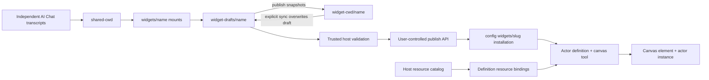

# Vibecanvas widget and AI Chat system

This is the onboarding map for engineers working on widgets, actors, resources, AI Chat workspaces, preview, publishing, and runtime instances. It describes the S84 runtime as of 2026-07-17. Code and tests remain authoritative.

## Mental model

A published Vibecanvas definition has two guest-authored halves:

- Widget UI: Arrow code running in the browser-side QuickJS/WASM sandbox.
- Actor backend: state-machine functions running in a Bun child process.

AI Chat does not own widget source. Every independent conversation uses one backend-owned shared working directory containing mounts for all shared draft folders. Published widgets have one canonical snapshot that is never mounted into AI Chat. Conversations keep separate transcripts while seeing and editing the same real draft files.



## Filesystem ownership

Current agent data lives below `<dataPath>/pi/agent`:

```text
shared-cwd/
  widgets/
    Weather -> ../../widget-drafts/Weather
    Timer   -> ../../widget-drafts/Timer
widget-cwd/
  Weather/
    vibecanvas.json
    ...
widget-drafts/
  Weather/
  Timer/
    vibecanvas.json
    ...
sessions/
  <chat-id>/
    ... Pi transcript/provider-session files ...
```

The ownership rules are strict:

- A chat owns only its transcript and provider state; it does not own draft source or a mount set.
- `shared-cwd/widgets` is the one backend-owned working view used by every conversation.
- `widget-cwd/<name>` is the canonical published snapshot and is never mounted into AI Chat.
- `widget-drafts/<name>` is the only source AI Chat mounts and edits.
- A mount is a Unix directory symlink or Windows directory junction created only by the backend.
- Backend draft sync may atomically copy published content into the shared draft. Removing a managed mount never removes its target.
- Reconnect and new-chat operations leave shared drafts and mounts intact. Reconciliation replaces legacy canonical mounts with draft mounts.
- Reconciliation creates a missing canonical published folder and never overwrites an existing folder.
- Old workspaces and transcript entries remain readable but are not current source authority.

Widget and chat names pass deterministic filesystem-safe validation. Empty names, separators, traversal, control characters, reserved names, and case collisions are rejected. Names do not receive hashes, random suffixes, entity IDs, or timestamps.

## Mounted path security

Generic file tools start from `shared-cwd`. Widget paths must enter lexically through `widgets/<mounted-name>/...`.

The path guard validates both the direct mount and its resolved target. The final path must remain inside that mount's exact registered `widget-drafts/<name>` root. Direct absolute access to shared roots, injected mounts, nested escaping symlinks, and arbitrary link creation are rejected.

`edit` and `patch` serialize the complete read/transform/write transaction per real widget root. Writes use a sibling temporary file followed by atomic rename. S84 intentionally adds no merge engine, revision ledger, change set, checkpoint, fingerprint, or undo history. Draft revisions are lightweight current-filesystem signatures used for stale user actions, not a history system.

## Fixed AI tool registry

Every conversation receives the same exact registry from connect through reconnect and continuation:

1. `vc_widget_create`
2. `vc_widget_validate`
3. `read`
4. `edit`
5. `patch`
6. `grep`
7. `vc_resource_list`
8. `vc_resource_inspect`
9. `vc_resource_create`
10. `vc_resource_update`
11. `vc_resource_delete`
12. `vc_resource_data_read`
13. `vc_resource_data_write`
14. `web_fetch`

`ToolRegistry` rejects missing, duplicate, or extra definitions. Backend authorization runs for every call. There are no phase switches and no model-callable publish, approval, rejection, widget deletion, unload, symlink, bash, or unrestricted write commands.

### Widget tools

`vc_widget_create` atomically creates a complete draft scaffold and exposes it in the shared workspace. The scaffold includes the validated manifest, widget source and styles, package/TypeScript configuration, and actor files required for an actor-widget. Partial scaffolds are removed.

`vc_widget_validate` accepts only a mounted widget. It invokes the host-selected compiler and SDK declarations, returns bounded diagnostics, and never publishes.

### Resource tools

Resources are host-global catalog entries of kind `kv`, `secretStore`, or `db`. Tool responses expose stable IDs and safe metadata, never provider handles, physical paths, native configuration, or secret plaintext.

Secret-store Turso files use native AEGIS-256 page encryption. The main database keeps the actual independent database keys in a general-purpose `encryption_keys` table with no actor columns. A separate `actor_resource_encryption_keys` table links each secret resource to one key. The persistence interface atomically creates or reads that link but exposes no key listing or transport API.

This deliberately favors operational simplicity over local ciphertext/key separation. Anyone who can read both the main database and actor-resource files can recover the secrets. Encryption still protects an individual secret database/WAL copied without the main database and supports managed deployments where the control database lives on another server. A usable restore requires the main database and corresponding actor-resource data; plaintext in memory and a host/account compromise remain outside this protection.

- `vc_resource_list` returns stable bounded cursor pages.
- `vc_resource_inspect` returns KV/secret key metadata or bounded SQLite schema metadata. It returns no DB rows or secret values.
- Create, rename, and binding-aware delete require protected approval.
- `vc_resource_data_read` accepts one query or an ordered query array. It returns one success/error result per query.
- KV supports get/has/list; secret stores support has/list only; SQLite reads are parameterized, bounded, single-statement, and read-only.
- `vc_resource_data_write` accepts one operation or a same-resource ordered batch. KV and secret operations use provider revisions. SQLite writes use one durable DB draft/apply path with bound parameters.

The resource-management UI has a separate, explicit one-secret reveal operation for the local human operator. It is not registered as an AI tool, actor IPC operation, SDK resource method, or generic resource-data read. Bound actor code retains its existing authorized secret `get` capability; model-facing management tools do not.

Result metadata states the applicable atomicity. S84 does not claim a cross-provider or cross-operation transaction for KV and secret batches.

## Protected approvals and secret handling

Resource create, update, delete, and data-write calls pause in the process-local `ApprovalCoordinator`.

1. The coordinator deep-clones and freezes exact arguments in server memory.
2. Clients receive only the approval ID, originating tool-call ID, summary, risk, warnings, and safe details.
3. Approval resolution accepts only the ID and approve/reject decision.
4. Approval rechecks current authorization and claims execution once.
5. Reject, timeout, prompt cancellation, disconnect, or service stop cancels without execution.
6. Resolved/canceled entries are removed and do not survive restart.

For secret-store set operations, a Pi message-end extension captures the original tool arguments into a one-shot process-local vault and replaces secret values with `[redacted]` before event emission and transcript persistence. The protected tool consumes the original arguments once; approval details and tool results remain redacted.

There is no approval table, protected-execution ledger, generic persisted tool execution, or S84 database migration.

The canvas AI Chat renders each approval inside its originating tool-call row and mirrors pending approvals in a floating card so the decision stays visible while the transcript is scrolled. Successful resource tool results expose their safe resource ID as an explicit detail-page action. Approved mutations invalidate both the chat resource mentions and the frontend sidebar catalog.

## Validation and publishing

Publishing remains outside the AI registry and is invoked only through the direct user-controlled widget-draft API. It accepts a draft identity and expected revision.

The first S84 frontend shipped a widget-draft strip with Preview and Publish controls. Product review removed that visible strip and its preview entry point pending a replacement design; the backend draft, preview, validation, and publication APIs remain available and user-only.

For every publish:

1. Reject a stale expected draft revision.
2. Validate the draft with the trusted host compiler and reject manifest identity or slug collisions.
3. Atomically snapshot `widget-drafts/<name>` into `widget-cwd/<name>` while leaving the shared draft and mount intact.
4. Install/register the published definition, reconcile resource bindings, and refresh running instances when needed.
5. On failure, remove a partial installation and restore the previous canonical and installed snapshots.

Renaming a published widget in place is unsupported. A new name means creating and publishing a new draft; the old definition remains independent.

## Preview, actors, and resources

Preview is a direct user action. It validates and pins one draft revision, then starts an ephemeral `Actor` from that draft. Preview actor IDs begin with `preview:` and state exists in memory only. A changed draft revision marks the preview stale until the user refreshes it.

Actor functions execute in a child Bun process. The host derives definition/run identity, resource binding, effective scope, and lifecycle. Guest code chooses a logical manifest slot, never a concrete resource ID or native handle.

Effective resource access remains:

```text
manifest scope ∩ binding restriction ∩ function-class ceiling
```

- `fn.*` receives no resource portal.
- `fx.*` may read resources.
- `tx.*` may read/write within effective scope.
- Required unbound, mismatched, non-ready, or over-scoped resources block actor admission.

Preview and publish derive unambiguous ready resource bindings from the host catalog. They are separate from AI resource-tool authorization, which is checked for every model tool call.

KV and secret entries live in resource-scoped control-DB storage. Each database resource owns a separate physical SQLite-compatible database. SQLite structural/data mutations continue to use existing durable draft/apply records and coordinated actor stop/restart behavior.

## Public API surfaces

Product clients use the typed ORPC agent contract:

- `agent.chat.connect`, `prompt`, `cancel`, `newSession`
- `agent.widgetDraft.list`, `get`, `validate`
- `agent.widgetPreview.get`, `build`, `refresh`, `reset`, `send`
- `agent.widgetPublish.publish`
- `agent.approval.list`, `get`, `resolve`
- `agent.chat.resourceBindings.clear`
- compatibility chat draft/preview/publish routes remain available to older clients but are not used by S84 AI Chat
- historical DB proposal resolution endpoints remain available for old session records
- the agent event stream carries Pi events and small widget-draft, preview, publication, and safe approval invalidations

`chat.connect` restores the independent message history. Approvals are refreshed from their query API, and product clients that surface widget drafts must use the draft query APIs; transcript text and tool results are not draft state authority.

## Important implementation files

AI Chat runtime:

- [`packages/service-agent/src/AgentService.ts`](../../packages/service-agent/src/AgentService.ts)
- [`packages/service-agent/src/workspace/WidgetWorkspace.ts`](../../packages/service-agent/src/workspace/WidgetWorkspace.ts)
- [`packages/service-agent/src/widget-drafts/WidgetDraftController.ts`](../../packages/service-agent/src/widget-drafts/WidgetDraftController.ts)
- [`packages/service-agent/src/tools/ToolRegistry.ts`](../../packages/service-agent/src/tools/ToolRegistry.ts)
- [`packages/service-agent/src/tools/tool.widget-workspace.ts`](../../packages/service-agent/src/tools/tool.widget-workspace.ts)
- [`packages/service-agent/src/tools/tool.workspace-files.ts`](../../packages/service-agent/src/tools/tool.workspace-files.ts)
- [`packages/service-agent/src/tools/tool.resources.ts`](../../packages/service-agent/src/tools/tool.resources.ts)
- [`packages/service-agent/src/approval/ApprovalCoordinator.ts`](../../packages/service-agent/src/approval/ApprovalCoordinator.ts)
- [`packages/service-agent/src/core/fx.session-records.ts`](../../packages/service-agent/src/core/fx.session-records.ts) and [`tx.session-records.ts`](../../packages/service-agent/src/core/tx.session-records.ts)
- [`packages/service-agent/src/prompts/prompt.tools.md`](../../packages/service-agent/src/prompts/prompt.tools.md)
- [`packages/api-agent/src/contract.ts`](../../packages/api-agent/src/contract.ts)

Actor/resource runtime:

- [`packages/service-actor/src/Actor.ts`](../../packages/service-actor/src/Actor.ts)
- [`packages/service-actor/src/ActorService.ts`](../../packages/service-actor/src/ActorService.ts)
- [`packages/service-actor/src/ActorSupervisor.ts`](../../packages/service-actor/src/ActorSupervisor.ts)
- [`packages/service-actor/src/icp-client.ts`](../../packages/service-actor/src/icp-client.ts)
- [`packages/service-actor/src/resources/ActorResourceManager.ts`](../../packages/service-actor/src/resources/ActorResourceManager.ts)
- [`packages/service-actor/src/resources/DbResource.ts`](../../packages/service-actor/src/resources/DbResource.ts)
- [`packages/service-actor/src/resources/DbResourceCoordinator.ts`](../../packages/service-actor/src/resources/DbResourceCoordinator.ts)
- [`packages/service-db/src/model.ts`](../../packages/service-db/src/model.ts)

Widget/canvas runtime:

- [`packages/sdk/src/widget.ts`](../../packages/sdk/src/widget.ts)
- [`packages/sdk/src/actor.ts`](../../packages/sdk/src/actor.ts)
- [`packages/canvas/src/plugins/widget/Widget.plugin.ts`](../../packages/canvas/src/plugins/widget/Widget.plugin.ts)
- [`packages/canvas/src/services/widget/WidgetManagerService.ts`](../../packages/canvas/src/services/widget/WidgetManagerService.ts)
- [`packages/canvas/src/services/widget/mount-arrow-sandbox.ts`](../../packages/canvas/src/services/widget/mount-arrow-sandbox.ts)

## Change checklist

Before changing this system:

1. Identify the owner: shared mount, canonical source, unpublished draft, installed definition, actor instance, binding, or resource provider.
2. Preserve the exact 14-tool registry and per-call authorization unless a later task explicitly replaces S84.
3. Keep mounted path validation at the backend boundary.
4. Keep model-authored files away from host compiler/executable selection.
5. Keep secret plaintext out of model-facing and generic reads, approval views, events, transcripts, logs, and results; the dedicated human reveal handler is the only management exception.
6. Keep publishing and approval user-controlled.
7. Add focused tests for persistence, rollback, lifecycle, authorization, and concurrency behavior.
