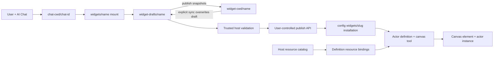

# Vibecanvas widget and AI Chat system

This is the onboarding map for engineers working on widgets, actors, resources, AI Chat workspaces, preview, publishing, and runtime instances. It describes the S83 runtime as of 2026-07-16. Code and tests remain authoritative.

## Mental model

A published Vibecanvas definition has two guest-authored halves:

- Widget UI: Arrow code running in the browser-side QuickJS/WASM sandbox.
- Actor backend: state-machine functions running in a Bun child process.

AI Chat does not own widget source. Each chat has an isolated directory containing backend-created mounts to shared draft folders. Published widgets have one canonical snapshot that is never mounted into AI Chat. Two chats that load the same draft name edit the same real files.



## Filesystem ownership

Current agent data lives below `<dataPath>/pi/agent`:

```text
chat-cwd/
  <chat-id>/
    widgets/
      Weather -> ../../../widget-drafts/Weather
      Timer   -> ../../../widget-drafts/Timer
widget-cwd/
  Weather/
    vibecanvas.json
    ...
widget-drafts/
  Weather/
  Timer/
    vibecanvas.json
    ...
sessions/
  <chat-id>/
    ... Pi transcript/provider-session files ...
```

The ownership rules are strict:

- A chat owns its transcript, provider state, chat cwd, and mount set.
- `widget-cwd/<name>` is the canonical published snapshot and is never mounted into AI Chat.
- `widget-drafts/<name>` is the only source AI Chat mounts and edits.
- A mount is a Unix directory symlink or Windows directory junction created only by the backend.
- Loading an existing draft never copies source. Explicit sync-from-published atomically overwrites the shared draft before loading it. Removing a mount never removes its target.
- Reconnect preserves valid draft mounts. Loading replaces legacy canonical mounts with draft mounts, and new-session cleanup can remove either backend-owned form.
- Reconciliation creates a missing canonical published folder and never overwrites an existing folder.
- Old workspaces and transcript entries remain readable but are not current source authority.

Widget and chat names pass deterministic filesystem-safe validation. Empty names, separators, traversal, control characters, reserved names, and case collisions are rejected. Names do not receive hashes, random suffixes, entity IDs, or timestamps.

## Mounted path security

Generic file tools start from the isolated chat cwd. Widget paths must enter lexically through `widgets/<mounted-name>/...`.

The path guard validates both the direct mount and its resolved target. The final path must remain inside that mount's exact registered `widget-drafts/<name>` root. Direct absolute access to shared roots, injected mounts, nested escaping symlinks, and arbitrary link creation are rejected.

`edit` and `patch` serialize the complete read/transform/write transaction per real widget root. Writes use a sibling temporary file followed by atomic rename. S83 intentionally adds no merge engine, revision ledger, change set, checkpoint, fingerprint, or undo history.

## Fixed AI tool registry

Every conversation receives the same exact registry from connect through reconnect and continuation:

1. `vc_widget_create`
2. `vc_widget_load`
3. `vc_widget_validate`
4. `read`
5. `edit`
6. `patch`
7. `grep`
8. `vc_resource_list`
9. `vc_resource_inspect`
10. `vc_resource_create`
11. `vc_resource_update`
12. `vc_resource_delete`
13. `vc_resource_data_read`
14. `vc_resource_data_write`
15. `web_fetch`

`ToolRegistry` rejects missing, duplicate, or extra definitions. Backend authorization runs for every call. There are no phase switches and no model-callable publish, approval, rejection, widget deletion, unload, symlink, bash, or unrestricted write commands.

### Widget tools

`vc_widget_create` atomically creates a complete draft scaffold and mounts it into the invoking chat. The scaffold includes the validated manifest, widget source and styles, package/TypeScript configuration, and actor files required for an actor-widget. Partial scaffolds are removed.

`vc_widget_load` mounts one existing shared draft. `syncFromPublished: true` first overwrites that draft from the canonical published snapshot. Repeating a draft load is idempotent; conflicting mounts fail.

`vc_widget_validate` accepts only a mounted widget. It invokes the host-selected compiler and SDK declarations, returns bounded diagnostics, and never publishes.

### Resource tools

Resources are host-global catalog entries of kind `kv`, `secretStore`, or `db`. Tool responses expose stable IDs and safe metadata, never provider handles, physical paths, native configuration, or secret plaintext.

- `vc_resource_list` returns stable bounded cursor pages.
- `vc_resource_inspect` returns KV/secret key metadata or bounded SQLite schema metadata. It returns no DB rows or secret values.
- Create, rename, and binding-aware delete require protected approval.
- `vc_resource_data_read` accepts one query or an ordered query array. It returns one success/error result per query.
- KV supports get/has/list; secret stores support has/list only; SQLite reads are parameterized, bounded, single-statement, and read-only.
- `vc_resource_data_write` accepts one operation or a same-resource ordered batch. KV and secret operations use provider revisions. SQLite writes use one durable DB draft/apply path with bound parameters.

Result metadata states the applicable atomicity. S83 does not claim a cross-provider or cross-operation transaction for KV and secret batches.

## Protected approvals and secret handling

Resource create, update, delete, and data-write calls pause in the process-local `ApprovalCoordinator`.

1. The coordinator deep-clones and freezes exact arguments in server memory.
2. Clients receive only an approval ID, summary, risk, warnings, and safe details.
3. Approval resolution accepts only the ID and approve/reject decision.
4. Approval rechecks current authorization and claims execution once.
5. Reject, timeout, prompt cancellation, disconnect, or service stop cancels without execution.
6. Resolved/canceled entries are removed and do not survive restart.

For secret-store set operations, a Pi message-end extension captures the original tool arguments into a one-shot process-local vault and replaces secret values with `[redacted]` before event emission and transcript persistence. The protected tool consumes the original arguments once; approval details and tool results remain redacted.

There is no approval table, protected-execution ledger, generic persisted tool execution, or S83 database migration.

## Validation and publishing

Publishing remains outside the AI registry and is invoked through the existing user-controlled API.

For an existing published widget:

1. Resolve its canonical mounted folder.
2. Reject a manifest name that differs from the canonical directory name.
3. Validate with the trusted host compiler.
4. Install/reload from that canonical source.
5. Preserve the canonical folder and all mounts.

For a first publish:

1. Validate the mounted draft and reject name/slug collisions.
2. Atomically move `widget-drafts/<name>` to `widget-cwd/<name>`.
3. Retarget every chat mount that referenced the draft.
4. Install/register the published definition and reconcile bindings.
5. On failure, remove a partial installation, restore the draft, and restore all draft mounts.

Renaming a published widget in place is unsupported. A new name means creating and publishing a new draft; the old definition remains independent.

## Preview, actors, and resources

Preview resolves the active mounted folder and starts an ephemeral `Actor` from those files. Draft actor IDs begin with `draft:` and state exists in memory only.

Actor functions execute in a child Bun process. The host derives definition/run identity, resource binding, effective scope, and lifecycle. Guest code chooses a logical manifest slot, never a concrete resource ID or native handle.

Effective resource access remains:

```text
manifest scope ∩ binding restriction ∩ function-class ceiling
```

- `fn.*` receives no resource portal.
- `fx.*` may read resources.
- `tx.*` may read/write within effective scope.
- Required unbound, mismatched, non-ready, or over-scoped resources block actor admission.

Concrete preview/publish resource selections are retained as host/session records. They are separate from AI resource-tool authorization, which is checked for every call.

KV and secret entries live in resource-scoped control-DB storage. Each database resource owns a separate physical SQLite-compatible database. SQLite structural/data mutations continue to use existing durable draft/apply records and coordinated actor stop/restart behavior.

## Public API surfaces

Product clients use the typed ORPC agent contract:

- `agent.chat.connect`, `prompt`, `cancel`, `newSession`
- `agent.chat.startWidgetEdit`, `previewSource`, `publish`
- `agent.chat.approval.list`, `get`, `resolve`
- `agent.chat.resourceBindings.clear`
- `agent.chat.draftManifest.read`, `patch`
- `agent.chat.draftActor.start`, `reload`, `reset`, `stop`, `inspect`, `send`
- historical DB proposal resolution endpoints remain available for old session records
- the agent event stream carries Pi events, widget updates, draft-actor events, and safe approval events

`chat.connect` returns mounted manifest context when available, message history, and edit-session metadata. It no longer returns actor-candidate authority or a phase.

## Important implementation files

AI Chat runtime:

- [`packages/service-agent/src/AgentService.ts`](../../packages/service-agent/src/AgentService.ts)
- [`packages/service-agent/src/workspace/WidgetWorkspace.ts`](../../packages/service-agent/src/workspace/WidgetWorkspace.ts)
- [`packages/service-agent/src/tools/ToolRegistry.ts`](../../packages/service-agent/src/tools/ToolRegistry.ts)
- [`packages/service-agent/src/tools/tool.widget-workspace.ts`](../../packages/service-agent/src/tools/tool.widget-workspace.ts)
- [`packages/service-agent/src/tools/tool.workspace-files.ts`](../../packages/service-agent/src/tools/tool.workspace-files.ts)
- [`packages/service-agent/src/tools/tool.resources.ts`](../../packages/service-agent/src/tools/tool.resources.ts)
- [`packages/service-agent/src/approval/ApprovalCoordinator.ts`](../../packages/service-agent/src/approval/ApprovalCoordinator.ts)
- [`packages/service-agent/src/core/fx.session-records.ts`](../../packages/service-agent/src/core/fx.session-records.ts) and [`tx.session-records.ts`](../../packages/service-agent/src/core/tx.session-records.ts)
- [`packages/service-agent/src/prompts/prompt.tools.md`](../../packages/service-agent/src/prompts/prompt.tools.md)
- [`packages/api-agent/src/contract.ts`](../../packages/api-agent/src/contract.ts)

Actor/resource runtime:

- [`packages/service-actor/src/Actor.ts`](../../packages/service-actor/src/Actor.ts)
- [`packages/service-actor/src/ActorService.ts`](../../packages/service-actor/src/ActorService.ts)
- [`packages/service-actor/src/ActorSupervisor.ts`](../../packages/service-actor/src/ActorSupervisor.ts)
- [`packages/service-actor/src/icp-client.ts`](../../packages/service-actor/src/icp-client.ts)
- [`packages/service-actor/src/resources/ActorResourceManager.ts`](../../packages/service-actor/src/resources/ActorResourceManager.ts)
- [`packages/service-actor/src/resources/DbResource.ts`](../../packages/service-actor/src/resources/DbResource.ts)
- [`packages/service-actor/src/resources/DbResourceCoordinator.ts`](../../packages/service-actor/src/resources/DbResourceCoordinator.ts)
- [`packages/service-db/src/model.ts`](../../packages/service-db/src/model.ts)

Widget/canvas runtime:

- [`packages/sdk/src/widget.ts`](../../packages/sdk/src/widget.ts)
- [`packages/sdk/src/actor.ts`](../../packages/sdk/src/actor.ts)
- [`packages/canvas/src/plugins/widget/Widget.plugin.ts`](../../packages/canvas/src/plugins/widget/Widget.plugin.ts)
- [`packages/canvas/src/services/widget/WidgetManagerService.ts`](../../packages/canvas/src/services/widget/WidgetManagerService.ts)
- [`packages/canvas/src/services/widget/mount-arrow-sandbox.ts`](../../packages/canvas/src/services/widget/mount-arrow-sandbox.ts)

## Change checklist

Before changing this system:

1. Identify the owner: chat mount, canonical source, unpublished draft, installed definition, actor instance, binding, or resource provider.
2. Preserve the exact 15-tool registry and per-call authorization unless a later task explicitly replaces S83.
3. Keep mounted path validation at the backend boundary.
4. Keep model-authored files away from host compiler/executable selection.
5. Keep secret plaintext out of reads, approval views, events, transcripts, logs, and results.
6. Keep publishing and approval user-controlled.
7. Add focused tests for persistence, rollback, lifecycle, authorization, and concurrency behavior.
