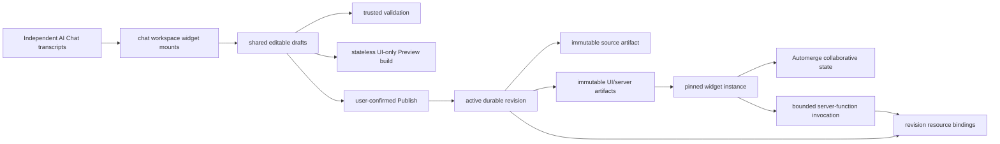

# Vibecanvas widget and AI Chat system

This is the onboarding map for engineers working on widget authoring, Draft Preview, publication, collaborative state, server functions, and resources. It describes the post-S106/S107/S108 architecture as of 2026-07-22. Code and tests remain authoritative.

## Authority model

A widget has two lifecycle states:

- A draft is mutable source in `<dataPath>/pi/agent/widgets/drafts/<name>`.
- A publication is an active database revision plus immutable `source`, `ui`, and optional `server` artifacts.

There is no published source folder. Published catalog, detail, file inspection, placement, and edit-as-draft operations resolve the active revision and verify the source artifact's tenant, kind, size, digest, snapshot identity, and revision identity.



## Filesystem ownership

Current agent data lives below `<dataPath>/pi/agent`:

```text
chats/<date>/<chat-id>/
  chat.json
  history/
  workspace/widgets/<name> -> shared draft
widgets/drafts/<name>/
  vibecanvas.json
  ui/
  server/                 # optional
draft-state/              # draft materialization coordination
sdk/                      # host-materialized authoring SDK
```

The ownership rules are strict:

- A chat owns its transcript, provider state, and backend-created draft mounts.
- `widgets/drafts/<name>` is the only mutable widget source tree.
- Published source exists only as verified immutable artifact bytes referenced by durable revision metadata.
- Editing a publication materializes a draft from the selected source artifact.
- Request-time snapshots are hidden temporary siblings under `widgets/drafts/` and are deleted before validation, Preview, or publication returns.
- An arbitrary old `widgets/published/` or installed source folder is ignored; it is never imported or reconciled.

Generic file tools must enter through `widgets/<mounted-name>/...`. The backend validates both the mount and resolved target, rejects escaping symlinks and direct shared-root access, and serializes atomic file updates per real draft root.

## Authoring and validation

Manifest schema version 2 is the only accepted widget manifest. It describes browser UI, optional server entry/runtime ABI, collaborative-state defaults, resource requirements, and tool metadata.

`vc_widget_create` creates a complete UI-first draft. `vc_widget_validate` uses the host-selected compiler and SDK declarations and never publishes. Persistent instance state belongs in collaborative state. Backend work belongs in short-lived typed functions; no resident guest runtime exists.

Every conversation receives the fixed tool registry enforced by `ToolRegistry`: widget creation/validation and mounted file tools, resource tools, `web_fetch`, and bounded `bash`. Publish and protected approval decisions remain direct user actions rather than model-callable tools.

## Stateless Draft Preview

Draft Preview is a request-time UI build of the current coherent draft snapshot:

1. Resolve the current durable draft and source digest.
2. Capture a temporary coherent filesystem snapshot.
3. Validate and build UI bytes without writing an artifact or database row.
4. Return bounded base64 bytes plus their digest.
5. Verify and mount those bytes in the browser with fresh ephemeral collaborative state.
6. Delete the temporary snapshot before the request returns.

Persisted Preview frames contain only `draftId`, `draftName`, and optional originating chat element ID. Mount, refresh, and reset build the current draft again. Frame deletion, application shutdown, and restart require no Preview cleanup call.

Server functions and resources are intentionally unavailable in Draft Preview. The browser bridge rejects calls with `PREVIEW_FUNCTIONS_UNAVAILABLE` and explains that those capabilities become available after Publish. No function invocation is created.

## Publication and published reads

Publish accepts a draft ID and expected source revision and remains explicitly user-confirmed. The publication service validates the captured source, builds immutable artifacts, freezes function descriptors and bindings, and atomically activates the revision.

The active revision is the only published authority. A published canvas reference is `published:<definitionId>` plus the exact revision ID. Placed elements persist `definitionId`, `revisionId`, and `instanceId`; existing instances remain pinned when a later revision becomes active.

Edit-as-draft reads and verifies the revision source artifact, materializes it into draft storage, and records the publication seed. Missing, corrupt, cross-tenant, or identity-mismatched source bytes fail explicitly with no mutable fallback.

## Browser runtime

The UI artifact runs in the browser sandbox through `WidgetUiRuntime`. Each placed instance owns an Automerge state document. Definition revisions do not share mutable state.

Published UI receives two host bridges:

- Collaborative state: get/change/wait/cancel against the instance document.
- Server functions: invoke a named function for the pinned definition/revision/instance identity.

The browser never chooses tenant, revision, function artifact, concrete resource ID, provider handle, credential, or storage path.

## Server functions and resources

Server functions are short-lived and bounded by deadline, memory tier, output size, logs, retries, leases, and cancellation. The only invocation subject is `widget_instance` with canvas and widget-instance identity.

Effective resource access is:

```text
manifest requirement ∩ revision binding ∩ function effect ceiling
```

- `fn` receives no resource portal.
- `fx` may read declared slots.
- `tx` may read and write declared slots.

Resources are neutral catalog records. Bindings are keyed by widget definition ID, revision ID, slot, resource ID, and effect. Database schema apply drains active resource uses, fences writes, applies or restores the physical database, releases the drain lease, and records preparation/apply/terminal audit states. It does not stop or restart resident guest processes.

Secret values never appear in model-facing lists, approvals, transcripts, events, logs, or generic reads. The resource UI has a separate bounded reveal action for the local operator. Secret-store databases use independent encrypted files with keys linked from the main control database.

## Public API surfaces

Product clients use the typed consolidated ORPC contract:

- `agent.widgetDraft.list`, `get`, `validate`
- `agent.widgetPreview.build`
- `agent.widgetPublish.publish`
- `agent.widgets.catalog`, `detail`, `files`, `file`, `resolvePlacement`, `delete`
- `function.invoke`, run status/cancel, logs, and subscriptions
- neutral resource catalog, binding, data, draft/apply, restore, and backup routes

There is no Preview get/close/invoke lifecycle, no Preview function subject, and no resident-runtime API/event router.

## Important implementation files

Authoring and publication:

- [`packages/service-agent/src/AgentService.ts`](../../packages/service-agent/src/AgentService.ts)
- [`packages/service-agent/src/workspace/WidgetWorkspace.ts`](../../packages/service-agent/src/workspace/WidgetWorkspace.ts)
- [`packages/service-agent/src/widget-drafts/WidgetDraftController.ts`](../../packages/service-agent/src/widget-drafts/WidgetDraftController.ts)
- [`packages/widget-contract/src/local/WidgetPublicationService.ts`](../../packages/widget-contract/src/local/WidgetPublicationService.ts)
- [`packages/widget-contract/src/local/WidgetPreviewService.ts`](../../packages/widget-contract/src/local/WidgetPreviewService.ts)

Browser:

- [`packages/ui-ai-chat/src/draft-preview/mount.ts`](../../packages/ui-ai-chat/src/draft-preview/mount.ts)
- [`packages/ui-ai-chat/src/draft-preview/DraftPreviewFrameService.ts`](../../packages/ui-ai-chat/src/draft-preview/DraftPreviewFrameService.ts)
- [`packages/ui-ai-chat/src/widget-runtime/WidgetUiRuntime.ts`](../../packages/ui-ai-chat/src/widget-runtime/WidgetUiRuntime.ts)
- [`packages/service-automerge/src/types/canvas-doc.zod.ts`](../../packages/service-automerge/src/types/canvas-doc.zod.ts)

Functions, resources, and persistence:

- [`packages/function-runtime/src`](../../packages/function-runtime/src)
- [`packages/resource-runtime/src/local/DbResourceCoordinator.ts`](../../packages/resource-runtime/src/local/DbResourceCoordinator.ts)
- [`packages/service-db/src/WidgetControlStoreTurso.ts`](../../packages/service-db/src/WidgetControlStoreTurso.ts)
- [`packages/service-db/src/FunctionControlStoreTurso.ts`](../../packages/service-db/src/FunctionControlStoreTurso.ts)
- [`packages/service-db/src/ResourceControlStoreTurso.ts`](../../packages/service-db/src/ResourceControlStoreTurso.ts)

## Change checklist

1. Identify whether the owner is a mutable draft, immutable revision artifact, widget instance, function invocation, resource binding, or resource provider.
2. Keep published reads artifact-authoritative and verify identity before returning bytes.
3. Keep Draft Preview stateless and UI-only.
4. Keep mounted path validation and host-selected compilers at the backend boundary.
5. Keep server/resource authority host-derived and secret plaintext out of model-facing surfaces.
6. Keep Publish and approvals user-controlled.
7. Add focused tests for integrity, stale revisions, restart behavior, recovery, authorization, and concurrency.
