# Vibecanvas screen atlas

This is the desktop visual reference for Vibecanvas. It covers the active app shell, canvas, widget inspector, resource workspaces, and public website as of 2026-07-19. The local product data shown here is illustrative and contains no real secrets.

All screenshots are optimized WebP files under [`assets/`](assets/). Capture a new image when a route, workspace, modal, or interaction state changes meaningfully; avoid adding cosmetic duplicates.

## Coverage

| Area | Routes | Representative states |
| --- | --- | --- |
| [App shell](#app-shell) | `/` | Welcome, create canvas, create resource |
| [Canvas](#canvas) | `/c/:id` | Populated canvas, selection/style tools, widget actions/fullscreen, AI chat/settings, draft Preview |
| [Widget inspector](#widget-inspector) | `/widgets/:source/:name` | Overview, config, messages, states, files, draft editing |
| [Key-value and secret resources](#key-value-and-secret-resources) | `/resources/:id?tab=overview\|data` | Overview, empty/populated data, add value, add/rotate secret |
| [Database resources](#database-resources) | `/resources/:id?tab=overview\|schema\|data\|sql` | Lifecycle, schema drafting/apply, row editing, SQL and write approval |
| [Public website](#public-website) | `/`, `/docs`, `/docs/*` | Landing page, documentation index, article layout |

## App shell

The root screen is the entry point for canvases, resources, and widgets. The two sidebar add actions open the primary creation dialogs.

| Welcome | Create canvas |
| --- | --- |
|  |  |
| **`/` — Welcome.** Empty workspace guidance with the persistent navigation sidebar. | **Canvas `+` — Create canvas.** Names a canvas before opening its workspace. |

| Create resource |
| --- |
| 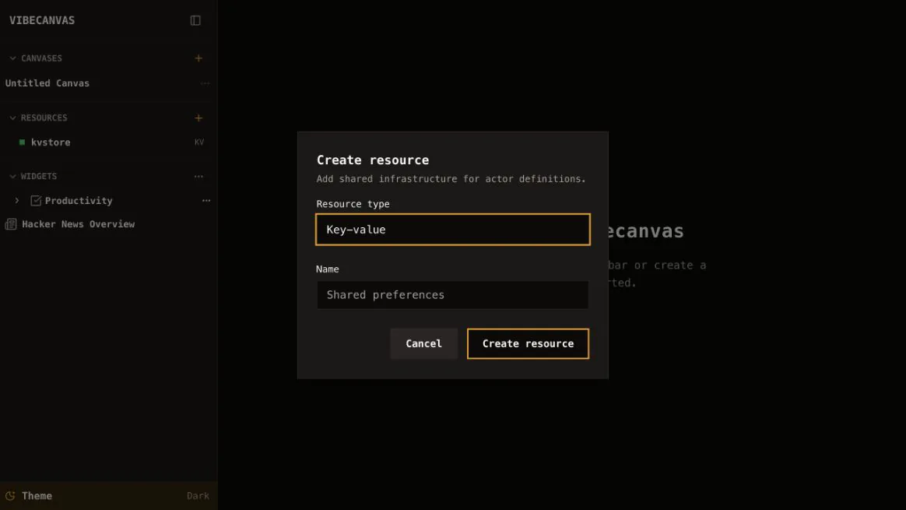 |
| **Resources `+` — Create resource.** Selects a key-value, secret, or database resource and assigns its name. |

## Canvas

The canvas combines the infinite workspace, drawing tools, hosted widgets, and the AI assistant. These captures cover the materially different window and selection states.

| Populated canvas | Selection and style tools |
| --- | --- |
|  | 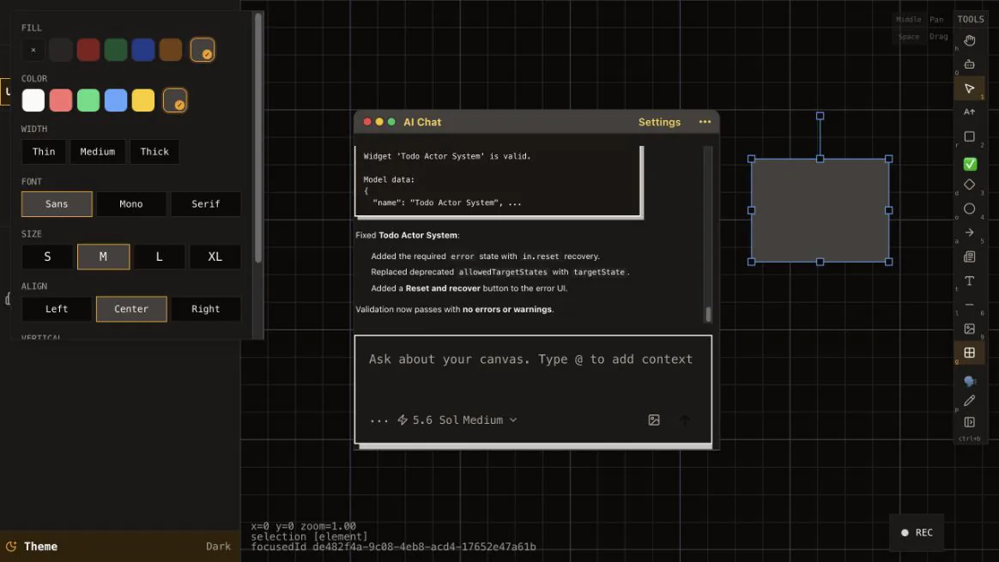 |
| **`/c/:id` — Hosted widget.** A Todo Actor instance placed and resized on the grid. | **Selected shape.** Transformer handles and the contextual style panel for a rectangle. |

| Widget actions | Widget fullscreen |
| --- | --- |
|  | 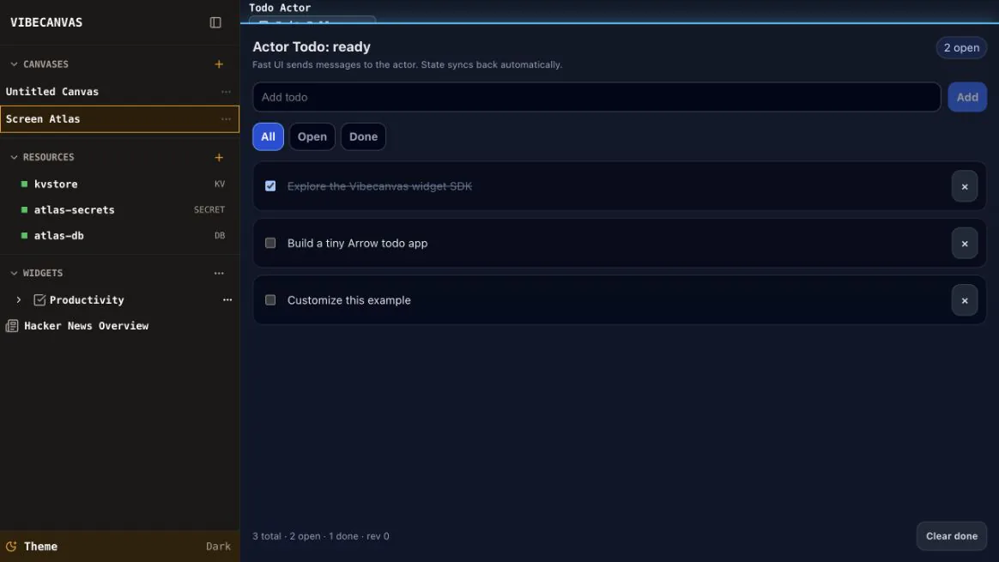 |
| **Window menu.** Minimize, fullscreen, delete instance, and delete widget actions. | **Fullscreen.** The hosted widget expands to the available application workspace. |

| AI chat | AI settings |
| --- | --- |
| 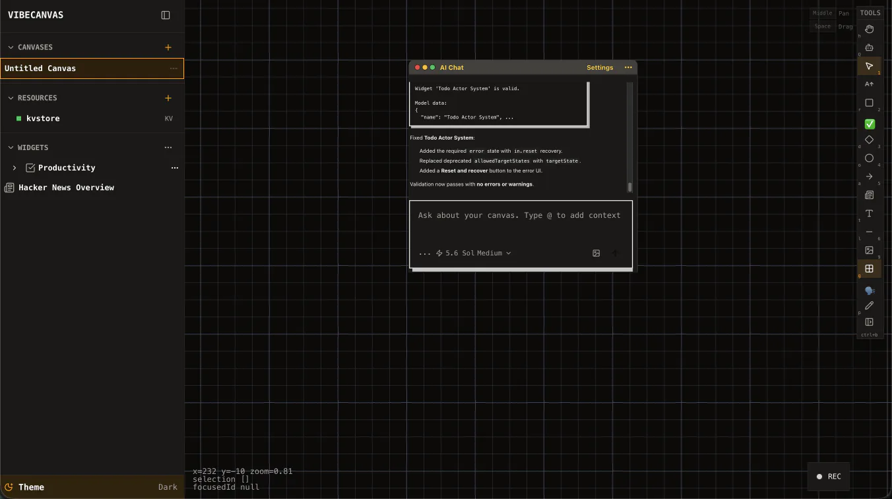 | 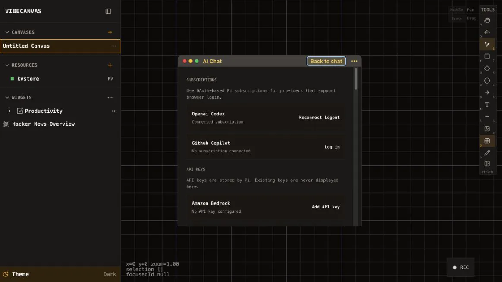 |
| **AI assistant — Chat.** Conversation history, model selector, prompt input, and canvas context. | **AI assistant — Settings.** Provider connection status and API-key actions. |

| AI draft Preview |
| --- |
|  |
| **AI assistant — Draft Preview.** A trusted widget-create result opens one revision-pinned interactive Preview beside its originating chat. |

## Widget inspector

The widget route provides one tabbed workspace for published and draft widget definitions. Published configuration is read-only; a draft makes configuration editable.

| Published overview | Published config |
| --- | --- |
| 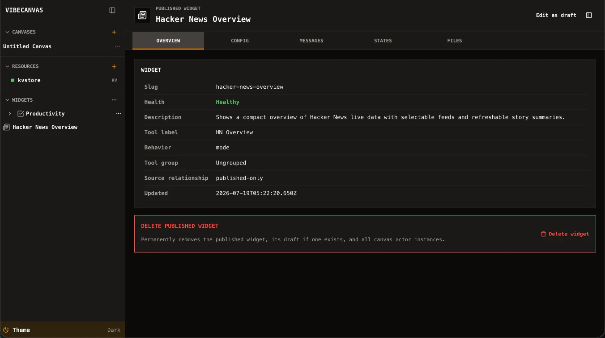 |  |
| **`?tab=overview`.** Identity, metadata, runtime details, and the destructive delete area. | **`?tab=config`.** Immutable published configuration with the edit-as-draft entry point. |

| Messages | States |
| --- | --- |
|  | 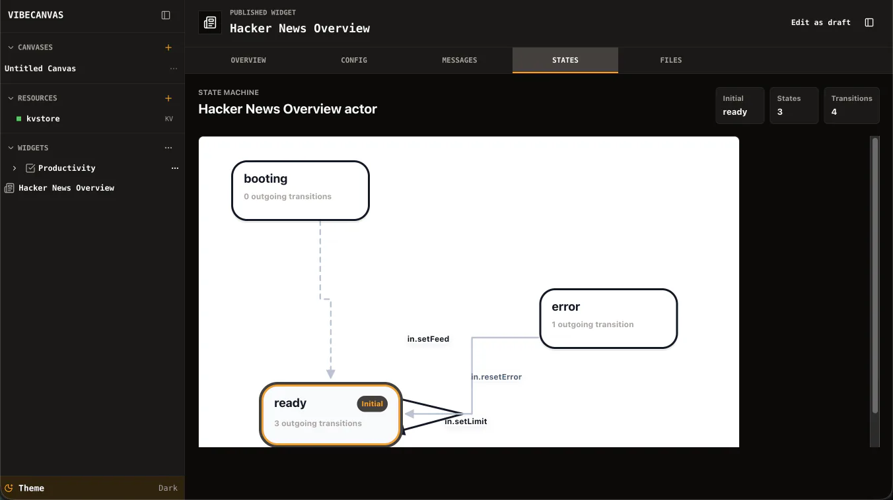 |
| **`?tab=messages`.** Accepted inputs and emitted outputs for each actor message. | **`?tab=states`.** Current actor state, transition counts, and transition graph. |

| Files | Draft config |
| --- | --- |
|  |  |
| **`?tab=files`.** File tree with the selected source file rendered beside it. | **Draft `?tab=config`.** Editable name, label, description, icon, group, and priority. |

## Key-value and secret resources

Key-value and secret resources share the same overview/data shell. Secret plaintext is write-only: the UI shows names and metadata after creation, then accepts replacement plaintext only during rotation.

| Key-value overview | Empty key-value data |
| --- | --- |
|  | 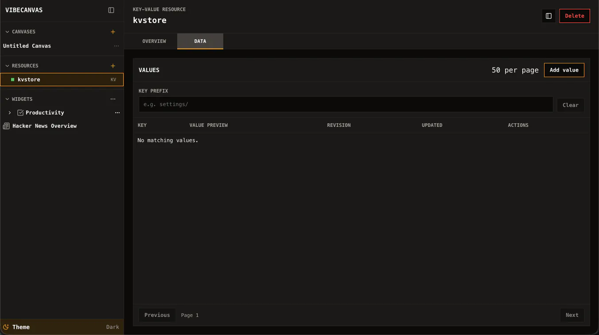 |
| **`?tab=overview`.** Status, type, revision, settings, and actor references. | **`?tab=data`.** Key filter, pagination, empty state, and the add-value action. |

| Add value | Populated key-value data |
| --- | --- |
| 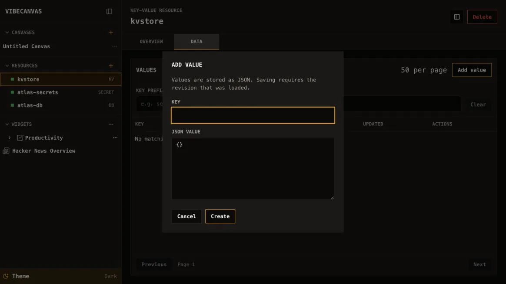 |  |
| **Add value.** A string key and JSON value are validated before creation. | **Stored value.** Key, JSON preview, revision, update time, edit, and delete actions. |

| Add secret | Rotate secret |
| --- | --- |
| 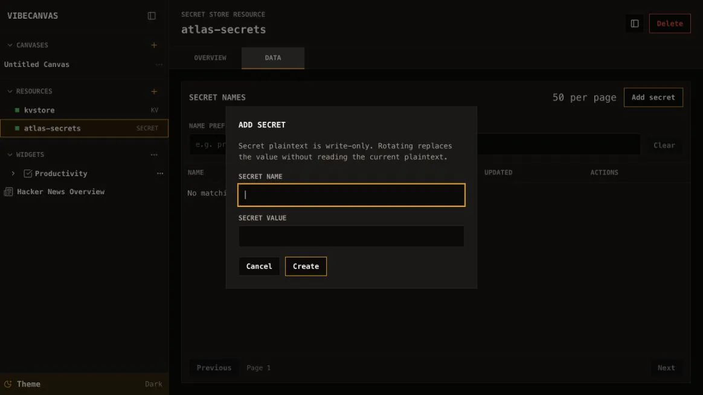 | 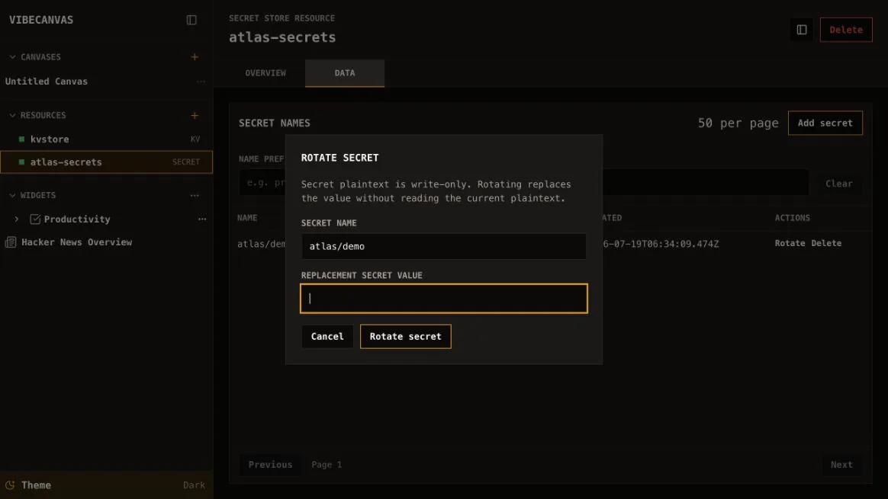 |
| **Secret `?tab=data` — Add.** Stores a named secret without exposing the plaintext again. | **Secret `?tab=data` — Rotate.** Replaces the write-only plaintext for an existing secret. |

## Database resources

Database resources add schema, data, and SQL workspaces. Schema edits remain a draft until reviewed and applied; SQL that may mutate the live database requires a second approval step.

| Database overview | Create table |
| --- | --- |
| 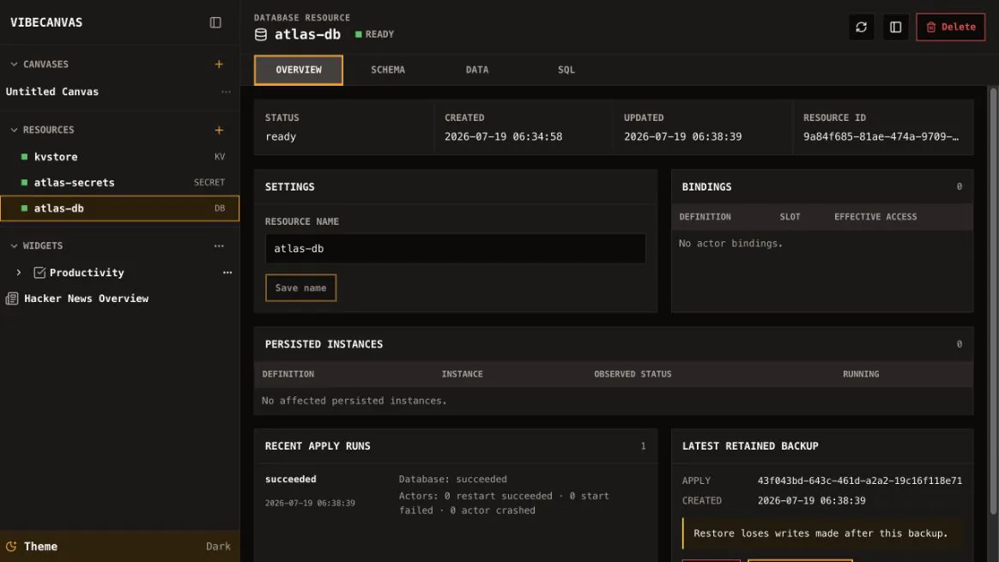 |  |
| **`?tab=overview`.** Runtime status, instances, apply history, and retained backup. | **`?tab=schema` — Create table.** Table options and the initial column definition. |

| Schema draft | Review and apply |
| --- | --- |
| 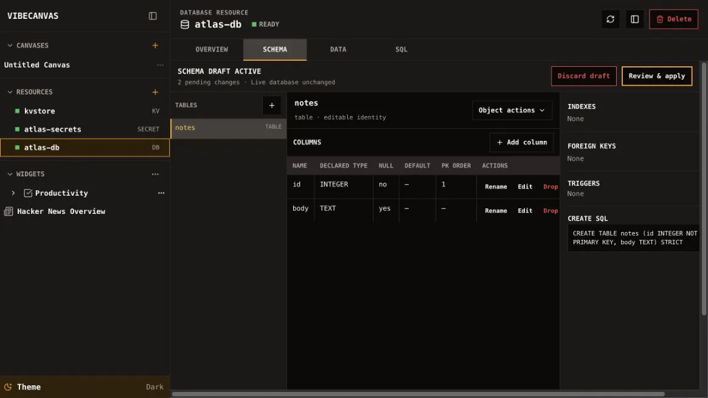 | 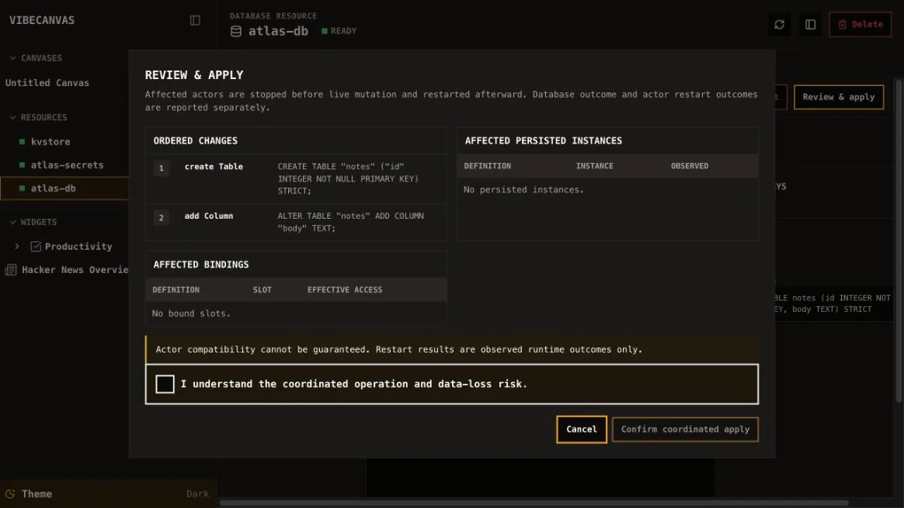 |
| **Schema draft.** Pending changes, table details, columns, indexes, triggers, and generated SQL. | **Review & apply.** Ordered changes, affected instances/bindings, and coordinated-operation acknowledgement. |

| Add row | Data table |
| --- | --- |
| 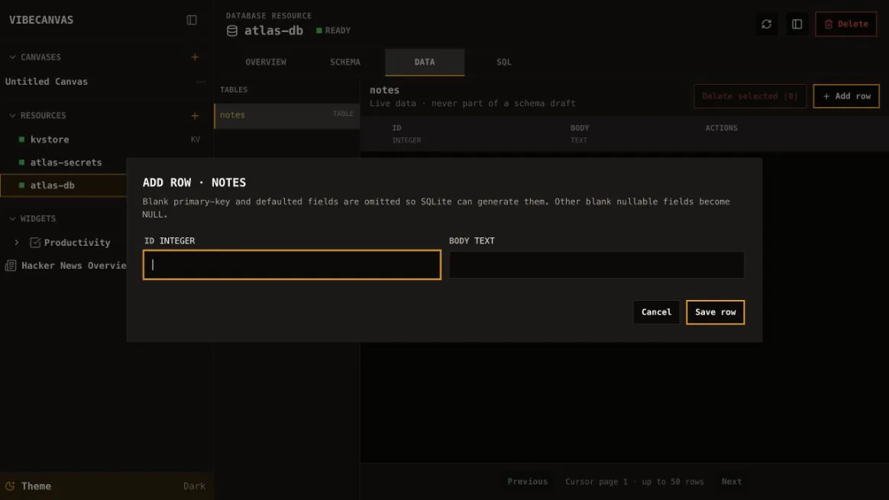 | 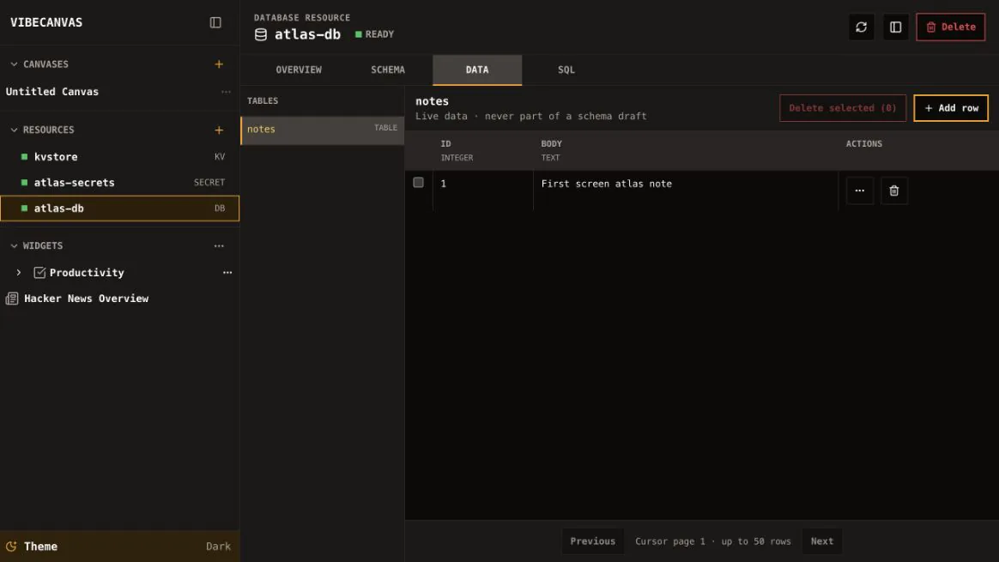 |
| **`?tab=data` — Add row.** Typed fields for the selected table, with nullable/default behavior. | **`?tab=data` — Table view.** Table picker, row grid, selection, add-row, edit, and delete actions. |

| SQL query | SQL write approval |
| --- | --- |
| 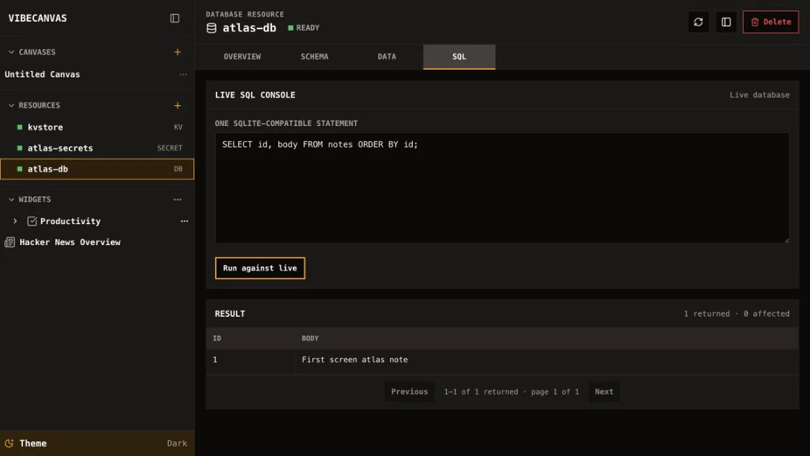 | 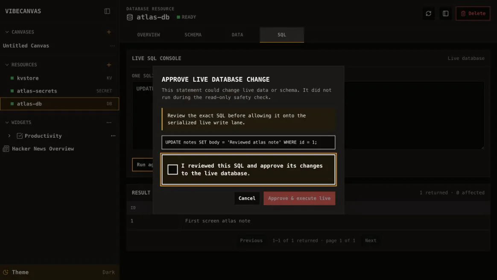 |
| **`?tab=sql` — Read query.** SQL editor, run action, and paginated result table. | **`?tab=sql` — Write guard.** Statement review plus explicit acknowledgement before execution. |

## Public website

The public site uses a separate light visual system. The documentation index and one article capture the two distinct documentation layouts; `/docs/widgets-and-actors`, `/docs/installation`, and `/docs/faq` reuse the article shell.

| Landing page | Documentation index |
| --- | --- |
| 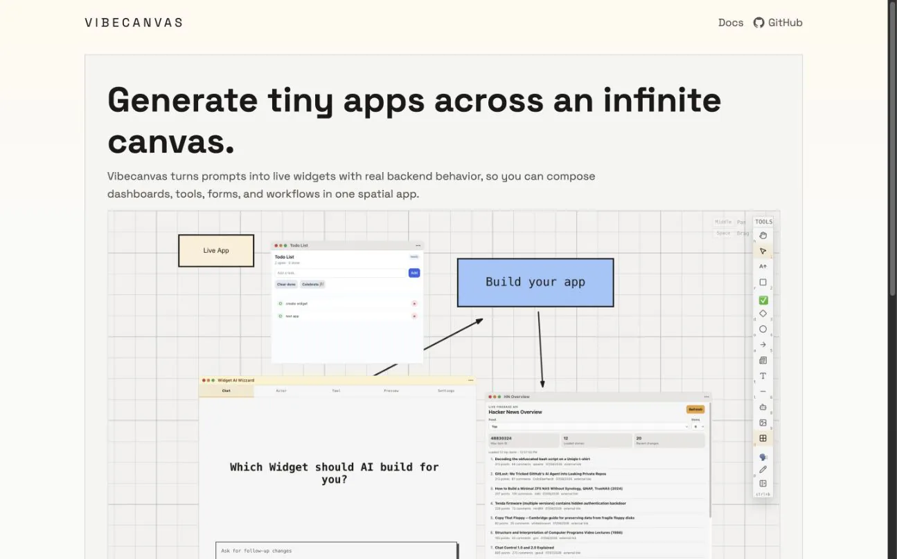 |  |
| **`/`.** Product proposition, canvas preview, and top-level documentation/GitHub links. | **`/docs`.** Guide navigation and cards for each documentation section. |

| Getting Started article |
| --- |
|  |
| **`/docs/getting-started`.** Representative article layout with guide navigation, prerequisites, install commands, and run instructions. |

## Coverage boundaries

- Included: every active top-level route family, every tab with a distinct UI, primary creation/edit dialogs, and safety-critical review states.
- Represented once: shared shells, repeated form controls, pagination, and destructive actions whose layout is already visible in the relevant workspace.
- Omitted: dormant filesystem/terminal canvas plugins, the unused Canvas Help component, development-only recorder/visual-debug UI, transient loading states, and duplicated error/empty variants.
- Captures are a desktop reference. Responsive breakpoints should get a separate atlas if mobile becomes a supported product surface.

## Updating the atlas

1. Capture the smallest representative state at a consistent desktop viewport. Use clearly fake local data and never capture credentials or real secret values.
2. Name files by area and sequence (`canvas-*`, `widget-*`, `resource-*`, `web-*`) and keep them in `assets/`.
3. Convert captures to WebP with metadata removed. The current set uses quality 82; oversized source PNGs were also reduced to half resolution.
4. Update the coverage table and the relevant gallery row, then verify every relative image link and inspect the rendered result.
