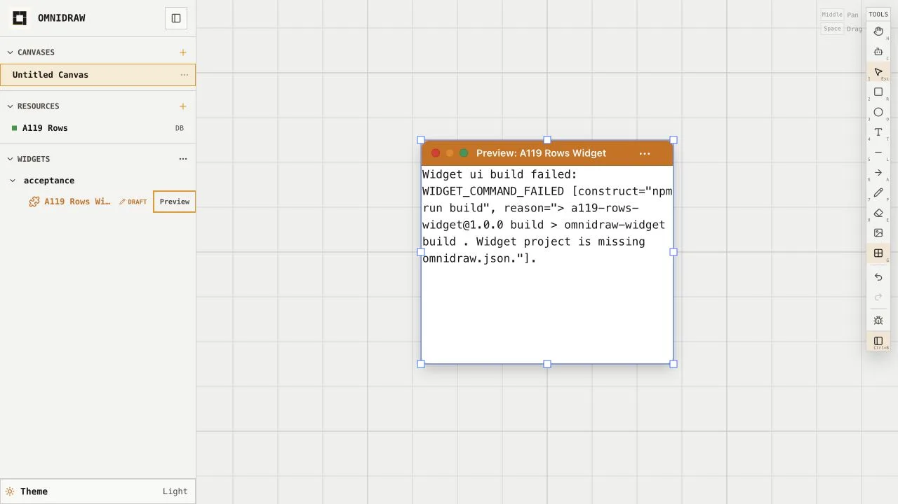
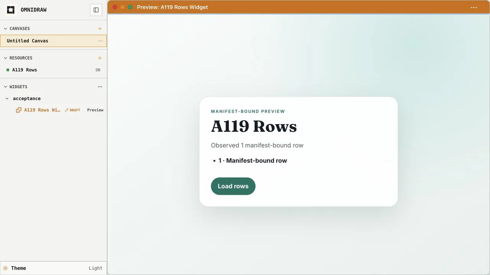
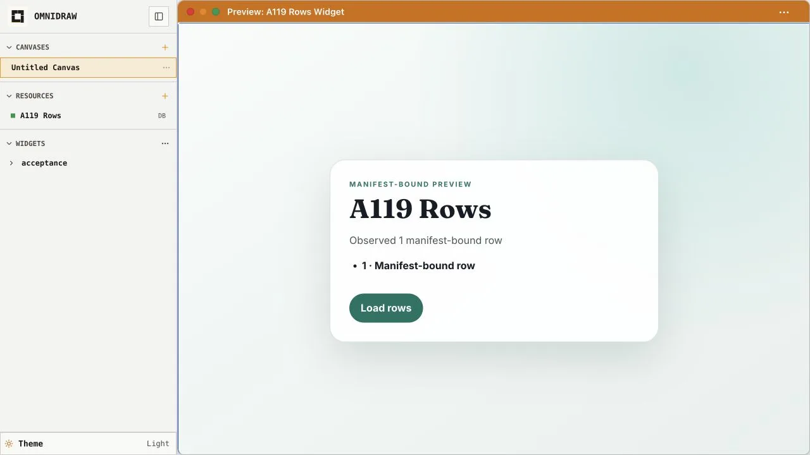
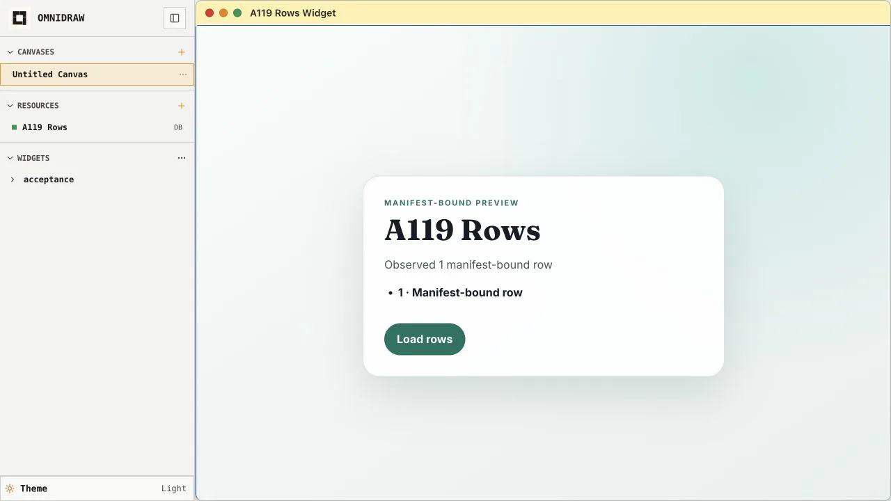

# Omnidraw screen atlas

This is the desktop visual reference for Omnidraw. It covers the active app shell, canvas, widget inspector, and resource workspaces as of the filesystem-first single-user redesign (2026-08-04). The local product data shown here is illustrative and contains no real secrets.

All screenshots are optimized WebP files under [`assets/`](assets/). Capture a new image when a route, workspace, modal, or interaction state changes meaningfully; avoid adding cosmetic duplicates.

## Coverage

| Area | Routes | Representative states |
| --- | --- | --- |
| [App shell](#app-shell) | `/` | Welcome, create canvas, create resource |
| [Canvas](#canvas) | `/c/:id` | Populated canvas, selection/style tools, fixed widget-frame actions/canvas maximize, AI chat/settings, accepted draft Preview/actions, manifest-bound resource failure/recovery/reload, direct no-picker widget placement |
| [Widget inspector](#widget-inspector) | `/widgets/:source/:name` | Overview, config, functions, resources, files, draft editing |
| [Key-value and secret resources](#key-value-and-secret-resources) | `/resources/:id?tab=overview\|data` | Overview, empty/populated data, add value, add/rotate/reveal secret |
| [Database resources](#database-resources) | `/resources/:id?tab=overview\|schema\|data\|sql` | Lifecycle, schema drafting/apply, row editing, SQL and write approval |

## App shell

The root screen is the entry point for canvases, resources, and widgets. The two sidebar add actions open the primary creation dialogs.

| Welcome | Create canvas |
| --- | --- |
|  |  |
| **`/` — Welcome.** Empty workspace guidance with the persistent navigation sidebar. | **Canvas `+` — Create canvas.** Names a canvas before opening its workspace. |

| Create resource |
| --- |
|  |
| **Resources `+` — Create resource.** Selects a key-value, secret, or database resource and assigns its name. |

## Canvas

The canvas combines the infinite workspace, drawing tools, hosted widgets, and the AI assistant. These captures cover the materially different window and selection states.

| Populated canvas | Selection and style tools |
| --- | --- |
|  |  |
| **`/c/:id` — Hosted widget.** A published widget instance placed and resized on the grid; it always follows the current publication. | **Selected rectangle.** The contextual style panel exposes exactly six theme-relative background choices (transparent, neutral, red, yellow, green, blue), five non-transparent border choices, stroke, width, and opacity. Swatches retain keyboard focus, pressed-state, mixed-value, and transparent-checkerboard affordances. |

| Widget actions | Widget canvas maximize |
| --- | --- |
|  |  |
| **Fixed frame.** Cangine traffic lights provide close, minimize, and local canvas maximize; the shared header menu exposes bounded product actions. | **Exclusive canvas maximize.** The hosted widget becomes the content-first shell while canvas tools, selection UI, imports, shortcuts, and sibling projections are unmounted or inert. Its own title actions and menus remain available; restore or unconsumed Escape returns to a clean contained frame without changing durable world geometry. |

| AI chat | AI settings |
| --- | --- |
|  |  |
| **AI assistant — Chat.** Conversation history, model selector, prompt input, and canvas context. A compact composer icon reports this chat's protected-operation mode and opens the keyboard-accessible manual, **Approve for me** (independent AI review), or always-approve picker, including reviewer-model selection and unavailable-state guidance. The preference is stored with this exact chat; a new chat starts in manual mode. Settled yellow user messages expose a keyboard-accessible **Edit** action; editing stays inside that box with multiline text plus **Cancel** and **Send**, and resending replaces the visible conversation tail without rolling back canvas or workspace state. Bounded PNG tool results render one accessible image with intrinsic dimensions; the image remains visible when a long text result is collapsed, and its base64 payload is never repeated as text. | **AI assistant — Settings.** Provider connection status and API-key actions. Approval policy is deliberately absent because it belongs to the open chat's composer rather than global settings. |

| AI draft Preview |
| --- |
|  |
| **AI assistant — Draft Preview.** A draft opens a full-stack Preview frame on the canvas — from the sidebar draft row or from the **Open Preview** action on a successful widget create/build result, placed beside the originating chat. Preview is process-owned and ephemeral: the frame persists only the draft widget key and normal frame data. It displays only the latest host-accepted portable build generation; raw repository edits keep the prior working generation visible. Preview functions resolve concrete resources only from that accepted manifest. |

| Preview actions |
| --- |
|  |
| **Preview — Actions.** Preview frames are explicitly titled **Preview: _Widget_** and use the same theme warning color as their draft row in the widget sidebar. The trailing menu keeps lifecycle controls together: **Reload** remounts the accepted live session without building, **Rebuild** runs the host-owned exact-lock build and waits for acceptance, **Build and Publish** accepts only one current digest-fenced generation while leaving this authored frame a Preview, and destructive **Remove** closes only the Preview frame and its process-owned session. When the same widget key has a healthy current publication, **Replace with published widget** confirms which current publication will be used, preserves the frame's Canvas layout, and changes only this placement into a fresh publication-following instance; unpublished draft changes remain in the draft. The old Preview session and last-good content remain owned until Canvas authority accepts the fenced replacement. **Starting Preview** covers artifact resolution, verification, Capsule startup, and guest readiness; cold receipt/cache admission is **Restoring Preview**, never Building. A failed rebuild leaves the previous working Preview visible. With no accepted generation, the content area persistently shows accessible **Build required**, **Building**, or **Build failed** copy with **Rebuild** and **Remove** instead of a blank frame; guest code does not run. AI diagnostics run in a separate process-owned clone, report whether this frame is absent, failed, or ready, and never insert or replace visible canvas layout. |

| Manifest resource failure | Accepted manifest Preview |
| --- | --- |
|  |  |
| **Fail closed.** An unavailable manifest reference produces a bounded authoring failure without exposing provider details or offering a picker, Connect, or Rebind flow. | **Repaired generation.** After the manifest is repaired and the portable build is accepted, the same Preview observes the real declared function/resource path and renders the controlled row. |

| Preview after hard reload | Published placement after hard reload |
| --- | --- |
|  |  |
| **Preview reload.** Hard reload restores the frame and the current accepted generation without selecting a resource in the browser. An accessible **Starting Preview** or **Restoring Preview** surface fills a cold frame until the guest is ready; replacement loads keep the current Preview interactive. | **Published reload.** **Add** places the published widget directly; the canvas item carries no resource-binding map, and the function resolves the published manifest again after reload. An accessible **Loading widget** surface fills a cold frame while the signed artifact is resolved, verified, and started. |

| Direct widget placement |
| --- |
|  |
| **Sidebar — Direct placement.** Each widget shows one published row with **Add** and, only while the draft differs from the publication, one draft row with **Preview**. Published **Add** validates the current manifest and inserts the item directly—there is no resource picker or per-instance binding payload. Draft source health and Preview build state remain distinct: a draft drop or **Preview** click mounts an accepted generation, or retains the authored frame with its exact bounded build-required/failed state and next action. |

## Widget inspector

The widget route provides one tabbed workspace for published and draft widget definitions. Published configuration remains read-only except for its metadata-only icon control; a draft makes the complete presentation configuration editable.

| Published overview | Published config |
| --- | --- |
|  |  |
| **`?tab=overview`.** Identity, metadata, runtime details, and the destructive delete area. | **`?tab=config`.** One visual icon picker can update only the published `tool.icon` through the metadata writer without a build; every other published field remains read-only. |

The current inspector tabs are **Overview**, **Config**, **Functions**, **Resources**, and **Files**. Published configuration and source are read from the exact published folder; the published icon uses published-manifest and catalog fences, while draft configuration edits the mutable draft with digest-fenced saves.

Draft publication offers two actions. **Publish metadata** atomically replaces
only the published `omnidraw.json` and preserves every executable byte.
**Build & publish** promotes only the current host-validated accepted
generation; existing canvas instances retain geometry and stable identity.
Concrete resource configuration is shared by the published
manifest, so a newly published ID is used by every instance on its next call.

| Files | Draft config |
| --- | --- |
|  |  |
| **`?tab=files`.** File tree with the selected source file rendered beside it. | **Draft `?tab=config`.** Editable name, label, description, group, priority, and one searchable visual icon picker for no icon, curated Lucide glyphs, or exact validated custom SVG/emoji source. **Save draft** lives with publication actions in the route header and turns green for valid unsaved changes; Config has no footer actions or save shortcut. |

## Key-value and secret resources

Key-value and secret resources share the same overview/data shell. Secret values are encrypted at rest and masked by default. The local operator can show or hide a draft value and deliberately reveal or hide one stored row; generic lists still contain names and metadata only.

| Key-value overview | Empty key-value data |
| --- | --- |
|  |  |
| **`?tab=overview`.** Status, type, settings, and active uses. | **`?tab=data`.** Key filter, pagination, empty state, and the add-value action. |

| Add value | Populated key-value data |
| --- | --- |
|  |  |
| **Add value.** A string key and JSON value are validated before creation. | **Stored value.** Key, JSON preview, revision, update time, edit, and delete actions. |

| Add secret | Rotate secret |
| --- | --- |
|  |  |
| **Secret `?tab=data` — Add.** Stores a named secret; Show/Hide changes only the current draft field and closing clears it. | **Secret `?tab=data` — Rotate.** Replaces the value without fetching the current plaintext; the replacement field also has Show/Hide. |

Stored rows add an explicit Reveal/Hide action. Reveal fetches only that row, discards stale responses, and clears plaintext after 30 seconds without activity or whenever the row, page, filter, resource, tab, refresh, visibility, or navigation state changes.

## Database resources

Database resources add schema, data, and SQL workspaces. Schema edits remain a draft until reviewed and applied; SQL that may mutate the live database requires a second approval step.

| Database overview | Create table |
| --- | --- |
|  |  |
| **`?tab=overview`.** Resource status, active uses, apply history, and retained backup. | **`?tab=schema` — Create table.** Table options and the initial column definition. |

| Schema draft | Review and apply |
| --- | --- |
|  |  |
| **Schema draft.** Pending changes, table details, columns, indexes, triggers, and generated SQL. | **Review & apply.** Ordered changes, active uses, and coordinated-operation acknowledgement. |

| Add row | Data table |
| --- | --- |
|  |  |
| **`?tab=data` — Add row.** Typed fields for the selected table, with nullable/default behavior. | **`?tab=data` — Table view.** Table picker, row grid, selection, add-row, edit, and delete actions. |

| SQL query | SQL write approval |
| --- | --- |
|  |  |
| **`?tab=sql` — Read query.** SQL editor, run action, and paginated result table. | **`?tab=sql` — Write guard.** Statement review plus explicit acknowledgement before execution. |

## Coverage boundaries

- Included: every active top-level route family, every tab with a distinct UI, primary creation/edit dialogs, and safety-critical review states.
- Represented once: shared shells, repeated form controls, pagination, and destructive actions whose layout is already visible in the relevant workspace.
- Omitted: dormant filesystem/terminal canvas plugins, the unused Canvas Help component, development-only recorder/visual-debug UI, screenshots of the documented transient loading states, and duplicated error/empty variants.
- Captures are a desktop reference. Responsive breakpoints should get a separate atlas if mobile becomes a supported product surface.

## Updating the atlas

1. Capture the smallest representative state at a consistent desktop viewport. Use clearly fake local data and never capture credentials or real secret values.
2. Name files by area and sequence (`canvas-*`, `widget-*`, `resource-*`, `web-*`) and keep them in `assets/`.
3. Convert captures to WebP with metadata removed. The current set uses quality 82; oversized source PNGs were also reduced to half resolution.
4. Update the coverage table and the relevant gallery row, then verify every relative image link and inspect the rendered result.
