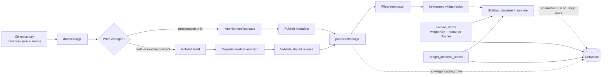
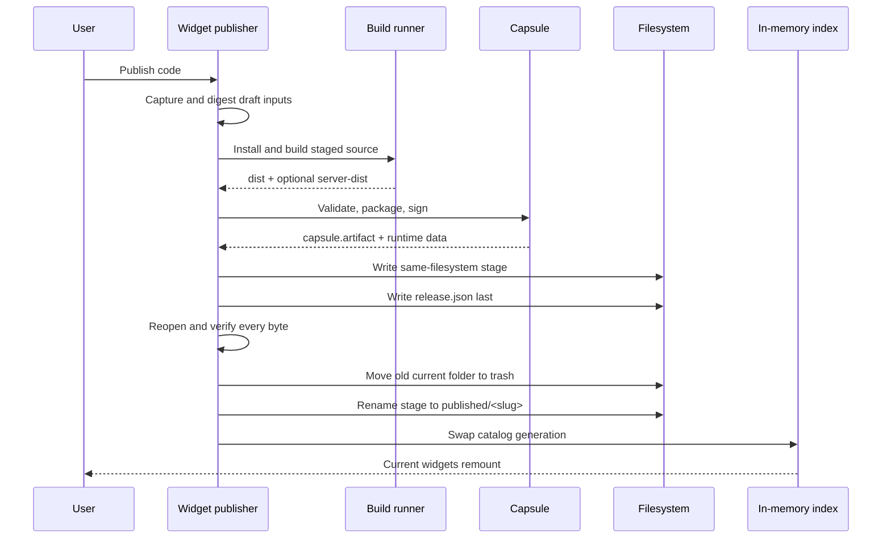
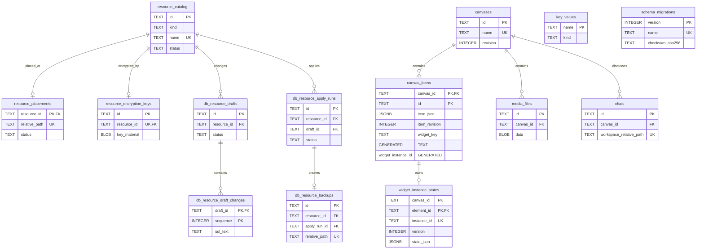

# Filesystem-first widget design

**Status:** Approved target design from [E41](../../tasks/e/E41.md), plus the
later single-user and clean-baseline decisions in this report. Not yet
implemented. Where E41 differs, this report is the target.

**Audience:** Omnidraw programmers working on widgets, CanvasService, Capsule,
resources, functions, the database, or the widget UI.

## Summary

Widgets move out of the control database.

A widget repository contains source code and one `omnidraw.json`. That folder
is enough to share the widget through GitHub. Omnidraw builds it and writes one
current published folder. On startup, Omnidraw scans those folders and builds
the widget catalog in memory.

The database still stores canvases, widget-instance state, resources, media,
key-value data, and chat history. It no longer stores users, organizations,
memberships, widget definitions, revisions, artifacts, Preview records,
function runs, or usage records.

The main rule is:

> Authored widget facts live in `omnidraw.json`. Executable widget bytes live in
> the published folder. Neither is copied into the database.

The cut removes 25 of the current 39 database tables. The target database has
14 tables.

## Goals

- A Git repository can be copied to a clean Omnidraw install and built without
  an old Omnidraw database.
- `omnidraw.json` owns the widget name, key, description, icon, tool label,
  group, order, runtime requests, state mode, server entry, and resource needs.
- Startup finds drafts and publications from the filesystem.
- A presentation-only edit does not run npm, rebuild `dist/`, or rebuild
  Capsule bytes.
- A code or runtime-contract edit always needs a new build.
- Capsule still isolates third-party browser code.
- Server functions remain useful, but calls are short-lived and leave no run
  history.
- The database and widget filesystem have no tenant, account, organization, or
  membership scope. Omnidraw is a single-user application.
- The final design has one source of truth for each fact.

## Non-goals

- Keeping old database readers or dual writes.
- Keeping immutable release history or rollback releases.
- Keeping function queues, retries, run logs, usage, or billing data.
- Changing Capsule internals.
- Moving canvas, resource, media, key-value, or chat persistence out of the
  database.

## Design at a glance



## Source-of-truth rules

| Fact | Source of truth | Not a source of truth |
| --- | --- | --- |
| Widget key and presentation | `omnidraw.json` | Database, `release.json`, UI cache |
| Editable source | Draft repository | Published folder, database artifact |
| Current executable code | Published files | Draft `dist/`, database blob |
| Release checks | `release.json`, derived from published bytes | Authored metadata |
| Widget catalog | Current filesystem scan | Database table |
| Placed widget identity | `canvas_items.item_json` | `widget_instances` row |
| Shared instance state | `widget_instance_states` | Widget manifest, browser memory |
| Portable resource needs | `omnidraw.json` | Local resource binding row |
| Local resource choice | Canvas item | Portable manifest |
| Preview state | Current process and temporary files | Database |
| Function result and logs | Current response only | Database history |

`release.json` is generated output. It may be deleted and rebuilt from the
manifest and published files. It must never add a product feature that is
missing from `omnidraw.json`.

## Filesystem layout

Widgets live under one application root:

```text
<home>/widgets/
  drafts/
    <slug>/
      omnidraw.json
      package.json
      package-lock.json
      ui/
      server/                    # optional
      shared/                    # optional
      dist/                      # generated browser output
      server-dist/               # generated server output; optional

  published/
    <slug>/
      omnidraw.json              # published authored config
      dist/                      # exact closed browser output
      server-dist/               # optional
      functions.json             # generated; optional
      capsule.artifact           # exact signed Capsule bytes
      release.json               # checks and completion marker

  .staging/                      # incomplete writes; never scanned
  .preview/                      # temporary Preview output
  .trash/                        # recoverable deletes and replaced folders
  .quarantine/                   # folders moved by doctor/import tools
  .writer.lock                   # one writer for the widget root
```

### Folder rules

- `slug` is the portable widget key and the folder name.
- A slug uses lowercase ASCII kebab-case and is 1-100 bytes.
- The folder name and manifest slug must match.
- One draft and one publication may share a slug. They are two forms of the
  same widget.
- A second draft or publication with the same slug is rejected.
- Display names may repeat. Slugs may not.
- Symlinks, junctions, special files, traversal, absolute manifest paths, and
  case collisions fail closed.
- A Git checkout may live directly in `drafts/<slug>`.
- Importing an external checkout copies it into the managed draft root. The
  first version does not keep external links.
- Published folders are managed output. External changes require an explicit
  refresh and full validation before Omnidraw uses them.

## Portable manifest

Manifest v1 adds presentation metadata to the current strict runtime contract.
Unknown fields are errors.

```json
{
  "$schema": "https://omnidraw.dev/schemas/widget/v1.json",
  "schemaVersion": 1,
  "name": "Counter",
  "slug": "counter",
  "description": "A shared counter.",
  "tool": {
    "label": "Counter",
    "icon": { "lucidIcon": "Gauge" },
    "group": "utilities",
    "priority": 0
  },
  "ui": {
    "runtime": "capsule",
    "entry": "ui/main.ts",
    "apis": ["DOM"],
    "budgets": {
      "cpuMs": 20,
      "memoryBytes": 33554432
    },
    "state": {
      "collaborative": true,
      "localStore": "none"
    },
    "parkability": { "enabled": false }
  },
  "server": {
    "entry": "server/main.ts",
    "runtimeAbi": "bun-v1"
  },
  "resources": [
    {
      "slot": "todos",
      "kind": "kv",
      "effect": "read_write",
      "required": true
    }
  ]
}
```

### Presentation fields

These fields may change without rebuilding executable output:

- `$schema`
- `name`
- `description`
- `tool.label`
- `tool.icon`
- `tool.group`
- `tool.priority`

`tool.group` is a portable string, not a database ID. The sidebar creates group
buckets from the strings it finds. There is no separate group registry, group
icon, or group order record.

The icon reuses `TOmnidrawToolIcon`:

- `lucidIcon` uses the Lucide list pinned by manifest schema v4.
- `svgIcon` may contain a small SVG or one text grapheme.
- Custom icon text is limited to 16 KiB.
- SVG is checked on save and sanitized again before rendering.

### Identity field

`slug` is identity, not presentation. A draft-only slug may be renamed with a
safe folder-and-manifest operation. A published slug is immutable. A published
rename creates a new widget key and needs explicit canvas rebinding.

### Executable fields

These fields affect build or runtime behavior:

- `schemaVersion`
- `ui`
- `server`
- `resources`

Changing any of them needs a new code publication.

Resource entries describe portable slots and allowed effects. They never
contain a local resource ID.

## Change handling

Every edit is placed in one class:

| Class | Example | Action |
| --- | --- | --- |
| Presentation | Name, description, icon, label, group, priority | Save config; optional Publish metadata |
| Identity | Slug or folder name | Draft rename or new publication |
| Executable | UI/server/shared source, APIs, budgets, state | Build and publish |
| Dependency | Lockfile, package dependency, build script/config | Install, build, publish |
| Resource contract | Slot, kind, effect, required flag | Build, choose resources, publish |
| Invalid | Bad schema, unsafe path, oversized file | Reject |
| Unknown | A changed input not proven safe to reuse | Build and publish |

Unknown changes rebuild. Reuse is allowed only when Omnidraw can prove that the
executable input is the same.

### Executable input digest

The build key is a SHA-256 digest over:

1. a canonical manifest object containing only `schemaVersion`, `ui`, `server`,
   and `resources`;
2. the path, length, and bytes of every file visible to the build; and
3. the build environment: package manager, lock format, SDK/import map,
   Omnidraw transforms, runner, platform, Capsule build, policy, and server ABI.

The full presentation-bearing manifest is not copied into the build tree.
Omnidraw writes a generated `.omnidraw/build-manifest.json` containing only the
executable fields. Build scripts run in that staged tree, not in the mutable
draft folder.

This rule is what makes an icon edit safe to publish without rebuilding.

## Build and publication

### Code publication



`dist/` is the closed browser distribution made by the widget project.
`capsule.artifact` is separate because Capsule is still the browser security
boundary. `server-dist/` and `functions.json` exist only for widgets with a
server entry.

Remote GitHub imports use the isolated Docker runner by default. Host build is
allowed only after an explicit local trust choice. Capsule protects the browser
runtime; it does not protect npm install, build scripts, or server code.

### Metadata publication

Metadata publication is intentionally small:

1. Parse the new manifest.
2. Hash its executable fields.
3. Compare that digest with `release.json`.
4. Check that the current host can still run the published Capsule artifact.
5. Atomically replace published `omnidraw.json`.
6. Refresh the in-memory index.

It does not write `dist/`, `server-dist/`, `functions.json`,
`capsule.artifact`, or `release.json`.

### Minimal `release.json`

`release.json` contains only generated runtime checks:

- format and `complete: true`;
- executable-manifest digest;
- sorted path, byte size, and SHA-256 for every runtime file;
- Capsule artifact path, hash, and runtime descriptor; and
- optional server entry, ABI, function file, and digests.

It has no widget name, description, icon, group, revision number, database ID,
random release ID, timestamp, active pointer, or retention state.

## Startup and runtime lookup

Startup scans `drafts/` and `published/` once. Omnidraw actions refresh the
index directly. Changes made by an external editor or Git need the Refresh
action or `omnidraw widget refresh`; the first version does not use a recursive
watcher.

For each publication, startup checks:

1. safe folder and file types;
2. folder slug equals manifest slug;
3. strict manifest v1;
4. `release.json` completion and executable-manifest digest;
5. exact file list, byte sizes, and hashes;
6. Capsule artifact hash, signature, runtime descriptor, and host policy; and
7. optional server output and function descriptors.

A bad publication appears as an unhealthy catalog entry. It cannot be placed or
mounted. Other widgets continue to work. Startup does not silently move it;
`doctor --quarantine` performs that explicit action.

Runtime lookup uses `widgetKey` to find the current validated publication. It
captures the current index generation, opens and checks exact files, then
checks the canvas item and index generation again before mounting. A publish
invalidates the old generation and remounts every live instance of that key.

## Canvas identity and widget state

A placed widget stores this data inside its canvas item:

```json
{
  "type": "widget-instance",
  "widgetKey": "counter",
  "instanceId": "01J...",
  "resourceBindings": {
    "todos": {
      "resourceId": "resource-1",
      "allowRead": true,
      "allowWrite": true
    }
  }
}
```

It does not store a definition ID, revision ID, artifact ID, path, or release
checksum.

There is one current publication per `widgetKey`, so all placed instances follow
new code after publish. Geometry, local resource choices, and instance state do
not change when the code changes.

If the folder is missing or bad, the canvas keeps the item and renders a clear
missing-widget frame. Restoring a valid folder makes the widget usable again.

`WidgetStateService` stays the only owner of shared widget-instance JSON state.
Removing `widget_instances` must not move that state into the canvas item or
browser memory.

## Preview

Preview stays full-stack, but it is not durable.

The current process owns:

- build status;
- temporary Capsule bytes and source maps;
- live diagnostics;
- selected Preview resources;
- signing work; and
- mounted handles.

The canvas Preview frame stores only the draft `widgetKey` and normal frame
data. After restart it shows **Preview stopped — build again**. It does not
pretend to restore an old exact build.

Publish may reuse the exact validated `dist/`, server output, descriptors, and
unsigned Capsule construction when the draft digest still matches. Release
signing can change the outer signed bytes without rerunning widget code.

Metadata-only changes do not need Preview.

## Direct server functions

Server functions remain, but only as one live request and one live response.

The runtime:

- resolves the current canvas item and published folder;
- checks the function descriptor and input schema;
- captures the allowed resources;
- starts one short-lived child;
- enforces a descriptor timeout with a hard 30-second maximum;
- forwards live cancellation;
- kills and reaps a stuck child;
- checks the output schema;
- returns at most 64 KiB of response diagnostics; and
- forgets the call after it finishes.

There is no database queue. When the live concurrency limit is full, the call
returns `RESOURCE_EXHAUSTED`.

There is no automatic retry and no durable idempotency. In particular, the SDK
must not retry a write after an unclear network failure.

Resource access remains:

```text
manifest slot limit
  ∩ canvas item resource choice
  ∩ function effect
  = live resource access
```

Write permits become short-lived, single-use in-memory tokens. They are not
database rows.

The Runs and Logs tabs and the get/status/cancel/log/attempt/usage APIs are
removed. The Functions tab may remain as a read-only view of the current
generated descriptors.

## Target database

### Table count

The current schema has:

- 39 tables;
- 510 columns;
- 101 foreign keys; and
- 79 indexes.

The target has exactly 14 tables and no more than 25 indexes. It deletes 25
tables, 387 current columns, 73 current foreign keys, and 57 current indexes
before the kept tables are reshaped.

These numbers come from the current expected-schema contract. They are a
review aid, not a reason to preserve obsolete columns.

### Kept tables

| Area | Tables | Change |
| --- | --- | --- |
| Canvas | `canvases`, `canvas_items` | Remove access fields and reshape widget fields in `canvas_items` |
| Widget state | `widget_instance_states` | Rekey to the canvas item |
| Resources | `resource_catalog`, `resource_placements`, `resource_encryption_keys`, `db_resource_drafts`, `db_resource_draft_changes`, `db_resource_apply_runs`, `db_resource_backups` | Remove tenant keys; keep resource behavior |
| Other app data | `key_values`, `media_files`, `chats`, `schema_migrations` | Remove tenant keys; rename `agent_chats` to `chats` |

There are no `accounts`, `organizations`, `organization_memberships`, or
`canvas_members` tables. There are also no `org_id`, `account_id`, owner,
role, seat, invite, or access-policy columns. Single-user is a schema rule, not
a special organization row.

### Turso schema rules

The baseline uses the current Turso type system described in
[the local Turso guide](../external/llm.turso.md), especially Turso's
[data types](https://docs.turso.tech/sql-reference/data-types) and
[date/time functions](https://docs.turso.tech/sql-reference/functions/date-time):

- Every application table is `STRICT`.
- Wall-clock columns use the built-in `TIMESTAMP` custom type. Values are UTC
  ISO-8601 timestamps at whole-second precision. Turso stores this type as
  validated text; callers must not write JavaScript millisecond integers.
- Wall-clock names end in `_at_sec`: `created_at_sec`,
  `updated_at_sec`, `completed_at_sec`, and so on. The suffix states the
  precision contract; it does not mean the value is stored as an integer.
- Defaults use `CURRENT_TIMESTAMP`. Code that needs Unix seconds uses
  `unixepoch(timestamp_column)`.
- `updated_at_sec` gets its insert default from the database. Each write
  transaction sets it to `CURRENT_TIMESTAMP`; there is no hidden update
  trigger.
- Durations may still end in `_ms`, for example `timeout_ms`. They are
  intervals, not wall-clock timestamps.
- Queryable document data uses `JSONB`. Small validated JSON values may use
  `JSON` when binary lookup brings no value.
- Flags use `BOOLEAN`, not hand-written integer checks.
- Repeated validation uses `CREATE DOMAIN`; simple bounded text may use
  `VARCHAR(N)`.
- Generated columns expose indexed fields from `JSONB`, such as
  `canvas_items.widget_key`. They do not duplicate authority.

Custom types and generated columns are intentional Turso features. Database
startup and every schema test must enable the same pinned feature set. Arrays,
structs, unions, materialized views, and sequences are not added just because
they exist; none makes this schema simpler.

Every old persisted wall-clock column ending in `_ms` is rewritten to
`TIMESTAMP` and renamed to `_sec`. This includes
`schema_migrations.applied_at_sec` and
`db_resource_backups.delete_after_sec`. Timestamp ordering checks remain,
for example `updated_at_sec >= created_at_sec`. Integer duration fields keep
their `_ms` suffix.

### Table shape

This is the complete target table list. “Reference” lists only durable
foreign-key relationships.

| Table | Primary key | Main data | References |
| --- | --- | --- | --- |
| `canvases` | `id` | name, revision, timestamps | — |
| `canvas_items` | `(canvas_id, id)` | item JSONB, item revision, generated lookup fields | `canvas_id -> canvases.id` |
| `widget_instance_states` | `(canvas_id, element_id)` | stable instance ID, version, state JSONB | canvas item |
| `resource_catalog` | `id` | kind, unique name, status, last error | — |
| `resource_placements` | `resource_id` | cell, epoch, unique relative path, status | resource |
| `resource_encryption_keys` | `id` | unique resource ID, purpose, algorithm, key bytes | resource |
| `db_resource_drafts` | `id` | resource ID, name, status, last error | resource |
| `db_resource_draft_changes` | `(draft_id, sequence)` | operation JSONB, SQL, timestamp | draft |
| `db_resource_apply_runs` | `id` | resource ID, optional draft/source run, status | resource, draft, source run |
| `db_resource_backups` | `id` | resource/run IDs, unique relative path, digest, size, state | resource, apply run |
| `key_values` | `name` | one typed value, timestamps | — |
| `media_files` | `id` | optional canvas ID, hash, MIME type, bytes | canvas |
| `chats` | `id` | optional canvas ID, name, status, unique workspace/history paths | canvas |
| `schema_migrations` | `version` | name, checksum, applied timestamp, app version | — |

### Target schema map

This diagram shows the load-bearing foreign keys. It leaves out timestamps and
some non-key fields so the relationships stay readable.



### Reshaped widget tables

The rewritten baseline keeps the useful JSON checks and removes all tenant
keys. The important target shape is:

```sql
CREATE TABLE canvas_items (
  canvas_id TEXT NOT NULL,
  id TEXT NOT NULL,
  item_json JSONB NOT NULL,
  item_revision INTEGER NOT NULL DEFAULT 0 CHECK (item_revision >= 0),
  created_at_sec TIMESTAMP NOT NULL DEFAULT CURRENT_TIMESTAMP,
  updated_at_sec TIMESTAMP NOT NULL DEFAULT CURRENT_TIMESTAMP,

  kind TEXT GENERATED ALWAYS AS (
    json_extract(item_json, '$.kind')
  ) VIRTUAL NOT NULL,
  parent_id TEXT GENERATED ALWAYS AS (
    json_extract(item_json, '$.parentId')
  ) VIRTUAL,
  order_key TEXT GENERATED ALWAYS AS (
    json_extract(item_json, '$.orderKey')
  ) VIRTUAL NOT NULL,
  widget_instance_id TEXT GENERATED ALWAYS AS (
    CASE
      WHEN json_extract(
        item_json,
        '$.extensions."omnidraw:widget".type'
      ) = 'widget-instance'
      THEN json_extract(
        item_json,
        '$.extensions."omnidraw:widget".instanceId'
      )
      ELSE NULL
    END
  ) VIRTUAL,
  widget_key TEXT GENERATED ALWAYS AS (
    CASE
      WHEN json_extract(
        item_json,
        '$.extensions."omnidraw:widget".type'
      ) = 'widget-instance'
      THEN json_extract(
        item_json,
        '$.extensions."omnidraw:widget".widgetKey'
      )
      ELSE NULL
    END
  ) VIRTUAL,

  PRIMARY KEY (canvas_id, id),
  FOREIGN KEY (canvas_id)
    REFERENCES canvases (id) ON DELETE CASCADE,
  CHECK (updated_at_sec >= created_at_sec)
) STRICT;

CREATE TABLE widget_instance_states (
  canvas_id TEXT NOT NULL,
  element_id TEXT NOT NULL,
  instance_id TEXT NOT NULL,
  version INTEGER NOT NULL DEFAULT 1,
  state_json JSONB NOT NULL,
  created_at_sec TIMESTAMP NOT NULL DEFAULT CURRENT_TIMESTAMP,
  updated_at_sec TIMESTAMP NOT NULL DEFAULT CURRENT_TIMESTAMP,

  PRIMARY KEY (canvas_id, element_id),
  UNIQUE (instance_id),
  FOREIGN KEY (canvas_id, element_id)
    REFERENCES canvas_items (canvas_id, id) ON DELETE CASCADE,
  CHECK (version >= 1),
  CHECK (updated_at_sec >= created_at_sec)
) STRICT;
```

Index only real lookup paths:

- unique names, paths, and `instance_id` use table-level `UNIQUE`
  constraints;
- partial indexes cover non-null `canvas_items.widget_key`,
  `canvas_items.widget_instance_id`, `media_files.canvas_id`, and
  `chats.canvas_id`;
- resource child tables index their resource, draft, and apply-run foreign
  keys when those keys are used for listing; and
- JSONB bodies are not indexed directly. Add a generated column when a JSON
  field becomes a real query key.

There are no organization, membership, account, role, or owner indexes.

`CanvasService` remains the only owner of durable canvas items.
`WidgetStateService` checks that the item still has the same `instanceId`
before reading or changing state.

### Deleted tables

| Area | Tables removed |
| --- | --- |
| Identity and access | `accounts`, `organizations`, `organization_memberships`, `canvas_members` |
| Widget catalog and releases | `widget_definitions`, `widget_definition_revisions`, `widget_revision_sources`, `artifact_references` |
| Duplicate instance data | `widget_instances` |
| Revision resource links and groups | `resource_bindings`, `tool_groups` |
| Draft and Preview control | `agent_drafts`, `agent_previews`, `agent_preview_revisions`, `agent_preview_resource_bindings`, `agent_preview_mount_leases`, `agent_preview_source_maps`, `widget_preview_publication_idempotency` |
| Functions | `function_definitions`, `function_invocations`, `function_attempts`, `invocation_leases`, `idempotency_records`, `resource_write_permits` |
| Usage | `usage_outbox` |

Removing a table also means removing its store methods, services, APIs, events,
recovery jobs, tests, schema checks, fixtures, UI text, and package exports.
Leaving dead code behind is not part of the cut.

## Migration

There is no upgrade migration. No app has been deployed, so preserving an old
database would add work without protecting user data.

Rewrite the current migration set in place:

1. Replace `000-initial.sql` with the 14-table single-user baseline.
2. Fold any still-needed constraints from `001` through `006` into that
   baseline.
3. Remove `001-widget-revision-sequence.sql` through
   `006-preview-source-maps.sql`. Their features are removed by this design.
4. Regenerate the embedded migration source, expected-schema contract,
   fingerprints, fixtures, and baseline tests from the new file.
5. Update stores and test helpers to use the new keys, `chats`, and
   `TIMESTAMP` values.

Do not create `007`, an export receipt, a compatibility view, a dual-write
path, or an old-to-new data copier.

Existing developer databases are disposable. Startup must reject an old
fingerprint with a direct message telling the programmer to run the explicit
development database reset. It must not guess that an unknown database is safe
to rewrite. A fresh start applies the new `000-initial.sql` only.

Old local widget artifact folders are also development data. A separate,
explicit developer cleanup command may move known obsolete widget artifact
paths to trash. It is not a schema migration and it must never delete the
whole Omnidraw home, resource data, media, or the new `<home>/widgets/` root.

## Failure behavior

| Failure | Result |
| --- | --- |
| Bad draft manifest | Draft stays visible with an error; build is blocked |
| Bad published manifest or checksum | Publication is unhealthy; mount is blocked |
| Missing published folder | Canvas item remains and shows a missing-widget frame |
| Crash while writing stage | Dot-prefixed stage is ignored |
| Crash after moving old current folder | Startup restores the one verified replaced folder or asks for `doctor` when unclear |
| Stale config save | Expected manifest digest fails; user refreshes and retries |
| Two writers | Second writer cannot take `.writer.lock` |
| Full function concurrency | Call fails with `RESOURCE_EXHAUSTED`; no queue row is created |
| Function timeout or disconnect | Child is stopped and reaped; no history remains |
| External published edit | Running index does not adopt it until explicit refresh and validation |
| Old local database fingerprint | Startup refuses it and points to the explicit development reset |

## Essential complexity

Most of this design is file scanning and simple data mapping. The following
parts are the real hard parts and should stay easy to find in the code.

### 1. Build trust

Widget repositories may run npm lifecycle hooks and project build scripts.
Capsule does not protect the build machine. Remote imports therefore need an
isolated runner by default, and host builds need a clear local trust choice.

This trust choice is local security policy. It is not portable widget metadata.

### 2. Atomic publication

A published widget is several files, but the product must see either the old
complete folder or the new complete folder. Staging, file sync, validation,
same-filesystem rename, and crash recovery are required. A partial folder must
never become current.

### 3. Presentation versus executable identity

The system must prove that an icon or label cannot affect built code. That is
why the build runs without the authored manifest and sees only a generated
runtime-only manifest. A broad source hash alone is not enough.

### 4. Runtime byte checks

The database no longer guards artifact identity. Startup and runtime load must
check exact files, Capsule signatures, and the current catalog generation. A
bad widget must fail alone without damaging canvas state.

### 5. Current code versus stable instance data

Canvas items follow the current publication, while `instanceId`, resource
choices, geometry, and shared JSON state stay stable. Publishing code must
remount runtime handles without replacing user data.

### 6. Direct writes to resources

Removing durable function runs also removes durable idempotency. A resource
write can finish even when the caller loses the response. The SDK must not hide
that fact with an automatic retry. Effect checks and single-use live write
tokens are still required.

## What should remain simple

- Catalog rows are pure results of a filesystem scan.
- Grouping is a string comparison, not a registry service.
- A canvas widget points to one `widgetKey`.
- There is one current publication, not a release graph.
- Metadata publication is one checked manifest write.
- Function execution is one child and one response, not a job system.
- Preview dies with the process.
- Generated release data never becomes authored product data.

If implementation adds database caches, release pointers, background function
queues, durable Preview rows, or compatibility reads, it has moved away from
this design.

## Main code ownership after the cut

| Area | Main owner |
| --- | --- |
| Portable manifest, artifact, guest ABI, function/resource/state contracts, and Capsule host bridge | `packages/sdk` |
| Draft workspaces, scan, build, publication, ephemeral Preview authority, signing, and trusted local functions | `apps/backend` |
| Canvas document, command, query, snapshot, event, and widget-frame codecs | `packages/canvas-contract` |
| Canvas browser client, optimistic state, rendering, and widget extension seam | `packages/canvas` |
| Shared instance JSON state, resource catalog/data, database schema, and persistence | `apps/backend` |
| Widget inspector, sidebar, placement, Preview mounting, and browser transport adapters | `apps/frontend` |
| Reusable AI Chat UI and narrow Canvas contribution | `packages/component-ai-chat` |
| Public theme tokens, CSS, and scoped DOM projection | `packages/theme` |
| Private request/stream transport | `apps/backend` Effect RPC server and `apps/frontend` multiplexed WebSocket client |

Portable rules should be small pure functions. Filesystem reads belong at the
edge. Atomic writes, process launch, signing, and database changes are explicit
write operations. UI and API code should call these rules rather than copy
them.

## Acceptance checks

The cut is done only when all of these are true:

- A clean database with only the 14 target tables starts with a preseeded
  filesystem widget and mounts it.
- The migration directory has one rewritten baseline and no new upgrade
  migration.
- Metadata publication invokes no package manager, build command, Capsule
  construction, or signing operation.
- Every executable published file has the same bytes before and after metadata
  publication.
- A code, lockfile, runtime request, resource contract, or unknown build-input
  change forces a build.
- Startup isolates bad folders and continues serving good widgets.
- A crash at every publication step exposes no partial current release.
- A canvas item follows new published code while keeping state and bindings.
- Direct functions enforce schema, timeout, cancellation, concurrency, and
  resource effects without writing run/history/usage rows.
- The final schema contains exactly 14 tables and none of the 25 deleted names.
- Schema inspection finds no account, organization, membership, canvas-member,
  `org_id`, or `account_id` structure.
- The table is named `chats`; `agent_chats` does not exist.
- Persisted wall-clock fields use `TIMESTAMP` and `_at_sec`; no
  wall-clock `_at_ms` columns remain.
- Repository search finds no public promise of widget revisions, artifact
  authority, durable Preview, function run history, or usage accounting.
