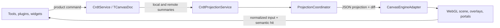

# Canvas Package Architecture

`@vibecanvas/canvas` is an Automerge-authoritative collaborative editor. The
canvas engine is a private rendering and interaction implementation detail.
Product code operates on stable element/group IDs, semantic targets, and
persisted data.

## Authority and data flow



- `TCanvasDoc` is the sole durable authority.
- Local previews are owner-scoped engine transients. They never enter CRDT or
  history.
- Every successful durable write returns to the view through the same
  projection path as a remote write.
- Projection is derived and read-only. A projector failure creates a visible,
  selectable placeholder and never deletes or repairs product data.
- Persisted rotations remain degrees. Projection converts them to engine
  radians.
- Persisted string `zIndex` values become engine `orderKey` values unchanged.

## Composition and lifecycle

[`src/runtime.ts`](src/runtime.ts) is the composition root. Runtime boot:

1. applies built-in and extension plugins in dependency order;
2. starts services in numeric `startOrder`;
3. calls the canvas initialization hooks.

Shutdown calls product/plugin cleanup first, then stops services in reverse
start order. `CanvasRuntimeLifecycle` serializes replacement when the active
document changes so an old runtime is fully released before its successor
owns the host.

`SceneService` is the production scene owner. It composes:

- `CanvasEngineAdapter`;
- camera and normalized-input bridges;
- `ProjectionCoordinator` and `CrdtProjectionService`;
- product geometry, interaction, transform, and transient services;
- portal content, image resources, resize, theme/extension reprojection,
  diagnostics, and teardown.

No stage, layer, renderer node, controller, resource handle, or portal host
escapes that boundary. Engine runtime imports are restricted to
`src/engine/**`.

## Projection

`src/engine/projection` contains deterministic projection functions and the
registry/index:

- stable namespaced IDs distinguish product groups, semantic element roots,
  derived children, resources, portals, and transients;
- built-in projectors cover every current element discriminator;
- groups are topologically ordered and preserve parent-local coordinates;
- projection output is JSON-only, validated, and deeply frozen;
- `ProjectionIndex` maps engine hits back to semantic product targets;
- semantic diffing emits atomic node, ownership, order, and reparent commands.

`ProjectionCoordinator` serializes revisions, rejects stale revisions, keeps
the last good projection on recoverable errors, rolls ownership back when an
apply fails, and prunes selection/focus after authoritative changes. A bounded
full projection exists for structural recovery; ordinary element changes use
incremental commands.

## Product interaction

Plugins remain product-policy shells:

- `ToolService` owns renderer-neutral tool sessions.
- Creation tools build transient previews and commit existing element payloads.
- `SelectionService`, `ContextMenuService`, and style menus use semantic
  element/group targets.
- Product transform services convert engine proposals into existing CRDT
  patches and product history.
- `CanvasActiveSessionService` cancels dependent local gestures before a
  conflicting remote revision projects.
- Group, order, and clone operations work from `TCanvasDoc`. Cangine path
  gestures hand tagged connector changes back to CRDT before projection.

Engine pointer capture, picking, marquee, coordinate conversion, transform
proposals, and text-edit geometry are exposed only through canvas-owned
contracts.

## Resources, portals, and widgets

Image bytes remain backend-owned. Projection describes versioned image
resources; the adapter stages, shares, replaces, and releases their engine
ownership. Product callbacks still own upload, clone, and delete side effects.

Widget DOM remains application-owned. Projection creates a widget frame and
portal description, while `CanvasPortalService` mounts content into the
canvas-owned host context. Portal content does not receive an engine object.
Placement previews are portal-free transient widget frames and remain visible
through asynchronous commit handoff.

## Extension contract

Extensions can register product element definitions, projectors, services,
plugins, tools, and portal content through canvas-owned types. They cannot
receive raw renderer objects. Registration invalidation triggers a derived
reprojection of the current document.

## Testing boundaries

- Pure projection/semantic tests assert JSON data, signatures, bounds, order,
  and product patches.
- Adapter tests use only public engine exports.
- Product tests assert CRDT, history, semantic selection, ownership, and
  cleanup—not private draw calls.
- Production `SceneService` tests inject the public engine test backend through
  the composition seam.
- `tests/contracts/engine-import-boundary.test.ts` guards engine containment.

Run:

```sh
bun run --cwd packages/canvas test
bun run --cwd packages/canvas test:perf
bunx tsc -p packages/canvas/tsconfig.json --noEmit
bun run lint:functional-core:agent
```
