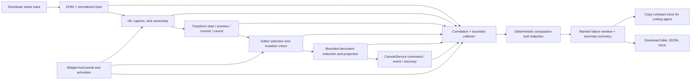

# A100 - canvas: developer reproduction trace recorder
[Overview](../BASED.md)

Add an author-only tracing tool to the canvas toolbar that captures a compact,
correlated account of Vibecanvas internals while a developer manually
reproduces a canvas or widget-host bug, then copies the evidence into a coding
agent chat.

## Context

Subtle interaction bugs can disappear between browser input, Cangine
interaction state, editor mutation planning, the optimistic canvas document,
CanvasService transport, and widget-host ownership. A developer can often see
the failure but cannot communicate which boundary dropped or changed the
expected action. Console logs added after the report also require another
guess-and-reproduce cycle.

The requested tool is not product analytics, user support recording, widget
business-session recording, video capture, or general browser replay. It is a
development instrument for the author of Vibecanvas. Widget behavior matters
only where the Vibecanvas host owns or mediates it, such as portal focus,
pointer capture, activation, transform policy, canvas mutations, and relevant
host transport.

The current architecture has explicit observation points:

- [`Canvas.tsx`](../../packages/canvas/src/components/Canvas.tsx) owns the
  browser input boundary, active runtime, editor/camera/scene subscriptions, and
  toolbar wiring.
- [`FloatingCanvasToolbar/index.tsx`](../../packages/canvas/src/components/FloatingCanvasToolbar/index.tsx)
  owns the compact editor controls where the development trace control belongs.
- [`runtime.ts`](../../packages/canvas/src/runtime.ts) composes Cangine input,
  transforms, the standard editor, the document service, and optional
  extensions.
- [`CanvasDocumentService.ts`](../../packages/canvas/src/services/CanvasDocumentService.ts)
  is the only optimistic document and durable canvas command boundary. It
  already has bounded affected-node before/after images, transaction IDs,
  command IDs, projection revisions, acknowledgements, and recovery decisions.
- [`canvas-document-transport.ts`](../../apps/frontend/src/services/canvas-document-transport.ts)
  is the typed frontend edge for CanvasService snapshot, command, and event
  traffic.
- [`canvas-extension/index.ts`](../../packages/ui-ai-chat/src/canvas-extension/index.ts)
  owns widget portal reconciliation, widget interaction activation, placement,
  and host-side widget behavior.
- [`extension.ts`](../../packages/canvas/src/extension.ts) is the narrow seam
  through which widget-host diagnostics can join the same trace without a
  global mutable logger.

Repository history contained a development recorder that stored normalized
input plus CRDT writes. That shape is no longer sufficient: CRDT is no longer
the canvas authority, raw input does not reveal transform/editor decisions,
and the old recording did not correlate the local document with typed server
traffic.

Do not use Cangine's optional scene journal as the complete implementation. It
records committed durable scene transactions, so it cannot explain a gesture
that failed before a commit. It also does not cover typed API or widget-host
boundaries. Enabling it solely for this feature would conflict with
[`ARCHITECTURE.md`](../../packages/canvas/ARCHITECTURE.md) and the synchronous
path rules in [`PERFORMANCE.md`](../../packages/canvas/PERFORMANCE.md).

## Plan

A separate product mockup is not useful for this task. The control should reuse
the existing toolbar button, divider, active, disabled, and compact-panel
patterns. The flow and trace contract carry more design risk than the pixels.

### 1. Define one versioned developer trace contract

- Add a canvas-local diagnostic trace contract with a schema version and a
  common immutable envelope:
  - monotonically increasing sequence;
  - monotonic elapsed time from trace start;
  - channel and semantic event type;
  - optional gesture, pointer, node, widget, transaction, command, and canvas
    correlation IDs;
  - bounded event data;
  - priority used only for retention, never exposed as application behavior.
- Use technical channels:
  - `input.dom`: pointer/key phase, buttons, modifiers, coordinates, semantic
    target path, and pointer-capture changes;
  - `input.engine`: normalized Cangine input and relevant hit/disposition data;
  - `picking`: hit target, selected target, widget boundary, and interaction
    owner changes;
  - `transform`: gesture start, activation threshold, preview/proposal,
    commit, and cancel;
  - `editor`: active tool, selection, widget focus/interaction state, and
    mutation intent;
  - `document`: local request, bounded affected-node changes, durable plan,
    pending state, projection, acknowledgement, invalidation, and recovery;
  - `transport`: only typed canvas snapshot/execute/event boundaries, duration,
    revisions, and normalized failure;
  - `widget-host`: portal lifecycle, activation, presentation ownership, and
    host-mediated placement or canvas actions;
  - `system`: runtime lifecycle, trace omissions, callback errors, and internal
    invariant failures.
- Keep names semantic and stable. Never serialize browser event objects,
  services, DOM nodes, Maps, Errors, or other runtime objects directly.
- Include bounded environment metadata in the header: application/package
  version when available, build mode, trace schema, canvas ID, Cangine version,
  browser/platform summary, viewport, device-pixel ratio, enabled channels,
  start time, and configured budgets. Use `unknown` instead of inventing
  unavailable build identity.
- Keep reusable trace types in the folder's single `typed.ts` or
  `interface.ts`; keep one-function `TPortal`/`TArgs` types local according to
  the repository functional-file rules.

### 2. Build an explicit, inert-by-default trace sink

- Create one canvas-local trace owner through a factory/closure with explicit
  `start`, `mark`, `stop`, `clear`, `copy`, `download`, `emit`, and
  subscription/state methods. Prefer small functions and explicit state over a
  general event bus or class hierarchy.
- Inject the sink through the canvas runtime/document/extension composition
  boundary. Do not introduce a global singleton, patch browser prototypes, or
  monkeypatch `fetch`.
- Do not construct the tool, install capture subscriptions, or render its UI
  in production. Gate it at the development composition boundary with a
  testable environment/diagnostics decision.
- In development, remain inert until the author presses Record. Install and
  release high-frequency subscriptions with the recording lifecycle where
  practical.
- Add an optional, non-throwing observer to `CanvasDocumentService` for stable
  document lifecycle facts. A document observer failure must be isolated and
  must never reject, recover, or alter a canvas mutation.
- Keep the latency-sensitive commit path constant-time with respect to canvas
  size. It may enqueue a small envelope containing already-available bounded
  references/facts; it must not stringify, copy the scene, scan all nodes,
  await work, capture screenshots, or enable the Cangine journal there.
- Serialize, compact, summarize, calculate byte size, access the clipboard, and
  create download blobs outside the synchronous mutation path.
- Keep feature-local deterministic rules in sibling `fn.*.ts` files and
  browser writes in `tx.*.ts` files. Use `/core` only if trace logic becomes
  genuinely shared beyond this feature.

### 3. Capture the causal boundaries needed for interaction bugs

- At the DOM boundary, capture only fields that affect routing and gesture
  meaning: event phase, pointer identity/type, button/buttons, modifiers,
  client/viewport coordinates, cancellation/default state, semantic target,
  and capture owner. Describe a target through bounded stable attributes such
  as canvas/portal/widget IDs and role; never serialize markup or text content.
- Subscribe to public Cangine input, transform, editor, scene, and relevant
  interaction state. Record transitions and decisions rather than animation
  frames.
- Correlate pointer-down through pointer-up/cancel as one gesture. Carry the
  Cangine gesture ID when available and associate downstream editor
  transaction IDs, CanvasService command IDs, affected node IDs, projection
  revisions, and accepted revisions.
- Observe document events at named phases:
  - local request accepted or rejected;
  - affected-node reduction and durable plan prepared;
  - optimistic projection applied;
  - pending command queued and dispatched;
  - acknowledgement or remote event accepted;
  - pending work retired/invalidated;
  - reload/recovery scheduled, started, completed, or failed.
- At the frontend transport boundary, record method, IDs, revisions, duration,
  bounded counts, and normalized errors. Do not capture unrelated oRPC calls or
  raw request/response bodies.
- Let the widget extension emit host facts through the injected sink: portal
  mount/unmount/reconcile, content focus, interaction activation, placement,
  widget-host controls, and canvas mutations initiated by the host. Do not
  record guest application events, widget business data, chat content, guest
  network traffic, or Capsule membrane traffic.
- Make it possible to determine which edge failed. For example, a clone-drag
  trace should show whether input failed to become a transform, a transform
  failed to become an editor mutation, a clone mutation lacked an insert, a
  command was rejected, or reconciliation removed the accepted clone.

### 4. Compact intelligently without hiding causality

- Keep all critical boundaries: down/up/cancel, modifier changes, capture or
  owner changes, transform start/commit/cancel, mutation accept/reject,
  command dispatch/result, revision transitions, recovery, trace marks, and
  errors.
- Coalesce high-frequency pointer moves, transform previews, hover/picking
  repeats, camera publications, and identical state observations:
  - retain the first and last sample;
  - retain activation-threshold crossings;
  - retain modifier, target, direction, and meaningful velocity changes;
  - retain samples referenced by a later decision;
  - summarize dropped runs with count, time range, and extrema.
- Store node changes only for affected IDs. Prefer existing serialized commands
  and JSON-path patches plus bounded before/after facts. Do not store routine
  full-scene snapshots.
- Maintain a bounded active-recording ring so Mark Failure can retain the
  preceding context and a short following tail. Do not maintain a silent
  always-on history before Record is pressed.
- Use deterministic priority and byte budgets:
  - the Copy for Agent artifact must remain at or below 128 KiB UTF-8;
  - the fuller JSONL download must remain at or below 2 MiB by default;
  - reserve capacity for the trace header, mark, errors, final boundary events,
    omission report, and summary;
  - degrade low-priority samples before dropping causal boundaries;
  - state exact captured, coalesced, summarized, and omitted counts.
- Default to structure-preserving redaction even for the author tool. Never
  export credentials, authorization headers, API keys, secret values, binary
  blobs, data URLs, full image bytes, chat messages, DOM text, or unrestricted
  widget state. Bound strings, arrays, object depth, and error stacks. Hash or
  summarize excluded large values and identify the redaction reason.
- Keep compaction, redaction, byte accounting, and summary generation pure,
  deterministic, and covered with fixtures.

### 5. Add the author-only toolbar workflow

- Add a development-only trace utility to the existing toolbar without making
  it a canvas drawing tool or changing the active tool.
- The collapsed button must show idle/recording/marked state. The compact panel
  must provide:
  - Record/Stop;
  - Mark Failure;
  - Clear;
  - Copy for Agent;
  - Download JSONL;
  - elapsed time, retained events, omitted events, and current byte estimate;
  - Smart default plus advanced technical channel toggles.
- Default Smart mode to input, picking, transforms, editor, document,
  transport, widget-host, errors, and lifecycle, with the compaction rules
  deciding detail. Channel changes affect the next recording and are included
  in its header.
- Disable export actions when no stopped/marked trace exists. Starting a new
  trace must not silently overwrite a stopped trace without a deliberate
  Clear/new-record action.
- Mark Failure must add a visible trace marker and preserve its surrounding
  window; it must not claim that an automatically inferred anomaly is the
  developer's observed failure.
- Clipboard output should be a paste-ready Markdown block containing:
  - a one-paragraph explanation that this is a Vibecanvas developer trace;
  - environment and capture/omission summary;
  - deterministic anomaly candidates;
  - compact chronological JSONL or equivalent machine-readable events.
- The fuller download should contain the same schema and summary plus retained
  detail, use a stable filename, and never upload automatically.
- Keep this UI out of the public screen atlas. It remains within the
  development-only coverage boundary already described by
  [`SCREENS.md`](../../docs/internal/screens/SCREENS.md).

### 6. Produce bounded, honest anomaly candidates

- Generate deterministic evidence summaries without an LLM call. Report event
  counts, gesture spans, transaction/command chains, revisions, errors,
  recoveries, and omissions.
- Detect only mechanically supported broken-edge candidates, for example:
  - activated gesture with no transform terminal event;
  - transform commit with no editor mutation;
  - editor mutation rejected before document projection;
  - projected transaction with no command dispatch;
  - dispatched command with error, stale acknowledgement, or revision gap;
  - accepted command followed by recovery or conflicting projection;
  - pointer/capture/ownership ending inconsistently.
- Phrase these as `possible anomaly` with exact related sequence IDs. Never
  invent expected product behavior from the event name alone.
- Include a causal chain for each marked gesture even when no anomaly rule
  fires, so a coding agent can inspect where the trace becomes silent.

### 7. Verify isolation, usefulness, and cost

- Add pure tests for:
  - stable schema and sequence ordering;
  - gesture and correlation propagation;
  - move/preview coalescing;
  - repeated-event summaries;
  - priority retention and exact UTF-8 byte budgets;
  - redaction, depth/string/array bounds, and omission accounting;
  - deterministic anomaly candidates.
- Add component coverage for development gating, idle/recording/marked/stopped
  states, channel selection, export eligibility, keyboard accessibility, and
  toolbar event isolation.
- Add document-service tests proving observer order, bounded payloads,
  exception isolation, acknowledgement/recovery facts, and zero behavioral
  changes with no observer.
- Add integration coverage that traces at least:
  - a successful ordinary shape drag through input, transform, mutation,
    command, and acknowledgement;
  - a widget-host drag/clone-like sequence;
  - a synthetic chain ending before mutation, demonstrating that the compact
    output identifies the missing edge;
  - a command rejection/recovery sequence;
  - runtime replacement and trace cleanup.
- Verify production composition contains no toolbar control, active collector,
  capture subscriptions, global patches, or Cangine `record` configuration.
- Measure synchronous local commit cost with tracing absent, recording active,
  and different total canvas sizes but the same affected-node count. Record
  results and prove capture cost scales with emitted bounded facts, not whole
  scene size.
- Verify a representative 30-second interaction recording stays within the
  Copy for Agent budget, preserves the complete marked causal chain, and can be
  pasted into an agent chat without manual cleanup.
- Run canvas/frontend/ui-ai-chat tests and typechecks, the functional-core
  checker for new `fn/fx/tx` files, production frontend build, relevant
  architecture checks, and `git diff --check`.
- Update `FILES.md` after implementation files settle. Document the trace
  schema, channel semantics, redaction, and one example debugging workflow in
  an internal developer document.

## TODOS

- [ ] Define the versioned trace envelope, channels, environment header, and
      correlation IDs.
- [ ] Implement the inert-by-default bounded trace owner and injected sink.
- [ ] Add development-only composition and toolbar controls.
- [ ] Instrument DOM/engine input, picking, transforms, and editor transitions.
- [ ] Instrument bounded document transaction, projection, acknowledgement,
      and recovery phases.
- [ ] Instrument typed CanvasService transport without global API interception.
- [ ] Instrument Vibecanvas-owned widget portal and interaction boundaries.
- [ ] Implement deterministic coalescing, ring retention, priority budgets,
      and omission accounting.
- [ ] Implement bounded redaction and safe error normalization.
- [ ] Implement Mark Failure, anomaly candidates, paste-ready copy, and JSONL
      download.
- [ ] Add pure, component, document-service, integration, lifecycle, and
      production-gating coverage.
- [ ] Measure synchronous-path overhead and representative trace size.
- [ ] Add internal trace documentation and update `FILES.md`.

## Acceptance criteria

- The trace UI and capture machinery are available only in an explicit
  development/diagnostics composition and absent from production behavior.
- The tool is clearly an author/developer instrument, not a widget-session,
  analytics, user-reporting, video, or general browser recording feature.
- A developer can start recording from the canvas toolbar, reproduce a bug,
  mark the failure, stop, and copy a paste-ready artifact into a coding-agent
  chat without opening browser developer tools or editing the trace.
- A marked widget clone-drag attempt can be followed across input, hit/capture
  ownership, transform, editor, document, CanvasService command, and
  acknowledgement boundaries, with silence or failure at one boundary visible.
- The Copy for Agent artifact is at most 128 KiB UTF-8, the default full
  download is at most 2 MiB, and both report all summarization, redaction, and
  omission counts.
- Critical causal boundaries and the complete marked gesture chain survive
  compaction; repetitive moves, previews, camera publications, and identical
  observations do not flood the artifact.
- No credentials, secrets, binary payloads, chat content, DOM text, guest
  business events, or unrestricted widget state appear in exported fixtures or
  live traces.
- Document observation cannot throw into product code, await work, serialize
  the scene, scan unrelated nodes, alter persistence/history, or enable the
  Cangine scene recorder.
- With tracing absent, canvas behavior and the latency-sensitive mutation path
  remain unchanged. With recording active, capture work is bounded by emitted
  facts/affected nodes rather than total canvas size.
- Tests cover successful and broken causal chains, budget pressure, redaction,
  runtime cleanup, and production exclusion, and all required verification
  gates pass.

## NOTES

- Category: Addition. The deliverable is developer observability for
  reproducible diagnosis, not deterministic event replay. Replay/minimization
  may be evaluated later using real traces.
- “Recorder” is the toolbar-facing shorthand. Prefer implementation names such
  as `CanvasDebugTrace` or `ReproductionTrace` so this cannot be confused with
  Cangine's durable scene journal or user-session recording.
- The Smart preset is the normal workflow. Channel toggles exist for author
  investigation, not to make the developer understand internal dependencies
  before every recording.
- Typed instrumentation at known ownership boundaries is preferable to more
  data. Do not expand scope to all frontend APIs, console capture, network
  interception, guest execution tracing, or screenshots without a concrete
  trace showing the need.
- The written trace contract and acceptance criteria are authoritative. The
  Mermaid diagram explains causality but does not require a particular file
  graph.

### LOGS

- 2026-07-29: Created from the request for an author-only canvas debug tool that
  records input, API, canvas transformations, and widget-host boundaries so
  subtle Vibecanvas failures can be pasted into a coding-agent chat.
- 2026-07-29: Clarified that this is not user widget-session recording. Scoped
  the first version to developer-triggered capture, explicit host-owned
  boundaries, smart compaction, bounded redaction, and agent-ready export.
- 2026-07-29: Chose an inline causal-flow diagram instead of a pixel mockup
  because the UI reuses existing toolbar patterns and the cross-layer trace
  contract is the material design risk.

---
