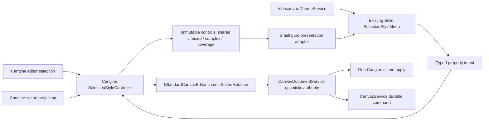

# A101 - canvas: move selection-style logic to Cangine headless controller
[Overview](../BASED.md)

Replace Vibecanvas's duplicated selection-style state, eligibility, routing,
mutation, and history logic with Cangine `0.3.0`'s framework-neutral
`SelectionStyleController`, while retaining the Solid menu, theme palette,
fixed screen placement, and CSS.

This is an ownership migration and subtraction. It must finish with less
production code, one Cangine style authority, and no parallel compatibility
path.

## Context

Cangine `0.3.0` adds a headless selection-style controller for observing
semantic style state and applying atomic changes:

- [`llm.cangine.md`](../../docs/internal/llm.cangine.md)
  documents `createSelectionStyleController`, immutable control snapshots,
  mixed and complex values, compatible group-leaf traversal, semantic-root
  opacity, continuous updates, routing, grouping, and stable layer actions.
- The controller commits through the supplied editor. In Vibecanvas that
  remains the controlled `CanvasDocumentService` mutation port, so
  `CanvasService` remains the only durable authority and no second scene writer
  is introduced.
- The controller deliberately has no DOM, Solid, viewport, placement,
  visibility, or menu-layout policy. Those responsibilities remain in
  Vibecanvas.

The current product independently implements part of this logic:

- [`SelectionStyleMenu/fn.selection-style.ts`](../../packages/canvas/src/components/SelectionStyleMenu/fn.selection-style.ts)
  determines eligible node kinds, reads only the first compatible selected
  node, maps connector routing, converts colors, and rewrites Cangine nodes.
- [`SelectionStyleMenu/tx.selection-style.ts`](../../packages/canvas/src/components/SelectionStyleMenu/tx.selection-style.ts)
  builds and commits local upsert batches with one permanent coalescing key.
- [`Canvas.tsx`](../../packages/canvas/src/components/Canvas.tsx) subscribes
  separately to editor and scene revisions, reconstructs selected nodes,
  derives menu state, applies local patches, refreshes the selection overlay,
  and routes line changes through a separate runtime method.
- [`runtime.ts`](../../packages/canvas/src/runtime.ts) contains a narrow
  connector-routing adapter over Cangine's path interaction controller.
- [`SelectionStyleMenu/index.tsx`](../../packages/canvas/src/components/SelectionStyleMenu/index.tsx)
  owns the desired Solid UI and must remain the visual authority.

This duplication is already semantically weaker than Cangine:

- mixed selections display the first compatible value instead of a mixed
  state;
- selected groups are not traversed to compatible leaves;
- opacity can target nodes that Cangine excludes, including widget-containing
  groups;
- text, freehand, ordinary shape, and connector paint semantics are conflated;
- version-2 freehand width cannot be regenerated from its provenance;
- routing is limited to one connector and bypasses the style controller;
- a permanent coalescing key can merge distinct style actions into one undo
  entry;
- product code must keep following every future Cangine node/style rule.

The authoritative screen is already recorded as **Canvas 11 — Selection and
style tools** in
[`SCREENS.md`](../../docs/internal/screens/SCREENS.md). No mockup or new image
is needed because this task preserves the visible menu. The ownership and
event flow are the material design:

## Plan

### 1. Establish the ownership and reduction baseline

- Treat `SelectionStyleController` as the sole authority for:
  - selected semantic roots;
  - compatible target discovery and bounded group traversal;
  - control presence and action availability;
  - shared, mixed, and complex values;
  - coverage and unavailable reasons;
  - foreground, background, stroke, typography, opacity, and line-routing
    semantics;
  - freehand provenance and width regeneration;
  - semantic no-op suppression;
  - mutation batching;
  - continuous update framing and history coalescing;
  - grouping, ungrouping, and stable-block layer planning if those actions are
    rendered later.
- Keep Vibecanvas responsible only for:
  - whether the fixed style panel is mounted;
  - the Solid component tree and accessibility presentation;
  - CSS, placement, labels, and theme swatches;
  - translating Cangine semantic state into view props without re-evaluating
    eligibility;
  - translating user-visible color strings into validated Cangine `TColor`
    intents;
  - bracketing pointer and keyboard gestures for continuous controls.
- Record the pre-change production line baseline:
  - `Canvas.tsx`: 478 lines;
  - `runtime.ts`: 236 lines;
  - `SelectionStyleMenu/index.tsx`: 180 lines;
  - `SelectionStyleMenu/fn.selection-style.ts`: 251 lines;
  - `SelectionStyleMenu/tx.selection-style.ts`: 41 lines;
  - total measured production scope: 1,186 lines.
- Finish with at least 100 fewer production lines in the same measured scope.
  Generated code, blank-file tricks, moving the same logic elsewhere, and
  deleting tests do not count as reduction.

### 2. Make the canvas runtime own the headless controller

- Import `createSelectionStyleController` and
  `ISelectionStyleController` from Cangine's public `/editor` entrypoint.
- Add one nullable controller owner beside the engine, editor session, document
  service, image-drop controller, and other runtime resources.
- Construct the controller from `editorSession.editor`; do not pass the engine
  scene or `CanvasDocumentService` through a new side channel.
- Supply a host clock derived from the canvas container's owning window:
  - inject `requestAnimationFrame` and `cancelAnimationFrame`;
  - preserve method binding;
  - make the test portal deterministic;
  - do not read a second global clock in a function file.
- Route controller callback failures through the existing canvas notification
  boundary with a clear selection-style error title.
- Attach the controller as part of runtime boot only after the editor session
  is ready to publish editor and scene state.
- Expose a read-only `selectionStyles()` getter on `TCanvasRuntime`. Do not
  expose controller internals through unrelated editor-session methods.
- On shutdown:
  - clear the runtime reference before awaiting later teardown;
  - destroy the style controller before the editor session;
  - preserve reverse ownership order and aggregate-error behavior;
  - prove repeated and partially failed shutdown releases its subscriptions
    and pending frame.
- Do not add the style controller to `CanvasDocumentService`, runtime
  extensions, a global store, or the standard editor session package wrapper.

### 3. Bind immutable Cangine state into Solid

- Replace `sceneRevision`, the scene subscription used only for selection
  styles, `selectedNodes()`, and local style-state recomputation with one
  signal containing the controller's current immutable
  `TSelectionStyleState`.
- On runtime boot success:
  - read the controller's current state;
  - subscribe once;
  - publish every new snapshot into the Solid signal.
- On boot replacement, boot failure, and component cleanup:
  - unsubscribe before losing the old runtime;
  - clear the style state to a detached/empty presentation;
  - prevent an old runtime callback from updating the new canvas.
- Do not call `editor.refreshSelectionOverlay()` after style changes. The
  accepted controlled mutation and normal Cangine projection must refresh the
  scene and overlay through the existing path.
- Mount the panel from controller facts, not from direct scene-node inspection.
  Initial product policy:
  - require attached editor status;
  - require at least one control rendered by the current menu;
  - allow mixed selections when Cangine reports eligible targets;
  - keep widget-only selections hidden because they expose no rendered style
    controls;
  - do not duplicate widget/group opacity exclusions in Solid.
- Ignore Cangine actions that have no current UI. Do not filter them out of the
  controller or implement premature layer/group buttons.

### 4. Replace the local state model with a presentation-only adapter

- Replace the current node-aware `fn.selection-style.ts` with a much smaller
  pure menu projection, named for presentation rather than domain authority.
- The adapter may:
  - find controls by their stable Cangine property IDs;
  - map `shared` values to displayed values;
  - represent `mixed` and `complex` explicitly;
  - convert a shared solid `TColor` to a CSS swatch value;
  - preserve control coverage/description when the UI needs an accessible
    explanation;
  - return booleans based only on control presence.
- The adapter must not:
  - receive selected scene nodes or an engine;
  - switch on `TSceneNode.kind`;
  - traverse groups;
  - inspect connector routing objects;
  - decide widget eligibility;
  - build paint/stroke objects;
  - clamp mutation values;
  - construct serialized scene commands;
  - compare scene nodes;
  - encode Cangine defaults or fallback stroke styles.
- Keep reusable color conversion only where necessary. Invalid CSS/theme input
  must not silently become an unrelated fallback color; reject it before
  calling the controller or report through the existing error boundary.
- Model displayed values honestly:
  - shared values select the matching swatch/choice;
  - mixed values select no swatch or choice;
  - complex paint selects no solid swatch;
  - unavailable controls are absent;
  - opacity may be `number | null`, where `null` is rendered as **Mixed**.
- Keep the product's theme palette and stroke-width labels from `ThemeService`.
  They are menu choices, not a second eligibility/state authority.

### 5. Route every visible control through typed Cangine intents

- Replace the generic Vibecanvas patch object with property-specific callbacks
  or one typed `TSelectionStyleChange` callback.
- Keep product labels thin and map them directly to Cangine semantics:

| UI | Cangine property | Meaning |
| --- | --- | --- |
| **BACKGROUND** | `background` | Ordinary shape fill |
| **BORDER COLOR** / **COLOR** | `foreground` | Shape border, connector stroke, text glyph fill, or standard freehand fill |
| **WIDTH** | `stroke-width` | Eligible outline/connector/freehand effective width |
| **STROKE** | `stroke-pattern` | Solid, dashed, or dotted eligible strokes |
| **LINE** | `line-routing` | `straight`, `curved`, or `elbow` |
| **FONT** | `font-family` | Controller-provided font-family choices |
| **SIZE** | `font-size` | Controller-provided font-size choices |
| **WEIGHT** | `font-weight` | Controller-provided font-weight choices |
| **OPACITY** | `opacity` | Eligible selected semantic roots |

- Call `controller.apply()` for discrete color, width, and routing choices.
- Stop converting product **Curved** into path-controller `smooth`; Cangine's
  style contract already uses the product-semantic `curved` value.
- Let `apply()` return `false` for unavailable or semantic no-op changes.
  Do not fall back to a local mutation when it rejects an intent.
- Keep manual and waypoint connector routes untouched because the controller
  reports them unavailable.
- Allow the controller to apply one intent to multiple eligible connectors or
  compatible leaves. Do not restore the old one-connector restriction.
- Preserve transparent theme swatches as explicit alpha-zero colors. Do not
  silently reinterpret transparent paint as Cangine `null`/no paint unless the
  UI later adds an explicit **None** action.

### 6. Use the continuous API correctly for opacity

- Treat one slider gesture as one continuous Cangine interaction:
  - call `beginContinuous('opacity')` when an eligible pointer or keyboard
    adjustment begins;
  - call `updateContinuous()` for input values;
  - call `endContinuous()` on pointer up, pointer cancel, change completion,
    blur, selection change, menu unmount, runtime replacement, and cleanup.
- Ensure keyboard arrows form a bounded interaction rather than leaving
  history coalescing open indefinitely.
- Avoid duplicate commits from `input`, `change`, pointer-up, and cleanup
  handlers. `endContinuous()` must flush only the final pending exact value.
- If input occurs without an active continuous gesture, apply one discrete
  change safely instead of throwing.
- Render mixed opacity without inventing an authoritative percentage:
  - show **Mixed** until the user chooses a value;
  - use a deterministic visual slider position only as presentation;
  - the first committed value applies to every eligible semantic root.
- Verify frame coalescing does not introduce a second animation loop or delay
  the synchronous controlled-mutation receipt.

### 7. Delete the replaced code and obsolete tests

- Delete
  [`SelectionStyleMenu/tx.selection-style.ts`](../../packages/canvas/src/components/SelectionStyleMenu/tx.selection-style.ts)
  completely.
- Delete its direct transaction test. Replace it with a narrow controller
  integration/consumer test only if Vibecanvas-specific controlled-authority
  behavior is not already covered at the runtime boundary.
- Remove these local business rules rather than keeping deprecated wrappers:
  - `TSelectionStylePatch`;
  - the local domain `TSelectionStyleState`;
  - `supportsFill`;
  - `supportsStroke`;
  - `fillPaint`;
  - `strokeStyle`;
  - `withStrokePatch`;
  - `fnCanShowSelectionStyleMenu`;
  - `fnConnectorRoutingToLineShape`;
  - `fnLineShapeToSegmentMode`;
  - `fnSelectionStyleState`;
  - `fnApplySelectionStyle`;
  - the local node-loop and serialized-command construction.
- Remove from `Canvas.tsx`:
  - the `TSceneNode` dependency used for local selection-style projection;
  - the style-only scene revision signal and subscription;
  - selected-node reconstruction;
  - `txApplySelectionStyle`;
  - manual selection-overlay refresh;
  - the separate connector-line runtime call.
- Remove from `runtime.ts`:
  - `TConnectorRouting` and `TPathSegmentMode` imports used only by the
    adapter;
  - `connectorSegmentMode`;
  - `setSelectedConnectorSegmentMode` from the public runtime type and object;
  - associated one-connector/manual-route checks.
- Remove runtime and pure tests that assert the deleted implementation details.
  Do not preserve them by recreating mock-only compatibility methods.
- Keep:
  - `SelectionStyleMenu/index.tsx`;
  - `SelectionStyleMenu/styles.css`;
  - theme palette and width-option presentation;
  - relevant component accessibility tests;
  - a small pure presentation adapter and its focused tests.
- Regenerate [`FILES.md`](../../FILES.md) after final file deletion/renaming so
  removed files are no longer indexed.

### 8. Verify semantic behavior and controlled authority

- Add focused consumer coverage around a real or faithful Cangine
  `SelectionStyleController`, not a reimplementation of its algorithms.
- Cover state projection:
  - one ordinary shape;
  - one connector;
  - text;
  - version-2 freehand;
  - a compatible group;
  - mixed compatible roots;
  - mixed/complex paints;
  - widget-only selection;
  - widget plus ordinary shape;
  - a widget-containing group;
  - manual and waypoint connector routes.
- Cover mutations:
  - **BACKGROUND** maps to `background`;
  - **BORDER COLOR** / **COLOR** maps to visible-ink `foreground`;
  - width preserves supported stroke semantics and regenerates freehand;
  - routing applies atomically to eligible connectors;
  - opacity touches semantic roots and excludes widget-owned cases;
  - no-op and unavailable intents create no document command.
- Cover persistence:
  - each discrete action produces one controlled editor mutation;
  - `CanvasDocumentService` accepts and projects it once;
  - normal actions create separate undo entries;
  - one opacity drag is one coalesced undo entry;
  - undo, redo, reload, and remote reconciliation preserve the result;
  - no code writes directly to `engine.scene`.
- Cover lifecycle:
  - boot exposes an attached controller;
  - selection and accepted scene changes publish fresh immutable state;
  - runtime replacement does not leak old state;
  - shutdown destroys the controller and cancels a pending continuous frame;
  - callback errors surface through the existing notification port.
- Preserve component tests for:
  - accessible pressed state;
  - click and keyboard activation;
  - mixed values;
  - opacity continuous start/update/end/cancel;
  - event propagation isolation;
  - unchanged fixed menu placement.
- Run the package typecheck and complete canvas test suite, functional-core
  lint for every surviving/new `fn.*`, `fx.*`, or `tx.*` file, architecture
  checks, and `git diff --check`.

### 9. Finish documentation and reduction accounting

- Update
  [`ARCHITECTURE.md`](../../packages/canvas/ARCHITECTURE.md) to name
  `SelectionStyleController` as Cangine-owned editor planning whose mutations
  still cross the single local document boundary.
- Update
  [`PERFORMANCE.md`](../../packages/canvas/PERFORMANCE.md) only if needed to
  record frame-coalesced continuous style updates and the unchanged
  synchronous mutation rule.
- Keep [`SCREENS.md`](../../docs/internal/screens/SCREENS.md) and its existing
  screen-11 asset unchanged unless implementation causes an unintended visual
  difference. If it does, fix the regression instead of normalizing it in the
  atlas.
- Record final production line counts for the exact baseline files plus any
  replacement presentation file.
- Record deleted files, deleted functions, net production lines, test count,
  and exact verification commands in this task's log.
- Do not close the task unless the production reduction is at least 100 lines
  and the deleted domain logic has not moved to another Vibecanvas file.

## TODOS

- [x] Record the baseline files, production lines, and focused test inventory.
- [x] Construct and own one Cangine `SelectionStyleController` in the runtime.
- [x] Inject a host frame clock and existing notification error boundary.
- [x] Expose immutable controller state through the runtime lifecycle.
- [x] Replace scene-node reconstruction with one Solid controller subscription.
- [x] Add a small presentation-only control-state adapter.
- [x] Represent shared, mixed, complex, coverage, and unavailable states.
- [x] Map all visible controls to typed Cangine changes.
- [x] Use begin/update/end continuous interaction for opacity.
- [x] Preserve the Solid UI, CSS, theme choices, placement, and accessibility.
- [x] Delete `tx.selection-style.ts` and its direct transaction test.
- [x] Delete local node eligibility, mutation, routing, and fallback-style logic.
- [x] Delete the runtime connector segment-mode adapter and its obsolete tests.
- [x] Remove style-only scene subscription and manual overlay refresh.
- [x] Add controller-boundary, UI, persistence, history, and lifecycle coverage.
- [x] Verify groups, mixed values, widgets, freehand, text, and connector routes.
- [x] Run canvas tests, typecheck, functional-core lint, architecture checks,
      and `git diff --check`.
- [x] Update architecture/performance documentation where required.
- [x] Regenerate `FILES.md`.
- [x] Record a net production reduction of at least 100 lines.

## Acceptance criteria

- The Selection styles panel retains its fixed screen placement, visual design,
  theme swatches, and keyboard/pointer accessibility.
- Every displayed style value and availability decision comes from
  `SelectionStyleController`; Vibecanvas does not inspect node kinds to
  reconstruct style semantics.
- Every style change flows through the controller and the existing controlled
  editor mutation port into `CanvasDocumentService`; there is no direct scene
  write or second durable authority.
- BACKGROUND uses Cangine background semantics and BORDER COLOR / COLOR uses
  visible-ink foreground semantics for shapes, connectors, text, and standard
  freehand.
- Shared, mixed, and complex values are represented honestly without selecting
  an arbitrary first-node value.
- Compatible selected group leaves are styled atomically, while opacity remains
  on eligible semantic roots and never affects widget frames or
  widget-containing groups.
- Version-2 freehand width changes regenerate truthful path geometry; legacy or
  invalid provenance is reported unavailable and never locally patched.
- Straight, Curved, and Elbow route through `line-routing`; manual and waypoint
  routes remain unchanged.
- One discrete style action creates one undo step. One continuous opacity
  gesture creates one coalesced undo step and commits the exact final value.
- `tx.selection-style.ts`, its node-loop mutation path, the runtime connector
  adapter, and all listed duplicated business functions are deleted.
- The measured production scope is at least 100 lines smaller than the
  1,186-line baseline, with no equivalent logic relocated elsewhere.
- The canvas package tests, typecheck, functional-core lint, architecture
  checks, and diff validation pass, with exact commands and results logged.

## NOTES

- The compact menu exposes controller-provided font family, size, weight, and
  stroke-pattern quick picks. Layer-order, group, and ungroup actions remain
  intentionally unrendered.
- Do not preserve the A98 path-controller integration as a fallback. A98
  remains useful historical context, while A101 deliberately removes its
  now-obsolete adapter in favor of the released semantic style API.
- Do not fork or wrap Cangine controller algorithms to preserve old edge-case
  behavior. Any confirmed controller defect should be fixed upstream and
  consumed through a released package.
- The controller's configured palette/options are not required to own the
  visible ThemeService menu choices. Applied values are typed and validated;
  theme labels and quick-pick ordering remain product presentation.
- A mockup was intentionally omitted because screen 11 is already the visual
  contract and no layout change is authorized.

### LOGS

- 2026-07-30: Created from the Cangine `0.3.0`
  `SelectionStyleController` investigation. Measured the 1,186-line production
  baseline, confirmed compatibility with the controlled editor mutation port,
  and made deletion plus a minimum 100-line production reduction part of the
  task contract.
- 2026-07-30: Replaced the local scene-node style projection, mutation batch,
  permanent coalescing key, overlay refresh, and connector path adapter with
  one runtime-owned Cangine controller. The fixed Solid menu now projects only
  controller controls and sends typed `background`, `foreground`,
  `stroke-width`, `line-routing`, and `opacity` intents.
- 2026-07-30: Deleted `fn.selection-style.ts`,
  `tx.selection-style.ts`, and their implementation-detail tests, including
  `TSelectionStylePatch`, local eligibility/traversal, paint/stroke
  reconstruction, routing conversion, serialized command construction, and
  `setSelectedConnectorSegmentMode`.
- 2026-07-30: Added real-controller consumer coverage for ordinary shapes,
  connectors, text, version-2 freehand, compatible groups, mixed/complex
  paints, widget-only and mixed widget selections, widget-containing groups,
  manual/waypoint routes, atomic mutations, semantic no-ops, and continuous
  history. Focused A101 coverage grew from 11 implementation-detail tests to
  17 controller-boundary, presentation, component, runtime, and binding tests.
- 2026-07-30: Initial measured production scope was 1,072 lines:
  `Canvas.tsx` 514, `runtime.ts` 225, `SelectionStyleMenu/index.tsx` 224,
  and `fn.selection-style-presentation.ts` 109. This was 114 fewer
  production lines than the 1,186-line baseline, with no replacement domain
  mutation path.
- 2026-07-30: Verification passed: `bun run --cwd packages/canvas test`
  (17 files, 88 tests), `bun run --cwd packages/canvas typecheck`,
  `bun run lint:functional-core:agent`, `bun run test:architecture`
  (12 tests), `bun run generate:files`, and scoped
  `git -c filter.lfs.required=false -c filter.lfs.clean=cat diff --check`.
  The scoped Git form avoids an unrelated repository LFS temp-directory
  permission failure while validating every A101 file.
- 2026-07-30: Follow-up simplified the presentation boundary to four pure
  controller-snapshot helpers and one reusable choice section. Renamed shape
  FILL/COLOR to BACKGROUND/BORDER COLOR, kept COLOR for non-background
  selections, and exposed controller-provided stroke pattern, font family,
  font size, and font weight options. The measured production scope was 1,066
  lines (`Canvas.tsx` 499, `runtime.ts` 225,
  `SelectionStyleMenu/index.tsx` 270, presentation helpers 72): 120 fewer than
  baseline and 6 fewer than the first completed implementation.
- 2026-07-30: Follow-up verification passed: 17 canvas test files with 86
  tests, canvas typecheck, functional-core lint, and 12 architecture tests.
- 2026-07-30: Replaced absolute text-size choices with relative XS/S/M/L/XL
  factors (M = 1.0), resetting the UI to M when a manual resize establishes a
  new base. Font weights now use Regular/Medium/Semibold/Bold labels. Opacity
  now has a square thumb, a contrasting filled/unfilled track, a stronger
  percentage label, and live visual feedback during continuous updates.
  Browser verification confirmed the new labels, selected states, and opacity
  treatment. The measured production scope remained 1,086 lines (`Canvas.tsx`
  488, `runtime.ts` 224, `SelectionStyleMenu/index.tsx` 302, presentation helpers
  72): exactly 100 fewer than the 1,186-line baseline.
- 2026-07-30: Final follow-up verification passed: 17 canvas test files with
  86 tests, canvas typecheck, functional-core lint, 12 architecture tests,
  regenerated `FILES.md`, and scoped Git diff validation.
- 2026-07-30: Replaced the generic font list with self-hosted Inter (default),
  Fraunces, and JetBrains Mono. Each family includes real 400/500/600/700
  faces, is registered and preloaded through Cangine from same-origin static
  files, and retains its SIL OFL 1.1 license beside the binaries. Browser
  verification covered all three families and the bold face. The measured
  production scope remains exactly 1,086 lines.
- 2026-07-30: Font follow-up verification passed: 17 canvas test files with
  86 tests, canvas typecheck, functional-core lint, 12 architecture tests, and
  the production frontend build. The build contains all 12 same-origin font
  faces and three license files, with no Google Fonts or CDN runtime URL.
- 2026-07-30: Review fixes added public same-origin `@font-face` declarations
  for Cangine's DOM text editor and a tracked Cangine 0.3.0 compatibility patch
  for configurable text-creation families, making Inter the real default.
  Mixed font sizes now select no relative preset and disable unavailable
  choices; selection changes also close the local opacity interaction.
- 2026-07-30: Review-fix verification passed: 17 canvas test files with 86
  tests, canvas typecheck, functional-core lint, 12 architecture tests,
  frozen-lockfile install, regenerated `FILES.md`, frontend production build,
  and Git diff validation. The measured production scope is 1,083 lines
  (`Canvas.tsx` 488, `runtime.ts` 225, menu 298, presentation helpers 72):
  103 fewer than baseline.

---
