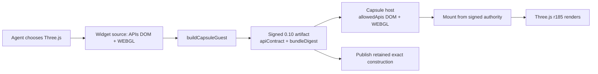

# A102 - Capsule 0.10: migrate Three.js widgets to public WEBGL API groups
[Overview](../BASED.md)

Upgrade Vibecanvas to `@omnidraw/capsule` `0.10.0` and migrate Three.js
authoring, construction, Preview, diagnostics, and Publish from Capsule's
private runtime/profile vocabulary to its public API-group contract.

The finished path must let an agent request `DOM` plus `WEBGL`, build a
Three.js r185 widget, render it in Preview, and publish the exact retained
construction without requiring the widget author to know Capsule runtime ABIs,
DOM profiles, feature-profile names, or private target assembly.

## Context

[`llm.capsule-documentation.md`](../../docs/internal/llm.capsule-documentation.md)
documents the Capsule `0.10.0` consumer API, but the repository still depends
on `0.9.4` and implements the old contract:

- `packages/capsule-vibecanvas` builds with an exact `target`,
  `requestedBudgets`, private profile constants, and a complete policy record.
- the browser host repeats `runtimePolicy.target`,
  `allowedFeatureProfiles`, budget defaults/ceilings, and mount-time
  `featureGrants`;
- the Vibecanvas manifest and generated widget templates expose
  `runtimeAbi`, `domProfile`, and `featureProfiles` to widget authors;
- the agent is taught to add `canvas-webgl-v1` and hand-tune private GPU and
  message limits;
- browser acceptance and population accounting identify GPU widgets through
  private feature profiles.

Capsule `0.10.0` deliberately removes that source-level contract:

- construction uses `buildCapsuleGuest({ apis: ["DOM", "WEBGL"], ... })`;
- host policy uses `createCapsuleHost({ allowedApis: ["DOM", "WEBGL"], ... })`;
- mount derives authority from the artifact and may only narrow it;
- the artifact carries a signed
  `apiContract: { format: "capsule-api-groups-v1", groups, bundleDigest }`;
- `resolvedTarget` remains available for trusted audit and diagnostics but is
  private output, never author input;
- rendering authority is mutually exclusive across `CANVAS_2D`, `WEBGL`, and
  `WEBGPU`;
- group-owned budget defaults and hard maxima replace application-assembled
  profile defaults; consumer budget and limit objects are partial overrides;
- CSS and artifact resources are inferred from `cssRoots` and
  `resourceBindings`, not selected through private resource profiles.

`WEBGL` continues to expose Capsule's fixed, bounded Three.js r185 surface. The
version bump does **not** establish arbitrary Three.js compatibility. The
existing raw/indexed geometry probe, PBR rejection probe, clock/timing probe,
and message-budget probe must be rerun against the installed `0.10.0` package.
Prompts and diagnostics must describe what those executable probes prove,
rather than promising the full upstream Three.js API.

This is a runtime and contract migration; no new screen or mockup is useful.
The material flow is:

## Plan

### 1. Upgrade the dependency as one repository-wide cutover

- Pin every direct `@omnidraw/capsule` dependency to exact `0.10.0`, including
  the Capsule adapter package, SDK/CLI surfaces, acceptance applications, and
  any fixtures that compile consumer code.
- Regenerate the lockfile and verify no production workspace resolves
  `0.9.4`.
- Compile against the installed package's public exports. Do not infer symbol
  names from the manual when the package types are more precise.
- Remove application runtime imports of private runtime ABI, DOM profile,
  feature-profile, and target-construction constants.
- Add a boundary test that fails if product source, templates, prompts, or
  examples reintroduce private profile names such as `canvas-webgl-v1`.

### 2. Make the Vibecanvas source manifest public and group-based

- Replace author-controlled `ui.target` with a public group selection, for
  example `ui.apis`, whose values are Capsule public API groups.
- Keep `DOM` explicit and mandatory.
- Allow no more than one of `CANVAS_2D`, `WEBGL`, and `WEBGPU`.
- For a Three.js widget, normalize the source contract to exactly
  `["DOM", "WEBGL"]` unless the widget independently needs another public
  capability.
- Do not expose `resolvedTarget`, `bundleDigest`, private profiles, artifact
  resource profiles, or host limits in `vibecanvas.json`.
- Model widget-requested budgets as optional partial overrides. Omission means
  Capsule's API-group default; numeric zero remains an exact denial and must
  not be used as a generic default.
- Update the widget-contract schema, inferred types, examples, fixtures, and
  validation errors together.
- Do not keep both `target` and `apis` as accepted inputs to the normal build
  path. Old private-target manifests are rejected rather than migrated.

### 3. Rebuild the construction adapter around `buildCapsuleGuest`

- Replace exact-target input with public `apis`.
- Replace `requestedBudgets` with the `0.10.0` partial `budgets` input.
- Replace locally assembled complete budget defaults/ceilings with only the
  product policy overrides that Vibecanvas intentionally owns through
  `policy.budgetCeilings`.
- Stop selecting CSS network, artifact resource, shadow CSS, canvas, WebGL, or
  GPU profiles. Supply `cssRoots` and `resourceBindings` and let Capsule infer
  the private resolved profiles.
- Preserve the existing deterministic source construction and parkability
  choice unless the installed `0.10.0` API requires a documented change.
- Persist the signed public `apiContract`, including its format, groups, and
  bundle digest, with the built artifact.
- Retain `resolvedTarget` only as trusted construction output for audit,
  diagnostics, and low-level compatibility inspection. Never use it as a
  second authoring input.
- Update construction identity, cache keys, integrity checks, serialization,
  and published revision descriptors to native contract format v4.
- Rebuild and re-sign all new Preview constructions.

### 4. Host and mount from signed API authority

- Create the browser host with public `allowedApis` and partial `limits`.
- Remove the host's duplicate exact target, allowed feature-profile list,
  locally copied group defaults, and mount-time feature grants.
- Mount the retained construction from its signed artifact contract. Use
  mount-level `allowedApis` or `limits` only for a deliberate narrowing; do not
  restate the normal host policy on every mount.
- Preserve the existing browser-platform portal, lifecycle ownership,
  park/resume behavior, cleanup, and stale-build protection.
- Classify GPU runtime population from the signed/effective API group
  (`WEBGL` or `WEBGPU`), not from private feature profiles.
- Retain Capsule's documented host population cap of at most two GPU runtimes
  and the aggregate host budget policy. Prove that a failed or destroyed
  Three.js Preview releases its GPU slot.
- Expose requested and effective public API groups in trusted Preview
  diagnostics. Private resolved target data may appear only in developer audit
  details.

### 5. Preserve exact Preview-to-Publish promotion

- A successful `0.10.0` Preview must retain the exact built artifact,
  `apiContract`, bundle digest, source revision, and construction identity.
- Publish that retained construction without rebuilding, widening APIs,
  changing budgets, or regenerating the bundle.
- Reject publication when the retained artifact or signed API contract no
  longer matches the selected draft revision.
- Mount the published revision through the same `0.10.0` host policy and prove
  that the visible Three.js output still renders.

### 6. Teach agents the public Three.js contract

- Update widget creation and editing prompts so a Three.js request selects
  public `DOM` plus `WEBGL`; remove all instructions to write runtime ABI, DOM
  profile, or `canvas-webgl-v1`.
- Scaffold Three.js at the Capsule-probed compatible version (`0.185.1` unless
  the installed package exposes a more authoritative fixed version).
- Let the `WEBGL` group supply its normal GPU and message defaults. Add a
  partial budget override only when a measured construction or runtime
  diagnostic proves it is required.
- Continue to recommend the animation-frame timestamp for elapsed time rather
  than counting frames.
- Keep generated examples inside the subset established by acceptance:
  renderer creation, scene/camera lifecycle, bounded geometry and materials,
  resize, animation, and deterministic cleanup.
- Keep unsupported or unproven Three.js features out of the default template.
  In particular, update PBR, `THREE.Clock`, texture, shader, indexed geometry,
  and large-message guidance only from executable `0.10.0` results.
- Make `vc_widget_validate` run or retain a real Preview execution result when
  the workflow claims the widget renders. Construction-only validation must
  not be presented as successful WebGL execution.

### 7. Make diagnostics group-aware and renderer-specific

- Replace user-facing private-profile advice with public API guidance:
  - missing rendering authority says to request `WEBGL`;
  - host denial says the Vibecanvas host does not allow `WEBGL`;
  - mount narrowing says the retained artifact requested `WEBGL` but the mount
    removed it.
- Use trusted context before adding Three.js-specific advice. Generic message
  byte, canvas, or guest/host failures must remain renderer-neutral.
- Distinguish `CANVAS_2D`, `WEBGL`, and `WEBGPU` instead of mapping every
  canvas error to WebGL.
- Include requested and effective APIs in stable diagnostic data. Keep
  `resolvedTarget` in a clearly private audit section.
- Preserve the first actionable guest failure and Capsule source location when
  available; do not replace it with the later host mount wrapper.

### 8. Rebuild browser acceptance around the public API

- Convert the positive Three.js acceptance fixture to
  `apis: ["DOM", "WEBGL"]`.
- Assert that construction produces:
  - `apiContract.format === "capsule-api-groups-v1"`;
  - requested/effective `DOM` and `WEBGL`;
  - a non-empty signed bundle digest;
  - no source-authored private target.
- In a real browser, prove the fixture:
  - reaches the ready state;
  - creates a WebGL renderer;
  - draws non-background pixels;
  - advances animation from frame timestamps;
  - responds to resize;
  - releases frame, DOM, renderer, and GPU resources on destroy;
  - survives exact Preview-to-Publish promotion.
- Add negative acceptance for:
  - omitted `WEBGL`;
  - host `allowedApis` excluding `WEBGL`;
  - mount narrowing away `WEBGL`;
  - mutually exclusive rendering groups;
  - a requested budget above product/Capsule ceilings.
- Verify that group defaults give the ordinary bounded Three.js fixture enough
  GPU authority without an author-supplied private limit.
- Run the existing PBR, timing, raw shader, indexed geometry, and oversized
  message probes on `0.10.0`. Record the actual supported boundary in prompts,
  diagnostics, and fixtures.

### 9. Verify the product workflow

- Run focused unit and package tests for widget-contract,
  capsule-vibecanvas, service-agent, SDK/CLI, and UI Preview coordination.
- Run repository boundary/type/lint checks after removing private Capsule
  imports.
- Run Capsule browser acceptance in both positive and negative projects.
- In the product browser, ask the agent to create a small animated Three.js
  widget from a fresh draft and verify:
  - the source manifest contains public APIs only;
  - validation includes successful Preview execution;
  - the Preview visibly animates;
  - Publish becomes enabled only for that retained successful construction;
  - the published widget renders the same output;
  - retry/reset/destroy does not leak a GPU runtime.

## Acceptance criteria

- All production Capsule consumers resolve exact `0.10.0`.
- New widget source, prompts, templates, and application runtime code contain
  no private Capsule target/profile assembly.
- A Three.js author requests `DOM` plus `WEBGL` and does not need to know
  `canvas-webgl-v1`, runtime ABI, DOM profile, or private budget defaults.
- A signed native `0.10.0` artifact records its public API contract and bundle
  digest; private resolved target data is output-only.
- The browser host authorizes and accounts for Three.js from public API groups.
- A real Three.js r185 widget builds, visibly animates in Preview, publishes
  the exact retained construction, and renders after publication.
- Unsupported Three.js behavior fails with a stable, renderer-appropriate
  diagnostic grounded in the `0.10.0` probes.
- Runtime and source contracts reject pre-`0.10.0` private-target artifacts.
- Cleanup and population tests prove no WebGL/GPU runtime leak across failure,
  retry, reset, publication, or destroy.

## TODOs

- [x] Pin Capsule `0.10.0` across workspaces and regenerate the lockfile.
- [x] Replace the source manifest's private target with public API groups and
      partial budgets.
- [x] Reject persisted private-target source and pre-`0.10.0` runtime
      descriptors.
- [x] Rewrite construction around `buildCapsuleGuest({ apis, budgets, policy })`.
- [x] Persist and verify the signed API contract, digest, and construction
      identity.
- [x] Rewrite host policy, mount, and GPU population accounting around public
      API groups.
- [x] Preserve exact native `0.10.0` Preview-to-Publish promotion.
- [x] Update agent scaffolds, prompts, validation, and diagnostics.
- [x] Convert Three.js browser acceptance and rerun the capability probes.
- [x] Run focused package, boundary, type, browser, and product workflow tests.
- [x] Update consumer documentation and mark old profile-based guidance as
      historical after the cutover succeeds.

## Notes / Log

- 2026-07-30: Task created from the Capsule `0.10.0` consumer manual and the
  current profile-based Three.js integration. The task intentionally separates
  the public API-group migration from broader Three.js compatibility: support
  claims must come from `0.10.0` browser probes.
- 2026-07-30: Completed the repository-wide `0.10.0` public API-group cutover.
  The browser matrix passed positive, negative, renderer, budget,
  cleanup, and exact-promotion checks. Focused contract/adapter, database,
  service-agent, CLI, UI, architecture, functional-core, and type checks passed.
- 2026-07-30: Removed pre-`0.10.0` source/runtime compatibility. Existing
  database rows survive schema migration as inert data, but current readers,
  builders, and browser hosts reject them.
- 2026-07-30: Verified the real product flow with a fresh agent-authored
  Three.js `0.185.1` draft declaring only `DOM` and `WEBGL`. The Preview
  visibly animated, validation retained the confirmed two-frame browser
  execution, and Publish promoted the same Capsule artifact hash with release
  authority. The placed published widget visibly animated, and closing both
  frames left the durable Preview closed with zero mount leases.
