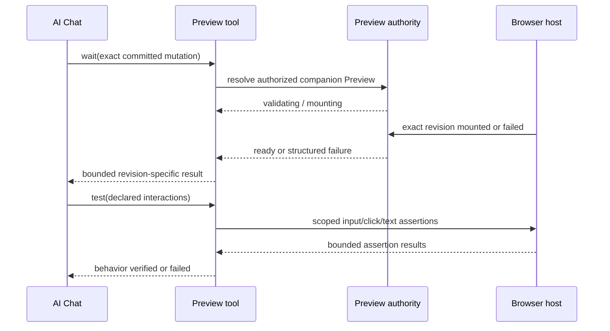

# A103 - AI chat: await and test the exact live Preview revision
[Overview](../BASED.md)

Give the widget-authoring agent a bounded, authorized feedback loop for the
exact live Preview revision so it can wait for mounting, inspect failure state,
and perform small declared interaction checks before claiming completion.

## Context

During the 2026-07-31 investigation, `vc_widget_validate` repeatedly returned
`previewExecution: not-run` while an open Preview concurrently built and failed.
The agent could see construction results but not the adjacent live runtime
result. It guessed at fixes and ended turns before Preview finished.

Current relevant boundaries:

- [`prompt.tools.md`](../../packages/service-agent/src/prompts/prompt.tools.md)
  tells the agent that open Preview rebuilds automatically and explicitly says
  not to poll or invent a refresh loop.
- [`WidgetDraftController.ts`](../../packages/service-agent/src/widget-drafts/WidgetDraftController.ts)
  already owns Preview identity, build fencing, revisions, mount confirmation,
  diagnostics, and publication selection.
- [`authoring-schema.ts`](../../packages/api/src/agent/authoring-schema.ts) and
  [`contract.ts`](../../packages/api/src/agent/contract.ts) expose authorized
  Preview owner and diagnostic operations.
- [`PreviewPortalRuntime.ts`](../../packages/ui-ai-chat/src/canvas-extension/PreviewPortalRuntime.ts)
  owns the browser mount and guest handle.
- Agent tool registration lives under
  [`packages/service-agent/src/tools`](../../packages/service-agent/src/tools).

The agent needs host-provided await semantics, not arbitrary DOM access,
screenshots, timers, or self-authored polling loops.

## Plan

### 1. Add exact, scoped Preview status

- Add `vc_widget_preview_status` for the current chat/draft companion Preview.
- Require explicit draft identity or a single unambiguous current draft; never
  select a Preview across chats, accounts, canvases, or placed copies.
- Return a bounded result containing authoritative state, committed mutation,
  attempted revision, displayed fallback revision, binding revision, build
  sequence, and normalized current diagnostics.
- Do not expose guest DOM, artifact bytes, host paths, credentials, or
  unrelated Preview owners.

### 2. Add a host-backed wait operation

- Add `vc_widget_preview_wait` accepting the exact committed mutation/source
  identity expected after the agent's edit and a bounded host-controlled
  timeout.
- Implement event-driven completion from Preview-owner/event state. Do not
  implement model-generated polling, sleeps, or retry loops.
- Return only when that exact revision becomes `ready` or `failed`, is
  superseded, the owning Preview closes, or the timeout expires.
- Make cancellation propagate when the user stops the agent turn.
- A retained older ready revision must return the newer attempted revision as
  failed or pending, never ready.

### 3. Add bounded declarative interaction checks

- Add `vc_widget_preview_test` only for an exact live-ready Preview revision.
- Support a small allowlist of authoring checks such as:
  - fill an accessible input by label;
  - click an accessible button by name;
  - assert visible text or an accessible status;
  - wait for a bounded state change caused by that interaction.
- Run checks through a host-owned Preview test adapter, not arbitrary
  JavaScript supplied by the model.
- Scope every action to the guest root for the authorized Preview; prevent
  canvas, Chat, browser chrome, resource, or cross-widget interaction.
- Bound action count, text length, total duration, and returned evidence.

### 4. Integrate the completion protocol into authoring

- Update the widget system prompt and tool descriptions to use:
  edit → validate → await exact Preview → repair or test → finish.
- If no companion Preview exists, report that live execution was not tested;
  do not silently create canvas state unless the authoring workflow already
  authorizes it.
- Require the final assistant response to identify exact revision readiness and
  which behavioral checks ran.
- Preserve user-only publication. These tools cannot Publish.

### 5. Test authorization, races, and agent behavior

- Cover ready, failed, superseded, timeout, closed Preview, stale binding, and
  user cancellation outcomes.
- Prove a result from another chat, draft, canvas, account, or placed Preview is
  inaccessible.
- Reproduce the investigation race where validation completes before live
  failure; assert the agent receives the failure before its final response.
- Test one valid interaction flow and rejected arbitrary-script/cross-frame
  attempts.
- Add a black-box widget-debug-tools scenario using only public agent tools.

## TODOS

- [ ] Add authorized `vc_widget_preview_status`.
- [ ] Add event-driven `vc_widget_preview_wait`.
- [ ] Add the bounded declarative `vc_widget_preview_test` adapter.
- [ ] Update the widget-authoring prompt and final-response contract.
- [ ] Add authorization, race, cancellation, timeout, and interaction tests.
- [ ] Add a widget-debug-tools black-box scenario.

## Acceptance criteria

- The agent can await the exact Preview produced by its latest committed edit.
- An older retained live revision cannot satisfy a newer wait.
- Live failure reaches the agent before it can claim the widget is complete.
- Interaction testing cannot execute arbitrary JavaScript or escape the
  authorized guest root.
- Tool outputs remain bounded and safe for AI context.
- Only direct user actions can Publish.

## NOTES

- [`B70`](../b/B70.md) defines the shared readiness authority consumed here.
- [`B71`](../b/B71.md) improves the structured failures returned by these
  tools.
- Prefer one tool family with three explicit operations if that fits the
  existing agent tool registry better than three independent registrations;
  the behavior and authorization boundaries are the contract.

### LOGS

- 2026-07-31: Created from the live investigation in which construction
  validation completed while the exact open Preview failed out of band.

---
