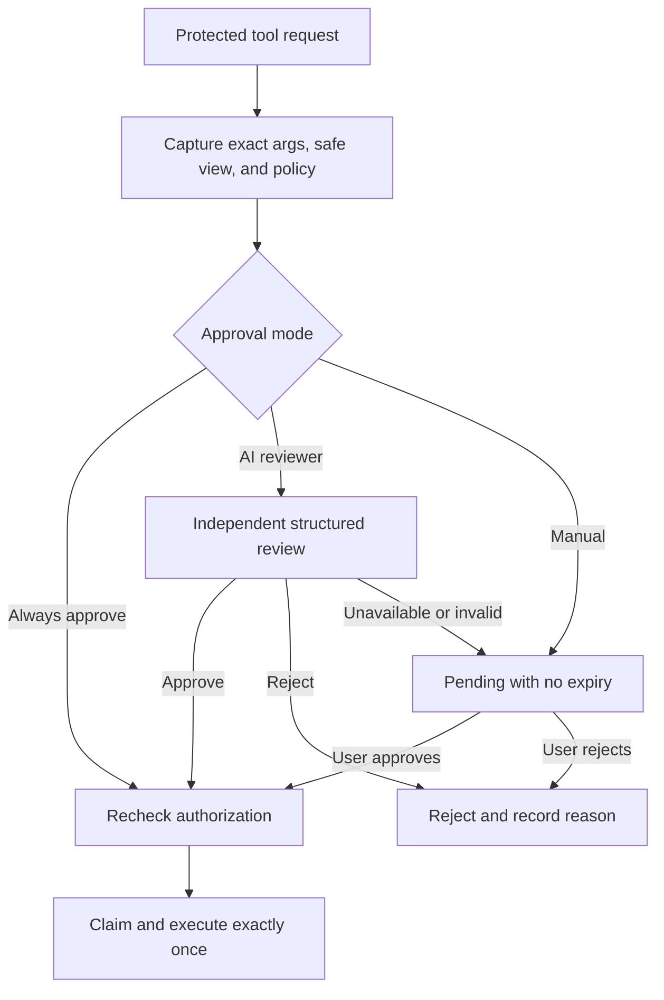

# A104 - AI chat: configurable protected-operation approval policy
[Overview](../BASED.md)

Let the user choose how AI Chat resolves protected-operation permission
requests: always approve, ask an independent AI reviewer, or wait for manual
approval without a wall-clock timeout.

## Context

Protected resource mutations currently always enter one process-local manual
approval flow. [`ApprovalCoordinator.ts`](../../packages/service-agent/src/approval/ApprovalCoordinator.ts)
freezes the exact execution arguments, exposes a redacted view, rechecks
authorization, executes at most once, and cancels unresolved requests after two
minutes. The current shape is secure, but it repeatedly interrupts trusted
workflows and makes long-running manual review unreliable.

Relevant owners and surfaces:

- [`types.ts`](../../packages/service-agent/src/approval/types.ts) defines the
  protected kinds, approval view, decisions, and authorization context.
- [`AgentService.ts`](../../packages/service-agent/src/AgentService.ts) creates
  the coordinator, scopes requests to a chat/widget, publishes lifecycle
  events, and cancels approvals on explicit lifecycle changes.
- [`contract.ts`](../../packages/api/src/agent/contract.ts) and the approval
  handlers under [`packages/api/src/agent`](../../packages/api/src/agent)
  expose settings, list/get, and manual resolution.
- [`SettingsTab.tsx`](../../packages/ui-ai-chat/src/chat/components/tabs/SettingsTab.tsx)
  is the existing AI settings surface.
- [`ApprovalList.tsx`](../../packages/ui-ai-chat/src/chat/components/ApprovalList.tsx)
  and [`index.tsx`](../../packages/ui-ai-chat/src/chat/components/index.tsx)
  render pending requests and reconcile approval events.

This task changes decision policy, not the authorization boundary. Automatic
approval must not mean bypassing tenant/account scope, secret redaction,
immutable arguments, or execute-once behavior.

## Plan

### 1. Define and persist one approval policy

- Add explicit modes: `always-approve`, `ai-review`, and `manual`.
- Store the selected mode in backend-owned AI settings at the same durable
  user/tenant scope as the rest of the local AI configuration. Do not rely on
  browser-local component state.
- Default existing installations to `manual` so an upgrade never silently
  grants broader authority.
- Add a settings read/write API and an accessible selector in AI Chat
  Settings. Explain the trust tradeoff beside each option.
- Apply a newly selected mode to future requests. An already-created request
  retains the mode captured when it was created, avoiding policy-change races.

### 2. Make the coordinator policy-driven and remove expiry

- Separate pure policy selection from the coordinator's mutable pending and
  execution lifecycle.
- Remove the mandatory timer and `expiresAt` contract. A manual request remains
  pending for the lifetime of its valid owning chat/session.
- Preserve deliberate cancellation on user rejection, prompt cancellation,
  explicit chat replacement, ownership loss, service shutdown, or another
  real lifecycle retirement. Ordinary same-scope reconnect must not cancel it.
- Keep pending state process-local. This task does not create a durable
  execution queue or replay a protected mutation after restart.
- Keep exact arguments server-side, deeply frozen, and unavailable through
  list/get/events. Every approving path must recheck current authorization,
  atomically claim the request, and execute at most once.

### 3. Add automatic approval

- In `always-approve`, route the captured request through the same authorization
  recheck, claim, execution, result, and failure path as a manual approval.
- Publish enough lifecycle information for the originating tool row to show
  that policy approved the request automatically; do not briefly present an
  actionable manual card that can race the automatic decision.
- A changed/failed authorization check or execution error remains a visible
  failure and never falls back to unguarded execution.

### 4. Add independent AI review

- Run review through a dedicated reviewer boundary, separate from the acting
  chat session and without access to its tool registry or an approval-resolve
  tool.
- Send only the protected kind, summary, risk, warnings, and already-redacted
  safe details. Never send secret values, hidden exact arguments, credentials,
  internal execution callbacks, or unrelated chat history.
- Require a schema-validated `approve` or `reject` decision plus a short reason.
  Record and surface that the decision came from the reviewer.
- Let the user choose a reviewer model from available configured models. Do not
  silently use the same active chat turn as the reviewer.
- If the reviewer model is unavailable, unauthenticated, times out, or returns
  malformed output, fail closed to an unexpired manual pending request. Never
  interpret reviewer failure as approval.

### 5. Make decision provenance visible

- Extend approval events and UI projection with a bounded decision source:
  `policy`, `reviewer`, or `user`, plus the safe reviewer reason when present.
- Keep pending manual cards actionable and remove expiry language/countdowns.
- Render automatically approved, reviewer-approved, reviewer-rejected, failed,
  and manually pending states distinctly in the originating tool-call row.
- Preserve resource-catalog refresh only after a successful approved mutation.

### 6. Test policy, security, and races

- Cover default/manual persistence, changing modes, and policy capture at
  request creation.
- Cover always-approve success, authorization change/failure, execution
  failure, and concurrent manual/API resolution attempts.
- Cover reviewer approve/reject, redacted input, malformed output, unavailable
  credentials/model, reviewer failure fallback, and reason/provenance events.
- Prove manual requests do not expire under fake time and remain available
  across an idempotent same-scope reconnect.
- Preserve cancellation on explicit chat retirement, prompt cancellation,
  ownership change, and service shutdown.
- Prove cross-chat/widget resolution, double resolution, secret exposure, and
  restart replay remain impossible.

## TODOS

- [x] Add the persisted three-mode approval policy and settings API.
- [x] Add the AI Chat settings selector and reviewer-model selection.
- [x] Remove approval expiry while preserving explicit lifecycle cancellation.
- [x] Route automatic approval through the guarded execute-once path.
- [x] Add the isolated structured AI reviewer with fail-closed fallback.
- [x] Surface decision source and safe reviewer reason in events and UI.
- [x] Add coordinator, API, settings, reconnect, UI, and security regressions.

## Acceptance criteria

- The user can persistently choose always approve, AI review, or manual review.
- Existing users remain on manual review until they explicitly change it.
- Manual approvals have no wall-clock expiry or timeout UI.
- Always approve never bypasses current authorization or execute-once guards.
- AI review uses an independent structured model call and cannot resolve its own
  request through agent tools.
- Reviewer failure leaves the request available for manual review and never
  grants permission.
- Secret values and hidden exact arguments never enter settings, reviewer
  input, approval views, events, logs, or transcripts.
- Same-scope reconnect preserves pending manual approval; explicit retirement
  and shutdown still cancel it.
- No protected operation executes twice, across the wrong scope, or after a
  server restart.

## NOTES

- Coordinate with [`B49`](../b/B49.md): its exact same-scope reconnect rules
  remain authoritative.
- “No timeout” means no elapsed-time expiry. It does not authorize durable
  replay after process restart or survival after the owning chat is explicitly
  retired.
- A separate screenshot is not needed: this is a settings and state-machine
  change using the existing Settings visual language.

### LOGS

- 2026-08-01: Implemented persisted manual, AI-review, and always-approve
  policies without wall-clock expiry, with guarded execute-once resolution,
  an isolated redacted reviewer, provenance UI, and reconnect/security tests.
- 2026-08-01: Created from product feedback requesting reusable permission
  policy, secondary-AI review, manual review, and removal of approval expiry.

---
