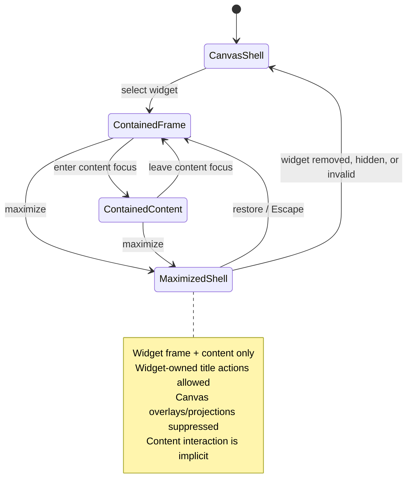

# A105 - canvas: exclusive maximized-widget shell
[Overview](../BASED.md)

When a widget is maximized, make it the exclusive canvas shell: render no
canvas tools or projections above it and route interaction directly to widget
content without the contained frame/content focus mode.

## Context

Cangine 0.5.3 owns fixed widget frames and exposes transient maximization
through `IWidgetInteractionController.state.maximizedNodeId`. It also maintains
contained-widget interaction modes (`frame` and `content`) and editor focus via
`focusedNodeId`.

The current host renders [`FloatingCanvasToolbar`](../../packages/canvas/src/components/FloatingCanvasToolbar/index.tsx)
and [`SelectionStyleMenu`](../../packages/canvas/src/components/SelectionStyleMenu/index.tsx)
as siblings after the Cangine host in [`Canvas.tsx`](../../packages/canvas/src/components/Canvas.tsx).
Those overlays can therefore appear above a maximized AI Chat. Future toolbar
contributions, projections, menus, or host overlays can repeat the same bug if
each surface independently guesses whether maximization is active.

Relevant boundaries:

- [`runtime.ts`](../../packages/canvas/src/runtime.ts) creates the standard
  Cangine editor session and currently exposes only narrow runtime methods.
- [`extension.ts`](../../packages/canvas/src/extension.ts) gives runtime
  extensions the widget interaction controller used by AI Chat and Preview.
- [`Canvas.tsx`](../../packages/canvas/src/components/Canvas.tsx) owns host
  overlays, keyboard routing, selection styles, and runtime lifecycle.
- [`canvas-extension/index.ts`](../../packages/ui-ai-chat/src/canvas-extension/index.ts)
  registers AI Chat and Preview portals and title-bar actions.
- [`SCREENS.md`](../../docs/internal/screens/SCREENS.md) documents the current
  fixed-frame and canvas-maximized AI Chat state.

This is transient presentation and interaction state. It must not reintroduce
the old persisted fullscreen/window state removed by
[`S113`](../s/S113.md).

## Plan

### 1. Introduce one authoritative canvas shell projection

- Project a small host-visible shell state from the current runtime, including
  `canvas`, `contained-widget`, and `maximized-widget` with the exact active
  widget ID where applicable.
- Derive maximized state only from Cangine's widget controller. Do not add a
  second maximize boolean or persist it in `canvas_items`/widget state.
- Give `maximized-widget` precedence over editor `focusedNodeId` and ordinary
  frame/content focus. A single selector decides which host layers may render.
- Subscribe/unsubscribe with runtime activation so canvas switches, tenant
  switches, boot failure, and teardown cannot leave a stale fullscreen shell.

### 2. Gate host layers by ownership, not z-index

- While `maximized-widget` is active, do not render the floating canvas toolbar,
  selection style menu, canvas selection/transform affordances, canvas context
  menus, drag/drop/import affordances, or extension-provided canvas overlay
  projections above the widget.
- Define overlay ownership in the canvas extension/contribution contract so
  future layers must declare `canvas-shell` or `widget-shell` ownership. Canvas
  shell layers are suppressed centrally during maximization.
- Keep the maximized widget's Cangine frame chrome, restore control, registered
  title-bar actions, dropdowns, content portal, and explicit widget-owned
  dialogs usable. These belong to the active widget shell, not the hidden
  canvas shell.
- Avoid a CSS-only z-index patch. Hidden canvas tools must be absent/inert so
  they cannot receive pointer events, focus, shortcuts, or accessibility
  navigation behind the maximized widget.

### 3. Make maximized interaction content-first

- Treat maximization as a distinct shell mode rather than an enlarged version
  of contained focus mode.
- While maximized, route ordinary pointer, keyboard, wheel, and text-entry
  interaction to widget content without requiring a separate focus-mode click
  or toggle.
- Disable frame manipulation semantics that make sense only on the canvas,
  including move, resize, transform selection, and content/frame focus
  switching. Retain only explicit shell controls such as restore, settings,
  registered header actions, and the widget menu.
- Reserve Escape for restoring the maximized widget unless a widget-owned modal
  or menu consumes it first. Canvas tool shortcuts must not activate while the
  maximized content owns interaction.
- On restore, return to a valid contained frame state with no stale implicit
  content focus. The user can then deliberately enter contained content focus
  again.

### 4. Handle lifecycle and multi-surface edge cases

- Automatically leave the maximized shell when the active node is deleted,
  collapsed, hidden, replaced, becomes invalid, or the runtime is retired.
- Ensure only the exact maximized widget can contribute widget-shell overlays;
  sibling widget portals and companion Preview projections cannot render above
  it.
- Preserve AI Chat Settings and other title-bar actions in maximized mode.
- Keep browser fullscreen, canvas maximization, and persisted widget state as
  separate concepts.
- Restore the normal toolbar/projection/focus behavior immediately and exactly
  once when maximization ends.

### 5. Test the shell contract

- Add host tests proving the toolbar and selection UI are not mounted while a
  widget is maximized and return after restore.
- Add contribution tests proving `canvas-shell` overlays are suppressed and
  only the exact active widget's `widget-shell` overlays remain available.
- Add Cangine integration coverage for maximize from both contained frame and
  contained content focus, direct content input, Escape restore, and stale
  focus cleanup.
- Cover delete/collapse/hide/runtime-switch teardown while maximized.
- Browser-QA AI Chat maximized with Settings, approval cards, scrolling,
  composer input, title-bar menu, and restore; confirm no toolbar or canvas
  projection is visible, focusable, or clickable above it.

## TODOS

- [x] Add the runtime-backed canvas shell projection.
- [x] Add centralized canvas-shell versus widget-shell ownership gating.
- [x] Suppress all canvas overlays and projection interactions when maximized.
- [x] Make maximized widgets implicitly content-interactive without focus mode.
- [x] Restore clean contained frame state on exit and lifecycle invalidation.
- [x] Add host, extension, Cangine integration, teardown, and AI Chat browser
      regressions.
- [x] Refresh the maximized AI Chat entry in `SCREENS.md` if the verified state
      changes visibly.

## Acceptance criteria

- Maximized AI Chat and every other widget render above no canvas-owned tool,
  selection UI, projection, or sibling widget surface.
- Hidden canvas layers are not mounted or interactive; correctness does not
  depend on competing z-index values.
- The active widget's own frame chrome, restore control, title actions, menus,
  dialogs, and content remain usable.
- Widget content receives normal interaction immediately in maximized mode;
  there is no separate frame/content focus step or focus-mode control.
- Canvas operations and shortcuts cannot run while the maximized widget owns
  the shell.
- Restore, Escape, deletion, collapse, invalidation, and runtime teardown all
  leave a clean contained/canvas shell with normal overlays restored.
- Maximization remains transient and writes no fullscreen/focus state to
  durable canvas or widget-instance storage.
- Future overlay contributions have an explicit ownership rule that prevents
  this regression from returning.

## NOTES

- Product language may continue to say “fullscreen,” but the current Cangine
  mechanism is canvas maximization, not the browser Fullscreen API.
- The existing screen atlas is sufficient for planning; the important change
  is shell ownership and input routing, so a new mockup would not add useful
  implementation information.

### LOGS

- 2026-08-01: Implemented the exclusive runtime shell and overlay ownership
  gate, content-first maximization, clean lifecycle restoration, and browser-
  verified AI Chat Settings, restore, and Escape behavior with no canvas UI or
  stale content outline above the widget.
- 2026-08-01: Created from product feedback that maximized AI Chat still has
  canvas toolbar/projection layers above it and should not require focus mode.

---
