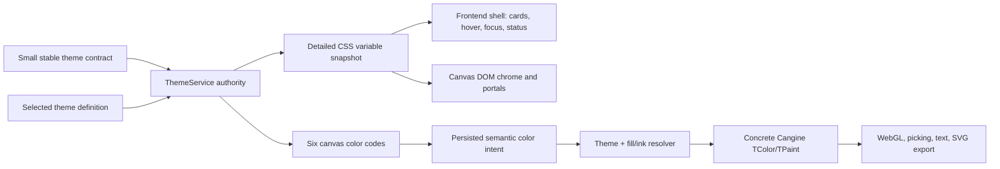

# A106 - theme: authoritative CSS variables and compact canvas colors

[Overview](../BASED.md)

Restart the color architecture around one ThemeService authority: keep a rich
semantic CSS-variable contract for application UI, while reducing the canvas
style picker to six understandable, theme-relative color choices.

## Context

The current system mixes two theme models:

- [`builtins.ts`](../../packages/service-theme/src/builtins.ts) and
  [`dom.ts`](../../packages/service-theme/src/dom.ts) define detailed semantic
  UI colors and project them as CSS variables for the frontend shell;
- [`types.ts`](../../packages/service-theme/src/types.ts) and
  [`styles.ts`](../../packages/service-theme/src/styles.ts) separately define
  ten canvas color families with nine steps each;
- [`SelectionStyleMenu`](../../packages/canvas/src/components/SelectionStyleMenu/index.tsx)
  displays a small quick subset but submits the resolved color rather than the
  semantic choice; and
- Cangine receives and renders concrete `TColor`/`TPaint` values.

The large internal palette is not a useful product vocabulary. It also cannot
be supplied atomically by a custom theme registered through the current
ThemeService API. At the same time, simplifying the canvas picker must not
reduce the frontend shell to the same tiny vocabulary. Cards, hover, active,
selected, focus, status, popover, input, terminal, and other application
surfaces still need detailed semantic CSS variables.

The new product contract is:

- ThemeService owns theme registration, selection, resolution, subscriptions,
  and CSS-variable projection.
- The shell retains detailed semantic variables, including primary and
  secondary roles. Primary and secondary are not canvas picker choices.
- The canvas picker exposes exactly `transparent`, `neutral`, `red`, `yellow`,
  `green`, and `blue`.
- A color code resolves by both theme and paint role. The same `green` intent
  may produce a subdued fill and a contrasting ink/stroke, and both values may
  differ between light, dark, Sepia, and Graphite.
- Semantic canvas colors are viewer-theme adaptive. Literal/imported colors
  remain concrete and visually stable.
- Cangine remains theme- and CSS-agnostic. This task assumes the next Cangine
  release provides dynamic editor-appearance updates, all-tool creation
  decoration, and atomic selection-style mutation decoration.

The discarded D5 font-catalog direction is unrelated to this contract and is
not a dependency or part of this task.

## Plan

### 1. Establish one public theme contract

- Define a small stable contract shared by ThemeService and durable canvas
  validation. If keeping it inside `service-theme` would force
  `canvas-contract` to depend on a stateful service package, introduce a tiny
  leaf `theme-contract` package containing only types, constants, and pure
  validation.
- Keep the shell/UI token contract detailed. At minimum preserve the existing
  background/foreground, card, popover, muted, primary, secondary, accent,
  destructive, success, warning, border, input, ring, canvas-affordance, and
  terminal roles.
- Add explicit interaction roles where a consumer currently invents literals:
  hover, active, selected, focus-visible, and disabled surface/foreground
  values. Prefer meaningful semantic roles over raw Stone/Amber scale names.
- Define the canvas color-code vocabulary exactly as:
  `transparent | neutral | red | yellow | green | blue`.
- Define role-aware canvas resolution. `transparent` is valid for fill only;
  the other codes provide at least `fill` and `ink` values. Ink covers shape
  borders, lines, arrows, pen paths, and text foreground.

### 2. Make one theme registration atomically complete

- Replace the split built-in theme/style registries with one registered theme
  definition containing its detailed UI roles, canvas color-code resolutions,
  canvas viewport/affordance colors, and terminal colors.
- Require every custom theme to provide or explicitly inherit the complete
  contract. Never silently give an unknown custom theme the Light canvas
  palette.
- Keep ThemeService as the runtime authority for theme selection,
  subscriptions, semantic lookup, and conversion to concrete CSS and Cangine
  color data.
- Return immutable theme snapshots or revisions so DOM, canvas, export, and
  portal consumers resolve one coherent theme generation.

### 3. Generate and consume detailed CSS variables

- Derive the public CSS-variable map from the selected ThemeService snapshot.
  Do not make CSS files or `getComputedStyle()` another theme authority.
- Apply the same snapshot to the frontend document root and the package-scoped
  canvas host. Preserve inheritance into ordinary widget/portal DOM where the
  browser boundary allows it.
- Keep compatibility aliases for existing public variables during migration,
  then move shell and canvas CSS away from raw `--stone-*`, `--amber-*`, and
  hard-coded brand/status colors.
- Align terminal and preview-terminal consumers on one ThemeService-owned
  variable contract.
- Generate default/fallback CSS from the default theme contract, or verify it
  against that contract during build, instead of maintaining hand-copied theme
  values in frontend and canvas stylesheets.

### 4. Persist semantic canvas color intent

- Add a versioned namespaced canvas extension for semantic background and ink
  codes. Keep concrete Cangine paint as a validated fallback for older clients
  and for consumers that do not understand the extension.
- Treat a normal canvas color-code selection as viewer-theme adaptive. Theme
  changes reproject only the concrete runtime paint and do not create a durable
  canvas revision.
- Keep literal, imported, copied, or future custom colors concrete unless the
  user explicitly links them to one of the six semantic codes.
- Define old/new-client behavior, extension quotas, copy/paste behavior,
  optimistic reconciliation, undo/redo, and removal of stale intent when a
  literal color replaces a semantic code.
- Require export, thumbnail, print, and server-side rendering to resolve with
  an explicit theme ID/revision. The same document plus the same theme snapshot
  must produce deterministic output.

### 5. Use the updated Cangine editor contract

- Pass ThemeService-resolved concrete selection and path-editing appearance to
  Cangine and update it live through the new appearance APIs. Do not rebuild
  the editor session for a theme switch.
- Use the new all-tool creation decorator for rectangle, ellipse, pen, text,
  connector, arrow, and widget defaults. Do not rewrite commands inside
  `IEditorSceneMutationPort`; that port must continue to accept and project the
  exact Cangine batch.
- Use the new selection-style mutation decorator to write concrete paint and
  the Omnidraw semantic extension in the same Cangine-planned atomic mutation.
  Do not duplicate Cangine's target traversal or foreground/background
  semantics in the Solid menu.
- Keep ThemeService and CSS variable names out of Cangine types. The new hooks
  are generic host extension points receiving or returning concrete scene data.

### 6. Replace the picker without losing accessibility

- Show six fill choices in this order: transparent, neutral, red, yellow,
  green, blue.
- Show five ink choices in this order: neutral, red, yellow, green, blue.
- Use plain product labels. Do not expose scale names such as `green/300`, and
  do not show primary or secondary.
- Preserve keyboard access, visible focus, pressed state, mixed selection,
  transparent checkerboard treatment, and readable labels/tooltips.
- Determine pressed state from semantic intent when available and from exact
  concrete equality only for legacy/literal colors.

### 7. Verify every boundary

- Test all built-in and custom themes for complete detailed CSS-variable and
  six-code resolution without fallback to another theme.
- Test that `neutral` and at least `green` resolve differently across light and
  dark themes and differently for fill versus ink.
- Test semantic theme switching without a durable document revision, while
  literal colors remain unchanged.
- Test creation and selection editing for every compatible Cangine node kind,
  including atomic extension updates, undo/redo, collaboration replay, and
  exact mutation-port projection.
- Test selection/path affordances, terminal/preview variables, shell cards,
  hover/focus/selected states, and the compact menu in Light, Dark, Sepia, and
  Graphite.
- Test deterministic export with an explicit theme snapshot and compatibility
  behavior when semantic extensions are absent or unsupported.
- Update [`SCREENS.md`](../../docs/internal/screens/SCREENS.md) after browser QA
  records the final compact menu.

## TODOS

- [ ] Define the shared detailed UI-token and six-code canvas color contract.
- [ ] Collapse built-in and custom theme registration into one atomic model.
- [ ] Generate one coherent CSS-variable snapshot and migrate shell/canvas
      consumers away from raw palette variables and literals.
- [ ] Add and validate the versioned semantic canvas color extension.
- [ ] Add theme-aware runtime scene projection and deterministic export input.
- [ ] Integrate the updated Cangine appearance, creation, and style-mutation
      extension points without rewriting mutation-port commands.
- [ ] Replace the canvas menu with exactly six fill and five ink choices.
- [ ] Add contract, collaboration, projection, export, accessibility, package,
      and four-theme browser coverage.
- [ ] Update the verified selection-menu entry in `SCREENS.md`.

## Acceptance criteria

- ThemeService remains capable of supplying detailed semantic CSS variables
  for cards, hover, active, selected, focus, status, popovers, inputs,
  terminals, and other shell UI.
- Primary and secondary remain valid shell theme roles but never appear in the
  canvas color picker.
- The canvas picker contains only transparent, neutral, red, yellow, green,
  and blue; ink omits transparent.
- Every non-transparent code resolves by theme and by fill/ink role.
- One custom theme registration controls CSS, picker values, canvas viewport,
  Cangine affordances, and terminal colors without silently borrowing Light.
- Semantically linked authored colors adapt to the viewer theme without a
  durable canvas edit; literal colors remain stable.
- Cangine receives only concrete colors and generic callbacks. It imports no
  ThemeService API, CSS variable, or Omnidraw color-code type.
- Creation and selection styling use Cangine's supported hooks and preserve one
  atomic document-authority mutation path; mutation-port batches are not
  rewritten.
- Export is deterministic for a specified document revision and theme
  snapshot.
- Light, Dark, Sepia, Graphite, and one custom theme pass shell, canvas,
  terminal, accessibility, collaboration, and export verification.

## NOTES

- This task intentionally drops the 10-family × 9-step picker model. A future
  advanced/custom-color editor can be designed separately if product demand
  appears.
- CSS variables are a ThemeService projection for DOM consumers, not the
  canonical theme store and not a transport into Cangine/WebGL.
- No new mockup is needed. The supplied screenshot is sufficient to record the
  current overloaded menu; the implementation should preserve the established
  compact workstation visual language while reducing choices.
- Font catalog generation, semantic typography, and packaged font loading are
  outside this task.

### LOGS

- 2026-08-01: Created after rolling back the E41/D5 attempt. Product direction
  reset to rich ThemeService CSS variables plus a compact canvas-only semantic
  vocabulary. Primary and secondary were explicitly removed from the picker;
  neutral was retained.
- 2026-08-01: Planning assumes a forthcoming Cangine release with live editor
  appearance updates, complete creation decoration, and atomic selection-style
  mutation decoration.

---
