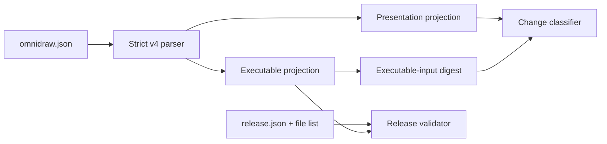

# A108 - widgets: manifest v4 and pure filesystem contracts

[Overview](../BASED.md)

Define the portable, database-free contracts used by widget repositories,
published folders, change detection, and release validation.

## Context

The target design is
[widget-filesystem-design.md](../../docs/internal/widget-filesystem-design.md).
Authored facts move to `omnidraw.json`; executable bytes move to the current
`published/<slug>/` folder. Contract code must stay pure so the scanner,
publisher, UI, and tests all use the same rules.

This task is in the `[R]` filesystem-first redesign group. It creates
contracts only. Filesystem I/O belongs to [A109](./A109.md).

## Plan

### 1. Manifest v4

- Add the strict portable schema for identity, presentation, Capsule requests,
  state mode, optional server entry, and resource needs.
- Reject unknown fields, unsafe paths, bad slugs, oversized icons, and invalid
  runtime requests.
- Keep local resource choices and trust policy out of the manifest.

### 2. Pure release rules

- Define the runtime-only projection exposed to builds.
- Define presentation-only fields and the canonical change classifier.
- Define the executable-input digest and the minimal generated
  `release.json` contract.
- Validate exact published file lists, hashes, Capsule identity, and optional
  server/function descriptors.

### 3. Shared tests and exports

- Add table tests for every presentation-only and executable change.
- Prove the contract package imports no database or filesystem service.
- Update SDK/contract exports and versioned package manifests under the
  published-package policy when public `src/` changes.

## TODOS

- [ ] Implement strict `omnidraw.json` v4 types, parser, and schema
- [ ] Implement presentation and executable projections
- [ ] Implement the change classifier and executable-input digest
- [ ] Implement the minimal release descriptor and pure validator
- [ ] Add limits, path, slug, icon, resource, and unknown-field tests
- [ ] Prove no database or service dependency enters the contract layer
- [ ] Apply required semantic version and lockfile updates

## NOTES

- Group: `[R]` filesystem-first widget redesign.
- Dependencies: none. This is the first contract task.
- No UI mockup is useful; the output is a set of portable rules.
- If implementation touches function files, print and follow the repository
  `fn`/`fx`/`tx` rules before editing.

### LOGS

- 2026-08-04: Created from E41 and the approved single-user filesystem design.
  Planning only; no implementation code changed.

---
