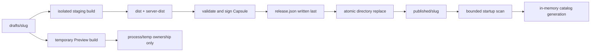

# A109 - widgets: atomic filesystem publication, scan, and ephemeral Preview

[Overview](../BASED.md)

Implement the one-root widget filesystem, atomic publishing, startup catalog,
and process-owned Preview defined by A108 contracts.

## Context

Widgets live under `<home>/widgets/` with `drafts/`, `published/`,
`.staging/`, `.preview/`, `.trash/`, and `.quarantine/`. The database
must not cache the widget catalog or own release bytes.

This task uses [A108](./A108.md) and the target
[design report](../../docs/internal/widget-filesystem-design.md).

## Plan

### 1. Filesystem edge

- Resolve and pin the single widget root.
- Reject traversal, symlinks, special files, case collisions, duplicate slugs,
  and unsafe relative paths.
- Add one root writer lock and expected-digest fences.
- Keep scanner results immutable per catalog generation.

### 2. Build and publish

- Build from a staged source tree that receives only the runtime projection.
- Produce exact browser/server output, function descriptors, Capsule bytes,
  checksums, and the completion marker.
- Sync and validate before same-filesystem rename.
- Recover or quarantine interrupted replacements without exposing a partial
  publication.

### 3. Preview and imports

- Keep Preview data in process memory and bounded temporary paths.
- Reuse exact validated construction output when the executable digest matches.
- Default remote imports to the isolated build runner; require an explicit
  local trust choice for host builds.

## TODOS

- [ ] Implement safe widget-root resolution and bounded scanning
- [ ] Implement writer locking, digest fences, staging, trash, and quarantine
- [ ] Implement build projection, dist production, Capsule validation, and signing
- [ ] Implement atomic publication and crash recovery
- [ ] Implement ephemeral Preview and exact construction reuse
- [ ] Implement trusted local and isolated remote import paths
- [ ] Add restart, corruption, collision, symlink, and rename fault tests
- [ ] Apply required package version and lockfile updates

## NOTES

- Group: `[R]` filesystem-first widget redesign.
- Dependency: [A108](./A108.md).
- No raster mockup is useful; the filesystem state flow is the needed visual.
- Mutable filesystem and process work stays at the edge; validation and
  classification stay in pure functions.

### LOGS

- 2026-08-04: Created from the approved filesystem authority and atomic
  publication design. Planning only; no implementation code changed.

---
