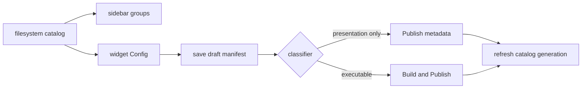

# A110 - widget inspector: filesystem Config, metadata publish, and implicit groups

[Overview](../BASED.md)

Move widget discovery and editing UI to the scanned filesystem catalog, with a
lightweight metadata-only publication path.

## Context

The sidebar and inspector currently expose database-backed revision, artifact,
Preview, and group ideas. The new UI reads one catalog generation from
[A109](./A109.md). The manifest parser and change classifier come from
[A108](./A108.md).

The target behavior is in
[widget-filesystem-design.md](../../docs/internal/widget-filesystem-design.md).

## Plan

### 1. Catalog UI

- Read drafts, publications, health, and differences from the scanned catalog.
- Build groups from manifest strings; remove group registry IDs and CRUD.
- Show missing or unhealthy publications without hiding canvas instances.

### 2. Config editing

- Edit bounded name, description, icon, label, group, and priority fields.
- Save with the expected manifest digest so stale forms fail clearly.
- Separate draft save, metadata publish, and code publication actions.

### 3. Metadata-only publication

- Update only authored presentation metadata and derived release checks.
- Prove no package manager, build, Capsule construction, or signing work runs.
- Prove every executable file remains byte-for-byte unchanged.

## TODOS

- [x] Replace database widget lists with the filesystem catalog
- [x] Render implicit manifest-string groups
- [x] Add strict Config editing with digest-fenced saves
- [x] Add draft save, Publish metadata, and Build and Publish actions
- [x] Show draft/published differences and health states
- [x] Add metadata-only no-build and byte-identity tests
- [x] Add keyboard and error-state coverage for changed controls

## NOTES

- Group: `[R]` filesystem-first widget redesign.
- Dependencies: [A108](./A108.md), [A109](./A109.md), and the runtime switch in
  [S136](../s/S136.md).
- No new visual layout is being invented, so a raster mockup is not useful.
  Keep the existing inspector/sidebar shell and change its authority and actions.
- Deliberate follow-up boundary: the old database-backed Preview UI was removed,
  but this task does not add the replacement filesystem Preview control. [S138](../s/S138.md)
  owns restoring only the current ephemeral filesystem Preview surface from A109,
  without revision, persisted Preview-status, or artifact compatibility concepts.

### LOGS

- 2026-08-04: Created from the approved filesystem Config and lightweight
  metadata publication design. Planning only; no implementation code changed.
- 2026-08-04: Started after the filesystem runtime/catalog boundary and
  generation event stream were implemented. The existing sidebar shell stays;
  its data, Config actions, and group projection move directly to files.
- 2026-08-04: Replaced the widget sidebar, detail page, mention projection, and
  catalog provider with the bounded filesystem catalog. Groups now come from
  manifest strings, unhealthy entries remain visible, and only healthy
  publications can be placed.
- 2026-08-04: Added strict Config save and explicit metadata/build publication
  routes. Save and publication operations fence both the expected manifest and
  catalog observations; public mutation results contain only the widget key,
  generation, and catalog digest.
- 2026-08-04: Added a metadata-only publication transaction that reuses the
  exact executable release, never invokes construction or publication build
  preparation, and proves Capsule, distribution, and release bytes remain
  identical.
- 2026-08-04: Preserved immutable catalog generations across no-op scans and
  refreshes every published placement reference when any catalog entry changes.
  Added keyboard-save, stale-form, explicit-action, health, bounded-projection,
  metadata byte-identity, event reset, and multi-publication generation tests.
- 2026-08-04: Closed after API, CLI, service-agent, and UI typechecks plus the
  focused and full affected test suites passed. The replacement filesystem
  Preview control remains explicitly assigned to S138.

---
