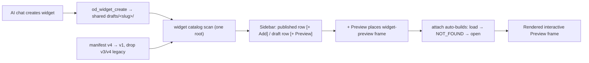

# A111 - widgets: manifest v1, shared draft root, and live Preview from creation

[Overview](../BASED.md)

Rename the current manifest v4 structure to v1 with no legacy support or
migration, unify the AI-agent draft root with the one app widget root, render
the widget sidebar as one published/draft pair per widget, and make widget
creation produce a rendered interactive Preview frame instead of a stopped
dead-end.

## Context

The redesign cut moved widget authority to one pinned filesystem root
([E41](../e/E41.md),
[widget-filesystem-design.md](../../docs/internal/widget-filesystem-design.md)),
but widget creation still cannot produce a preview frame. Two investigations
(2026-08-05, including the "create a simple hello app" transcript
`2026-08-05T06-57-15-859Z...jsonl`) found the following gaps.

### Manifest versioning chaos (overlooked root cause)

- The agent system prompt still teaches the removed manifest v3:
  [`packages/service-agent/src/prompts/prompt.product-and-manifest.md`](../../packages/service-agent/src/prompts/prompt.product-and-manifest.md)
  shows `schemaVersion: 3`, no `$schema`, no `tool`. The AI agent followed it
  in the transcript and downgraded the scaffold's current manifest to v3,
  failed validation, thrashed, and had to be corrected by a human.
- `od_widget_create`'s tool description
  ([`tool.widget-workspace.ts`](../../packages/service-agent/src/tools/tool.widget-workspace.ts))
  still says "manifest-v3 Capsule widget draft" while it scaffolds the current
  manifest v4.
- The current manifest is "v4" everywhere
  ([`widget-contract`](../../packages/widget-contract/src/filesystem/schema.ts),
  [`typed.ts`](../../packages/widget-contract/src/filesystem/typed.ts),
  [`CONSTANTS.ts`](../../packages/widget-contract/src/CONSTANTS.ts),
  [`fn.filesystem-manifest.ts`](../../packages/widget-contract/src/core/fn.filesystem-manifest.ts),
  scaffold in [`fn.widget-create.ts`](../../packages/service-agent/src/tools/fn.widget-create.ts)).
  The structure must be kept but named v1. No v3 or v4 references, no upgrade
  migration, no compatibility readers may remain.

### Agent drafts are invisible to the catalog and Preview

- `od_widget_create` scaffolds drafts into the agent-private root
  `<home>/agent/pi/agent/widgets/drafts/` (`WidgetWorkspace.draftRoot` with
  `dataPath: config.home.agentRoot`,
  [`setup-services.ts`](../../apps/cli/src/setup-services.ts)), while the
  catalog, placement, and Preview service operate on the app root
  `<home>/widgets/` (`WidgetFilesystemRuntimeCatalog`,
  [`WidgetPreviewService.ts`](../../apps/cli/src/services/WidgetPreviewService.ts)).
- Live probe against the running dev server: `widget.catalog.get()` returns
  `entries: []` and `widget.preview.open({ widgetKey: 'hello-app' })` returns
  `NOT_FOUND` ("Preview stopped — build again."), even though the draft exists
  at `.omnidraw/agent/pi/agent/widgets/drafts/Hello App`.
- The app catalog also enforces folder name == manifest slug
  ([`NodeWidgetFilesystemWorkspace.ts`](../../packages/service-agent/src/widget-filesystem/workspace/NodeWidgetFilesystemWorkspace.ts)),
  while agent folders use the display name ("Hello App" vs slug "hello-app"),
  so a naive bridge would be quarantined as unhealthy.

### No preview frame is created for chat-created widgets

- `od_widget_create`/`od_widget_validate` only scaffold and validate a draft on
  disk. `onMounted` (`AgentService.ts`) records an internal
  `omnidraw.activeWidgetMount` session entry consumed only by
  `#resolveActiveMount`; the frontend never sees it.
- `widget-preview` frames are created in exactly one place: manual sidebar
  placement (`canvas-extension/index.ts` `placement.commit` for
  `reference.source === 'draft'` → `fnCreatePreviewWidgetNode`). There is no
  chat placement tool and no auto-place path.

### First placement always shows the stopped fallback

- `preview-owner.attach()` calls `widget.preview.load` first
  ([`preview-owner.ts`](../../packages/ui-ai-chat/src/canvas-extension/preview-owner.ts)).
  `WidgetPreviewService` only holds artifacts after `widget.preview.open`,
  which the UI calls only from the "Build again" button. A freshly placed draft
  frame therefore always renders "Preview stopped — build again." instead of
  the widget bytes.

### Dead legacy residue

- [`service-event-publisher/src/events.ts`](../../packages/service-event-publisher/src/events.ts)
  still declares `widget-draft`, `widget-preview`, `widget-published` events
  with pre-redesign `draftId`/`revision`/`mountLeaseId` vocabulary; nothing
  emits them.
- `fn.bump-widget-version.ts` is used only by its own test.
- `previewExecution: 'not-run'` is hardcoded in the validate tool result.

## Plan

### 1. Manifest v1 rename, no legacy support

- Rename the manifest version to 1 while keeping the exact current structure:
  `schemaVersion: 4` → `1`, `$schema` URL `.../widget/v4.json` → `v1.json`,
  and the corresponding type/parser names (`ZWidgetManifestV4` →
  `ZWidgetManifestV1`, `TWidgetManifestV4` → `TWidgetManifestV1`) across
  `widget-contract`, `service-agent`, `api`, fixtures, and tests.
- Rewrite `prompt.product-and-manifest.md` to teach the agent the real current
  manifest (schemaVersion 1, `$schema`, `tool`, strict fields) and the
  build/preview lifecycle. Fix the `od_widget_create` description.
- Delete legacy residue: the un-emitted `widget-draft`/`widget-preview`/
  `widget-published` event types and their publisher plumbing, the unused
  `fn.bump-widget-version`, and every v3/v4 wording in prompts, docs
  (`llm.widget-system.md`, `widget-filesystem-design.md`, `SCREENS.md`), tasks,
  and fixtures.
- No migration: only manifest v1 is accepted. Existing v4 draft folders are
  invalid and fail validation; there is no upgrade reader or converter. Add a
  repository check (like `scripts/architecture-boundaries.test.ts`) that
  forbids `schemaVersion 3/4` and `v3.json`/`v4.json` schema references.

### 2. One shared draft root for agent creation

- Point the agent `WidgetWorkspace` at the app widget root so
  `od_widget_create` scaffolds into `<home>/widgets/drafts/<slug>/`
  (`WidgetWorkspace` receives the shared drafts root instead of deriving
  `dataPath/pi/agent/widgets/drafts`).
- Keep the chat workspace mounting the draft by display name
  (`workspace/widgets/Hello App` → symlink to `drafts/hello-app`). Resolve
  mounts through the manifest slug instead of assuming folder basename == mount
  name (`#inspectMount`, `#ownedMountKind`, `#resolveDraftTarget`,
  `findMountedWidget`).
- Result: agent-created drafts appear in the catalog, the sidebar, placement,
  Preview, and Publish. Add a dev-only cleanup step that moves obsolete
  agent-private draft folders (`<home>/agent/pi/agent/widgets/drafts/*`) to
  trash; this is developer cleanup, not a migration.

### 3. Sidebar: one widget item with published and draft rows

- Render each catalog entry as one grouped item with at most two rows:
  - **Published row** (`+ Add`): places the current publication.
  - **Draft row** (`+ Preview`): places an ephemeral Preview frame of the
    draft. Draft rows never show Add; published rows never show Preview.
- Show the Preview row/button only when a draft actually differs from the
  publication (`availability === 'draft-only'` or
  `differences.manifest === 'different'`); when the widget is published and
  there is no different draft, no Preview button appears.
- Update `fnProjectWidgetCatalog`/`WidgetsSidebarSection` and their tests to
  the paired-row layout and button semantics.

### 4. Live Preview from creation

- Auto-build on first placement: `preview-owner.attach()` falls back to
  `widget.preview.open` when `widget.preview.load` returns `NOT_FOUND`, so a
  freshly placed draft frame builds and renders the widget bytes immediately
  instead of the stopped fallback. Keep "Preview stopped — build again." only
  for real restart cases.
- Add an **Open Preview** action on successful `od_widget_create`/`od_widget_validate`
  results that places the draft preview frame beside the originating AI Chat
  (reuse the widget placement coordinator with a draft reference), restoring
  the pre-redesign A82 flow on the filesystem Preview.
- Make `previewExecution` truthful: `od_widget_validate` reports a real preview
  build (or keeps `not-run` only when the process truly did not run it), and
  publish the widget catalog invalidation event after draft/preview changes so
  sidebar rows and frames refresh without manual reload.

## TODOS

- [x] Rename manifest v4 → v1 in `widget-contract` (schema, typed, constants, digest rules) and update all importers
- [x] Rewrite the agent manifest prompt and `od_widget_create` description to manifest v1
- [x] Delete legacy v3/v4 residue: dead event types, `fn.bump-widget-version`, docs, fixtures, and task wording
- [x] Add repository checks forbidding manifest v3/v4 and migration readers
- [x] Point `WidgetWorkspace` at the shared drafts root and scaffold `od_widget_create` into `drafts/<slug>/`
- [x] Resolve chat mounts by manifest slug so display-name paths keep working
- [x] Prove a chat-created draft appears in the catalog, sidebar, Preview, and Publish
- [x] Group sidebar rows per widget key: published `+ Add`, draft `+ Preview`, preview hidden when published and no different draft
- [x] Auto-build the Preview on first placement (`load` NOT_FOUND → `open`)
- [x] Add an Open Preview action to the widget-create result
- [x] Report real preview execution from `od_widget_validate`
- [x] Run catalog, preview, sidebar, and agent tool tests; update docs and `FILES.md`

## NOTES

- Group: continuation of the `[R]` filesystem-first widget redesign.
- The manifest rename is a pure rename of the version marker and naming; the
  JSON structure, digests, and build pipeline stay byte-compatible.
- The one-root invariant in
  [`llm.widget-system.md`](../../docs/internal/llm.widget-system.md) is
  restored by Phase 2; do not reintroduce a second draft authority.
- No product mockup is needed; the acceptance flow is the sidebar
  published/draft pair plus the rendered Preview frame.

### LOGS

- 2026-08-05: Created from the widget-preview investigation. Findings merged:
  the agent manifest prompt still teaches v3 (the transcript thrash cause), the
  agent draft root is separate from the app catalog/preview root (live-proven:
  empty catalog, `preview.open` NOT_FOUND), no preview frame is placed for
  chat-created widgets, the first placed frame shows the stopped fallback, and
  legacy event/type residue remains. Planning only; no implementation code
  changed.
- 2026-08-05: Implemented. Manifest v4 → v1 pure rename across widget-contract
  (0.10.0), sdk (0.9.0), api, service-agent, cli, fixtures, and docs; the
  `widget-contract-v1` test rejects retired versions via dynamically built
  values so the new architecture-boundaries guard (forbids v3/v4 markers and
  migration readers in sources and docs) needs no content allowlist. Agent
  prompt rewritten to teach the full strict v1 manifest; `od_widget_create`
  description fixed. Deleted the un-emitted `widget-draft`/`widget-preview`/
  `widget-published` event types and `fn.bump-widget-version`.
  `WidgetWorkspace` now takes the shared `widgets/drafts` root: drafts are
  slug folders, chat mounts stay display-name symlinks resolved through the
  manifest (`#draftSlugForName`/`#inspectMount`/`#ownedMountKind`), transient
  create folders live under the agent tmp root, and dead revision-fence,
  snapshot, and rename methods were deleted. Dev-only
  `txRetireLegacyAgentDrafts` moves the obsolete agent-private drafts root to
  the widget trash. Draft changes publish the `widget-catalog` agent event
  and trigger a catalog rescan (`onWidgetDraftsChanged`). `od_widget_validate`
  runs the real Preview construction through `WidgetPreviewService.buildCheck`
  and reports `previewExecution` truthfully. Sidebar shows one published row
  (Add) and one draft row (Preview) gated on `draft-only` or a different
  manifest digest. Freshly placed Preview frames auto-build once on attach
  (load NOT_FOUND → open); the stopped fallback remains for restart survivors.
  Successful create/validate results render a trusted **Open Preview** action
  that places the draft frame beside the originating chat; one Preview frame
  per draft per canvas is kept (re-placement focuses it). New tests:
  `widget-shared-draft-root`, `widget-validate-tool`, `preview-owner`,
  `retire-legacy-agent-drafts`, plus updated sidebar/chat/prompt/registry
  suites. Full workspace lane, architecture checks, functional-core lint, and
  the frontend production build pass; `FILES.md` regenerated.

---
