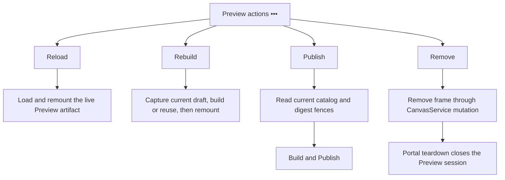

# A113 - Preview: title-bar actions for reload, rebuild, publish, and remove

[Overview](../BASED.md)

Add one trailing actions dropdown to draft Preview frames. Keep the menu
focused on four Preview lifecycle actions: **Reload**, **Rebuild**,
**Publish**, and **Remove**.

## Context

Preview frames currently have Cangine's fixed close, minimize, and maximize
traffic lights, but they do not declare a product `headerItems` action. The
AI Chat frame already proves that product-owned title-bar items can be added
declaratively in
`packages/ui-ai-chat/src/canvas-extension/fn.canvas-widget.ts`.

Relevant behavior and seams:

- `fnCreatePreviewWidgetNode` in
  `packages/ui-ai-chat/src/canvas-extension/fn.canvas-widget.ts` creates the
  Preview frame without a dropdown.
- `packages/ui-ai-chat/src/canvas-extension/index.ts` currently routes
  `header-button` activations, but ignores Cangine `dropdown-item`
  activations. The same file owns Preview owners, catalog events,
  notifications, and durable frame removal.
- `packages/ui-ai-chat/src/canvas-extension/preview-owner.ts` already has the
  internal build/remount mechanics, but only exposes `refresh()`. Its hot
  refresh deliberately skips a remount when the built digest is unchanged.
- `packages/ui-ai-chat/src/sidebar/widgets/WidgetDetailPage.tsx` contains the
  existing digest-fenced **Build and Publish** workflow. The Preview action
  must use the same publication authority and safety fences; it is not the
  metadata-only publication action.
- `packages/ui-ai-chat/src/ports.ts` does not yet expose widget publication to
  the canvas extension.
- Cangine owns the flat dropdown presenter and emits typed product
  activations. Scene data must contain only action IDs and labels, never
  callbacks or product authority.

The supplied frame is the current visual reference. The new `•••` trigger
belongs at the trailing edge of this title bar.

## Plan

### 1. Add the Preview dropdown

- Give Preview nodes one trailing `dropdown` header item with the visible
  content `•••` and accessible label **Preview actions**.
- Use this menu order: **Reload**, **Rebuild**, **Publish**, separator,
  **Remove**. `Remove` is the only destructive item.
- Do not duplicate minimize or maximize in the menu; the fixed traffic lights
  already own those actions.
- Keep the menu flat and text-only, matching the bounded Cangine contract.

### 2. Give Reload and Rebuild distinct semantics

- **Reload** calls `widget.preview.load` and remounts the exact artifact from
  the current live process-owned Preview session. It must not capture source,
  invoke a build, or call `widget.preview.open`.
- If Reload finds no live session, render the existing
  **Preview stopped — build again.** state. Do not silently turn Reload into a
  build.
- **Rebuild** calls `widget.preview.open`, capturing the current draft and
  running or reusing the validated construction. It then remounts the result
  even when its digest matches the currently mounted artifact, so the action
  also restarts widget-local runtime state.
- Keep automatic catalog-driven `refresh()` behavior unchanged: it may
  coalesce changes and skip an unnecessary remount when the digest did not
  change.
- Expose explicit `reload()` and `rebuild()` operations on
  `TWidgetPreviewOwner`; keep concurrency serialized/coalesced so repeated
  menu activations cannot race mounts or leak handles.

### 3. Publish the tested draft safely

- **Publish** means the existing full **Build and Publish** operation, not
  metadata-only publication.
- Fetch the current public widget catalog at activation time, resolve this
  Preview's draft entry, and send its current manifest digest plus the current
  catalog digest to `widget.publication.buildAndPublish`.
- Reuse the existing health and stale-observation rules. A missing or
  unhealthy draft, stale digest, build failure, or publication failure must
  leave the Preview and current publication intact and show a clear error.
- Show progress/success/error feedback through the existing application
  notification surface. Prevent duplicate in-flight publication for the same
  Preview.
- On success, let the catalog event stream remount published instances through
  its normal authority. Keep the Preview frame open until the user removes it.

### 4. Remove through the existing canvas authority

- **Remove** must execute the same durable scene removal as the red close
  traffic light; share one helper so the two paths cannot drift.
- Removing the frame must trigger ordinary portal teardown, which closes the
  process-owned Preview session through `widget.preview.close`.
- Do not delete the draft folder, the published widget, resources, or any
  published canvas instance.

### 5. Route dropdown activations and verify

- Route Cangine `dropdown-item` activations by widget ID, header item ID, and
  dropdown item ID. Ignore unknown, stale, non-Preview, or disabled actions.
- Keep callbacks outside the persisted scene node and clean up every handler
  when the frame or extension is disposed.
- Add focused tests for the descriptor and all four actions, including:
  Reload never calling `preview.open`; Rebuild remounting an unchanged digest;
  Publish sending both current digest fences; and Remove sharing close
  semantics and closing the Preview session.
- Cover repeated clicks, stale publication fences, stopped Preview Reload,
  errors, cleanup, and keyboard activation.
- Run `packages/ui-ai-chat` typecheck/tests plus functional-core and relevant
  architecture checks. This changes private `@omnidraw/ui-ai-chat` runtime
  code only, so no published package version bump is required.
- Capture the completed dropdown state and update
  `docs/internal/screens/SCREENS.md` because the Preview interaction surface
  changes materially.

## TODOS

- [ ] Add the `•••` Preview dropdown with Reload, Rebuild, Publish, and Remove
- [ ] Route typed Cangine dropdown-item activations to Preview owners
- [ ] Expose race-safe explicit Preview `reload()` and `rebuild()` operations
- [ ] Wire digest-fenced Build and Publish with progress and notifications
- [ ] Share durable frame removal between Remove and the red close control
- [ ] Add descriptor, runtime, publication, removal, cleanup, and keyboard tests
- [ ] Run affected typecheck, tests, functional-core, and architecture checks
- [ ] Capture the finished menu and update the screen atlas

## NOTES

- The four actions are deliberately exhaustive for this task. Opening the
  draft inspector, viewing files, copying keys, duplicating Preview, and adding
  the published version are out of scope.
- One Preview frame per draft per canvas remains the invariant.
- Reload and Rebuild must remain visibly and behaviorally different; neither
  is an alias for automatic hot refresh.

### LOGS

- 2026-08-08: Created from the approved four-action Preview menu. Planning
  only; no implementation code changed.

---
