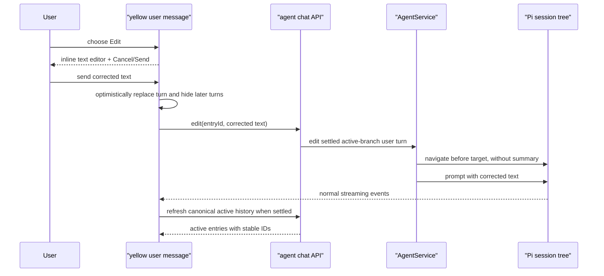

# A115 - AI chat: edit and resend a past user message

[Overview](../BASED.md)

Let a user correct or retry any settled user turn directly inside its yellow
message box. Sending the edit replaces that point in the active conversation,
abandons the later active turns, and starts a new agent response from the
edited prompt.

This is a chat-history operation only. It does not roll back or reset the
workspace, widget drafts, resources, canvas items, or any other external state.

## Context

The current AI Chat renders historical messages in
[`ChatTab.tsx`](../../packages/ui-ai-chat/src/chat/components/tabs/ChatTab.tsx),
but the yellow user message is read-only. Chat state is coordinated in
[`index.tsx`](../../packages/ui-ai-chat/src/chat/components/index.tsx), which
loads `messageHistory` from `chat.connect` and merges raw Pi streaming events.

Durable history belongs to
[`AgentService.ts`](../../packages/service-agent/src/AgentService.ts) and Pi's
`SessionManager`. Pi session files are append-only trees: entries cannot be
rewritten or deleted, but the active leaf can move to the parent of an earlier
user entry and a new child can be appended. Therefore “replace history” means:

- the edited prompt and its new response become the visible active branch;
- the selected original user entry and every later entry leave active model
  context;
- the abandoned branch may remain in the append-only JSONL file for internal
  integrity, but it is not shown or sent to the model;
- no branch summary is generated, because that would leak abandoned turns back
  into the edited context.

The current frontend receives raw messages without their `SessionManager`
entry IDs. Text or timestamps are not safe identifiers because messages can be
duplicated. The API must expose stable active-branch entry identity before the
UI can target an edit safely.

The supplied screenshot shows the intended editing surface: the existing
yellow user box itself, not the bottom composer or a modal.

## Plan

### 1. Give active history stable identity

- Replace the untyped `unknown[]` history boundary with a small serializable
  chat-history item DTO containing the Pi session entry ID and the existing
  message payload.
- Build the DTO only from the current active, compaction-aware session branch;
  never expose inactive siblings as ordinary chat history.
- Add a lightweight canonical history read operation, or an equivalent
  canonical history event, so the UI can refresh IDs after a streamed turn
  settles. Reuse the same projection for `chat.connect`.
- Keep message rendering, copy-chat, markdown, tool-call, and error helpers
  operating on the message payload rather than teaching each helper about
  persistence wrappers.
- Treat the entry ID as opaque. Do not target edits by visible text, array
  index, role plus timestamp, or a client-generated ID.

### 2. Add one backend edit-and-resend operation

Add a typed `chat.edit` operation scoped by `widgetId`, `sessionId`, and the
target user `entryId`. Its editable payload is the replacement plain text; it
uses the currently selected model and thinking level just like a normal send.

The service must:

1. serialize the mutation with prompt, cancel, reconnect/replacement, and new
   session operations for the same chat;
2. reject editing while the agent, retry, compaction, or another history
   mutation is active;
3. verify that the entry exists, is a user message, and is on the current active
   branch;
4. capture any original image parts and preserve them unchanged, while
   replacing only the editable text;
5. navigate to the selected user entry with `summarize: false`, which places
   the leaf immediately before that prompt;
6. submit the edited text and preserved images through the normal prompt path
   so persistence and streaming behavior remain authoritative;
7. make approvals and other unresolved chat-only actions from the abandoned
   tail stale so they cannot remain visible or execute later;
8. return or publish enough canonical state for the frontend to reconcile the
   active branch after success or failure.

An edit does not create a new Omnidraw chat ID or Pi session file. Reconnecting
to the same chat must reopen the newly selected active branch.

The operation must not perform git checkout/reset, restore files from tool
history, reverse resource mutations, delete widget drafts, change widget
state, or modify the canvas. The new turn runs against the external state that
exists at edit time. This limitation is intentional and should not produce a
confirmation dialog.

### 3. Edit directly inside the yellow user box

- Add a keyboard-accessible **Edit** action to each settled user message. It may
  appear on hover, focus-within, or message focus, but must not depend on hover
  alone.
- Selecting it changes that same yellow box into an auto-growing plain-text
  editor. Keep the `USER` label and existing message geometry; do not copy the
  text into the bottom composer and do not open a modal.
- Show explicit **Cancel** and **Send** controls inside the box. `Escape`
  cancels. Use a deliberate keyboard shortcut such as `Cmd/Ctrl+Enter` for send
  and keep ordinary Enter available for multiline text.
- Cancel restores the original rendering without changing backend history.
- Permit only one inline editor at a time. Preserve original text until send
  succeeds or canonical history is reconciled after an error.
- A text-only message cannot be resent empty. A message with preserved images
  may have empty visible text, matching the normal composer rule.
- Do not make assistant messages, tool calls, tool results, hidden records, or
  inactive branch entries editable.
- Disable edit and inline send while the chat is running, canceling, reconnecting,
  or already applying a history edit. The user must stop the current run first.
- Preserve focus, accessible names, error reporting, history scrolling, and
  selectable message text.

### 4. Reconcile the visible branch with streaming

- On inline Send, immediately show the edited user turn in place and remove the
  later visible tail so stale assistant output is not displayed during the new
  run.
- Merge the replacement run's ordinary Pi events into that optimistic branch.
- After `agent_end`, cancellation, transport failure, or edit rejection, fetch
  or consume the canonical active history and reconcile by entry ID.
- If validation fails before the backend branches, restore the unchanged
  canonical history. If generation fails after the branch changed, show the
  canonical edited branch and the normal prompt error state.
- Re-list approvals after reconciliation so abandoned pending approvals do not
  linger in the UI.
- Keep the selected model/thinking preference behavior and the existing stop
  button semantics.

### 5. Test history, races, and the no-rollback boundary

- Pure tests for active-branch history projection, stable IDs, user-entry
  validation, preserved image extraction, and visible-tail replacement.
- Service/API tests for editing the first, middle, and latest user turns;
  duplicate user text; stale or foreign entry IDs; inactive sibling entries;
  reconnect persistence; no-summary navigation; and empty-text validation.
- Race tests for prompt versus edit, cancel versus edit, session replacement,
  two simultaneous edit requests, and a target that becomes inactive before
  commit.
- UI tests for mouse and keyboard entry, multiline editing, Cancel, Send,
  focus restoration, one editor at a time, loading/disabled states, optimistic
  truncation, canonical recovery, and editing messages containing images.
- Prove with an integration fixture that files and widget/resource/canvas state
  changed by the abandoned turns are left exactly as they are when history is
  edited.

## TODOS

- [x] Define a typed active-history item with an opaque Pi entry ID.
- [x] Project canonical active history for connect and post-turn refresh.
- [x] Add the typed chat edit-and-resend API operation.
- [x] Implement serialized, no-summary Pi tree navigation and resend.
- [x] Preserve original images and invalidate abandoned chat approvals.
- [x] Add the inline yellow-box editor with accessible Cancel and Send actions.
- [x] Reconcile optimistic and canonical history across streaming and failures.
- [x] Add functional, service/API, UI, race, and no-rollback tests.
- [x] Update the AI Chat screen atlas if the shipped interaction changes its
  representative state materially.

## Acceptance criteria

- A settled visible user message can be edited and resent inside its yellow
  history box without using the bottom composer or a modal.
- The edited prompt replaces the selected point in visible history and agent
  context; every later old turn is absent from both.
- Duplicate message text cannot cause the wrong turn to be edited.
- Reconnect/reload preserves the edited active branch.
- Abandoned pending chat approvals cannot later execute.
- The current filesystem, widget drafts and state, resources, canvas, and other
  external effects are not reset or rolled back.
- Editing is deterministic and safe under concurrent prompt, cancel, and
  reconnect attempts.

## NOTES

- This is an Addition because it introduces a new user-facing history action
  and a new service/API capability.
- Pi's append-only abandoned branch is an implementation detail, not a second
  visible conversation or a rollback mechanism.
- Inline editing is plain text. Existing structured attachments/context are
  preserved; adding or replacing attachments remains the bottom composer's job.
- No package version bump is required because the affected API, agent-service,
  and AI-chat UI packages are workspace-private and unversioned.

### LOGS

- 2026-08-08: Created from the request to edit and resend a past yellow user
  message while intentionally leaving filesystem and widget state unchanged.
- 2026-08-08: Implemented stable active-branch history IDs, canonical history
  refresh, serialized no-summary edit-and-resend with image preservation and
  stale approval invalidation, inline keyboard-accessible editing, optimistic
  tail replacement, canonical recovery, and focused API/service/UI/race tests.

---
