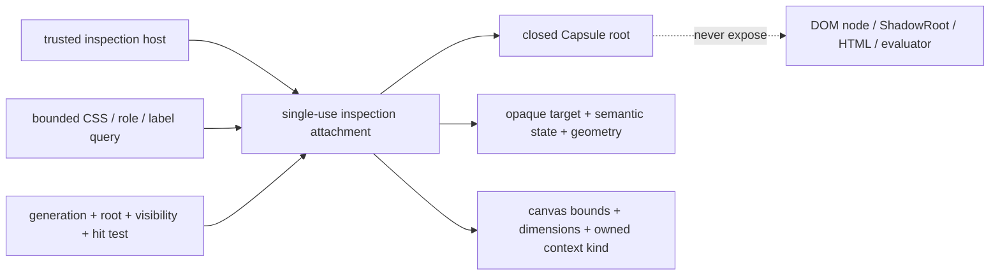

# A116 - Capsule: bounded authoring inspection boundary for Preview tools

[Overview](../BASED.md)

Add and qualify a production-supported, explicitly opt-in Capsule
authoring-inspection boundary that returns bounded target/geometry/visibility
and canvas metadata DTOs while preserving the closed guest root.

This is an upstream prerequisite for [A114](./A114.md). It does not add an
Omnidraw agent tool, screenshot service, browser package, console stream,
shader instrumentation, resource authority, or full Preview parity.

## Context

The current Capsule production host deliberately keeps its internal ShadowRoot
closed. The existing `@omnidraw/capsule/testkit` provides useful bounded query
and geometry prior art, but Capsule documentation says it is test-only and that
ordinary production hosts reject its automation attachment. Importing that
testkit into Omnidraw's shipped Preview would violate the existing boundary.

The A114 MVP needs a narrower supported authoring surface:

- query an element inside one exact inspection mount by CSS, role/name, or
  associated label;
- receive an opaque target ID, semantic summary, computed visibility, and
  geometry relative to the mount viewport;
- revalidate target ownership and hit-testability immediately before a host
  pointer/keyboard action;
- list a compact visible-element summary;
- list canvas geometry, bitmap dimensions, and the already-owned context kind;
- preserve exact structured runtime events and generated coordinates already
  emitted by Capsule.

It does not need DOM nodes, HTML, arbitrary attributes, arbitrary computed
style, canvas readback, browser capture, browser console, source maps, or a
general evaluator.

## Fixed decisions

- Implement this in the upstream `@omnidraw/capsule` package and consume a
  pinned released version from Omnidraw.
- Expose a distinct authoring-inspection entry point/facade. Do not weaken or
  overload the ordinary production `CapsuleHost` mount contract.
- The boundary attaches only to one dedicated inspection mount created by a
  trusted host. It is unavailable to published mounts and ordinary visible
  Preview mounts.
- Keep the ShadowRoot closed. Return immutable plain-data DTOs only.
- IDs are opaque, generation-scoped, root-scoped, call-local integers. They are
  not DOM handles and cannot be reused after remount/dispose.
- Query methods are bounded internally even when the consumer supplies a lower
  bound.
- The host browser performs real pointer/keyboard input from validated
  geometry. Capsule does not expose programmatic arbitrary event dispatch.
- Canvas context kind comes from Capsule-owned context records. Do not call
  `getContext()` again.
- A116 reports no pixel emptiness or visual contribution.
- Console and shader/WebGL info-log streams remain deferred.
- Existing Capsule runtime error ownership—artifact hash, runtime generation,
  lifecycle generation, and generated location—remains authoritative.

## Plan



### 1. Freeze the upstream interface

Target shape:

```ts
type CapsuleAuthoringInspectionQuery =
  | Readonly<{ css: string; maxResults?: number }>
  | Readonly<{
      role:
        | 'button'
        | 'checkbox'
        | 'combobox'
        | 'link'
        | 'listbox'
        | 'menuitem'
        | 'option'
        | 'radio'
        | 'slider'
        | 'spinbutton'
        | 'switch'
        | 'tab'
        | 'textbox';
      name?: string;
      exact?: boolean;
      maxResults?: number;
    }>
  | Readonly<{
      label: string;
      exact?: boolean;
      maxResults?: number;
    }>;

type CapsuleAuthoringInspectionBounds = Readonly<{
  x: number;
  y: number;
  width: number;
  height: number;
}>;

type CapsuleAuthoringInspectionTarget = Readonly<{
  id: number;
  tagName: string;
  role?: string;
  name: string;
  text: string;
  bounds: CapsuleAuthoringInspectionBounds;
  computed: Readonly<{
    display: string;
    visibility: string;
    opacity: string;
  }>;
  checked?: boolean;
  disabled?: boolean;
  expanded?: boolean;
  selected?: boolean;
  editable: boolean;
  sensitive: boolean;
}>;

type CapsuleAuthoringInspectionPointCheck = Readonly<{
  targetId: number;
  valid: boolean;
  reason:
    | 'valid'
    | 'missing'
    | 'stale'
    | 'not_visible'
    | 'disabled'
    | 'outside_viewport'
    | 'occluded';
  centerX?: number;
  centerY?: number;
}>;

type CapsuleAuthoringInspectionFocusedTargetCheck = Readonly<{
  targetId: number;
  valid: boolean;
  reason:
    | 'valid'
    | 'missing'
    | 'stale'
    | 'not_visible'
    | 'disabled'
    | 'sensitive'
    | 'not_editable'
    | 'not_focused';
}>;

type CapsuleAuthoringInspectionKeyboardOperation =
  | 'delete_backward'
  | 'insert_text'
  | 'commit_enter';

type CapsuleAuthoringInspectionKeyboardGuardResult = Readonly<{
  guardId: number;
  targetId: number;
  operation: CapsuleAuthoringInspectionKeyboardOperation;
  valid: boolean;
  reason:
    | 'valid'
    | 'focus_redirected'
    | 'selection_outside_target'
    | 'event_missing'
    | 'event_mismatch'
    | 'stale';
  keydownObserved: boolean;
  beforeinputObserved: boolean;
  defaultPrevented: boolean;
}>;

type CapsuleAuthoringInspectionCanvas = Readonly<{
  id: number;
  bounds: CapsuleAuthoringInspectionBounds;
  width: number;
  height: number;
  context: '2d' | 'webgl' | 'webgl2' | 'webgpu' | 'unknown';
  contextLost: boolean;
}>;

interface CapsuleAuthoringInspectionController {
  readonly attachment: CapsuleAuthoringInspectionAttachment;
  query(request: CapsuleAuthoringInspectionQuery):
    readonly CapsuleAuthoringInspectionTarget[];
  visibleSummary(request?: Readonly<{ maxResults?: number }> ):
    readonly CapsuleAuthoringInspectionTarget[];
  validateActionPoint(targetId: number): CapsuleAuthoringInspectionPointCheck;
  validateFocusedTarget(targetId: number):
    CapsuleAuthoringInspectionFocusedTargetCheck;
  armNativeKeyboardGuard(
    targetId: number,
    operation: CapsuleAuthoringInspectionKeyboardOperation,
  ): Readonly<{
    guardId: number;
    targetId: number;
    operation: CapsuleAuthoringInspectionKeyboardOperation;
  }>;
  finishNativeKeyboardGuard(guardId: number):
    CapsuleAuthoringInspectionKeyboardGuardResult;
  canvases(request?: Readonly<{ maxResults?: number }> ):
    readonly CapsuleAuthoringInspectionCanvas[];
  diagnostics(): CapsuleAuthoringInspectionDiagnostics;
  dispose(): void;
}
```

The implementation may refine names, but it must preserve these semantics and
must not add an escape hatch returning live browser objects.

### 2. Define deterministic bounds and visibility

- Default hard ceilings: 128 retained targets, 4,096 scanned elements, 128
  visible-summary results, 16 canvases, 512 selector bytes, and 512 returned
  text/name bytes per target.
- Visible means connected to the inspected root, finite non-zero bounds,
  intersecting the Capsule viewport, `display` not `none`, `visibility` not
  `hidden`/`collapse`, and parsed opacity greater than zero.
- Geometry is relative to the inspected widget viewport in CSS pixels. Reject
  non-finite geometry and clamp insignificant floating-point noise.
- Summary selection is deterministic: interactive/form controls first,
  canvases/media next, semantic landmarks next, then bounded visible
  text-bearing elements in tree order.
- Do not return password/file/hidden values, form values, arbitrary attributes,
  dataset, style text, HTML, URLs, or node identity.
- `sensitive: true` allows the consumer to reject interaction and redact text.

### 3. Revalidate before host input

- `validateActionPoint` rechecks attachment state, mount generation, target
  root, connectivity, visibility, disabled state, viewport intersection,
  current geometry, and topmost hit target.
- A stale target fails; never silently retarget a different matching element.
- Return only center coordinates relative to the inspection container after all
  checks pass.
- Revalidate the exact focused, editable, non-sensitive target after the native
  pointer step and before keyboard work.
- Guard each native Backspace, non-empty text insertion, and Enter default with
  one generation-owned ticket. Capsule must observe the exact trusted event,
  focus, and composed Selection both before and after synchronous guest
  callbacks, and prevent the same native default when focus or Selection is
  redirected even through `stopImmediatePropagation`.
- Contenteditable input fails closed when exact composed Selection endpoints
  cannot be observed. Finishing, cancelling, unbinding, disposing, and
  destroying a guard must clear every retained event, timer, listener, and
  target reference.
- Do not call `element.click()`, synthesize events, focus cross-root content, or
  grant user activation. The managed browser in A117 owns native pointer and
  keyboard input.

### 4. Report canvas metadata without readback

- Track canvas/context ownership when Capsule creates or grants 2D, WebGL,
  WebGL2, or WebGPU context facades.
- Return bitmap width/height, visible bounds, context kind, and context-lost
  state only.
- Do not call `getContext`, `getImageData`, `readPixels`, `toDataURL`, or GPU
  readback from the inspection boundary.
- Do not expose buffers, textures, shader/program objects, driver strings, or
  a boolean `nonEmpty`.

### 5. Preserve isolation and lifecycle

- Reserve and bind the attachment once; reject reuse across mounts.
- Validate exact plain-data options and reject decorated/proxied inputs.
- Release all retained roots, targets, geometry, and context metadata on
  unbind/destroy/dispose, including failed asynchronous mounts.
- Keep ordinary host diagnostics unchanged except for bounded counters needed
  to prove inspection cleanup.
- Ensure published and ordinary Preview host APIs cannot accept or discover the
  inspection attachment.

### 6. Qualify and publish

- Contract tests for malformed options, selector bounds, target exhaustion,
  root/generation isolation, stale IDs, duplicate/disposed attachments, and
  cleanup.
- Browser tests for CSS/role/label queries, computed visibility, clipping,
  transforms, occlusion, disabled controls, sensitive controls, remounts, focus
  redirection, and retained-focus Selection redirection.
- Canvas tests for no context, each supported context, context loss, multiple
  canvases, and teardown.
- Security tests prove no DOM/ShadowRoot/HTML/evaluator/attribute/value leak and
  no programmatic activation.
- Package-consumer test through the new public subpath.
- Publish a semantically versioned `@omnidraw/capsule` release, update Omnidraw's
  catalog pin/lockfile, and add an adapter contract test under
  [`packages/capsule-omnidraw`](../../packages/capsule-omnidraw).

## TODOS

- [x] Freeze the bounded authoring-inspection types and public subpath.
- [x] Implement single-use attachment lifecycle with closed-root ownership.
- [x] Implement CSS/role/label queries and deterministic visible summaries.
- [x] Implement target geometry, visibility, and action-point revalidation.
- [x] Implement canvas metadata from existing context ownership records.
- [x] Add limits, redaction, diagnostics, and complete cleanup.
- [x] Add contract, browser, isolation, security, and package-consumer tests.
- [x] Publish/pin the upstream Capsule release and repeat clean-install
  Omnidraw adapter qualification against that registry release.

## Acceptance criteria

- A trusted inspection host can obtain bounded target, geometry, visibility,
  semantic state, and canvas metadata for one exact inspection mount.
- The guest root stays closed and no browser object or arbitrary content dump
  crosses the boundary.
- Every target is generation/root scoped and must pass a current hit-test check
  before host input.
- Native keyboard defaults cannot mutate a redirected focus or Selection sink;
  their one-shot guard evidence is exact, bounded, and lifecycle scoped.
- Canvas output contains metadata only and makes no pixel-content claim.
- Published and ordinary Preview mounts cannot enable the attachment.
- All retained inspection state is released on every terminal lifecycle path.
- A pinned released Capsule package and Omnidraw adapter test are available for
  A114/A117.

## NOTES

- Console capture, shader info logs, and compositor/pixel evidence need separate
  review and are intentionally absent.
- A diagram is more useful than a raster mockup because this is a trust-boundary
  contract with no user-visible screen.

### LOGS

- 2026-08-08: Split from A114 after review identified the upstream Capsule API
  as an independent blocking security boundary. Planning only.
- 2026-08-08: Implemented and verified the bounded authoring-inspection public
  subpath in the upstream worktree at `/private/tmp/omnidraw-capsule-a116`.
  Contract, browser, canvas, lifecycle/isolation, security, package-consumer,
  and Omnidraw adapter verification is green.
- 2026-08-08: Added exact focused-target validation and Capsule-owned one-shot
  native keyboard guards. The DOM membrane now cancels the original trusted
  default after synchronous guest callbacks when focus or composed Selection
  escapes the retained target, including `stopImmediatePropagation`, thrown
  callbacks, retained-focus wrong-sink Selection, duplicate/missing events, and
  every terminal cleanup path. Ordinary hosts do not enable the internal port.
- 2026-08-08: Produced two byte-identical final `@omnidraw/capsule@0.13.0`
  packs at
  `/private/tmp/omnidraw-capsule-a116/package-artifacts-a116-guard-final/omnidraw-capsule-0.13.0-a116-final-v4.tgz`.
  SHA-256 is `31ebce6c252459a43c6b0ec840b1d49611b219e3aa6cd7004765577e41ec12c2`;
  npm integrity is
  `sha512-LqWupYnmftW5KFEOZUhDVGR3qzXf8cdPyvT5SVp/ajrNnLhoauonlxA7Q6oRvG8QvZ1T727h114gwMwC3dGzow==`.
  Build/typecheck, 14 focused units, 4 hostile Chromium cases, the clean
  package consumer, the signed packed-artifact browser fixture, and Omnidraw's
  local adapter all pass.
- 2026-08-08: Replaced the stale local-registry `0.13.0` payload with the exact
  qualified v4 package, then pinned the root catalog, lockfile, CLI build
  identity, staged package manifests, and consumer documentation to `0.13.0`.
  Persistent repository configuration routes the `@omnidraw` scope to the
  loopback registry without credentials. Verdaccio's publish-only userconfig
  carries the fixed, non-secret npm publish sentinel required by npm's local
  client-side preflight; the registry still grants anonymous access and does
  not authenticate it. A frozen install, clean registry consumer, adapter suite,
  signed managed-browser acceptance, package qualification, and direct
  consumer-link audit all pass against registry integrity
  `sha512-LqWupYnmftW5KFEOZUhDVGR3qzXf8cdPyvT5SVp/ajrNnLhoauonlxA7Q6oRvG8QvZ1T727h114gwMwC3dGzow==`.
- 2026-08-08: Repeated the manual in-app browser check after the registry pin.
  The final lifecycle state rendered only the expected `Replacement` control;
  the original controls and secret value were absent, the page title was
  correct, and no browser warning/error was emitted.

---
