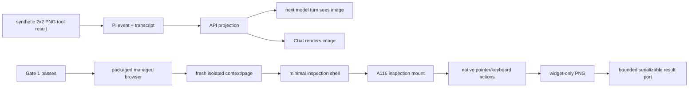

# A117 - Preview inspection: packaged browser runner and image tool results

[Overview](../BASED.md)

Qualify image-bearing AI tool results end to end, then add a packaged,
process-owned managed browser runner that mounts one exact isolated Capsule
inspection job, performs native pointer/keyboard actions, and captures one
widget-only PNG.

This is a prerequisite for [A114](./A114.md). It consumes the bounded Capsule
inspection boundary from [A116](./A116.md), but does not register the final
`od_widget_preview_inspect` tool or implement draft/resource authority.

## Context

The current agent tool helper
[`fnToolSuccess`](../../packages/service-agent/src/tools/fn.result.ts) emits only
text. Before browser infrastructure is built, Omnidraw must prove that an image
content block survives every real boundary:

1. Pi tool execution result;
2. agent event and transcript/session handling;
3. API serialization/projection;
4. model context on the following turn;
5. Chat tool-result rendering;
6. cancellation and reconnect behavior.

Separately, a correct widget screenshot cannot be obtained from jsdom, DOM
serialization, or canvas readback. It needs a real browser capture facility.
Shipping and maintaining that browser is product infrastructure and must be
qualified independently from the A114 agent contract.

## Fixed decisions

- Image transport qualification is Gate 1. Do not start the production runner
  until a synthetic bounded PNG passes the full round trip without JSON base64.
- Use a pinned, host-managed browser automation runtime capable of exact element
  screenshots, such as Playwright with a supported Chromium build.
- Do not rely on an already-open user browser tab, the user's visible Preview,
  a globally enabled remote-debugging port, or ambient signed-in browser state.
- Reuse a healthy browser process if useful, but create a fresh isolated context
  and page for each job.
- The runner is CLI-owned and exposed as a small injected service port. It does
  not live in `service-agent` and no browser object crosses the port.
- The inspection shell is minimal, loopback-only, and imports the same
  `ui-ai-chat` Capsule mount adapter used by normal Preview.
- A117 accepts already-built signed bytes and explicit isolated policy. It does
  not capture drafts, select resources, authorize effects, or publish.
- Actions use A116 query/geometry plus real browser pointer/keyboard input.
- Capture one PNG of the widget container only.
- No console scraping, DOM dump, network trace, source map, CDP session, or
  general browser command reaches consumers.

## Plan



### 1. Gate 1: prove image tool-result transport

- Add a test-only tool/result fixture returning:

  ```ts
  content: [
    { type: 'text', text: 'Synthetic image transport proof.' },
    { type: 'image', mimeType: 'image/png', data: SYNTHETIC_PNG_BASE64 },
  ]
  ```

- Use a tiny deterministic PNG and strict MIME/decoded-size validation.
- Prove the Pi SDK accepts the result without converting the image to text or
  dropping it from the next model context.
- Prove transcript/session handling either retains the supported image block or
  deliberately stores a bounded supported reference. Never stringify image
  base64 into JSON model data.
- Extend agent API/event schemas only as necessary to preserve the typed content
  block. Reject unknown MIME types and oversized/invalid base64.
- Render image tool content in Chat with accessible alt text, dimensions when
  available, and no duplicate raw payload.
- Cover reconnect, historical message render, tool failure without an image,
  cancellation, and redacted logs/snapshots.
- Record the maximum decoded image byte limit used by the final helper. A114
  currently targets PNG up to 8 MiB.
- Create a reusable helper only after the proof, for example a text-plus-image
  result builder that keeps image bytes out of JSON details.

Gate 1 exit condition: a black-box fake agent tool produces a visible image in
Chat and the next model turn receives the image content, with tests proving no
base64 appears in text/model-data/details.

### 2. Freeze the browser runner port

The runner accepts host-owned exact bytes and returns browser evidence. It does
not know widget filesystem paths or agent sessions.

```ts
type TPreviewInspectionBrowserJob = Readonly<{
  jobId: string;
  artifact: Readonly<{
    bytes: Uint8Array;
    digestSha256: string;
    capsuleArtifactHash: `sha256:${string}`;
    runtimeDescriptor: unknown;
  }>;
  viewport: Readonly<{
    width: number;
    height: number;
    deviceScaleFactor: 1 | 2;
  }>;
  settleFrames: number;
  settleTimeoutMs: number;
  actions: readonly TPreviewInspectionBrowserAction[];
  continueOnActionError: boolean;
  signal: AbortSignal;
}>;

type TPreviewInspectionBrowserResult = Readonly<{
  artifactDigestSha256: string;
  capsuleArtifactHash: `sha256:${string}`;
  runtimeGeneration: number;
  screenshotPng: Uint8Array;
  screenshotDigestSha256: string;
  actionResults: readonly TPreviewInspectionBrowserActionResult[];
  targets: readonly TPreviewInspectionBrowserTarget[];
  canvases: readonly TPreviewInspectionBrowserCanvas[];
  runtimeEvents: readonly TPreviewInspectionRuntimeEvent[];
  droppedCounts: Readonly<{
    targets: number;
    canvases: number;
    runtimeEvents: number;
  }>;
}>;
```

Replace `unknown` with existing browser-safe Capsule/widget contract types at
implementation time. Keep exact limits in the port and validate every result
again at the caller boundary.

### 3. Package and own the browser runtime

- Decide and document the supported browser distribution, executable lookup,
  version pin, download/build process, checksum verification, platform/arch
  matrix, package-size impact, update policy, and license notices.
- The compiled Omnidraw release must either include the qualified browser or
  perform a deterministic supported preflight. Do not opportunistically drive
  an arbitrary installed browser version.
- Start the browser with a dedicated temporary user-data directory, no
  extensions, no credential store, no remote debugging exposure, no downloads,
  and no inherited profile.
- Bound global concurrency, per-chat/job concurrency, queue length, startup
  timeout, job timeout, memory, and retained screenshot bytes.
- Reuse the process only while health and cleanup diagnostics remain valid.
  Retire it after protocol corruption, crash, leaked page/context, or failed
  storage cleanup.
- Delete temporary browser state on graceful stop and recover stale task-owned
  directories on next process startup without touching unrelated browser data.

### 4. Add the minimal inspection shell

- Serve a non-navigable loopback-only internal shell or use an equivalent
  host-bound module load. It must not be reachable as a normal product route.
- Import the same Capsule host coordinator/mount adapter used by normal
  `ui-ai-chat` Preview, with the A116 inspection host as the only additional
  boundary.
- Transfer job data through a host binding or one-time unguessable capability;
  do not place artifact bytes, tokens, or paths in a durable URL/history entry.
- Apply the exact viewport, DPR, theme projection, signed artifact, runtime
  descriptor, budgets, and isolated capability policy supplied by the caller.
- Expose only exact resource-free function calls through a one-time host bridge.
  Deny resources and guest network.
- Prevent top-level navigation, popups, downloads, dialogs, permissions,
  clipboard, file access, service workers, and cross-job communication.

### 5. Perform bounded native actions and capture

- Resolve targets through A116. Require exactly one visible result.
- Immediately before action, call A116 action-point validation. Convert the
  returned widget-relative point to page coordinates and dispatch a real
  Playwright pointer action.
- For input, click the validated editable target, then use native fill/keyboard
  behavior and the declared none/blur/enter commit.
- After ready and every action, wait the declared host animation-frame count
  with a bounded timeout. Do not poll DOM quiescence.
- Record one structured outcome per action; skip later actions after failure
  unless explicitly configured otherwise.
- Capture the widget container element only as PNG after final settlement.
- Verify PNG signature, decoded dimensions, exact viewport/DPR relationship,
  byte ceiling, and SHA-256 before returning it.
- Obtain compact visible targets and canvas metadata through A116. Do not use
  Playwright DOM evaluation to pierce or bypass the closed root.

### 6. Cleanup and qualification

- Abort pending mount, action, frame wait, screenshot, and host bridge work when
  the caller signal fires.
- Destroy Capsule handle, inspection controller, function bridge, page, and
  browser context in bounded finally paths; zero screenshot buffers after the
  caller consumes them when practical.
- Tests: browser absent/corrupt/wrong version, startup crash, page crash,
  timeout, queue overflow, cancellation at every phase, bad job/result
  identity, malformed screenshot, oversized screenshot, and cleanup failure.
- Browser acceptance fixtures: simple DOM, CSS/role/label targets, pointer
  click, each input commit, animation frames, runtime error, 2D/WebGL canvas
  metadata, occlusion, stale target, and sensitive input rejection.
- Packaged-app smoke test on every supported platform/architecture.
- Black-box service test proves no browser/CDP/DOM/path/token detail crosses the
  runner port.

## TODOS

- [ ] Prove synthetic image content through Pi, transcript/events, API, model,
  and Chat before browser work.
- [ ] Add a reusable bounded text-plus-image tool-result helper.
- [ ] Freeze the serializable managed-browser job/result port.
- [ ] Select, pin, checksum, package, and preflight the browser runtime.
- [ ] Add process/context/page lifecycle, concurrency, timeouts, and cleanup.
- [ ] Add the minimal isolated inspection shell using the normal mount adapter.
- [ ] Integrate the A116 bounded target/canvas inspection boundary.
- [ ] Implement native pointer/keyboard actions and frame-based settlement.
- [ ] Implement widget-only PNG capture, verification, and byte limits.
- [ ] Add security, cancellation, crash, cleanup, browser, and packaged-app tests.

## Acceptance criteria

- A synthetic image tool result reaches the next model turn and Chat renderer
  without image base64 in JSON/text/details.
- A supported packaged Omnidraw release can deterministically start the pinned
  browser runtime or return one actionable preflight failure.
- Each job uses a fresh isolated context/page and cannot access user browser
  state, Omnidraw credentials, unrelated pages, resources, or network.
- The runner mounts exact supplied Capsule bytes, performs only declared native
  actions through A116 geometry, and returns one verified widget-only PNG.
- No visible user Preview or canvas state is used or mutated.
- No general browser protocol, DOM root/node, host path, token, storage,
  console, or network trace crosses the service port.
- All process-owned job resources are released after success, failure, timeout,
  cancellation, and crash.
- The qualified runner and image helper are available for A114 without
  registering the final agent tool.

## NOTES

- Shipping Chromium is significant product infrastructure; keeping it separate
  prevents the A114 feature task from hiding packaging and maintenance risk.
- A flow diagram is the useful visual. The runner has no user-facing screen, so
  a raster mockup would not improve the plan.

### LOGS

- 2026-08-08: Split from A114 after review identified browser packaging and
  image-result transport as independent blocking foundations. Planning only.

---
