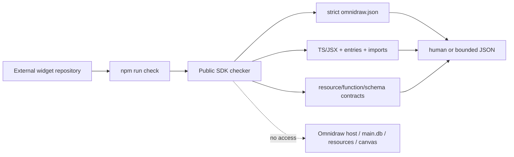

# A118 - widget projects: portable SDK-based offline check

[Overview](../BASED.md)

Give every widget repository a deterministic `npm run check` command implemented
by the public widget SDK/tooling package. It validates authored files and
contracts entirely inside the repository. It must work on an external machine
or in a sandbox with no Omnidraw host, no `main.db`, and no host capability.

This is implementation order **4 of 5**. It depends on [D10](../d/D10.md)'s
portable repository/build contract and validates [B84](../b/B84.md)'s authored
manifest shape. It is intentionally separate from the host-scoped Preview and
runtime inspection in [A119](A119.md).

## Product contract

Every new plain and React scaffold includes:

```json
{
  "scripts": {
    "check": "omnidraw-widget check .",
    "build": "omnidraw-widget build ."
  }
}
```

The executable is provided by a declared public SDK/tooling dependency in the
widget repository. Running `npm run check` must not require:

- a running Omnidraw server;
- localhost or WebSocket access;
- an Omnidraw home or `main.db`;
- an AI Chat session/canvas/widget instance;
- host-issued environment tokens;
- private app/service packages;
- resource provider access;
- network access after dependencies are installed.

The command validates what can be proven from repository bytes. It must not
pretend to validate local resource existence, Preview mounting, publication,
provider behavior, or visible application runtime.

## What offline check proves

The checker may prove:

- strict `omnidraw.json` syntax/schema and unknown-field rejection;
- safe widget identity, entries, paths, file bounds, and no traversal/symlinks;
- resource slot syntax, bounded `resourceId` syntax, kind/effect/required shape,
  operation names, SQL declaration structure, and effect ceilings;
- TypeScript/JSX compilation against the declared public SDK version;
- browser/server entry exports and supported runtime ABI declarations;
- function descriptor shape, input/output JSON schema shape, and declared slot
  consistency where statically derivable;
- forbidden imports/globals/APIs known to the public build policy;
- generated build configuration that can be validated without executing host
  services;
- exact widget-relative diagnostic locations.

The checker cannot prove:

- that `resourceId` exists in a particular Omnidraw home;
- resource lifecycle, schema contents, provider permissions, or secret values;
- current host policy or protected-write approval;
- current Preview/build acceptance or browser rendering;
- canvas placement, WidgetState, publication freshness, or function results;
- that an isolated screenshot represents the visible Preview.

## Fixed decisions

1. `npm run check` is a portable repository command, not a host RPC.
2. The implementation lives in a public package suitable for normal widget
   dependencies, preferably `@omnidraw/sdk` unless package boundaries justify a
   dedicated public tooling package.
3. Public checker code imports no private CLI, service, database, canvas, agent,
   or application packages.
4. The command performs no fetch, socket, database open, resource read/write,
   publication, or Preview mount.
5. It runs with repository dependencies already installed and does not contact
   a registry during check.
6. It uses repository-local public SDK/compiler tooling. This is author feedback,
   not a host security boundary; the host independently validates build output.
7. Human text is the default. `--json` provides one strict versioned bounded
   schema for editor/CI/agent consumption.
8. Exit `0` means every offline check passed. Stable nonzero exits distinguish
   invalid CLI input, validation failure, and checker internal failure.
9. All paths in output are widget-relative `widget://...` locations. No machine
   paths, environment values, or dependency-cache paths appear.
10. `resourceId` is a non-secret authored identifier. Offline check validates
    only its syntax; it does not guess, enumerate, or resolve resources.
11. Check never rewrites source, manifest, lockfile, or generated output.
12. Build remains a separate explicit command under D10. Check does not emit a
    build receipt or notify the host.
13. Existing widget repositories are not rewritten automatically. Scaffolds
    and documented upgrade instructions receive the script.

## CLI contract

```text
omnidraw-widget check [path] [--json]
omnidraw-widget check --help
```

Rules:

- accept zero or one path; default `.`;
- reject unknown flags, multiple paths, absolute escape, traversal, outside
  symlinks, special files, and an unsafe root;
- locate one exact `omnidraw.json` at the project root;
- cap file count, individual bytes, total bytes, diagnostics, and output bytes;
- deterministic diagnostic ordering by phase/path/location/code;
- JSON only on stdout in `--json` mode;
- bounded human/internal failures on stderr without stack or absolute path;
- cancellation through normal process signals with no partial write because
  check is read-only.

Minimum JSON shape:

```json
{
  "schemaVersion": 1,
  "ok": false,
  "scope": "offline-project",
  "checks": [
    {
      "phase": "manifest",
      "code": "RESOURCE_ID_INVALID",
      "severity": "error",
      "summary": "Resource slot 'contacts' has an invalid resourceId.",
      "location": {
        "file": "widget://omnidraw.json"
      }
    }
  ],
  "limitations": [
    "resource-existence-not-checked",
    "preview-runtime-not-checked"
  ],
  "truncated": false
}
```

The limitations field, or an equally explicit fixed projection, prevents a
green check from being presented as proof that the app works in Omnidraw.

## Architecture



## Implementation plan

### 1. Choose the public package boundary

- Prefer extending `@omnidraw/sdk` if the checker can remain dependency-light
  and avoid browser runtime pollution.
- If a dedicated package is necessary, it must be public/versioned, use only
  public contracts, and be installed by widget scaffolds.
- Expose a documented bin without importing workspace-private implementation.
- Follow semantic versioning, lockfile, `dist`, and packed-public rules.

### 2. Extract portable pure validation

- Move/reuse manifest, relative-path, slot, function-descriptor, schema, and
  policy checks in public functional-core modules.
- Avoid duplicating a weaker schema in the CLI.
- Inject filesystem/clock/process edges around pure validation rather than
  reading runtime globals from `fn.*` code.
- Keep diagnostics deterministic and source-mappable.

### 3. Add trusted project loading bounds

- Resolve one canonical project root without escape.
- Enumerate only permitted authored/config/dependency metadata files.
- Exclude `node_modules`, generated output, Git internals, sockets, devices, and
  unsafe symlinks.
- Bound files before reading and reject changes during one check when coherent
  validation cannot be proven.

### 4. Add TypeScript and contract checks

- Use the installed public SDK declarations and declared project config.
- Validate entries/exports and server function declarations without running
  widget functions.
- Validate resource operation declarations structurally; do not open a DB or
  execute SQL.
- Map compiler/parser errors to widget-relative locations.

### 5. Scaffold and external-package integration

- Add the public dependency and scripts to plain/React templates.
- Keep package-lock/frozen installation deterministic.
- Add a generated README section explaining offline check vs build vs A119 host
  Preview inspection.
- Add packed smoke projects that run after the repository itself is absent.

## Causal tests

1. Plain and React scaffolds run `npm run check` in a temporary external
   directory with no Omnidraw process/home/database environment.
2. Blocked network does not affect check after frozen install.
3. A trap localhost listener sees zero connections.
4. A fake `main.db` path/token/environment is never opened or echoed.
5. Valid project returns deterministic exit 0 and identical JSON across runs.
6. Invalid manifest, unsafe path, missing entry, TypeScript error, descriptor
   mismatch, bad resource slot/ID/effect, and schema error remain distinct.
7. A syntactically valid but nonexistent resourceId passes only syntax and the
   report explicitly states resource existence was not checked.
8. Traversal, outside symlink, excessive files/bytes, special file, unsafe
   config, and output overflow fail closed.
9. Absolute compiler/dependency paths are normalized to widget-relative output.
10. Check performs no writes to source, manifest, lockfile, or dist.
11. A widget-local package cannot make the host trust an unsafe artifact merely
    by returning check success; D10 host validation remains independent.
12. Packed npm composition proves the public bin and exact dependency versions.

## Test plan

```sh
bun test packages/sdk packages/widget-contract packages/resource-runtime
bun test packages/service-agent/tests/widget-capsule-scaffold.test.ts
bun run test:packed-public-composition
bun run build
bun run lint:functional-core
bun run generate:files
git diff --check
```

Add a dedicated external-project smoke that unsets Omnidraw variables, denies
network/localhost, and verifies the process touches only its project directory
and normal dependency/runtime files.

## TODOS

- [x] Freeze the public offline-check and JSON/exit-code contracts.
- [x] Choose/implement the public SDK or tooling package boundary.
- [x] Extract/reuse portable pure manifest/source/contract validation.
- [x] Add bounded safe project loading and widget-relative locations.
- [x] Add strict CLI parsing, human output, and JSON output.
- [x] Add check scripts/dependencies to plain and React scaffolds.
- [x] Document offline check limitations and separate build/Preview inspection.
- [x] Add external/no-host/no-db/no-network causal tests.
- [x] Apply public package versions and regenerate lock/dist artifacts.
- [x] Run focused/full/packed/typecheck/build/lint gates.

## Acceptance criteria

- `npm run check` works in an ordinary external widget repository.
- It has no host, database, resource, canvas, Preview, or network dependency.
- It validates manifest/source/public contracts with deterministic bounded
  diagnostics and widget-relative locations.
- It clearly states that resource existence and Preview/runtime behavior were
  not checked.
- It never mutates repository files.
- The host independently validates builds and never trusts check as authority.
- Scaffolds, lockfiles, public packages, packed composition, and docs are exact.

## Non-goals

- Diagnosing current Omnidraw resources, Preview, canvas, or runtime.
- Accessing or validating `main.db`.
- Notifying the host that files changed.
- Emitting a build receipt.
- Running widget functions or SQL.
- Replacing D10 build acceptance or A119 Preview inspection.

## NOTES

- No mockup is useful; this is a portable CLI/package contract.
- 2026-08-11: Split from the former host diagnostic task. Offline check now has
  no internal Omnidraw knowledge or capability.
- 2026-08-11: Implemented `omnidraw-widget check [path] [--json]` in the public
  SDK with bounded read-only loading, deterministic widget-relative
  diagnostics, strict CLI parsing, manifest/source/contract checks, and fixed
  limitations for resource existence and Preview runtime. Plain/React
  scaffolds and generated README guidance use the public command.
- 2026-08-11: `@omnidraw/sdk` changed 0.9.1→0.10.0. The packed external smoke
  installed the staged SDK and passed deterministic host-free checking without
  an Omnidraw process or database; full tests/build/typecheck/lint also passed.

---
