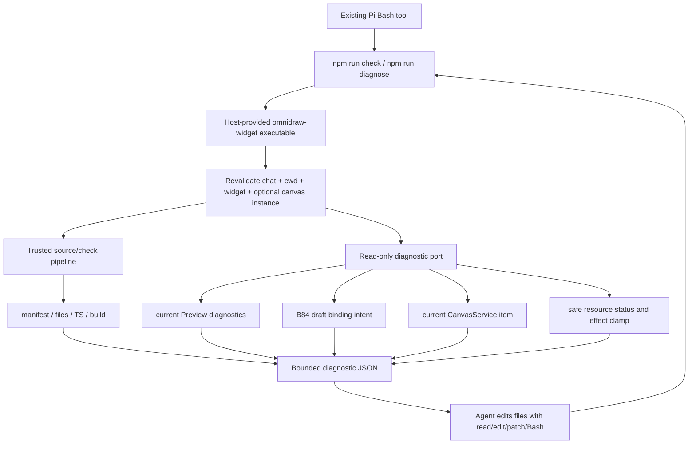

# A118 - widget projects: Bash-driven check and scoped runtime diagnostics
[Overview](../BASED.md)

Give every newly scaffolded widget stable project scripts that the agent can
run with its existing Bash tool to validate source and diagnose Preview/runtime
failures. The commands must identify missing resource bindings, readiness,
permission, build, and guest failures without adding another Pi tool or
exposing concrete resource IDs, secrets, host paths, or unrelated canvas data.

This is implementation order **4 of 5**. It depends on [D10](../d/D10.md) for
safe Bash authoring, [B83](../b/B83.md) for widget/canvas scope, and
[B84](../b/B84.md) for current draft binding intent. Its typed diagnostic
contract is consumed by [A119](A119.md).

## Context

### New widget projects expose only a build script

Both generated templates currently have only `npm run build` in:

- [`templates/plain/package.json.tpl`](../../packages/service-agent/src/tools/templates/plain/package.json.tpl)
- [`templates/react/package.json.tpl`](../../packages/service-agent/src/tools/templates/react/package.json.tpl)

The agent can call `od_widget_validate`, but that is a Pi tool and does not
give the generated project a discoverable repair loop. A normal project-level
`npm run check` / `npm run diagnose` lets the same Bash+edit workflow work for
new widgets without growing the fixed model tool registry.

### Existing failures lose their actionable cause

- [`FunctionService.ts`](../../apps/cli/src/services/FunctionService.ts)
  resolves the current manifest and exact canvas item binding before every
  direct call. It can distinguish missing or incompatible bindings internally.
- [`api.function-error.ts`](../../packages/api/src/function/api.function-error.ts)
  maps `FUNCTION_RESOURCE_UNAVAILABLE` to generic `SERVICE_UNAVAILABLE` with
  “Function execution is temporarily unavailable.”
- [`create-widget-function-host-bridge.ts`](../../packages/ui-ai-chat/src/widget-runtime/create-widget-function-host-bridge.ts)
  then throws a generic “Widget function execution failed.”
- The agent cannot tell whether source code is broken, a DB slot is unbound, a
  resource is provisioning/migrating, the kind is wrong, the requested write
  effect is denied, or the provider actually failed.

Retry is incorrect for a missing binding. Editing TypeScript is also incorrect.
The diagnostic must preserve a safe typed cause through host, API, runtime, and
project command boundaries.

### Validation and runtime diagnosis are different

[`od_widget_validate`](../../packages/service-agent/src/tools/tool.widget-workspace.ts)
uses the trusted host compiler and Preview build check. It proves construction,
not real resource binding or a current canvas instance.

[`od_widget_preview_inspect`](../../packages/service-agent/src/tools/tool.widget-preview-inspect.ts)
mounts an isolated exact artifact with resource-free `artifact_exact` fidelity.
It is intentionally not full visible Preview authority and must not be
silently redefined.

The new commands therefore need explicit modes:

- `check`: deterministic project/source/build validation with no resource
  access;
- `diagnose`: host-backed, read-only, scope-aware status for the current draft
  and optional exact canvas instance.

## Fixed decisions

1. Every new plain and React scaffold includes these scripts:

   ```json
   {
     "scripts": {
       "build": "vite build",
       "check": "omnidraw-widget check .",
       "diagnose": "omnidraw-widget diagnose . --json"
     }
   }
   ```

   Exact build text may differ by template; the command names and meanings are
   fixed.
2. `omnidraw-widget` is a host-provided authoring executable available in AI
   Bash. It is not a new Pi tool and is not downloaded from an arbitrary widget
   dependency.
3. `check` uses the same trusted compiler, SDK declarations, manifest parser,
   file bounds, and Capsule construction rules as host validation. Do not let a
   widget replace the checker by editing `package.json` executable resolution.
4. `diagnose` is read-only. It may read the current manifest, catalog health,
   Preview diagnostics, resource binding metadata, resource lifecycle, and
   safe runtime error codes. It cannot read resource contents, reveal secrets,
   execute writes, publish, mutate canvas bindings, or inspect another chat.
5. Scope is derived and revalidated from the host-issued AI Bash context plus
   canonical working directory. A user-authored path, environment variable, or
   JSON file cannot grant access to another widget/canvas.
6. Concrete resource IDs, secret values, provider credentials, absolute host
   paths, SQL data, arbitrary guest logs, and other widget state never appear
   in diagnostic JSON.
7. The JSON schema is versioned and bounded. Human text can be friendly, but
   `--json` is the stable agent contract.
8. Preserve A116/A117: `od_widget_preview_inspect` remains isolated
   `artifact_exact`. `diagnose` reports full-stack status but does not claim a
   successful visible rendering unless the corresponding full-stack evidence
   actually ran.
9. Existing widgets are not rewritten automatically. New scaffolds get scripts;
   an agent may add the same scripts to an older draft with normal edit/Bash.
10. No new `omnidraw.config` file exists. Diagnostics explain that resource
    requirements belong in `omnidraw.json`, while concrete bindings are
    host/canvas state from B84/A119.

## Diagnostic schema

Use a shared public-safe schema, with exact names finalized during
implementation. Minimum shape:

```json
{
  "schemaVersion": 1,
  "ok": false,
  "scope": {
    "widgetKey": "crm-dashboard",
    "source": "draft",
    "canvas": "current",
    "instance": "current"
  },
  "checks": [
    {
      "phase": "resource-binding",
      "code": "RESOURCE_BINDING_REQUIRED",
      "severity": "error",
      "retryable": false,
      "summary": "Database slot 'crm' is not connected.",
      "slot": "crm",
      "requirement": { "kind": "db", "effect": "read", "required": true },
      "binding": { "connected": false },
      "remediation": { "action": "connect-resource", "target": "crm" }
    }
  ],
  "truncated": false
}
```

Required safe codes:

| Code | Meaning | Retryable | Expected repair |
| --- | --- | --- | --- |
| `MANIFEST_INVALID` | `omnidraw.json` fails strict v1 validation | no | edit manifest |
| `SOURCE_CHECK_FAILED` | trusted TypeScript/build validation failed | no | edit source/config |
| `PREVIEW_BUILD_FAILED` | current draft cannot construct | maybe | inspect bounded build diagnostics |
| `RESOURCE_BINDING_REQUIRED` | required slot has no concrete choice | no | connect exact slot |
| `RESOURCE_NOT_READY` | selected resource is provisioning/migrating/error | status-dependent | wait/open resource/fix provider |
| `RESOURCE_KIND_MISMATCH` | binding kind no longer matches slot | no | reconnect compatible resource |
| `RESOURCE_EFFECT_DENIED` | function needs an effect not granted by manifest/binding/policy | no | narrow code or explicit reconnect/approval |
| `RESOURCE_PROVIDER_FAILED` | provider failed after valid binding | yes only when safe | retry or open resource |
| `FUNCTION_DESCRIPTOR_INVALID` | built function and manifest descriptor disagree | no | edit/rebuild |
| `GUEST_RUNTIME_FAILED` | bounded Capsule/runtime failure | maybe | inspect mapped authored location |
| `SCOPE_AMBIGUOUS` | no exact widget/instance can be selected safely | no | mention/select exact target |
| `DIAGNOSTIC_UNAVAILABLE` | host bridge is unavailable/closed | maybe | reconnect/restart host |

Do not use one generic “service unavailable” code for all resource states.

## Plan



### 1. Add scripts to both construction templates

- Update plain and React package templates with `check` and `diagnose`.
- Preserve the supported `build` output contract (`dist/main.js`).
- Keep the generated lockfile coherent. If no npm dependency is needed because
  the executable is host-injected, prove `npm install` does not contact a
  registry for the diagnostic command.
- Update scaffold tests to assert exact command names and that a fresh plain
  and React widget can run `npm run check` inside the test host.
- Add a short generated README/help output only if it stays small; the system
  prompt is the primary agent guidance.

### 2. Build one host executable over existing services

Use [`apps/widget-debug-tools`](../../apps/widget-debug-tools/) as the
development/test home unless implementation shows a smaller composition edge.
It already exists specifically for local widget debugging. Provide a packaged
entrypoint named `omnidraw-widget` with:

```text
omnidraw-widget check [path] [--json]
omnidraw-widget diagnose [path] --json
omnidraw-widget --help
```

- Parse arguments strictly; reject unknown flags and multiple paths.
- Normalize `.` to the current mounted draft through the host scope; reject
  traversal, symlinks outside the draft, published-folder writes, special
  files, and absolute escape.
- Return exit code `0` only when `ok: true`; use stable nonzero categories for
  invalid input, failed checks, unavailable host, and internal failure.
- Write JSON only to stdout in `--json` mode. Put bounded launcher failures on
  stderr without stack traces or paths.
- Ensure the packaged app/binary makes the executable available, not only a
  workspace development checkout.

### 3. Inject a scoped diagnostic capability into AI Bash

Extend [`AgentBashCapability.ts`](../../apps/cli/src/services/AgentBashCapability.ts)
and the service-agent Bash adapter:

- generate one process/session-scoped diagnostic capability for the current AI
  chat and verified canvas;
- make the executable available through a controlled PATH entry or exact
  launcher, without letting a widget-local binary shadow it;
- associate child process identity with chat ID, current mounted drafts, and
  optional exact instance selected by [A119](A119.md);
- expire capability on command end, chat replacement, cancellation, disconnect,
  or server restart;
- revalidate cwd and requested widget key server-side on every diagnostic
  request;
- rate/size/time bound requests and results;
- never log the capability value. If an environment token is unavoidable,
  treat it as process-local authority, redact it from diagnostics, and prevent
  use outside its chat scope.

The command is a host capability reached through Bash, not evidence that shell
access can manufacture publication or resource authority.

### 4. Implement `check` from the existing trusted validation pipeline

- Reuse the same strict manifest/file/source validation as
  `txValidateWidgetFiles` and the real host Preview build check.
- Keep trusted compiler and SDK resolution host-selected; a widget cannot point
  `check` to a different `tsc`, Vite plugin, or declaration file to obtain a
  false pass.
- Report authored source locations where available, bounded to widget-relative
  paths.
- Never run arbitrary package lifecycle scripts as part of check. Dependency
  installation remains the existing frozen host workflow.
- `check` does not open a resource, execute a function, mutate collaborative
  state, or claim visible Preview success.

### 5. Implement read-only full-stack diagnosis

For the verified target, collect a coherent snapshot of:

- draft/published catalog health and exact manifest digest;
- current validated source/build state;
- B84 binding intent for each manifest slot;
- Preview selected-resource validation and current bounded diagnostics;
- if an exact current canvas item is scoped, its resourceBindings re-read from
  CanvasService and clamped against the current manifest;
- resource lifecycle/kind and allowed effect, projected without identity;
- last safe runtime/function failure code available to the host;
- whether retry can possibly fix the state.

Read checks may execute only operations that are explicitly classified
read-only and already allowed. Do not invoke a widget's arbitrary server
function merely to see what happens. Never acquire/consume a write permit in
diagnostic mode. If proof needs guest mounting, use an isolated bounded mount
and report its actual fidelity.

### 6. Preserve typed failures through API and runtime boundaries

- Define or extend a public-safe diagnostic/error union in the narrowest shared
  package. Reuse [`diagnostic-schema.ts`](../../packages/widget-contract/src/diagnostic-schema.ts)
  when it fits instead of inventing an unrelated envelope.
- Update FunctionService mapping so safe binding/readiness/effect causes survive
  [`api.function-error.ts`](../../packages/api/src/function/api.function-error.ts)
  and the UI host bridge.
- Keep unsafe provider messages and stacks server-side. Public errors carry
  only allowlisted fields and summaries.
- Update existing Preview diagnostic normalization rather than forking another
  source-location mapper.
- If public runtime `src/` in `@omnidraw/widget-contract` changes, apply a
  semantic version bump and regenerate the lockfile as required by repository
  policy.

### 7. Teach the agent the repair loop

Update [`prompt.tools.md`](../../packages/service-agent/src/prompts/prompt.tools.md),
[`prompt.state-and-resources.md`](../../packages/service-agent/src/prompts/prompt.state-and-resources.md),
and prompt snapshot/tests:

1. edit only the mounted widget draft;
2. run `npm run check` after source/manifest changes;
3. run `npm run diagnose` when Preview/runtime/resource behavior fails;
4. use the returned code to decide whether to edit source, edit
   `omnidraw.json`, wait/open a resource, or reconnect a binding;
5. repeat check/diagnose after repair;
6. do not add IDs/secrets to the manifest or create `omnidraw.config`;
7. do not call the resource-free screenshot inspector proof “full Preview.”

The prompt must still say there is no model-callable binding or publish tool.

### 8. Add security, package, and repair-loop tests

Required tests:

1. fresh plain/React scaffolds expose and run both scripts;
2. invalid manifest/source returns stable JSON and nonzero exit;
3. missing DB binding returns `RESOURCE_BINDING_REQUIRED`, `retryable: false`,
   exact safe slot/kind/effect, and no resource ID;
4. provisioning/migrating/error resource states map distinctly;
5. kind mismatch and effect denial map distinctly;
6. valid binding with provider failure is not mislabeled missing;
7. a secret slot never reveals value, name when policy forbids it, or provider
   credentials;
8. traversal, absolute path, symlink, another chat's draft, another canvas item,
   expired capability, and command shadowing all fail closed;
9. cancellation/timeout releases [D10](../d/D10.md)'s Bash lease and diagnostic
   capability;
10. `check` cannot run widget-controlled compiler/lifecycle substitutions;
11. prompt test proves the model is told the exact Bash repair loop;
12. packaged smoke test proves the executable is available outside the monorepo
    checkout.

## Test plan

```sh
bun test packages/service-agent/tests/widget-capsule-scaffold.test.ts packages/service-agent/tests/widget-validate-tool.test.ts
bun test apps/widget-debug-tools/tests
bun test apps/cli/tests/AgentBashCapability.test.ts apps/cli/tests/FunctionService.test.ts apps/cli/tests/WidgetPreviewService.test.ts
bun test packages/api/src/function/contract.test.ts packages/ui-ai-chat/tests/widget-runtime/create-widget-function-host-bridge.test.ts
bun test packages/widget-contract/tests/diagnostic-schema.test.ts
```

Also run the packaged authoring executable smoke test and package typechecks.
Tests use generated temporary drafts and fake resource providers only.

## TODOS

- [ ] Add `check` and `diagnose` scripts to plain and React scaffold templates.
- [ ] Add strict `omnidraw-widget` check/diagnose CLI and packaged entrypoint.
- [ ] Inject a short-lived chat/widget/canvas diagnostic capability into AI Bash.
- [ ] Implement `check` from trusted host validation without arbitrary lifecycle execution.
- [ ] Implement bounded read-only draft/Preview/instance/resource diagnosis.
- [ ] Define the safe versioned diagnostic/error schema and required codes.
- [ ] Preserve safe binding/readiness/effect failures through API and UI runtime bridge.
- [ ] Update the system prompt with the Bash+edit self-repair loop and config ownership rules.
- [ ] Add scaffold, JSON/exit, failure taxonomy, redaction, scope escape, cancellation, shadowing, and packaged smoke tests.
- [ ] Update `docs/internal/llm.widget-system.md`, app debug-tool docs, and `FILES.md`.
- [ ] Apply any required published-package version bump and regenerate the lockfile.
- [ ] Run focused tests, typechecks, functional-core checks, packaged smoke, and affected builds.

## Acceptance criteria

- Every new widget project can run `npm run check` and `npm run diagnose` with
  the existing Bash tool; no new Pi tool is registered.
- `check` and `diagnose` use trusted host logic and cannot be replaced by
  widget-authored executables or config.
- Missing binding, resource readiness, kind mismatch, effect denial, provider
  failure, build failure, and guest failure remain distinct safe codes.
- A missing binding is explicitly non-retryable and recommends connection, not
  blind retry or source edits.
- Diagnostic output is bounded, versioned JSON with widget-relative authored
  locations and no concrete IDs, secrets, credentials, host paths, resource
  data, or unrelated state.
- Scope escape, stale capability, cancellation, timeout, and packaged-runtime
  behavior are covered by automated tests.
- The system prompt accurately describes `omnidraw.json`, host-owned concrete
  bindings, the self-repair commands, and the absence of bind/publish tools.

## Non-goals

- Adding a general shell RPC or arbitrary CanvasService CLI.
- Letting diagnostics mutate bindings, resources, widget state, or publication.
- Replacing A116/A117 screenshot inspection or claiming stronger fidelity.
- Automatically rewriting all existing widget package manifests.
- Exposing internal resource IDs so the model can assemble binding payloads.

## NOTES

- No bitmap mockup is needed. This task's primary user interface is stable
  command/JSON output; the flow diagram and schema example are the useful
  visuals.
- `apps/widget-debug-tools` is the preferred starting point because repository
  guidance explicitly identifies it for local widget debugging. If packaging
  requires a thin CLI-owned launcher, keep the diagnostic logic reusable and
  test it in the debug-tools app.

### LOGS

- 2026-08-10: Created after confirming generated templates expose only
  `build`, Agent Bash has no scoped diagnostic identity, and function binding
  failures collapse to generic service/runtime errors.

---
