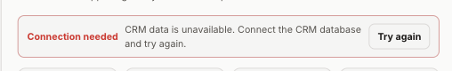
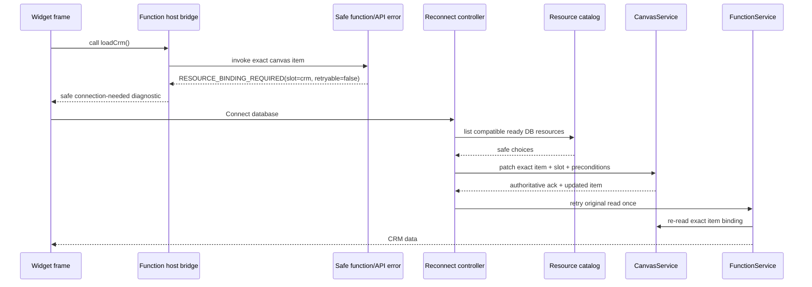

# A119 - canvas widgets: reconnect existing resource bindings and retry safely
[Overview](../BASED.md)

Let a user or a correctly scoped AI chat connect/reconnect one concrete canvas
widget's missing resource slot, then retry the failed read without rebuilding
the frame or losing instance state. Replace the misleading generic “Try again”
path for a missing binding with a typed connection flow that updates only the
target canvas item's host-owned `resourceBindings`.

This is implementation order **5 of 5**. It depends on [D10](../d/D10.md),
[B83](../b/B83.md), [B84](../b/B84.md), and [A118](A118.md). It is the final
integration task for the full chat → manifest → binding → Preview → canvas →
runtime → diagnosis → repair loop.

## Context

### Observed product state

The supplied failure shows a widget that knows CRM data is unavailable but can
offer only a retry:



Retry cannot repair a missing concrete binding. It reruns the same function
against the same canvas item and receives the same failure.

### Existing runtime ownership is close to correct

- [`types.ts`](../../packages/canvas-contract/src/types.ts) stores
  `resourceBindings` in the canvas widget extension alongside `widgetKey` and
  stable instance identity.
- [`CanvasDocumentService.ts`](../../packages/canvas/src/services/CanvasDocumentService.ts)
  applies optimistic scene changes and sends controlled transactions to the
  authoritative CanvasService outbox/ack path.
- [`llm.widget-system.md`](../../docs/internal/llm.widget-system.md) says runtime
  and function calls re-read the canvas item so binding changes apply without a
  frame rebuild.
- [`FunctionService.ts`](../../apps/cli/src/services/FunctionService.ts)
  already re-reads the item before and after catalog resolution and validates
  bindings against the current manifest requirement.
- [`WidgetFilesystemRuntimeCatalog.ts`](../../apps/cli/src/services/WidgetFilesystemRuntimeCatalog.ts)
  rejects missing required selection instead of inventing one.

The durable authority therefore must remain the canvas item. A second binding
table, local widget file, collaborative-state field, or global config would
create conflicting ownership.

### Current reconnect gaps

1. New placement currently omits bindings; [B84](../b/B84.md) fixes that.
2. Existing items retain their old local bindings when a publication adds or
   changes a required slot. This preservation is correct, but there is no
   scoped reconnect transaction/UI for the missing new slot.
3. Function/API/UI errors lose the safe binding cause; [A118](A118.md) restores
   it.
4. The generic button cannot distinguish a non-retryable missing binding from
   a transient provider failure.
5. An AI chat has no safe way to select one concrete instance unless its
   verified canvas/widget context resolves to exactly one item.

### Reproduction to preserve

1. Publish a widget with no resource requirement and place it on a canvas.
2. Edit the draft to add required DB slot `crm` with read effect.
3. Build and publish through the user-controlled action.
4. The existing canvas item keeps state/geometry and has no `crm` binding.
5. The next direct function call reports connection needed.
6. Current UI shows only generic retry; current chat cannot patch the item.

## Fixed decisions

1. CanvasService remains the only durable canvas authority. Concrete binding
   mutation is a controlled patch of one exact canvas item.
2. The target precondition includes current `canvasId`, `elementId`, stable
   widget `instanceId`, and `widgetKey`. A stale/mismatched target fails without
   touching another item.
3. A reconnect changes only the named slot in `resourceBindings`. It preserves
   frame geometry, z-order, widget state identity, other bindings, and unrelated
   extension data.
4. The chosen resource comes from explicit user authority:
   - direct Connect/Rebind picker selection;
   - a B84 resource mention/approved creation plus an exactly scoped chat
     target;
   - never an arbitrary “first compatible resource” from the global catalog.
5. Manifest requirement, resource kind/status, requested effect, policy, and
   current canvas item are revalidated immediately before commit.
6. Stored `allowRead`/`allowWrite` is the narrow intersection of request and
   granted authority. Reconnect cannot escalate a read slot to write.
7. Missing binding is non-retryable. The primary action is **Connect database**
   (or KV/secret). Transient provider errors may show **Try again**.
8. No new Pi binding tool is added. Host reconciliation consumes explicit
   mentions/creation from B84; the agent continues using Bash/edit/diagnose.
9. Secret and write-resource protections remain unchanged. Connecting a secret
   never reveals it; a later protected write still requires its existing
   permit/approval.
10. Existing-instance repair never publishes source. If the needed slot exists
    only in a draft, the intent remains pending until the user publishes and
    the current published manifest requests it.

## User experience

```text
┌──────────────────────────────────────────────────────────────────┐
│ Connection needed                                                │
│ CRM data is unavailable because database slot “crm” is not       │
│ connected for this widget.                                       │
│                                                                  │
│ [Connect database]                                  [Details]    │
└──────────────────────────────────────────────────────────────────┘

Connect database
┌──────────────────────────────────────────────────────────────────┐
│ Slot: crm · Database · Read only                                 │
│                                                                  │
│ ○ CRM Database                                      Ready        │
│ ○ Sales Archive                                     Ready        │
│ ○ CRM Migration                                     Migrating    │
│                                                                  │
│ Only ready databases are selectable. No data is read by this     │
│ connection step.                                     [Cancel]    │
│                                               [Connect database]  │
└──────────────────────────────────────────────────────────────────┘
```

Use the existing Omnidraw dialog/form language from
[`SCREENS.md`](../../docs/internal/screens/SCREENS.md). A generated visual
mockup is unnecessary because the supplied screenshot fixes the error-banner
context and existing resource dialogs fix the product style. Capture the final
implemented state into the screen atlas if the interaction becomes a new
representative state.

## Plan



### 1. Freeze a safe binding remediation contract

Build on [A118](A118.md)'s diagnostic schema. For connection failures, the
public-safe payload must include only:

- allowlisted code;
- retryable flag;
- widget key and safe current-instance marker (not an internal database row);
- manifest slot name;
- required kind/effect/required flag;
- binding state (`missing`, `stale`, `kind-mismatch`, `effect-denied`,
  `resource-not-ready`);
- safe remediation action (`connect-resource`, `reconnect-resource`,
  `open-resource`, `retry`);
- bounded user message.

The client must not receive concrete candidate IDs inside the error. Candidate
identities arrive only from the authorized resource-list/picker flow.

### 2. Preserve errors end to end

- Map internal FunctionService/catalog resource failures to A118's safe union
  in [`api.function-error.ts`](../../packages/api/src/function/api.function-error.ts).
- Update [`create-widget-function-host-bridge.ts`](../../packages/ui-ai-chat/src/widget-runtime/create-widget-function-host-bridge.ts)
  to throw/return a typed safe runtime error rather than flattening every
  failure to one string.
- Ensure guest widget code can display a simple message but cannot receive
  host-only IDs or invoke a generic binding mutation itself.
- Route the typed error to host chrome/reconnect UI even if authored widget code
  handles or replaces its own visual error. The host must retain a recoverable
  connection action.
- Keep provider stacks/messages server-side and reuse A118's source mapping for
  authored-code failures.

### 3. Add one exact-instance binding transaction

Prefer a narrowly typed canvas command/transaction over a generic arbitrary
extension JSON patch. Input should include:

```text
canvasId
elementId
expectedInstanceId
expectedWidgetKey
expectedCanvasRevision or equivalent command precondition
slot
selectedResourceId            # host/API only, never model-visible
requested read/write ceiling
```

Server/host execution:

1. Read the current canvas item from CanvasService.
2. Verify item exists, is the expected widget frame, and all identity
   preconditions match.
3. Load the current healthy published manifest for `widgetKey`.
4. Verify the slot exists and its current kind/effect.
5. Resolve the selected resource and require compatible kind and usable
   lifecycle state.
6. Clamp read/write to manifest, resource capability, and policy.
7. Patch only that slot in the existing resourceBindings map.
8. Commit through the normal authoritative canvas command path.
9. Return the updated safe binding projection and new canvas revision.

On conflict, return current safe state and require the client to reopen the
picker; do not replay a stale selection against a replaced widget.

### 4. Add Connect/Rebind UI to the host widget frame

- Render host-owned connection status/action from the typed diagnostic.
- Label by kind: Connect database, Connect key-value resource, Connect secret
  store; use Reconnect when an incompatible/stale binding exists.
- Open a resource selector filtered to compatible kind and effect. Show safe
  name/status and disable provisioning/migrating/error/deleting candidates.
- Explain read-only versus write authority before commit. Existing protected
  write approval remains a later operation; connection alone does not execute
  a write.
- After authoritative canvas ack, clear the stale error and retry only the
  original safe read once. Never auto-retry an unclear write.
- If ack fails/conflicts, retain the error and show the precise safe reason.
- “Details” may show A118 diagnostic code/slot/remediation; never IDs/secrets.

### 5. Let scoped AI chat use the same host transaction

No model tool is necessary. Add host reconciliation after B84 intent changes:

- Query CanvasService in the verified B83 canvas for items whose widget key
  matches the verified target.
- If the chat is opened/scoped from an exact widget frame, use its verified
  element+instance identity.
- Otherwise apply automatically only when there is exactly one matching item,
  exactly one unresolved compatible slot, and exactly one explicit B84
  selected resource for that slot.
- Treat the user's resource mention or approved creation as explicit selection
  authority; record a safe notification that the exact instance was connected.
- With zero or multiple matches, do not guess. Return `SCOPE_AMBIGUOUS` through
  `npm run diagnose`/safe prompt context and ask the user to select the frame or
  use its Connect action.
- If the slot exists only in the draft, keep the intent pending. On catalog
  publication change, reconcile again against the new published manifest and
  the same exact target preconditions.
- Never apply one chat selection to every instance on a canvas or across
  canvases.

### 6. Remount/retry without losing state

- Because FunctionService re-reads the item, prefer retrying the failed call
  without remounting the whole Capsule.
- If host bridge caching requires refresh, invalidate only binding/runtime
  inputs for the exact frame. Preserve the `instanceId` used by
  WidgetStateService.
- Prove geometry, z-order, local frame UI state, collaborative JSON state, and
  unrelated bindings are byte-for-byte unchanged after reconnect.
- Ensure canvas optimistic state and server ack converge. A server rejection
  rolls back only the binding patch.
- Existing frames following a newly published manifest must enter a deterministic
  connection-needed state rather than crash or disappear.

### 7. Use retry semantics that match the cause

| Cause | Primary action | Automatic retry |
| --- | --- | --- |
| Missing required binding | Connect resource | no |
| Kind/effect mismatch | Reconnect compatible resource | no |
| Resource provisioning/migrating | Open resource / refresh status | no loop |
| Resource provider transient read failure | Try again | one user-triggered read |
| Unclear/failed write | Inspect status; require explicit action | never |
| Source/build/descriptor failure | Open diagnostic / edit draft | no |

Remove “Try again” as the only action when `retryable: false`.

### 8. Add end-to-end traces and regression tests

#### Existing published item after manifest change

1. Place resource-free published widget.
2. Seed collaborative state and non-default geometry/z-order.
3. Publish a draft that adds required read-only DB slot.
4. Invoke function and assert `RESOURCE_BINDING_REQUIRED` reaches host UI.
5. Pick a test DB and commit the exact-instance binding transaction.
6. Assert canvas item only changes resourceBindings and revision metadata.
7. Retry read and receive test rows.
8. Assert state, geometry, instance ID, and unrelated bindings are unchanged.

#### Chat self-repair

1. Open/verify chat on one canvas and mention one widget plus one DB.
2. B83 resolves target; B84 establishes one slot intent.
3. With one exact existing instance, host applies the same binding transaction.
4. `npm run diagnose` changes from `RESOURCE_BINDING_REQUIRED` to `ok`.
5. Runtime read succeeds without a new Pi tool.

#### Ambiguity and safety

- two matching widget instances: no auto-application;
- two compatible resources/slots: no auto-application;
- stale element/instance/widget precondition: reject;
- resource turns migrating between picker and commit: reject safely;
- manifest effect changes between picker and commit: re-clamp/reject;
- secret binding: no plaintext in any payload;
- write function: no automatic retry and normal permit/approval remains;
- server rejection: optimistic binding patch rolls back only itself.

## Test plan

```sh
bun test apps/cli/tests/FunctionService.test.ts apps/cli/tests/WidgetFilesystemRuntimeCatalog.test.ts
bun test packages/api/src/function/contract.test.ts packages/api/src/widget/api.placement-resolve.test.ts
bun test packages/ui-ai-chat/tests/widget-runtime/create-widget-function-host-bridge.test.ts
bun test packages/ui-ai-chat/tests/canvas-extension packages/ui-ai-chat/tests/widget-placement/WidgetPlacementCoordinator.test.ts
bun test packages/canvas
```

Add a service-canvas command test if a new typed patch command is introduced,
plus one cross-package acceptance fixture with fake DB/KV/secret resources.
Do not use real secrets or the developer's database.

## TODOS

- [ ] Finalize the safe binding remediation payload on A118's diagnostic union.
- [ ] Preserve binding/readiness/effect failures through Function API and UI bridge.
- [ ] Add one typed exact-instance resource-binding canvas transaction.
- [ ] Revalidate item, manifest, resource, lifecycle, effect, and policy at commit.
- [ ] Add host-owned Connect/Rebind banner, filtered picker, conflict state, and details.
- [ ] Retry one safe read after authoritative ack; never retry unclear writes.
- [ ] Connect B83/B84 scoped chat intent to the same transaction without a Pi tool.
- [ ] Reconcile pending intent after user-controlled publication when target stays exact.
- [ ] Preserve instance identity, widget state, geometry, z-order, and unrelated bindings.
- [ ] Add republish, manual reconnect, chat self-repair, ambiguity, stale target, lifecycle race, secret, write, rollback, and state-preservation tests.
- [ ] Add the implemented reconnect state to `SCREENS.md` when it becomes representative.
- [ ] Update widget/canvas architecture docs and `FILES.md`.
- [ ] Apply any required public-package version bumps and regenerate the lockfile.
- [ ] Run focused tests, package typechecks, functional-core checks, and affected builds.

## Acceptance criteria

- A missing required resource binding reaches the frame as a typed,
  non-retryable connection error rather than generic service unavailable.
- The primary UI action connects/reconnects the exact slot; generic retry is
  shown only for genuinely retryable failures.
- The canvas command validates exact canvas/element/instance/widget identity and
  mutates only the target slot on one item.
- Resource selection is explicit, kind/effect compatible, lifecycle-ready, and
  clamped to manifest/policy authority.
- A correctly scoped chat can fix one unambiguous existing binding from B84
  intent using Bash/edit/diagnose and host reconciliation, with no new Pi tool.
- Ambiguous widgets, slots, or resources never auto-bind and return actionable
  safe scope diagnostics.
- Reconnect and retry preserve WidgetStateService identity, collaborative state,
  geometry, z-order, other bindings, and publication state.
- Secret plaintext/internal IDs never reach the guest/model/UI diagnostic, and
  writes are never retried automatically.
- The full reproduction and chat self-repair traces pass against controlled test
  resources.

## Non-goals

- A bulk “connect every instance” action.
- Storing concrete bindings in `omnidraw.json`, widget source, collaborative
  state, global config, or a second database table.
- Allowing guest widget JavaScript or the LLM to send arbitrary resource IDs to
  CanvasService.
- Publishing a draft automatically.
- Retrying writes after an ambiguous outcome.
- Replacing the resource management workspaces shown in `SCREENS.md`.

## NOTES

- The supplied screenshot is retained as `A119.png` beside this task and is the
  baseline bug state. It is already a small compressed PNG.
- If the typed canvas transaction changes public/runtime `src/` in versioned
  `@omnidraw/canvas-contract`, `@omnidraw/service-canvas`, or `@omnidraw/canvas`,
  bump affected packages semantically and regenerate the lockfile. Tests/UI/docs
  alone do not require a package version bump.

### LOGS

- 2026-08-10: Created after tracing the screenshot to a plausible missing
  existing-item binding path: placement/Preview callers omit current selection,
  current errors collapse the cause, and no exact-instance reconnect caller is
  present in UI AI Chat.

---
