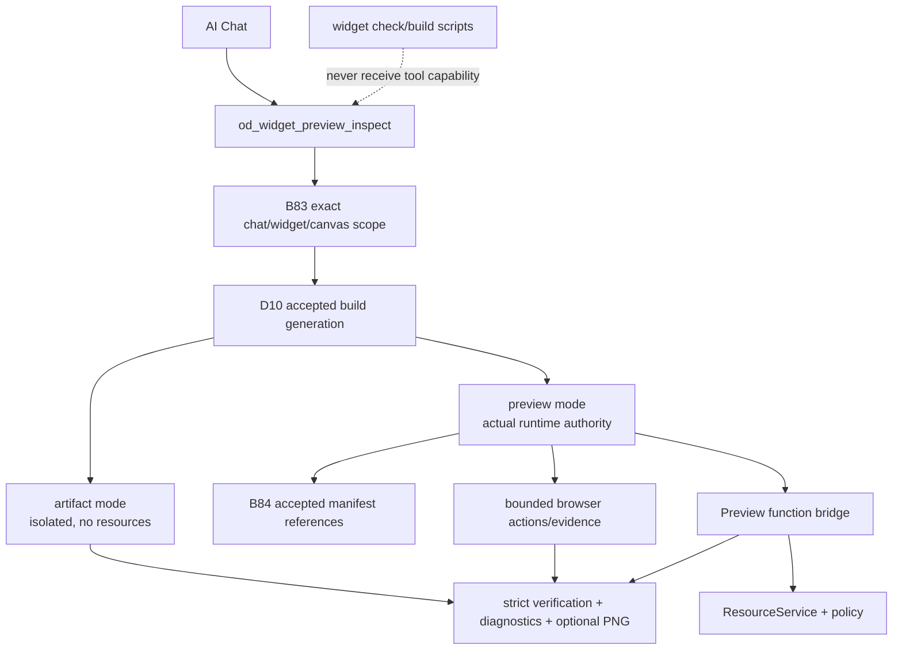

# A119 - AI Chat: inspect accepted builds and the real Preview runtime

[Overview](../BASED.md)

Extend AI Chat's existing `od_widget_preview_inspect` tool so the agent can
diagnose build-import failures, inspect the current accepted Preview generation,
exercise bounded UI actions, observe safe runtime/function/resource failures,
and verify that its app actually works after it edits, checks, and builds.

Reuse and extend:

```ts
export function createWidgetPreviewInspectTool(
  args: TCreateWidgetPreviewInspectToolArgs,
): TToolDefinition
```

Do not add a second overlapping Preview diagnostic Pi tool unless a proven
protocol boundary makes extending the existing tool impossible.

This is implementation order **5 of 5**. It depends on [D10](../d/D10.md) for
accepted build generations, [B83](../b/B83.md) for exact chat/widget/canvas
scope, [B84](../b/B84.md) for manifest-owned resource references, and
[A118](A118.md) for offline project validation.

## Why the existing tool is not enough

The current tool already has valuable capabilities:

- exact draft/artifact identity and digests;
- isolated browser mounting;
- screenshot capture;
- bounded click/input/frame actions;
- DOM/canvas evidence;
- mapped diagnostics;
- cancellation and whole-call timeout;
- strict model-facing protocol validation.

But its current fidelity is deliberately:

```text
source: exact
artifact: exact
runtimePolicy: narrowed
bindings: none
network: denied
overall: artifact_exact
```

That mode can prove artifact construction and isolated UI behavior. It cannot
prove that the actual manifest-bound Preview uses its configured database or
that the user-visible Preview works. A captured error screenshot must not be
summarized as runtime success.

## Required agent workflow

```text
edit source/config
  -> npm run check                  # A118, completely offline
  -> npm run build                  # D10, portable receipt
  -> host accepts exact generation
  -> od_widget_preview_inspect      # this task
  -> inspect/fix/repeat
```

If source changed but no matching build was accepted, the inspection tool must
return **build required** or **build pending/stale**. It must not build files
implicitly and must not inspect the previous generation as if it were current.

## Two explicit evidence modes

Extend the existing input with an explicit bounded surface/mode while preserving
backward compatibility:

### `artifact`

Current isolated behavior:

- exact accepted artifact bytes;
- fresh isolated browser;
- no manifest resource access;
- guest network denied;
- no claim of visible Preview parity;
- useful for construction, layout, DOM, basic interactions, Capsule, and guest
  errors that do not need host resources.

### `preview`

Real Preview diagnostic behavior:

- exact current AI Chat/canvas/widget Preview identity;
- exact host-accepted D10 build generation;
- the same manifest-owned resource references, function descriptors, policies,
  theme, and runtime bridge as the actual Preview;
- bounded actions/evidence/screenshot;
- build/import/Capsule/guest/function/resource diagnostics;
- no resource picker or browser-provided binding identity.

Prefer inspecting the actual current Preview session/generation. If a separate
diagnostic mount is required for safe automation, it must reuse the exact same
accepted artifact, manifest references, host function bridge, policy, and
generation and report that it is a diagnostic clone rather than the visible
frame. Pixel equality must never be implied.

## Fixed decisions

1. Keep one model tool name: `od_widget_preview_inspect`.
2. The tool remains host-scoped. Unlike A118 check/build scripts, it may use
   Omnidraw services because it is an authorized AI Chat capability, not widget
   repository code.
3. Widget scripts and guest code receive no host diagnostic token, socket, API,
   or environment capability.
4. Preview inspection resolves only the exact B83 chat/canvas/widget and one
   current accepted D10 build generation. No global/latest fallback.
5. Source, manifest, or build generation mismatch fails before actions.
6. `artifact` and `preview` fidelity are distinct structured result variants.
   Model text must state exactly which one ran.
7. `preview` mode derives resource identity only from the accepted B84 manifest.
   Tool input cannot contain `resourceId`, `selectedResources`, or bindings.
8. Host revalidates manifest reference, lifecycle, kind, effect, function
   operation, policy, and current generation before each relevant dispatch.
9. Read-only `fx` calls may run when allowed. A diagnostic action that would
   execute a protected/unclear write must use the normal approval path or be
   reported as unverified; inspection never silently grants write authority.
10. Resource creation/schema/data mutation stays in the existing protected
    resource tools, not Preview inspection.
11. A trusted structured capability/function/resource/output failure is
    blocking functional evidence even if its display diagnostic severity is
    warning.
12. Action success alone cannot override a runtime error rendered by the app.
13. Tool results are strict, bounded, ID-safe, and source-mapped. No resource
    ID, secret, credential, SQL data, provider detail, host path, canvas/element
    ID, session ID, token, or raw stack reaches model-visible output.
14. Screenshot output is optional evidence, not the success criterion.
15. Cancellation, timeout, chat replacement, Preview replacement, source edit,
    new build acceptance, and shutdown revoke the inspection generation.
16. Inspection never publishes, edits files, runs build, mutates canvas layout,
    or changes WidgetState outside normal Preview action semantics.

## Result contract

Keep the current strict identity/artifact/screenshot/action/diagnostic evidence
and add an explicit verification projection, for example:

```json
{
  "status": "completed",
  "verification": {
    "surface": "preview",
    "generation": "current",
    "artifact": "exact",
    "manifest": "exact",
    "resources": "manifest_bound",
    "canvasParity": "same_runtime_policy",
    "functional": "observed"
  }
}
```

Allowed functional outcomes should distinguish:

- `observed` — requested bounded behavior completed without blocking runtime
  evidence;
- `not_exercised` — rendering/actions did not invoke the relevant function;
- `not_verified_missing_reference`;
- `blocked_write_approval`;
- `failed`.

Artifact mode must report `resources: none` and `canvasParity: not_claimed`.
Preview diagnostic clones must say `visibleFrame: not_claimed` even when runtime
policy/resource authority is equal.

Minimum safe failure families:

- `BUILD_REQUIRED`;
- `BUILD_PENDING`;
- `BUILD_STALE`;
- `BUILD_IMPORT_FAILED`;
- `PREVIEW_UNAVAILABLE`;
- `PREVIEW_GENERATION_CHANGED`;
- `MANIFEST_INVALID`;
- `RESOURCE_REFERENCE_REQUIRED`;
- `RESOURCE_REFERENCE_STALE`;
- `RESOURCE_NOT_READY`;
- `RESOURCE_KIND_MISMATCH`;
- `RESOURCE_EFFECT_DENIED`;
- `RESOURCE_PROVIDER_FAILED`;
- `FUNCTION_DESCRIPTOR_INVALID`;
- `FUNCTION_INPUT_INVALID`;
- `FUNCTION_OUTPUT_INVALID`;
- `GUEST_RUNTIME_FAILED`;
- existing Capsule/channel/budget/lifecycle/action errors.

## Architecture



## Implementation plan

### 1. Preserve and extend the existing factory

- Keep `createWidgetPreviewInspectTool` and `od_widget_preview_inspect` in the
  fixed tool registry.
- Extend its TypeBox input/result schemas and pure protocol validator rather
  than introducing unvalidated side data.
- Add explicit mode/fidelity defaults so old artifact calls remain safe.
- Keep bounded actions, viewport, settle, timeout, screenshot, and evidence.

### 2. Add exact current Preview scope

- Add a narrow host capability that resolves the exact chat, canvas, widget
  draft, Preview node/session, and accepted build generation.
- Require current active chat/session and current canvas membership.
- Verify the Preview belongs to that widget and generation before/after every
  host await and immediately before browser/function dispatch.
- Multiple Preview candidates fail ambiguous. Never pick newest/first.
- If no current Preview exists, either return actionable `PREVIEW_UNAVAILABLE`
  or create one through the same normal manifest-bound Preview owner, never a
  hidden alternate authority.

### 3. Integrate D10 build state

- Read accepted generation, source dirty state, pending/failed candidate, and
  bounded build diagnostics from D10's observer.
- Allow the caller to provide an expected source/build digest to avoid racing a
  later build.
- Wait only a bounded time for a specific just-emitted receipt; otherwise return
  pending/stale rather than inspecting the old generation.
- Abort inspection when a newer source edit/build generation supersedes it.

### 4. Reuse real Preview runtime composition

- Factor or inject the actual Preview runtime/function/resource composition so
  inspection does not reimplement a weaker policy.
- Resolve resources only from the accepted B84 manifest.
- Preserve host revalidation, write permits/approvals, function schemas,
  Capsule policy, theme, and source maps.
- Do not give the browser or guest raw resource identity.
- If using a diagnostic clone, make all state ownership explicit and clean it
  up in `finally`.

### 5. Make success truthful

- Define pure result classification from actions plus trusted diagnostics.
- Treat all trusted structured capability/function/resource/input/output
  failures as blocking regardless of display severity.
- A screenshot, mounted Capsule, successful unrelated click, or zero browser
  crash cannot alone produce functional success.
- Require explicit observed assertions/actions for claims such as “rows loaded”
  or “form saved.”
- Model-facing copy must say artifact rendered, Preview behavior observed,
  behavior not exercised, or exact failure; never generic “works.”

### 6. Surface actionable authored diagnostics

- Preserve safe widget-relative file/line/column locations through build,
  Capsule, guest, descriptor, and function errors.
- For manifest resource failures, recommend editing `omnidraw.json` or fixing
  the resource. Never recommend Connect/Rebind/picker.
- Keep provider text/stacks and host paths server-side.
- Include enough safe phase/code/retryability for the agent to edit, rebuild,
  and inspect again.

### 7. Update agent workflow prompt

Tell the agent:

1. edit mounted draft files;
2. run `npm run check`;
3. run `npm run build`;
4. wait for host build acceptance;
5. run `od_widget_preview_inspect` in Preview mode with targeted actions;
6. fix source/config based on structured evidence;
7. repeat until observed behavior passes;
8. use artifact mode only for resource-free construction questions;
9. never cite artifact mode as proof of bound Preview behavior;
10. publishing remains user controlled.

## Causal tests

1. Existing artifact mode keeps `bindings/resources: none` and never claims
   visible Preview parity.
2. Source edit without build returns `BUILD_REQUIRED` and performs no browser
   run.
3. Build pending/stale/failed returns the exact safe state and mapped locations.
4. Expected generation is accepted; a superseding edit/build aborts actions and
   cannot return success for the old generation.
5. Exact current Preview mode observes a manifest-bound controlled DB read and
   returns `functional: observed` with no resource ID in output.
6. Missing/stale/not-ready/wrong-kind/effect-denied manifest references remain
   distinct and dispatch nothing.
7. Function input/output/descriptor/provider failures are blocking even when a
   UI action succeeds or display severity is warning.
8. A page rendering its own error text cannot be classified successful.
9. Requested element/text/action assertions pass only against current evidence.
10. Multiple Preview frames, stale chat, replaced canvas node/session, wrong
    widget/generation, or absent Preview fail closed.
11. Read function may execute; protected/unclear write cannot execute without
    normal approval and is never auto-retried.
12. Cancel/timeout/shutdown closes browser/function bridge/session and leaves no
    child, permit, mount, or pending action.
13. Tool protocol rejects injected IDs, extra fields, unsafe locations, forged
    fidelity, excessive evidence, and mismatched PNG metadata.
14. Model-visible output contains no resource/canvas/element/session IDs,
    secrets, resource rows beyond explicitly safe synthetic UI text, host paths,
    provider details, tokens, or stacks.
15. One full repair loop edits a broken widget, offline-checks, builds, waits,
    inspects a failure, fixes, rebuilds, and observes working Preview behavior.

## End-to-end acceptance

Use one isolated home and synthetic resources:

1. AI creates a resource-backed widget and writes the exact B84 manifest ID.
2. It runs offline check and portable build.
3. Host accepts the D10 generation and automatically refreshes Preview.
4. Preview inspection targets that exact generation and verifies visible rows
   through the manifest-bound function path.
5. Introduce a source error, rebuild, and prove inspection reports mapped build
   failure while the old working Preview remains.
6. Fix source, rebuild, and prove current Preview refreshes and inspection passes.
7. Introduce an output-schema/runtime error that renders an error UI; prove the
   tool reports failure rather than “rendered successfully.”
8. Exercise artifact mode and prove its result explicitly does not claim
   resource or visible Preview behavior.
9. Hard reload and prove exact accepted generation/manifest-bound Preview can be
   inspected again without resource selection UI.

Capture the real Preview, the failed diagnostic result, the repaired observed
result, and the artifact-mode fidelity label.

## Test plan

```sh
bun test packages/service-agent/tests/widget-preview-inspect-tool.test.ts
bun test apps/cli/tests/preview-inspection.browser-result.test.ts \
  apps/cli/tests/preview-inspection.browser-job.test.ts \
  apps/cli/tests/WidgetPreviewService.test.ts
bun test apps/widget-debug-tools/tests/a114-preview-inspect-scenario.test.ts
bun run --cwd packages/ui-ai-chat test
bun run build
bun run lint:functional-core
bun run lint:functional-core:agent
bun run generate:files
git diff --check
```

Run full service-agent, CLI, widget-debug-tools, API, UI, and browser acceptance
after focused tests.

## TODOS

- [x] Extend the existing inspect tool with explicit artifact/preview modes.
- [x] Add strict verification/fidelity/result schemas and pure validation.
- [x] Resolve exact current Preview and accepted D10 generation safely.
- [x] Reuse the real B84 manifest-bound Preview runtime/function bridge.
- [x] Add build-required/pending/stale/import diagnostics.
- [x] Make structured runtime/function/resource failures block success.
- [x] Preserve safe authored locations and remediation through tool output.
- [x] Fence cancellation, replacement, supersession, timeout, and shutdown.
- [x] Update AI repair-loop prompts and tool documentation.
- [x] Add causal protocol, generation, runtime, write, redaction, and repair tests.
- [x] Capture real Preview and truthful artifact-mode browser evidence.
- [x] Run focused/full/typecheck/build/lint/browser gates.

## Acceptance criteria

- AI Chat can self-check, build, inspect, fix, rebuild, and verify its widget.
- A118 check remains completely offline; host runtime knowledge lives only in
  this authorized Pi tool.
- The existing tool is extended rather than duplicated without cause.
- Preview mode inspects one exact accepted build and real manifest-bound runtime.
- Artifact mode remains isolated and cannot be mistaken for resource/canvas proof.
- Build/source/Preview generation races fail closed.
- Structured runtime failures cannot coexist with functional success.
- No widget script or guest receives a host diagnostic capability.
- No secret, credential, internal identity, provider detail, host path, or raw
  stack enters model-visible evidence.
- The continuous repair-loop browser trace passes with synthetic data.

## Non-goals

- Giving widget repository scripts access to Omnidraw.
- Replacing the portable A118 check or D10 build command.
- Publishing from the inspection tool.
- A generic browser automation tool for arbitrary canvases/apps.
- Resource selection, Connect/Rebind, or browser-supplied binding IDs.
- Automatic protected writes or replaying ambiguous writes.
- Claiming diagnostic-clone pixels equal the user's visible frame.

## NOTES

- The existing inspection schemas/actions/browser bridge are substantial and
  should be reused. The missing piece is truthful exact Preview/runtime scope,
  not another tool name.
- No standalone mockup is necessary; final real Preview screenshots are required.
- 2026-08-11: Restored A119 as the host-scoped half of the former combined A118
  task. It contains no Connect/Rebind or per-instance binding work.
- 2026-08-11: Extended `od_widget_preview_inspect` with strict artifact/Preview
  verification variants, exact active-session and accepted-generation fences,
  manifest-bound read bridges, safe build/resource/function diagnostics,
  blocking runtime evidence, write-approval refusal, redaction, and complete
  cancellation/replacement/timeout cleanup.
- 2026-08-11: Focused inspection tests, full CLI/service-agent/UI/API suites,
  compiled package smoke, isolated public agent scenario, production build,
  functional lint/typechecks, and Capsule managed-runner/Playwright acceptance
  passed. The screen atlas records real failure, repaired Preview, and
  published hard-reload evidence; artifact mode separately reports no resource
  or visible-frame claim.

---
