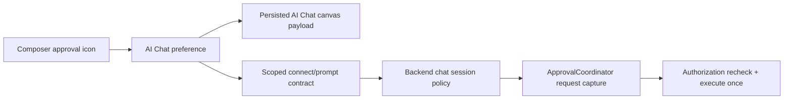

# A120 - AI Chat: per-chat approval policy in the composer
[Overview](../BASED.md)

Move protected-operation approval mode from one backend-wide setting to a
durable preference owned by each AI Chat, and expose it through a compact
composer icon and dropdown beside the existing model controls.

## Context

The current Settings surface presents approval policy as if it belongs to the
open chat, but the backend owns one process-wide `#approvalPolicy` and persists
one `approval-policy.json`. Changing it affects future requests in every chat.

The reusable AI Chat component already has the correct durable per-chat seam:

- [`TAiChatPreference`](../../packages/component-ai-chat/src/contracts.ts)
  stores model and thinking selection without exposing transport types.
- [`canvas-extension.tsx`](../../packages/component-ai-chat/src/canvas-extension.tsx)
  persists that preference in the AI Chat widget's Canvas payload.
- [`ChatComposer.tsx`](../../packages/component-ai-chat/src/chat/components/ChatComposer/ChatComposer.tsx)
  exposes compact model/thinking controls and reports preference changes.
- [`adapters.ts`](../../apps/frontend/src/shell/chat/adapters.ts) translates the
  public component DTOs to private typed RPC.
- [`AgentService.ts`](../../apps/backend/src/shell/agent/AgentService.ts) owns
  chat/session authority and must resolve the captured policy by exact chat
  scope rather than from a singleton field.

This is a clean-cut current-format change. There is no compatibility reader or
migration for old Canvas payloads or the previous global policy file.

## Plan

### 1. Make approval policy a public per-chat preference

- Extend the transport-neutral AI Chat preference and persisted Canvas payload
  with the three existing modes: manual, independent AI review, and always
  approve.
- Keep reviewer model selection with the `ai-review` policy.
- Validate the payload locally and use a safe manual default when creating a
  new AI Chat.
- Persist updates through the existing Canvas document commit path alongside
  model and thinking level.

### 2. Add the composer control

- Add one compact icon button/dropdown in the composer control row, visually
  consistent with the model picker and accessible by keyboard.
- The collapsed state must communicate the current mode through its label,
  tooltip/accessible name, and selected state rather than color alone.
- The dropdown exposes the three modes and reviewer model when applicable.
- Changing the control updates only the open chat and applies to future
  protected requests. An already-created request retains its captured policy.
- Remove the misleading chat-specific policy editor from Settings. If a global
  default remains, label and implement it explicitly as a default for newly
  created chats; do not let it mutate existing chats.

### 3. Establish backend chat-scoped authority

- Replace the singleton policy lookup with policy attached to the exact
  validated chat/session scope.
- Carry or establish the selected policy through the private contract without
  exposing backend or Effect-owned types in the public package.
- Revalidate the reviewer model and current authorization at the backend.
- Clear session-scoped policy on explicit chat retirement while preserving it
  across same-scope reconnect.
- Preserve coordinator capture-at-request-creation, redaction, immutable exact
  arguments, authorization recheck, and execute-once behavior.

### 4. Verify isolation and persistence

- Prove two simultaneous chats can use different policies without interference.
- Prove reload/remount restores each chat's own mode from its Canvas payload.
- Prove new-chat behavior has an explicit safe default and does not inherit a
  sibling chat's selection.
- Prove switching modes affects only future requests in that chat.
- Cover keyboard navigation, accessible labels, compact layout, and the
  reviewer-model unavailable state.
- Update the screen atlas if the accepted composer control materially changes
  the representative AI Chat surface.

## TODOS

- [x] Add approval policy to the public AI Chat preference contract.
- [x] Persist and validate approval policy in the AI Chat Canvas payload.
- [x] Add the composer approval icon and dropdown.
- [x] Remove or explicitly redefine the global Settings selector.
- [x] Make backend approval policy resolution chat-scoped.
- [x] Preserve policy across reconnect and retire it with the chat.
- [x] Add two-chat isolation, reload, new-chat, and capture-time tests.
- [x] Add composer interaction and accessibility tests.
- [x] Update the screen atlas when required.
- [x] Bump `@omnidraw/component-ai-chat` for public/runtime source changes and
  regenerate the lockfile without overwriting unrelated user changes.
- [x] Run affected package, frontend, backend, architecture, packaging, and
  browser tests plus `git diff --check`.

## Acceptance criteria

- Every AI Chat owns and visibly reports its own approval mode.
- Changing one chat never changes another chat.
- Reloading the Canvas restores each chat's approval mode.
- The composer provides an accessible icon/dropdown for all three modes.
- `always-approve` never renders manual controls and still rechecks current
  authorization before exactly-once execution.
- Manual and reviewer fallback requests remain actionable for the owning chat
  only.
- Existing protected requests retain the mode captured when they were created.
- No Effect, private transport, backend, or Canvas implementation type crosses
  the public AI Chat API.

## NOTES

- `@omnidraw/component-ai-chat` owns the portable component DTO and UI;
  `apps/frontend` owns private RPC translation; `apps/backend` owns authority.
- The existing modified root `bun.lock` is user-owned. Reconcile the required
  package-version lock change without discarding unrelated content.

### LOGS

- 2026-08-16: Created from the request for a composer policy control scoped to
  each chat.
- 2026-08-16: Replaced the global policy store and Settings route with exact
  chat/session connect and update payloads; the coordinator now snapshots the
  owning chat's policy when each protected request is created.
- 2026-08-16: Added the compact accessible composer picker, reviewer-model
  handling, Canvas payload validation/persistence, manual New Chat default,
  reconnect recovery, and retirement cleanup. Updated the atlas description
  without changing its existing binary assets.
- 2026-08-16: Added public rendering, Canvas remount, frontend recovery,
  backend isolation/capture, API, architecture, packed-consumer, and live
  browser coverage. Bumped `@omnidraw/component-ai-chat` from `0.7.2` to
  `0.8.0`; only that workspace version line changed in `bun.lock`.
- 2026-08-16: Review correction: reconnect now accepts a normalized persisted
  AI-review policy even when its reviewer has left the current model catalog.
  Explicit reviewer updates remain strictly validated, while review-time
  unavailability falls back to an owning-chat manual approval with the
  original `ai-review` policy provenance.

---
